# Web-个人笔记

*🔗 原文链接： [⁣⁢⁣⁣⁡Web](https://my.feishu.cn/wiki/XjJSwjUl1iRjKHk48ZBcRZqDnlh)*

*⏰ 剪存时间：2026-03-13 17:23:10*

*✂️ 本文档由* [*游侠飞书剪存*](https://pwwjpto7tva.feishu.cn/wiki/space/7517832277555544092) *一键生成*

*💖 更多好物请访问* [*游侠创客*](https://uibot.cn) *微信：xuefuta*

**HTML**

**HTML入门**

**概述**

HTML（超文本标记语言—HyperText Markup Language）是构成 Web 世界的基础，是一种用来告知浏览器如何组织页面的标记语言

超文本 Hypertext，是指连接单个或者多个网站间的网页的链接。通过链接，就能访问互联网中的内容

标记 Markup ，是用来注明文本，图片等内容，以便于在浏览器中显示，例如 \<head\> ， \<body\> 等

**网页的构成**

[HTML](https://developer.mozilla.org/zh-CN/docs/Web/HTML) ：通常用来定义网页内容的含义和基本结构

[CSS](https://developer.mozilla.org/zh-CN/docs/Web/CSS) ：通常用来描述网页的表现与展示效果

[JavaScript](https://developer.mozilla.org/zh-CN/docs/Web/JavaScript) ：通常用来执行网页的功能与行为

参考视频：https://www.bilibili.com/video/BV1Qf4y1T7Hx

**组成**

**标签**

HTML 页面由一系列的 **元素（elements）** 组成，而元素是使用 **标签** 创建的

一对标签（tags）可以设置一段文字样式，添加一张图片或者添加超链接等等

在 HTML 中， \<h1\> 标签表示 **标题** ，我们可以使用 **开始标签** 和 **结束标签** 包围文本内容，这样其中的内容就以标题的形式显示

<table>
<colgroup>
<col style="width: 100%" />
</colgroup>
<tbody>
<tr class="odd">
<td>HTML 
&lt;h1&gt;开始学习JavaWeb&lt;/h1&gt; 
&lt;h2&gt;二级标题&lt;/h2&gt;</td>
</tr>
</tbody>
</table>

**属性**

HTML 标签可以拥有属性

属性是属于标签的，修饰标签，让标签有更多的效果

属性一般定义在起始标签里面

属性一般以 **属性=属性值** 的形式出现

属性值一般用 '' 或者 "" 括起来。 不加引号也是可以的(不建议使用)。比如：name='value'

<table>
<colgroup>
<col style="width: 100%" />
</colgroup>
<tbody>
<tr class="odd">
<td>HTML 
&lt;h1 align="center"&gt;开始学习JavaWeb&lt;/h1&gt;</td>
</tr>
</tbody>
</table>

在 HTML 标签中， align 属性表示 **水平对齐方式** ，我们可以赋值为 center 表示 **居中** 。

**结构**

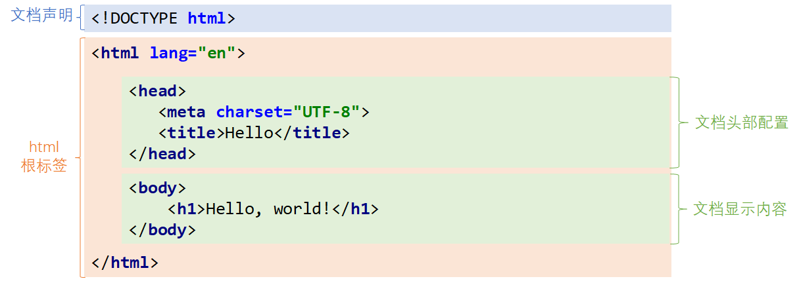

文档结构介绍：

文档声明：用于声明当前 HTML 的版本，这里的 \<!DOCTYPE html\> 是 HTML5 的声明

html 根标签：除文档声明以外，其它内容全部要放在根标签 html 内部

文档头部配置：head 标签，是当前页面的配置信息，外部引入文件, 例如网页标签、字符集等

\<meta charset="utf-8"\> ：这个标签是页面的元数据信息，设置文档使用 utf-8 字符集编码

\<title\> ：这个标签定义文档标题，位置出现在浏览器标签。在收藏页面时，它可用来描述页面

文档显示内容：body 标签，里边的内容会显示到浏览器页面上

**HTML语法**

**注释方式**

将一段 HTML 中的内容置为注释，你需要将其用特殊的记号 包括起来

<table>
<colgroup>
<col style="width: 100%" />
</colgroup>
<tbody>
<tr class="odd">
<td>HTML 
&lt;p&gt;我在注释外！&lt;/p&gt; 
 
&lt;!-- &lt;p&gt;我在注释内！&lt;/p&gt; --&gt;</td>
</tr>
</tbody>
</table>

**基本元素**

**空元素**

一些元素只有一个标签，叫做空元素。它是在开始标签中进行关闭的。

<table>
<colgroup>
<col style="width: 100%" />
</colgroup>
<tbody>
<tr class="odd">
<td>HTML 
第一行文档&lt;br/&gt; 
第二行文档&lt;br/&gt;</td>
</tr>
</tbody>
</table>

**嵌套元素**

把元素放到其它元素之中——这被称作嵌套。

<table>
<colgroup>
<col style="width: 100%" />
</colgroup>
<tbody>
<tr class="odd">
<td>HTML 
&lt;h2&gt;&lt;u&gt;二级标题&lt;/u&gt;&lt;/h2&gt;</td>
</tr>
</tbody>
</table>

**块元素**

在HTML中有两种重要元素类别，块级元素和内联元素

块级元素：

**独占一行** 。块级元素（block）在页面中以块的形式展现。相对于其前面的内容它会出现在新的一行，其后的内容也会被挤到下一行展现。比如 \<p\> ， \<hr\> ， \<li\> ， \<div\> 等。

行内元素

**行内显示** 。行内元素不会导致换行。通常出现在块级元素中并环绕文档内容的一小部分，而不是一整个段落或者一组内容。比如 \<b\> ， \<a\> ， \<i\> ， \<span\> 等。

注意：一个块级元素不会被嵌套进行内元素中，但可以嵌套在其它块级元素中。

常用的两个标签：（ **重要** ）

\<div\> 是一个通用的内容容器，并没有任何特殊语义。它可以被用来对其它元素进行分组，一般用于样式化相关的需求。它是一个 **块级元素** 。

属性：id、style、class

\<span\> 是短语内容的通用行内容器，并没有任何特殊语义。它可以被用来编组元素以达到某种样式。它是一个 **行内元素**

**基本属性**

标签属性，主要用于拓展标签。属性包含元素的额外信息，这些信息不会出现在实际的内容中。但是可以改变标签的一些行为或者提供数据，属性总是以 name = value" 的格式展现。

属性名：同一个标签中，属性名不得重复。

大小写：属性和属性值对大小写不敏感。不过W3C标准中，推荐使用小写的属性/属性值。

引号：双引号是最常用的，不过使用单引号也没有问题。

常用属性：

|        |                                                    |
|--------|----------------------------------------------------|
| 属性名 | 作用                                               |
| class  | 定义元素类名，用来选择和访问特定的元素             |
| id     | 定义元素 **唯一** 标识符，在整个文档中必须是唯一的 |
| name   | 定义元素名称，可以用于提交服务器的表单字段         |
| value  | 定义在元素内显示的默认值                           |
| style  | 定义CSS样式，这些样式会覆盖之前设置的样式          |

**特殊字符**

在HTML中，字符 \< , \> , " , ' 和 & 是特殊字符

|          |              |
|----------|--------------|
| 原义字符 | 等价字符引用 |
| \<       | &lt;         |
| \>       | &gt;         |
| "        | &quot;       |
| '        | &apos;       |
| &        | &amp;        |
| 空格     | &nbsp;       |

**文本标签**

使用文本内容标签设置文字基本样式

|        |                                                                                                 |
|--------|-------------------------------------------------------------------------------------------------|
| 标签名 | 作用                                                                                            |
| p      | 表示文本的一个段落                                                                              |
| h      | 表示文档标题， \<h1\>–\<h6\> ，呈现了六个不同的级别的标题， \<h1\> 级别最高，而 \<h6\> 级别最低 |
| hr     | 表示段落级元素之间的主题转换，一般显示为水平线                                                  |
| li     | 表示列表里的条目。（常用在ul ol 中）                                                            |
| ul     | 表示一个无序列表，可含多个元素，无编号显示。                                                    |
| ol     | 表示一个有序列表，通常渲染为有带编号的列表                                                      |
| em     | 表示文本着重，一般用斜体显示                                                                    |
| strong | 表示文本重要，一般用粗体显示                                                                    |
| font   | 表示字体，可以设置样式（已过时）                                                                |
| i      | 表示斜体                                                                                        |
| b      | 表示加粗文本                                                                                    |

<table>
<colgroup>
<col style="width: 100%" />
</colgroup>
<tbody>
<tr class="odd">
<td>HTML 
&lt;!DOCTYPE html&gt; 
&lt;html lang="en"&gt; 
&lt;head&gt; 
&lt;meta charset="UTF-8"&gt; 
&lt;title&gt;文本标签演示&lt;/title&gt; 
&lt;/head&gt; 
&lt;body&gt; 
&lt;!--段落标签：&lt;p&gt;--&gt; 
&lt;p&gt;这些年&lt;/p&gt; 
&lt;p&gt;支付宝的诞生就是为了解决淘宝网的客户们的买卖问题&lt;/p&gt; 
 
&lt;!-- 标题标签：&lt;h1&gt; ~ &lt;h6&gt; --&gt; 
&lt;h1&gt;一级标题&lt;/h1&gt; 
&lt;h2&gt;二级标题&lt;/h2&gt; 
&lt;h3&gt;三级标题&lt;/h3&gt; 
&lt;h4&gt;四级标题&lt;/h4&gt; 
&lt;h5&gt;五级标题&lt;/h5&gt; 
&lt;h6&gt;六级标题&lt;/h6&gt; 
 
&lt;!--水平线标签：&lt;hr/&gt; 
属性： 
size-大小 
color-颜色 
--&gt; 
&lt;hr size="4" color="red"/&gt; 
 
&lt;!-- 
无序列表：&lt;ul&gt; 
属性：type-列表样式(disc实心圆、circle空心圆、square实心方块) 
列表项：&lt;li&gt; 
--&gt; 
&lt;ul type="circle"&gt; 
&lt;li&gt;javaEE&lt;/li&gt; 
&lt;li&gt;HTML&lt;/li&gt; 
&lt;/ul&gt; 
 
&lt;!-- 
有序列表：&lt;ol&gt; 
属性：type-列表样式(1数字、A或a字母、I或i罗马字符) start-起始位置 
列表项：&lt;li&gt; 
--&gt; 
&lt;ol type="1" start="10"&gt; 
&lt;li&gt;传智播客&lt;/li&gt; 
&lt;li&gt;黑马程序员&lt;/li&gt; 
&lt;/ol&gt; 
 
&lt;!-- 
斜体标签：&lt;i&gt; &lt;em&gt; 
--&gt; 
&lt;i&gt;我倾斜了&lt;/i&gt; 
&lt;em&gt;我倾斜了&lt;/em&gt; 
&lt;br/&gt; 
 
&lt;!-- 
加粗标签：&lt;strong&gt; &lt;b&gt; 
--&gt; 
&lt;strong&gt;加粗文本&lt;/strong&gt; 
&lt;b&gt;加粗文本&lt;/b&gt; 
&lt;br/&gt; 
&lt;!-- 
文字标签：&lt;font&gt; 
属性： 
size-大小 
color-颜色 
--&gt; 
&lt;font size="5" color="yellow"&gt;这是一段文字&lt;/font&gt; 
&lt;/body&gt; 
&lt;/html&gt;</td>
</tr>
</tbody>
</table>

**效果如下** ：

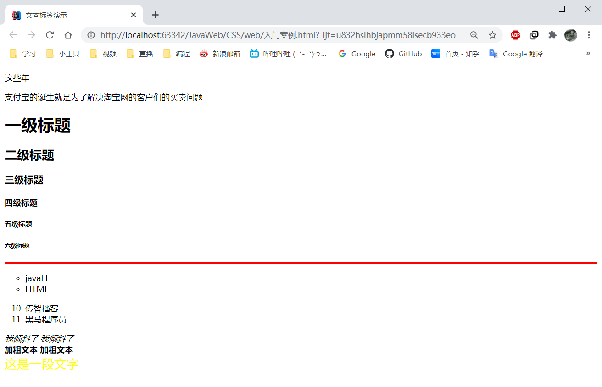

**图片标签**

img标签中的img其实是英文image的缩写, img标签的作用, 就是告诉浏览器我们需要显示一张图片

<table>
<colgroup>
<col style="width: 100%" />
</colgroup>
<tbody>
<tr class="odd">
<td>HTML 
&lt;img src="../img/b.jpg" width="400px" height="200px" alt="" title=""/&gt;</td>
</tr>
</tbody>
</table>

|            |                                    |
|------------|------------------------------------|
| 属性名     | 作用                               |
| **src**    | 图片路径                           |
| **title**  | 鼠标悬停（hover）时显示文本。      |
| **alt**    | 图片描述，图形不显示时的替换文本。 |
| **height** | 图像的高度。                       |
| **width**  | 图像的宽度。                       |

**超链接**

超链接标签的作用: 就是用于控制页面与页面(服务器资源)之间跳转的

<table>
<colgroup>
<col style="width: 100%" />
</colgroup>
<tbody>
<tr class="odd">
<td>HTML 
&lt;a href="指定需要跳转的目标路径" target="打开的方式"&gt;需要展现给用户的内容&lt;/a&gt; 
target属性取值: 
_blank：新起页面 
_self：当前页面（默认）</td>
</tr>
</tbody>
</table>

<table>
<colgroup>
<col style="width: 100%" />
</colgroup>
<tbody>
<tr class="odd">
<td>HTML 
&lt;!DOCTYPE html&gt; 
&lt;html lang="en"&gt; 
&lt;head&gt; 
&lt;meta charset="UTF-8"&gt; 
&lt;title&gt;超链接标签演示&lt;/title&gt; 
&lt;style&gt; 
a{ 
/*去掉超链接的下划线*/ 
text-decoration: none; 
/*超链接的颜色*/ 
color: black; 
} 
 
/*鼠标悬浮的样式控制*/ 
a:hover{ 
color: red; 
} 
&lt;/style&gt; 
&lt;/head&gt; 
&lt;body&gt; 
&lt;!-- 
超链接标签：&lt;a&gt; 
属性： 
href-跳转的地址 
target-跳转的方式(_self当前页面、_blank新标签页) 
--&gt; 
&lt;a href="01案例二：样式演示.html" target="_blank"&gt;点我跳转到样式演示&lt;/a&gt; &lt;br/&gt; 
&lt;a href="http://www.itcast.cn" target="_blank"&gt;传智播客&lt;/a&gt; &lt;br/&gt; 
&lt;a href="http://www.itheima.com" target="_self"&gt;黑马程序员&lt;/a&gt; &lt;br/&gt; 
&lt;a href="http://www.itheima.com" target="_blank"&gt;&lt;img src="../img/itheima.png" width="150px" height="50px"/&gt;&lt;/a&gt; 
&lt;/body&gt; 
&lt;/html&gt;</td>
</tr>
</tbody>
</table>

效果图：

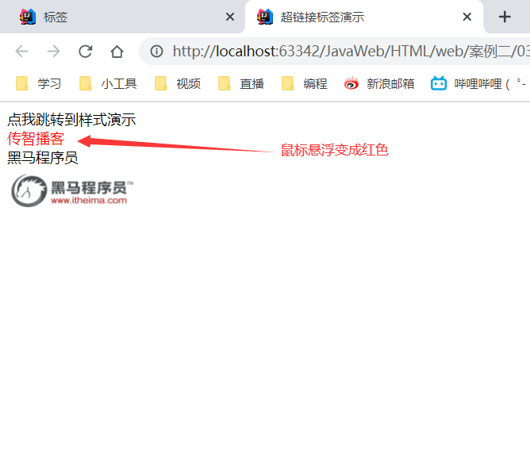

**表单标签**

**基本介绍**

**form** 表示表单，是用来 **收集用户输入信息并向 Web 服务器提交** 的一个容器

<table>
<colgroup>
<col style="width: 100%" />
</colgroup>
<tbody>
<tr class="odd">
<td>HTML 
&lt;form &gt; 
//表单元素 
&lt;/form&gt;</td>
</tr>
</tbody>
</table>

|              |                                                                 |
|--------------|-----------------------------------------------------------------|
| 属性名       | 作用                                                            |
| action       | 处理此表单信息的Web服务器的URL地址                              |
| method       | 提交此表单信息到Web服务器的方式，可能的值有get和post，默认为get |
| autocomplete | 自动补全，指示表单元素是否能够拥有一个默认值，配合input标签使用 |

get与post区别：

post：指的是 HTTP [POST 方法](http://www.w3.org/Protocols/rfc2616/rfc2616-sec9.html#sec9.5) ；表单数据会包含在表单体内然后发送给服务器。

get：指的是 HTTP [GET 方法](http://www.w3.org/Protocols/rfc2616/rfc2616-sec9.html#sec9.3) ；表单数据会附加在 action 属性的URI中，并以 '?' 作为分隔符，然后这样得到的 URI 再发送给服务器。

|      |            |          |                        |
|------|------------|----------|------------------------|
|      | 地址栏可见 | 数据安全 | 数据大小               |
| GET  | 可见       | 不安全   | 有限制（取决于浏览器） |
| POST | 不可见     | 相对安全 | 无限制                 |

**表单元素**

|          |                                                    |                                 |
|----------|----------------------------------------------------|---------------------------------|
| 标签名   | 作用                                               | 备注                            |
| label    | 表单元素的说明，配合表单元素使用                   | for属性值为相关表单元素id属性值 |
| input    | 表单中输入控件，多种输入类型，用于接受来自用户数据 | type属性值决定输入类型          |
| button   | 页面中可点击的按钮，可以配合表单进行提交           | type属性值决定按钮类型          |
| select   | 表单的控件，下拉选项菜单                           | 与option配合实用                |
| optgroup | option的分组标签                                   | 与option配合实用                |
| option   | select的子标签，表示一个选项                       |                                 |
| textarea | 表示多行纯文本编辑控件                             |                                 |
| fieldset | 用来对表单中的控制元素进行分组(也包括 label 元素)  |                                 |
| legend   | 用于表示它的fieldset内容的标题。                   | fieldset 的子元素               |

**按键控件**

button标签：表示按钮

type属性：表示按钮类型，submit值为提交按钮。

|        |                                                  |                             |
|--------|--------------------------------------------------|-----------------------------|
| 属性值 | 作用                                             | 备注                        |
| button | 无行为按钮，用于结合JavaScript实现自定义动态效果 | 同 \<input type="submit"/\> |
| submit | 提交按钮，用于提交表单数据到服务器。             | 同 \<input type="submit"/\> |
| reset  | 重置按钮，用于将表单中内容恢复为默认值。         | 同 \<input type="reset" /\> |

**输入控件**

**基本介绍**

label标签：表单的说明。

for属性值：匹配input标签的id属性值

input标签：输入控件。

属性：

type：表示输入类型，text值为普通文本框

id：表示标签唯一标识

name：表示标签名称，提交服务器的标识

value：表示标签的默认数据值

placeholder：默认的提示信息，仅适用于当type 属性为text, search, tel, url or email时;

required：是否必须为该元素填充值，当type属性是hidden,image或者button类型时不可使用

readonly：是否只读,可以让用户不修改这个输入框的值,就使用value属性设置默认值

disabled：是否可用,如果某个输入框有disabled那么它的数据不能提交到服务器通常是使用在有的页面中，让一些按钮不能点击

autocomplete：自动补全，规定表单或输入字段是否应该自动完成。当自动完成开启，浏览器会基于用户之前的输入值自动填写值。可以设置指定的字段为off，关闭自动补全

<table>
<colgroup>
<col style="width: 100%" />
</colgroup>
<tbody>
<tr class="odd">
<td>HTML 
&lt;body&gt; 
&lt;form action="#" method="get" autocomplete="off"&gt; 
&lt;label for="username"&gt;用户名：&lt;/label&gt; 
&lt;input type="text" id="username" name="username" value="" placeholder=" 请在此处输入用户名" required/&gt; 
&lt;button type="submit"&gt;提交&lt;/button&gt; 
&lt;button type="reset"&gt;重置&lt;/button&gt; 
&lt;button type="button"&gt;按钮&lt;/button&gt; 
&lt;/form&gt; 
&lt;/body&gt; 
&lt;/html&gt;</td>
</tr>
</tbody>
</table>

效果图：

用户名： 提交 重置 按钮

**n-v属性**

|           |                                                                             |
|-----------|-----------------------------------------------------------------------------|
| 属性名    | 作用                                                                        |
| **name**  | \<input\> 的名字，在提交整个表单数据时，可以用于区分属于不同 \<input\> 的值 |
| **value** | 这个 \<input\> 元素当前的值，允许用户通过页面输入                           |

使用方式：以name属性值作为键，value属性值作为值，构成键值对提交到服务器，多个键值对浏览器使用 & 进行分隔。

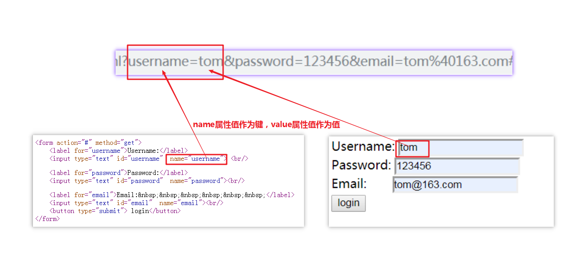

**type属性**

|                |                                                                                                                                                                                                                                 |                                                               |
|----------------|---------------------------------------------------------------------------------------------------------------------------------------------------------------------------------------------------------------------------------|---------------------------------------------------------------|
| 属性值         | 作用                                                                                                                                                                                                                            | 备注                                                          |
| text           | 单行文本字段                                                                                                                                                                                                                    |                                                               |
| password       | 单行文本字段，值被遮盖                                                                                                                                                                                                          |                                                               |
| email          | 用于编辑 e-mail 的字段，可以对e-mail地址进行简单校验                                                                                                                                                                            |                                                               |
| radio          | 单选按钮。 1. 在同一个”单选按钮组“中，所有单选按钮的 name 属性使用同一个值；一个单选按钮组中是，同一时间只有一个单选按钮可以被选择。 2. 必须使用 value 属性定义此控件被提交时的值。 3. 使用checked 必须指示控件是否缺省被选择。 |                                                               |
| checkbox       | 复选框。 1. 必须使用 value 属性定义此控件被提交时的值。 2. 使用 checked 属性指示控件是否被选择。 3. 选中多个值时，所有的值会构成一个数组而提交到Web服务器                                                                       |                                                               |
| date           | HTML5 用于输入日期的控件                                                                                                                                                                                                        | 年，月，日，不包括时间                                        |
| time           | HTML5 用于输入时间的控件                                                                                                                                                                                                        | 不含时区                                                      |
| datetime-local | HTML5 用于输入日期时间的控件                                                                                                                                                                                                    | 不包含时区                                                    |
| number         | HTML5 用于输入浮点数的控件                                                                                                                                                                                                      |                                                               |
| range          | HTML5 用于输入不精确值控件                                                                                                                                                                                                      | max-规定最大值min-规定最小值 step-规定步进值 value-规定默认值 |
| search         | HTML5 用于输入搜索字符串的单行文本字段                                                                                                                                                                                          | 可以点击 x 清除内容                                           |
| tel            | HTML5 用于输入电话号码的控件                                                                                                                                                                                                    |                                                               |
| url            | HTML5 用于编辑URL的字段                                                                                                                                                                                                         | 可以校验URL地址格式                                           |
| file           | 此控件可以让用户选择文件，用于文件上传。                                                                                                                                                                                        | 使用 accept 属性可以定义控件可以选择的文件类型。              |
| hidden         | 此控件用户在页面上不可见，但它的值会被提交到服务器，用于传递隐藏值                                                                                                                                                              |                                                               |

<table>
<colgroup>
<col style="width: 100%" />
</colgroup>
<tbody>
<tr class="odd">
<td>HTML 
&lt;!DOCTYPE html&gt; 
&lt;html lang="en"&gt; 
&lt;head&gt; 
&lt;meta charset="UTF-8"&gt; 
&lt;title&gt;type属性演示&lt;/title&gt; 
&lt;/head&gt; 
&lt;body&gt; 
&lt;form action="#" method="get" autocomplete="off"&gt; 
&lt;label for="username"&gt;用户名：&lt;/label&gt; 
&lt;input type="text" id="username" name="username"/&gt; &lt;br/&gt; 
 
&lt;label for="password"&gt;密码：&lt;/label&gt; 
&lt;input type="password" id="password" name="password"/&gt; &lt;br/&gt; 
 
&lt;label for="email"&gt;邮箱：&lt;/label&gt; 
&lt;input type="email" id="email" name="email"/&gt; &lt;br/&gt; 
 
&lt;label for="gender"&gt;性别：&lt;/label&gt; 
&lt;input type="radio" id="gender" name="gender" value="men"/&gt;男 
&lt;input type="radio" name="gender" value="women"/&gt;女 
&lt;input type="radio" name="gender" value="other"/&gt;其他&lt;br/&gt; 
 
&lt;label for="hobby"&gt;爱好：&lt;/label&gt; 
&lt;input type="checkbox" id="hobby" name="hobby" value="music" checked/&gt;音乐 
&lt;input type="checkbox" name="hobby" value="game"/&gt;游戏 &lt;br/&gt; 
 
&lt;label for="birthday"&gt;生日：&lt;/label&gt; 
&lt;input type="date" id="birthday" name="birthday"/&gt; &lt;br/&gt; 
 
&lt;label for="time"&gt;当前时间：&lt;/label&gt; 
&lt;input type="time" id="time" name="time"/&gt; &lt;br/&gt; 
 
&lt;label for="insert"&gt;注册时间：&lt;/label&gt; 
&lt;input type="datetime-local" id="insert" name="insert"/&gt; &lt;br/&gt; 
 
&lt;label for="age"&gt;年龄：&lt;/label&gt; 
&lt;input type="number" id="age" name="age"/&gt; &lt;br/&gt; 
 
&lt;label for="range"&gt;心情值(1~10)：&lt;/label&gt; 
&lt;input type="range" id="range" name="range" min="1" max="10" step="1"/&gt; &lt;br/&gt; 
 
&lt;label for="search"&gt;可全部清除文本：&lt;/label&gt; 
&lt;input type="search" id="search" name="search"/&gt; &lt;br/&gt; 
 
&lt;label for="tel"&gt;电话：&lt;/label&gt; 
&lt;input type="tel" id="tel" name="tel"/&gt; &lt;br/&gt; 
 
&lt;label for="url"&gt;个人网站：&lt;/label&gt; 
&lt;input type="url" id="url" name="url"/&gt; &lt;br/&gt; 
 
&lt;label for="file"&gt;文件上传：&lt;/label&gt; 
&lt;input type="file" id="file" name="file"/&gt; &lt;br/&gt; 
 
&lt;label for="hidden"&gt;隐藏信息：&lt;/label&gt; 
&lt;input type="hidden" id="hidden" name="hidden" value="itheima"/&gt; &lt;br/&gt; 
 
&lt;button type="submit"&gt;提交&lt;/button&gt; 
&lt;button type="reset"&gt;重置&lt;/button&gt; 
&lt;/form&gt; 
&lt;/body&gt; 
&lt;/html&gt;</td>
</tr>
</tbody>
</table>

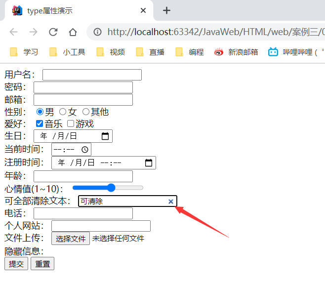

**选择控件**

下拉列表标签：

<table>
<colgroup>
<col style="width: 100%" />
</colgroup>
<tbody>
<tr class="odd">
<td>HTML 
&lt;select name=""&gt; 
&lt;option value=""&gt;显示的内容&lt;/option&gt; 
&lt;/select&gt;</td>
</tr>
</tbody>
</table>

option：选择菜单的选项

optgroup：列表项分组标签 属性：label设置分组名称

**文本域控件**

<table>
<colgroup>
<col style="width: 100%" />
</colgroup>
<tbody>
<tr class="odd">
<td>HTML 
&lt;textarea name="textarea" rows="10" cols="50"&gt;Write something here&lt;/textarea&gt;</td>
</tr>
</tbody>
</table>

属性：

name-标签名称

rows-行数

cols-列数

<table>
<colgroup>
<col style="width: 100%" />
</colgroup>
<tbody>
<tr class="odd">
<td>HTML 
&lt;body&gt; 
&lt;form action="#" method="get" autocomplete="off"&gt; 
所在城市：&lt;select name="city"&gt; 
&lt;option&gt;---请选择城市---&lt;/option&gt; 
&lt;optgroup label="直辖市"&gt; 
&lt;option&gt;北京&lt;/option&gt; 
&lt;option&gt;上海&lt;/option&gt; 
&lt;/optgroup&gt; 
&lt;optgroup label="省会市"&gt; 
&lt;option&gt;杭州&lt;/option&gt; 
&lt;option&gt;武汉&lt;/option&gt; 
&lt;/optgroup&gt; 
&lt;/select&gt; 
&lt;br/&gt; 
个人介绍：&lt;textarea name="desc" rows="5" cols="20"&gt;&lt;/textarea&gt; 
&lt;/form&gt; 
&lt;/body&gt;</td>
</tr>
</tbody>
</table>

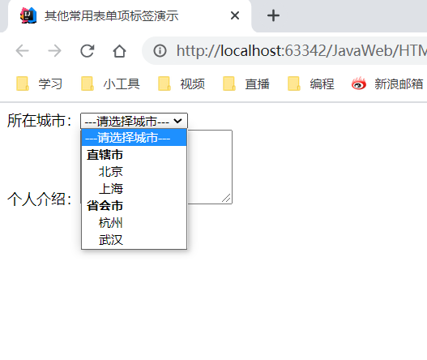

**分组控件**

<table>
<colgroup>
<col style="width: 100%" />
</colgroup>
<tbody>
<tr class="odd">
<td>HTML 
&lt;form action="#" method="post"&gt; 
&lt;fieldset&gt; 
&lt;legend&gt;是否同意&lt;/legend&gt; 
&lt;input type="radio" id="radio_y" name="agree" value="y"&gt; 
&lt;label for="radio_y"&gt;同意&lt;/label&gt; 
&lt;input type="radio" id="radio_n" name="agree" value="n"&gt; 
&lt;label for="radio_n"&gt;不同意&lt;/label&gt; 
&lt;/fieldset&gt; 
&lt;/form&gt;</td>
</tr>
</tbody>
</table>

是否同意 同意 不同意

**表格标签**

**基本属性**

\<table\> , 表示表格标签，表格是数据单元的行和列的两维表

tr：table row，表示表中单元的行

td：table data，表示表中一个单元格

th：table header，表格单元格的表头，通常字体样式加粗居中

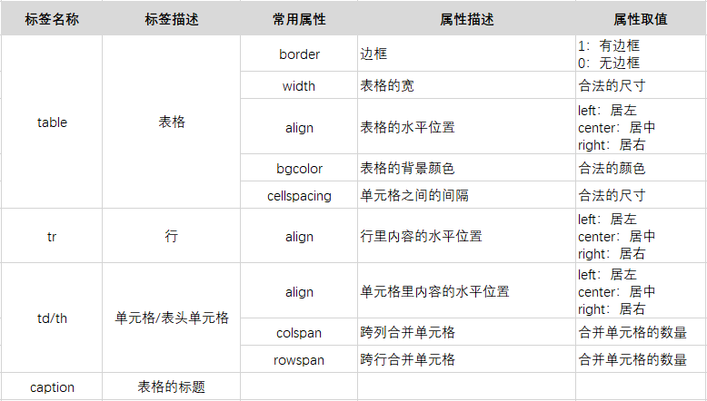

代码展示：

<table>
<colgroup>
<col style="width: 100%" />
</colgroup>
<tbody>
<tr class="odd">
<td>HTML 
&lt;table&gt; 
&lt;tr&gt; 
&lt;th&gt;First name&lt;/th&gt; 
&lt;th&gt;Last name&lt;/th&gt; 
&lt;/tr&gt; 
&lt;tr&gt; 
&lt;td&gt;John&lt;/td&gt; 
&lt;td&gt;Doe&lt;/td&gt; 
&lt;/tr&gt; 
&lt;tr&gt; 
&lt;td&gt;Jane&lt;/td&gt; 
&lt;td&gt;Doe&lt;/td&gt; 
&lt;/tr&gt; 
&lt;/table&gt;</td>
</tr>
</tbody>
</table>

效果图：

|            |           |
|------------|-----------|
| First name | Last name |
| John       | Doe       |
| Jane       | Doe       |

**跨行跨列**

<table>
<colgroup>
<col style="width: 100%" />
</colgroup>
<tbody>
<tr class="odd">
<td>HTML 
&lt;table width="400px" border="1px" align="center"&gt; 
&lt;thead&gt; 
&lt;tr&gt; 
&lt;th&gt;姓名&lt;/th&gt; 
&lt;th&gt;性别&lt;/th&gt; 
&lt;th&gt;年龄&lt;/th&gt; 
&lt;th&gt;数学&lt;/th&gt; 
&lt;th&gt;语文&lt;/th&gt; 
&lt;/tr&gt; 
&lt;/thead&gt; 
 
&lt;tbody&gt; 
&lt;tr align="center"&gt; 
&lt;td&gt;张三&lt;/td&gt; 
&lt;td rowspan="2"&gt;男&lt;/td&gt; 
&lt;td&gt;23&lt;/td&gt; 
&lt;td colspan="2"&gt;90&lt;/td&gt; 
&lt;!--&lt;td&gt;90&lt;/td&gt;--&gt; 
&lt;/tr&gt; 
 
&lt;tr align="center"&gt; 
&lt;td&gt;李四&lt;/td&gt; 
&lt;!--&lt;td&gt;男&lt;/td&gt;--&gt; 
&lt;td&gt;24&lt;/td&gt; 
&lt;td&gt;95&lt;/td&gt; 
&lt;td&gt;98&lt;/td&gt; 
&lt;/tr&gt; 
&lt;/tbody&gt; 
 
&lt;tfoot&gt; 
&lt;tr&gt; 
&lt;td colspan="4"&gt;总分数：&lt;/td&gt; 
&lt;td&gt;373&lt;/td&gt; 
&lt;/tr&gt; 
&lt;/tfoot&gt; 
&lt;/table&gt;</td>
</tr>
</tbody>
</table>

效果图：

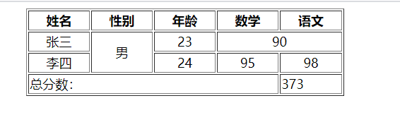

**表格结构**

|        |                      |                            |
|--------|----------------------|----------------------------|
| 标签名 | 作用                 | 备注                       |
| thead  | 定义表格的列头的行   | 一个表格中仅有一个         |
| tbody  | 定义表格的主体       | 用来封装一组表行（tr元素） |
| tfoot  | 定义表格的各列汇总行 | 一个表格中仅有一个         |

**样式布局**

**基本格式**

在head标签中，通过style标签加入样式。

基本格式：可以含有多个属性，一个属性名也可以含有多个值，同时设置多样式。

<table>
<colgroup>
<col style="width: 100%" />
</colgroup>
<tbody>
<tr class="odd">
<td>HTML 
&lt;style&gt; 
标签名{ 
属性名1:属性值1; 
属性名2:属性值2; 
属性名:属性值1 属性值2 属性值3; 
} 
&lt;/style&gt;</td>
</tr>
</tbody>
</table>

**背景格式**

background属性用来设置背景相关的样式。

背景色 \[ background-color \]属性定义任何元素的背景色

<table>
<colgroup>
<col style="width: 100%" />
</colgroup>
<tbody>
<tr class="odd">
<td>CSS 
body { 
background-color: #567895; 
}</td>
</tr>
</tbody>
</table>

背景图 该\[ background-image \]属性允许在元素的背景中显示图像。使用url函数指定图片路径

<table>
<colgroup>
<col style="width: 100%" />
</colgroup>
<tbody>
<tr class="odd">
<td>HTML 
&lt;!DOCTYPE html&gt; 
&lt;html lang="en"&gt; 
&lt;head&gt; 
&lt;meta charset="UTF-8"&gt; 
&lt;title&gt;背景图片&lt;/title&gt; 
&lt;style&gt; 
body{ 
/*添加背景图片*/ 
background: url("../img/bg.png"); 
} 
&lt;/style&gt; 
&lt;/head&gt; 
&lt;body&gt; 
 
&lt;/body&gt; 
&lt;/html&gt;</td>
</tr>
</tbody>
</table>

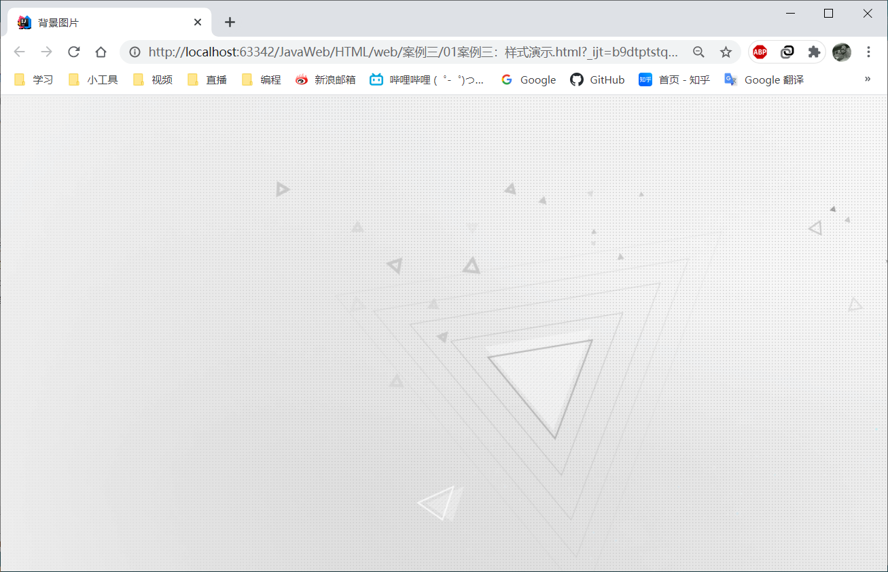

背景重复

\[ background-repeat \]属性用于控制图像的平铺行为。可用值：

no-repeat -停止完全重复背景

repeat-x —水平重复

repeat-y —竖直重复

repeat —默认值；双向重复

<table>
<colgroup>
<col style="width: 100%" />
</colgroup>
<tbody>
<tr class="odd">
<td>CSS 
body { 
background-image: url(star.png); 
background-repeat: repeat-x;/*水平重复*/ 
}</td>
</tr>
</tbody>
</table>

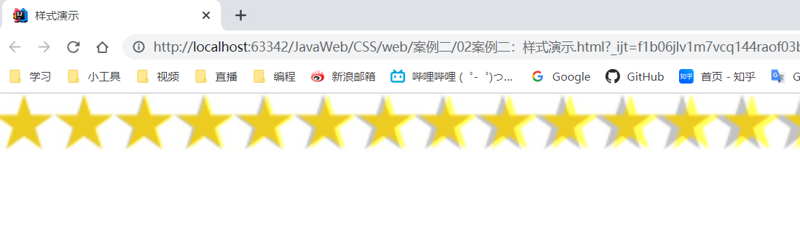

**div布局**

div简单布局：

broader：边界

solid：实线

blue：颜色

<table>
<colgroup>
<col style="width: 100%" />
</colgroup>
<tbody>
<tr class="odd">
<td>HTML 
&lt;style&gt; 
div{ border: 1px solid blue;} 
&lt;/style&gt; 
 
&lt;div &gt;left&lt;/div&gt; 
&lt;div &gt;center&lt;/div&gt; 
&lt;div&gt;right&lt;/div&gt;</td>
</tr>
</tbody>
</table>

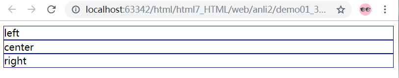

class值 可以设置宽度，浮动，背景

<table>
<colgroup>
<col style="width: 100%" />
</colgroup>
<tbody>
<tr class="odd">
<td>HTML 
.class值{ 
属性名:属性值; 
} 
 
&lt;标签名 class="class值"&gt; 
提示: class是自定义的值</td>
</tr>
</tbody>
</table>

属性

background：背景颜色

width：宽度 (npx 或者 n%)

height：长度

text-align：文本对齐方式

background-image: url("../img/bg.png")：背景图

float：浮动

指定一个元素应沿其容器的左侧或右侧放置，允许文本或者内联元素环绕它，该元素从网页的正常流动中移除，其他部分保持正常文档流顺序。

<table>
<colgroup>
<col style="width: 100%" />
</colgroup>
<tbody>
<tr class="odd">
<td>HTML 
&lt;!-- 加入浮动 --&gt; 
float：none；不浮动 
float：left；左浮动 
float：right；右浮动 
 
&lt;!-- 清除浮动 --&gt; 
clear：both；清除两侧浮动，此元素不再收浮动元素布局影响。</td>
</tr>
</tbody>
</table>

div基本布局

<table>
<colgroup>
<col style="width: 100%" />
</colgroup>
<tbody>
<tr class="odd">
<td>HTML 
&lt;!DOCTYPE html&gt; 
&lt;html lang="en"&gt; 
&lt;head&gt; 
&lt;meta charset="UTF-8"&gt; 
&lt;title&gt;样式演示&lt;/title&gt; 
&lt;style&gt; 
/*给div标签添加边框*/ 
div{ 
border: 1px solid red; 
} 
 
/*左侧图片的div样式*/ 
.left{ 
width: 20%; 
float: left; 
height: 500px; 
} 
 
/*中间正文的div样式*/ 
.center{ 
width: 59%; 
float: left; 
height: 500px; 
} 
 
/*右侧广告图片的div样式*/ 
.right{ 
width: 20%; 
float: left; 
height: 500px; 
} 
 
/*底部超链接的div样式*/ 
.footer{ 
/*清除浮动效果*/ 
clear: both; 
/*文本对齐方式*/ 
text-align: center; 
/*背景颜色*/ 
background: blue; 
} 
&lt;/style&gt; 
&lt;/head&gt; 
&lt;body&gt; 
&lt;!--顶部登陆注册--&gt; 
&lt;div&gt;top&lt;/div&gt; 
 
&lt;!--导航条--&gt; 
&lt;div&gt;navibar&lt;/div&gt; 
 
&lt;!--左侧图片--&gt; 
&lt;div class="left"&gt;left&lt;/div&gt; 
 
&lt;!--中间正文--&gt; 
&lt;div class="center"&gt;center&lt;/div&gt; 
 
&lt;!--右侧广告图片--&gt; 
&lt;div class="right"&gt;right&lt;/div&gt; 
 
&lt;!--底部页脚超链接--&gt; 
&lt;div class="footer"&gt;footer&lt;/div&gt; 
&lt;/body&gt; 
&lt;/html&gt;</td>
</tr>
</tbody>
</table>

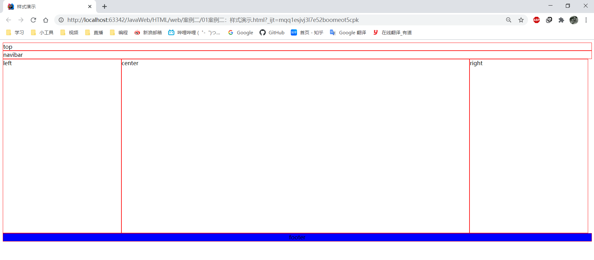

**语义化标签**

为了更好的组织文档，HTML5规范中设计了几个语义元素，可以将特殊含义传达给浏览器。

|             |          |                  |                                                          |
|-------------|----------|------------------|----------------------------------------------------------|
| 标签        | 名称     | 作用             | 备注                                                     |
| **header**  | 标头元素 | 表示内容的介绍   | 块元素，文档中可以定义多个                               |
| **nav**     | 导航元素 | 表示导航链接     | 常见于网站的菜单，目录和索引等，可以嵌套在header中       |
| **article** | 文章元素 | 表示独立内容区域 | 标签定义的内容本身必须是有意义且必须独立于文档的其他部分 |
| **footer**  | 页脚元素 | 表示页面的底部   | 块元素，文档中可以定义多个                               |

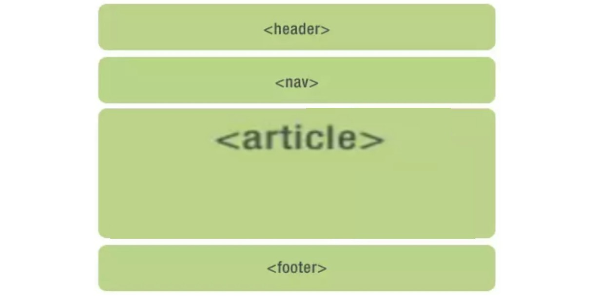

**HTML拓展**

**音频标签**

\<audio\> ：用于播放声音，比如音乐或其他音频流，是 HTML 5 的新标签。

常用属性：

|          |          |                                                                  |
|----------|----------|------------------------------------------------------------------|
| 属性名   | 取值     | 描述                                                             |
| src      | URL      | 音频资源的路径                                                   |
| autoplay | autoplay | 音频准备就绪后自动播放                                           |
| controls | controls | 显示控件，比如播放按钮。                                         |
| loop     | loop     | 表示循环播放                                                     |
| preload  | preload  | 音频在页面加载时进行预加载。 如果使用 "autoplay"，则忽略该属性。 |

你的浏览器不支持 audio 标签。

**视频标签**

\<video\> 标签用于播放视频，比如电影片段或其他视频流，是 HTML 5 的新标签。

常用属性：

|          |          |                                                                |
|----------|----------|----------------------------------------------------------------|
| 属性名   | 取值     | 描述                                                           |
| src      | *URL*    | 要播放的视频的 URL。                                           |
| width    |          | 设置视频播放器的宽度。                                         |
| height   |          | 设置视频播放器的高度。                                         |
| autoplay | autoplay | 视频在就绪后自动播放。                                         |
| control  | controls | 显示控件，比如播放按钮。                                       |
| loop     | loop     | 如果出现该属性，则当媒介文件完成播放后再次开始播放。           |
| preload  | preload  | 视频在页面加载时进行加载。 如果使用 "autoplay"，则忽略该属性。 |
| mute     | muted    | 规定视频的音频输出应该被静音。                                 |
| poste    | *URL*    | 视频下载时显示的图像，或者视频播放前显示的图像。               |

<table>
<colgroup>
<col style="width: 100%" />
</colgroup>
<tbody>
<tr class="odd">
<td>HTML 
&lt;!DOCTYPE html&gt; 
&lt;html lang="en"&gt; 
&lt;head&gt; 
&lt;meta charset="UTF-8"&gt; 
&lt;title&gt;HTML5媒体标签-视频video&lt;/title&gt; 
&lt;/head&gt; 
&lt;body&gt; 
 
&lt;video src="media/movie.ogg" controls&gt; 
你的浏览器不支持 video 标签 
&lt;/video&gt; 
 
&lt;/body&gt; 
&lt;/html&gt;</td>
</tr>
</tbody>
</table>

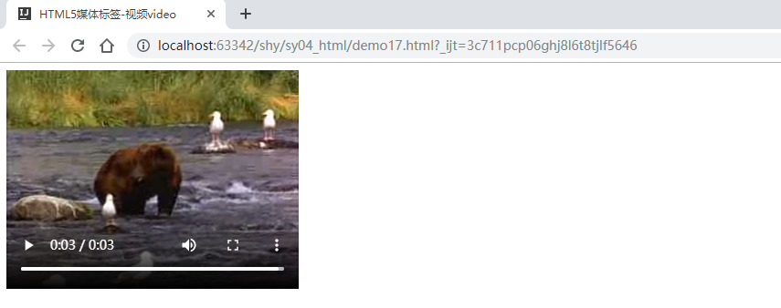

**回到顶部**

在html里面锚点的作用: 通过a标签跳转到指定的位置.

<table>
<colgroup>
<col style="width: 100%" />
</colgroup>
<tbody>
<tr class="odd">
<td>HTML 
&lt;a href="#aId"&gt;回到顶部&lt;/a&gt;</td>
</tr>
</tbody>
</table>

回到顶部

**详情概要**

summary标签来描述概要信息, 利用details标签来描述详情信息. 默认情况下是折叠展示, 想看见详情必须点击

<table>
<colgroup>
<col style="width: 100%" />
</colgroup>
<tbody>
<tr class="odd">
<td>HTML 
&lt;details&gt; 
&lt;summary&gt;概要信息&lt;/summary&gt; 
详情信息 
&lt;/details&gt;</td>
</tr>
</tbody>
</table>

概要信息详情信息

**CSS**

**CSS入门**

**概述**

CSS (层叠样式表——Cascading Style Sheets，缩写为 **CSS** ），简单的说，它是用于设置和布局网页的计算机语言。会告知浏览器如何渲染页面元素。例如，调整内容的字体，颜色，大小等样式，设置边框的样式，调整模块的间距等。

层叠：是指样式表允许以多种方式规定样式信息。可以规定在单个元素中，可以在页面头元素中，也可以在另一个CSS文件中，规定的方式会有次序的差别。

样式：是指丰富的样式外观。拿边框距离来说，允许任何设置边框，允许设置边框与框内元素的距离，允许设置边框与边框的距离等等。

**组成**

CSS是一门基于规则的语言—你能定义用于你的网页中 **特定元素** 的一组 **样式规则** 。这里面提到了两个概念，一是特定元素，二是样式规则。对应CSS的语法，也就是 **选择器（ *selects* ）和声明（ *eclarations* ）** 。

选择器：指定要添加样式的 HTML元素的方式。可以使用标签名，class值，id值等多种方式。

声明：形式为 **属性(property):值(value)** ，用于设置特定元素的属性信息。

属性：指示文体特征，例如 font-size ， width ， background-color 。

值：每个指定的属性都有一个值，该值指示您如何更改这些样式。

格式：

<table>
<colgroup>
<col style="width: 100%" />
</colgroup>
<tbody>
<tr class="odd">
<td>CSS 
选择器 { 
属性名:属性值; 
属性名:属性值; 
属性名:属性值; 
}</td>
</tr>
</tbody>
</table>

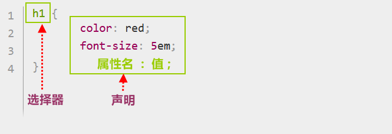

**实现**

**今天开始学CSS**

**CSS语法**

**注释方式**

CSS中的注释以 /\* 和开头 \*/ 。

<table>
<colgroup>
<col style="width: 100%" />
</colgroup>
<tbody>
<tr class="odd">
<td>CSS 
/* 设置h1的样式 */ 
h1 { 
color: blue; 
background-color: yellow; 
border: 1px solid black; 
}</td>
</tr>
</tbody>
</table>

**引入方式**

**内联样式**

内联样式是CSS声明在元素的 style 属性中，仅影响一个元素：

格式：

<table>
<colgroup>
<col style="width: 100%" />
</colgroup>
<tbody>
<tr class="odd">
<td>HTML 
&lt;标签 style="属性名:属性值; 属性名:属性值;"&gt;内容&lt;/标签&gt;</td>
</tr>
</tbody>
</table>

例如：

<table>
<colgroup>
<col style="width: 100%" />
</colgroup>
<tbody>
<tr class="odd">
<td>HTML 
&lt;h1 style="color: blue;background-color: yellow;border: 1px solid black;"&gt; 
Hello World! 
&lt;/h1&gt;</td>
</tr>
</tbody>
</table>

效果：

Hello World!

特点：格式简单，但是样式作用无法复用到多个元素上，不利于维护

**内部样式表**

内部样式表是将CSS样式放在 [style](https://developer.mozilla.org/zh-CN/docs/Web/HTML/Element/style) 标签中，通常style标签编写在HTML 的 [head](https://developer.mozilla.org/zh-CN/docs/Web/HTML/Element/head) 标签内部。

格式：

<table>
<colgroup>
<col style="width: 100%" />
</colgroup>
<tbody>
<tr class="odd">
<td>HTML 
&lt;head&gt; 
&lt;style&gt; 
选择器 { 
属性名: 属性值; 
属性名: 属性值; 
} 
&lt;/style&gt; 
&lt;/head&gt;</td>
</tr>
</tbody>
</table>

例如：

<table>
<colgroup>
<col style="width: 100%" />
</colgroup>
<tbody>
<tr class="odd">
<td>HTML 
&lt;head&gt; 
&lt;style&gt; 
h1 { 
color: blue; 
background-color: yellow; 
border: 1px solid black; 
} 
&lt;/style&gt; 
&lt;/head&gt;</td>
</tr>
</tbody>
</table>

特点：内部样式只能作用在当前页面上，如果是多个页面，就无法复用了

**外部样式表**

外部样式表是CSS附加到文档中的最常见和最有用的方法，因为您可以将CSS文件链接到多个页面，从而允许您使用相同的样式表设置所有页面的样式。

外部样式表是指将CSS编写在扩展名为 .css 的单独文件中，并从HTML \<link\> 元素引用它，通常link标签\`编写在HTML 的\[head\]标签内部。

格式

<table>
<colgroup>
<col style="width: 100%" />
</colgroup>
<tbody>
<tr class="odd">
<td>HTML 
&lt;link rel="stylesheet" href="css文件"&gt;</td>
</tr>
</tbody>
</table>

rel：表示“关系 (relationship) ”，属性值指链接方式与包含它的文档之间的关系，引入css文件固定值为stylesheet。

href：属性需要引用某文件系统中的一个文件。

举例

创建styles.css文件

<table>
<colgroup>
<col style="width: 100%" />
</colgroup>
<tbody>
<tr class="odd">
<td>HTML 
h1 { 
color: blue; 
background-color: yellow; 
border: 1px solid black; 
}</td>
</tr>
</tbody>
</table>

link标签引入文件

<table>
<colgroup>
<col style="width: 100%" />
</colgroup>
<tbody>
<tr class="odd">
<td>HTML 
&lt;!DOCTYPE html&gt; 
&lt;html&gt; 
&lt;head&gt; 
&lt;meta charset="utf-8"&gt; 
&lt;link rel="stylesheet" href="styles.css"&gt; 
&lt;/head&gt; 
&lt;body&gt; 
&lt;h1&gt;Hello World!&lt;/h1&gt; 
&lt;/body&gt; 
&lt;/html&gt;</td>
</tr>
</tbody>
</table>

效果同上

为了CSS文件的管理，在项目中创建一个 css文件夹 ，专门保存样式文件，并调整指定的路径以匹配

<table>
<colgroup>
<col style="width: 100%" />
</colgroup>
<tbody>
<tr class="odd">
<td>HTML 
&lt;link rel="stylesheet" href="../css/styles.css"&gt; 
&lt;!--..代表上一级 相对路径--&gt;</td>
</tr>
</tbody>
</table>

**优先级**

规则层叠于一个样式表中，其中数字 4 拥有最高的优先权：

浏览器缺省设置

外部样式表

内部样式表（位于 标签内部）

内联样式（在 HTML 元素内部）

**选择器**

**介绍选择器**

为了样式化某些元素，我们会通过选择器来选中HTML文档中的这些元素，每个CSS规则都以一个选择器或一组选择器为开始，去告诉浏览器这些规则应该应用到哪些元素上。

选择器的分类：

|            |            |        |                                                                               |               |
|------------|------------|--------|-------------------------------------------------------------------------------|---------------|
| 分类       | 名称       | 符号   | 作用                                                                          | 示例          |
| 基本选择器 | 元素选择器 | 标签名 | 基于标签名匹配元素                                                            | div{ }        |
|            | 类选择器   | .      | 基于class属性值匹配元素                                                       | .center{ }    |
|            | ID选择器   | \#     | 基于id属性值匹配元素                                                          | \#username{ } |
|            | 通用选择器 | \*     | 匹配文档中的所有内容                                                          | \*{ }         |
| 属性选择器 | 属性选择器 | \[\]   | 基于某属性匹配元素                                                            | \[type\]{ }   |
| 伪类选择器 | 伪类选择器 | :      | 用于向某些选择器添加特殊的效果                                                | a:hover{ }    |
| 组合选择器 | 分组选择器 | ,      | 使用 , 号结合两个选择器，匹配两个选择器的元素                                 | span,p{}      |
|            | 后代选择器 | 空格   | 使用空格符号结合两个选择器，基于 第一个选择器，匹配第二个选择器的所有后代元素 | .top li{ }    |

**基本选择器**

页面元素：

<table>
<colgroup>
<col style="width: 100%" />
</colgroup>
<tbody>
<tr class="odd">
<td>HTML 
&lt;body&gt; 
&lt;div&gt;div1&lt;/div&gt; 
 
&lt;div class="cls"&gt;div2&lt;/div&gt; 
&lt;div class="cls"&gt;div3&lt;/div&gt; 
 
&lt;div id="d1"&gt;div4&lt;/div&gt; 
&lt;div id="d2"&gt;div5&lt;/div&gt; 
&lt;/body&gt;</td>
</tr>
</tbody>
</table>

元素选择器

<table>
<colgroup>
<col style="width: 100%" />
</colgroup>
<tbody>
<tr class="odd">
<td>CSS 
/*选择所有div标签,字体为蓝色*/ 
div{ 
color: red; 
}</td>
</tr>
</tbody>
</table>

类选择器

<table>
<colgroup>
<col style="width: 100%" />
</colgroup>
<tbody>
<tr class="odd">
<td>CSS 
/*选择class为cls的,字体为蓝色*/ 
.cls{ 
color: blue; 
}</td>
</tr>
</tbody>
</table>

ID选择器

<table>
<colgroup>
<col style="width: 100%" />
</colgroup>
<tbody>
<tr class="odd">
<td>CSS 
/*id选择器*/ 
#d1{ 
color: green;/*id为d1的字体变成绿色*/ 
} 
 
#d2{ 
color: pink;/*id为d2的字体变成粉色*/ 
}/</td>
</tr>
</tbody>
</table>

通用选择器

<table>
<colgroup>
<col style="width: 100%" />
</colgroup>
<tbody>
<tr class="odd">
<td>CSS 
/*所有标签 */ 
*{ 
background-color: aqua; 
}</td>
</tr>
</tbody>
</table>

**属性选择器**

页面：

<table>
<colgroup>
<col style="width: 100%" />
</colgroup>
<tbody>
<tr class="odd">
<td>HTML 
&lt;body&gt; 
用户名：&lt;input type="text"/&gt; &lt;br/&gt; 
密码：&lt;input type="password"/&gt; &lt;br&gt; 
邮箱：&lt;input type="email"/&gt; &lt;br&gt; 
&lt;/body&gt;</td>
</tr>
</tbody>
</table>

选择器：

<table>
<colgroup>
<col style="width: 100%" />
</colgroup>
<tbody>
<tr class="odd">
<td>CSS 
/*输入框中输入的字符是红色*/ 
[type] { 
color: red; 
} 
/*输入框中输入的字符是蓝色*/ 
[type=password] { 
color: blue; 
}</td>
</tr>
</tbody>
</table>

**伪类选择器**

页面元素

<table>
<colgroup>
<col style="width: 100%" />
</colgroup>
<tbody>
<tr class="odd">
<td>HTML 
&lt;body&gt; 
&lt;a href="https://www.baidu.com" target="_blank"&gt;百度一下&lt;/a&gt; 
&lt;/body&gt;</td>
</tr>
</tbody>
</table>

伪类选择器

<table>
<colgroup>
<col style="width: 100%" />
</colgroup>
<tbody>
<tr class="odd">
<td>CSS 
/*未访问的状态*/ 
a:link{ 
color: black; 
} 
 
/*已访问的状态*/ 
a:visited{ 
color: blue; 
} 
 
/*鼠标悬浮的状态*/ 
a:hover{ 
color: red; 
} 
 
/*已选中的状态*/ 
a:active{ 
color: yellow; 
}</td>
</tr>
</tbody>
</table>

注意：伪类顺序 link ，visited，hover，active，否则有可能失效。

**组合选择器**

页面：

<table>
<colgroup>
<col style="width: 100%" />
</colgroup>
<tbody>
<tr class="odd">
<td>HTML 
&lt;body&gt; 
&lt;span&gt;span&lt;/span&gt; &lt;br/&gt; 
&lt;p&gt;段落&lt;/p&gt; 
 
&lt;div class="top"&gt; 
&lt;ol&gt; 
&lt;li&gt;aa&lt;/li&gt; 
&lt;li&gt;bb&lt;/li&gt; 
&lt;/ol&gt; 
&lt;/div&gt; 
&lt;div class="center"&gt; 
&lt;ol&gt; 
&lt;li&gt;cc&lt;/li&gt; 
&lt;li&gt;dd&lt;/li&gt; 
&lt;/ol&gt; 
&lt;/div&gt; 
&lt;/body&gt;</td>
</tr>
</tbody>
</table>

分组选择器

<table>
<colgroup>
<col style="width: 100%" />
</colgroup>
<tbody>
<tr class="odd">
<td>CSS 
/*span p两个标签下的字体为蓝色*/ 
span,p{ 
color: blue; 
}</td>
</tr>
</tbody>
</table>

后代选择器

<table>
<colgroup>
<col style="width: 100%" />
</colgroup>
<tbody>
<tr class="odd">
<td>CSS 
/*class为top下的所有li标签字体颜色为红色*/ 
.top li{ 
color: red; 
}</td>
</tr>
</tbody>
</table>

**优先级**

选择器优先级

ID选择器 \> 类选择器 \> 标签选择器 \> 通用选择器

如果优先级相同，那么就满足就近原则

**边框样式**

**单个边框**

单个边框 border：边框 border-top: 上边框 border-left: 左边框 border-bottom: 底边框 border-right: 右边框

无边框，当border值为none时，可以让边框不显示

<table>
<colgroup>
<col style="width: 100%" />
</colgroup>
<tbody>
<tr class="odd">
<td>CSS 
div { 
width: 200px; 
height: 200px; 
border: none; 
}</td>
</tr>
</tbody>
</table>

圆角

通过使用\[ border-radius \]属性设置盒子的圆角，虽然能分别设置四个角，但是通常我们使用一个值，来设置整体效果

<table>
<colgroup>
<col style="width: 100%" />
</colgroup>
<tbody>
<tr class="odd">
<td>CSS 
#d1{ 
/*设置所有边框*/ 
/*border: 5px solid black;*/ 
 
/*设置上边框*/ 
border-top: 5px solid black; 
/*设置左边框*/ 
border-left: 5px double red; 
/*设置右边框*/ 
border-right: 5px dotted blue; 
/*设置下边框*/ 
border-bottom: 5px dashed pink; 
 
width: 150px; 
height: 150px; 
} 
 
#d2{ 
border: 5px solid red; 
/*设置边框的弧度*/ 
border-radius: 25px; 
width: 150px; 
height: 150px; 
}</td>
</tr>
</tbody>
</table>

<table>
<colgroup>
<col style="width: 100%" />
</colgroup>
<tbody>
<tr class="odd">
<td>HTML 
&lt;body&gt; 
&lt;div id="d1"&gt;&lt;/div&gt; 
&lt;br/&gt; 
&lt;div id="d2"&gt;&lt;/div&gt; 
&lt;/body&gt;</td>
</tr>
</tbody>
</table>

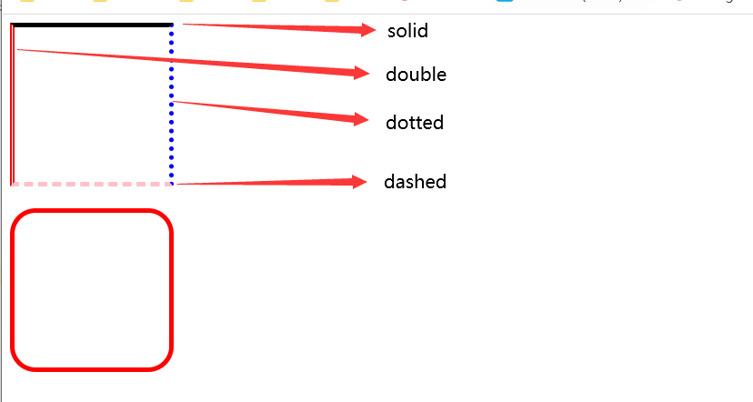

**边框轮廓**

轮廓 **outline** ：是绘制于元素周围的一条线，位于边框边缘的外围，可起到突出元素的作用

属性值：double：双实线 dotted：圆点 dashed：虚线 none：无

<table>
<colgroup>
<col style="width: 100%" />
</colgroup>
<tbody>
<tr class="odd">
<td>HTML 
&lt;!DOCTYPE html&gt; 
&lt;html lang="en"&gt; 
&lt;head&gt; 
&lt;meta charset="UTF-8"&gt; 
&lt;title&gt;样式演示&lt;/title&gt; 
&lt;style&gt; 
input{ 
outline: dotted; 
} 
&lt;/style&gt; 
&lt;/head&gt; 
&lt;body&gt; 
用户名：&lt;input type="text"/&gt; &lt;br/&gt; 
&lt;/body&gt; 
&lt;/html&gt;</td>
</tr>
</tbody>
</table>

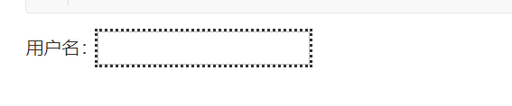

**盒子模型**

**模型介绍**

盒子模型是通过设置 **元素框** 与 **元素内容** 和 **外部元素** 的边距，而进行布局的方式。

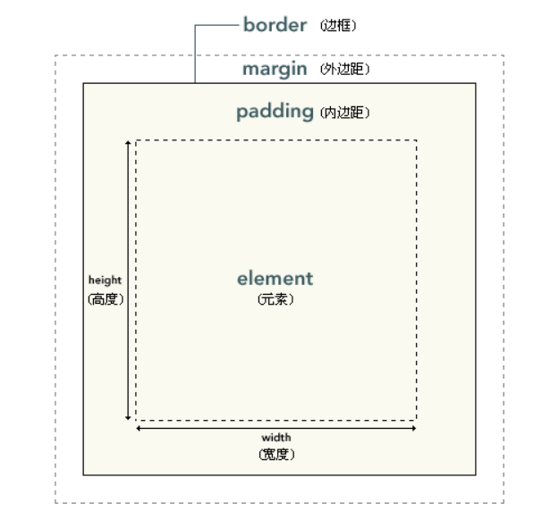

element : 元素。

padding : 内边距，也有资料将其翻译为填充。

border : 边框。

margin : 外边距，也有资料将其翻译为空白或空白边。

**边距**

内边距、边框和外边距都是可选的，默认值是零。在 CSS 中，width 和 height 指的是内容区域的宽度和高度。

外边距 单独设置边框的外边距，设置上、右、下、左方向：

<table>
<colgroup>
<col style="width: 100%" />
</colgroup>
<tbody>
<tr class="odd">
<td>CSS 
margin-top 
margin-right 
margin-bottom 
margin-left</td>
</tr>
</tbody>
</table>

<table>
<colgroup>
<col style="width: 100%" />
</colgroup>
<tbody>
<tr class="odd">
<td>CSS 
margin: auto /*浏览器自动计算外边距，具有居中效果。*/</td>
</tr>
</tbody>
</table>

一个值

<table>
<colgroup>
<col style="width: 100%" />
</colgroup>
<tbody>
<tr class="odd">
<td>CSS 
/* 所有 4 个外边距都是 10px */ 
margin:10px;</td>
</tr>
</tbody>
</table>

两个值

<table>
<colgroup>
<col style="width: 100%" />
</colgroup>
<tbody>
<tr class="odd">
<td>CSS 
margin:10px 5px;/* 上外边距和下外边距是 10px*/ 
margin:10px auto;/*右外边距和左外边距是 5px */</td>
</tr>
</tbody>
</table>

三个值

<table>
<colgroup>
<col style="width: 100%" />
</colgroup>
<tbody>
<tr class="odd">
<td>CSS 
/* 上外边距是 10px，右外边距和左外边距是 5px，下外边距是 15px*/ 
margin:10px 5px 15px;</td>
</tr>
</tbody>
</table>

四个值

<table>
<colgroup>
<col style="width: 100%" />
</colgroup>
<tbody>
<tr class="odd">
<td>CSS 
/*上外边距是 10px，右外边距是 5px，下外边距是 15px，左外边距是 20px*/ 
/*上右下外*/ 
margin:10px 5px 15px 20px;</td>
</tr>
</tbody>
</table>

内边距 与外边距类似，单独设置边框的内边距，设置上、右、下、左方向：

<table>
<colgroup>
<col style="width: 100%" />
</colgroup>
<tbody>
<tr class="odd">
<td>CSS 
padding-top 
padding-right 
padding-bottom 
padding-left</td>
</tr>
</tbody>
</table>

**布局**

基本布局

<table>
<colgroup>
<col style="width: 100%" />
</colgroup>
<tbody>
<tr class="odd">
<td>HTML 
&lt;style&gt; 
div{ 
border: 2px solid blue; 
} 
.big{ 
width: 200px; 
height: 200px; 
} 
.small{ 
width: 100px; 
height: 100px; 
margin: 30px;/* 外边距 */ 
} 
&lt;/style&gt; 
 
&lt;div class="big"&gt; 
&lt;div class="small"&gt; 
&lt;/div&gt; 
&lt;/div</td>
</tr>
</tbody>
</table>

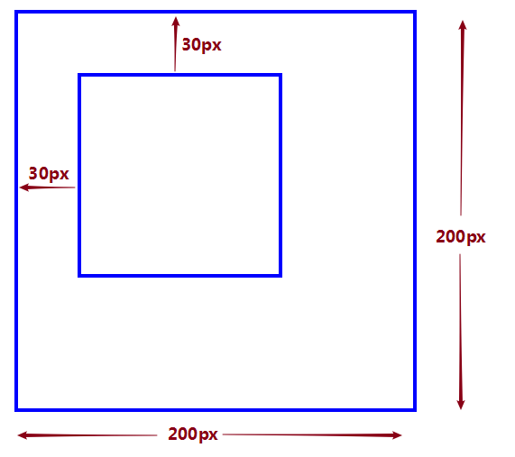

增加内边距会增加元素框的总尺寸

<table>
<colgroup>
<col style="width: 100%" />
</colgroup>
<tbody>
<tr class="odd">
<td>CSS 
&lt;style&gt; 
div{ 
border: 2px solid blue; 
} 
.big{ 
width: 200px; 
height: 200px; 
padding: 30px;/*内边距 */ 
} 
.small{ 
width: 100px; 
height: 100px; 
} 
&lt;/style&gt;</td>
</tr>
</tbody>
</table>

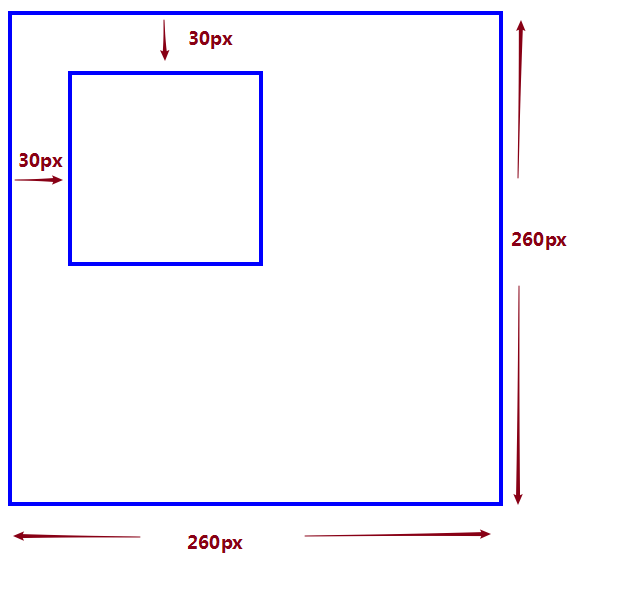

**文本样式**

**基本属性**

|                 |              |                                                                                                                                                         |
|-----------------|--------------|---------------------------------------------------------------------------------------------------------------------------------------------------------|
| 属性名          | 作用         | 属性取值                                                                                                                                                |
| width           | 宽度         |                                                                                                                                                         |
| height          | 高度         |                                                                                                                                                         |
| color           | 颜色         |                                                                                                                                                         |
| font-family     | 字体样式     | 宋体、楷体                                                                                                                                              |
| font-size       | 字体大小     | px : 像素，文本高度像素绝对数值。 em : 1em等于当前元素的父元素设置的字体大小，是相对数值                                                                |
| text-decoration | 下划线       | underline : 下划线 overline : 上划线 line-through : 删除线 none : 不要线条                                                                              |
| text-align      | 文本水平对齐 | lef : 左对齐文本 right : 右对齐文本 center : 使文本居中 justify : 使文本散布，改变单词间的间距，使文本所有行具有相同宽度。                              |
| line-height     | 行高，行间距 |                                                                                                                                                         |
| vertical-align  | 文本垂直对齐 | top：居上 bottom：居下 middle：居中 或者百分比                                                                                                          |
| display         | 元素如何显示 | 可以设置块级和行内元素的切换，也可以设置元素隐藏 inline：内联元素(无换行、无长宽) block：块级元素(有换行) inline-block：内联元素(有长宽) none：隐藏元素 |

<table>
<colgroup>
<col style="width: 100%" />
</colgroup>
<tbody>
<tr class="odd">
<td>CSS 
div{ 
color: /*red*/ #ff0000; 
font-family: /*宋体*/ 微软雅黑; 
font-size: 25px;/ 
text-decoration: none; 
text-align: center; 
line-height: 60px; 
} 
 
span{ 
/*文字垂直对齐 top：居上 bottom：居下 middle：居中 百分比*/ 
vertical-align: 50%; /*居中对齐*/ 
}</td>
</tr>
</tbody>
</table>

<table>
<colgroup>
<col style="width: 100%" />
</colgroup>
<tbody>
<tr class="odd">
<td>HTML 
&lt;div&gt; 
我是文字 
&lt;/div&gt; 
&lt;div&gt; 
我是文字 
&lt;/div&gt; 
 
&lt;img src="../img/wx.png" width="38px" height="38px"/&gt; 
&lt;span&gt;微信&lt;/span&gt;</td>
</tr>
</tbody>
</table>

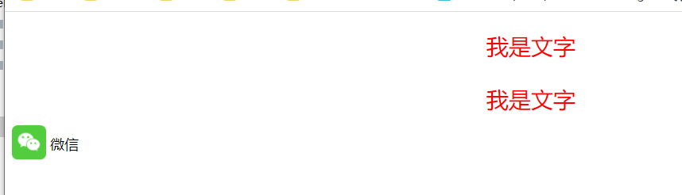

**文本显示**

元素显示

<table>
<colgroup>
<col style="width: 100%" />
</colgroup>
<tbody>
<tr class="odd">
<td>CSS 
/* 把列表项显示为内联元素，无长宽*/ 
li { 
display:inline; 
} 
/* 把span元素作为块元素，有换行*/ 
span { 
display:block; 
} 
/* 行内块元素，结合的行内和块级的优点，既可以行内显示，又可以设置长宽，*/ 
li { 
display:inline-block; 
} 
/*所有div在一行显示*/ 
div{ 
display: inline-block; 
width: 100px; 
}</td>
</tr>
</tbody>
</table>

元素隐藏

当设置为none时，可以隐藏元素。

**CSS案例**

<table>
<colgroup>
<col style="width: 100%" />
</colgroup>
<tbody>
<tr class="odd">
<td>CSS 
/*背景图片*/ 
body{ 
background: url("../img/bg.png"); 
} 
 
/*中间表单样式*/ 
.center{ 
background: white; /*背景色*/ 
width: 40%; /*宽度*/ 
margin: auto; /*水平居中外边距*/ 
margin-top: 100px; /*上外边距*/ 
border-radius: 15px; /*边框弧度*/ 
text-align: center; /*文本水平居中*/ 
} 
 
/*表头样式*/ 
thead th{ 
font-size: 30px; /*字体大小*/ 
color: orangered; /*字体颜色*/ 
} 
 
/*表体提示信息样式*/ 
tbody label{ 
font-size: 20px; /*字体大小*/ 
} 
 
/*表体输入框样式*/ 
tbody input{ 
border: 1px solid gray; /*边框*/ 
border-radius: 5px; /*边框弧度*/ 
width: 90%; /*输入框的宽度*/ 
height: 40px; /*输入框的高度*/ 
outline: none; /*取消轮廓的样式*/ 
} 
 
/*表底确定按钮样式*/ 
tfoot button{ 
border: 1px solid crimson; /*边框*/ 
border-radius: 5px; /*边框弧度*/ 
width: 95%; /*宽度*/ 
height: 40px; /*高度*/ 
background: crimson; /*背景色*/ 
color: white; /*文字的颜色*/ 
font-size: 20px; /*字体大小*/ 
} 
 
/*表行高度*/ 
tr{ 
line-height: 60px; /*行高*/ 
} 
 
/*底部页脚样式*/ 
.footer{ 
width: 35%; /*宽度*/ 
margin: auto; /*水平居中外边距*/ 
font-size: 15px; /*字体大小*/ 
color: gray; /*字体颜色*/ 
} 
 
/*超链接样式*/ 
a{ 
text-decoration: none; /*去除超链接的下划线*/ 
color: blue; /*超链接颜色*/ 
}</td>
</tr>
</tbody>
</table>

<table>
<colgroup>
<col style="width: 100%" />
</colgroup>
<tbody>
<tr class="odd">
<td>HTML 
&lt;!DOCTYPE html&gt; 
&lt;html lang="en"&gt; 
&lt;head&gt; 
&lt;meta charset="UTF-8"&gt; 
&lt;title&gt;登录页面&lt;/title&gt; 
&lt;link rel="stylesheet" href="../css/login.css"/&gt; 
&lt;/head&gt; 
&lt;body&gt; 
&lt;!--顶部公司图标--&gt; 
&lt;div&gt; 
&lt;img src="../img/logo.png"/&gt; 
&lt;/div&gt; 
 
&lt;!--中间表单--&gt; 
&lt;div class="center"&gt; 
&lt;form action="#" method="get" autocomplete="off"&gt; 
&lt;table width="100%"&gt; 
&lt;thead&gt; 
&lt;tr&gt; 
&lt;th colspan="2"&gt;账&amp;nbsp;密&amp;nbsp;登&amp;nbsp;录&lt;hr/&gt;&lt;/th&gt; 
&lt;/tr&gt; 
&lt;/thead&gt; 
 
&lt;tbody&gt; 
&lt;tr&gt; 
&lt;td&gt; 
&lt;label for="username"&gt;账号&lt;/label&gt; 
&lt;/td&gt; 
&lt;td&gt; 
&lt;input type="text" id="username" name="username" placeholder=" 请输入账号" required/&gt; 
&lt;/td&gt; 
&lt;/tr&gt; 
&lt;tr&gt; 
&lt;td&gt; 
&lt;label for="password"&gt;密码&lt;/label&gt; 
&lt;/td&gt; 
&lt;td&gt; 
&lt;input type="password" id="password" name="password" placeholder=" 请输入密码" required/&gt; 
&lt;/td&gt; 
&lt;/tr&gt; 
&lt;/tbody&gt; 
 
&lt;tfoot&gt; 
&lt;tr&gt; 
&lt;td colspan="2"&gt; 
&lt;button type="submit"&gt;确&amp;nbsp;定&lt;/button&gt; 
&lt;/td&gt; 
&lt;/tr&gt; 
&lt;/tfoot&gt; 
&lt;/table&gt; 
&lt;/form&gt; 
&lt;/div&gt; 
 
&lt;!--底部页脚--&gt; 
&lt;div class="footer"&gt; 
&lt;br/&gt;&lt;br/&gt; 
登录/注册即表示您同意&amp;nbsp;&amp;nbsp; 
&lt;a href="#" target="_blank"&gt;用户协议&lt;/a&gt;&amp;nbsp;&amp;nbsp; 
和&amp;nbsp;&amp;nbsp; 
&lt;a href="#" target="_blank"&gt;隐私条款&lt;/a&gt;&amp;nbsp;&amp;nbsp;&amp;nbsp;&amp;nbsp; 
&lt;a href="#" target="_blank"&gt;忘记密码?&lt;/a&gt; 
&lt;/div&gt; 
&lt;/body&gt; 
&lt;/html&gt;</td>
</tr>
</tbody>
</table>

**HTTP**

**相关概念**

HTTP：Hyper Text Transfer Protocol，意为超文本传输协议，是建立在 **TCP/IP 协议** 基础上，指的是服务器和客户端之间交互必须遵循的一问一答的规则，形容这个规则：问答机制、握手机制

HTTP 协议是 **一个无状态的面向连接的协议** ，指的是协议对于事务处理没有记忆能力，服务器不知道客户端是什么状态。所以打开一个服务器上的网页和上一次打开这个服务器上的网页之间没有任何联系

注意：无状态并不是代表 HTTP 就是 UDP，面向连接也不是代表 HTTP 就是TCP

HTTP 作用：用于定义 WEB 浏览器与 WEB 服务器之间交换数据的过程和数据本身的内容

浏览器和服务器交互过程：浏览器请求，服务请求响应

请求（请求行、请求头、请求体）

响应（响应行、响应头、响应体）

URL 和 URI

URL：统一资源定位符

格式：http://127.0.0.1:8080/request/servletDemo01

详解：http：协议；127.0.0.1：域名；8080：端口；request/servletDemo01：请求资源路径

URI：统一资源标志符

格式：/request/servletDemo01

区别： URL - HOST = URI ，URI 是抽象的定义，URL 用地址定位，URI 用名称定位。 **只要能唯一标识资源的是 URI，在 URI 的基础上给出其资源的访问方式的是 URL**

**从浏览器地址栏输入 URL 到请求返回发生了什么？**

进行 URL 解析，进行编码

DNS 解析，顺序是先查 hosts 文件是否有记录，有的话就会把相对应映射的 IP 返回，然后去本地 DNS 缓存中寻找，然后依次向本地域名服务器、根域名服务器、顶级域名服务器、权限域名服务器发起查询请求，最终返回 IP 地址给本地域名服务器

本地域名服务器将得到的 IP 地址返回给操作系统，同时将 IP 地址缓存起来；操作系统将 IP 地址返回给浏览器，同时自己也将 IP 地址缓存起来

查找到 IP 之后，进行 TCP 协议的三次握手建立连接

发出 HTTP 请求，取文件指令

服务器处理请求，返回响应

释放 TCP 连接

浏览器解析渲染页面

推荐阅读：https://xiaolincoding.com/network/

**版本区别**

版本介绍：

HTTP/0.9 仅支持 GET 请求，不支持请求头

HTTP/1.0 默认短连接（一次请求建议一次 TCP 连接，请求完就断开），支持 GET、POST、 HEAD 请求

HTTP/1.1 默认长连接（一次 TCP 连接可以多次请求）；支持 PUT、DELETE、PATCH 等六种请求；增加 HOST 头，支持虚拟主机；支持 **断点续传** 功能

HTTP/2.0 多路复用，降低开销（一次 TCP 连接可以处理多个请求）；服务器主动推送（相关资源一个请求全部推送）；解析基于二进制，解析错误少，更高效（HTTP/1.X 解析基于文本）；报头压缩，降低开销

HTTP/3.0 QUIC (Quick UDP Internet Connections)，快速 UDP 互联网连接，基于 UDP 协议

HTTP 1.0 和 HTTP 1.1 的主要区别：

长短连接：

**在HTTP/1.0中，默认使用的是短连接** ，每次请求都要重新建立一次连接，比如获取 HTML 和 CSS 文件，需要两次请求。HTTP 基于 TCP/IP 协议的，每一次建立或者断开连接都需要三次握手四次挥手，开销会比较大

**HTTP 1.1起，默认使用长连接** ，默认开启 Connection: keep-alive ，Keep-Alive 有一个保持时间，不会永久保持连接。持续连接有非流水线方式和流水线方式 ，流水线方式是客户端在收到 HTTP 的响应报文之前就能接着发送新的请求报文，非流水线方式是客户端在收到前一个响应后才能发送下一个请求

HTTP 协议的长连接和短连接，实质上是 TCP 协议的长连接和短连接

错误状态响应码：在 HTTP1.1 中新增了 24 个错误状态响应码，如 409（Conflict）表示请求的资源与资源的当前状态发生冲突，410（Gone）表示服务器上的某个资源被永久性的删除

缓存处理：在 HTTP1.0 中主要使用 header 里的 If-Modified-Since，Expires 来做为缓存判断的标准，HTTP1.1 则引入了更多的缓存控制策略，例如 Entity tag，If-Unmodified-Since，If-Match，If-None-Match等

带宽优化及网络连接的使用：HTTP1.0 存在一些浪费带宽的现象，例如客户端只需要某个对象的一部分，而服务器却将整个对象送过来了，并且不支持 **断点续传** 功能，HTTP1.1 则在请求头引入了 range 头域，允许只 **请求资源的某个部分** ，即返回码是 206（Partial Content），这样就方便了开发者自由的选择以便于充分利用带宽和连接

HOST 头处理：在 HTTP1.0 中认为每台服务器都绑定一个唯一的 IP 地址，因此请求消息中的 URL 并没有传递主机名。HTTP1.1 时代虚拟主机技术发展迅速，在一台物理服务器上可以存在多个虚拟主机，并且共享一个 IP 地址，故 HTTP1.1 增加了 HOST 信息

HTTP 1.1 和 HTTP 2.0 的主要区别：

新的二进制格式：HTTP1.1 基于文本格式传输数据，HTTP2.0 采用二进制格式传输数据，解析更高效

**多路复用** ：在一个连接里，允许同时发送多个请求或响应，并且这些请求或响应能够并行的传输而不被阻塞，避免 HTTP1.1 出现的队头堵塞问题

头部压缩，HTTP1.1 的 header 带有大量信息，而且每次都要重复发送；HTTP2.0 把 header 从数据中分离，并封装成头帧和数据帧，使用特定算法压缩头帧。并且 HTTP2.0 在客户端和服务器端记录了之前发送的键值对，对于相同的数据不会重复发送。比如请求 A 发送了所有的头信息字段，请求 B 则只需要发送差异数据，这样可以减少冗余数据，降低开销

**服务端推送** ：HTTP2.0 允许服务器向客户端推送资源，无需客户端发送请求到服务器获取

**安全请求**

HTTP 和 HTTPS 的区别：

端口 ：HTTP 默认使用端口 80，HTTPS 默认使用端口 443

安全性：HTTP 协议运行在 TCP 之上，所有传输的内容都是明文，客户端和服务器端都无法验证对方的身份；HTTPS 是运行在 SSL/TLS 之上的 HTTP 协议，SSL/TLS 运行在 TCP 之上，所有传输的内容都经过加密，加密采用对称加密，但对称加密的密钥用服务器方的证书进行了非对称加密

资源消耗：HTTP 安全性没有 HTTPS 高，但是 HTTPS 比 HTTP 耗费更多服务器资源

**对称加密和非对称加密**

对称加密：加密和解密使用同一个秘钥，把密钥转发给需要发送数据的客户机，中途会被拦截（类似于把带锁的箱子和钥匙给别人，对方打开箱子放入数据，上锁后发送），私钥用来解密数据，典型的对称加密算法有 DES、AES 等

优点：运算速度快

缺点：无法安全的将密钥传输给通信方

非对称加密：加密和解密使用不同的秘钥，一把作为公开的公钥，另一把作为私钥， **公钥公开给任何人** （类似于把锁和箱子给别人，对方打开箱子放入数据，上锁后发送），典型的非对称加密算法有 RSA、DSA 等

公钥加密，私钥解密：为了 **保证内容传输的安全** ，因为被公钥加密的内容，其他人是无法解密的，只有持有私钥的人，才能解密出实际的内容

私钥加密，公钥解密：为了 **保证消息不会被冒充** ，因为私钥是不可泄露的，如果公钥能正常解密出私钥加密的内容，就能证明这个消息是来源于持有私钥身份的人发送的

可以更安全地将公开密钥传输给通信发送方，但是运算速度慢

**使用对称加密和非对称加密的方式传送数据**

使用非对称密钥加密方式，传输对称密钥加密方式所需要的 Secret Key，从而保证安全性

获取到 Secret Key 后，再使用对称密钥加密方式进行通信，从而保证效率

思想：锁上加锁

名词解释：

哈希算法：通过哈希函数计算出内容的哈希值，传输到对端后会重新计算内容的哈希，进行哈希比对来校验内容的完整性

数字签名：附加在报文上的特殊加密校验码，可以防止报文被篡改。一般是通过私钥对内容的哈希值进行加密，公钥正常解密并对比哈希值后，可以确保该内容就是对端发出的，防止出现中间人替换的问题

数字证书：由权威机构给某网站颁发的一种认可凭证

HTTPS 工作流程：服务器端的公钥和私钥，用来进行非对称加密，客户端生成的随机密钥，用来进行对称加密

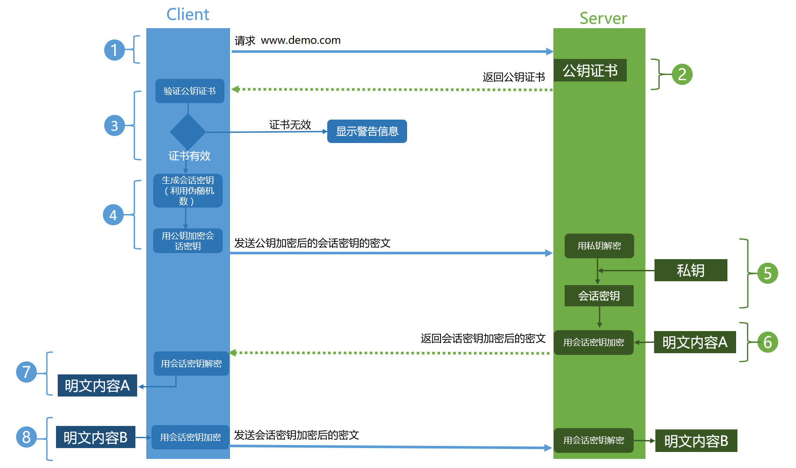

客户端向服务器发起 HTTPS 请求，连接到服务器的 443 端口，请求携带了浏览器支持的加密算法和哈希算法，协商加密算法

服务器端会向数字证书认证机构注册公开密钥，认证机构 **用 CA 私钥** 对公开密钥做数字签名后绑定在数字证书（又叫公钥证书，内容有公钥，网站地址，证书颁发机构，失效日期等）

服务器将数字证书发送给客户端，私钥由服务器持有

客户端收到服务器端的数字证书后 **通过 CA 公钥** （事先置入浏览器或操作系统）对证书进行检查，验证其合法性。如果公钥合格，那么客户端会生成一个随机值，这个随机值就是用于进行对称加密的密钥，将该密钥称之为 client key（客户端密钥、会话密钥）。用服务器的公钥对客户端密钥进行非对称加密，这样客户端密钥就变成密文，HTTPS 中的第一次 HTTP 请求结束

客户端会发起 HTTPS 中的第二个 HTTP 请求，将加密之后的客户端密钥发送给服务器

服务器接收到客户端发来的密文之后，会用自己的私钥对其进行非对称解密，解密之后的明文就是客户端密钥，然后用客户端密钥对数据进行对称加密，这样数据就变成了密文

服务器将加密后的密文发送给客户端

客户端收到服务器发送来的密文，用客户端密钥对其进行对称解密，得到服务器发送的数据，这样 HTTPS 中的第二个 HTTP 请求结束，整个 HTTPS 传输完成

参考文章：https://www.cnblogs.com/linianhui/p/security-https-workflow.html

参考文章：https://www.jianshu.com/p/14cd2c9d2cd2

**请求部分**

请求行： 永远位于请求的第一行

请求头： 从第二行开始，到第一个空行结束

请求体： 从第一个空行后开始，到正文的结束（GET 没有）

请求方式

POST

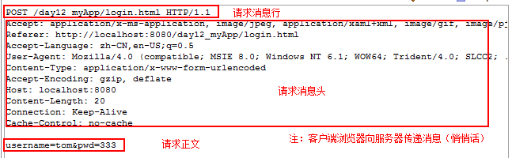

GET

<table>
<colgroup>
<col style="width: 100%" />
</colgroup>
<tbody>
<tr class="odd">
<td>HTML 
【请求行】 
GET /myApp/success.html?username=zs&amp;password=123456 HTTP/1.1 
 
【请求头】 
Accept: text/html, application/xhtml+xml, */*; X-HttpWatch-RID: 41723-10011 
Referer: http://localhost:8080/myApp/login.html 
Accept-Language: zh-Hans-CN,zh-Hans;q=0.5 
User-Agent: Mozilla/5.0 (MSIE 9.0; qdesk 2.4.1266.203; Windows NT 6.3; WOW64; Trident/7.0; rv:11.0) like Gecko 
Accept-Encoding: gzip, deflate 
Host: localhost:8080 
Connection: Keep-Alive 
Cookie: Idea-b77ddca6=4bc282fe-febf-4fd1-b6c9-72e9e0f381e8</td>
</tr>
</tbody>
</table>

**GET 和 POST 比较**

作用：GET 用于获取资源，而 POST 用于传输实体主体

参数：GET 和 POST 的请求都能使用额外的参数，但是 GET 的参数是以查询字符串出现在 URL 中，而 POST 的参数存储在实体主体中（GET 也有请求体，POST 也可以通过 URL 传输参数）。不能因为 POST 参数存储在实体主体中就认为它的安全性更高，因为照样可以通过一些抓包工具（Fiddler）查看

安全：安全的 HTTP 方法不会改变服务器状态，也就是说它只是可读的。GET 方法是安全的，而 POST 不是，因为 POST 的目的是传送实体主体内容

安全的方法除了 GET 之外还有：HEAD、OPTIONS

不安全的方法除了 POST 之外还有 PUT、DELETE

幂等性：同样的请求 **被执行一次与连续执行多次的效果是一样的** ，服务器的状态也是一样的，所有的安全方法也都是幂等的。在正确实现条件下，GET，HEAD，PUT 和 DELETE 等方法都是幂等的，POST 方法不是

可缓存：如果要对响应进行缓存，需要满足以下条件

请求报文的 HTTP 方法本身是可缓存的，包括 GET 和 HEAD，但是 PUT 和 DELETE 不可缓存，POST 在多数情况下不可缓存

响应报文的状态码是可缓存的，包括：200、203、204、206、300、301、404、405、410、414 and 501

响应报文的 Cache-Control 首部字段没有指定不进行缓存

PUT 和 POST 的区别

PUT 请求：如果两个请求相同，后一个请求会把第一个请求覆盖掉（幂等），所以 PUT 用来修改资源

POST 请求：后一个请求不会把第一个请求覆盖掉（非幂等），所以 POST 用来创建资源

PATCH 方法 是新引入的，是对 PUT 方法的补充，用来对已知资源进行 **局部更新**

请求行详解

<table>
<colgroup>
<col style="width: 100%" />
</colgroup>
<tbody>
<tr class="odd">
<td>HTML 
GET /myApp/success.html?username=zs&amp;password=123456 HTTP/1.1 
POST /myApp/success.html HTTP/1.1</td>
</tr>
</tbody>
</table>

|                     |                            |
|---------------------|----------------------------|
| 内容                | 说明                       |
| GET/POST            | 请求的方式。               |
| /myApp/success.html | 请求的资源。               |
| HTTP/1.1            | 使用的协议，及协议的版本。 |

请求头详解

从第 2 行到空行处，都叫请求头，以键值对的形式存在，但存在一个 key 对应多个值的请求头

|                   |                                                                                            |
|-------------------|--------------------------------------------------------------------------------------------|
| 内容              | 说明                                                                                       |
| Accept            | 告知服务器，客户浏览器支持的 MIME 类型                                                     |
| User-Agent        | 浏览器相关信息                                                                             |
| Accept-Charset    | 告诉服务器，客户浏览器支持哪种字符集                                                       |
| Accept-Encoding   | 告知服务器，客户浏览器支持的压缩编码格式，常用 gzip 压缩                                   |
| Accept-Language   | 告知服务器，客户浏览器支持的语言，zh_CN 或 en_US 等                                        |
| Host              | 初始 URL 中的主机和端口                                                                    |
| Referer           | 告知服务器，当前请求的来源。只有当前请求有来源，才有这个消息头。 作用：1 投放广告 2 防盗链 |
| Content-Type      | 告知服务器，请求正文的 MIME 类型，文件传输的类型， application/x-www-form-urlencoded       |
| Content-Length    | 告知服务器，请求正文的长度。                                                               |
| Connection        | 表示是否需要持久连接，一般是 Keep -Alive （HTTP 1.1 默认进行持久连接 )                     |
| If-Modified-Since | 告知服务器，客户浏览器缓存文件的最后修改时间                                               |
| Cookie            | 会话管理相关（非常的重要）                                                                 |

请求体详解

只有 POST 请求方式，才有请求的正文，GET 方式的正文是在地址栏中的

表单的输入域有 name 属性的才会被提交，不分 GET 和 POST 的请求方式

表单的 enctype 属性取值决定了请求正文的体现形式

|                                   |                                                    |                                                                                                                                                                                                                                              |
|-----------------------------------|----------------------------------------------------|----------------------------------------------------------------------------------------------------------------------------------------------------------------------------------------------------------------------------------------------|
| enctype取值                       | 请求正文体现形式                                   | 示例                                                                                                                                                                                                                                         |
| application/x-www-form-urlencoded | key=value&key=value                                | username=test&password=1234                                                                                                                                                                                                                  |
| multipart/form-data               | 此时变成了多部分表单数据。多部分是靠分隔符分隔的。 | -----------------------------7df23a16c0210 Content-Disposition: form-data; name="username" test -----------------------------7df23a16c0210 Content-Disposition: form-data; name="password" 1234 -------------------------------7df23a16c0210 |

**响应部分**

响应部分图：

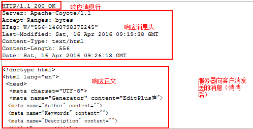

响应行

HTTP/1.1：使用协议的版本

200：响应状态码

OK：状态码描述

响应状态码：

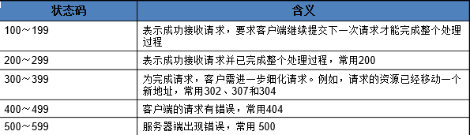

|         |                                                    |
|---------|----------------------------------------------------|
| 状态码  | 说明                                               |
| 200     | 一切都 OK，与服务器连接成功，发送请求成功          |
| 302/307 | 请求重定向（客户端行为，两次请求，地址栏发生改变） |
| 304     | 请求资源未改变，使用缓存                           |
| 400     | 客户端错误，请求错误，最常见的就是请求参数有问题   |
| 403     | 客户端错误，但 forbidden 权限不够，拒绝处理        |
| 404     | 客户端错误，请求资源未找到                         |
| 500     | 服务器错误，服务器运行内部错误                     |

转移：

301 redirect：301 代表永久性转移 (Permanently Moved)

302 redirect：302 代表暂时性转移 (Temporarily Moved )

响应头：以 key:vaue 存在，可能多个 value 情况

|                         |                                                              |
|-------------------------|--------------------------------------------------------------|
| 消息头                  | 说明                                                         |
| Location                | 请求重定向的地址，常与 302，307 配合使用。                   |
| Server                  | 服务器相关信息                                               |
| Content-Type            | 告知客户浏览器，响应正文的MIME类型                           |
| Content-Length          | 告知客户浏览器，响应正文的长度                               |
| Content-Encoding        | 告知客户浏览器，响应正文使用的压缩编码格式，常用的 gzip 压缩 |
| Content-Language        | 告知客户浏览器，响应正文的语言，zh_CN 或 en_US 等            |
| Content-Disposition     | 告知客户浏览器，以下载的方式打开响应正文                     |
| Refresh                 | 客户端的刷新频率，单位是秒                                   |
| Last-Modified           | 服务器资源的最后修改时间                                     |
| Set-Cookie              | 服务器端发送的 Cookie，会话管理相关                          |
| Expires:-1              | 服务器资源到客户浏览器后的缓存时间                           |
| Catch-Control: no-catch | 不要缓存，//针对http协议1.1版本                              |
| Pragma:no-catch         | 不要缓存，//针对http协议1.0版本                              |

响应体：页面展示内容, 类似网页的源码

<table>
<colgroup>
<col style="width: 100%" />
</colgroup>
<tbody>
<tr class="odd">
<td>HTML 
&lt;html&gt; 
&lt;head&gt; 
&lt;link rel="stylesheet" href="css.css" type="text/css"&gt; 
&lt;script type="text/javascript" src="demo.js"&gt;&lt;/script&gt; 
&lt;/head&gt; 
&lt;body&gt; 
&lt;img src="1.jpg" /&gt; 
&lt;/body&gt; 
&lt;/html&gt;</td>
</tr>
</tbody>
</table>

**Servlet**

**JavaEE**

**JavaEE规范**

JavaEE 规范是 J2EE 规范的新名称，早期被称为 J2EE 规范，其全称是 Java 2 Platform Enterprise Edition ，它是由 SUN 公司领导、各厂家共同制定并得到广泛认可的工业标准（ JCP 组织成员）。之所以改名为 JavaEE ，目的还是让大家清楚 J2EE 只是 Java 企业应用。在 2004 年底中国软件技术大会 Ioc 微容器（也就是 Jdon 框架的实现原理）演讲中指出：我们需要一个跨 J2SE/WEB/EJB 的微容器，保护我们的业务核心组件，以延续它的生命力，而不是依赖 J2SE/J2EE 版本。此次 J2EE 改名为 Java EE ，实际也反映出业界这种共同心声

JavaEE 规范是很多 Java 开发技术的总称。这些技术规范都是沿用自 J2EE 的。一共包括了 13 个技术规范，例如： jsp/servlet ， jndi ， jaxp ， jdbc ， jni ， jaxb ， jmf ， jta ， jpa ， EJB 等。

其中， JCP 组织的全称是 Java Community Process，是一个开放的国际组织，主要由 Java 开发者以及被授权者组成，职能是发展和更新。成立于 1998 年。官网是： [JCP](https://jcp.org/en/home/index)

JavaEE 的版本是延续了 J2EE 的版本，但是没有继续采用其命名规则。 J2EE 的版本从 1.0 开始到 1.4 结束，而 JavaEE 版本是从 JavaEE 5 版本开始，目前最新的的版本是 JavaEE 8

详情请参考： [JavaEE8 规范概览](https://www.oracle.com/technetwork/cn/java/javaee/overview/index.html)

**Web 概述**

Web，在计算机领域指网络。像我们接触的 WWW ，它是由 3 个单词组成的，即： World Wide Web ，中文含义是 **万维网** 。而我们前面学的 HTML 的参考文档《W3School 全套教程》中的 W3C 就是万维网联盟，他们的出现都是为了让我们在网络的世界中获取资源，这些资源的存放之处，我们称之为网站。我们通过输入网站的地址（网址），就可以访问网站中提供的资源。在网上我们能访问到的内容全是资源（不区分局域网还是广域网），只不过不同类型的资源展示的效果不一样

资源分为静态资源和动态资源

静态资源指的是，网站中提供给人们展示的资源是一成不变的，也就是说不同人或者在不同时间，看到的内容都是一样的。例如：我们看到的新闻，网站的使用手册，网站功能说明文档等等。而作为开发者，我们编写的 html 、 css 、 js 图片，多媒体等等都可以称为静态资源

动态资源它指的是，网站中提供给人们展示的资源是由程序产生的，在不同的时间或者用不同的人员由于身份的不同，所看到的内容是不一样的。例如：我们在CSDN上下载资料，只有登录成功后，且积分足够时才能下载。否则就不能下载，这就是访客身份和会员身份的区别。作为开发人员，我们编写的 JSP ， servlet ， php ， ASP 等都是动态资源。

关于广域网和局域网的划分

广域网指的就是万维网，也就是我们说的互联网。

局域网是指的是在一定范围之内可以访问的网络，出了这个范围，就不能再使用的网络。

**系统结构**

基础结构划分：C/S结构，B/S结构两类。

技术选型划分：Model1模型，Model2模型，MVC模型和三层架构+MVC模型。

部署方式划分：一体化架构，垂直拆分架构，分布式架构，流动计算架构，微服务架构。

C/S结构：客户端—服务器的方式。其中C代表Client，S代表服务器。C/S结构的系统设计图如下：

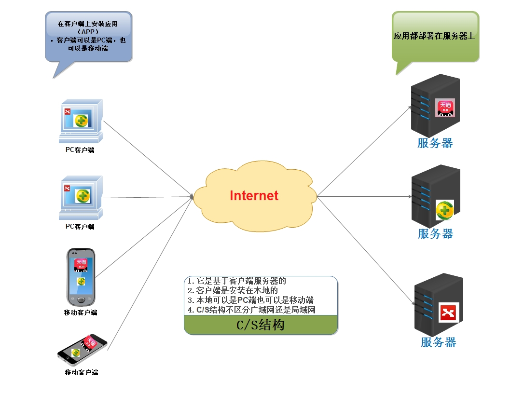

B/S结构是浏览器—服务器的方式。B代表Browser，S代表服务器。B/S结构的系统设计图如下：

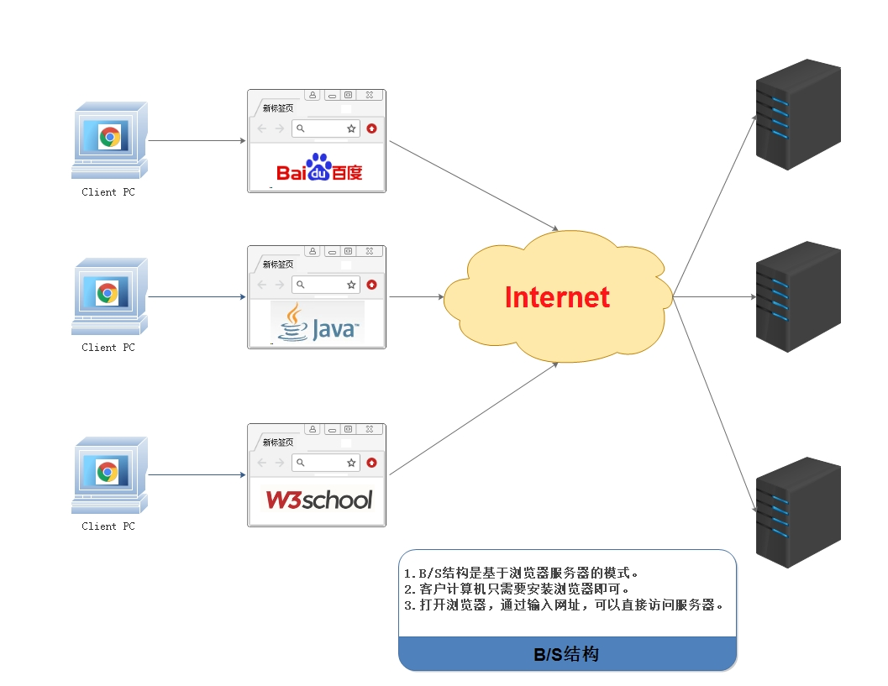

两种结构的区别及优劣

区别：

第一：硬件环境不同，C/S通常是建立在专用的网络或小范围的网络环境上（即局域网），且必须要安装客户端。而B/S是建立在广域网上的，适应范围强，通常有操作系统和浏览器就行。

第二：C/S结构比B/S结构更安全，因为用户群相对固定，对信息的保护更强。

第三：B/S结构维护升级比较简单，而C/S结构维护升级相对困难。

优劣

C/S：能充分发挥客户端PC的处理能力，很多工作可以在客户端处理后再提交给服务器。对应的优点就是客户端响应速度快。

B/S：总体拥有成本低、维护方便、 分布性强、开发简单，可以不用安装任何专门的软件就能实现在任何地方进行操作，客户端零维护，系统的扩展非常容易，只要有一台能上网的电脑就能使用。

我们的课程中涉及的系统结构都是是基于B/S结构

**Tomcat**

**服务器**

服务器的概念非常的广泛，它可以指代一台特殊的计算机（相比普通计算机运行更快、负载更高、价格更贵），也可以指代用于部署网站的应用。我们这里说的服务器，其实是web服务器，或者应用服务器。它本质就是一个软件，一个应用。作用就是发布我们的应用（工程），让用户可以通过浏览器访问我们的应用。

常见的应用服务器，请看下表：

|             |                                                       |
|-------------|-------------------------------------------------------|
| 服务器名称  | 说明                                                  |
| weblogic    | 实现了 JavaEE 规范，重量级服务器，又称为 JavaEE 容器  |
| websphereAS | 实现了 JavaEE 规范，重量级服务器。                    |
| JBOSSAS     | 实现了 JavaEE 规范，重量级服务器，免费                |
| Tomcat      | 实现了 jsp/servlet 规范，是一个轻量级服务器，开源免费 |

**基本介绍**

**Windows安装**

下载地址：http://tomcat.apache.org/

目录结构详解：

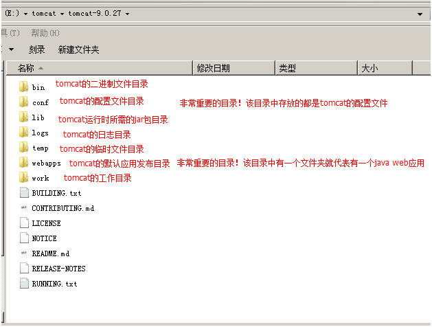

**Linux安装**

解压apache-tomcat-8.5.32.tar.gz。

防火墙设置

方式1：service iptables stop 关闭防火墙(不建议); 用到哪一个端口号就放行哪一个(80,8080,3306...)

方式2：放行8080 端口

修改配置文件 cd /etc/sysconfig --\> vi iptables  
-A INPUT -m state --state NEW -m tcp -p tcp --dport 8080 -j ACCEPT

重启加载防火墙或者重启防火墙 service iptables reload 或者 service iptables restart

**启动停止**

Tomcat服务器的启动文件在二进制文件目录bin中：startup.bat，startup.sh

Tomcat服务器的停止文件也在二进制文件目录bin中：shutdown.bat，shutdown.sh （推荐直接关闭控制台）

其中 .bat 文件是针对windows系统的运行程序， .sh 文件是针对linux系统的运行程序。

**常见问题**

启动一闪而过

没有配置环境变量，配置上 JAVA_HOME 环境变量。

Tomcat 启动后控制台输出乱码

打开 /conf/logging.properties ，设置 gbk java.util.logging.ConsoleHandler.encoding = gbk

Address already in use : JVM_Bind：端口被占用，找到占用该端口的应用

进程不重要：使用cmd命令：netstat -a -o 查看 pid 在任务管理器中结束占用端口的进程

进程很重要：修改自己的端口号。修改的是 Tomcat 目录下 \conf\server.xml 中的配置。

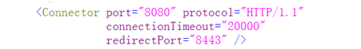

**IDEA集成**

Run -\> Edit Configurations -\> Templates -\> Tomcat Server -\> Local

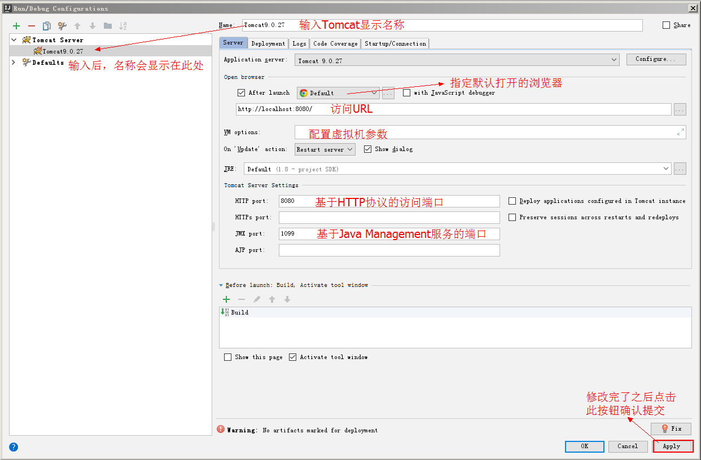

**发布应用**

**虚拟目录**

在 server.xml 的 \<Host\> 元素中加一个 \<Context path="" docBase=""/\> 元素

path ：访问资源URI，URI名称可以随便起，但是必须在前面加上一个/

docBase ：资源所在的磁盘物理地址

**虚拟主机**

在 \<Engine\> 元素中添加一个 \<Host name="" appBase="" unparkWARs="" autoDeploy="" /\> ，其中：

name ：指定主机的名称

appBase ：当前主机的应用发布目录

unparkWARs ：启动时是否自动解压war包

autoDeploy ：是否自动发布

<table>
<colgroup>
<col style="width: 100%" />
</colgroup>
<tbody>
<tr class="odd">
<td>XML 
&lt;Host name="www.itcast.cn" appBase="D:\itcastapps" unpackWARs="true" autoDeploy="true"/&gt; 
 
&lt;Host name="www.itheima.com" appBase="D:\itheimaapps" unpackWARs="true" autoDeploy="true"/&gt;</td>
</tr>
</tbody>
</table>

**IDEA部署**

新建工程

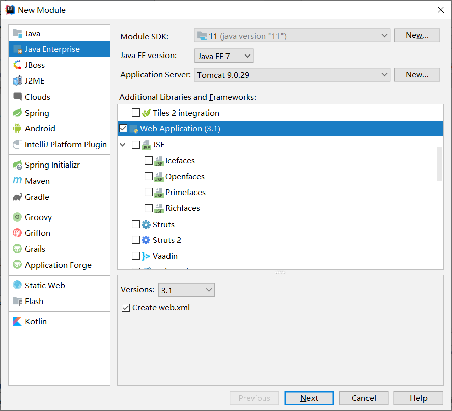

发布工程

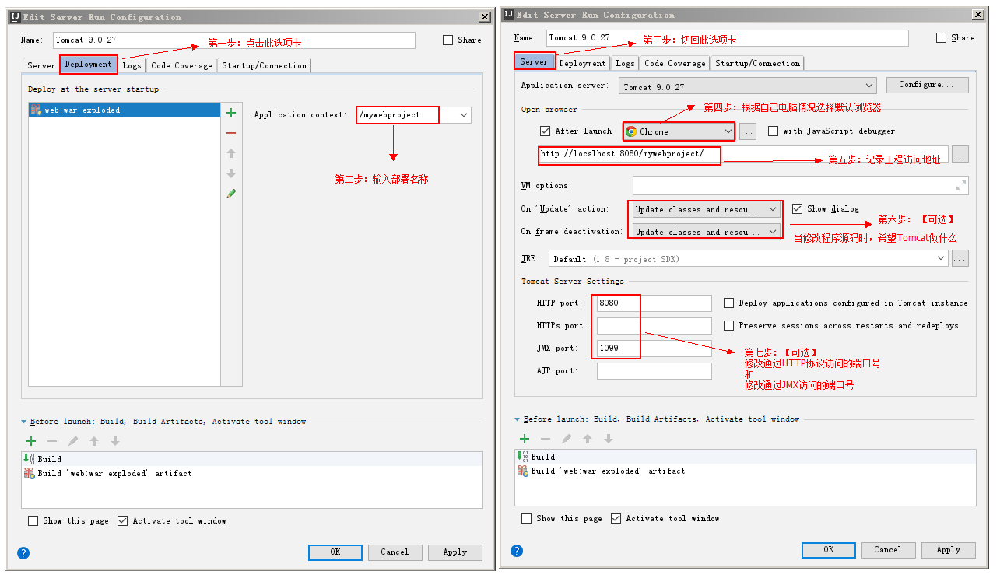

Run

**IDEA发布**

把资源移动到 Tomcat 工程下 web 目录中，两种访问方式

直接访问：http://localhost:8080/Tomcat/login/login.html

在 web.xml 中配置默认主页

<table>
<colgroup>
<col style="width: 100%" />
</colgroup>
<tbody>
<tr class="odd">
<td>XML 
&lt;welcome-file-list&gt; 
&lt;welcome-file&gt;/默认主页&lt;/welcome-file&gt; 
&lt;/welcome-file-list&gt;</td>
</tr>
</tbody>
</table>

**执行原理**

**整体架构**

Tomcat 核心组件架构图如下所示：

组件介绍：

GlobalNamingResources：实现 JNDI，指定一些资源的配置信息

Server：Tomcat 是一个 Servlet 容器，一个 Tomcat 对应一个 Server，一个 Server 可以包含多个 Service

Service：核心服务是 Catalina，用来对请求进行处理，一个 Service 包含多个 Connector 和一个 Container

Connector：连接器，负责处理客户端请求，解析不同协议及 I/O 方式

Executor：线程池

Container：容易包含 Engine，Host，Context，Wrapper 等组件

Engine：服务交给引擎处理请求，Container 容器中顶层的容器对象，一个 Engine 可以包含多个 Host 主机

Host：Engine 容器的子容器，一个 Host 对应一个网络域名，一个 Host 包含多个 Context

Context：Host 容器的子容器，表示一个 Web 应用

Wrapper：Tomcat 中的最小容器单元，表示 Web 应用中的 Servlet

核心类库：

Coyote：Tomcat 连接器的名称，封装了底层的网络通信，为 Catalina 容器提供了统一的接口，使容器与具体的协议以及 I/O 解耦

EndPoint：Coyote 通信端点，即通信监听的接口，是 Socket 接收和发送处理器，是对传输层的抽象，用来实现 TCP/IP 协议

Processor ： Coyote 协议处理接口，用来实现 HTTP 协议，Processor 接收来自 EndPoint 的 Socket，读取字节流解析成 Tomcat 的 Request 和 Response 对象，并通过 Adapter 将其提交到容器处理，Processor 是对应用层协议的抽象

CoyoteAdapter：适配器，连接器调用 CoyoteAdapter 的 sevice 方法，传入的是 TomcatRequest 对象，CoyoteAdapter 负责将TomcatRequest 转成 ServletRequest，再调用容器的 service 方法

参考文章：https://www.jianshu.com/p/7c9401b85704

参考文章：https://www.yuque.com/yinhuidong/yu877c/ktq82e

**启动过程**

Tomcat 的启动入口是 Bootstrap#main 函数，首先通过调用 bootstrap.init() 初始化相关组件：

initClassLoaders() ：初始化三个类加载器，commonLoader 的父类加载器是启动类加载器

Thread.currentThread().setContextClassLoader(catalinaLoader) ：自定义类加载器加载 Catalina 类， **打破双亲委派**

Object startupInstance = startupClass.getConstructor().newInstance() ：反射创建 Catalina 对象

method.invoke(startupInstance, paramValues) ：反射调用方法，设置父类加载器是 sharedLoader

catalinaDaemon = startupInstance ：引用 Catalina 对象

daemon.load(args) 方法反射调用 Catalina 对象的 load 方法，对 **服务器的组件进行初始化** ，并绑定了 ServerSocket 的端口：

parseServerXml(true) ：解析 XML 配置文件

getServer().init() ：服务器执行初始化，采用责任链的执行方式

LifecycleBase.init() ：生命周期接口的初始化方法，开始链式调用

StandardServer.initInternal() ：Server 的初始化，遍历所有的 Service 进行初始化

StandardService.initInternal() ：Service 的初始化，对 Engine、Executor、listener、Connector 进行初始化

StandardEngine.initInternal() ：Engine 的初始化

getRealm() ：创建一个 Realm 对象

ContainerBase.initInternal() ：容器的初始化，设置处理容器内组件的启动和停止事件的线程池

Connector.initInternal() ：Connector 的初始化

<table>
<colgroup>
<col style="width: 100%" />
</colgroup>
<tbody>
<tr class="odd">
<td>Java 
public Connector() { 
this("HTTP/1.1"); //默认无参构造方法，会创建出 Http11NioProtocol 的协议处理器 
}</td>
</tr>
</tbody>
</table>

adapter = new CoyoteAdapter(this) ：实例化 CoyoteAdapter 对象

protocolHandler.setAdapter(adapter) ：设置到 ProtocolHandler 协议处理器中

ProtocolHandler.init() ：协议处理器的初始化，底层调用 AbstractProtocol#init 方法

endpoint.init() ：端口的初始化，底层调用 AbstractEndpoint#init 方法

NioEndpoint.bind() ：绑定方法

initServerSocket() ： **初始化 ServerSocket** ，以 NIO 的方式监听端口

serverSock = ServerSocketChannel.open() ： **NIO 的方式打开通道**

serverSock.bind(addr, getAcceptCount()) ：通道绑定连接端口

serverSock.configureBlocking(true) ：切换为阻塞模式（没懂，为什么阻塞）

initialiseSsl() ：初始化 SSL 连接

selectorPool.open(getName()) ：打开选择器，类似 NIO 的多路复用器

初始化完所有的组件，调用 daemon.start() 进行 **组件的启动** ，底层反射调用 Catalina 对象的 start 方法：

getServer().start() ：启动组件，也是责任链的模式

LifecycleBase.start() ：生命周期接口的初始化方法，开始链式调用

StandardServer.startInternal() ：Server 服务的启动

globalNamingResources.start() ：启动 JNDI 服务

for (Service service : services) ：遍历所有的 Service 进行启动

StandardService.startInternal() ：Service 的启动，对所有 Executor、listener、Connector 进行启

StandardEngine.startInternal() ：启动引擎，部署项目

ContainerBase.startInternal() ：容器的启动

启动集群、Realm 组件，并且创建子容器，提交给线程池

((Lifecycle) pipeline).start() ：遍历所有的管道进行启动

Valve current = first ：获取第一个阀门

((Lifecycle) current).start() ：启动阀门，底层 ValveBase#startInternal 中设置启动的状态

current = current.getNext() ：获取下一个阀门

Connector.startInternal() ：Connector 的初始化

protocolHandler.start() ：协议处理器的启动

endpoint.start() ：端点启动

NioEndpoint.startInternal() ：启动 NIO 的端点

createExecutor() ：创建 Worker 线程组，10 个线程，用来进行任务处理

initializeConnectionLatch() ：用来进行连接限流， **最大 8\*1024 条连接**

poller = new Poller() ： **创建 Poller 对象** ，开启了一个多路复用器 Selector

Thread pollerThread = new Thread(poller, getName() + "-ClientPoller") ：创建并启动 Poller 线程，Poller 实现了 Runnable 接口，是一个任务对象， **线程 start 后进入 Poller#run 方法**

pollerThread.setDaemon(true) ：设置为守护线程

startAcceptorThread() ：启动接收者线程

acceptor = new Acceptor\<\>(this) ： **创建 Acceptor 对象**

Thread t = new Thread(acceptor, threadName) ：创建并启动 Acceptor 接受者线程

**处理过程**

Acceptor 监听客户端套接字，每 50ms 调用一次 **serverSocket.accept** ，获取 Socket 后把封装成 NioSocketWrapper（是 SocketWrapperBase 的子类），并设置为非阻塞模式，把 NioSocketWrapper 封装成 PollerEvent 放入同步队列中

Poller 循环判断同步队列中是否有就绪的事件，如果有则通过 selector.selectedKeys() 获取就绪事件，获取 SocketChannel 中携带的 attachment（NioSocketWrapper），在 processKey 方法中根据事件类型进行 processSocket，将 Wrapper 对象封装成 SocketProcessor 对象，该对象是一个任务对象，提交到 Worker 线程池进行执行

SocketProcessorBase.run() 加锁调用 SocketProcessor#doRun ，保证线程安全，从协议处理器 ProtocolHandler 中获取 AbstractProtocol，然后 **创建 Http11Processor 对象处理请求**

Http11Processor#service 中调用 CoyoteAdapter#service ，把生成的 Tomcat 下的 Request 和 Response 对象通过方法 postParseRequest 匹配到对应的 Servlet 的请求响应，将请求传递到对应的 Engine 容器中调用 Pipeline，管道中包含若干个 Valve，执行完所有的 Valve 最后执行 StandardEngineValve，继续调用 Host 容器的 Pipeline，执行 Host 的 Valve，再传递给 Context 的 Pipeline，最后传递到 Wrapper 容器

StandardWrapperValve#invoke 中创建了 Servlet 对象并执行初始化，并为当前请求准备一个 FilterChain 过滤器链执行 doFilter 方法， ApplicationFilterChain#doFilter 是一个 **责任链的驱动方法** ，通过调用 internalDoFilter 来获取过滤器链的下一个过滤器执行 doFilter，执行完所有的过滤器后执行 servlet.service 的方法

最后调用 HttpServlet#service()，根据请求的方法来调用 doGet、doPost 等，执行到自定义的业务方法

**Servlet**

**Socket**

Socket 是使用 TCP/IP 或者 UDP 协议在服务器与客户端之间进行传输的技术，是网络编程的基础

**Servlet 是使用 HTTP 协议在服务器与客户端之间通信的技术，是 Socket 的一种应用**

**HTTP 协议：是在 TCP/IP 协议之上进一步封装的一层协议，关注数据传输的格式是否规范，底层的数据传输还是运用了 Socket 和 TCP/IP**

Tomcat 和 Servlet 的关系：Servlet 的运行环境叫做 Web 容器或 Servlet 服务器， **Tomcat 是 Web 应用服务器，是一个 Servlet/JSP 容器** 。Tomcat 作为 Servlet 容器，负责处理客户请求，把请求传送给 Servlet，并将 Servlet 的响应传送回给客户。而 Servlet 是一种运行在支持 Java 语言的服务器上的组件，Servlet 用来扩展 Java Web 服务器功能，提供非常安全的、可移植的、易于使用的 CGI 替代品

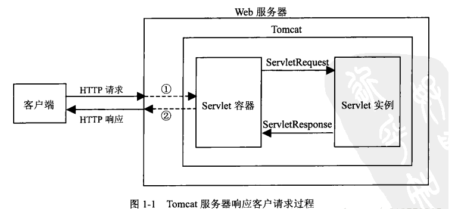

**基本介绍**

**Servlet类**

Servlet是SUN公司提供的一套规范，名称就叫Servlet规范，它也是JavaEE规范之一。通过API来使用Servlet。

Servlet是一个运行在web服务端的java小程序，用于接收和响应客户端的请求。一个服务器包含多个Servlet

通过实现Servlet接口，继承GenericServlet或者HttpServlet，实现Servlet功能

每次请求都会执行service方法，在service方法中还有参数ServletRequest和ServletResponse

支持配置相关功能

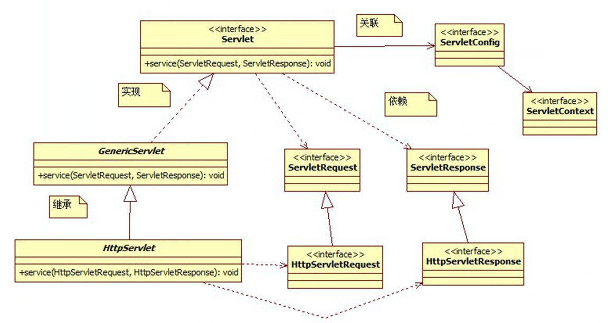

**执行流程**

创建 Web 工程 → 编写普通类继承 Servlet 相关类 → 重写方法

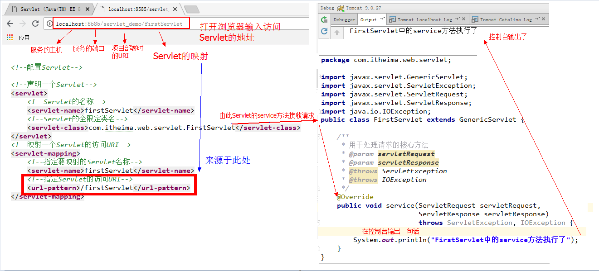

Servlet执行过程分析：

通过浏览器发送请求，请求首先到达Tomcat服务器，由服务器解析请求URL，然后在部署的应用列表中找到应用。然后找到web.xml配置文件，在web.xml中找到FirstServlet的配置（/），找到后执行service方法，最后由FirstServlet响应客户浏览器。整个过程如下图所示：

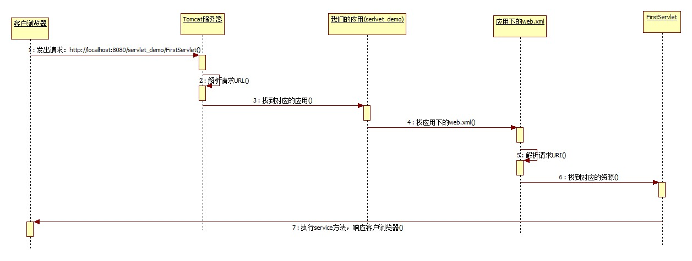

**实现方式**

实现 Servlet 功能时，可以选择以下三种方式：

第一种：实现 Servlet 接口，接口中的方法必须全部实现。 使用此种方式，表示接口中的所有方法在需求方面都有重写的必要。此种方式支持最大程度的自定义。

第二种：继承 GenericServlet，service 方法必须重写，其他方可根据需求，选择性重写。 使用此种方式，表示只在接收和响应客户端请求这方面有重写的需求，而其他方法可根据实际需求选择性重写，使我们的开发Servlet变得简单。但是，此种方式是和 HTTP 协议无关的。

第三种：继承 HttpServlet，它是 javax.servlet.http 包下的一个抽象类，是 GenericServlet 的子类。选择继承 HttpServlet 时， **需要重写 doGet 和 doPost 方法** ，来接收 get 方式和 post 方式的请求，不要覆盖 service 方法。使用此种方式，表示我们的请求和响应需要和 HTTP 协议相关，我们是通过 HTTP 协议来访问。每次请求和响应都符合 HTTP 协议的规范。请求的方式就是 HTTP 协议所支持的方式（GET POST PUT DELETE TRACE OPTIONS HEAD )。

**相关问题**

**异步处理**

Servlet 3.0 中的异步处理指的是允许Servlet重新发起一条新线程去调用 耗时业务方法，这样就可以避免等待

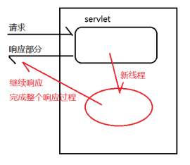

**生命周期**

servlet从创建到销毁的过程：

出生：（初始化）请求第一次到达 Servlet 时，创建对象，并且初始化成功。Only one time

活着：（服务）服务器提供服务的整个过程中，该对象一直存在，每次只是执行 service 方法

死亡：（销毁）当服务停止时，或者服务器宕机时，对象删除，

serrvlet生命周期方法: init(ServletConfig config) → service(ServletRequest req, ServletResponse res) → destroy()

默认情况下, 有了第一次请求, 会调用 init() 方法进行初始化【调用一次】，任何一次请求，都会调用 service() 方法处理这个请求，服务器正常关闭或者项目从服务器移除, 调用 destory() 方法进行销毁【调用一次】

**扩展** ：servlet 是单例多线程的，尽量不要在 servlet 里面使用全局(成员)变量，可能会导致线程不安全

单例：Servlet 对象只会创建一次，销毁一次，Servlet 对象只有一个实例。

多线程：服务器会针对每次请求, 开启一个线程调用 service() 方法处理这个请求

**线程安全**

Servlet运用了单例模式，整个应用中只有一个实例对象，所以需要分析这个唯一的实例中的类成员是否线程安全

<table>
<colgroup>
<col style="width: 100%" />
</colgroup>
<tbody>
<tr class="odd">
<td>Java 
public class ServletDemo extends HttpServlet{ 
//1.定义用户名成员变量 
//private String username = null; 
@Override 
protected void doGet(HttpServletRequest req, HttpServletResponse resp) throws ServletException, IOException { 
String username = null; 
//synchronized (this) { 
//2.获取用户名 
username = req.getParameter("username"); 
try { 
Thread.sleep(3000); 
} catch (InterruptedException e) { 
e.printStackTrace(); 
} 
//3.获取输出流对象 
PrintWriter pw = resp.getWriter(); 
//4.响应给客户端浏览器 
pw.print("Welcome:" + username); 
//5.关流 
pw.close(); 
//} 
} 
 
@Override 
protected void doPost(HttpServletRequest req, HttpServletResponse resp) throws ServletException, IOException { 
doGet(req,resp); 
} 
}</td>
</tr>
</tbody>
</table>

启动两个浏览器，输入不同的参数(http://localhost:8080/ServletDemo/username=aaa 或者bbb)，访问之后发现输出的结果都是一样，所以出现线程安全问题。

在Servlet中定义了类成员之后，多个浏览器都会共享类成员的数据，其中任何一个线程修改了数据，都会影响其他线程。因此，我们可以认为Servlet它不是线程安全的。因为Servlet是单例，单例对象的类成员只会随类实例化时初始化一次，之后的操作都是改变，而不会重新初始化。

解决办法：如果类成员是共用的，只在初始化时赋值，其余时间都是获取。或者加锁synchronized

**映射方式**

Servlet支持三种映射方式，三种映射方式的优先级为：第一种\>第二种\>第三种。

具体名称方式 这种方式，只有和映射配置一模一样时，Servlet才会接收和响应来自客户端的请求。 访问URL：http://localhost:8080/servlet/servletDemo

<table>
<colgroup>
<col style="width: 100%" />
</colgroup>
<tbody>
<tr class="odd">
<td>XML 
&lt;servlet&gt; 
&lt;servlet-name&gt;servletDemo&lt;/servlet-name&gt; 
&lt;servlet-class&gt;com.itheima.servlet.ServletDemo&lt;/servlet-class&gt; 
&lt;/servlet&gt; 
&lt;servlet-mapping&gt; 
&lt;servlet-name&gt;servletDemo&lt;/servlet-name&gt; 
&lt;url-pattern&gt;/servletDemo&lt;/url-pattern&gt; 
&lt;/servlet-mapping&gt;</td>
</tr>
</tbody>
</table>

/开头+通配符的方式 这种方式，只要符合目录结构即可，不用考虑结尾是什么 访问URL：http://localhost:8080/servlet/ + 任何字符

<table>
<colgroup>
<col style="width: 100%" />
</colgroup>
<tbody>
<tr class="odd">
<td>XML 
&lt;servlet&gt; 
&lt;servlet-name&gt;servletDemo&lt;/servlet-name&gt; 
&lt;servlet-class&gt;com.itheima.servlet.ServletDemo&lt;/servlet-class&gt; 
&lt;/servlet&gt; 
&lt;servlet-mapping&gt; 
&lt;servlet-name&gt;servletDemo&lt;/servlet-name&gt; 
&lt;url-pattern&gt;/servlet/*&lt;/url-pattern&gt; 
&lt;/servlet-mapping&gt;</td>
</tr>
</tbody>
</table>

通配符+固定格式结尾 这种方式，只要符合固定结尾格式即可，其前面的访问URI无须关心（注意协议，主机和端口必须正确） 访问URL：http://localhost:8080/任何字符任何目录 + .do (http://localhost:8080/seazean/i.do)

<table>
<colgroup>
<col style="width: 100%" />
</colgroup>
<tbody>
<tr class="odd">
<td>XML 
&lt;servlet&gt; 
&lt;servlet-name&gt;servletDemo05&lt;/servlet-name&gt; 
&lt;servlet-class&gt;com.itheima.servlet.ServletDemo05&lt;/servlet-class&gt; 
&lt;/servlet&gt; 
&lt;servlet-mapping&gt; 
&lt;servlet-name&gt;servletDemo05&lt;/servlet-name&gt; 
&lt;url-pattern&gt;*.do&lt;/url-pattern&gt; 
&lt;/servlet-mapping&gt;</td>
</tr>
</tbody>
</table>

**多路径映射**

一个Servlet的多种路径配置的支持。给一个Servlet配置多个访问映射，从而根据不同请求的URL实现不同的功能

<table>
<colgroup>
<col style="width: 100%" />
</colgroup>
<tbody>
<tr class="odd">
<td>Java 
/*多路映射*/ 
public class ServletDemo06 extends HttpServlet { 
@Override 
protected void doGet(HttpServletRequest req, HttpServletResponse resp) throws ServletException, IOException { 
int money = 1000; 
//获取访问的资源路径 
String name = req.getRequestURI(); 
name = name.substring(name.lastIndexOf("/")); 
 
if("/vip".equals(name)) { 
//如果访问资源路径是/vip 商品价格为9折 
System.out.println("商品原价为：" + money + "。优惠后是：" + (money*0.9)); 
} else if("/svip".equals(name)) { 
//如果访问资源路径是/svip 商品价格为5折 
System.out.println("商品原价为：" + money + "。优惠后是：" + (money*0.5)); 
} else { 
//如果访问资源路径是其他 商品价格原样显示 
System.out.println("商品价格为：" + money); 
} 
} 
 
@Override 
protected void doPost(HttpServletRequest req, HttpServletResponse resp) throws ServletException, IOException { 
doGet(req,resp); 
} 
}</td>
</tr>
</tbody>
</table>

<table>
<colgroup>
<col style="width: 100%" />
</colgroup>
<tbody>
<tr class="odd">
<td>XML 
&lt;!--演示Servlet多路径映射--&gt; 
&lt;servlet&gt; 
&lt;servlet-name&gt;vip&lt;/servlet-name&gt; 
&lt;servlet-class&gt;com.itheima.servlet.ServletDemo06&lt;/servlet-class&gt; 
&lt;/servlet&gt; 
&lt;servlet-mapping&gt; 
&lt;servlet-name&gt;vip&lt;/servlet-name&gt; 
&lt;url-pattern&gt;/vip&lt;/url-pattern&gt; 
&lt;/servlet-mapping&gt; 
&lt;servlet&gt; 
&lt;servlet-name&gt;svip&lt;/servlet-name&gt; 
&lt;servlet-class&gt;com.itheima.servlet.ServletDemo06&lt;/servlet-class&gt; 
&lt;/servlet&gt; 
&lt;servlet-mapping&gt; 
&lt;servlet-name&gt;svip&lt;/servlet-name&gt; 
&lt;url-pattern&gt;/svip&lt;/url-pattern&gt; 
&lt;/servlet-mapping&gt; 
&lt;servlet&gt; 
&lt;servlet-name&gt;other&lt;/servlet-name&gt; 
&lt;servlet-class&gt;com.itheima.servlet.ServletDemo06&lt;/servlet-class&gt; 
&lt;/servlet&gt; 
&lt;servlet-mapping&gt; 
&lt;servlet-name&gt;other&lt;/servlet-name&gt; 
&lt;url-pattern&gt;/other&lt;/url-pattern&gt; 
&lt;/servlet-mapping&gt;</td>
</tr>
</tbody>
</table>

这样就可以根据不同的网页显示不同的数据。

**启动时创建**

第一种：应用加载时创建Servlet，它的优势是在服务器启动时，就把需要的对象都创建完成了，从而在使用的时候减少了创建对象的时间，提高了首次执行的效率。它的弊端是在应用加载时就创建了Servlet对象，因此，导致内存中充斥着大量用不上的Servlet对象，造成了内存的浪费。

第二种：请求第一次访问是创建Servlet，它的优势就是减少了对服务器内存的浪费，因为一直没有被访问过的Servlet对象都没有创建，因此也提高了服务器的启动时间。而它的弊端就是要在应用加载时就做的初始化操作，它都没法完成，从而要考虑其他技术实现。

在web.xml中是支持对Servlet的创建时机进行配置的，配置的方式如下：

<table>
<colgroup>
<col style="width: 100%" />
</colgroup>
<tbody>
<tr class="odd">
<td>XML 
&lt;!--配置ServletDemo3--&gt; 
&lt;servlet&gt; 
&lt;servlet-name&gt;servletDemo&lt;/servlet-name&gt; 
&lt;servlet-class&gt;com.itheima.web.servlet.ServletDemo&lt;/servlet-class&gt; 
&lt;!--配置Servlet的创建顺序，当配置此标签时，Servlet就会改为应用加载时创建 
配置项的取值只能是正整数（包括0），数值越小，表明创建的优先级越高--&gt; 
&lt;load-on-startup&gt;1&lt;/load-on-startup&gt; 
&lt;/servlet&gt; 
&lt;servlet-mapping&gt; 
&lt;servlet-name&gt;servletDemo&lt;/servlet-name&gt; 
&lt;url-pattern&gt;/servletDemo&lt;/url-pattern&gt; 
&lt;/servlet-mapping&gt;</td>
</tr>
</tbody>
</table>

**默认Servlet**

默认 Servlet 是由服务器提供的一个 Servlet，它配置在 Tomcat 的 conf 目录下的 web.xml 中。

它的映射路径是 \<url-pattern\>/\<url-pattern\> ，我们在发送请求时，首先会在我们应用中的 web.xml 中查找映射配置。但是当找不到对应的 Servlet 路径时，就去找默认的 Servlet，由默认 Servlet 处理。

**ServletConfig**

ServletConfig 是 Servlet 的配置参数对象。在 Servlet 规范中，允许为每个 Servlet 都提供一些初始化配置，每个 Servlet 都有自己的ServletConfig，作用是 **在 Servlet 初始化期间，把一些配置信息传递给 Servlet**

生命周期：在初始化阶段读取了 web.xml 中为 Servlet 准备的初始化配置，并把配置信息传递给 Servlet，所以生命周期与 Servlet 相同。如果 Servlet 配置了 \<load-on-startup\>1\</load-on-startup\> ，ServletConfig 也会在应用加载时创建。

获取 ServletConfig：在 init 方法中为 ServletConfig 赋值

常用API：

String getInitParameter(String name) ：根据初始化参数的名称获取参数的值，根据，获取

Enumeration\<String\> getInitParameterNames() : 获取所有初始化参数名称的枚举(遍历方式看例子)

ServletContext getServletContext() : 获取 **ServletContext** 对象

String getServletName() : 获取Servlet名称

代码实现：

web.xml 配置： 初始化参数使用 \<servlet\> 标签中的 \<init-param\> 标签来配置，并且每个 Servlet 都支持有多个初始化参数，并且初始化参数都是以键值对的形式存在的

<table>
<colgroup>
<col style="width: 100%" />
</colgroup>
<tbody>
<tr class="odd">
<td>XML 
&lt;!--配置ServletDemo8--&gt; 
&lt;servlet&gt; 
&lt;servlet-name&gt;servletDemo8&lt;/servlet-name&gt; 
&lt;servlet-class&gt;com.itheima.web.servlet.ServletDemo8&lt;/servlet-class&gt; 
&lt;!--配置初始化参数--&gt; 
&lt;init-param&gt; 
&lt;!--用于获取初始化参数的key--&gt; 
&lt;param-name&gt;encoding&lt;/param-name&gt; 
&lt;!--初始化参数的值--&gt; 
&lt;param-value&gt;UTF-8&lt;/param-value&gt; 
&lt;/init-param&gt; 
&lt;!--每个初始化参数都需要用到init-param标签--&gt; 
&lt;init-param&gt; 
&lt;param-name&gt;servletInfo&lt;/param-name&gt; 
&lt;param-value&gt;This is Demo8&lt;/param-value&gt; 
&lt;/init-param&gt; 
&lt;/servlet&gt; 
&lt;servlet-mapping&gt; 
&lt;servlet-name&gt;servletDemo8&lt;/servlet-name&gt; 
&lt;url-pattern&gt;/servletDemo8&lt;/url-pattern&gt; 
&lt;/servlet-mapping&gt;</td>
</tr>
</tbody>
</table>

代码：

<table>
<colgroup>
<col style="width: 100%" />
</colgroup>
<tbody>
<tr class="odd">
<td>Java 
//演示Servlet的初始化参数对象 
public class ServletDemo8 extends HttpServlet { 
//定义Servlet配置对象ServletConfig 
private ServletConfig servletConfig; 
 
//在初始化时为ServletConfig赋值 
@Override 
public void init(ServletConfig config) throws ServletException { 
this.servletConfig = config; 
} 
/** 
* doGet方法输出一句话 
*/ 
@Override 
protected void doGet(HttpServletRequest req, HttpServletResponse resp) throws ServletException, IOException { 
//1.输出ServletConfig 
System.out.println(servletConfig); 
//2.获取Servlet的名称 
String servletName= servletConfig.getServletName(); 
System.out.println(servletName); 
//3.获取字符集编码 
String encoding = servletConfig.getInitParameter("encoding"); 
System.out.println(encoding); 
//4.获取所有初始化参数名称的枚举 
Enumeration&lt;String&gt; names = servletConfig.getInitParameterNames(); 
//遍历names 
while(names.hasMoreElements()){ 
//取出每个name 
String name = names.nextElement(); 
//根据key获取value 
String value = servletConfig.getInitParameter(name); 
System.out.println("name:"+name+",value:"+value); 
} 
//5.获取ServletContext对象 
ServletContext servletContext = servletConfig.getServletContext(); 
System.out.println(servletContext); 
} 
 
//调用doGet方法 
@Override 
protected void doPost(HttpServletRequest req, HttpServletResponse resp) throws ServletException, IOException { 
doGet(req,resp); 
} 
}</td>
</tr>
</tbody>
</table>

效果：

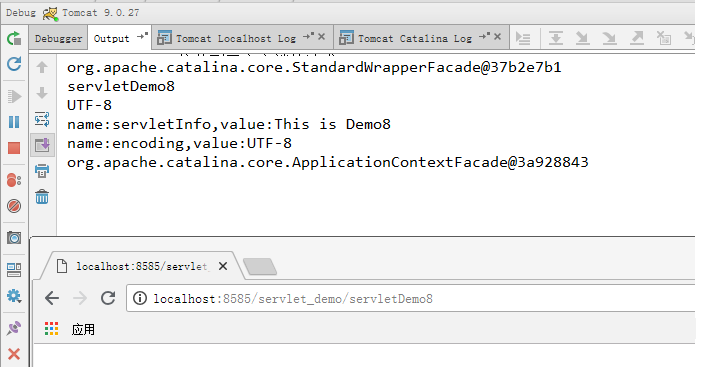

**ServletContext**

ServletContext 对象是应用上下文对象。服务器为每一个应用都创建了一个 ServletContext 对象，ServletContext 属于整个应用，不局限于某个 Servlet，可以实现让应用中所有 Servlet 间的数据共享。

上下文代表了程序当下所运行的环境，联系整个应用的生命周期与资源调用，是程序可以访问到的所有资源的总和，资源可以是一个变量，也可以是一个对象的引用

生命周期：

出生：应用一加载，该对象就被创建出来。一个应用只有一个实例对象（Servlet 和 ServletContext 都是单例的）

活着：只要应用一直提供服务，该对象就一直存在。

死亡：应用被卸载（或者服务器停止），该对象消亡。

域对象：指的是对象有作用域，即有作用范围，可以 **实现数据共享** ，不同作用范围的域对象，共享数据的能力不一样。

Servlet 规范中，共有4个域对象，ServletContext 是其中一个，web 应用中最大的作用域，叫 application 域，可以实现整个应用间的数据共享功能。

数据共享：

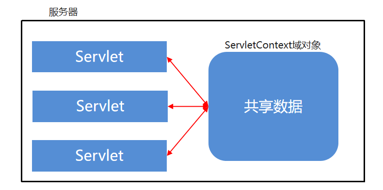

获取ServletContext：

Java 项目继承 HttpServlet，HttpServlet 继承 GenericServlet，GenericServlet 中有一个方法可以直接使用

<table>
<colgroup>
<col style="width: 100%" />
</colgroup>
<tbody>
<tr class="odd">
<td>Java 
public ServletContext getServletContext() { 
return this.getServletConfig().getServletContext(); 
}</td>
</tr>
</tbody>
</table>

ServletRequest 类方法：

<table>
<colgroup>
<col style="width: 100%" />
</colgroup>
<tbody>
<tr class="odd">
<td>Java 
ServletContext getServletContext()//获取ServletContext对象</td>
</tr>
</tbody>
</table>

常用API：

String getInitParameter(String name) : 根据名称获取全局配置的参数

String getContextPath : 获取当前应用访问的虚拟目录

String getRealPath(String path) : 根据虚拟目录获取应用部署的磁盘绝对路径

void setAttribute(String name, Object object) : 向应用域对象中存储数据

Object getAttribute(String name) : 根据名称获取域对象中的数据，没有则返回null

void removeAttribute(String name) : 根据名称移除应用域对象中的数据

代码实现：

web.xml配置： 配置的方式，需要在 \<web-app\> 标签中使用 \<context-param\> 来配置初始化参数，它的配置是针对整个应用的配置，被称为应用的初始化参数配置。

<table>
<colgroup>
<col style="width: 100%" />
</colgroup>
<tbody>
<tr class="odd">
<td>XML 
&lt;!--配置应用初始化参数--&gt; 
&lt;context-param&gt; 
&lt;!--用于获取初始化参数的key--&gt; 
&lt;param-name&gt;servletContextInfo&lt;/param-name&gt; 
&lt;!--初始化参数的值--&gt; 
&lt;param-value&gt;This is application scope&lt;/param-value&gt; 
&lt;/context-param&gt; 
&lt;!--每个应用初始化参数都需要用到context-param标签--&gt; 
&lt;context-param&gt; 
&lt;param-name&gt;globalEncoding&lt;/param-name&gt; 
&lt;param-value&gt;UTF-8&lt;/param-value&gt; 
&lt;/context-param&gt;</td>
</tr>
</tbody>
</table>

代码：

<table>
<colgroup>
<col style="width: 100%" />
</colgroup>
<tbody>
<tr class="odd">
<td>Java 
public class ServletContextDemo extends HttpServlet { 
@Override 
protected void doGet(HttpServletRequest req, HttpServletResponse resp) throws ServletException, IOException { 
//获取ServletContext对象 
ServletContext context = getServletContext(); 
 
//获取全局配置的globalEncoding 
String value = context.getInitParameter("globalEncoding"); 
System.out.println(value);//UTF-8 
 
//获取应用的访问虚拟目录 
String contextPath = context.getContextPath(); 
System.out.println(contextPath);//servlet 
 
//根据虚拟目录获取应用部署的磁盘绝对路径 
//获取b.txt文件的绝对路径 web目录下 
String b = context.getRealPath("/b.txt"); 
System.out.println(b); 
 
//获取c.txt文件的绝对路径 /WEB-INF目录下 
String c = context.getRealPath("/WEB-INF/c.txt"); 
System.out.println(c); 
 
//获取a.txt文件的绝对路径 //src目录下 
String a = context.getRealPath("/WEB-INF/classes/a.txt"); 
System.out.println(a); 
 
//向域对象中存储数据 
context.setAttribute("username","zhangsan"); 
 
//移除域对象中username的数据 
//context.removeAttribute("username"); 
} 
 
@Override 
protected void doPost(HttpServletRequest req, HttpServletResponse resp) throws ServletException, IOException { 
doGet(req,resp); 
} 
} 
 
//E:\Database\Java\Project\JavaEE\out\artifacts\Servlet_war_exploded\b.txt 
//E:\Database\Java\Project\JavaEE\out\artifacts\Servlet_war_exploded\WEB-INF\c.txt 
//E:\Database\Java\Project\JavaEE\out\artifacts\Servlet_war_exploded\WEB-INF\classes\a.txt</td>
</tr>
</tbody>
</table>

**注解开发**

Servlet3.0 版本！不需要配置 web.xml

注解案例

<table>
<colgroup>
<col style="width: 100%" />
</colgroup>
<tbody>
<tr class="odd">
<td>Java 
@WebServlet("/servletDemo1") 
public class ServletDemo1 extends HttpServlet { 
@Override 
protected void doGet(HttpServletRequest req, HttpServletResponse resp) throws ServletException, IOException { 
doPost(req,resp); 
} 
 
@Override 
protected void doPost(HttpServletRequest req, HttpServletResponse resp) throws ServletException, IOException { 
System.out.println("Servlet Demo1 Annotation"); 
} 
}</td>
</tr>
</tbody>
</table>

WebServlet注解（@since Servlet 3.0 (Section 8.1.1)）

<table>
<colgroup>
<col style="width: 100%" />
</colgroup>
<tbody>
<tr class="odd">
<td>Java 
@Target(ElementType.TYPE) 
@Retention(RetentionPolicy.RUNTIME) 
@Documented 
public @interface WebServlet { 
//指定Servlet的名称。相当于xml配置中&lt;servlet&gt;标签下的&lt;servlet-name&gt; 
String name() default ""; 
 
//用于映射Servlet访问的url映射，相当于xml配置时的&lt;url-pattern&gt; 
String[] value() default {}; 
 
//相当于xml配置时的&lt;url-pattern&gt; 
String[] urlPatterns() default {}; 
 
//用于配置Servlet的启动时机，相当于xml配置的&lt;load-on-startup&gt; 
int loadOnStartup() default -1; 
 
//用于配置Servlet的初始化参数，相当于xml配置的&lt;init-param&gt; 
WebInitParam[] initParams() default {}; 
 
//用于配置Servlet是否支持异步，相当于xml配置的&lt;async-supported&gt; 
boolean asyncSupported() default false; 
 
//用于指定Servlet的小图标 
String smallIcon() default ""; 
 
//用于指定Servlet的大图标 
String largeIcon() default ""; 
 
//用于指定Servlet的描述信息 
String description() default ""; 
 
//用于指定Servlet的显示名称 
String displayName() default ""; 
}</td>
</tr>
</tbody>
</table>

手动创建容器：（了解）

**Request**

**请求响应**

Web服务器收到客户端的http请求，会针对每一次请求，分别创建一个用于代表请求的request对象、和代表响应的response对象。

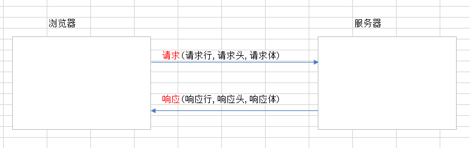

**请求对象**

请求：客户机希望从服务器端索取一些资源，向服务器发出询问

请求对象：在 JavaEE 工程中，用于发送请求的对象，常用的对象是 ServletRequest 和 HttpServletRequest ，它们的区是是否与 HTTP 协议有关

Request 作用：

操作请求三部分(行,头,体)

请求转发

作为域对象存数据

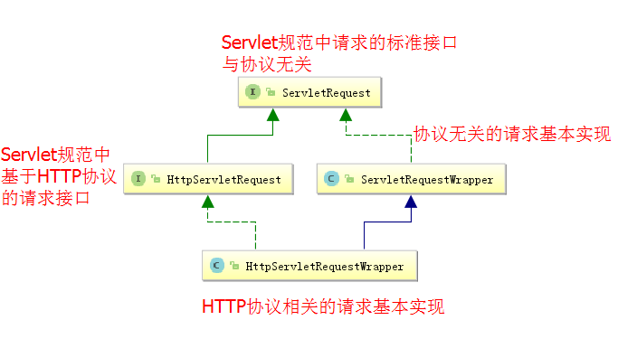

**请求路径**

|                                 |                                                                           |
|---------------------------------|---------------------------------------------------------------------------|
| 方法                            | 作用                                                                      |
| String getLocalAddr()           | 获取本机（服务器）地址                                                    |
| String getLocalName()           | 获取本机（服务器）名称                                                    |
| int getLocalPort()              | 获取本机（服务器）端口                                                    |
| String getRemoteAddr()          | 获取访问者IP                                                              |
| String getRemoteHost            | 获取访问者主机                                                            |
| int getRemotePort()             | 获取访问者端口                                                            |
| String getMethod();             | 获得请求方式                                                              |
| String getRequestURI()          | 获取统一资源标识符（/request/servletDemo01）                              |
| String getRequestURL()          | 获取统一资源定位符（http://localhost:8080/request/servletDemo01）         |
| String getQueryString()         | 获取请求消息的数据 （GET方式 URL中带参字符串：username=aaa&password=123） |
| String getContextPath()         | 获取虚拟目录名称（/request）                                              |
| String getServletPath           | 获取Servlet映射路径 （或@WebServlet值: /servletDemo01）                   |
| String getRealPath(String path) | 根据虚拟目录获取应用部署的磁盘绝对路径                                    |

URL = URI + HOST

URL = HOST + ContextPath + ServletPath

**获取请求头**

|                                     |                                                                   |
|-------------------------------------|-------------------------------------------------------------------|
| 方法                                | 作用                                                              |
| String getHeader(String name)       | 获得指定请求头的值。 如果没有该请求头返回null，有多个值返回第一个 |
| Enumeration getHeaders(String name) | 获取指定请求头的多个值                                            |
| Enumeration getHeaderNames()        | 获取所有请求头名称的枚举                                          |

<table>
<colgroup>
<col style="width: 100%" />
</colgroup>
<tbody>
<tr class="odd">
<td>Java 
@WebServlet("/servletDemo02") 
public class ServletDemo02 extends HttpServlet { 
@Override 
protected void doGet(HttpServletRequest req, HttpServletResponse resp) throws ServletException, IOException { 
//1.根据请求头名称获取一个值 
String connection = req.getHeader("connection"); 
System.out.println(connection);//keep-alive 
 
//2.根据请求头名称获取多个值 
Enumeration&lt;String&gt; values = req.getHeaders("accept-encoding"); 
while(values.hasMoreElements()) { 
String value = values.nextElement(); 
System.out.println(value);//gzip, deflate, br 
} 
} 
@Override 
protected void doPost(HttpServletRequest req, HttpServletResponse resp) throws ServletException, IOException { 
doGet(req,resp); 
} 
}</td>
</tr>
</tbody>
</table>

**请求参数**

**请求参数**

请求参数是正文部分标签内容，标签属性action="/request/servletDemo08"，服务器URI

|                                            |                                                                   |
|--------------------------------------------|-------------------------------------------------------------------|
| 法名                                       | 作用                                                              |
| String getParameter(String name)           | 获得指定参数名的值 如果没有该参数则返回null，如果有多个获得第一个 |
| String\[\] getParameterValues(String name) | 获得指定参数名所有的值。此方法为复选框提供的                      |
| Enumeration getParameterNames()            | 获得所有参数名                                                    |
| Map\<String,String\[\]\> getParameterMap() | 获得所有的请求参数键值对（key=value）                             |

**封装参数**

封装请求参数到类对象：

直接封装：有参构造或者set方法

<table>
<colgroup>
<col style="width: 100%" />
</colgroup>
<tbody>
<tr class="odd">
<td>Java 
@WebServlet("/servletDemo04") 
public class ServletDemo04 extends HttpServlet { 
@Override 
protected void doGet(HttpServletRequest req, HttpServletResponse resp) throws ServletException, IOException { 
//1.获取所有的数据 
String username = req.getParameter("username"); 
String password = req.getParameter("password"); 
String[] hobbies = req.getParameterValues("hobby"); 
 
//2.封装学生对象 
Student stu = new Student(username,password,hobbies); 
 
//3.输出对象 
System.out.println(stu); 
 
} 
 
@Override 
protected void doPost(HttpServletRequest req, HttpServletResponse resp) throws ServletException, IOException { 
doGet(req,resp); 
} 
}</td>
</tr>
</tbody>
</table>

<table>
<colgroup>
<col style="width: 100%" />
</colgroup>
<tbody>
<tr class="odd">
<td>Java 
public class Student { 
private String username; 
private String password; 
private String[] hobby; 
 
}</td>
</tr>
</tbody>
</table>

<table>
<colgroup>
<col style="width: 100%" />
</colgroup>
<tbody>
<tr class="odd">
<td>HTML 
&lt;!--register.html--&gt; 
&lt;!DOCTYPE html&gt; 
&lt;html lang="en"&gt; 
&lt;head&gt; 
&lt;meta charset="UTF-8"&gt; 
&lt;title&gt;注册页面&lt;/title&gt; 
&lt;/head&gt; 
&lt;body&gt; 
&lt;form action="/request/servletDemo05" method="get" autocomplete="off"&gt; 
姓名：&lt;input type="text" name="username"&gt; &lt;br&gt; 
密码：&lt;input type="password" name="password"&gt; &lt;br&gt; 
爱好：&lt;input type="checkbox" name="hobby" value="study"&gt;学习 
&lt;input type="checkbox" name="hobby" value="game"&gt;游戏 &lt;br&gt; 
&lt;button type="submit"&gt;注册&lt;/button&gt; 
&lt;/form&gt; 
&lt;/body&gt; 
&lt;/html&gt;</td>
</tr>
</tbody>
</table>

反射方式：

表单 \<input\> 标签的name属性取值，必须和实体类中定义的属性名称一致

<table>
<colgroup>
<col style="width: 100%" />
</colgroup>
<tbody>
<tr class="odd">
<td>Java 
protected void doGet(HttpServletRequest req, HttpServletResponse resp) throws ServletException, IOException { 
//1.获取请求正文的映射关系 
Map&lt;String, String[]&gt; map = req.getParameterMap(); 
//2.封装学生对象 
Student stu = new Student(); 
//2.1遍历集合 
for(String name : map.keySet()) { 
String[] value = map.get(name); 
try { 
//2.2获取Student对象的属性描述器 
//参数一：指定获取xxx属性的描述器 
//参数二：指定字节码文件 
PropertyDescriptor pd = new PropertyDescriptor(name,stu.getClass()); 
//2.3获取对应的setXxx方法 
Method writeMethod = pd.getWriteMethod(); 
//2.4执行方法 
if(value.length &gt; 1) { 
writeMethod.invoke(stu,(Object)value); 
}else { 
writeMethod.invoke(stu,value); 
} 
} catch (Exception e) { 
e.printStackTrace(); 
} 
} 
//3.输出对象 
System.out.println(stu); 
}</td>
</tr>
</tbody>
</table>

commons-beanutils封装

<table>
<colgroup>
<col style="width: 100%" />
</colgroup>
<tbody>
<tr class="odd">
<td>Java 
protected void doGet(HttpServletRequest req, HttpServletResponse resp) throws ServletException, IOException { 
//1.获取所有的数据 
Map&lt;String, String[]&gt; map = req.getParameterMap(); 
//2.封装学生对象 
Student stu = new Student(); 
try { 
BeanUtils.populate(stu,map); 
} catch (Exception e) { 
e.printStackTrace(); 
} 
//3.输出对象 
System.out.println(stu); 
 
}</td>
</tr>
</tbody>
</table>

**流获取数据**

ServletInputStream getInputStream() : 获取请求字节输入流对象 BufferedReader getReader() : 获取请求缓冲字符输入流对象

<table>
<colgroup>
<col style="width: 100%" />
</colgroup>
<tbody>
<tr class="odd">
<td>Java 
@WebServlet("/servletDemo07") 
public class ServletDemo07 extends HttpServlet { 
@Override 
protected void doGet(HttpServletRequest req, HttpServletResponse resp) throws ServletException, IOException { 
//字符流(必须是post方式) 
/*BufferedReader br = req.getReader(); 
String line; 
while((line = br.readLine()) != null) { 
System.out.println(line); 
}*/ 
//br.close(); 
//字节流 
ServletInputStream is = req.getInputStream(); 
byte[] arr = new byte[1024]; 
int len; 
while((len = is.read(arr)) != -1) { 
System.out.println(new String(arr,0,len)); 
} 
//is.close(); 
} 
 
@Override 
protected void doPost(HttpServletRequest req, HttpServletResponse resp) throws ServletException, IOException { 
doGet(req,resp); 
} 
}</td>
</tr>
</tbody>
</table>

<table>
<colgroup>
<col style="width: 100%" />
</colgroup>
<tbody>
<tr class="odd">
<td>HTML 
&lt;form action="/request/servletDemo07" method="get" autocomplete="off"&gt; 
&lt;/form&gt;</td>
</tr>
</tbody>
</table>

**请求域**

**请求域**

request 域：可以在一次请求范围内进行共享数据

|                                              |                              |
|----------------------------------------------|------------------------------|
| 方法                                         | 作用                         |
| void setAttribute(String name, Object value) | 向请求域对象中存储数据       |
| Object getAttribute(String name)             | 通过名称获取请求域对象的数据 |
| void removeAttribute(String name)            | 通过名称移除请求域对象的数据 |

**请求转发**

请求转发：客户端的一次请求到达后，需要借助其他 Servlet 来实现功能，进行请求转发。特点：

浏览器地址栏不变

域对象中的数据不丢失

负责转发的 Servlet 转发前后响应正文会丢失

由转发目的地来响应客户端

HttpServletRequest 类方法：

RequestDispatcher getRequestDispatcher(String path) : 获取任务调度对象

RequestDispatcher 类方法：

void forward(ServletRequest request, ServletResponse response) : 实现转发，将请求从 Servlet 转发到服务器上的另一个资源（Servlet，JSP 文件或 HTML 文件）

过程：浏览器访问 http://localhost:8080/request/servletDemo09，/servletDemo10也会执行

<table>
<colgroup>
<col style="width: 100%" />
</colgroup>
<tbody>
<tr class="odd">
<td>Java 
@WebServlet("/servletDemo09") 
public class ServletDemo09 extends HttpServlet { 
@Override 
protected void doGet(HttpServletRequest req, HttpServletResponse resp) throws ServletException, IOException { 
//设置共享数据 
req.setAttribute("encoding","gbk"); 
//获取请求调度对象 
RequestDispatcher rd = req.getRequestDispatcher("/servletDemo10"); 
//实现转发功能 
rd.forward(req,resp); 
} 
@Override 
protected void doPost(HttpServletRequest req, HttpServletResponse resp) throws ServletException, IOException { 
doGet(req,resp); 
} 
}</td>
</tr>
</tbody>
</table>

<table>
<colgroup>
<col style="width: 100%" />
</colgroup>
<tbody>
<tr class="odd">
<td>Java 
@WebServlet("/servletDemo10") 
public class ServletDemo10 extends HttpServlet { 
@Override 
protected void doGet(HttpServletRequest req, HttpServletResponse resp) throws ServletException, IOException { 
//获取共享数据 
Object encoding = req.getAttribute("encoding"); 
System.out.println(encoding);//gbk 
 
System.out.println("servletDemo10执行了..."); 
} 
 
@Override 
protected void doPost(HttpServletRequest req, HttpServletResponse resp) throws ServletException, IOException { 
doGet(req,resp); 
} 
}</td>
</tr>
</tbody>
</table>

**请求包含**

请求包含：合并其他的 Servlet 中的功能一起响应给客户端。特点：

浏览器地址栏不变

域对象中的数据不丢失

被包含的 Servlet 响应头会丢失

请求转发的注意事项：负责转发的 Servlet，转发前后的响应正文丢失，由转发目的地来响应浏览器

请求包含的注意事项：被包含者的响应消息头丢失，因为它被包含者包含起来了

HttpServletRequest 类方法：

RequestDispatcher getRequestDispatcher(String path) : 获取任务调度对象

RequestDispatcher 类方法：

void include(ServletRequest request, ServletResponse response) : 实现包含。包括响应中资源的内容（servlet，JSP页面，HTML文件）。

<table>
<colgroup>
<col style="width: 100%" />
</colgroup>
<tbody>
<tr class="odd">
<td>Java 
@WebServlet("/servletDemo11") 
public class ServletDemo11 extends HttpServlet { 
@Override 
protected void doGet(HttpServletRequest req, HttpServletResponse resp) throws ServletException, IOException { 
System.out.println("servletDemo11执行了...");//执行了 
//获取请求调度对象 
RequestDispatcher rd = req.getRequestDispatcher("/servletDemo12"); 
//实现包含功能 
rd.include(req,resp); 
} 
 
@Override 
protected void doPost(HttpServletRequest req, HttpServletResponse resp) throws ServletException, IOException { 
doGet(req,resp); 
} 
} 
********************************************************************************** 
@WebServlet("/servletDemo12") 
public class ServletDemo12 extends HttpServlet { 
@Override 
protected void doGet(HttpServletRequest req, HttpServletResponse resp) throws ServletException, IOException { 
System.out.println("servletDemo12执行了...");//输出了 
} 
@Override 
protected void doPost(HttpServletRequest req, HttpServletResponse resp) throws ServletException, IOException { 
doGet(req,resp); 
} 
}</td>
</tr>
</tbody>
</table>

**乱码问题**

请求体

POST： void setCharacterEncoding(String env) ：设置请求体的编码

<table>
<colgroup>
<col style="width: 100%" />
</colgroup>
<tbody>
<tr class="odd">
<td>Java 
@WebServlet("/servletDemo08") 
public class ServletDemo08 extends HttpServlet { 
@Override 
protected void doGet(HttpServletRequest req, HttpServletResponse resp) throws ServletException, IOException { 
//设置编码格式 
req.setCharacterEncoding("UTF-8"); 
 
String username = req.getParameter("username"); 
System.out.println(username); 
} 
 
@Override 
protected void doPost(HttpServletRequest req, HttpServletResponse resp) throws ServletException, IOException { 
doGet(req,resp); 
} 
}</td>
</tr>
</tbody>
</table>

GET：Tomcat8.5 版本及以后，Tomcat 服务器已经帮我们解决

**Response**

**响应对象**

响应，服务器把请求的处理结果告知客户端

响应对象：在 JavaEE 工程中，用于发送响应的对象

协议无关的对象标准是：ServletResponse 接口

协议相关的对象标准是：HttpServletResponse 接口

Response 的作用：

操作响应的三部分(行, 头, 体)

请求重定向

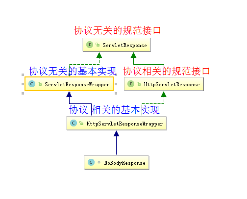

**操作响应行**

|                        |                                               |
|------------------------|-----------------------------------------------|
| 方法                   | 说明                                          |
| int getStatus()        | Gets the current status code of this response |
| void setStatus(int sc) | Sets the status code for this response        |

状态码：（HTTP--\>相应部分）

|        |            |
|--------|------------|
| 状态码 | 说明       |
| 1xx    | 消息       |
| 2xx    | 成功       |
| 3xx    | 重定向     |
| 4xx    | 客户端错误 |
| 5xx    | 服务器错误 |

**操作响应体**

**字节流响应**

响应体对应 **乱码问题**

项目中常用的编码格式是UTF-8，而浏览器默认使用的编码是gbk。导致乱码！

解决方式： 一：修改浏览器的编码格式(不推荐，不能让用户做修改的动作) 二：通过输出流写出一个标签：\<meta http-equiv='content-type'content='text/html;charset=UTF-8'\> 三：指定响应头信息：response.setHeader("Content-Type","text/html;charset=UTF-8") 四：response.setContentType("text/html;charset=UTF-8")

常用API： ServletOutputStream getOutputStream() : 获取响应字节输出流对象 void setContenType("text/html;charset=UTF-8") : 设置响应内容类型，解决中文乱码问题

<table>
<colgroup>
<col style="width: 100%" />
</colgroup>
<tbody>
<tr class="odd">
<td>Java 
@WebServlet("/servletDemo01") 
public class ServletDemo01 extends HttpServlet { 
@Override 
protected void doGet(HttpServletRequest req, HttpServletResponse resp) throws ServletException, IOException { 
//1.设置响应内容类型 
resp.setContentType("text/html;charset=UTF-8"); 
//2.通过响应对象获取字节输出流对象 
ServletOutputStream sos = resp.getOutputStream(); 
//3.定义消息 
String str = "你好"; 
//4.通过字节流输出对象 
sos.write(str.getBytes("UTF-8")); 
} 
 
@Override 
protected void doPost(HttpServletRequest req, HttpServletResponse resp) throws ServletException, IOException { 
doGet(req,resp); 
} 
}</td>
</tr>
</tbody>
</table>

**字符流响应**

response得到的字符流和字节流互斥，只能选其一，response获取的流不用关闭，由服务器关闭即可。

常用API： PrintWriter getWriter() : 获取响应字节输出流对象，可以发送标签 void setContenType("text/html;charset=UTF-8") : 设置响应内容类型，解决中文乱码问题

<table>
<colgroup>
<col style="width: 100%" />
</colgroup>
<tbody>
<tr class="odd">
<td>Java 
protected void doGet(HttpServletRequest req, HttpServletResponse resp) throws ServletException, IOException { 
String str = "你好"; 
//解决中文乱码 
resp.setContentType("text/html;charset=UTF-8"); 
//获取字符流对象 
PrintWriter pw = resp.getWriter(); 
pw.write(str); 
}</td>
</tr>
</tbody>
</table>

**响应图片**

响应图片到浏览器

<table>
<colgroup>
<col style="width: 100%" />
</colgroup>
<tbody>
<tr class="odd">
<td>Java 
@WebServlet("/servletDemo03") 
public class ServletDemo03 extends HttpServlet { 
@Override 
protected void doGet(HttpServletRequest req, HttpServletResponse resp) throws ServletException, IOException { 
//1.通过文件的相对路径来获取文件的绝对路径 
String realPath = getServletContext().getRealPath("/img/hm.png"); 
//E:\Project\JavaEE\out\artifacts\Response_war_exploded\img\hm.png 
System.out.println(realPath); 
//2.创建字节输入流对象，关联图片路径 
BufferedInputStream bis = new BufferedInputStream(new FileInputStream(realPath)); 
 
//3.通过响应对象获取字节输出流对象 
ServletOutputStream sos = resp.getOutputStream(); 
 
//4.循环读写 
byte[] arr = new byte[1024]; 
int len; 
while((len = bis.read(arr)) != -1) { 
sos.write(arr,0,len); 
} 
} 
 
@Override 
protected void doPost(HttpServletRequest req, HttpServletResponse resp) throws ServletException, IOException { 
doGet(req,resp); 
} 
}</td>
</tr>
</tbody>
</table>

**操作响应头**

**常用方法**

响应头: 是服务器指示浏览器去做什么

|                                            |                                      |
|--------------------------------------------|--------------------------------------|
| 方法                                       | 说明                                 |
| String getHeader(String name)              | 获取指定响应头的内容                 |
| Collection getHeaders(String name)         | 获取指定响应头的多个值               |
| Collection getHeaderNames()                | 获取所有响应头名称的枚举             |
| void setHeader(String name, String value)  | 设置响应头                           |
| void setDateHeader(String name, long date) | 设置具有给定名称和日期值的响应消息头 |
| void sendRedirect(String location)         | 设置重定向                           |

setHeader常用响应头：

Expires：设置缓存时间

Refresh：定时跳转

Location：重定向地址

Content-Disposition: 告诉浏览器下载

Content-Type：设置响应内容的MIME类型(服务器告诉浏览器内容的类型)

**控制缓存**

缓存：对于不经常变化的数据，我们可以设置合理的缓存时间，防止浏览器频繁的请求服务器。

<table>
<colgroup>
<col style="width: 100%" />
</colgroup>
<tbody>
<tr class="odd">
<td>Java 
@WebServlet("/servletDemo04") 
public class ServletDemo04 extends HttpServlet { 
@Override 
protected void doGet(HttpServletRequest req, HttpServletResponse resp) throws ServletException, IOException { 
String news = "设置缓存时间"; 
//设置缓存时间，缓存一小时 
resp.setDateHeader("Expires",System.currentTimeMillis()+1*60*60*1000L); 
//设置编码格式 
resp.setContentType("text/html;charset=UTF-8"); 
//写出数据 
resp.getWriter().write(news); 
System.out.println("aaa");//只输出一次，不能刷新，必须从网址直接进入 
} 
@Override 
protected void doPost(HttpServletRequest req, HttpServletResponse resp) throws ServletException, IOException { 
doGet(req,resp); 
} 
}</td>
</tr>
</tbody>
</table>

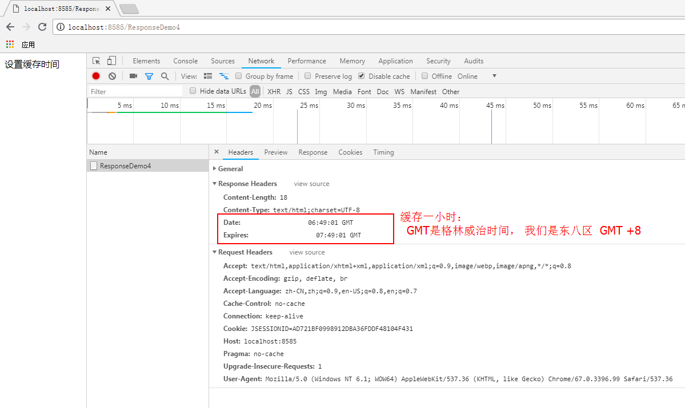

**定时刷新**

定时刷新：过了指定时间后，页面进行自动跳转

格式： setHeader("Refresh", "3;URL=https://www.baidu.com"");  
Refresh设置的时间单位是秒，如果刷新到其他地址，需要在时间后面拼接上地址

<table>
<colgroup>
<col style="width: 100%" />
</colgroup>
<tbody>
<tr class="odd">
<td>Java 
@WebServlet("/servletDemo05") 
public class ServletDemo05 extends HttpServlet { 
@Override 
protected void doGet(HttpServletRequest req, HttpServletResponse resp) throws ServletException, IOException { 
String news = "您的用户名或密码错误，3秒后自动跳转到登录页面..."; 
//设置编码格式 
resp.setContentType("text/html;charset=UTF-8"); 
//写出数据 
resp.getWriter().write(news); 
 
//设置响应消息头定时刷新 
resp.setHeader("Refresh","3;URL=/response/login.html"); 
} 
 
@Override 
protected void doPost(HttpServletRequest req, HttpServletResponse resp) throws ServletException, IOException { 
doGet(req,resp); 
} 
}</td>
</tr>
</tbody>
</table>

**下载文件**

<table>
<colgroup>
<col style="width: 100%" />
</colgroup>
<tbody>
<tr class="odd">
<td>Java 
@WebServlet("/servletDemo06") 
public class ServletDemo06 extends HttpServlet { 
@Override 
protected void doGet(HttpServletRequest req, HttpServletResponse resp) throws ServletException, IOException { 
//1.创建字节输入流对象，关联读取的文件 
String realPath = getServletContext().getRealPath("/img/hm.png");//绝对路径 
BufferedInputStream bis = new BufferedInputStream(new FileInputStream(realPath)); 
 
//2.设置响应头支持的类型 应用支持的类型为字节流 
/* 
Content-Type 消息头名称 支持的类型 
application/octet-stream 消息头参数 应用类型为字节流 
*/ 
resp.setHeader("Content-Type","application/octet-stream"); 
 
//3.设置响应头以下载方式打开 以附件形式处理内容 
/* 
Content-Disposition 消息头名称 处理的形式 
attachment;filename= 消息头参数 附件形式进行处理 
*/ 
resp.setHeader("Content-Disposition","attachment;filename=" + System.currentTimeMillis() + ".png"); 
 
//4.获取字节输出流对象 
ServletOutputStream sos = resp.getOutputStream(); 
 
//5.循环读写文件 
byte[] arr = new byte[1024]; 
int len; 
while((len = bis.read(arr)) != -1) { 
sos.write(arr,0,len); 
} 
 
//6.释放资源 
bis.close(); 
} 
 
@Override 
protected void doPost(HttpServletRequest req, HttpServletResponse resp) throws ServletException, IOException { 
doGet(req,resp); 
} 
}</td>
</tr>
</tbody>
</table>

**重定向**

**实现重定向**

请求重定向：客户端的一次请求到达后，需要借助其他 Servlet 来实现功能。特点：

重定向两次请求

重定向的地址栏路径改变

**重定向的路径写绝对路径** （带域名 /ip 地址，如果是同一个项目，可以省略域名 /ip 地址）

重定向的路径可以是项目内部的,也可以是项目以外的（百度）

重定向不能重定向到 WEB-INF 下的资源

把数据存到 request 域里面，重定向不可用

实现方式：

方式一：

设置响应状态码： resp.setStatus(302)

设置重定向的路径（响应到哪里，通过响应头 location 来指定）

response.setHeader("Location","http://www.baidu.com");

response.setHeader("Location","/response/servletDemo08);

方式二：

resp.sendRedirect("重定向的路径");

<table>
<colgroup>
<col style="width: 100%" />
</colgroup>
<tbody>
<tr class="odd">
<td>Java 
@WebServlet("/servletDemo07") 
public class ServletDemo07 extends HttpServlet { 
@Override 
protected void doGet(HttpServletRequest req, HttpServletResponse resp) throws ServletException, IOException { 
//设置请求域数据 
req.setAttribute("username","zhangsan"); 
 
//设置重定向 
resp.sendRedirect(req.getContextPath() + "/servletDemo07"); 
// resp.sendRedirect("https://www.baidu.com"); 
} 
@Override 
protected void doPost(HttpServletRequest req, HttpServletResponse resp) throws ServletException, IOException { 
doGet(req,resp); 
} 
}</td>
</tr>
</tbody>
</table>

<table>
<colgroup>
<col style="width: 100%" />
</colgroup>
<tbody>
<tr class="odd">
<td>Java 
@WebServlet("/servletDemo08") 
public class ServletDemo08 extends HttpServlet { 
@Override 
protected void doGet(HttpServletRequest req, HttpServletResponse resp) throws ServletException, IOException { 
System.out.println("servletDemo08执行了..."); 
Object username = req.getAttribute("username"); 
System.out.println(username); 
} 
}</td>
</tr>
</tbody>
</table>

**重定向和转发**

请求重定向跳转的特点：

重定向是由 **浏览器发起** 的，在这个过程中浏览器会发起 **两次请求**

重定向可以跳转到任意服务器的资源，但是 **无法跳转到WEB-INF中的资源**

重定向不能和请求域对象共享数据，数据会丢失

重定向浏览器的地址栏中的地址会变成跳转到的路径

请求转发跳转的特点：

请求转发是由 **服务器发起** 的，在这个过程中浏览器只会发起 **一次请求**

请求转发只能跳转到本项目的资源，但是 **可以跳转到WEB-INF中的资源**

请求转发可以和请求域对象共享数据，数据不会丢失

请求转发浏览器地址栏不变

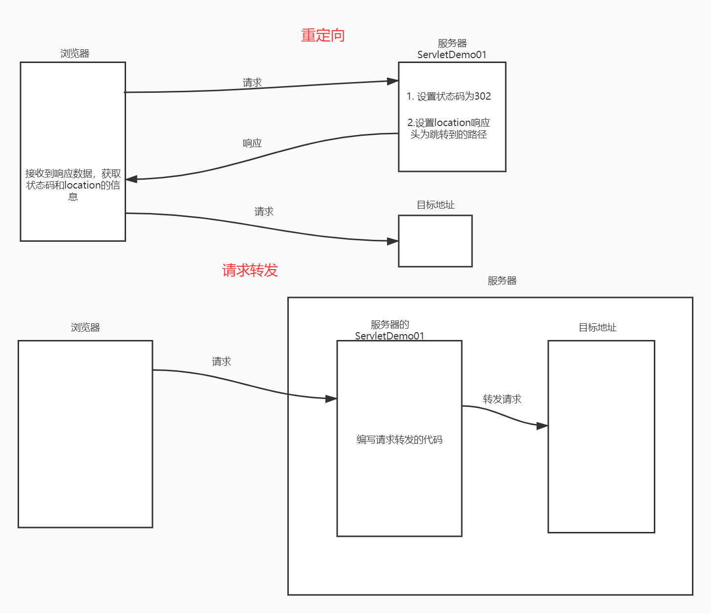

**路径问题**

**完整URL地址：**

协议：http://

服务器主机地址：127.0.0.1 or localhost

服务器端口号：8080

项目的虚拟路径(部署路径)：/response

具体的项目上资源路径 /login.html or Demo 的Servlet映射路径

**相对路径：**

不以"/"开头的路径写法，它是以目标路径相对当前文件的路径，其中".."表示上一级目录。

<table>
<colgroup>
<col style="width: 100%" />
</colgroup>
<tbody>
<tr class="odd">
<td>HTML 
&lt;!DOCTYPE html&gt; 
&lt;html lang="en"&gt; 
&lt;head&gt; 
&lt;meta charset="UTF-8"&gt; 
&lt;title&gt;&lt;/title&gt; 
&lt;/head&gt; 
&lt;body&gt; 
&lt;h1&gt;hello world....&lt;/h1&gt; 
&lt;!-- 
目标资源的url: http://localhost:8080/response/demo05 
当前资源的url: http://localhost:8080/response/pages/demo.html 
相对路径的优劣: 
1. 优势: 无论部署的项目名怎么改变，我的路径都不需要改变 
2. 劣势: 如果当前资源的位置发生改变，那么相对路径就必定要发生改变--&gt; 
&lt;a href="../demo05"&gt;访问ServletDemo05&lt;/a&gt; 
&lt;/body&gt; 
&lt;/html&gt;</td>
</tr>
</tbody>
</table>

**绝对路径：**

绝对路径就是以"/"开头的路径写法，项目部署的路径

**Cookie**

**会话技术**

**会话** ：浏览器和服务器之间的多次请求和响应

浏览器和服务器可能产生多次的请求和响应，从浏览器访问服务器开始，到访问服务器结束（关闭浏览器、到了过期时间），这期间产生的多次请求和响应加在一起称为浏览器和服务器之间的一次对话

作用：保存用户各自的数据（以浏览器为单位），在多次请求间实现数据共享

**常用的会话管理技术** ：

Cookie：客户端会话管理技术，用户浏览的信息以键值对（key=value）的形式保存在浏览器上。如果没有关闭浏览器，再次访问服务器，会把 cookie 带到服务端，服务端就可以做相应的处理

Session：服务端会话管理技术。当客户端第一次请求 session 对象时，服务器为每一个浏览器开辟一块内存空间，并将通过特殊算法算出一个 session 的 ID，用来标识该 session 对象。由于内存空间是每一个浏览器独享的，所有用户在访问的时候，可以把信息保存在 session 对象中，同时服务器会把 sessionId 写到 cookie 中，再次访问的时候，浏览器会把 cookie(sessionId) 带过来，找到对应的 session 对象即可

tomcat 生成的 sessionID 叫做 jsessionID

两者区别：

Cookie 存储在客户端中，而 Session 存储在服务器上，相对来说 Session 安全性更高。如果要在 Cookie 中存储一些敏感信息，不要直接写入 Cookie，应该将 Cookie 信息加密然后使用到的时候再去服务器端解密

Cookie 一般用来保存用户信息，在 Cookie 中保存已经登录过得用户信息，下次访问网站的时候就不需要重新登录，因为用户登录的时候可以存放一个 Token 在 Cookie 中，下次登录的时候只需要根据 Token 值来查找用户即可（为了安全考虑，重新登录一般要将 Token 重写），所以登录一次网站后访问网站其他页面不需要重新登录

Session 通过服务端记录用户的状态，服务端给特定的用户创建特定的 Session 之后就可以标识这个用户并且跟踪这个用户

Cookie 只能存储 ASCII 码，而 Session 可以存储任何类型的数据

参考文章：https://blog.csdn.net/weixin_43625577/article/details/92393581

**基本介绍**

Cookie：客户端会话管理技术，把要共享的数据保存到了客户端（也就是浏览器端）。每次请求时，把会话信息带到服务器，从而实现多次请求的数据共享。

作用：保存客户浏览器访问网站的相关内容（需要客户端不禁用 Cookie），从而在每次访问同一个内容时，先从本地缓存获取，使资源共享，提高效率。

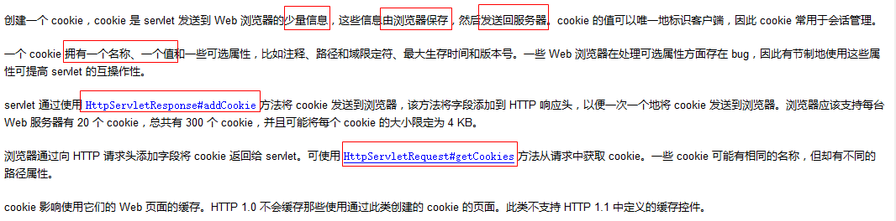

**基本使用**

**常用API**

**Cookie属性：**

|          |                          |          |
|----------|--------------------------|----------|
| 属性名称 | 属性作用                 | 是否重要 |
| name     | cookie的名称             | 必要属性 |
| value    | cookie的值（不能是中文） | 必要属性 |
| path     | cookie的路径             | 重要     |
| domain   | cookie的域名             | 重要     |
| maxAge   | cookie的生存时间         | 重要     |
| version  | cookie的版本号           | 不重要   |
| comment  | cookie的说明             | 不重要   |

注意：Cookie 有大小，个数限制。每个网站最多只能存20个 Cookie，且大小不能超过 4kb。同时所有网站的 Cookie 总数不超过300个。

**Cookie类API：**

Cookie(String name, String value) : 构造方法创建 Cookie 对象

Cookie 属性对应的 set 和 get 方法，name 属性被 final 修饰，没有 set 方法

HttpServletResponse 类 API：

void addCookie(Cookie cookie) ：向客户端添加 Cookie，Adds cookie to the response

HttpServletRequest类API：

Cookie\[\] getCookies() ：获取所有的 Cookie 对象，client sent with this request

**有效期**

如果不设置过期时间，表示这个 Cookie 生命周期为浏览器会话期间，只要关闭浏览器窗口 Cookie 就消失，这种生命期为浏览会话期的 Cookie 被称为会话 Cookie，会话 Cookie 一般不保存在硬盘上而是保存在内存里。

如果设置过期时间，浏览器就会把 Cookie 保存到硬盘上，关闭后再次打开浏览器，这些 Cookie 依然有效直到超过设定的过期时间。存储在硬盘上的 Cookie 可以在 **不同的浏览器进程间共享** ，比如两个 IE 窗口，而对于保存在内存的 Cookie，不同的浏览器有不同的处理方式

设置 Cookie 存活时间 API： void setMaxAge(int expiry)

-1：默认，代表 Cookie 数据存到浏览器关闭（保存在浏览器文件中）

0：代表删除 Cookie，如果要删除 Cookie 要确保 **路径一致**

正整数：以秒为单位保存数据有有效时间（把缓存数据保存到磁盘中）

<table>
<colgroup>
<col style="width: 100%" />
</colgroup>
<tbody>
<tr class="odd">
<td>Java 
@WebServlet("/servletDemo01") 
public class ServletDemo01 extends HttpServlet{ 
@Override 
protected void doGet(HttpServletRequest req, HttpServletResponse resp) throws ServletException, IOException { 
//1.通过响应对象写出提示信息 
resp.setContentType("text/html;charset=UTF-8"); 
PrintWriter pw = resp.getWriter(); 
pw.write("欢迎访问本网站，您的最后访问时间为：&lt;br&gt;"); 
 
//2.创建Cookie对象，用于记录最后访问时间 
Cookie cookie = new Cookie("time",System.currentTimeMillis()+""); 
 
//3.设置最大存活时间 
cookie.setMaxAge(3600); 
//cookie.setMaxAge(0); // 立即清除 
 
//4.将cookie对象添加到客户端 
resp.addCookie(cookie); 
 
//5.获取cookie 
Cookie[] cookies = req.getCookies(); 
for(Cookie c : cookies) { 
if("time".equals(c.getName())) { 
//6.获取cookie对象中的value，进行写出 
String value = c.getValue(); 
SimpleDateFormat sdf = new SimpleDateFormat("yyyy-MM-dd HH:mm:ss"); 
pw.write(sdf.format(Long.parseLong(value))); 
} 
} 
} 
 
@Override 
protected void doPost(HttpServletRequest req, HttpServletResponse resp) throws ServletException, IOException { 
doGet(req,resp); 
} 
}</td>
</tr>
</tbody>
</table>

**有效路径**

setPath(String url) : Cookie 设置有效路径

有效路径作用 :

保证不会携带别的网站/项目里面的 Cookie 到我们自己的项目

路径不一样，Cookie 的 key 可以相同

保证自己的项目可以合理的利用自己项目的 Cookie

判断路径是否携带 Cookie：请求资源 URI.startWith(cookie的path)，返回 true 就带

|                                                                  |                            |              |                |                |
|------------------------------------------------------------------|----------------------------|--------------|----------------|----------------|
| 访问URL                                                          | URI部分                    | Cookie的Path | 是否携带Cookie | 能否取到Cookie |
| [servletDemo02](http://localhost:8080/servlet/servletDemo02)     | /servlet/servletDemo02     | /servlet/    | 带             | 能取到         |
| [servletDemo03](http://localhost:8080/servlet/servletDemo03)     | /servlet/servletDemo03     | /servlet/    | 带             | 能取到         |
| [servletDemo04](http://localhost:8080/servlet/aaa/servletDemo03) | /servlet/aaa/servletDemo04 | /servlet/    | 带             | 能取到         |
| [servletDemo05](http://localhost:8080/bbb/servletDemo03)         | /bbb/servletDemo04         | /servlet/    | 不带           | 不能取到       |

只有当访问资源的 url 包含此 cookie 的有效 path 的时候，才会携带这个 cookie

想要当前项目下的 Servlet 可以使用该 cookie，一般设置： cookie.setPath(request.getContextPath())

**安全性**

如果 Cookie 中设置了 HttpOnly 属性，通过 js 脚本将无法读取到 cookie 信息，这样能有效的防止 XSS 攻击，窃取 cookie 内容，这样就增加了安全性，即便是这样，也不要将重要信息存入cookie。

XSS 全称 Cross SiteScript，跨站脚本攻击，是Web程序中常见的漏洞，XSS 属于被动式且用于客户端的攻击方式，所以容易被忽略其危害性。其原理是攻击者向有 XSS 漏洞的网站中输入(传入)恶意的 HTML 代码，当其它用户浏览该网站时，这段HTML代码会自动执行，从而达到攻击的目的。如盗取用户 Cookie、破坏页面结构、重定向到其它网站等。

**Session**

**基本介绍**

Session：服务器端会话管理技术，本质也是采用客户端会话管理技术，不过在客户端保存的是一个特殊标识，共享的数据保存到了服务器的内存对象中。每次请求时，会将特殊标识带到服务器端，根据标识来找到对应的内存空间，从而实现数据共享。简单说它就是一个服务端会话对象，用于存储用户的会话数据

Session 域（会话域）对象是 Servlet 规范中四大域对象之一，并且它也是用于实现数据共享的

|                |        |              |                                           |                                                                                                 |
|----------------|--------|--------------|-------------------------------------------|-------------------------------------------------------------------------------------------------|
| 域对象         | 功能   | 创建         | 销毁                                      | 使用场景                                                                                        |
| ServletContext | 应用域 | 服务器启动   | 服务器关闭                                | 在整个应用之间实现数据共享 （记录网站访问次数，聊天室）                                         |
| ServletRequest | 请求域 | 请求到来     | 响应了这个请求                            | 在当前请求或者请求转发之间实现数据共享                                                          |
| HttpSession    | 会话域 | getSession() | session过期，调用invalidate()，服务器关闭 | 在当前会话范围中实现数据共享，可以在多次请求中实现数据共享。 （验证码校验, 保存用户登录状态等） |

**基本使用**

**获取会话**

HttpServletRequest类获取Session：

|                                       |                                           |
|---------------------------------------|-------------------------------------------|
| 方法                                  | 说明                                      |
| HttpSession getSession()              | 获取HttpSession对象                       |
| HttpSession getSession(boolean creat) | 获取HttpSession对象，未获取到是否自动创建 |

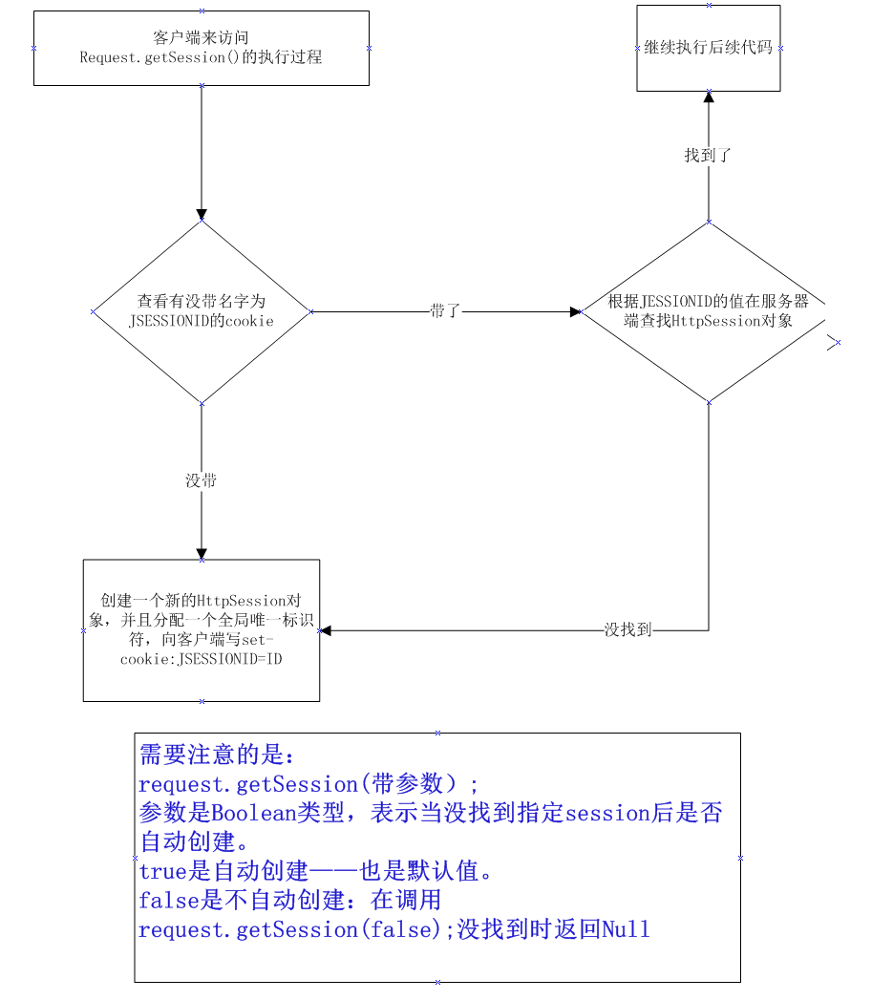

**常用API**

|                                              |                                  |
|----------------------------------------------|----------------------------------|
| 方法                                         | 说明                             |
| void setAttribute(String name, Object value) | 设置会话域中的数据               |
| Object getAttribute(String name)             | 获取指定名称的会话域数据         |
| Enumeration getAttributeNames()              | 获取所有会话域所有属性的名称     |
| void removeAttribute(String name)            | 移除会话域中指定名称的数据       |
| String getId()                               | 获取唯一标识名称，Jsessionid的值 |
| void invalidate()                            | 立即失效session                  |

**实现会话**

通过第一个Servlet设置共享的数据用户名，并在第二个Servlet获取到

项目执行完以后，去浏览器抓包，Request Headers 中的 Cookie JSESSIONID的值是一样的

<table>
<colgroup>
<col style="width: 100%" />
</colgroup>
<tbody>
<tr class="odd">
<td>Java 
@WebServlet("/servletDemo01") 
public class ServletDemo01 extends HttpServlet{ 
@Override 
protected void doGet(HttpServletRequest req, HttpServletResponse resp) throws ServletException, IOException { 
//1.获取请求的用户名 
String username = req.getParameter("username"); 
//2.获取HttpSession的对象 
HttpSession session = req.getSession(); 
System.out.println(session); 
System.out.println(session.getId()); 
//3.将用户名信息添加到共享数据中 
session.setAttribute("username",username); 
} 
 
@Override 
protected void doPost(HttpServletRequest req, HttpServletResponse resp) throws ServletException, IOException { 
doGet(req,resp); 
} 
}</td>
</tr>
</tbody>
</table>

<table>
<colgroup>
<col style="width: 100%" />
</colgroup>
<tbody>
<tr class="odd">
<td>Java 
@WebServlet("/servletDemo02") 
public class ServletDemo02 extends HttpServlet{ 
@Override 
protected void doGet(HttpServletRequest req, HttpServletResponse resp) throws ServletException, IOException { 
//1.获取HttpSession对象 
HttpSession session = req.getSession(); 
//2.获取共享数据 
Object username = session.getAttribute("username"); 
//3.将数据响应给浏览器 
resp.getWriter().write(username+""); 
} 
 
@Override 
protected void doPost(HttpServletRequest req, HttpServletResponse resp) throws ServletException, IOException { 
doGet(req,resp); 
} 
}</td>
</tr>
</tbody>
</table>

**生命周期**

Session 的创建：一个常见的错误是以为 Session 在有客户端访问时就被创建，事实是直到某 server 端程序（如 Servlet）调用 HttpServletRequest.getSession(true) 这样的语句时才会被创建

Session 在以下情况会被删除：

程序调用 HttpSession.invalidate()

距离上一次收到客户端发送的 session id 时间间隔超过了 session 的最大有效时间

服务器进程被停止

注意事项：

客户端只保存 sessionID 到 cookie 中，而不会保存 session

关闭浏览器只会使存储在客户端浏览器内存中的 cookie 失效，不会使服务器端的 session 对象失效，同样也不会使已经保存到硬盘上的持久化cookie消失

打开两个浏览器窗口访问应用程序会使用的是不同的session，通常 session cookie 是不能跨窗口使用，当新开了一个浏览器窗口进入相同页面时，系统会赋予一个新的 session id，实现跨窗口信息共享：

先把 session id 保存在 persistent cookie 中（通过设置session的最大有效时间）

在新窗口中读出来，就可以得到上一个窗口的 session id，这样通过 session cookie 和 persistent cookie 的结合就可以实现跨窗口的会话跟踪

**会话问题**

**禁用Cookie**

浏览器禁用Cookie解决办法：

方式一：通过提示信息告知用户

<table>
<colgroup>
<col style="width: 100%" />
</colgroup>
<tbody>
<tr class="odd">
<td>Java 
@WebServlet("/servletDemo03") 
public class ServletDemo03 extends HttpServlet{ 
@Override 
protected void doGet(HttpServletRequest req, HttpServletResponse resp) throws ServletException, IOException { 
//1.获取HttpSession对象 
HttpSession session = req.getSession(false); 
System.out.println(session); 
if(session == null) { 
resp.setContentType("text/html;charset=UTF-8"); 
resp.getWriter().write("为了不影响正常的使用，请不要禁用浏览器的Cookie~"); 
} 
} 
 
@Override 
protected void doPost(HttpServletRequest req, HttpServletResponse resp) throws ServletException, IOException { 
doGet(req,resp); 
} 
}</td>
</tr>
</tbody>
</table>

方式二：访问时拼接 jsessionid 标识，通过 encodeURL() 方法 **重写地址**

<table>
<colgroup>
<col style="width: 100%" />
</colgroup>
<tbody>
<tr class="odd">
<td>Java 
@Override 
protected void doGet(HttpServletRequest req, HttpServletResponse resp) throws ServletException, IOException { 
HttpSession session = req.getSession(); 
//实现url重写 相当于在地址栏后面拼接了一个jsessionid 
resp.getWriter().write("&lt;a href='"+ resp.encodeURL 
("http://localhost:8080/session/servletDemo03") + 
"'&gt;go servletDemo03&lt;/a&gt;"); 
 
}</td>
</tr>
</tbody>
</table>

**钝化活化**

Session 存放在服务器端的内存中，可以做持久化管理。

钝化：序列化，持久态。把长时间不用，但还不到过期时间的 HttpSession 进行序列化写到磁盘上。

活化：相反的状态

何时钝化：

当访问量很大时，服务器会根据getLastAccessTime来进行排序，对长时间不用，但是还没到过期时间的HttpSession进行序列化（持久化）

当服务器进行重启的时候，为了保持客户HttpSession中的数据，也要对HttpSession进行序列化（持久化）

注意：

HttpSession的持久化由服务器来负责管理，我们不用关心

只有实现了序列化接口的类才能被序列化

**JSP**

**JSP概述**

JSP(Java Server Page)：是一种动态网页技术标准。（页面技术）

JSP是基于Java语言的，它的本质就是Servlet，一个特殊的Servlet。

JSP部署在服务器上，可以处理客户端发送的请求，并根据请求内容动态的生成HTML、XML或其他格式文档的Web网页，然后响应给客户端。

|            |                                                                                   |
|------------|-----------------------------------------------------------------------------------|
| 类别       | 适用场景                                                                          |
| HTML       | 开发静态资源，不能包含java代码，无法添加动态数据。                                |
| CSS        | 美化页面                                                                          |
| JavaScript | 给网页添加动态效果                                                                |
| Servlet    | 编写java代码，实现后台功能处理，但是很不方便，开发效率低。                        |
| JSP        | 包括了显示页面技术，同时具备Servlet输出动态资源的能力。但是不适合作为控制器来用。 |

**执行原理**

新建JavaEE工程，编写index.jsp文件

<table>
<colgroup>
<col style="width: 100%" />
</colgroup>
<tbody>
<tr class="odd">
<td>Java 
&lt;%@ page contentType="text/html;charset=UTF-8" language="java" %&gt; 
&lt;html&gt; 
&lt;head&gt; 
&lt;title&gt;JSP的入门&lt;/title&gt; 
&lt;/head&gt; 
&lt;body&gt; 
这是第一个JSP页面 
&lt;/body&gt; 
&lt;/html&gt;</td>
</tr>
</tbody>
</table>

执行过程：

客户端提交请求——Tomcat服务器解析请求地址——找到JSP页面——Tomcat将JSP页面翻译成Servlet的java文件——将翻译好的.java文件编译成.class文件——返回到客户浏览器上

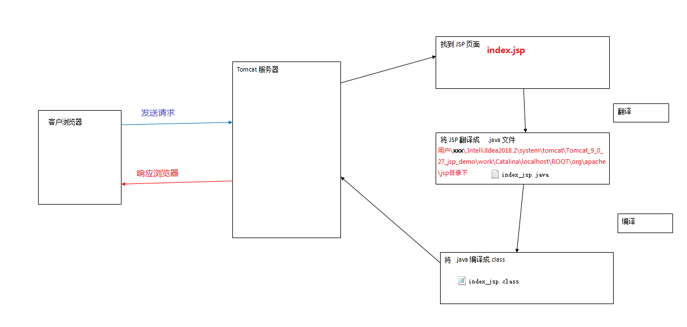

溯源，打开JSP翻译后的Java文件

public final class index_jsp extends org.apache.jasper.runtime.HttpJspBase ， public abstract class HttpJspBase extends HttpServlet implements HttpJspPage ，HttpJspBase是个抽象类继承HttpServlet，所以JSP本质上继承HttpServlet

在文件中找到了输出页面的代码，本质都是用out.write()输出的JSP语句

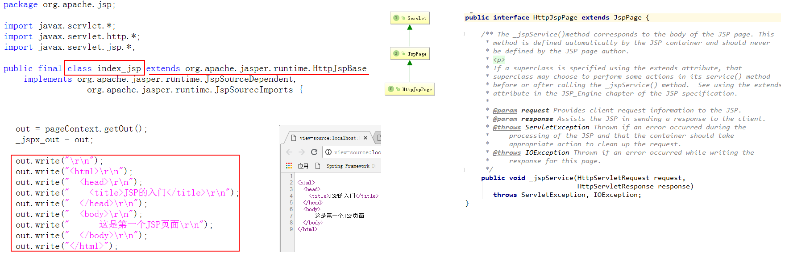

总结： JSP它是一个特殊的Servlet，主要是用于展示动态数据。它展示的方式是用流把数据输出出来，而我们在使用JSP时，涉及HTML的部分，都与HTML的用法一致，这部分称为jsp中的模板元素，决定了页面的外观。

**JSP语法**

JSP注释：

|          |                    |                                                                                                |
|----------|--------------------|------------------------------------------------------------------------------------------------|
| 注释类型 | 方法               | 作用                                                                                           |
| JSP注释  | \<%--注释内容--%\> | 被jsp注释的部分不会被翻译成.java文件，不会在浏览器上显示                                       |
| HTML注释 |                    | 在Jsp中可以使用html的注释，但是只能注释html元素 被html注释部分会参与翻译，并且会在浏览器上显示 |
| Java注释 | //; /\* \*/        |                                                                                                |

Java代码块

<table>
<colgroup>
<col style="width: 100%" />
</colgroup>
<tbody>
<tr class="odd">
<td>HTML 
&lt;% 此处写java代码 %&gt; 
&lt;%--由tomcat负责翻译，翻译之后是service方法的成员变量--%&gt;</td>
</tr>
</tbody>
</table>

JSP表达式

<table>
<colgroup>
<col style="width: 100%" />
</colgroup>
<tbody>
<tr class="odd">
<td>HTML 
&lt;%=表达式%&gt; 
&lt;%--翻译成Service()方法里面的内容,相当于调用out.print()--%&gt;</td>
</tr>
</tbody>
</table>

JSP声明

<table>
<colgroup>
<col style="width: 100%" />
</colgroup>
<tbody>
<tr class="odd">
<td>HTML 
&lt;%! 声明的变量或方法 %&gt; 
&lt;%--翻译成Servlet类里面的内容--%&gt;</td>
</tr>
</tbody>
</table>

语法示例：

<table>
<colgroup>
<col style="width: 100%" />
</colgroup>
<tbody>
<tr class="odd">
<td>Java 
&lt;%@ page contentType="text/html;charset=UTF-8" language="java" %&gt; 
&lt;html&gt; 
&lt;head&gt; 
&lt;title&gt;jsp语法&lt;/title&gt; 
&lt;/head&gt; 
&lt;body&gt; 
&lt;%--1. 这是注释--%&gt; 
 
&lt;%-- 
2.java代码块 
System.out.println("Hello JSP"); 普通输出语句，输出在控制台!! 
out.println("Hello JSP");out是JspWriter对象，输出在页面上 
--%&gt; 
&lt;% 
System.out.println("Hello JSP"); 
out.println("Hello JSP&lt;br&gt;"); 
String str = "hello&lt;br&gt;"; 
out.println(str); 
%&gt; 
 
&lt;%-- 
3.jsp表达式,相当于 out.println("Hello"); 
--%&gt; 
&lt;%="Hello&lt;br&gt;"%&gt; 
 
&lt;%-- 
4.jsp中的声明(变量或方法) 
如果加! 代表的是声明的是成员变量 
如果不加! 代表的是声明的是局部变量,页面显示abc 
--%&gt; 
&lt;%! String s = "abc";%&gt; 
&lt;% String s = "def";%&gt; 
&lt;%=s%&gt; 
 
&lt;%! public void getSum(){}%&gt; 
&lt;/body&gt; 
&lt;/html&gt;</td>
</tr>
</tbody>
</table>

<table>
<colgroup>
<col style="width: 100%" />
</colgroup>
<tbody>
<tr class="odd">
<td>Java 
控制台输出：Hello JSP 
页面输出： 
Hello JSP 
hello 
Hello 
def</td>
</tr>
</tbody>
</table>

**JSP指令**

**page指令：**

<table>
<colgroup>
<col style="width: 100%" />
</colgroup>
<tbody>
<tr class="odd">
<td>XML 
&lt;%@ page 属性名=属性值 属性名=属性值... %&gt;</td>
</tr>
</tbody>
</table>

|              |                                                                              |
|--------------|------------------------------------------------------------------------------|
| 属性名       | 作用                                                                         |
| contentType  | 设置响应正文支持的MIME类型和编码格式：contentType="text/html;charset=UTF-8"  |
| language     | 告知引擎，脚本使用的语言，默认为Java                                         |
| errorPage    | 当前页面出现异常后跳转的页面                                                 |
| isErrorPage  | 是否抓住异常。值为true页面中就能使用exception对象，打印异常信息。默认值false |
| import       | 导入哪些包（类）\<%@ page import="java.util.ArrayList" %\>                   |
| session      | 是否创建HttpSession对象，默认是true                                          |
| buffer       | 设定JspWriter用s输出jsp内容的缓存大小。默认8kb                               |
| pageEncoding | 翻译jsp时所用的编码格式，pageEncoding="UTF-8"相当于用UTF-8读取JSP            |
| isELIgnored  | 是否忽略EL表达式，默认值是false                                              |

Note：当使用全局错误页面，就无须配置errorPage实现跳转错误页面，而是由服务器负责跳转到错误页面

配置全局错误页面：web.xml

<table>
<colgroup>
<col style="width: 100%" />
</colgroup>
<tbody>
<tr class="odd">
<td>XML 
&lt;error-page&gt; 
&lt;exception-type&gt;java.lang.Exception&lt;/exception-type&gt; 
&lt;location&gt;/error.jsp&lt;/location&gt; 
&lt;/error-page&gt; 
&lt;error-page&gt; 
&lt;error-code&gt;404&lt;/error-code&gt; 
&lt;location&gt;/404.html&lt;/location&gt; 
&lt;/error-page&gt;</td>
</tr>
</tbody>
</table>

\*\*include指令：\*\*包含其他页面

<table>
<colgroup>
<col style="width: 100%" />
</colgroup>
<tbody>
<tr class="odd">
<td>XML 
&lt;%@include file="被包含的页面" %&gt;</td>
</tr>
</tbody>
</table>

属性：file，以/开头，就代表当前应用

\*\*taglib指令：\*\*引入外部标签库

<table>
<colgroup>
<col style="width: 100%" />
</colgroup>
<tbody>
<tr class="odd">
<td>XML 
&lt;%taglib uri="标签库的地址" prefix="前缀名称"%&gt;</td>
</tr>
</tbody>
</table>

html标签和jsp标签不用引入

**隐式对象**

**九大隐式对象**

隐式对象：在jsp中可以不声明就直接使用的对象。它只存在于jsp中，因为java类中的变量必须要先声明再使用。 jsp中的隐式对象也并不是未声明，它是在翻译成.java文件时声明的，所以我们在jsp中可以直接使用。

|              |                                        |                               |
|--------------|----------------------------------------|-------------------------------|
| 隐式对象名称 | 类型                                   | 备注                          |
| request      | javax.servlet.http.HttpServletRequest  |                               |
| response     | javax.servlet.http.HttpServletResponse |                               |
| session      | javax.servlet.http.HttpSession         | Page指令可以控制开关          |
| application  | javax.servlet.ServletContext           |                               |
| page         | Java.lang.Object                       | 当前jsp对应的servlet引用实例  |
| config       | javax.servlet.ServletConfig            |                               |
| exception    | java.lang.Throwable                    | page指令有开关                |
| out          | javax.servlet.jsp.JspWriter            | 字符输出流，相当于printwriter |
| pageContext  | javax.servlet.jsp.PageContext          | 很重要，页面域                |

**PageContext**

PageContext对象特点：

PageContextd对象是JSP独有的对象，Servlet中没有

PageContextd对象是一个 **页面域（作用范围）对象** ，还可以操作其他三个域对象中的属性

PageContextd对象 **可以获取其他八个隐式对象**

PageContextd对象是一个局部变量，它的生命周期随着JSP的创建而诞生，随着JSP的结束而消失。每个JSP页面都有一个独立的PageContext

PageContext方法如下，页面域操作的方法定义在了PageContext的父类JspContext中

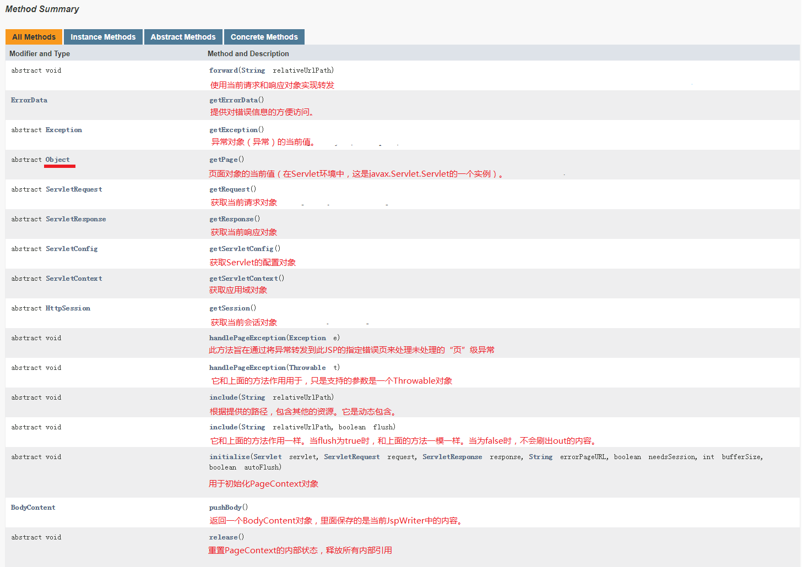

**四大域对象**

|                |          |                          |                                          |
|----------------|----------|--------------------------|------------------------------------------|
| 域对象名称     | 范围     | 级别                     | 备注                                     |
| PageContext    | 页面范围 | 最小，只能在当前页面用   | 因范围太小，开发中用的很少               |
| ServletRequest | 请求范围 | 一次请求或当期请求转发用 | 当请求转发之后，再次转发时请求域丢失     |
| HttpSession    | 会话范围 | 多次请求数据共享时使用   | 多次请求共享数据，但不同的客户端不能共享 |
| ServletContext | 应用范围 | 最大，整个应用都可以使用 | 尽量少用，如果对数据有修改需要做同步处理 |

**MVC模型**

M : model， 通常用于封装数据，封装的是数据模型 V : view，通常用于展示数据。动态展示用jsp页面，静态数据展示用html C : controller，通常用于处理请求和响应，一般指的是Servlet

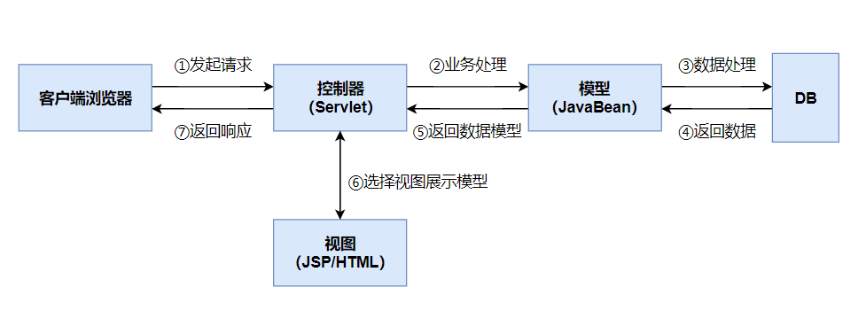

**EL**

**EL概述**

EL表达式：Expression Language，意为表达式语言。它是Servlet规范中的一部分，是JSP2.0规范加入的内容。

EL表达式作用：在JSP页面中获取数据，让JSP脱离java代码块和JSP表达式

EL表达式格式： \${表达式内容}

EL表达式特点：

有明确的 **返回值**

把内容输出到 **页面** 上

**只能在四大域对象中获取数据** ，不在四大域对象中的数据取不到。

**EL用法**

**多种类型**

EL表达式可以获取不同类型数据，前提是数据放入四大域对象。

<table>
<colgroup>
<col style="width: 100%" />
</colgroup>
<tbody>
<tr class="odd">
<td>Java 
&lt;%@ page import="bean.Student" %&gt; 
&lt;%@ page import="java.util.ArrayList" %&gt; 
&lt;%@ page import="java.util.HashMap" %&gt; 
&lt;%@ page contentType="text/html;charset=UTF-8" language="java" %&gt; 
&lt;html&gt; 
&lt;head&gt; 
&lt;title&gt;EL表达式获取不同类型数据&lt;/title&gt; 
&lt;/head&gt; 
&lt;body&gt; 
&lt;%--1.获取基本数据类型--%&gt; 
&lt;% pageContext.setAttribute("num",10); %&gt; 
基本数据类型：${num} &lt;br&gt; 
 
&lt;%--2.获取自定义对象类型--%&gt; 
&lt;% 
Student stu = new Student("张三",23); 
pageContext.setAttribute("stu",stu); 
%&gt; 
自定义对象：${stu} &lt;br&gt; 
&lt;%--stu.name 实现原理 getName()--%&gt; 
学生姓名：${stu.name} &lt;br&gt; 
学生年龄：${stu.age} &lt;br&gt; 
 
&lt;%--3.获取数组类型--%&gt; 
&lt;% 
String[] arr = {"hello","world"}; 
pageContext.setAttribute("arr",arr); 
%&gt; 
数组：${arr} &lt;br&gt; 
0索引元素：${arr[0]} &lt;br&gt; 
1索引元素：${arr[1]} &lt;br&gt; 
 
&lt;%--4.获取List集合--%&gt; 
&lt;% 
ArrayList&lt;String&gt; list = new ArrayList&lt;&gt;(); 
list.add("aaa"); 
list.add("bbb"); 
pageContext.setAttribute("list",list); 
%&gt; 
List集合：${list} &lt;br&gt; 
0索引元素：${list[0]} &lt;br&gt; 
 
&lt;%--5.获取Map集合--%&gt; 
&lt;% 
HashMap&lt;String,Student&gt; map = new HashMap&lt;&gt;(); 
map.put("hm01",new Student("张三",23)); 
map.put("hm02",new Student("李四",24)); 
pageContext.setAttribute("map",map); 
%&gt; 
Map集合：${map} &lt;br&gt; 
第一个学生对象：${map.hm01} &lt;br&gt; 
第一个学生对象的姓名：${map.hm01.name} 
&lt;/body&gt; 
&lt;/html&gt; 
 
&lt;--页面输出效果 
基本数据类型：10 
自定义对象：bean.Student@5f8da92c (地址) 
学生姓名：张三 
学生年龄：23 
数组：[Ljava.lang.String;@4b3bd520 
0索引元素：hello 
1索引元素：world 
List集合：[aaa, bbb] 
0索引元素：aaa 
Map集合：{hm01=bean.Student@4768d250, hm02=bean.Student@67f237d9} 
第一个学生对象：bean.Student@4768d250 
第一个学生对象的姓名：张三 
--&gt;</td>
</tr>
</tbody>
</table>

**异常问题**

EL表达式的注意事项：

EL表达式没有空指针异常

EL表达式没有数组下标越界

EL表达式没有字符串拼接

<table>
<colgroup>
<col style="width: 100%" />
</colgroup>
<tbody>
<tr class="odd">
<td>Java 
&lt;%@ page contentType="text/html;charset=UTF-8" language="java" %&gt; 
&lt;html&gt; 
&lt;head&gt; 
&lt;title&gt;EL表达式的注意事项&lt;/title&gt; 
&lt;/head&gt; 
&lt;body&gt; 
第一个：没有空指针异常&lt;br/&gt; 
&lt;% String str = null; 
request.setAttribute("testNull",str); 
%&gt; 
str：${testNull} 
&lt;hr/&gt; 
第二个：没有数组下标越界&lt;br/&gt; 
&lt;% String[] strs = new String[]{"a","b","c"}; 
request.setAttribute("strs",strs); 
%&gt; 
取第一个元素：${strs[0]}&lt;br/&gt; 
取第六个元素：${strs[5]}&lt;br/&gt; 
&lt;hr/&gt; 
第三个：没有字符串拼接&lt;br/&gt; 
&lt;%--${strs[0]+strs[1]}--%&gt; 
拼接：${strs[0]}+${strs[1]} &lt;%--注意拼接--%&gt; 
&lt;/body&gt; 
&lt;/html&gt; 
 
&lt;--页面输出效果 
第一个：没有空指针异常 
str： 
第二个：没有数组下标越界 
取第一个元素：a 
取第六个元素： 
第三个：没有字符串拼接 
拼接：a+b 
--&gt;</td>
</tr>
</tbody>
</table>

**运算符**

EL表达式中运算符：

关系运算符：

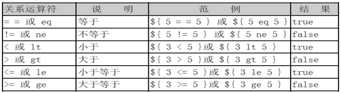

逻辑运算符：

|            |      |
|------------|------|
| 逻辑运算符 | 说明 |
| && 或 and  | 交集 |
| \|\| 或 or | 并集 |
| ! 或 not   | 非   |

其他运算符

|                          |                                                                           |
|--------------------------|---------------------------------------------------------------------------|
| 运算符                   | 作用                                                                      |
| empty                    | 1\. 判断对象是否为null 2. 判断字符串是否为空字符串 3. 判断容器元素是否为0 |
| 条件 ? 表达式1 : 表达式2 | 三元运算符，条件?真:假                                                    |

<table>
<colgroup>
<col style="width: 100%" />
</colgroup>
<tbody>
<tr class="odd">
<td>Java 
&lt;%@ page contentType="text/html;charset=UTF-8" language="java" %&gt; 
&lt;html&gt; 
&lt;head&gt; 
&lt;title&gt;EL表达式运算符&lt;/title&gt; 
&lt;/head&gt; 
&lt;body&gt; 
&lt;%--empty--%&gt; 
&lt;% 
String str1 = null; 
String str2 = ""; 
int[] arr = {}; 
%&gt; 
${empty str1} &lt;br&gt; 
${empty str2} &lt;br&gt; 
${empty arr} &lt;br&gt; 
 
&lt;%--三元运算符。获取性别的数据，在对应的按钮上进行勾选--%&gt; 
&lt;% pageContext.setAttribute("gender","women"); %&gt; 
&lt;input type="radio" name="gender" value="men" ${gender=="men"?"checked":""}&gt;男 
&lt;input type="radio" name="gender" value="women" ${gender=="women"?"checked":""}&gt;女 
&lt;/body&gt; 
&lt;/html&gt;</td>
</tr>
</tbody>
</table>

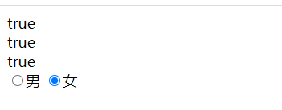

**四大域数据**

EL表达式只能从从四大域中获取数据，调用的就是 findAttribute(name,value); 方法，根据名称由小到大在域对象中查找，找到就返回，找不到就什么都不显示。

<table>
<colgroup>
<col style="width: 100%" />
</colgroup>
<tbody>
<tr class="odd">
<td>Java 
&lt;%@ page contentType="text/html;charset=UTF-8" language="java" %&gt; 
&lt;html&gt; 
&lt;head&gt; 
&lt;title&gt;EL表达式使用细节&lt;/title&gt; 
&lt;/head&gt; 
&lt;body&gt; 
&lt;%--获取四大域对象中的数据--%&gt; 
&lt;% 
//pageContext.setAttribute("username","zhangsan"); 
request.setAttribute("username","zhangsan"); 
//session.setAttribute("username","zhangsan"); 
//application.setAttribute("username","zhangsan"); 
%&gt; 
${username} &lt;br&gt; 
 
&lt;%--获取JSP中其他八个隐式对象 获取虚拟目录名称--%&gt; 
&lt;%= request.getContextPath()%&gt; 
${pageContext.request.contextPath} 
&lt;/body&gt; 
&lt;/html&gt;</td>
</tr>
</tbody>
</table>

**EL隐式对象**

**EL表达式隐式对象**

EL表达式也为我们提供隐式对象，可以让我们不声明直接来使用，需要注意的是，它和JSP的隐式对象不是同一种事物。

|                  |                               |                 |                                         |
|------------------|-------------------------------|-----------------|-----------------------------------------|
| EL中的隐式对象   | 类型                          | 对应JSP隐式对象 | 备注                                    |
| PageContext      | Javax.serlvet.jsp.PageContext | PageContext     | 完全一样                                |
| ApplicationScope | Java.util.Map                 | 没有            | 应用层范围                              |
| SessionScope     | Java.util.Map                 | 没有            | 会话范围                                |
| RequestScope     | Java.util.Map                 | 没有            | 请求范围                                |
| PageScope        | Java.util.Map                 | 没有            | 页面层范围                              |
| Header           | Java.util.Map                 | 没有            | 请求消息头key，值是value（一个）        |
| HeaderValues     | Java.util.Map                 | 没有            | 请求消息头key，值是数组（一个头多个值） |
| Param            | Java.util.Map                 | 没有            | 请求参数key，值是value（一个）          |
| ParamValues      | Java.util.Map                 | 没有            | 请求参数key，值是数组（一个名称多个值） |
| InitParam        | Java.util.Map                 | 没有            | 全局参数，key是参数名称，value是参数值  |
| Cookie           | Java.util.Map                 | 没有            | Key是cookie的名称，value是cookie对象    |

<table>
<colgroup>
<col style="width: 100%" />
</colgroup>
<tbody>
<tr class="odd">
<td>Java 
&lt;%@ page contentType="text/html;charset=UTF-8" language="java" %&gt; 
&lt;html&gt; 
&lt;head&gt; 
&lt;title&gt;EL表达式11个隐式对象&lt;/title&gt; 
&lt;/head&gt; 
&lt;body&gt; 
&lt;%--pageContext对象 可以获取其他三个域对象和JSP中八个隐式对象--%&gt; 
${pageContext.request.contextPath} &lt;br&gt; 
 
&lt;%--applicationScope sessionScope requestScope pageScope 操作四大域对象中的数据--%&gt; 
&lt;% request.setAttribute("username","zhangsan"); %&gt; 
${username} &lt;br&gt; 
${requestScope.username} &lt;br&gt; 
 
&lt;%--header headerValues 获取请求头数据--%&gt; 
${header["connection"]} &lt;br&gt; 
${headerValues["connection"][0]} &lt;br&gt; 
 
&lt;%--param paramValues 获取请求参数数据--%&gt; 
${param.username} &lt;br&gt; 
${paramValues.hobby[0]} &lt;br&gt; 
${paramValues.hobby[1]} &lt;br&gt; 
 
&lt;%--initParam 获取全局配置参数--%&gt; 
${initParam["pname"]} &lt;br&gt; 
 
&lt;%--cookie 获取cookie信息--%&gt; 
${cookie} &lt;br&gt; &lt;%--获取Map集合--%&gt; 
${cookie.JSESSIONID} &lt;br&gt; &lt;%--获取map集合中第二个元素--%&gt; 
${cookie.JSESSIONID.name} &lt;br&gt; &lt;%--获取cookie对象的名称--%&gt; 
${cookie.JSESSIONID.value} &lt;%--获取cookie对象的值--%&gt; 
&lt;/body&gt; 
&lt;/html&gt; 
&lt;--页面显示 
/el 
zhangsan 
zhangsan 
keep-alive 
keep-alive 
 
bbb 
{JSESSIONID=javax.servlet.http.Cookie@435c8431, Idea-5a5d203e=javax.servlet.http.Cookie@46be0b58, Idea-be3279e7=javax.servlet.http.Cookie@4ef6e8e8} 
javax.servlet.http.Cookie@435c8431 
JSESSIONID 
E481B2A845A448AD88A71FD43611FF02 
--&gt;</td>
</tr>
</tbody>
</table>

在web.xml配置全局参数

<table>
<colgroup>
<col style="width: 100%" />
</colgroup>
<tbody>
<tr class="odd">
<td>XML 
&lt;?xml version="1.0" encoding="UTF-8"?&gt; 
&lt;web-app ******&gt; 
&lt;!--配置全局参数--&gt; 
&lt;context-param&gt; 
&lt;param-name&gt;pname&lt;/param-name&gt; 
&lt;param-value&gt;bbb&lt;/param-value&gt; 
&lt;/context-param&gt; 
&lt;/web-app&gt;</td>
</tr>
</tbody>
</table>

**获取JSP隐式对象**

通过获取页面域对象，获取其他JSP八个隐式对象

<table>
<colgroup>
<col style="width: 100%" />
</colgroup>
<tbody>
<tr class="odd">
<td>Java 
&lt;%@ page contentType="text/html;charset=UTF-8" language="java" %&gt; 
&lt;html&gt; 
&lt;head&gt; 
&lt;title&gt;EL表达式使用细节&lt;/title&gt; 
&lt;/head&gt; 
&lt;body&gt; 
&lt;%--获取虚拟目录名称--%&gt; 
&lt;%= request.getContextPath()%&gt; 
${pageContext.request.contextPath} 
&lt;/body&gt; 
&lt;/html&gt; 
&lt;--页面显示 
/el /el 
--&gt;</td>
</tr>
</tbody>
</table>

**JSTL**

JSTL：Java Server Pages Standarded Tag Library，JSP中标准标签库。

作用：提供给开发人员一个标准的标签库，开发人员可以利用这些标签取代JSP页面上的Java代码，从而提高程序的可读性，降低程序的维护难度。

|           |            |                                |
|-----------|------------|--------------------------------|
| 组成      | 作用       | 说明                           |
| Core      | 核心标签库 | 通用逻辑处理                   |
| Fmt       | 国际化有关 | 需要不同地域显示不同语言时使用 |
| Functions | EL函数     | EL表达式可以使用的方法         |
| SQL       | 操作数据库 |                                |
| XML       | 操作XML    |                                |

使用：添加jar包，通过taglib导入，prefix属性表示程序调用标签使用的引用名

|                                          |          |            |                  |
|------------------------------------------|----------|------------|------------------|
| 标签名称                                 | 功能分类 | 分类       | 作用             |
| \`\<c:if test="\${A==B                   |          | C==D}"\>\` | 流程控制         |
| \<c:choose\> ,\<c:when\>,\<c:otherwise\> | 流程控制 | 核心标签库 | 用于多个条件判断 |
| \<c:foreache\>                           | 迭代操作 | 核心标签库 | 用于循环遍历     |

流程控制

<table>
<colgroup>
<col style="width: 100%" />
</colgroup>
<tbody>
<tr class="odd">
<td>Java 
&lt;%@ page contentType="text/html;charset=UTF-8" language="java" %&gt; 
&lt;%@taglib uri="http://java.sun.com/jsp/jstl/core" prefix="c"%&gt; 
&lt;html&gt; 
&lt;head&gt; 
&lt;title&gt;流程控制&lt;/title&gt; 
&lt;/head&gt; 
&lt;body&gt; 
&lt;%--向域对象中添加成绩数据--%&gt; 
${pageContext.setAttribute("score","T")} 
 
&lt;%--对成绩进行判断--%&gt; 
&lt;c:if test="${score eq 'A'}"&gt; 
优秀 
&lt;/c:if&gt; 
 
&lt;%--对成绩进行多条件判断--%&gt; 
&lt;c:choose&gt; 
&lt;c:when test="${score eq 'A'}"&gt;优秀&lt;/c:when&gt; 
&lt;c:when test="${score eq 'B'}"&gt;良好&lt;/c:when&gt; 
&lt;c:when test="${score eq 'C'}"&gt;及格&lt;/c:when&gt; 
&lt;c:when test="${score eq 'D'}"&gt;较差&lt;/c:when&gt; 
&lt;c:otherwise&gt;成绩非法&lt;/c:otherwise&gt; 
&lt;/c:choose&gt; 
&lt;/body&gt; 
&lt;/html&gt;</td>
</tr>
</tbody>
</table>

迭代操作 c:forEach：用来遍历集合，属性：

|           |                                                                                                               |
|-----------|---------------------------------------------------------------------------------------------------------------|
| 属性      | 作用                                                                                                          |
| items     | 指定要遍历的集合，它可以是用EL表达式取出来的元素                                                              |
| var       | 把当前遍历的元素放入指定的page域中。var的值是key，遍历的元素是value 注意：var不支持EL表达式，只能是字符串常量 |
| begin     | 开始遍历的索引                                                                                                |
| end       | 结束遍历的索引                                                                                                |
| step      | 步长，i+=step                                                                                                 |
| varStatus | 它是一个计数器对象，有两个属性，一个是用于记录索引，一个是用于计数。索引是从0开始，计数是从1开始              |

<table>
<colgroup>
<col style="width: 100%" />
</colgroup>
<tbody>
<tr class="odd">
<td>Java 
&lt;%@ page import="java.util.ArrayList" %&gt; 
&lt;%@ page contentType="text/html;charset=UTF-8" language="java" %&gt; 
&lt;%@taglib uri="http://java.sun.com/jsp/jstl/core" prefix="c"%&gt; 
&lt;html&gt; 
&lt;head&gt; 
&lt;title&gt;循环&lt;/title&gt; 
&lt;/head&gt; 
&lt;body&gt; 
&lt;%--向域对象中添加集合--%&gt; 
&lt;% 
ArrayList&lt;String&gt; list = new ArrayList&lt;&gt;(); 
list.add("aa"); 
list.add("bb"); 
list.add("cc"); 
list.add("dd"); 
pageContext.setAttribute("list",list); 
%&gt; 
&lt;%--遍历集合--%&gt; 
&lt;c:forEach items="${list}" var="str"&gt; 
${str} &lt;br&gt; 
&lt;/c:forEach&gt; 
&lt;/body&gt; 
&lt;/html&gt;</td>
</tr>
</tbody>
</table>

**Filter**

**过滤器**

Filter：过滤器，是 JavaWeb 三大组件之一，另外两个是 Servlet 和 Listener

工作流程：在程序访问服务器资源时，当一个请求到来，服务器首先判断是否有过滤器与去请求资源相关联，如果有过滤器可以将请求拦截下来，完成一些特定的功能，再由过滤器决定是否交给请求资源，如果没有就直接请求资源，响应同理

作用：过滤器一般用于完成通用的操作，例如：登录验证、统一编码处理、敏感字符过滤等

**相关类**

**Filter**

Filter是一个接口，如果想实现过滤器的功能，必须实现该接口

核心方法

|                                                                                    |                          |
|------------------------------------------------------------------------------------|--------------------------|
| 方法                                                                               | 说明                     |
| void init(FilterConfig filterConfig)                                               | 初始化，开启过滤器       |
| void doFilter(ServletRequest request, ServletResponse response, FilterChain chain) | 对请求资源和响应资源过滤 |
| void destroy()                                                                     | 销毁过滤器               |

配置方式

注解方式

<table>
<colgroup>
<col style="width: 100%" />
</colgroup>
<tbody>
<tr class="odd">
<td>Java 
@WebFilter("/*") 
()内填拦截路径，/*代表全部路径</td>
</tr>
</tbody>
</table>

配置文件

<table>
<colgroup>
<col style="width: 100%" />
</colgroup>
<tbody>
<tr class="odd">
<td>XML 
&lt;filter&gt; 
&lt;filter-name&gt;filterDemo01&lt;/filter-name&gt; 
&lt;filter-class&gt;filter.FilterDemo01&lt;/filter-class&gt; 
&lt;/filter&gt; 
&lt;filter-mapping&gt; 
&lt;filter-name&gt;filterDemo01&lt;/filter-name&gt; 
&lt;url-pattern&gt;/*&lt;/url-pattern&gt; 
&lt;/filter-mapping&gt;</td>
</tr>
</tbody>
</table>

**FilterChain**

FilterChain 是一个接口，代表过滤器对象。由Servlet容器提供实现类对象，直接使用即可。

过滤器可以定义多个，就会组成过滤器链

核心方法： void doFilter(ServletRequest request, ServletResponse response) 用来放行方法

如果有多个过滤器，在第一个过滤器中调用下一个过滤器，以此类推，直到到达最终访问资源。 如果只有一个过滤器，放行时就会直接到达最终访问资源。

**FilterConfig**

FilterConfig 是一个接口，代表过滤器的配置对象，可以加载一些初始化参数

|                                      |                                              |
|--------------------------------------|----------------------------------------------|
| 方法                                 | 作用                                         |
| String getFilterName()               | 获取过滤器对象名称                           |
| String getInitParameter(String name) | 获取指定名称的初始化参数的值，不存在返回null |
| Enumeration getInitParameterNames()  | 获取所有参数的名称                           |
| ServletContext getServletContext()   | 获取应用上下文对象                           |

**Filter使用**

**设置页面编码**

请求先被过滤器拦截进行相关操作

过滤器放行之后执行完目标资源，仍会回到过滤器中

Filter 代码：

<table>
<colgroup>
<col style="width: 100%" />
</colgroup>
<tbody>
<tr class="odd">
<td>Java 
@WebFilter("/*") 
public class FilterDemo01 implements Filter{ 
@Override 
public void doFilter(ServletRequest servletRequest, ServletResponse servletResponse, FilterChain filterChain) throws IOException, ServletException { 
System.out.println("filterDemo01拦截到请求..."); 
//处理乱码 
servletResponse.setContentType("text/html;charset=UTF-8"); 
//过滤器放行 
filterChain.doFilter(servletRequest,servletResponse); 
System.out.println("filterDemo1放行之后，又回到了doFilter方法"); 
} 
}</td>
</tr>
</tbody>
</table>

Servlet 代码：

<table>
<colgroup>
<col style="width: 100%" />
</colgroup>
<tbody>
<tr class="odd">
<td>Java 
@WebServlet("/servletDemo01") 
public class ServletDemo01 extends HttpServlet { 
@Override 
protected void doGet(HttpServletRequest req, HttpServletResponse resp) throws ServletException, IOException { 
System.out.println("servletDemo01执行了..."); 
resp.getWriter().write("servletDemo01执行了..."); 
} 
@Override 
protected void doPost(HttpServletRequest req, HttpServletResponse resp) throws ServletException, IOException { 
doGet(req,resp); 
} 
}</td>
</tr>
</tbody>
</table>

控制台输出：

<table>
<colgroup>
<col style="width: 100%" />
</colgroup>
<tbody>
<tr class="odd">
<td>Plaintext 
filterDemo01拦截到请求... 
servletDemo01执行了... 
filterDemo1放行之后，又回到了doFilter方法</td>
</tr>
</tbody>
</table>

**多过滤器顺序**

多个过滤器使用的顺序，取决于过滤器映射的顺序。

两个 Filter 代码：

<table>
<colgroup>
<col style="width: 100%" />
</colgroup>
<tbody>
<tr class="odd">
<td>Java 
public class FilterDemo01 implements Filter{ 
@Override 
public void doFilter(ServletRequest servletRequest, ServletResponse servletResponse, FilterChain filterChain) throws IOException, ServletException { 
System.out.println("filterDemo01执行了..."); 
filterChain.doFilter(servletRequest,servletResponse); 
} 
} 
public class FilterDemo02 implements Filter{ 
@Override 
public void doFilter(ServletRequest servletRequest, ServletResponse servletResponse, FilterChain filterChain) throws IOException, ServletException { 
System.out.println("filterDemo02执行了..."); 
filterChain.doFilter(servletRequest,servletResponse); 
} 
}</td>
</tr>
</tbody>
</table>

Servlet代码： System.out.println("servletDemo02执行了...");

web.xml配置：

<table>
<colgroup>
<col style="width: 100%" />
</colgroup>
<tbody>
<tr class="odd">
<td>XML 
&lt;filter&gt; 
&lt;filter-name&gt;filterDemo01&lt;/filter-name&gt; 
&lt;filter-class&gt;filter.FilterDemo01&lt;/filter-class&gt; 
&lt;/filter&gt; 
&lt;filter-mapping&gt; 
&lt;filter-name&gt;filterDemo01&lt;/filter-name&gt; 
&lt;url-pattern&gt;/*&lt;/url-pattern&gt; 
&lt;/filter-mapping&gt; 
&lt;filter&gt; 
&lt;filter-name&gt;filterDemo02&lt;/filter-name&gt; 
&lt;filter-class&gt;filter.FilterDemo02&lt;/filter-class&gt; 
&lt;/filter&gt; 
&lt;filter-mapping&gt; 
&lt;filter-name&gt;filterDemo02&lt;/filter-name&gt; 
&lt;url-pattern&gt;/*&lt;/url-pattern&gt; 
&lt;/filter-mapping&gt;</td>
</tr>
</tbody>
</table>

控制台输出：

<table>
<colgroup>
<col style="width: 100%" />
</colgroup>
<tbody>
<tr class="odd">
<td>Plaintext 
filterDemo01执行了 
filterDemo02执行了 
servletDemo02执行了...</td>
</tr>
</tbody>
</table>

在过滤器的配置中，有过滤器的声明和过滤器的映射两部分，到底是声明决定顺序，还是映射决定顺序呢？

答案是： \<filter-mapping\> 的配置前后顺序决定过滤器的调用顺序，也就是由映射配置顺序决定。

**Filter生命周期**

\*\*创建：\*\*当应用加载时实例化对象并执行init()初始化方法

\*\*服务：\*\*对象提供服务的过程，执行doFilter()方法

**销毁** ：当应用卸载时或服务器停止时对象销毁，执行destroy()方法

Filter代码：

<table>
<colgroup>
<col style="width: 100%" />
</colgroup>
<tbody>
<tr class="odd">
<td>Java 
@WebFilter("/*") 
public class FilterDemo03 implements Filter{ 
/* 
初始化方法 
*/ 
@Override 
public void init(FilterConfig filterConfig) { 
System.out.println("对象初始化成功了..."); 
} 
/* 
提供服务方法 
*/ 
@Override 
public void doFilter(ServletRequest servletRequest, ServletResponse servletResponse, FilterChain filterChain) throws IOException, ServletException { 
System.out.println("filterDemo03执行了..."); 
//过滤器放行 
filterChain.doFilter(servletRequest,servletResponse); 
} 
/* 
对象销毁方法，关闭Tomcat服务器 
*/ 
@Override 
public void destroy() { 
System.out.println("对象销毁了..."); 
} 
}</td>
</tr>
</tbody>
</table>

Servlet 代码： System.out.println("servletDemo03执行了...");

控制台输出：

<table>
<colgroup>
<col style="width: 100%" />
</colgroup>
<tbody>
<tr class="odd">
<td>Plaintext 
对象初始化成功了... 
filterDemo03执行了... 
servletDemo03执行了... 
对象销毁了</td>
</tr>
</tbody>
</table>

**FilterConfig使用**

Filter初始化函数init的参数是FilterConfig 对象

Filter代码：

<table>
<colgroup>
<col style="width: 100%" />
</colgroup>
<tbody>
<tr class="odd">
<td>Java 
public class FilterDemo04 implements Filter{ 
 
//初始化方法 
@Override 
public void init(FilterConfig filterConfig) { 
System.out.println("对象初始化成功了..."); 
 
//获取过滤器名称 
String filterName = filterConfig.getFilterName(); 
System.out.println(filterName); 
 
//根据name获取value 
String username = filterConfig.getInitParameter("username"); 
System.out.println(username); 
} 
@Override 
public void doFilter(ServletRequest servletRequest, ServletResponse servletResponse, FilterChain filterChain) throws IOException, ServletException { 
System.out.println("filterDemo04执行了..."); 
filterChain.doFilter(servletRequest,servletResponse); 
} 
@Override 
public void destroy() {} 
}</td>
</tr>
</tbody>
</table>

web.xml配置

<table>
<colgroup>
<col style="width: 100%" />
</colgroup>
<tbody>
<tr class="odd">
<td>XML 
&lt;filter&gt; 
&lt;filter-name&gt;filterDemo04&lt;/filter-name&gt; 
&lt;filter-class&gt;filter.FilterDemo04&lt;/filter-class&gt; 
&lt;init-param&gt; 
&lt;param-name&gt;username&lt;/param-name&gt; 
&lt;param-value&gt;zhangsan&lt;/param-value&gt; 
&lt;/init-param&gt; 
&lt;/filter&gt; 
&lt;filter-mapping&gt; 
&lt;filter-name&gt;filterDemo04&lt;/filter-name&gt; 
&lt;url-pattern&gt;/*&lt;/url-pattern&gt; 
&lt;/filter-mapping&gt;</td>
</tr>
</tbody>
</table>

控制台输出：

<table>
<colgroup>
<col style="width: 100%" />
</colgroup>
<tbody>
<tr class="odd">
<td>Plaintext 
对象初始化成功了... 
filterDemo04 
zhangsan</td>
</tr>
</tbody>
</table>

**Filter案例**

在访问html，js，image时，不需要每次都重新发送请求读取资源，就可以通过设置响应消息头的方式，设置缓存时间。但是如果每个Servlet都编写相同的代码，显然不符合我们统一调用和维护的理念。

静态资源设置缓存时间：html设置为1小时，js设置为2小时，css设置为3小时

配置过滤器

<table>
<colgroup>
<col style="width: 100%" />
</colgroup>
<tbody>
<tr class="odd">
<td>XML 
&lt;filter&gt; 
&lt;filter-name&gt;StaticResourceNeedCacheFilter&lt;/filter-name&gt; 
&lt;filter-class&gt;filter.StaticResourceNeedCacheFilter&lt;/filter-class&gt; 
&lt;init-param&gt; 
&lt;param-name&gt;html&lt;/param-name&gt; 
&lt;param-value&gt;3&lt;/param-value&gt; 
&lt;/init-param&gt; 
&lt;init-param&gt; 
&lt;param-name&gt;js&lt;/param-name&gt; 
&lt;param-value&gt;4&lt;/param-value&gt; 
&lt;/init-param&gt; 
&lt;init-param&gt; 
&lt;param-name&gt;css&lt;/param-name&gt; 
&lt;param-value&gt;5&lt;/param-value&gt; 
&lt;/init-param&gt; 
&lt;/filter&gt; 
&lt;filter-mapping&gt; 
&lt;filter-name&gt;StaticResourceNeedCacheFilter&lt;/filter-name&gt; 
&lt;url-pattern&gt;*.html&lt;/url-pattern&gt; 
&lt;/filter-mapping&gt; 
&lt;filter-mapping&gt; 
&lt;filter-name&gt;StaticResourceNeedCacheFilter&lt;/filter-name&gt; 
&lt;url-pattern&gt;*.js&lt;/url-pattern&gt; 
&lt;/filter-mapping&gt; 
&lt;filter-mapping&gt; 
&lt;filter-name&gt;StaticResourceNeedCacheFilter&lt;/filter-name&gt; 
&lt;url-pattern&gt;*.css&lt;/url-pattern&gt; 
&lt;/filter-mapping&gt;</td>
</tr>
</tbody>
</table>

编写过滤器

<table>
<colgroup>
<col style="width: 100%" />
</colgroup>
<tbody>
<tr class="odd">
<td>Java 
public class StaticResourceNeedCacheFilter implements Filter { 
private FilterConfig filterConfig;//获取初始化参数 
@Override 
public void init(FilterConfig filterConfig) throws ServletException { 
this.filterConfig = filterConfig; 
} 
 
@Override 
public void doFilter(ServletRequest req, ServletResponse res, 
FilterChain chain) throws IOException, ServletException { 
//1.把doFilter的请求和响应对象转换成跟http协议有关的对象 
HttpServletRequest request; 
HttpServletResponse response; 
try { 
request = (HttpServletRequest) req; 
response = (HttpServletResponse) res; 
} catch (ClassCastException e) { 
throw new ServletException("non-HTTP request or response"); 
} 
//2.获取请求资源URI 
String uri = request.getRequestURI(); 
//3.得到请求资源到底是什么类型 
String extend = uri.substring(uri.lastIndexOf(".")+1);//我们只需要判断它是不是html,css,js。其他的不管 
//4.判断到底是什么类型的资源 
long time = 60*60*1000; 
if("html".equals(extend)){ 
//html 缓存1小时 
String html = filterConfig.getInitParameter("html"); 
time = time*Long.parseLong(html); 
}else if("js".equals(extend)){ 
//js 缓存2小时 
String js = filterConfig.getInitParameter("js"); 
time = time*Long.parseLong(js); 
}else if("css".equals(extend)){ 
//css 缓存3小时 
String css = filterConfig.getInitParameter("css"); 
time = time*Long.parseLong(css); 
 
} 
//5.设置响应消息头 
response.setDateHeader("Expires", System.currentTimeMillis()+time); 
//6.放行 
chain.doFilter(request, response); 
} 
 
@Override 
public void destroy() {} 
}</td>
</tr>
</tbody>
</table>

**拦截行为**

Filter过滤器默认拦截的是请求，但是在实际开发中，我们还有请求转发和请求包含，以及由服务器触发调用的全局错误页面。默认情况下过滤器是不参与过滤的，需要配置web.xml

开启功能后，当访问页面发生相关行为后，会执行过滤器的操作

五种拦截行为：

<table>
<colgroup>
<col style="width: 100%" />
</colgroup>
<tbody>
<tr class="odd">
<td>XML 
&lt;!--配置过滤器--&gt; 
&lt;filter&gt; 
&lt;filter-name&gt;FilterDemo5&lt;/filter-name&gt; 
&lt;filter-class&gt;filter.FilterDemo5&lt;/filter-class&gt; 
&lt;!--配置开启异步支持，当dispatcher配置ASYNC时，需要配置此行--&gt; 
&lt;async-supported&gt;true&lt;/async-supported&gt; 
&lt;/filter&gt; 
&lt;filter-mapping&gt; 
&lt;filter-name&gt;FilterDemo5&lt;/filter-name&gt; 
&lt;url-pattern&gt;/error.jsp&lt;/url-pattern&gt; 
&lt;!--&lt;url-pattern&gt;/index.jsp&lt;/url-pattern&gt;--&gt; 
&lt;!--过滤请求：默认值。--&gt; 
&lt;dispatcher&gt;REQUEST&lt;/dispatcher&gt; 
&lt;!--过滤全局错误页面：开启后，当由服务器调用全局错误页面时，过滤器工作--&gt; 
&lt;dispatcher&gt;ERROR&lt;/dispatcher&gt; 
&lt;!--过滤请求转发：开启后，当请求转发时，过滤器工作。--&gt; 
&lt;dispatcher&gt;FORWARD&lt;/dispatcher&gt; 
&lt;!--过滤请求包含：当请求包含时，过滤器工作。它只能过滤动态包含，jsp的include指令是静态包含--&gt; 
&lt;dispatcher&gt;INCLUDE&lt;/dispatcher&gt; 
&lt;!--过滤异步类型，它要求我们在filter标签中配置开启异步支持--&gt; 
&lt;dispatcher&gt;ASYNC&lt;/dispatcher&gt; 
&lt;/filter-mapping&gt;</td>
</tr>
</tbody>
</table>

web.xml：

<table>
<colgroup>
<col style="width: 100%" />
</colgroup>
<tbody>
<tr class="odd">
<td>XML 
&lt;filter&gt; 
&lt;filter-name&gt;FilterDemo5&lt;/filter-name&gt; 
&lt;filter-class&gt;filter.FilterDemo5&lt;/filter-class&gt; 
&lt;!--配置开启异步支持，当dispatcher配置ASYNC时，需要配置此行--&gt; 
&lt;async-supported&gt;true&lt;/async-supported&gt; 
&lt;/filter&gt; 
&lt;filter-mapping&gt; 
&lt;filter-name&gt;FilterDemo5&lt;/filter-name&gt; 
&lt;url-pattern&gt;/error.jsp&lt;/url-pattern&gt; 
&lt;dispatcher&gt;ERROR&lt;/dispatcher&gt; 
&lt;filter-mapping&gt;</td>
</tr>
</tbody>
</table>

ServletDemo03：

<table>
<colgroup>
<col style="width: 100%" />
</colgroup>
<tbody>
<tr class="odd">
<td>Java 
protected void doGet(HttpServletRequest req, HttpServletResponse resp) throws ServletException, IOException { 
System.out.println("servletDemo03执行了..."); 
int i = 1/ 0; 
}</td>
</tr>
</tbody>
</table>

FilterDemo05：

<table>
<colgroup>
<col style="width: 100%" />
</colgroup>
<tbody>
<tr class="odd">
<td>Java 
public class FilterDemo05 implements Filter{ 
@Override 
public void doFilter(ServletRequest servletRequest, ServletResponse servletResponse, FilterChain filterChain) throws IOException, ServletException { 
System.out.println("filterDemo05执行了..."); 
//放行 
filterChain.doFilter(servletRequest,servletResponse); 
} 
}</td>
</tr>
</tbody>
</table>

访问URL：http://localhost:8080/filter/servletDemo03

控制台输出（注意输出顺序）：

<table>
<colgroup>
<col style="width: 100%" />
</colgroup>
<tbody>
<tr class="odd">
<td>Plaintext 
servletDemo03执行了... 
filterDemo05执行了...</td>
</tr>
</tbody>
</table>

**对比Servlet**

|              |                                 |                                             |                                                                                                                                                                        |
|--------------|---------------------------------|---------------------------------------------|------------------------------------------------------------------------------------------------------------------------------------------------------------------------|
| 方法/类型    | Servlet                         | Filter                                      | 备注                                                                                                                                                                   |
| 初始化 方法  | void init(ServletConfig);       | void init(FilterConfig);                    | 几乎一样，都是在web.xml中配置参数，用该对象的方法可以获取到。                                                                                                          |
| 提供服务方法 | void service(request,response); | void dofilter(request,response,FilterChain) | Filter比Servlet多了一个FilterChain，它不仅能完成Servlet的功能，而且还可以决定程序是否能继续执行。所以过滤器比Servlet更为强大。 在Struts2中，核心控制器就是一个过滤器。 |
| 销毁方法     | void destroy();                 | void destroy();                             | 方法/类型                                                                                                                                                              |

**Listener**

**观察者设计者**

所有的监听器都是基于观察者设计模式的。

观察者模式通常由以下三部分组成：

事件源：触发事件的对象。

事件：触发的动作，里面封装了事件源。

监听器：当事件源触发事件后，可以完成的功能。一般是一个接口，由使用者来实现。（此处的思想还涉及了一个策略模式）

**监听器分类**

在程序当中，我们可以对：对象的创建销毁、域对象中属性的变化、会话相关内容进行监听。

Servlet规范中共计8个监听器， **监听器都是以接口形式提供** ，具体功能需要我们自己完成

**监听对象**

ServletContextListener：用于监听ServletContext对象的创建和销毁

|                                                  |                      |
|--------------------------------------------------|----------------------|
| 方法                                             | 作用                 |
| void contextInitialized(ServletContextEvent sce) | 对象创建时执行该方法 |
| void contextDestroyed(ServletContextEvent sce)   | 对象销毁时执行该方法 |

参数ServletContextEvent 代表事件对象，事件对象中封装了事件源ServletContext，真正的事件指的是创建或者销毁ServletContext对象的操作

HttpSessionListener：用于监听HttpSession对象的创建和销毁

|                                            |                      |
|--------------------------------------------|----------------------|
| 方法                                       | 作用                 |
| void sessionCreated(HttpSessionEvent se)   | 对象创建时执行该方法 |
| void sessionDestroyed(HttpSessionEvent se) | 对象销毁时执行该方法 |

参数HttpSessionEvent 代表事件对象，事件对象中封装了事件源HttpSession，真正的事件指的是创建或者销毁HttpSession对象的操作

ServletRequestListener：用于监听ServletRequest对象的创建和销毁

|                                                  |                      |
|--------------------------------------------------|----------------------|
| 方法                                             | 作用                 |
| void requestInitialized(ServletRequestEvent sre) | 对象创建时执行该方法 |
| void requestDestroyed(ServletRequestEvent sre)   | 对象销毁时执行该方法 |

参数ServletRequestEvent 代表事件对象，事件对象中封装了事件源ServletRequest，真正的事件指的是创建或者销毁ServletRequest对象的操作

**监听域对象属性**

ServletContextAttributeListener：用于监听ServletContext应用域中属性的变化

|                                                            |                          |
|------------------------------------------------------------|--------------------------|
| 方法                                                       | 作用                     |
| void attributeAdded(ServletContextAttributeEvent event)    | 域中添加属性时执行该方法 |
| void attributeRemoved(ServletContextAttributeEvent event)  | 域中移除属性时执行该方法 |
| void attributeReplaced(ServletContextAttributeEvent event) | 域中替换属性时执行该方法 |

参数ServletContextAttributeEvent 代表事件对象，事件对象中封装了事件源ServletContext，真正的事件指的是添加、移除、替换应用域中属性的操作

HttpSessionAttributeListener：用于监听HttpSession会话域中属性的变化

|                                                       |                          |
|-------------------------------------------------------|--------------------------|
| 方法                                                  | 作用                     |
| void attributeAdded(HttpSessionBindingEvent event)    | 域中添加属性时执行该方法 |
| void attributeRemoved(HttpSessionBindingEvent event)  | 域中移除属性时执行该方法 |
| void attributeReplaced(HttpSessionBindingEvent event) | 域中替换属性时执行该方法 |

参数HttpSessionBindingEvent 代表事件对象，事件对象中封装了事件源HttpSession，真正的事件指的是添加、移除、替换应用域中属性的操作

ServletRequestAttributeListener：用于监听ServletRequest请求域中属性的变化

|                                                           |                          |
|-----------------------------------------------------------|--------------------------|
| 方法                                                      | 作用                     |
| void attributeAdded(ServletRequestAttributeEvent srae)    | 域中添加属性时执行该方法 |
| void attributeRemoved(ServletRequestAttributeEvent srae)  | 域中移除属性时执行该方法 |
| void attributeReplaced(ServletRequestAttributeEvent srae) | 域中替换属性时执行该方法 |

参数ServletRequestAttributeEvent 代表事件对象，事件对象中封装了事件源ServletRequest，真正的事件指的是添加、移除、替换应用域中属性的操作

页面域对象没有监听器

**感知型监听器**

监听会话相关的感知型监听器，和会话域相关的两个感知型监听器是无需配置（注解）的，可以直接编写代码

HttpSessionBindingListener：用于感知对象和会话域绑定的监听器

|                                                  |                                      |
|--------------------------------------------------|--------------------------------------|
| 方法                                             | 作用                                 |
| void valueBound(HttpSessionBindingEvent event)   | 数据添加到会话域中(绑定)时执行该方法 |
| void valueUnbound(HttpSessionBindingEvent event) | 数据从会话域中移除(解绑)时执行该方法 |

参数HttpSessionBindingEvent 代表事件对象，事件对象中封装了事件源HttpSession，真正的事件指的是添加、移除、替换应用域中属性的操作

HttpSessionActivationListener：用于感知会话域中对象和钝化和活化的监听器

|                                                |                              |
|------------------------------------------------|------------------------------|
| 方法                                           | 作用                         |
| void sessionWillPassivate(HttpSessionEvent se) | 会话域中数据钝化时执行该方法 |
| void sessionDidActivate(HttpSessionEvent se)   | 会话域中数据活化时执行该方法 |

**监听器使用**

**ServletContextListener**

ServletContext对象的创建和销毁的监听器

注解方式：

<table>
<colgroup>
<col style="width: 100%" />
</colgroup>
<tbody>
<tr class="odd">
<td>Java 
@WebListener 
public class ServletContextListenerDemo implements ServletContextListener { 
//创建时执行此方法 
@Override 
public void contextInitialized(ServletContextEvent sce) { 
System.out.println("监听到对象的创建....");//启动服务器就创建 
 
ServletContext servletContext = sce.getServletContext(); 
System.out.println(servletContext); 
} 
//销毁时执行的方法 
@Override 
public void contextDestroyed(ServletContextEvent sce) { 
System.out.println("监听到对象的销毁...");//关闭服务器就销毁 
} 
}</td>
</tr>
</tbody>
</table>

配置web.xml

<table>
<colgroup>
<col style="width: 100%" />
</colgroup>
<tbody>
<tr class="odd">
<td>XML 
&lt;web-app&gt; 
&lt;!--配置监听器--&gt; 
&lt;listener&gt; 
&lt;listener-class&gt;listener.ServletContextAttributeListenerDemo&lt;/listener-class&gt; 
&lt;/listener&gt; 
&lt;/web-app&gt;</td>
</tr>
</tbody>
</table>

**ServletContextAttributeListener**

应用域对象中的属性变化的监听器

<table>
<colgroup>
<col style="width: 100%" />
</colgroup>
<tbody>
<tr class="odd">
<td>Java 
public class ServletContextAttributeListenerDemo implements ServletContextAttributeListener{ 
/* 
向应用域对象中添加属性时执行此方法 
*/ 
@Override 
public void attributeAdded(ServletContextAttributeEvent scae) { 
System.out.println("监听到了属性的添加..."); 
 
//获取应用域对象 
ServletContext servletContext = scae.getServletContext(); 
//获取属性 
Object value = servletContext.getAttribute("username"); 
System.out.println(value);//zhangsan 
} 
 
/* 
向应用域对象中替换属性时执行此方法 
*/ 
@Override 
public void attributeReplaced(ServletContextAttributeEvent scae) { 
System.out.println("监听到了属性的替换..."); 
 
//获取应用域对象 
ServletContext servletContext = scae.getServletContext(); 
//获取属性 
Object value = servletContext.getAttribute("username"); 
System.out.println(value);//lisi 
} 
 
/* 
向应用域对象中移除属性时执行此方法 
*/ 
@Override 
public void attributeRemoved(ServletContextAttributeEvent scae) { 
System.out.println("监听到了属性的移除..."); 
 
//获取应用域对象 
ServletContext servletContext = scae.getServletContext(); 
//获取属性 
Object value = servletContext.getAttribute("username"); 
System.out.println(value);//null 
} 
}</td>
</tr>
</tbody>
</table>

<table>
<colgroup>
<col style="width: 100%" />
</colgroup>
<tbody>
<tr class="odd">
<td>Java 
public class ServletContextListenerDemo implements ServletContextListener{ 
//ServletContext对象创建的时候执行此方法 
@Override 
public void contextInitialized(ServletContextEvent sce) { 
System.out.println("监听到了对象的创建..."); 
//获取对象 
ServletContext servletContext = sce.getServletContext(); 
 
//添加属性 
servletContext.setAttribute("username","zhangsan"); 
 
//替换属性 
servletContext.setAttribute("username","lisi"); 
 
//移除属性 
servletContext.removeAttribute("username"); 
} 
 
//ServletContext对象销毁的时候执行此方法 
@Override 
public void contextDestroyed(ServletContextEvent sce) { 
System.out.println("监听到了对象的销毁..."); 
} 
}</td>
</tr>
</tbody>
</table>

控制台输出：

<table>
<colgroup>
<col style="width: 100%" />
</colgroup>
<tbody>
<tr class="odd">
<td>HTML 
监听到了对象的创建... 
监听到了属性的添加... 
zhangsan 
监听到了属性的替换 
lisi 
监听到属性的移除 
null</td>
</tr>
</tbody>
</table>

**JS**

**概述**

JavaScript 是一种客户端脚本语言。运行在客户端浏览器中，每一个浏览器都具备解析 JavaScript 的引擎。

脚本语言：不需要编译，就可以被浏览器直接解析执行了。

作用：增强用户和 HTML 页面的交互过程，让页面产生动态效果，增强用户的体验。

组成部分：ECMAScript、DOM、BOM

开发环境搭建：安装Node.js，是JavaScript运行环境

**语法**

**引入**

引入HTML文件

内部方式：
