# SSM-知识库笔记

**SSM笔记**

由于这篇笔记牵扯到了**MyBatis**的内容，所以在学习Spring和SpringMVC之前需要先学习黑马程序员的MyBatis课程，课程地址如下：

**\[该类型的内容暂不支持下载\]**

MyBatis部分的笔记我不太想做了，这里推荐一个CSDN上非常详细全面的MyBatis笔记，笔记地址如下：

**\[该类型的内容暂不支持下载\]**

对于这个MyBatis文章我还是很满意的，虽然不看视频的人看起来会很吃力，但是如果你愿意花费1天时间把视频看完，在回头学习这篇文章，会发现豁然开朗，另外，希望看到这个飞书笔记的人员多多支持，给个微不足道的👍吧

**Spring**

**1.Spring相关概念**

**1.1 初识Spring**

**1.1.1 Spring家族**

Spring官网：

**\[该类型的内容暂不支持下载\]**

Spring用以开发web、微服务以及分布式系统等，它并不是单一的一个技术，而是一个大家族。Spring发展到今天已经形成了一种开发的生态圈，提供了若干个项目，每个项目用于完成特定的功能，把这些个项目组合就是**全家桶**，如下图所示：

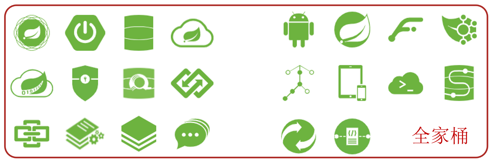

我们只需要重点关注Spring Framework、SpringBoot和SpringCloud：

Spring Framework：Spring框架，是Spring中最早最核心的技术，也是所有其他技术的基础

SpringBoot：Spring是来简化开发，而SpringBoot是来帮助Spring在简化的基础上能更快速进行开发

SpringCloud：这个是用来做分布式之微服务架构的相关开发

除了上面的这三个技术外，还有很多其他的技术，如SpringData、SpringSecurity等，这些都可以被应用在项目中。

**1.1.2 Spring发展史**

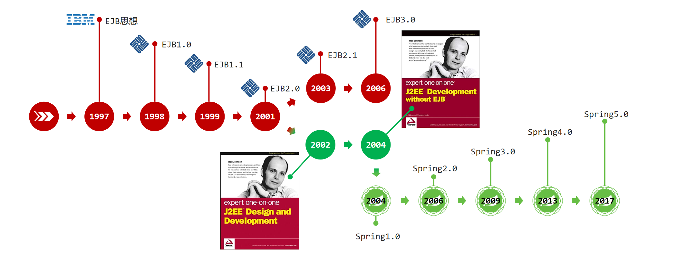

IBM（IT公司-国际商业机器公司）在1997年提出了EJB思想，早期的JavaEE开发大都基于该思想。

Rod Johnson在2002年出版的Expert One-on-One J2EE Design and Development书中有阐述在开发中使用EJB该如何做

Rod Johnson在2004年出版的Expert One-on-One J2EE Development without EJB书中提出了比EJB思想更高效的实现方案，并且在同年将方案进行了具体的落地实现，这个实现就是Spring1.0

随着时间推移，版本不断更新维护，目前最新的是Spring5

Spring1.0是纯配置文件开发

Spring2.0为了简化开发引入了注解开发，此时是配置文件加注解的开发方式

Spring3.0已经可以进行纯注解开发，使开发效率大幅提升，我们的课程会以注解开发为主

Spring4.0根据JDK的版本升级对个别API进行了调整

Spring5.0已经全面支持JDK8，现在Spring最新的是5系列所以建议大家把JDK安装成1.8版

这里所学的Spring其实是Spring家族中的**Spring Framework**。

**1.2 Spring系统架构**

**1.2.1 系统架构图**

Spring Framework是Spring生态圈中最基础的项目，是其他项目的根基，它的发展也经历了很多版本的变更，每个版本都有相应的调整：

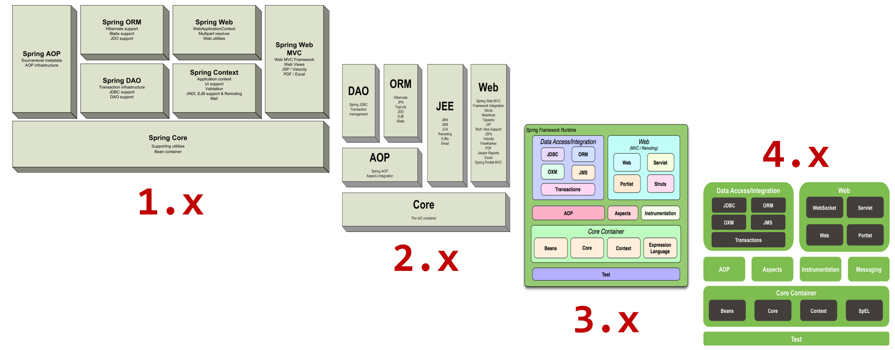

Spring Framework的5版本目前没有最新的架构图，而最新的是4版本，所以接下来主要研究的是4的架构图：

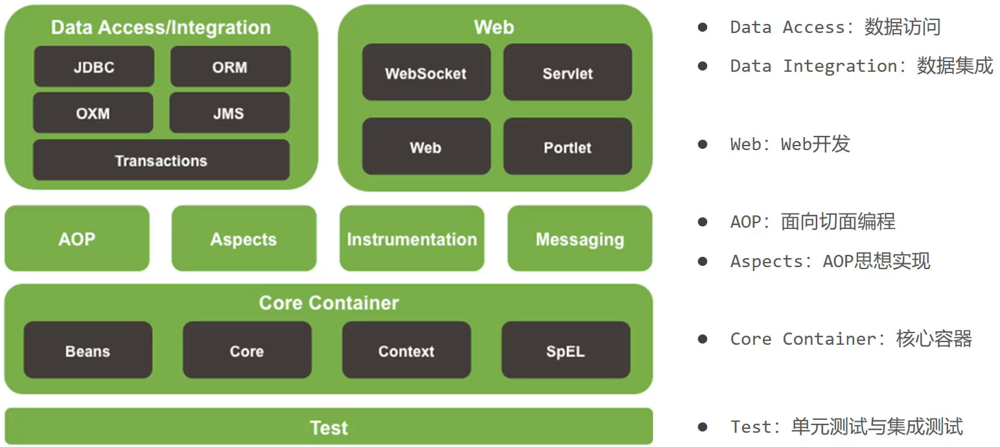

\(1\) 核心层

Core Container：核心容器，这个模块是Spring最核心的模块，其他的都需要依赖该模块

\(2\) AOP层

AOP：面向切面编程，它依赖核心层容器，目的是**在不改变原有代码的前提下对其进行功能增强**

Aspects：AOP是思想，Aspects是对AOP思想的具体实现

\(3\) 数据层

Data Access：数据访问，Spring全家桶中有对数据访问的具体实现技术

Data Integration：数据集成，Spring支持整合其他的数据层解决方案，比如Mybatis

Transactions：事务，Spring中事务管理是Spring AOP的一个具体实现，也是后期学习的重点内容

\(4\) Web层

这一层的内容将在SpringMVC框架具体学习

\(5\) Test层

Spring主要整合了Junit来完成单元测试和集成测试

**1.2.2 学习路线**

对于Spring的学习主要包含四部分内容:

Spring的IOC/DI

Spring的AOP

AOP的具体应用，事务管理

IOC/DI的具体应用，整合Mybatis

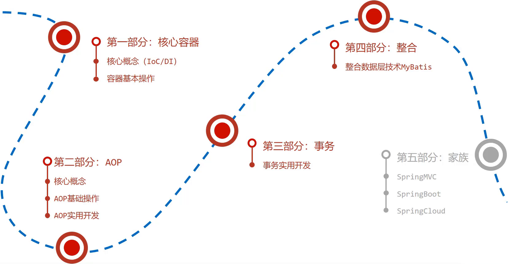

**1.3 Spring核心概念**

**1.3.1 目前项目中的问题**

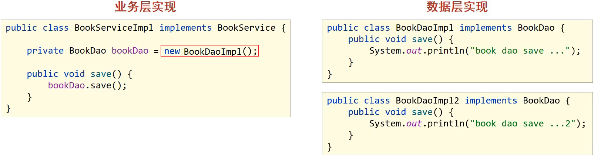

目前的项目中，业务层需要调用数据层的方法，就需要在业务层new数据层的对象，如果数据层的实现类发生变化，那么业务层的代码也需要跟着改变，发生变更后，都需要进行编译打包和重部署，**耦合度偏高**。

如果能把框中的内容给去掉就可以降低依赖，使用对象时，在程序中不要主动使用new产生对象，转换为由**外部**提供对象：

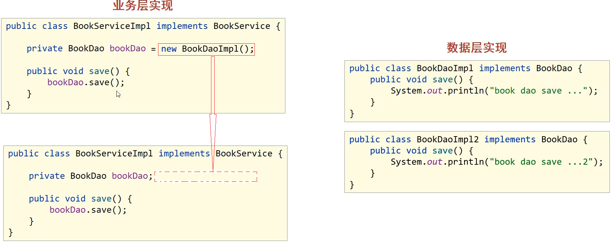

**1.3.2 核心概念**

**IOC（Inversion of Control）控制反转**

使用对象时，由主动new产生对象转换为由**外部**提供对象，此过程中对象创建控制权由程序转移到外部，此思想称为控制反转。

Spring提供了一个容器，称为**IOC容器**，用来充当IOC思想中的"外部"，IOC容器负责对象的创建、初始化等一系列工作，其中包含了数据层和业务层的类对象，被创建或被管理的对象在IOC容器中统称为**Bean**，IOC容器中放的就是一个个的Bean对象。

但当IOC容器中创建好service和dao对象后，IOC容器中虽然有service和dao对象，但是service对象和dao对象没有任何关系，程序仍不能正确执行，需要把dao对象交给service，也就是说要绑定service和dao对象之间的关系，在容器中建立对象与对象之间的绑定关系就要用到DI。

**DI（Dependency Injection）依赖注入**

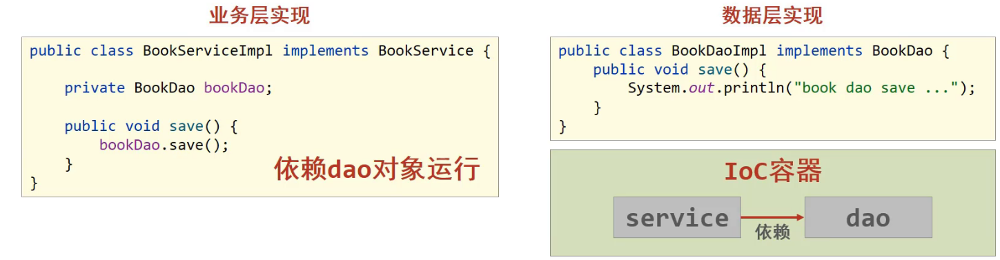

在容器中建立bean与bean之间的依赖关系的整个过程，称为依赖注入；依赖注入是一种思想，业务层要用数据层的类对象，由自己new转换为靠别人注入，这种思想就是依赖注入。

IOC和DI的最终目标是**充分解耦**，具体实现为：

使用IOC容器管理bean（IOC)

在IOC容器内将有依赖关系的bean进行关系绑定（DI）

最终结果为：使用对象时不仅可以直接从IOC容器中获取，并且获取到的bean已经绑定了所有的依赖关系

**1.3.3 核心概念小结**

（1）什么IOC/DI思想？

IOC：控制反转，控制反转的是对象的创建权

DI：依赖注入，绑定对象与对象之间的依赖关系

（2）什么是IOC容器？

Spring创建了一个容器用来存放所创建的对象，这个容器就叫IOC容器

（3）什么是Bean?

容器中所存放的一个个对象就叫Bean或Bean对象

**2.入门案例**

**2.1 IOC入门案例**

**2.1.1 思路分析**

\(1\) Spring是使用容器来管理bean对象的，那么管什么？

主要管理项目中所使用到的类对象，比如（Service和Dao）

\(2\) 如何将被管理的对象告知IOC容器？

使用配置文件

\(3\) 被管理的对象交给IOC容器，要想从容器中获取对象，就先得思考如何获取到IOC容器？

Spring框架提供相应的接口

\(4\) IOC容器得到后，如何从容器中获取bean？

调用Spring框架提供对应接口中的方法

\(5\) 使用Spring导入哪些坐标？

用别人的东西，就需要在pom.xml添加对应的依赖

**2.1.2 代码实现**

需求：将BookServiceImpl和BookDaoImpl交给Spring管理，并从容器中获取对应的bean对象进行方法调用。

1、创建Maven项目

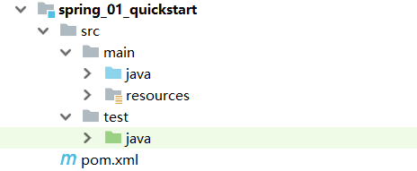

2、添加Spring的依赖jar包

<table>
<colgroup>
<col style="width: 100%" />
</colgroup>
<tbody>
<tr class="odd">
<td>XML 
&lt;dependencies&gt; 
&lt;dependency&gt; 
&lt;groupId&gt;org.springframework&lt;/groupId&gt; 
&lt;artifactId&gt;spring-context&lt;/artifactId&gt; 
&lt;version&gt;5.2.10.RELEASE&lt;/version&gt; 
&lt;/dependency&gt; 
&lt;dependency&gt; 
&lt;groupId&gt;junit&lt;/groupId&gt; 
&lt;artifactId&gt;junit&lt;/artifactId&gt; 
&lt;version&gt;4.12&lt;/version&gt; 
&lt;scope&gt;test&lt;/scope&gt; 
&lt;/dependency&gt; 
&lt;/dependencies&gt;</td>
</tr>
</tbody>
</table>

3、添加案例中需要的类

创建BookService、BookServiceImpl、BookDao、BookDaoImpl四个类

<table>
<colgroup>
<col style="width: 100%" />
</colgroup>
<tbody>
<tr class="odd">
<td>Java 
public interface BookDao { 
public void save(); 
} 
public class BookDaoImpl implements BookDao { 
public void save() { 
System.out.println("book dao save ..."); 
} 
} 
public interface BookService { 
public void save(); 
} 
public class BookServiceImpl implements BookService { 
private BookDao bookDao = new BookDaoImpl(); 
public void save() { 
System.out.println("book service save ..."); 
bookDao.save(); 
} 
}</td>
</tr>
</tbody>
</table>

4、添加spring配置文件

resources下添加spring配置文件applicationContext.xml，并完成bean的配置

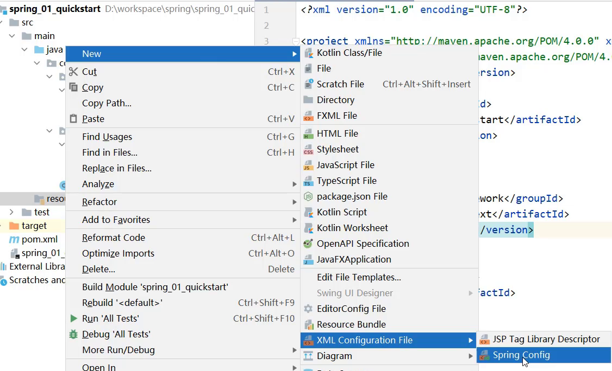

5、在配置文件中完成bean的配置

<table>
<colgroup>
<col style="width: 100%" />
</colgroup>
<tbody>
<tr class="odd">
<td>XML 
&lt;?xml version="1.0" encoding="UTF-8"？&gt; 
&lt;beans xmlns="http://www.springframework.org/schema/beans" 
xmlns:xsi="http://www.w3.org/2001/XMLSchema-instance" 
xsi:schemaLocation="http://www.springframework.org/schema/beans http://www.springframework.org/schema/beans/spring-beans.xsd"&gt; 
 
&lt;!--bean标签标示配置bean 
id属性标示给bean起名字 
class属性表示给bean定义类型 
--&gt; 
&lt;bean id="bookDao" class="com.itheima.dao.impl.BookDaoImpl"/&gt; 
&lt;bean id="bookService" class="com.itheima.service.impl.BookServiceImpl"/&gt; 
 
&lt;/beans&gt;</td>
</tr>
</tbody>
</table>

|                                                                      |
|----------------------------------------------------------------------|
| **注意事项**：bean定义时id属性在同一个上下文中（配置文件）不能重复。 |

6、获取IOC容器

使用Spring提供的接口完成IOC容器的创建，创建App类，编写main方法

<table>
<colgroup>
<col style="width: 100%" />
</colgroup>
<tbody>
<tr class="odd">
<td>Java 
public class App { 
public static void main(String[] args) { 
// 获取IOC容器 
ApplicationContext ctx = new ClassPathXmlApplicationContext("applicationContext.xml"); 
} 
}</td>
</tr>
</tbody>
</table>

7、从容器中获取对象进行方法调用

<table>
<colgroup>
<col style="width: 100%" />
</colgroup>
<tbody>
<tr class="odd">
<td>Java 
public class App { 
public static void main(String[] args) { 
// 获取IOC容器 
ApplicationContext ctx = new ClassPathXmlApplicationContext("applicationContext.xml"); 
// BookDao bookDao = (BookDao) ctx.getBean("bookDao"); 
// bookDao.save(); 
BookService bookService = (BookService) ctx.getBean("bookService"); 
bookService.save(); 
} 
}</td>
</tr>
</tbody>
</table>

8、 运行程序

测试结果为：

**2.2 DI入门案例**

在IOC入门案例中，BookDao的对象还是通过new的方式创建的，存在业务耦合，这就需要通过DI进行依赖注入。

**2.2.1 思路分析**

\(1\) 要想实现依赖注入，必须要基于IOC管理Bean

DI的入门案例要依赖于前面IOC的入门案例

\(2\) Service中使用new形式创建的Dao对象是否保留？

需要删除掉，最终要使用IOC容器中的bean对象

\(3\) Service中需要的Dao对象如何进入到Service中？

在Service中提供方法，让Spring的IOC容器可以通过该方法传入bean对象

\(4\) Service与Dao间的关系如何描述？

使用配置文件

**2.2.2 代码实现**

需求：基于IOC入门案例，在BookServiceImpl类中删除new对象的方式，使用Spring的DI完成Dao层的注入。

1、去除代码中的new

在BookServiceImpl类中，删除业务层中使用new的方式创建的dao对象

<table>
<colgroup>
<col style="width: 100%" />
</colgroup>
<tbody>
<tr class="odd">
<td>Java 
public class BookServiceImpl implements BookService { 
// 删除业务层中使用new的方式创建的dao对象 
private BookDao bookDao; 
 
public void save() { 
System.out.println("book service save ..."); 
bookDao.save(); 
} 
}</td>
</tr>
</tbody>
</table>

2、为属性提供setter方法

在BookServiceImpl类中，为BookDao提供setter方法

<table>
<colgroup>
<col style="width: 100%" />
</colgroup>
<tbody>
<tr class="odd">
<td>Java 
public class BookServiceImpl implements BookService { 
// 删除业务层中使用new的方式创建的dao对象 
private BookDao bookDao; 
 
public void save() { 
System.out.println("book service save ..."); 
bookDao.save(); 
} 
// 提供对应的set方法 
public void setBookDao(BookDao bookDao) { 
this.bookDao = bookDao; 
} 
}</td>
</tr>
</tbody>
</table>

3、修改配置完成注入

在配置文件中添加依赖注入的配置

<table>
<colgroup>
<col style="width: 100%" />
</colgroup>
<tbody>
<tr class="odd">
<td>XML 
&lt;?xml version="1.0" encoding="UTF-8"？&gt; 
&lt;beans xmlns="http://www.springframework.org/schema/beans" 
xmlns:xsi="http://www.w3.org/2001/XMLSchema-instance" 
xsi:schemaLocation="http://www.springframework.org/schema/beans http://www.springframework.org/schema/beans/spring-beans.xsd"&gt; 
&lt;!--bean标签标示配置bean 
id属性标示给bean起名字 
class属性表示给bean定义类型 
--&gt; 
&lt;bean id="bookDao" class="com.itheima.dao.impl.BookDaoImpl"/&gt; 
 
&lt;bean id="bookService" class="com.itheima.service.impl.BookServiceImpl"&gt; 
&lt;!--配置server与dao的关系--&gt; 
&lt;!--property标签表示配置当前bean的属性 
name属性表示配置哪一个具体的属性 
ref属性表示参照哪一个bean 
--&gt; 
&lt;property name="bookDao" ref="bookDao"/&gt; 
&lt;/bean&gt; 
 
&lt;/beans&gt;</td>
</tr>
</tbody>
</table>

**注意**：配置中的两个bookDao的含义是不一样的

name="bookDao"中bookDao的作用是让Spring的IOC容器在获取到名称后，将首字母大写，前面加set找对应的setBookDao()方法进行对象注入

ref="bookDao"中bookDao的作用是让Spring能在IOC容器中找到id为bookDao的Bean对象给bookService进行注入

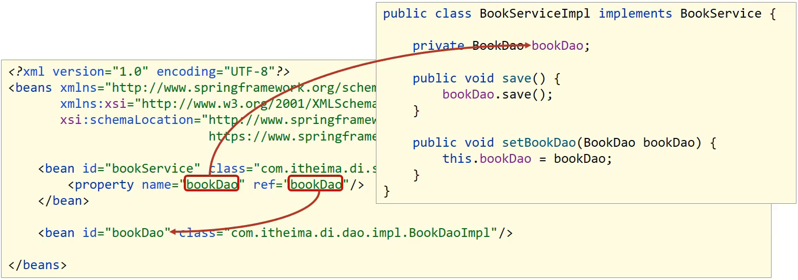

4、运行程序

运行，测试结果为：

**3.IOC相关内容**

**3.1 bean基础配置**

对于bean的配置中，主要是bean基础配置、bean的别名配置、bean的作用范围配置（重点），这三部分内容。

**3.1.1 id与class**

对于bean的基础配置，在前面的案例中已经使用过：

<table>
<colgroup>
<col style="width: 100%" />
</colgroup>
<tbody>
<tr class="odd">
<td>XML 
&lt;bean id="" class=""/&gt;</td>
</tr>
</tbody>
</table>

其中，bean标签的功能、使用方式以及id和class属性的作用如下：

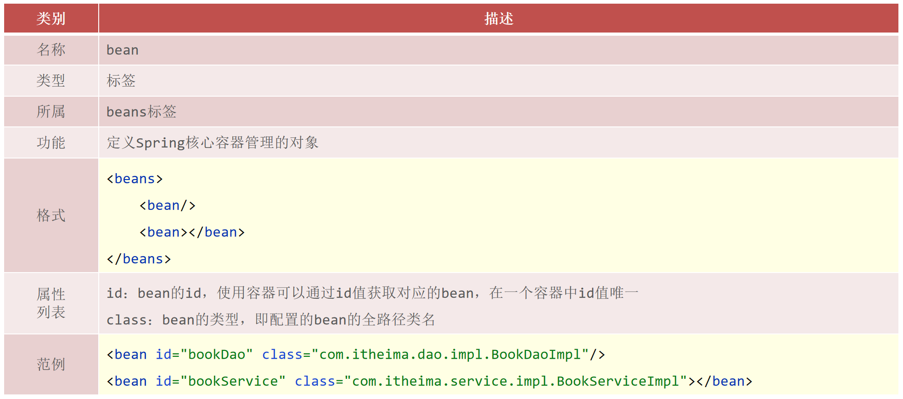

**注意：**由于接口无法创建对象，所以class属性不能写接口如BookDao的类全名。

bean的id属性必须唯一，这就说明可能由于命名习惯而产生分歧，要解决这个问题，需要准备下开发环境，内容和前面的案例是一样的，内容如下：

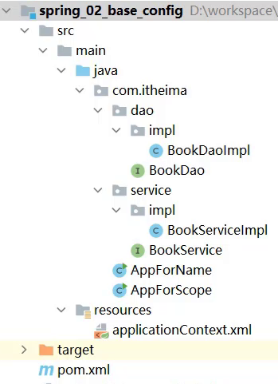

**3.1.2 bean的name属性**

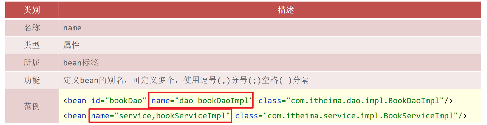

1、配置别名

打开spring的配置文件applicationContext.xml

<table>
<colgroup>
<col style="width: 100%" />
</colgroup>
<tbody>
<tr class="odd">
<td>XML 
&lt;?xml version="1.0" encoding="UTF-8"？&gt; 
&lt;beans xmlns="http://www.springframework.org/schema/beans" 
xmlns:xsi="http://www.w3.org/2001/XMLSchema-instance" 
xsi:schemaLocation="http://www.springframework.org/schema/beans http://www.springframework.org/schema/beans/spring-beans.xsd"&gt; 
 
&lt;!--name:为bean指定别名，别名可以有多个，使用逗号，分号，空格进行分隔--&gt; 
&lt;bean id="bookService" name="service service4 bookEbi" class="com.itheima.service.impl.BookServiceImpl"&gt; 
&lt;property name="bookDao" ref="bookDao"/&gt; 
&lt;/bean&gt; 
 
&lt;bean id="bookDao" name="dao" class="com.itheima.dao.impl.BookDaoImpl"/&gt; 
&lt;/beans&gt;</td>
</tr>
</tbody>
</table>

**说明**：Ebi全称Enterprise Business Interface，翻译为企业业务接口。

2、根据名称容器中获取bean对象

<table>
<colgroup>
<col style="width: 100%" />
</colgroup>
<tbody>
<tr class="odd">
<td>Java 
public class AppForName { 
public static void main(String[] args) { 
ApplicationContext ctx = new ClassPathXmlApplicationContext("applicationContext.xml"); 
// 此处根据bean标签的id属性和name属性的任意一个值来获取bean对象 
BookService bookService = (BookService) ctx.getBean("service4"); 
bookService.save(); 
} 
}</td>
</tr>
</tbody>
</table>

3、运行程序

测试结果为：

**注意事项**：

bean依赖注入的ref属性指定的bean，必须在容器中存在

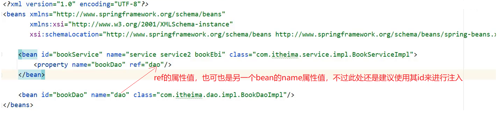

如果不存在，则会报错，如下：

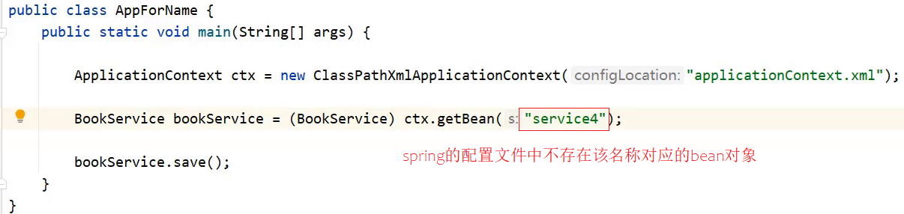

这个错误大家需要特别关注下：

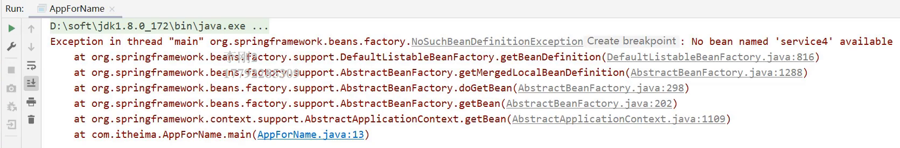

获取bean无论是通过id还是name获取，如果无法获取到，将抛出异常**NoSuchBeanDefinitionException**

**3.1.3 bean作用范围**

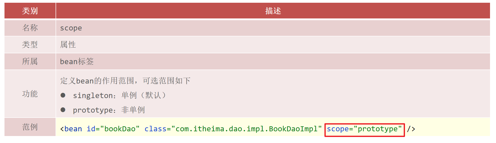

**验证IOC容器中对象是否为单例**

验证思路：同一个bean获取两次，将对象打印到控制台，看打印出的地址值是否一致。

具体实现：

创建一个AppForScope的类，在其main方法中来验证

<table>
<colgroup>
<col style="width: 100%" />
</colgroup>
<tbody>
<tr class="odd">
<td>Java 
public class AppForScope { 
public static void main(String[] args) { 
ApplicationContext ctx = new 
ClassPathXmlApplicationContext("applicationContext.xml"); 
 
BookDao bookDao1 = (BookDao) ctx.getBean("bookDao"); 
BookDao bookDao2 = (BookDao) ctx.getBean("bookDao"); 
System.out.println(bookDao1); 
System.out.println(bookDao2); 
} 
}</td>
</tr>
</tbody>
</table>

打印，观察控制台的打印结果

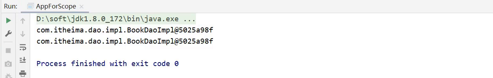

通过结果可以看出，默认情况下Spring创建的bean对象都是单例的。

**配置bean为非单例**

在Spring配置文件中，配置scope属性来实现bean的非单例创建

在Spring的配置文件中，修改\<bean\>的scope属性，将scope设置为singleton

<table>
<colgroup>
<col style="width: 100%" />
</colgroup>
<tbody>
<tr class="odd">
<td>XML 
&lt;bean id="bookDao" name="dao" class="com.itheima.dao.impl.BookDaoImpl" scope="singleton"/&gt;</td>
</tr>
</tbody>
</table>

运行AppForScope，打印看结果

将scope设置为prototype

<table>
<colgroup>
<col style="width: 100%" />
</colgroup>
<tbody>
<tr class="odd">
<td>XML 
&lt;bean id="bookDao" name="dao" class="com.itheima.dao.impl.BookDaoImpl" scope="prototype"/&gt;</td>
</tr>
</tbody>
</table>

运行AppForScope，打印看结果

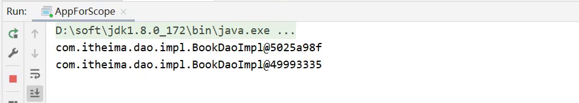

所以，使用bean的scope属性可以控制bean的创建是否为单例：

singleton默认为单例

prototype为非单例

**scope使用后续思考**

为什么bean默认为单例？

bean为单例的意思是在Spring的IOC容器中只会有该类的一个对象

bean对象只有一个就避免了对象的频繁创建与销毁，达到了bean对象的复用，性能高

bean在容器中是单例的，会不会产生线程安全问题？

如果对象是有状态对象，即该对象有成员变量可以用来存储数据的

因为所有请求线程共用一个bean对象，所以会存在线程安全问题

如果对象是无状态对象，即该对象没有成员变量没有进行数据存储的

因方法中的局部变量在方法调用完成后会被销毁，所以不会存在线程安全问题

哪些bean对象适合交给容器进行管理？

表现层对象

业务层对象

数据层对象

工具对象

哪些bean对象不适合交给容器进行管理？

封装实例的域对象，因为会引发线程安全问题，所以不适合

**3.1.4 bean基础配置小结**

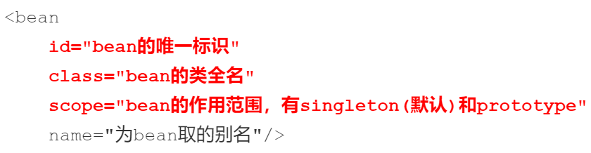

**3.2 bean实例化**

bean本质上就是对象，对象在new的时候会使用构造方法完成，那创建bean也是使用构造方法完成的。基于这个知识点来验证spring中bean的三种创建方式。

**3.2.1 环境准备**

步骤和前面的都一致，最终项目的结构如下：

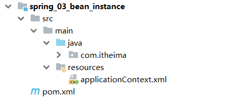

**3.2.2 构造方法实例化**

先研究下Spring中的第一种bean的创建方式 构造方法实例化。

1、准备需要被创建的类

准备一个BookDao和BookDaoImpl类

<table>
<colgroup>
<col style="width: 100%" />
</colgroup>
<tbody>
<tr class="odd">
<td>Java 
public interface BookDao { 
public void save(); 
} 
 
public class BookDaoImpl implements BookDao { 
public void save() { 
System.out.println("book dao save ..."); 
} 
}</td>
</tr>
</tbody>
</table>

2、将类配置到Spring容器

<table>
<colgroup>
<col style="width: 100%" />
</colgroup>
<tbody>
<tr class="odd">
<td>XML 
&lt;?xml version="1.0" encoding="UTF-8"？&gt; 
&lt;beans xmlns="http://www.springframework.org/schema/beans" 
xmlns:xsi="http://www.w3.org/2001/XMLSchema-instance" 
xsi:schemaLocation="http://www.springframework.org/schema/beans http://www.springframework.org/schema/beans/spring-beans.xsd"&gt; 
 
&lt;bean id="bookDao" class="com.itheima.dao.impl.BookDaoImpl"/&gt; 
 
&lt;/beans&gt;</td>
</tr>
</tbody>
</table>

3、编写运行程序

<table>
<colgroup>
<col style="width: 100%" />
</colgroup>
<tbody>
<tr class="odd">
<td>Java 
public class AppForInstanceBook { 
public static void main(String[] args) { 
ApplicationContext ctx = new ClassPathXmlApplicationContext("applicationContext.xml"); 
BookDao bookDao = (BookDao) ctx.getBean("bookDao"); 
bookDao.save(); 
} 
}</td>
</tr>
</tbody>
</table>

4、类中提供构造函数测试

在BookDaoImpl类中添加一个无参构造函数，并打印一句话，方便观察结果。

<table>
<colgroup>
<col style="width: 100%" />
</colgroup>
<tbody>
<tr class="odd">
<td>Java 
public class BookDaoImpl implements BookDao { 
public BookDaoImpl() { 
System.out.println("book dao constructor is running ...."); 
} 
public void save() { 
System.out.println("book dao save ..."); 
} 
}</td>
</tr>
</tbody>
</table>

运行程序，如果控制台有打印构造函数中的输出，说明Spring容器在创建对象的时候也走的是构造函数

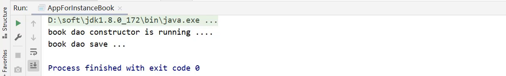

5、将构造函数改成private测试

<table>
<colgroup>
<col style="width: 100%" />
</colgroup>
<tbody>
<tr class="odd">
<td>Java 
public class BookDaoImpl implements BookDao { 
private BookDaoImpl() { 
System.out.println("book dao constructor is running ...."); 
} 
public void save() { 
System.out.println("book dao save ..."); 
} 
}</td>
</tr>
</tbody>
</table>

运行程序，能执行成功，说明内部走的依然是构造函数，能访问到类中的私有构造方法，显而易见Spring底层用的是反射

6、构造函数中添加一个参数测试

<table>
<colgroup>
<col style="width: 100%" />
</colgroup>
<tbody>
<tr class="odd">
<td>Java 
public class BookDaoImpl implements BookDao { 
private BookDaoImpl(int i) { 
System.out.println("book dao constructor is running ...."); 
} 
 
public void save() { 
System.out.println("book dao save ..."); 
} 
}</td>
</tr>
</tbody>
</table>

运行程序，程序会报错，说明Spring底层使用的是类的无参构造方法。

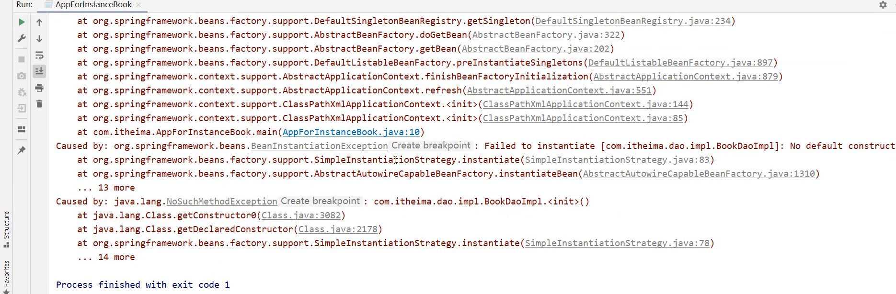

**分析Spring的错误信息**

接下来，我们主要研究下Spring的报错信息来学一学如何阅读。

错误信息从下往上依次查看，因为上面的错误大都是对下面错误的一个包装，最核心错误是在最下面

Caused by: java.lang.NoSuchMethodException: com.itheima.dao.impl.BookDaoImpl.\<init\>()

Caused by 翻译为引起，即出现错误的原因

java.lang.NoSuchMethodException：抛出的异常为没有这样的方法异常

com.itheima.dao.impl.BookDaoImpl.\<init\>()：哪个类的哪个方法没有被找到导致的异常，\<init\>()指定是类的构造方法，即该类的无参构造方法

如果最后一行错误获取不到错误信息，接下来查看第二层：

Caused by: org.springframework.beans.BeanInstantiationException: Failed to instantiate \[com.itheima.dao.impl.BookDaoImpl\]: No default constructor found; nested exception is java.lang.NoSuchMethodException: com.itheima.dao.impl.BookDaoImpl.\<init\>()

nested：嵌套的意思，后面的异常内容和最底层的异常是一致的

Caused by: org.springframework.beans.BeanInstantiationException: Failed to instantiate \[com.itheima.dao.impl.BookDaoImpl\]: No default constructor found;

Caused by：引发

BeanInstantiationException：翻译为bean实例化异常

No default constructor found：没有一个默认的构造函数被发现

看到这其实错误已经比较明显。

**3.2.3 静态工厂实例化**

接下来研究Spring中的第二种bean的创建方式 静态工厂实例化:

**工厂方式创建bean**

在讲这种方式之前，我们需要先回顾一个知识点是使用工厂来创建对象的方式：

（1）准备一个OrderDao和OrderDaoImpl类

<table>
<colgroup>
<col style="width: 100%" />
</colgroup>
<tbody>
<tr class="odd">
<td>Java 
public interface OrderDao { 
public void save(); 
} 
 
public class OrderDaoImpl implements OrderDao { 
public void save() { 
System.out.println("order dao save ..."); 
} 
}</td>
</tr>
</tbody>
</table>

（2）创建一个工厂类OrderDaoFactory并提供一个**静态方法**

<table>
<colgroup>
<col style="width: 100%" />
</colgroup>
<tbody>
<tr class="odd">
<td>Java 
// 静态工厂创建对象 
public class OrderDaoFactory { 
public static OrderDao getOrderDao(){ 
return new OrderDaoImpl(); 
} 
}</td>
</tr>
</tbody>
</table>

（3）编写AppForInstanceOrder运行类，在类中通过工厂获取对象

<table>
<colgroup>
<col style="width: 100%" />
</colgroup>
<tbody>
<tr class="odd">
<td>Java 
public class AppForInstanceOrder { 
public static void main(String[] args) { 
// 通过静态工厂创建对象 
OrderDao orderDao = OrderDaoFactory.getOrderDao(); 
orderDao.save(); 
} 
}</td>
</tr>
</tbody>
</table>

（4）运行后，可以查看到结果

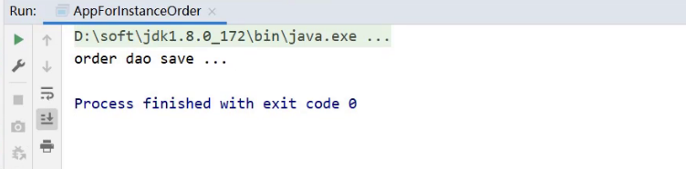

如果代码中对象是通过上面的这种方式来创建的，那么交给Spring管理的步骤为：

（1）在spring的配置文件application.properties中添加以下内容：

<table>
<colgroup>
<col style="width: 100%" />
</colgroup>
<tbody>
<tr class="odd">
<td>XML 
&lt;bean id="orderDao" class="com.itheima.factory.OrderDaoFactory" factory-method="getOrderDao"/&gt;</td>
</tr>
</tbody>
</table>

class：工厂类的类全名

factory-mehod：具体工厂类中创建对象的方法名

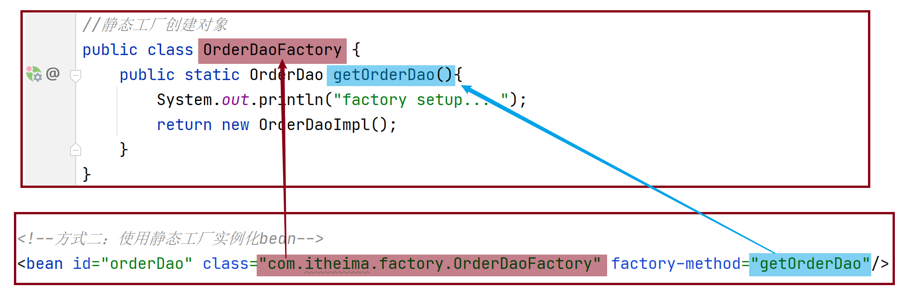

（2）在AppForInstanceOrder运行类，使用从IOC容器中获取bean的方法进行运行测试

<table>
<colgroup>
<col style="width: 100%" />
</colgroup>
<tbody>
<tr class="odd">
<td>Java 
public class AppForInstanceOrder { 
public static void main(String[] args) { 
ApplicationContext ctx = new ClassPathXmlApplicationContext("applicationContext.xml"); 
OrderDao orderDao = (OrderDao) ctx.getBean("orderDao"); 
orderDao.save(); 
} 
}</td>
</tr>
</tbody>
</table>

（3）运行后，可以查看到结果

在工厂类中也是直接new对象的，和直接new没什么太大的区别，而且静态工厂的方式反而更复杂，这种方式的意义是什么？

主要的原因是：

在工厂的静态方法中，除了new对象还可以做其他的一些业务操作，这些操作必不可少，如：

<table>
<colgroup>
<col style="width: 100%" />
</colgroup>
<tbody>
<tr class="odd">
<td>Java 
public class OrderDaoFactory { 
public static OrderDao getOrderDao(){ 
System.out.println("factory setup...."); //模拟必要的业务操作 
return new OrderDaoImpl(); 
} 
}</td>
</tr>
</tbody>
</table>

之前new对象的方式就无法添加其他的业务内容，重新运行，查看结果：

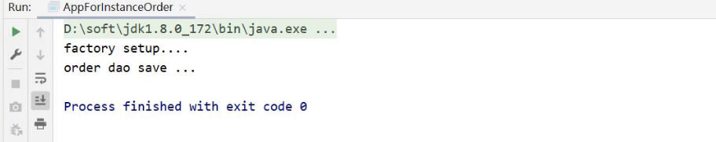

静态工厂实例化一般是用来兼容早期的一些老系统，了解为主。

**3.2.4 实例工厂与FactoryBean**

接下来继续来研究Spring的第三种bean的创建方式 实例工厂实例化。

**环境准备**

（1）准备一个UserDao和UserDaoImpl类

<table>
<colgroup>
<col style="width: 100%" />
</colgroup>
<tbody>
<tr class="odd">
<td>Java 
public interface UserDao { 
public void save(); 
} 
 
public class UserDaoImpl implements UserDao { 
public void save() { 
System.out.println("user dao save ..."); 
} 
}</td>
</tr>
</tbody>
</table>

（2）创建一个工厂类UserDaoFactory并提供一个普通方法，注意此处和静态工厂的工厂类不一样的地方是方法不是静态方法

<table>
<colgroup>
<col style="width: 100%" />
</colgroup>
<tbody>
<tr class="odd">
<td>Java 
public class UserDaoFactory { 
public UserDao getUserDao(){ 
return new UserDaoImpl(); 
} 
}</td>
</tr>
</tbody>
</table>

（3）编写AppForInstanceUser运行类，在类中通过工厂获取对象

<table>
<colgroup>
<col style="width: 100%" />
</colgroup>
<tbody>
<tr class="odd">
<td>Java 
public class AppForInstanceUser { 
public static void main(String[] args) { 
//创建实例工厂对象 
UserDaoFactory userDaoFactory = new UserDaoFactory(); 
//通过实例工厂对象创建对象 
UserDao userDao = userDaoFactory.getUserDao(); 
userDao.save(); 
}</td>
</tr>
</tbody>
</table>

（4）运行后，可以查看到结果

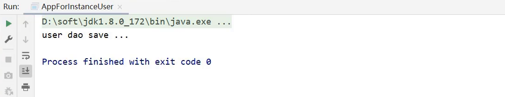

对于上面这种实例工厂的方式如何交给Spring管理呢？

**实例工厂实例化**

（1）在spring的配置文件中添加以下内容:

<table>
<colgroup>
<col style="width: 100%" />
</colgroup>
<tbody>
<tr class="odd">
<td>XML 
&lt;bean id="userFactory" class="com.itheima.factory.UserDaoFactory"/&gt; 
&lt;bean id="userDao" factory-method="getUserDao" factory-bean="userFactory"/&gt;</td>
</tr>
</tbody>
</table>

实例化工厂运行的顺序是:

创建实例化工厂对象，对应的是第一行配置

调用对象中的方法来创建bean，对应的是第二行配置

factory-bean：工厂的实例对象

factory-method：工厂对象中的具体创建对象的方法名，对应关系如下：

> 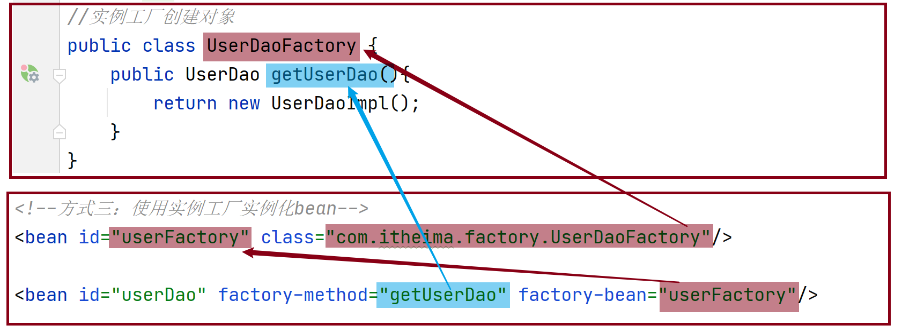

（2）在AppForInstanceUser运行类，使用从IOC容器中获取bean的方法进行运行测试

<table>
<colgroup>
<col style="width: 100%" />
</colgroup>
<tbody>
<tr class="odd">
<td>Java 
public class AppForInstanceUser { 
public static void main(String[] args) { 
ApplicationContext ctx = new ClassPathXmlApplicationContext("applicationContext.xml"); 
UserDao userDao = (UserDao) ctx.getBean("userDao"); 
userDao.save(); 
} 
}</td>
</tr>
</tbody>
</table>

（3）运行后，可以查看到结果

实例工厂实例化的方式就已经介绍完了，配置的过程还是比较复杂，所以Spring为了简化这种配置方式就提供了一种叫FactoryBean的方式来简化开发。

**FactoryBean的使用**

（1）创建一个UserDaoFactoryBean的类，实现FactoryBean接口，重写接口的方法

<table>
<colgroup>
<col style="width: 100%" />
</colgroup>
<tbody>
<tr class="odd">
<td>Java 
public class UserDaoFactoryBean implements FactoryBean&lt;UserDao&gt; { 
// 代替原始实例工厂中创建对象的方法 
public UserDao getObject() throws Exception { 
return new UserDaoImpl(); 
} 
// 返回所创建类的Class对象 
public Class&lt;?&gt; getObjectType() { 
return UserDao.class; 
} 
}</td>
</tr>
</tbody>
</table>

（2）在Spring的配置文件中进行配置

<table>
<colgroup>
<col style="width: 100%" />
</colgroup>
<tbody>
<tr class="odd">
<td>XML 
&lt;bean id="userDao" class="com.itheima.factory.UserDaoFactoryBean"/&gt;</td>
</tr>
</tbody>
</table>

（3）AppForInstanceUser运行类不用做任何修改，直接运行

这种方式在Spring去整合其他框架的时候会被用到，所以这种方式需要理解掌握。

查看源码会发现，FactoryBean接口其实会有三个方法，分别是:

<table>
<colgroup>
<col style="width: 100%" />
</colgroup>
<tbody>
<tr class="odd">
<td>Java 
T getObject() throws Exception; 
 
Class&lt;?&gt; getObjectType(); 
 
default boolean isSingleton() { 
return true; 
}</td>
</tr>
</tbody>
</table>

方法一：getObject()，被重写后，在方法中进行对象的创建并返回

方法二：getObjectType()，被重写后，主要返回的是被创建类的Class对象

方法三：没有被重写，因为它已经给了默认值设置对象是否为单例，默认true，即默认是单例

验证思路就是从容器中获取该对象的多个值，打印到控制台，查看是否为同一个对象。

<table>
<colgroup>
<col style="width: 100%" />
</colgroup>
<tbody>
<tr class="odd">
<td>Java 
public class AppForInstanceUser { 
public static void main(String[] args) { 
ApplicationContext ctx = new ClassPathXmlApplicationContext("applicationContext.xml"); 
UserDao userDao1 = (UserDao) ctx.getBean("userDao"); 
UserDao userDao2 = (UserDao) ctx.getBean("userDao"); 
System.out.println(userDao1); 
System.out.println(userDao2); 
} 
}</td>
</tr>
</tbody>
</table>

打印结果，如下:

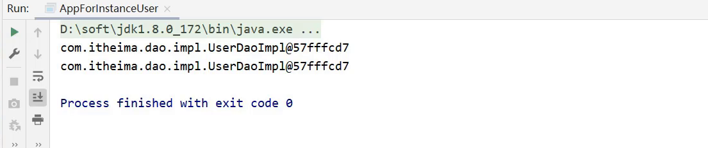

通过验证，会发现默认是单例，如果想改成非单例，只需要将isSingleton()方法进行重写，修改返回为false，即可

<table>
<colgroup>
<col style="width: 100%" />
</colgroup>
<tbody>
<tr class="odd">
<td>Java 
// FactoryBean创建对象 
public class UserDaoFactoryBean implements FactoryBean&lt;UserDao&gt; { 
// 代替原始实例工厂中创建对象的方法 
public UserDao getObject() throws Exception { 
return new UserDaoImpl(); 
} 
 
public Class&lt;?&gt; getObjectType() { 
return UserDao.class; 
} 
 
public boolean isSingleton() { 
return false; 
} 
}</td>
</tr>
</tbody>
</table>

重新运行AppForInstanceUser，查看结果

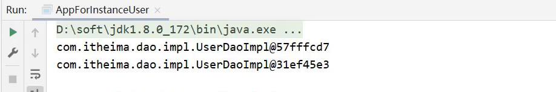

从结果中可以看出现在已经是非单例了，但是一般情况下都会采用单例，也就是采用默认即可。所以isSingleton()方法一般不需要进行重写。

**3.2.5 bean实例化小结**

（1）bean是如何创建的呢？

构造方法

（2）Spring的IOC实例化对象的三种方式分别是：

构造方法(常用)

静态工厂(了解)

实例工厂(了解)

FactoryBean(实用)

这些方式中，重点掌握构造方法和FactoryBean即可。

构造方法在类中默认会提供，但是如果重写了构造方法，默认的就会消失，如果需要重写构造方法，最好把默认的构造方法也重写下。

**3.3 bean的生命周期**

bean生命周期指一个bean对象从创建到销毁的整体过程。

**3.3.1 环境准备**

步骤和前面的都一致，快速拷贝即可，最终项目的结构如下:

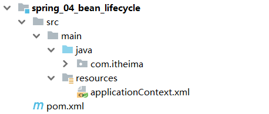

（1）项目中添加BookDao、BookDaoImpl、BookService和BookServiceImpl类

<table>
<colgroup>
<col style="width: 100%" />
</colgroup>
<tbody>
<tr class="odd">
<td>Java 
public interface BookDao { 
public void save(); 
} 
 
public class BookDaoImpl implements BookDao { 
public void save() { 
System.out.println("book dao save ..."); 
} 
} 
 
public interface BookService { 
public void save(); 
} 
 
public class BookServiceImpl implements BookService{ 
private BookDao bookDao; 
 
public void setBookDao(BookDao bookDao) { 
this.bookDao = bookDao; 
} 
 
public void save() { 
System.out.println("book service save ..."); 
bookDao.save(); 
} 
}</td>
</tr>
</tbody>
</table>

（2）resources下提供spring的配置文件

<table>
<colgroup>
<col style="width: 100%" />
</colgroup>
<tbody>
<tr class="odd">
<td>XML 
&lt;?xml version="1.0" encoding="UTF-8"？&gt; 
&lt;beans xmlns="http://www.springframework.org/schema/beans" 
xmlns:xsi="http://www.w3.org/2001/XMLSchema-instance" 
xsi:schemaLocation="http://www.springframework.org/schema/beans http://www.springframework.org/schema/beans/spring-beans.xsd"&gt; 
 
&lt;bean id="bookDao" class="com.itheima.dao.impl.BookDaoImpl"/&gt; 
&lt;/beans&gt;</td>
</tr>
</tbody>
</table>

（3）编写AppForLifeCycle运行类，加载Spring的IOC容器，并从中获取对应的bean对象

<table>
<colgroup>
<col style="width: 100%" />
</colgroup>
<tbody>
<tr class="odd">
<td>Java 
public class AppForLifeCycle { 
public static void main( String[] args ) { 
ApplicationContext ctx = new ClassPathXmlApplicationContext("applicationContext.xml"); 
BookDao bookDao = (BookDao) ctx.getBean("bookDao"); 
bookDao.save(); 
} 
}</td>
</tr>
</tbody>
</table>

**3.3.2 生命周期设置**

接下来，在上面这个环境中来为BookDao添加生命周期的控制方法，具体的控制有两个阶段：

bean创建之后，想要添加内容，比如用来初始化需要用到资源

bean销毁之前，想要添加内容，比如用来释放用到的资源

1、添加初始化和销毁方法

在BooDaoImpl类中分别添加两个方法，方法名任意

<table>
<colgroup>
<col style="width: 100%" />
</colgroup>
<tbody>
<tr class="odd">
<td>Java 
public class BookDaoImpl implements BookDao { 
public void save() { 
System.out.println("book dao save ..."); 
} 
// 表示bean初始化对应的操作 
public void init(){ 
System.out.println("init..."); 
} 
// 表示bean销毁前对应的操作 
public void destory(){ 
System.out.println("destory..."); 
} 
}</td>
</tr>
</tbody>
</table>

2、配置生命周期

在配置文件添加配置

<table>
<colgroup>
<col style="width: 100%" />
</colgroup>
<tbody>
<tr class="odd">
<td>XML 
&lt;bean id="bookDao" class="com.itheima.dao.impl.BookDaoImpl" init-method="init" destroy-method="destory"/&gt;</td>
</tr>
</tbody>
</table>

3、运行程序

运行AppForLifeCycle打印结果为:

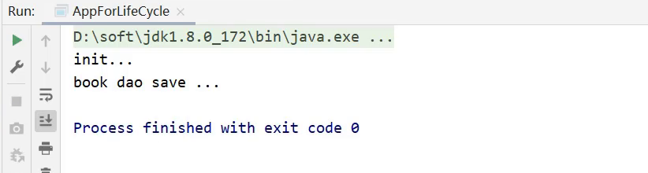

从结果中可以看出，init方法执行了，但是destroy方法却未执行，这是为什么呢？

Spring的IOC容器是运行在JVM中

运行main方法后，JVM启动，Spring加载配置文件生成IOC容器，从容器获取bean对象，然后调方法执行

main方法执行完后，JVM退出，这个时候IOC容器中的bean还没有来得及销毁就已经结束了

所以没有调用对应的destroy方法

**3.3.3 close关闭容器**

ApplicationContext中没有close方法

需要将ApplicationContext更换成ClassPathXmlApplicationContext

<table>
<colgroup>
<col style="width: 100%" />
</colgroup>
<tbody>
<tr class="odd">
<td>Java 
ClassPathXmlApplicationContext ctx = new ClassPathXmlApplicationContext("applicationContext.xml");</td>
</tr>
</tbody>
</table>

调用ctx的close()方法

<table>
<colgroup>
<col style="width: 100%" />
</colgroup>
<tbody>
<tr class="odd">
<td>Plaintext 
ctx.close();</td>
</tr>
</tbody>
</table>

运行程序，就能执行destroy方法的内容

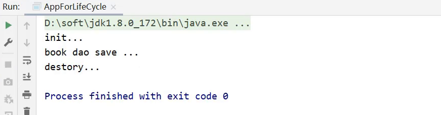

**3.3.4 注册钩子关闭容器**

在容器未关闭之前，提前设置好回调函数，让JVM在退出之前回调此函数来关闭容器

调用ctx的registerShutdownHook()方法

<table>
<colgroup>
<col style="width: 100%" />
</colgroup>
<tbody>
<tr class="odd">
<td>Java 
ctx.registerShutdownHook();</td>
</tr>
</tbody>
</table>

**注意**：registerShutdownHook在ApplicationContext中也没有。

运行后，查询打印结果

close和registerShutdownHook都能用来关闭容器，close()是在调用的时候关闭，registerShutdownHook()是在JVM退出前调用关闭。

但添加初始化和销毁方法，即需要编码也需要配置，实现起来步骤比较多也比较乱。Spring提供了两个接口来完成生命周期的控制，好处是可以不用再进行配置init-method和destroy-method。

接下来在BookServiceImpl完成这两个接口的使用：修改BookServiceImpl类，添加两个接口InitializingBean， DisposableBean并实现接口中的两个方法afterPropertiesSet和destroy

<table>
<colgroup>
<col style="width: 100%" />
</colgroup>
<tbody>
<tr class="odd">
<td>Java 
public class BookServiceImpl implements BookService, InitializingBean, DisposableBean { 
private BookDao bookDao; 
public void setBookDao(BookDao bookDao) { 
this.bookDao = bookDao; 
} 
public void save() { 
System.out.println("book service save ..."); 
bookDao.save(); 
} 
public void destroy() throws Exception { 
System.out.println("service destroy"); 
} 
public void afterPropertiesSet() throws Exception { 
System.out.println("service init"); 
} 
}</td>
</tr>
</tbody>
</table>

重新运行AppForLifeCycle类：

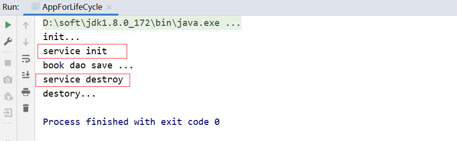

**小细节**

对于InitializingBean接口中的afterPropertiesSet方法，翻译过来为属性设置之后。setBookDao方法是Spring的IOC容器为其注入属性的方法，那么afterPropertiesSet和setBookDao谁先执行？

在setBookDao方法中添加一句话

<table>
<colgroup>
<col style="width: 100%" />
</colgroup>
<tbody>
<tr class="odd">
<td>Java 
public void setBookDao(BookDao bookDao) { 
System.out.println("set ....."); 
this.bookDao = bookDao; 
}</td>
</tr>
</tbody>
</table>

重新运行AppForLifeCycle，打印结果如下：

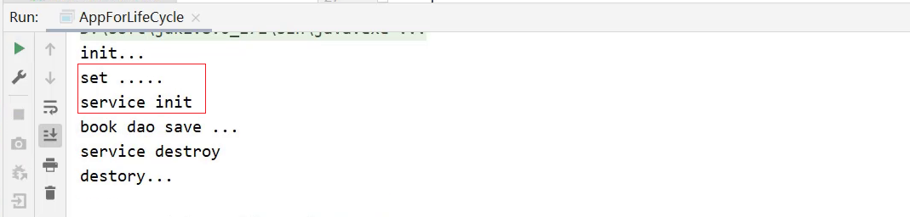

可见**初始化方法会在类中属性设置之后执行**。

**3.3.5 bean生命周期小结**

（1）关于Spring中对bean生命周期控制提供了两种方式：

在配置文件中的bean标签中添加init-method和destroy-method属性

类实现InitializingBean与DisposableBean接口，这种方式了解下即可

（2）对于bean的生命周期控制在bean的整个生命周期中所处的位置如下：

初始化容器

创建对象（内存分配）

执行构造方法

执行属性注入（set操作）

执行bean初始化方法

使用bean

执行业务操作

关闭/销毁容器

执行bean销毁方法

（3）关闭容器的两种方式：

ConfigurableApplicationContext是ApplicationContext的子类

close()方法

registerShutdownHook()方法

**4.DI相关内容**

DI依赖注入描述了在容器中建立bean与bean之间的依赖关系的过程，bean分为两种类型：

引用类型

简单类型（基本数据类型与String）

Spring提供了两种注入方式，分别是：

setter注入

简单类型

引用类型

构造器注入

简单类型

引用类型

**4.1 setter注入**

对于setter方式注入引用类型的方式之前已经学习过，快速回顾下:

在bean中定义引用类型属性，并提供可访问的**set**方法

<table>
<colgroup>
<col style="width: 100%" />
</colgroup>
<tbody>
<tr class="odd">
<td>Java 
public class BookServiceImpl implements BookService { 
private BookDao bookDao; 
public void setBookDao(BookDao bookDao) { 
this.bookDao = bookDao; 
} 
}</td>
</tr>
</tbody>
</table>

配置中使用**property**标签**ref**属性注入引用类型对象

<table>
<colgroup>
<col style="width: 100%" />
</colgroup>
<tbody>
<tr class="odd">
<td>XML 
&lt;bean id="bookService" class="com.itheima.service.impl.BookServiceImpl"&gt; 
&lt;property name="bookDao" ref="bookDao"/&gt; 
&lt;/bean&gt; 
 
&lt;bean id="bookDao" class="com.itheima.dao.imipl.BookDaoImpl"/&gt;</td>
</tr>
</tbody>
</table>

**4.1.1 环境准备**

步骤和前面的都一致，快速拷贝即可：

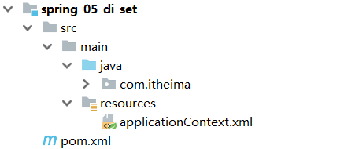

（1）项目中添加BookDao、BookDaoImpl、UserDao、UserDaoImpl、BookService和BookServiceImpl类

<table>
<colgroup>
<col style="width: 100%" />
</colgroup>
<tbody>
<tr class="odd">
<td>Java 
public interface BookDao { 
public void save(); 
} 
 
public class BookDaoImpl implements BookDao { 
public void save() { 
System.out.println("book dao save ..."); 
} 
} 
public interface UserDao { 
public void save(); 
} 
public class UserDaoImpl implements UserDao { 
public void save() { 
System.out.println("user dao save ..."); 
} 
} 
 
public interface BookService { 
public void save(); 
} 
 
public class BookServiceImpl implements BookService{ 
private BookDao bookDao; 
 
public void setBookDao(BookDao bookDao) { 
this.bookDao = bookDao; 
} 
 
public void save() { 
System.out.println("book service save ..."); 
bookDao.save(); 
} 
}</td>
</tr>
</tbody>
</table>

（2）resources下提供spring的配置文件

<table>
<colgroup>
<col style="width: 100%" />
</colgroup>
<tbody>
<tr class="odd">
<td>XML 
&lt;?xml version="1.0" encoding="UTF-8"？&gt; 
&lt;beans xmlns="http://www.springframework.org/schema/beans" 
xmlns:xsi="http://www.w3.org/2001/XMLSchema-instance" 
xsi:schemaLocation="http://www.springframework.org/schema/beans http://www.springframework.org/schema/beans/spring-beans.xsd"&gt; 
 
&lt;bean id="bookDao" class="com.itheima.dao.impl.BookDaoImpl"/&gt; 
&lt;bean id="bookService" class="com.itheima.service.impl.BookServiceImpl"&gt; 
&lt;property name="bookDao" ref="bookDao"/&gt; 
&lt;/bean&gt; 
 
&lt;/beans&gt;</td>
</tr>
</tbody>
</table>

（3）编写AppForDISet运行类，加载Spring的IOC容器，并从中获取对应的bean对象

<table>
<colgroup>
<col style="width: 100%" />
</colgroup>
<tbody>
<tr class="odd">
<td>Java 
public class AppForDISet { 
public static void main( String[] args ) { 
ApplicationContext ctx = new ClassPathXmlApplicationContext("applicationContext.xml"); 
BookService bookService = (BookService) ctx.getBean("bookService"); 
bookService.save(); 
} 
}</td>
</tr>
</tbody>
</table>

**4.1.2 注入引用数据类型**

对于setter方式注入引用类型，分为两步：

在bean中定义引用类型属性，并提供可访问的set方法

<table>
<colgroup>
<col style="width: 100%" />
</colgroup>
<tbody>
<tr class="odd">
<td>Java 
public class BookServiceImpl implements BookService { 
private BookDao bookDao; 
public void setBookDao(BookDao bookDao) { 
this.bookDao = bookDao; 
} 
}</td>
</tr>
</tbody>
</table>

配置中使用property标签ref属性注入引用类型对象

<table>
<colgroup>
<col style="width: 100%" />
</colgroup>
<tbody>
<tr class="odd">
<td>XML 
&lt;bean id="bookService" class="com.itheima.service.impl.BookServiceImpl"&gt; 
&lt;property name="bookDao" ref="bookDao"/&gt; 
&lt;/bean&gt; 
 
&lt;bean id="bookDao" class="com.itheima.dao.imipl.BookDaoImpl"/&gt;</td>
</tr>
</tbody>
</table>

例如，在bookServiceImpl对象中注入userDao的实现如下：

（1）声明属性并提供setter方法

在BookServiceImpl中声明userDao属性，并提供setter方法

<table>
<colgroup>
<col style="width: 100%" />
</colgroup>
<tbody>
<tr class="odd">
<td>Java 
public class BookServiceImpl implements BookService{ 
private BookDao bookDao; 
private UserDao userDao; 
 
public void setUserDao(UserDao userDao) { 
this.userDao = userDao; 
} 
public void setBookDao(BookDao bookDao) { 
this.bookDao = bookDao; 
} 
 
public void save() { 
System.out.println("book service save ..."); 
bookDao.save(); 
userDao.save(); 
} 
}</td>
</tr>
</tbody>
</table>

（2）配置文件中进行注入配置

在applicationContext.xml配置文件中使用property标签注入

<table>
<colgroup>
<col style="width: 100%" />
</colgroup>
<tbody>
<tr class="odd">
<td>XML 
&lt;?xml version="1.0" encoding="UTF-8"？&gt; 
&lt;beans xmlns="http://www.springframework.org/schema/beans" 
xmlns:xsi="http://www.w3.org/2001/XMLSchema-instance" 
xsi:schemaLocation="http://www.springframework.org/schema/beans http://www.springframework.org/schema/beans/spring-beans.xsd"&gt; 
 
&lt;bean id="bookDao" class="com.itheima.dao.impl.BookDaoImpl"/&gt; 
&lt;bean id="userDao" class="com.itheima.dao.impl.UserDaoImpl"/&gt; 
&lt;bean id="bookService" class="com.itheima.service.impl.BookServiceImpl"&gt; 
&lt;property name="bookDao" ref="bookDao"/&gt; 
&lt;property name="userDao" ref="userDao"/&gt; 
&lt;/bean&gt; 
&lt;/beans&gt;</td>
</tr>
</tbody>
</table>

（3）运行程序

运行AppForDISet类，查看结果，说明userDao已经成功注入。

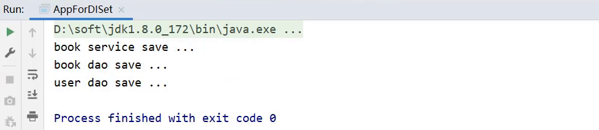

**4.1.3 注入简单数据类型**

引用类型使用ref属性进行依赖注入，简单数据类型使用value属性进行依赖注入。

例如，给BookDaoImpl注入一些简单数据类型的数据，实现如下：

（1）声明属性并提供setter方法

在BookDaoImpl类中声明对应的简单数据类型的属性，并提供对应的setter方法

<table>
<colgroup>
<col style="width: 100%" />
</colgroup>
<tbody>
<tr class="odd">
<td>Java 
public class BookDaoImpl implements BookDao { 
private String databaseName; 
private int connectionNum; 
 
public void setConnectionNum(int connectionNum) { 
this.connectionNum = connectionNum; 
} 
 
public void setDatabaseName(String databaseName) { 
this.databaseName = databaseName; 
} 
 
public void save() { 
System.out.println("book dao save ..."+databaseName+","+connectionNum); 
} 
}</td>
</tr>
</tbody>
</table>

（2）配置文件中进行注入配置

在applicationContext.xml配置文件中使用property标签注入

<table>
<colgroup>
<col style="width: 100%" />
</colgroup>
<tbody>
<tr class="odd">
<td>XML 
&lt;?xml version="1.0" encoding="UTF-8"？&gt; 
&lt;beans xmlns="http://www.springframework.org/schema/beans" 
xmlns:xsi="http://www.w3.org/2001/XMLSchema-instance" 
xsi:schemaLocation="http://www.springframework.org/schema/beans http://www.springframework.org/schema/beans/spring-beans.xsd"&gt; 
 
&lt;bean id="bookDao" class="com.itheima.dao.impl.BookDaoImpl"&gt; 
&lt;property name="databaseName" value="mysql"/&gt; 
&lt;property name="connectionNum" value="10"/&gt; 
&lt;/bean&gt; 
&lt;bean id="userDao" class="com.itheima.dao.impl.UserDaoImpl"/&gt; 
&lt;bean id="bookService" class="com.itheima.service.impl.BookServiceImpl"&gt; 
&lt;property name="bookDao" ref="bookDao"/&gt; 
&lt;property name="userDao" ref="userDao"/&gt; 
&lt;/bean&gt; 
&lt;/beans&gt;</td>
</tr>
</tbody>
</table>

**说明：**value后面跟的是简单数据类型，对于数字类型，Spring在注入的时候会自动转换，但是不能写成如下内容，否则会因为不能正确转换而报错。

<table>
<colgroup>
<col style="width: 100%" />
</colgroup>
<tbody>
<tr class="odd">
<td>XML 
&lt;property name="connectionNum" value="abc"/&gt;</td>
</tr>
</tbody>
</table>

（3）运行程序

运行AppForDISet类，查看结果，说明userDao已经成功注入。

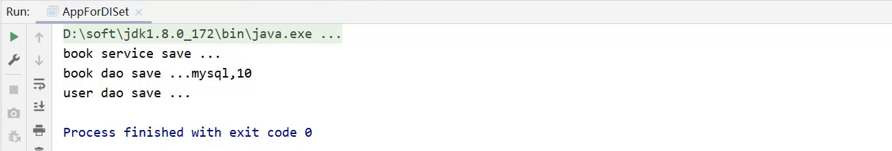

**4.1.4 小结**

对于引用数据类型使用的是\<property name="" ref=""/\>

对于简单数据类型使用的是\<property name="" value=""/\>

**注意：**两个property注入标签的顺序可以任意。

**4.2 构造器注入**

**4.2.1 环境准备**

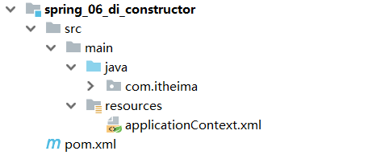

（1）项目中添加BookDao、BookDaoImpl、UserDao、UserDaoImpl、BookService和BookServiceImpl类

<table>
<colgroup>
<col style="width: 100%" />
</colgroup>
<tbody>
<tr class="odd">
<td>Java 
public interface BookDao { 
public void save(); 
} 
 
public class BookDaoImpl implements BookDao { 
 
private String databaseName; 
private int connectionNum; 
 
public void save() { 
System.out.println("book dao save ..."); 
} 
} 
public interface UserDao { 
public void save(); 
} 
public class UserDaoImpl implements UserDao { 
public void save() { 
System.out.println("user dao save ..."); 
} 
} 
 
public interface BookService { 
public void save(); 
} 
 
public class BookServiceImpl implements BookService{ 
private BookDao bookDao; 
 
public void setBookDao(BookDao bookDao) { 
this.bookDao = bookDao; 
} 
 
public void save() { 
System.out.println("book service save ..."); 
bookDao.save(); 
} 
}</td>
</tr>
</tbody>
</table>

（2）resources下提供spring的配置文件

<table>
<colgroup>
<col style="width: 100%" />
</colgroup>
<tbody>
<tr class="odd">
<td>XML 
&lt;?xml version="1.0" encoding="UTF-8"？&gt; 
&lt;beans xmlns="http://www.springframework.org/schema/beans" 
xmlns:xsi="http://www.w3.org/2001/XMLSchema-instance" 
xsi:schemaLocation="http://www.springframework.org/schema/beans http://www.springframework.org/schema/beans/spring-beans.xsd"&gt; 
 
&lt;bean id="bookDao" class="com.itheima.dao.impl.BookDaoImpl"/&gt; 
&lt;bean id="bookService" class="com.itheima.service.impl.BookServiceImpl"&gt; 
&lt;property name="bookDao" ref="bookDao"/&gt; 
&lt;/bean&gt; 
&lt;/beans&gt;</td>
</tr>
</tbody>
</table>

（3）编写AppForDIConstructor运行类，加载Spring的IOC容器，并从中获取对应的bean对象

<table>
<colgroup>
<col style="width: 100%" />
</colgroup>
<tbody>
<tr class="odd">
<td>Java 
public class AppForDIConstructor { 
public static void main( String[] args ) { 
ApplicationContext ctx = new ClassPathXmlApplicationContext("applicationContext.xml"); 
BookService bookService = (BookService) ctx.getBean("bookService"); 
bookService.save(); 
} 
}</td>
</tr>
</tbody>
</table>

**4.2.2 注入引用数据类型**

将BookServiceImpl类中的bookDao修改成使用构造器的方式注入，步骤如下：

（1）删除setter方法并提供构造方法

在BookServiceImpl类中将bookDao的setter方法删除掉，并添加带有bookDao参数的构造方法

<table>
<colgroup>
<col style="width: 100%" />
</colgroup>
<tbody>
<tr class="odd">
<td>Java 
public class BookServiceImpl implements BookService{ 
private BookDao bookDao; 
 
public BookServiceImpl(BookDao bookDao) { 
this.bookDao = bookDao; 
} 
 
public void save() { 
System.out.println("book service save ..."); 
bookDao.save(); 
} 
}</td>
</tr>
</tbody>
</table>

（2）配置文件中进行配置构造方式注入

在applicationContext.xml中配置

<table>
<colgroup>
<col style="width: 100%" />
</colgroup>
<tbody>
<tr class="odd">
<td>XML 
&lt;?xml version="1.0" encoding="UTF-8"？&gt; 
&lt;beans xmlns="http://www.springframework.org/schema/beans" 
xmlns:xsi="http://www.w3.org/2001/XMLSchema-instance" 
xsi:schemaLocation="http://www.springframework.org/schema/beans http://www.springframework.org/schema/beans/spring-beans.xsd"&gt; 
 
&lt;bean id="bookDao" class="com.itheima.dao.impl.BookDaoImpl"/&gt; 
&lt;bean id="bookService" class="com.itheima.service.impl.BookServiceImpl"&gt; 
&lt;constructor-arg name="bookDao" ref="bookDao"/&gt; 
&lt;/bean&gt; 
&lt;/beans&gt;</td>
</tr>
</tbody>
</table>

**说明：**标签\<constructor-arg\>中，name属性对应的值为构造函数中方法形参的参数名，必须要保持一致；ref属性指向的是spring的IOC容器中其他bean对象。

（3）运行程序

运行AppForDIConstructor类，查看结果，说明bookDao已经成功注入。

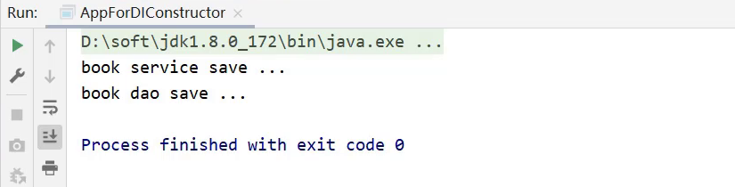

构造器还可以注入多个引用数据类型，例如，在BookServiceImpl使用构造函数注入多个引用数据类型的步骤如下：

（1）提供多个属性的构造函数

在BookServiceImpl声明userDao并提供多个参数的构造函数

<table>
<colgroup>
<col style="width: 100%" />
</colgroup>
<tbody>
<tr class="odd">
<td>Java 
public class BookServiceImpl implements BookService{ 
private BookDao bookDao; 
private UserDao userDao; 
 
public BookServiceImpl(BookDao bookDao,UserDao userDao) { 
this.bookDao = bookDao; 
this.userDao = userDao; 
} 
 
public void save() { 
System.out.println("book service save ..."); 
bookDao.save(); 
userDao.save(); 
} 
}</td>
</tr>
</tbody>
</table>

（2）配置文件中配置多参数注入

在applicationContext.xml中配置注入

<table>
<colgroup>
<col style="width: 100%" />
</colgroup>
<tbody>
<tr class="odd">
<td>XML 
&lt;?xml version="1.0" encoding="UTF-8"？&gt; 
&lt;beans xmlns="http://www.springframework.org/schema/beans" 
xmlns:xsi="http://www.w3.org/2001/XMLSchema-instance" 
xsi:schemaLocation="http://www.springframework.org/schema/beans http://www.springframework.org/schema/beans/spring-beans.xsd"&gt; 
 
&lt;bean id="bookDao" class="com.itheima.dao.impl.BookDaoImpl"/&gt; 
&lt;bean id="userDao" class="com.itheima.dao.impl.UserDaoImpl"/&gt; 
&lt;bean id="bookService" class="com.itheima.service.impl.BookServiceImpl"&gt; 
&lt;constructor-arg name="bookDao" ref="bookDao"/&gt; 
&lt;constructor-arg name="userDao" ref="userDao"/&gt; 
&lt;/bean&gt; 
&lt;/beans&gt;</td>
</tr>
</tbody>
</table>

**说明：**这两个\<contructor-arg\>的配置顺序可以任意。

（3）运行程序

运行AppForDIConstructor类，查看结果，说明userDao已经成功注入

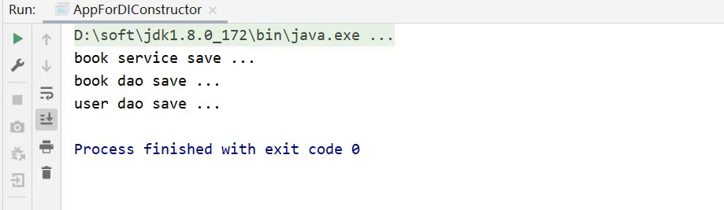

**4.2.3 注入简单数据类型**

在BookDaoImpl中，使用构造函数注入databaseName和connectionNum两个参数：

（1）添加多个简单属性并提供构造方法

修改BookDaoImpl类，添加构造方法

<table>
<colgroup>
<col style="width: 100%" />
</colgroup>
<tbody>
<tr class="odd">
<td>Java 
public class BookDaoImpl implements BookDao { 
private String databaseName; 
private int connectionNum; 
 
public BookDaoImpl(String databaseName, int connectionNum) { 
this.databaseName = databaseName; 
this.connectionNum = connectionNum; 
} 
 
public void save() { 
System.out.println("book dao save ..."+databaseName+","+connectionNum); 
} 
}</td>
</tr>
</tbody>
</table>

（2）配置完成多个属性构造器注入

在applicationContext.xml中进行注入配置

<table>
<colgroup>
<col style="width: 100%" />
</colgroup>
<tbody>
<tr class="odd">
<td>XML 
&lt;?xml version="1.0" encoding="UTF-8"？&gt; 
&lt;beans xmlns="http://www.springframework.org/schema/beans" 
xmlns:xsi="http://www.w3.org/2001/XMLSchema-instance" 
xsi:schemaLocation="http://www.springframework.org/schema/beans http://www.springframework.org/schema/beans/spring-beans.xsd"&gt; 
 
&lt;bean id="bookDao" class="com.itheima.dao.impl.BookDaoImpl"&gt; 
&lt;constructor-arg name="databaseName" value="mysql"/&gt; 
&lt;constructor-arg name="connectionNum" value="666"/&gt; 
&lt;/bean&gt; 
&lt;bean id="userDao" class="com.itheima.dao.impl.UserDaoImpl"/&gt; 
&lt;bean id="bookService" class="com.itheima.service.impl.BookServiceImpl"&gt; 
&lt;constructor-arg name="bookDao" ref="bookDao"/&gt; 
&lt;constructor-arg name="userDao" ref="userDao"/&gt; 
&lt;/bean&gt; 
&lt;/beans&gt;</td>
</tr>
</tbody>
</table>

**说明：**这两个\<contructor-arg\>的配置顺序可以任意。

（3）运行程序

运行AppForDIConstructor类，查看结果

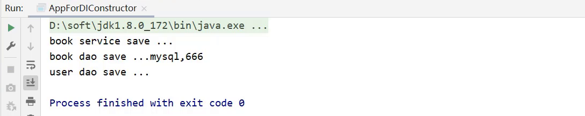

虽然已经完成了构造函数注入的基本使用，但是当构造函数中方法的参数名发生变化后，配置文件中的name属性也需要跟着变，存在紧耦合：

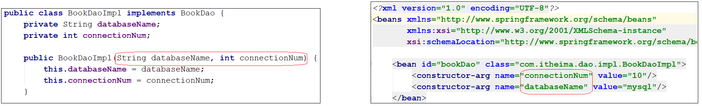

实际参数名发生变化的情况并不多，如果真的需要变化，可以使用type属性进行类型注入：

<table>
<colgroup>
<col style="width: 100%" />
</colgroup>
<tbody>
<tr class="odd">
<td>XML 
&lt;bean id="bookDao" class="com.itheima.dao.impl.BookDaoImpl"&gt; 
&lt;constructor-arg type="int" value="10"/&gt; 
&lt;constructor-arg type="java.lang.String" value="mysql"/&gt; 
&lt;/bean&gt;</td>
</tr>
</tbody>
</table>

但是如果构造方法参数中有类型相同的参数，这种方式就不太好实现了，此时可以使用index属性按照索引下标（下标从0开始）注入：

<table>
<colgroup>
<col style="width: 100%" />
</colgroup>
<tbody>
<tr class="odd">
<td>XML 
&lt;bean id="bookDao" class="com.itheima.dao.impl.BookDaoImpl"&gt; 
&lt;constructor-arg index="1" value="100"/&gt; 
&lt;constructor-arg index="0" value="mysql"/&gt; 
&lt;/bean&gt;</td>
</tr>
</tbody>
</table>

这种方式可以解决参数类型重复问题，但是如果构造方法参数顺序发生变化后，这种方式又带来了耦合问题。

**4.3 两种依赖注入方式选择**

Spring的依赖注入的实现方式：

setter注入

简单数据类型

<table>
<colgroup>
<col style="width: 100%" />
</colgroup>
<tbody>
<tr class="odd">
<td>XML 
&lt;bean ...&gt; 
&lt;property name="" value=""/&gt; 
&lt;/bean&gt;</td>
</tr>
</tbody>
</table>

引用数据类型

<table>
<colgroup>
<col style="width: 100%" />
</colgroup>
<tbody>
<tr class="odd">
<td>XML 
&lt;bean ...&gt; 
&lt;property name="" ref=""/&gt; 
&lt;/bean&gt;</td>
</tr>
</tbody>
</table>

构造器注入

简单数据类型

<table>
<colgroup>
<col style="width: 100%" />
</colgroup>
<tbody>
<tr class="odd">
<td>XML 
&lt;bean ...&gt; 
&lt;constructor-arg name="" index="" type="" value=""/&gt; 
&lt;/bean&gt;</td>
</tr>
</tbody>
</table>

引用数据类型

<table>
<colgroup>
<col style="width: 100%" />
</colgroup>
<tbody>
<tr class="odd">
<td>XML 
&lt;bean ...&gt; 
&lt;constructor-arg name="" index="" type="" ref=""/&gt; 
&lt;/bean&gt;</td>
</tr>
</tbody>
</table>

依赖注入的方式选择上：

强制依赖使用构造器进行，使用setter注入有概率不进行注入导致null对象出现

强制依赖指对象在创建的过程中必须要注入指定的参数

可选依赖使用setter注入进行，灵活性强

可选依赖指对象在创建过程中注入的参数可有可无

Spring框架倡导使用构造器，第三方框架内部大多数采用构造器注入的形式进行数据初始化，相对严谨

如果有必要可以两者同时使用，使用构造器注入完成强制依赖的注入，使用setter注入完成可选依赖的注入

实际开发过程中还要根据实际情况分析，如果受控对象没有提供setter方法就必须使用构造器注入

**自己开发的模块推荐使用setter注入**

**4.4 自动配置**

以前的手动进行依赖注入的方法需要编写大量的配置文件内容，自动装配就是IOC容器根据bean所依赖的资源在容器中自动查找并注入到bean中的过程，使用自动装配可以大大减少配置压力。

自动装配方式有如下几种：

**按类型**（常用）

按名称

按构造方法

不启用自动装配

**4.4.1 环境准备**

步骤和前面的都一致，快速拷贝即可：

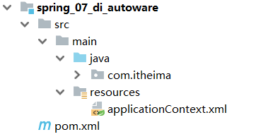

（1）项目中添加BookDao、BookDaoImpl、BookService和BookServiceImpl类

<table>
<colgroup>
<col style="width: 100%" />
</colgroup>
<tbody>
<tr class="odd">
<td>Java 
public interface BookDao { 
public void save(); 
} 
 
public class BookDaoImpl implements BookDao { 
 
private String databaseName; 
private int connectionNum; 
 
public void save() { 
System.out.println("book dao save ..."); 
} 
} 
public interface BookService { 
public void save(); 
} 
 
public class BookServiceImpl implements BookService{ 
private BookDao bookDao; 
 
public void setBookDao(BookDao bookDao) { 
this.bookDao = bookDao; 
} 
 
public void save() { 
System.out.println("book service save ..."); 
bookDao.save(); 
} 
}</td>
</tr>
</tbody>
</table>

（2）resources下提供spring的配置文件

<table>
<colgroup>
<col style="width: 100%" />
</colgroup>
<tbody>
<tr class="odd">
<td>XML 
&lt;?xml version="1.0" encoding="UTF-8"？&gt; 
&lt;beans xmlns="http://www.springframework.org/schema/beans" 
xmlns:xsi="http://www.w3.org/2001/XMLSchema-instance" 
xsi:schemaLocation="http://www.springframework.org/schema/beans http://www.springframework.org/schema/beans/spring-beans.xsd"&gt; 
 
&lt;bean id="bookDao" class="com.itheima.dao.impl.BookDaoImpl"/&gt; 
&lt;bean id="bookService" class="com.itheima.service.impl.BookServiceImpl"&gt; 
&lt;property name="bookDao" ref="bookDao"/&gt; 
&lt;/bean&gt; 
&lt;/beans&gt;</td>
</tr>
</tbody>
</table>

（3）编写AppForAutoware运行类，加载Spring的IOC容器，并从中获取对应的bean对象

<table>
<colgroup>
<col style="width: 100%" />
</colgroup>
<tbody>
<tr class="odd">
<td>Java 
public class AppForAutoware { 
public static void main( String[] args ) { 
ApplicationContext ctx = new ClassPathXmlApplicationContext("applicationContext.xml"); 
BookService bookService = (BookService) ctx.getBean("bookService"); 
bookService.save(); 
} 
}</td>
</tr>
</tbody>
</table>

**4.4.2 自动装配的实现**

自动装配只需要修改applicationContext.xml配置文件即可：

将\<property\>标签删除

在\<bean\>标签中添加**autowire**属性

首先来实现**按照类型注入**的配置

<table>
<colgroup>
<col style="width: 100%" />
</colgroup>
<tbody>
<tr class="odd">
<td>XML 
&lt;?xml version="1.0" encoding="UTF-8"？&gt; 
&lt;beans xmlns="http://www.springframework.org/schema/beans" 
xmlns:xsi="http://www.w3.org/2001/XMLSchema-instance" 
xsi:schemaLocation="http://www.springframework.org/schema/beans http://www.springframework.org/schema/beans/spring-beans.xsd"&gt; 
 
&lt;bean class="com.itheima.dao.impl.BookDaoImpl"/&gt; 
&lt;!--autowire属性：开启自动装配，通常使用按类型装配--&gt; 
&lt;bean id="bookService" class="com.itheima.service.impl.BookServiceImpl" autowire="byType"/&gt; 
 
&lt;/beans&gt;</td>
</tr>
</tbody>
</table>

**注意事项：**

需要注入属性的类中对应属性的setter方法不能省略

被注入的对象必须要被Spring的IOC容器管理

按照类型在Spring的IOC容器中如果找到多个对象，会报NoUniqueBeanDefinitionException

一个类型在IOC中有多个对象，还想要注入成功，这个时候就需要**按照名称注入**，配置方式为：

<table>
<colgroup>
<col style="width: 100%" />
</colgroup>
<tbody>
<tr class="odd">
<td>XML 
&lt;?xml version="1.0" encoding="UTF-8"？&gt; 
&lt;beans xmlns="http://www.springframework.org/schema/beans" 
xmlns:xsi="http://www.w3.org/2001/XMLSchema-instance" 
xsi:schemaLocation="http://www.springframework.org/schema/beans http://www.springframework.org/schema/beans/spring-beans.xsd"&gt; 
 
&lt;bean class="com.itheima.dao.impl.BookDaoImpl"/&gt; 
&lt;!--autowire属性：开启自动装配，通常使用按类型装配--&gt; 
&lt;bean id="bookService" class="com.itheima.service.impl.BookServiceImpl" autowire="byName"/&gt; 
 
&lt;/beans&gt;</td>
</tr>
</tbody>
</table>

**注意事项：**

按照名称注入中的名称指的是什么？

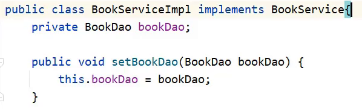

bookDao是private修饰的，外部类无法直接访问

外部类只能通过属性的set方法进行访问

对外部类来说，setBookDao方法名，去掉set后首字母小写是其属性名

所以按照名称注入，其实是和对应的set方法有关，但是如果按照标准起名称，属性名和set对应的名是一致的

如果按照名称去找对应的bean对象，找不到则注入null

当某一个类型在IOC容器中有多个对象，按照名称注入只找其指定名称对应的bean对象，不会报错

实际以后用的更多的是**按照类型注入**。

**注意细节：**

自动装配用于引用类型依赖注入，不能对简单类型进行操作

使用按类型装配时（byType）必须保障容器中相同类型的bean唯一，推荐使用

使用按名称装配时（byName）必须保障容器中具有指定名称的bean，因变量名与配置耦合，不推荐使用

自动装配优先级低于setter注入与构造器注入，同时出现时自动装配配置失效

**4.5 集合注入**

虽然完成了引入数据类型和简单数据类型的注入，但是**集合**中既可以装简单数据类型也可以装引用数据类型，所以集合的注入单独讲解。

常见的集合类型有 数组、List、Set、Map、Properties 。

**4.5.1 环境准备**

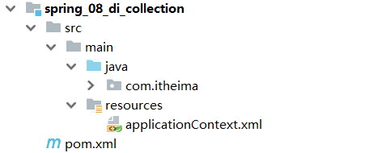

（1）项目中添加添加BookDao、BookDaoImpl类

<table>
<colgroup>
<col style="width: 100%" />
</colgroup>
<tbody>
<tr class="odd">
<td>Java 
public interface BookDao { 
public void save(); 
} 
 
public class BookDaoImpl implements BookDao { 
 
private int[] array; 
 
private List&lt;String&gt; list; 
 
private Set&lt;String&gt; set; 
 
private Map&lt;String,String&gt; map; 
 
private Properties properties; 
 
public void save() { 
System.out.println("book dao save ..."); 
 
System.out.println("遍历数组:" + Arrays.toString(array)); 
 
System.out.println("遍历List" + list); 
 
System.out.println("遍历Set" + set); 
 
System.out.println("遍历Map" + map); 
 
System.out.println("遍历Properties" + properties); 
} 
//setter....方法省略，自己使用工具生成 
}</td>
</tr>
</tbody>
</table>

（2）resources下提供spring的配置文件applicationContext.xml，下面的所有配置方式，都是在bookDao的bean标签中使用\<property\>进行注入

<table>
<colgroup>
<col style="width: 100%" />
</colgroup>
<tbody>
<tr class="odd">
<td>XML 
&lt;?xml version="1.0" encoding="UTF-8"？&gt; 
&lt;beans xmlns="http://www.springframework.org/schema/beans" 
xmlns:xsi="http://www.w3.org/2001/XMLSchema-instance" 
xsi:schemaLocation="http://www.springframework.org/schema/beans http://www.springframework.org/schema/beans/spring-beans.xsd"&gt; 
 
&lt;bean id="bookDao" class="com.itheima.dao.impl.BookDaoImpl"&gt; 
 
&lt;/bean&gt; 
&lt;/beans&gt;</td>
</tr>
</tbody>
</table>

（3）编写AppForDICollection运行类，加载Spring的IOC容器，并从中获取对应的bean对象

<table>
<colgroup>
<col style="width: 100%" />
</colgroup>
<tbody>
<tr class="odd">
<td>Java 
public class AppForDICollection { 
public static void main( String[] args ) { 
ApplicationContext ctx = new ClassPathXmlApplicationContext("applicationContext.xml"); 
BookDao bookDao = (BookDao) ctx.getBean("bookDao"); 
bookDao.save(); 
} 
}</td>
</tr>
</tbody>
</table>

**4.5.2 注入数组类型数据**

<table>
<colgroup>
<col style="width: 100%" />
</colgroup>
<tbody>
<tr class="odd">
<td>XML 
&lt;property name="array"&gt; 
&lt;array&gt; 
&lt;value&gt;100&lt;/value&gt; 
&lt;value&gt;200&lt;/value&gt; 
&lt;value&gt;300&lt;/value&gt; 
&lt;/array&gt; 
&lt;/property&gt;</td>
</tr>
</tbody>
</table>

**4.5.3 注入List类型数据**

<table>
<colgroup>
<col style="width: 100%" />
</colgroup>
<tbody>
<tr class="odd">
<td>XML 
&lt;property name="list"&gt; 
&lt;list&gt; 
&lt;value&gt;itcast&lt;/value&gt; 
&lt;value&gt;itheima&lt;/value&gt; 
&lt;value&gt;boxuegu&lt;/value&gt; 
&lt;value&gt;chuanzhihui&lt;/value&gt; 
&lt;/list&gt; 
&lt;/property&gt;</td>
</tr>
</tbody>
</table>

**4.5.4 注入Set类型数据**

<table>
<colgroup>
<col style="width: 100%" />
</colgroup>
<tbody>
<tr class="odd">
<td>XML 
&lt;property name="set"&gt; 
&lt;set&gt; 
&lt;value&gt;itcast&lt;/value&gt; 
&lt;value&gt;itheima&lt;/value&gt; 
&lt;value&gt;boxuegu&lt;/value&gt; 
&lt;value&gt;boxuegu&lt;/value&gt; 
&lt;/set&gt; 
&lt;/property&gt;</td>
</tr>
</tbody>
</table>

**4.5.5 注入Map类型数据**

<table>
<colgroup>
<col style="width: 100%" />
</colgroup>
<tbody>
<tr class="odd">
<td>XML 
&lt;property name="map"&gt; 
&lt;map&gt; 
&lt;entry key="country" value="china"/&gt; 
&lt;entry key="province" value="henan"/&gt; 
&lt;entry key="city" value="kaifeng"/&gt; 
&lt;/map&gt; 
&lt;/property&gt;</td>
</tr>
</tbody>
</table>

**4.5.6 注入Properties类型数据**

<table>
<colgroup>
<col style="width: 100%" />
</colgroup>
<tbody>
<tr class="odd">
<td>XML 
&lt;property name="properties"&gt; 
&lt;props&gt; 
&lt;prop key="country"&gt;china&lt;/prop&gt; 
&lt;prop key="province"&gt;henan&lt;/prop&gt; 
&lt;prop key="city"&gt;kaifeng&lt;/prop&gt; 
&lt;/props&gt; 
&lt;/property&gt;</td>
</tr>
</tbody>
</table>

配置完成后，运行下看结果：

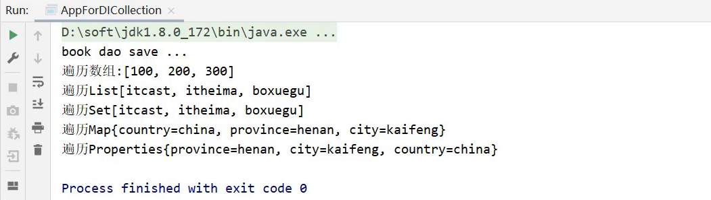

**说明：**

property标签表示setter方式注入，构造方式注入constructor-arg标签内部也可以写\<array\>、\<list\>、\<set\>、\<map\>、\<props\>标签

List的底层也是通过数组实现的，所以\<list\>和\<array\>标签是可以混用

集合中要添加引用类型，只需要把\<value\>标签改成\<ref\>标签，这种方式用的比较少

**5.IOC/DI配置管理第三方bean**

**5.1 数据源对象管理**

本次使用数据源Druid(德鲁伊)和C3P0来配置学习对于第三方bean进行配置管理。

**5.1.1 环境准备**

创建一个Maven项目

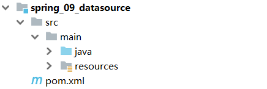

pom.xml添加依赖

<table>
<colgroup>
<col style="width: 100%" />
</colgroup>
<tbody>
<tr class="odd">
<td>XML 
&lt;dependencies&gt; 
&lt;dependency&gt; 
&lt;groupId&gt;org.springframework&lt;/groupId&gt; 
&lt;artifactId&gt;spring-context&lt;/artifactId&gt; 
&lt;version&gt;5.2.10.RELEASE&lt;/version&gt; 
&lt;/dependency&gt; 
&lt;/dependencies&gt;</td>
</tr>
</tbody>
</table>

resources下添加spring的配置文件applicationContext.xml

<table>
<colgroup>
<col style="width: 100%" />
</colgroup>
<tbody>
<tr class="odd">
<td>XML 
&lt;?xml version="1.0" encoding="UTF-8"？&gt; 
&lt;beans xmlns="http://www.springframework.org/schema/beans" 
xmlns:xsi="http://www.w3.org/2001/XMLSchema-instance" 
xsi:schemaLocation=" 
http://www.springframework.org/schema/beans 
http://www.springframework.org/schema/beans/spring-beans.xsd"&gt; 
 
&lt;/beans&gt;</td>
</tr>
</tbody>
</table>

编写一个运行类App

<table>
<colgroup>
<col style="width: 100%" />
</colgroup>
<tbody>
<tr class="odd">
<td>Java 
public class App { 
public static void main(String[] args) { 
ApplicationContext ctx = new ClassPathXmlApplicationContext("applicationContext.xml"); 
} 
}</td>
</tr>
</tbody>
</table>

**5.1.2 实现Druid管理**

（1）导入druid的依赖

<table>
<colgroup>
<col style="width: 100%" />
</colgroup>
<tbody>
<tr class="odd">
<td>XML 
&lt;dependency&gt; 
&lt;groupId&gt;com.alibaba&lt;/groupId&gt; 
&lt;artifactId&gt;druid&lt;/artifactId&gt; 
&lt;version&gt;1.1.16&lt;/version&gt; 
&lt;/dependency&gt;</td>
</tr>
</tbody>
</table>

（2）配置第三方bean

在applicationContext.xml配置文件中添加DruidDataSource的配置

<table>
<colgroup>
<col style="width: 100%" />
</colgroup>
<tbody>
<tr class="odd">
<td>XML 
&lt;?xml version="1.0" encoding="UTF-8"？&gt; 
&lt;beans xmlns="http://www.springframework.org/schema/beans" 
xmlns:xsi="http://www.w3.org/2001/XMLSchema-instance" 
xsi:schemaLocation=" 
http://www.springframework.org/schema/beans 
http://www.springframework.org/schema/beans/spring-beans.xsd"&gt; 
 
&lt;!--管理DruidDataSource对象--&gt; 
&lt;bean id="dataSource" class="com.alibaba.druid.pool.DruidDataSource"&gt; 
&lt;!--数据库连接四要素：驱动、连接、用户名、密码--&gt; 
&lt;property name="driverClassName" value="com.mysql.jdbc.Driver"/&gt; 
&lt;property name="url" value="jdbc:mysql://localhost:3306/spring_db"/&gt; 
&lt;property name="username" value="root"/&gt; 
&lt;property name="password" value="root"/&gt; 
&lt;/bean&gt; 
&lt;/beans&gt;</td>
</tr>
</tbody>
</table>

**说明：**

driverClassName：数据库驱动

url：数据库连接地址

username：数据库连接用户名

password：数据库连接密码

（3）从IOC容器中获取对应的bean对象

<table>
<colgroup>
<col style="width: 100%" />
</colgroup>
<tbody>
<tr class="odd">
<td>Java 
public class App { 
public static void main(String[] args) { 
ApplicationContext ctx = new ClassPathXmlApplicationContext("applicationContext.xml"); 
DataSource dataSource = (DataSource) ctx.getBean("dataSource"); 
System.out.println(dataSource); 
} 
}</td>
</tr>
</tbody>
</table>

（4）运行程序

打印如下结果，说明第三方bean对象已经被Spring的IOC容器进行管理

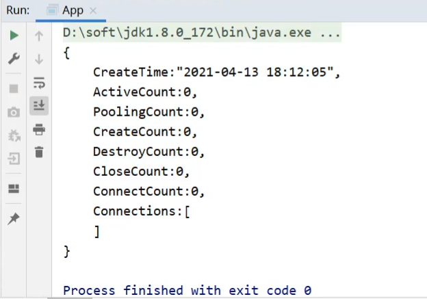

**5.1.3 实现C3P0管理**

完成了DruidDataSource的管理，接下来我们再来加深练习下管理C3P0数据源。

（1）导入C3P0的依赖

<table>
<colgroup>
<col style="width: 100%" />
</colgroup>
<tbody>
<tr class="odd">
<td>XML 
&lt;dependency&gt; 
&lt;groupId&gt;c3p0&lt;/groupId&gt; 
&lt;artifactId&gt;c3p0&lt;/artifactId&gt; 
&lt;version&gt;0.9.1.2&lt;/version&gt; 
&lt;/dependency&gt;</td>
</tr>
</tbody>
</table>

（2）配置第三方bean

在applicationContext.xml配置文件中添加配置

<table>
<colgroup>
<col style="width: 100%" />
</colgroup>
<tbody>
<tr class="odd">
<td>XML 
&lt;bean id="dataSource" class="com.mchange.v2.c3p0.ComboPooledDataSource"&gt; 
&lt;property name="driverClass" value="com.mysql.jdbc.Driver"/&gt; 
&lt;property name="jdbcUrl" value="jdbc:mysql://localhost:3306/spring_db"/&gt; 
&lt;property name="user" value="root"/&gt; 
&lt;property name="password" value="root"/&gt; 
&lt;property name="maxPoolSize" value="1000"/&gt; 
&lt;/bean&gt;</td>
</tr>
</tbody>
</table>

**注意：**

ComboPooledDataSource的属性是通过setter方式进行注入

想注入属性就需要在ComboPooledDataSource类或其上层类中有提供属性对应的setter方法

C3P0的四个属性和Druid的四个属性是不一样的

（3）运行程序

程序会报错ClassNotFoundException，错误如下

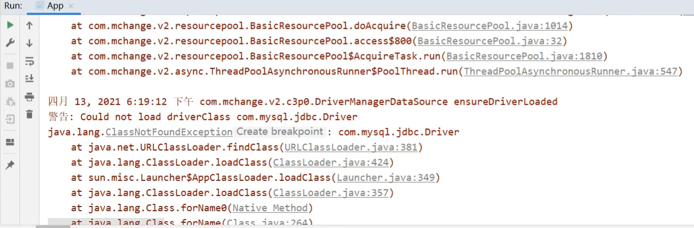

错误ClassNotFoundException翻译出来是 类没有发现的异常，具体的类为com.mysql.jdbc.Driver，错误的原因是缺少mysql的驱动包。

在pom.xml把驱动包引入：

<table>
<colgroup>
<col style="width: 100%" />
</colgroup>
<tbody>
<tr class="odd">
<td>XML 
&lt;dependency&gt; 
&lt;groupId&gt;mysql&lt;/groupId&gt; 
&lt;artifactId&gt;mysql-connector-java&lt;/artifactId&gt; 
&lt;version&gt;5.1.47&lt;/version&gt; 
&lt;/dependency&gt;</td>
</tr>
</tbody>
</table>

添加完mysql的驱动包以后，再次运行App，就可以打印出结果：

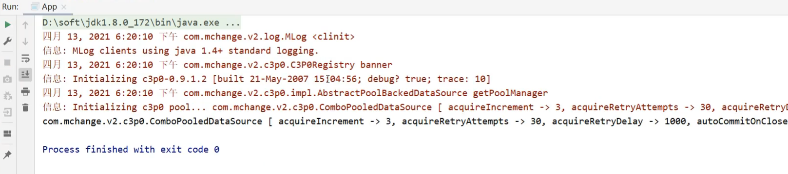

**注意：**

数据连接池在配置属性的时候，除了可以注入数据库连接四要素外还可以配置很多其他的属性，具体都有哪些属性用到的时候再去查，一般配置基础的四个，其他都有自己的默认值

Druid和C3P0在没有导入mysql驱动包的前提下，一个没报错一个报错，说明Druid在初始化的时候没有去加载驱动，而C3P0刚好相反

Druid程序运行虽然没有报错，但是当调用DruidDataSource的getConnection()方法获取连接的时候，也会报找不到驱动类的错误

**5.2 加载properties文件**

数据源druid和C3P0的配置中，都使用到了一些固定的常量如数据库连接四要素，把这些值写在Spring的配置文件中不利于后期维护，需要将这些值提取到一个外部的properties配置文件中。

**5.2.1 第三方bean属性优化**

（1）准备properties配置文件

resources下创建一个jdbc.properties文件，并添加对应的属性键值对

<table>
<colgroup>
<col style="width: 100%" />
</colgroup>
<tbody>
<tr class="odd">
<td>Properties 
jdbc.driver=com.mysql.jdbc.Driver 
jdbc.url=jdbc:mysql://127.0.0.1:3306/spring_db 
jdbc.username=root 
jdbc.password=root</td>
</tr>
</tbody>
</table>

（2）开启context命名空间

在applicationContext.xml中开context命名空间

<table>
<colgroup>
<col style="width: 100%" />
</colgroup>
<tbody>
<tr class="odd">
<td>XML 
&lt;?xml version="1.0" encoding="UTF-8"？&gt; 
&lt;beans xmlns="http://www.springframework.org/schema/beans" 
xmlns:xsi="http://www.w3.org/2001/XMLSchema-instance" 
xmlns:context="http://www.springframework.org/schema/context" 
xsi:schemaLocation=" 
http://www.springframework.org/schema/beans 
http://www.springframework.org/schema/beans/spring-beans.xsd 
http://www.springframework.org/schema /context 
http://www.springframework.org/schema/context/spring-context.xsd"&gt; 
&lt;/beans&gt;</td>
</tr>
</tbody>
</table>

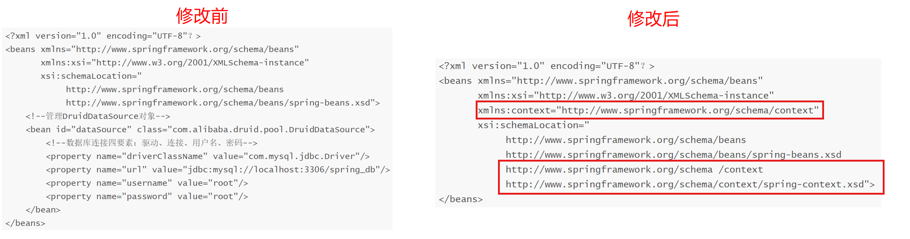

（3）加载properties配置文件

在配置文件中使用context命名空间下的标签来加载properties配置文件

<table>
<colgroup>
<col style="width: 100%" />
</colgroup>
<tbody>
<tr class="odd">
<td>XML 
&lt;context:property-placeholder location="jdbc.properties"/&gt;</td>
</tr>
</tbody>
</table>

（4）完成属性注入

使用\${key}来读取properties配置文件中的内容并完成属性注入

<table>
<colgroup>
<col style="width: 100%" />
</colgroup>
<tbody>
<tr class="odd">
<td>XML 
&lt;?xml version="1.0" encoding="UTF-8"？&gt; 
&lt;beans xmlns="http://www.springframework.org/schema/beans" 
xmlns:xsi="http://www.w3.org/2001/XMLSchema-instance" 
xmlns:context="http://www.springframework.org/schema/context" 
xsi:schemaLocation=" 
http://www.springframework.org/schema/beans 
http://www.springframework.org/schema/beans/spring-beans.xsd 
http://www.springframework.org/schema/context 
http://www.springframework.org/schema/context/spring-context.xsd"&gt; 
 
&lt;context:property-placeholder location="jdbc.properties"/&gt; 
&lt;bean id="dataSource" class="com.alibaba.druid.pool.DruidDataSource"&gt; 
&lt;property name="driverClassName" value="${jdbc.driver}"/&gt; 
&lt;property name="url" value="${jdbc.url}"/&gt; 
&lt;property name="username" value="${jdbc.username}"/&gt; 
&lt;property name="password" value="${jdbc.password}"/&gt; 
&lt;/bean&gt; 
&lt;/beans&gt;</td>
</tr>
</tbody>
</table>

**5.2.2 读取单个属性**

从properties配置文件中读取key为name的值，并将其注入到BookDao中并在save方法中进行打印。

（1）在项目中添对应的类

BookDao和BookDaoImpl类，并在BookDaoImpl类中添加name属性与setter方法

<table>
<colgroup>
<col style="width: 100%" />
</colgroup>
<tbody>
<tr class="odd">
<td>Java 
public interface BookDao { 
public void save(); 
} 
 
public class BookDaoImpl implements BookDao { 
private String name; 
 
public void setName(String name) { 
this.name = name; 
} 
 
public void save() { 
System.out.println("book dao save ..." + name); 
} 
}</td>
</tr>
</tbody>
</table>

（2）完成配置文件的读取与注入

在applicationContext.xml添加配置，bean的配置管理、读取外部properties、依赖注入

<table>
<colgroup>
<col style="width: 100%" />
</colgroup>
<tbody>
<tr class="odd">
<td>XML 
&lt;?xml version="1.0" encoding="UTF-8"？&gt; 
&lt;beans xmlns="http://www.springframework.org/schema/beans" 
xmlns:xsi="http://www.w3.org/2001/XMLSchema-instance" 
xmlns:context="http://www.springframework.org/schema/context" 
xsi:schemaLocation=" 
http://www.springframework.org/schema/beans 
http://www.springframework.org/schema/beans/spring-beans.xsd 
http://www.springframework.org/schema/context 
http://www.springframework.org/schema/context/spring-context.xsd"&gt; 
 
&lt;context:property-placeholder location="jdbc.properties"/&gt; 
 
&lt;bean id="bookDao" class="com.itheima.dao.impl.BookDaoImpl"&gt; 
&lt;property name="name" value="${jdbc.driver}"/&gt; 
&lt;/bean&gt; 
&lt;/beans&gt;</td>
</tr>
</tbody>
</table>

（3）运行程序

在App类中，从IOC容器中获取bookDao对象，调用方法，查看值是否已经被获取到并打印控制台

<table>
<colgroup>
<col style="width: 100%" />
</colgroup>
<tbody>
<tr class="odd">
<td>Java 
public class App { 
public static void main(String[] args) throws Exception{ 
ApplicationContext ctx = new ClassPathXmlApplicationContext("applicationContext.xml"); 
BookDao bookDao = (BookDao) ctx.getBean("bookDao"); 
bookDao.save(); 
} 
}</td>
</tr>
</tbody>
</table>

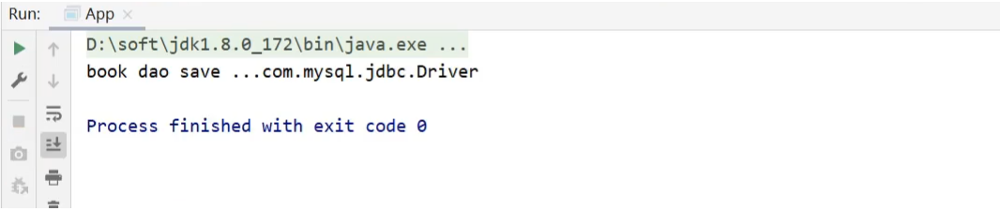

读取properties配置文件中的内容就已经完成，但是使用时有些注意事项：

问题一：**键值对的key为username引发的问题**

1、在properties中配置键值对的时候，如果key设置为username

<table>
<colgroup>
<col style="width: 100%" />
</colgroup>
<tbody>
<tr class="odd">
<td>Properties 
username=root666</td>
</tr>
</tbody>
</table>

2、在applicationContext.xml注入该属性

<table>
<colgroup>
<col style="width: 100%" />
</colgroup>
<tbody>
<tr class="odd">
<td>XML 
&lt;?xml version="1.0" encoding="UTF-8"？&gt; 
&lt;beans xmlns="http://www.springframework.org/schema/beans" 
xmlns:xsi="http://www.w3.org/2001/XMLSchema-instance" 
xmlns:context="http://www.springframework.org/schema/context" 
xsi:schemaLocation=" 
http://www.springframework.org/schema/beans 
http://www.springframework.org/schema/beans/spring-beans.xsd 
http://www.springframework.org/schema/context 
http://www.springframework.org/schema/context/spring-context.xsd"&gt; 
 
&lt;context:property-placeholder location="jdbc.properties"/&gt; 
 
&lt;bean id="bookDao" class="com.itheima.dao.impl.BookDaoImpl"&gt; 
&lt;property name="name" value="${username}"/&gt; 
&lt;/bean&gt; 
&lt;/beans&gt;</td>
</tr>
</tbody>
</table>

3、运行后，在控制台打印的却不是root666，而是自己电脑的用户名

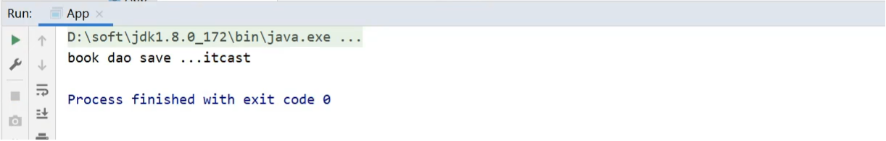

出现问题的原因是\<context:property-placeholder/\>标签会加载系统的环境变量，而且环境变量的值会被优先加载。

<table>
<colgroup>
<col style="width: 100%" />
</colgroup>
<tbody>
<tr class="odd">
<td>Java 
public static void main(String[] args) throws Exception { 
//获取系统的环境变量，其中会有一个USERNAME=自己电脑的用户名称 
Map&lt;String, String&gt; env = System.getenv(); 
System.out.println(env); 
}</td>
</tr>
</tbody>
</table>

5、解决方案

<table>
<colgroup>
<col style="width: 100%" />
</colgroup>
<tbody>
<tr class="odd">
<td>XML 
&lt;?xml version="1.0" encoding="UTF-8"？&gt; 
&lt;beans xmlns="http://www.springframework.org/schema/beans" 
xmlns:xsi="http://www.w3.org/2001/XMLSchema-instance" 
xmlns:context="http://www.springframework.org/schema/context" 
xsi:schemaLocation=" 
http://www.springframework.org/schema/beans 
http://www.springframework.org/schema/beans/spring-beans.xsd 
http://www.springframework.org/schema/context 
http://www.springframework.org/schema/context/spring-context.xsd"&gt; 
 
&lt;context:property-placeholder location="jdbc.properties" system-properties-mode="NEVER"/&gt; 
&lt;/beans&gt;</td>
</tr>
</tbody>
</table>

system-properties-mode设置为NEVER，表示不加载系统属性，就可以解决上述问题。当然还可以避免使用username作为属性的key。

问题二：**当有多个properties配置文件需要被加载，该如何配置**

1、调整下配置文件的内容，在resources下添加jdbc.properties、jdbc2.properties，内容如下：

jdbc.properties

<table>
<colgroup>
<col style="width: 100%" />
</colgroup>
<tbody>
<tr class="odd">
<td>Properties 
jdbc.driver=com.mysql.jdbc.Driver 
jdbc.url=jdbc:mysql://127.0.0.1:3306/spring_db 
jdbc.username=root 
jdbc.password=root</td>
</tr>
</tbody>
</table>

jdbc2.properties

<table>
<colgroup>
<col style="width: 100%" />
</colgroup>
<tbody>
<tr class="odd">
<td>Properties 
username=root666</td>
</tr>
</tbody>
</table>

2、修改applicationContext.xml

<table>
<colgroup>
<col style="width: 100%" />
</colgroup>
<tbody>
<tr class="odd">
<td>XML 
&lt;?xml version="1.0" encoding="UTF-8"？&gt; 
&lt;beans xmlns="http://www.springframework.org/schema/beans" 
xmlns:xsi="http://www.w3.org/2001/XMLSchema-instance" 
xmlns:context="http://www.springframework.org/schema/context" 
xsi:schemaLocation=" 
http://www.springframework.org/schema/beans 
http://www.springframework.org/schema/beans/spring-beans.xsd 
http://www.springframework.org/schema/context 
http://www.springframework.org/schema/context/spring-context.xsd"&gt; 
&lt;!--方式一 --&gt; 
&lt;context:property-placeholder location="jdbc.properties,jdbc2.properties" system-properties-mode="NEVER"/&gt; 
&lt;!--方式二--&gt; 
&lt;context:property-placeholder location="*.properties" system-properties-mode="NEVER"/&gt; 
&lt;!--方式三 --&gt; 
&lt;context:property-placeholder location="classpath:*.properties" system-properties-mode="NEVER"/&gt; 
&lt;!--方式四--&gt; 
&lt;context:property-placeholder location="classpath*:*.properties" system-properties-mode="NEVER"/&gt; 
&lt;/beans&gt;</td>
</tr>
</tbody>
</table>

**说明:**

方式一：可以实现，如果配置文件多的话，每个都需要配置

方式二：\*.properties代表所有以properties结尾的文件都会被加载，可以解决方式一的问题，但是不标准

方式三：标准的写法，classpath:代表的是从根路径下开始查找，但是只能查询当前项目的根路径

方式四：不仅可以加载当前项目还可以加载当前项目所依赖的所有项目的根路径下的properties配置文件

**5.2.3 加载properties文件小结**

1.如何开启context命名空间？

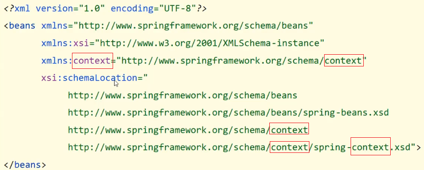

2.如何加载properties配置文件？

<table>
<colgroup>
<col style="width: 100%" />
</colgroup>
<tbody>
<tr class="odd">
<td>XML 
&lt;context:property-placeholder location="" system-properties-mode="NEVER"/&gt;</td>
</tr>
</tbody>
</table>

3.如何在applicationContext.xml引入properties配置文件中的值？

<table>
<colgroup>
<col style="width: 100%" />
</colgroup>
<tbody>
<tr class="odd">
<td>XML 
${key}</td>
</tr>
</tbody>
</table>

**6.核心容器**

核心容器可以简单理解为ApplicationContext。

**6.1 环境准备**

创建一个Maven项目，在pom.xml添加Spring的依赖

<table>
<colgroup>
<col style="width: 100%" />
</colgroup>
<tbody>
<tr class="odd">
<td>XML 
&lt;dependencies&gt; 
&lt;dependency&gt; 
&lt;groupId&gt;org.springframework&lt;/groupId&gt; 
&lt;artifactId&gt;spring-context&lt;/artifactId&gt; 
&lt;version&gt;5.2.10.RELEASE&lt;/version&gt; 
&lt;/dependency&gt; 
&lt;/dependencies&gt;</td>
</tr>
</tbody>
</table>

resources下添加applicationContext.xml

<table>
<colgroup>
<col style="width: 100%" />
</colgroup>
<tbody>
<tr class="odd">
<td>XML 
&lt;?xml version="1.0" encoding="UTF-8"？&gt; 
&lt;beans xmlns="http://www.springframework.org/schema/beans" 
xmlns:xsi="http://www.w3.org/2001/XMLSchema-instance" 
xsi:schemaLocation=" 
http://www.springframework.org/schema/beans http://www.springframework.org/schema/beans/spring-beans.xsd"&gt; 
&lt;bean id="bookDao" class="com.itheima.dao.impl.BookDaoImpl"/&gt; 
&lt;/beans&gt;</td>
</tr>
</tbody>
</table>

添加BookDao和BookDaoImpl类

<table>
<colgroup>
<col style="width: 100%" />
</colgroup>
<tbody>
<tr class="odd">
<td>Java 
public interface BookDao { 
public void save(); 
} 
public class BookDaoImpl implements BookDao { 
public void save() { 
System.out.println("book dao save ..." ); 
} 
}</td>
</tr>
</tbody>
</table>

创建运行类App

<table>
<colgroup>
<col style="width: 100%" />
</colgroup>
<tbody>
<tr class="odd">
<td>Java 
public class App { 
public static void main(String[] args) { 
ApplicationContext ctx = new ClassPathXmlApplicationContext("applicationContext.xml"); 
BookDao bookDao = (BookDao) ctx.getBean("bookDao"); 
bookDao.save(); 
} 
}</td>
</tr>
</tbody>
</table>

最终项目结构如下：

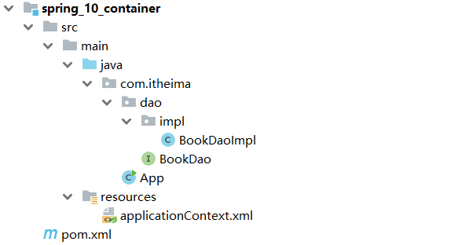

**6.2 容器**

**6.2.1 容器的创建方式**

案例中创建ApplicationContext的方式为：

<table>
<colgroup>
<col style="width: 100%" />
</colgroup>
<tbody>
<tr class="odd">
<td>Java 
// 类路径下的XML配置文件 
ApplicationContext ctx = new ClassPathXmlApplicationContext("applicationContext.xml");</td>
</tr>
</tbody>
</table>

除了上面这种方式，Spring还提供了另外一种创建方式为：

<table>
<colgroup>
<col style="width: 100%" />
</colgroup>
<tbody>
<tr class="odd">
<td>Java 
// 文件系统下的XML配置文件 
ApplicationContext ctx = new FileSystemXmlApplicationContext("applicationContext.xml");</td>
</tr>
</tbody>
</table>

使用这种方式，运行，会出现如下错误：

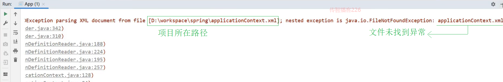

从错误信息中能发现，这种方式是从项目所在路径下开始查找applicationContext.xml配置文件的，所以需要将其修改为：

<table>
<colgroup>
<col style="width: 100%" />
</colgroup>
<tbody>
<tr class="odd">
<td>Java 
ApplicationContext ctx = new FileSystemXmlApplicationContext("D:\\workspace\\spring\\spring_10_container\\src\\main\\resources\\applicationContext.xml");</td>
</tr>
</tbody>
</table>

这种方式虽能实现，但是当项目的位置发生变化后，代码也需要跟着改，耦合度较高，不推荐使用。

**6.2.2 Bean的三种获取方式**

方式一：通过bean的名称获取

<table>
<colgroup>
<col style="width: 100%" />
</colgroup>
<tbody>
<tr class="odd">
<td>Java 
BookDao bookDao = (BookDao) ctx.getBean("bookDao");</td>
</tr>
</tbody>
</table>

这种方式存在的问题是每次获取的时候都需要进行类型转换。

方式二：获取bean的同时指定获取的类型

<table>
<colgroup>
<col style="width: 100%" />
</colgroup>
<tbody>
<tr class="odd">
<td>Java 
BookDao bookDao = ctx.getBean("bookDao"，BookDao.class);</td>
</tr>
</tbody>
</table>

这种方式可以解决类型强转问题，但是参数又多加了一个，并没有简化多少。

方式三：通过类型获取bean

<table>
<colgroup>
<col style="width: 100%" />
</colgroup>
<tbody>
<tr class="odd">
<td>Java 
BookDao bookDao = ctx.getBean(BookDao.class);</td>
</tr>
</tbody>
</table>

这种方式类似依赖注入中的按类型注入，必须要确保IOC容器中该类型对应的bean对象只能有一个。

**6.2.3 容器类层次结构**

（1）在IDEA中双击shift，输入BeanFactory

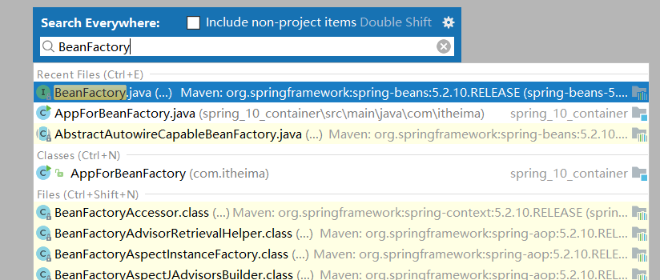

（2）点击进入BeanFactory类，ctrl+h，就能查看到如下结构的层次关系

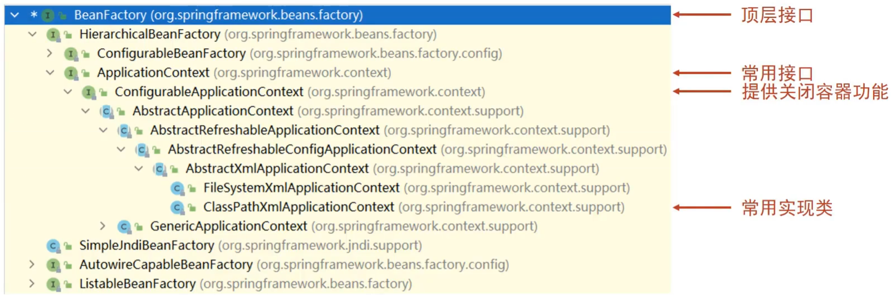

从图中可以看出，容器类也是从无到有根据需要一层层叠加上来的，重点理解下这种设计思想。

**6.2.4 BeanFactory的使用**

使用BeanFactory来创建IOC容器的具体实现方式为：

<table>
<colgroup>
<col style="width: 100%" />
</colgroup>
<tbody>
<tr class="odd">
<td>Java 
public class AppForBeanFactory { 
public static void main(String[] args) { 
Resource resources = new ClassPathResource("applicationContext.xml"); 
BeanFactory bf = new XmlBeanFactory(resources); 
BookDao bookDao = bf.getBean(BookDao.class); 
bookDao.save(); 
} 
}</td>
</tr>
</tbody>
</table>

为了更好的看出BeanFactory和ApplicationContext之间的区别，在BookDaoImpl添加如下构造函数：

<table>
<colgroup>
<col style="width: 100%" />
</colgroup>
<tbody>
<tr class="odd">
<td>Java 
public class BookDaoImpl implements BookDao { 
public BookDaoImpl() { 
System.out.println("constructor"); 
} 
 
public void save() { 
System.out.println("book dao save ..." ); 
} 
}</td>
</tr>
</tbody>
</table>

如果不去获取bean对象，打印会发现：

BeanFactory是延迟加载，只有在获取bean对象的时候才会去创建

ApplicationContext是立即加载，容器加载的时候就会创建bean对象

ApplicationContext要想成为延迟加载，只需要按照如下方式进行配置

<table>
<colgroup>
<col style="width: 100%" />
</colgroup>
<tbody>
<tr class="odd">
<td>XML 
&lt;?xml version="1.0" encoding="UTF-8"？&gt; 
&lt;beans xmlns="http://www.springframework.org/schema/beans" 
xmlns:xsi="http://www.w3.org/2001/XMLSchema-instance" 
xsi:schemaLocation=" 
http://www.springframework.org/schema/beans http://www.springframework.org/schema/beans/spring-beans.xsd"&gt; 
&lt;bean id="bookDao" class="com.itheima.dao.impl.BookDaoImpl" lazy-init="true"/&gt; 
&lt;/beans&gt;</td>
</tr>
</tbody>
</table>

**小结**

容器创建的两种方式

ClassPathXmlApplicationContext【掌握】

FileSystemXmlApplicationContext【知道即可】

获取Bean的三种方式

getBean("名称")：需要类型转换

getBean("名称", 类型.class)：多了一个参数

getBean(类型.class)：容器中不能有多个该类的bean对象

容器类层次结构

只需要知晓容器的最上级的父接口为 BeanFactory 即可

BeanFactory

使用 BeanFactory 创建的容器是延迟加载

使用 ApplicationContext 创建的容器是立即加载

具体 BeanFactory 如何创建只需要了解即可

**6.3 核心容器总结**

**6.3.1 容器相关**

BeanFactory是IOC容器的顶层接口，初始化BeanFactory对象时，加载的bean延迟加载

ApplicationContext接口是Spring容器的核心接口，初始化时bean立即加载

ApplicationContext接口提供基础的bean操作相关方法，通过其他接口扩展其功能

ApplicationContext接口常用初始化类

**ClassPathXmlApplicationContext（常用）**

FileSystemXmlApplicationContext

**6.3.2 bean相关**

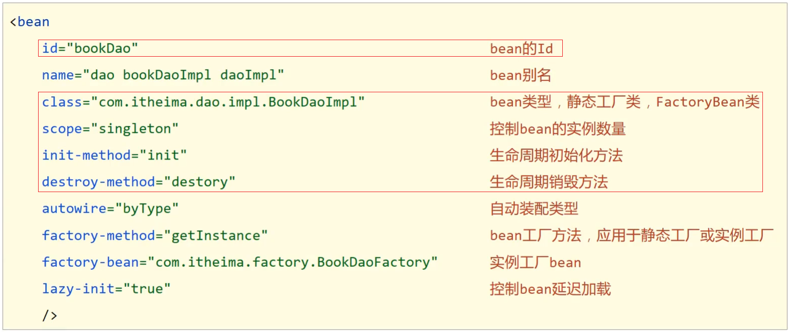

**6.3.3 依赖注入相关**

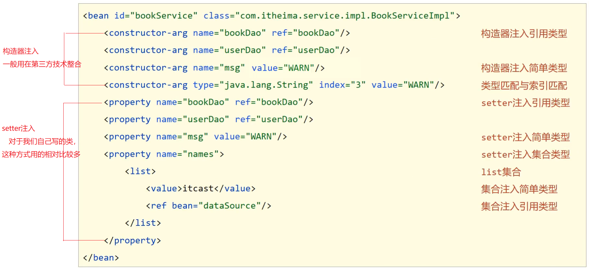

**7.IOC/DI注解开发**

前面说过Spring可以简化代码的开发，到现在并没有体会到。要想真正简化开发，需要用到Spring的注解开发，Spring对注解支持的版本历程:

2.0版开始支持注解

2.5版注解功能趋于完善

3.0版支持纯注解开发

关于注解开发，主要是两块内容注解开发定义bean和纯注解开发。

**7.1 环境准备**

创建一个Maven项目，并在pom.xml添加Spring的依赖

<table>
<colgroup>
<col style="width: 100%" />
</colgroup>
<tbody>
<tr class="odd">
<td>XML 
&lt;dependencies&gt; 
&lt;dependency&gt; 
&lt;groupId&gt;org.springframework&lt;/groupId&gt; 
&lt;artifactId&gt;spring-context&lt;/artifactId&gt; 
&lt;version&gt;5.2.10.RELEASE&lt;/version&gt; 
&lt;/dependency&gt; 
&lt;/dependencies&gt;</td>
</tr>
</tbody>
</table>

resources下添加applicationContext.xml

<table>
<colgroup>
<col style="width: 100%" />
</colgroup>
<tbody>
<tr class="odd">
<td>XML 
&lt;?xml version="1.0" encoding="UTF-8"？&gt; 
&lt;beans xmlns="http://www.springframework.org/schema/beans" 
xmlns:xsi="http://www.w3.org/2001/XMLSchema-instance" 
xsi:schemaLocation=" 
http://www.springframework.org/schema/beans http://www.springframework.org/schema/beans/spring-beans.xsd"&gt; 
&lt;bean id="bookDao" class="com.itheima.dao.impl.BookDaoImpl"/&gt; 
&lt;/beans&gt;</td>
</tr>
</tbody>
</table>

添加BookDao、BookDaoImpl、BookService、BookServiceImpl类

<table>
<colgroup>
<col style="width: 100%" />
</colgroup>
<tbody>
<tr class="odd">
<td>Java 
public interface BookDao { 
public void save(); 
} 
 
public class BookDaoImpl implements BookDao { 
public void save() { 
System.out.println("book dao save ..." ); 
} 
} 
 
public interface BookService { 
public void save(); 
} 
 
public class BookServiceImpl implements BookService { 
public void save() { 
System.out.println("book service save ..."); 
} 
}</td>
</tr>
</tbody>
</table>

创建运行类App

<table>
<colgroup>
<col style="width: 100%" />
</colgroup>
<tbody>
<tr class="odd">
<td>Java 
public class App { 
public static void main(String[] args) { 
ApplicationContext ctx = new ClassPathXmlApplicationContext("applicationContext.xml"); 
BookDao bookDao = (BookDao) ctx.getBean("bookDao"); 
bookDao.save(); 
} 
}</td>
</tr>
</tbody>
</table>

最终项目结构如下：

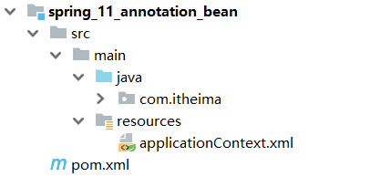

**7.2 注解开发定义bean**

（1）删除原XML配置，将配置文件中的\<bean\>标签删除掉

<table>
<colgroup>
<col style="width: 100%" />
</colgroup>
<tbody>
<tr class="odd">
<td>XML 
&lt;bean id="bookDao" class="com.itheima.dao.impl.BookDaoImpl"/&gt;</td>
</tr>
</tbody>
</table>

（2）Dao上添加注解，在BookDaoImpl类上添加@Component注解

<table>
<colgroup>
<col style="width: 100%" />
</colgroup>
<tbody>
<tr class="odd">
<td>Java 
@Component("bookDao") 
public class BookDaoImpl implements BookDao { 
public void save() { 
System.out.println("book dao save ..." ); 
} 
}</td>
</tr>
</tbody>
</table>

|                                                                        |
|------------------------------------------------------------------------|
| **注意：**@Component注解不可以添加在接口上，因为接口是无法创建对象的。 |

XML与注解配置的对应关系：

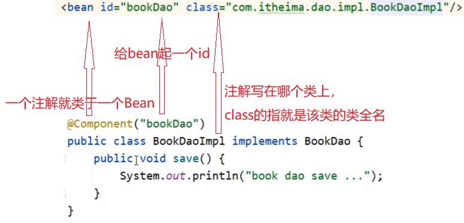

（3）配置Spring的注解包扫描

为了让Spring框架能够扫描到写在类上的注解，需要在配置文件上进行包扫描

<table>
<colgroup>
<col style="width: 100%" />
</colgroup>
<tbody>
<tr class="odd">
<td>XML 
&lt;?xml version="1.0" encoding="UTF-8"？&gt; 
&lt;beans xmlns="http://www.springframework.org/schema/beans" 
xmlns:xsi="http://www.w3.org/2001/XMLSchema-instance" 
xsi:schemaLocation=" 
http://www.springframework.org/schema/beans http://www.springframework.org/schema/beans/spring-beans.xsd"&gt; 
&lt;context:component-scan base-package="com.itheima"/&gt; 
&lt;/beans&gt;</td>
</tr>
</tbody>
</table>

component-scan：

component：组件，Spring将管理的bean视作自己的一个组件

scan：扫描

base-package指定Spring框架扫描的包路径，它会扫描指定包及其子包中的所有类上的注解：

包路径越多（如com.itheima.dao.impl），扫描的范围越小速度越快

包路径越少（如com.itheima），扫描的范围越大速度越慢

一般扫描到项目的组织名称即Maven的groupId下（如com.itheima）即可

（4）运行程序

运行App类查看打印结果

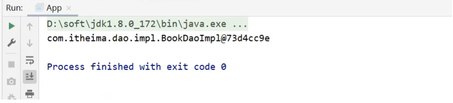

（5）Service上添加注解

在BookServiceImpl类上也添加@Component交给Spring框架管理

<table>
<colgroup>
<col style="width: 100%" />
</colgroup>
<tbody>
<tr class="odd">
<td>Java 
@Component 
public class BookServiceImpl implements BookService { 
private BookDao bookDao; 
 
public void setBookDao(BookDao bookDao) { 
this.bookDao = bookDao; 
} 
 
public void save() { 
System.out.println("book service save ..."); 
bookDao.save(); 
} 
}</td>
</tr>
</tbody>
</table>

（6）运行程序

在App类中，从IOC容器中获取BookServiceImpl对应的bean对象，打印

<table>
<colgroup>
<col style="width: 100%" />
</colgroup>
<tbody>
<tr class="odd">
<td>Java 
public class App { 
public static void main(String[] args) { 
ApplicationContext ctx = new ClassPathXmlApplicationContext("applicationContext.xml"); 
BookDao bookDao = (BookDao) ctx.getBean("bookDao"); 
System.out.println(bookDao); 
//按类型获取bean 
BookService bookService = ctx.getBean(BookService.class); 
System.out.println(bookService); 
} 
}</td>
</tr>
</tbody>
</table>

打印观察结果，两个bean对象都已经打印到控制台

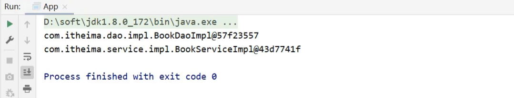

BookServiceImpl类没有起名称，所以在App中是按照类型来获取bean对象

@Component注解如果不起名称，会有一个默认值就是**当前类名首字母小写**，所以也可以按照名称获取，如

<table>
<colgroup>
<col style="width: 100%" />
</colgroup>
<tbody>
<tr class="odd">
<td>Java 
BookService bookService = (BookService)ctx.getBean("bookServiceImpl"); 
System.out.println(bookService);</td>
</tr>
</tbody>
</table>

对于@Component注解，还衍生出了其他三个注解：

@Controller：用于表现层类上

@Service：用于业务层类上

@Repository：用于数据层类上

通过查看源码会发现，这三个注解和@Component注解的作用是一样的，主要是用于区分出当前类是属于表现层、业务层还是数据层：

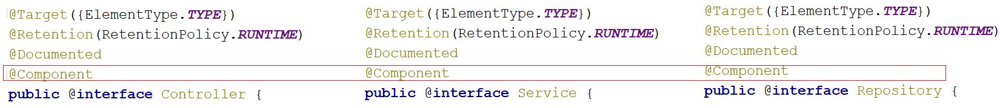

**@Component**

|      |                                             |
|------|---------------------------------------------|
| 名称 | @Component/@Controller/@Service/@Repository |
| 类型 | 类注解                                      |
| 位置 | 类定义上方                                  |
| 作用 | 设置该类为spring管理的bean                  |
| 属性 | value（默认）：定义bean的id                 |

**7.3 纯注解开发模式**

上面已经可以使用注解来配置bean，但是依然有用到配置文件，在配置文件中对包进行了扫描，Spring在3.0版已经支持纯注解开发，使用Java类替代配置文件，开启了Spring快速开发赛道。

（1）创建配置类SpringConfig

<table>
<colgroup>
<col style="width: 100%" />
</colgroup>
<tbody>
<tr class="odd">
<td>Java 
public class SpringConfig { 
}</td>
</tr>
</tbody>
</table>

（2）标识该类为配置类

在配置类上添加@Configuration注解，将其标识为一个配置类，替换applicationContext.xml

<table>
<colgroup>
<col style="width: 100%" />
</colgroup>
<tbody>
<tr class="odd">
<td>Java 
@Configuration 
public class SpringConfig { 
}</td>
</tr>
</tbody>
</table>

（3）用注解替换包扫描配置

在配置类上添加包扫描注解@ComponentScan替换\<context:component-scan base-package=""/\>

<table>
<colgroup>
<col style="width: 100%" />
</colgroup>
<tbody>
<tr class="odd">
<td>Java 
@Configuration 
@ComponentScan("com.itheima") 
public class SpringConfig { 
}</td>
</tr>
</tbody>
</table>

（4）创建运行类AppForAnnotation并执行

<table>
<colgroup>
<col style="width: 100%" />
</colgroup>
<tbody>
<tr class="odd">
<td>Java 
public class AppForAnnotation { 
public static void main(String[] args) { 
ApplicationContext ctx = new AnnotationConfigApplicationContext(SpringConfig.class); 
BookDao bookDao = (BookDao) ctx.getBean("bookDao"); 
System.out.println(bookDao); 
BookService bookService = ctx.getBean(BookService.class); 
System.out.println(bookService); 
} 
}</td>
</tr>
</tbody>
</table>

运行AppForAnnotation，可以看到两个对象依然被获取成功

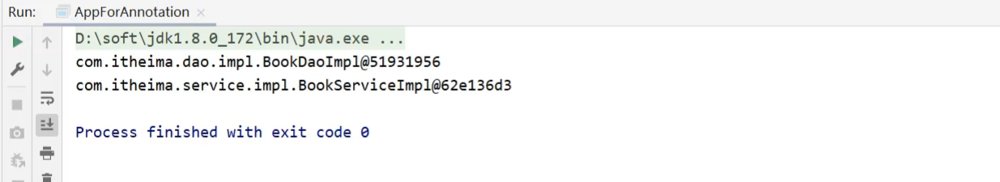

至此，纯注解开发的方式已经完成，主要内容包括：

Java类替换Spring核心配置文件

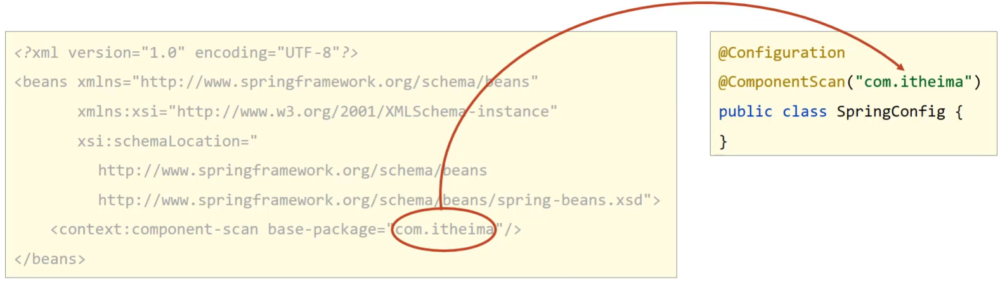

@Configuration注解用于设定当前类为配置类

@ComponentScan注解用于设定扫描路径，此注解只能添加一次，多个数据请用数组格式

<table>
<colgroup>
<col style="width: 100%" />
</colgroup>
<tbody>
<tr class="odd">
<td>Java 
@ComponentScan({com.itheima.service","com.itheima.dao"})</td>
</tr>
</tbody>
</table>

读取Spring核心配置文件初始化容器对象切换为读取Java配置类初始化容器对象

<table>
<colgroup>
<col style="width: 100%" />
</colgroup>
<tbody>
<tr class="odd">
<td>Java 
//加载配置文件初始化容器 
ApplicationContext ctx = new ClassPathXmlApplicationContext("applicationContext.xml"); 
//加载配置类初始化容器 
ApplicationContext ctx = new AnnotationConfigApplicationContext(SpringConfig.class);</td>
</tr>
</tbody>
</table>

**@Configuration**

|      |                             |
|------|-----------------------------|
| 名称 | @Configuration              |
| 类型 | 类注解                      |
| 位置 | 类定义上方                  |
| 作用 | 设置该类为spring配置类      |
| 属性 | value（默认）：定义bean的id |

**@ComponentScan**

|      |                                                          |
|------|----------------------------------------------------------|
| 名称 | @ComponentScan                                           |
| 类型 | 类注解                                                   |
| 位置 | 类定义上方                                               |
| 作用 | 设置spring配置类扫描路径，用于加载使用注解格式定义的bean |
| 属性 | value（默认）：扫描路径，此路径可以逐层向下扫描          |

**小结**

记住@Component、@Controller、@Service、@Repository这四个注解

applicationContext.xml中\<context:component-scan/\>的作用是指定扫描包路径，注解为@ComponentScan

@Configuration标识该类为配置类，使用类替换applicationContext.xml文件

ClassPathXmlApplicationContext是加载XML配置文件

AnnotationConfigApplicationContext是加载配置类

**7.4 bean作用范围与生命周期**

使用注解已经完成了bean的管理，接下来按照前面所学习的内容，将通过配置实现的内容都换成对应的注解实现，包含两部分内容:bean作用范围和bean生命周期。

**7.4.1 环境准备**

创建一个Maven项目，并在pom.xml添加Spring的依赖

<table>
<colgroup>
<col style="width: 100%" />
</colgroup>
<tbody>
<tr class="odd">
<td>XML 
&lt;dependencies&gt; 
&lt;dependency&gt; 
&lt;groupId&gt;org.springframework&lt;/groupId&gt; 
&lt;artifactId&gt;spring-context&lt;/artifactId&gt; 
&lt;version&gt;5.2.10.RELEASE&lt;/version&gt; 
&lt;/dependency&gt; 
&lt;/dependencies&gt;</td>
</tr>
</tbody>
</table>

添加一个配置类SpringConfig

<table>
<colgroup>
<col style="width: 100%" />
</colgroup>
<tbody>
<tr class="odd">
<td>Java 
@Configuration 
@ComponentScan("com.itheima") 
public class SpringConfig { 
}</td>
</tr>
</tbody>
</table>

添加BookDao、BookDaoImpl类

<table>
<colgroup>
<col style="width: 100%" />
</colgroup>
<tbody>
<tr class="odd">
<td>Java 
public interface BookDao { 
public void save(); 
} 
@Repository 
public class BookDaoImpl implements BookDao { 
public void save() { 
System.out.println("book dao save ..." ); 
} 
}</td>
</tr>
</tbody>
</table>

创建运行类App

<table>
<colgroup>
<col style="width: 100%" />
</colgroup>
<tbody>
<tr class="odd">
<td>Java 
public class App { 
public static void main(String[] args) { 
AnnotationConfigApplicationContext ctx = new AnnotationConfigApplicationContext(SpringConfig.class); 
BookDao bookDao1 = ctx.getBean(BookDao.class); 
BookDao bookDao2 = ctx.getBean(BookDao.class); 
System.out.println(bookDao1); 
System.out.println(bookDao2); 
} 
}</td>
</tr>
</tbody>
</table>

最终项目结构如下：

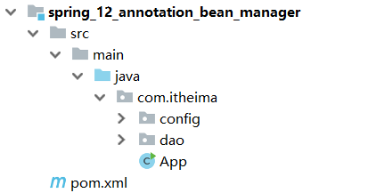

**7.4.2 Bean的作用范围**

（1）运行App类，在控制台打印两个一摸一样的地址，说明默认情况下bean是单例

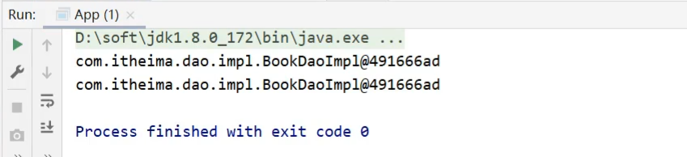

（2）要想将BookDaoImpl变成非单例，只需要在其类上添加@scope注解

<table>
<colgroup>
<col style="width: 100%" />
</colgroup>
<tbody>
<tr class="odd">
<td>Java 
@Repository 
// @Scope设置bean的作用范围 
@Scope("prototype") 
public class BookDaoImpl implements BookDao { 
 
public void save() { 
System.out.println("book dao save ..."); 
} 
}</td>
</tr>
</tbody>
</table>

再次执行App类，打印结果：

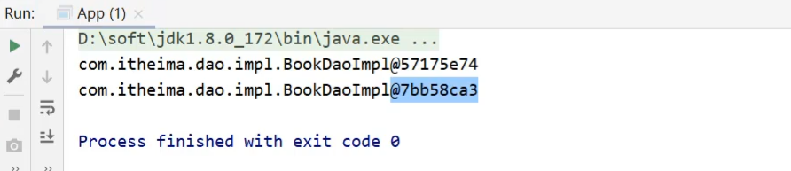

**@Scope**

<table>
<colgroup>
<col style="width: 50%" />
<col style="width: 50%" />
</colgroup>
<tbody>
<tr class="odd">
<td>名称</td>
<td>@Scope</td>
</tr>
<tr class="even">
<td>类型</td>
<td>类注解</td>
</tr>
<tr class="odd">
<td>位置</td>
<td>类定义上方</td>
</tr>
<tr class="even">
<td>作用</td>
<td>设置该类创建对象的作用范围 
可用于设置创建出的bean是否为单例对象</td>
</tr>
<tr class="odd">
<td>属性</td>
<td>value（默认）：定义bean作用范围， 
默认值singleton（单例），可选值prototype（非单例）</td>
</tr>
</tbody>
</table>

**7.4.3 Bean的生命周期**

（1）在BookDaoImpl中添加两个方法，init和destroy，方法名可以任意

<table>
<colgroup>
<col style="width: 100%" />
</colgroup>
<tbody>
<tr class="odd">
<td>Java 
@Repository 
public class BookDaoImpl implements BookDao { 
public void save() { 
System.out.println("book dao save ..."); 
} 
public void init() { 
System.out.println("init ..."); 
} 
public void destroy() { 
System.out.println("destroy ..."); 
} 
}</td>
</tr>
</tbody>
</table>

（2）对方法进行标识，哪个是初始化方法，哪个是销毁方法

只需要在对应的方法上添加@PostConstruct和@PreDestroy注解即可。

<table>
<colgroup>
<col style="width: 100%" />
</colgroup>
<tbody>
<tr class="odd">
<td>Java 
@Repository 
public class BookDaoImpl implements BookDao { 
public void save() { 
System.out.println("book dao save ..."); 
} 
@PostConstruct // 在构造方法之后执行，替换 init-method 
public void init() { 
System.out.println("init ..."); 
} 
@PreDestroy // 在销毁方法之前执行，替换 destroy-method 
public void destroy() { 
System.out.println("destroy ..."); 
} 
}</td>
</tr>
</tbody>
</table>

（3）要想看到两个方法执行，需要注意的是destroy只有在容器关闭的时候，才会执行，所以需要修改App的类

<table>
<colgroup>
<col style="width: 100%" />
</colgroup>
<tbody>
<tr class="odd">
<td>Java 
public class App { 
public static void main(String[] args) { 
AnnotationConfigApplicationContext ctx = new AnnotationConfigApplicationContext(SpringConfig.class); 
BookDao bookDao1 = ctx.getBean(BookDao.class); 
BookDao bookDao2 = ctx.getBean(BookDao.class); 
System.out.println(bookDao1); 
System.out.println(bookDao2); 
ctx.close(); // 关闭容器 
} 
}</td>
</tr>
</tbody>
</table>

（4）运行App类，查看打印结果，证明init和destroy方法都被执行了

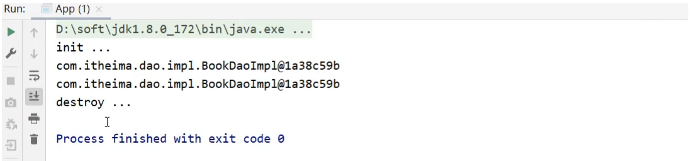

**注意：**JDK9以后jdk中的javax.annotation包被移除了，所以@PostConstruct和@PreDestroy注解可能找不到，需要导入下面的jar包

<table>
<colgroup>
<col style="width: 100%" />
</colgroup>
<tbody>
<tr class="odd">
<td>XML 
&lt;dependency&gt; 
&lt;groupId&gt;javax.annotation&lt;/groupId&gt; 
&lt;artifactId&gt;javax.annotation-api&lt;/artifactId&gt; 
&lt;version&gt;1.3.2&lt;/version&gt; 
&lt;/dependency&gt;</td>
</tr>
</tbody>
</table>

**@PostConstruct**

|      |                        |
|------|------------------------|
| 名称 | @PostConstruct         |
| 类型 | 方法注解               |
| 位置 | 方法上                 |
| 作用 | 设置该方法为初始化方法 |
| 属性 | 无                     |

**@PreDestroy**

|      |                      |
|------|----------------------|
| 名称 | @PreDestroy          |
| 类型 | 方法注解             |
| 位置 | 方法上               |
| 作用 | 设置该方法为销毁方法 |
| 属性 | 无                   |

**小结**

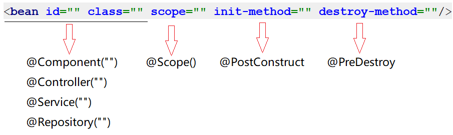

**7.5 依赖注入**

Spring为了使用注解简化开发，并没有提供构造函数注入、setter注入对应的注解，只提供了自动装配的注解实现。

**7.5.1 环境准备**

创建一个Maven项目，pom.xml添加Spring的依赖

<table>
<colgroup>
<col style="width: 100%" />
</colgroup>
<tbody>
<tr class="odd">
<td>XML 
&lt;dependencies&gt; 
&lt;dependency&gt; 
&lt;groupId&gt;org.springframework&lt;/groupId&gt; 
&lt;artifactId&gt;spring-context&lt;/artifactId&gt; 
&lt;version&gt;5.2.10.RELEASE&lt;/version&gt; 
&lt;/dependency&gt; 
&lt;/dependencies&gt;</td>
</tr>
</tbody>
</table>

添加一个配置类SpringConfig

<table>
<colgroup>
<col style="width: 100%" />
</colgroup>
<tbody>
<tr class="odd">
<td>Java 
@Configuration 
@ComponentScan("com.itheima") 
public class SpringConfig { 
}</td>
</tr>
</tbody>
</table>

添加BookDao、BookDaoImpl、BookService、BookServiceImpl类

<table>
<colgroup>
<col style="width: 100%" />
</colgroup>
<tbody>
<tr class="odd">
<td>Java 
public interface BookDao { 
public void save(); 
} 
 
@Repository 
public class BookDaoImpl implements BookDao { 
public void save() { 
System.out.println("book dao save ..." ); 
} 
} 
 
public interface BookService { 
public void save(); 
} 
 
@Service 
public class BookServiceImpl implements BookService { 
private BookDao bookDao; 
 
public void setBookDao(BookDao bookDao) { 
this.bookDao = bookDao; 
} 
public void save() { 
System.out.println("book service save ..."); 
bookDao.save(); 
} 
}</td>
</tr>
</tbody>
</table>

创建运行类App

<table>
<colgroup>
<col style="width: 100%" />
</colgroup>
<tbody>
<tr class="odd">
<td>Java 
public class App { 
public static void main(String[] args) { 
AnnotationConfigApplicationContext ctx = new AnnotationConfigApplicationContext(SpringConfig.class); 
BookService bookService = ctx.getBean(BookService.class); 
bookService.save(); 
} 
}</td>
</tr>
</tbody>
</table>

最终项目结构如下:

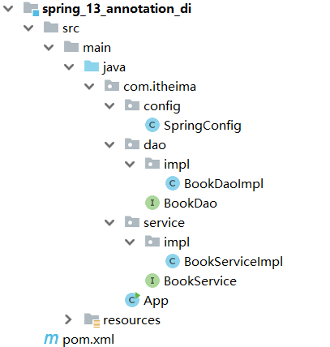

环境准备好后，运行后会发现有问题

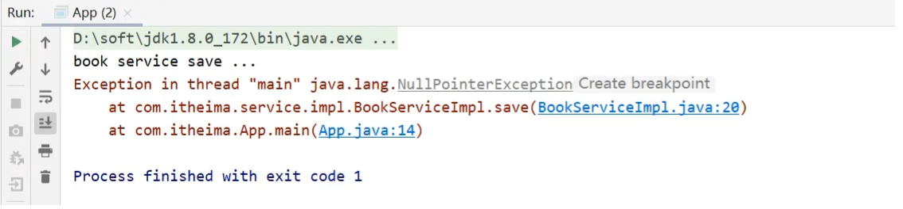

出现问题的原因是，在BookServiceImpl类中添加了BookDao的属性，并提供了setter方法，但是目前是没有提供配置注入BookDao的，所以bookDao对象为Null，调用其save方法就会报控指针异常。

**7.5.2 按照类型注入**

（1）在BookServiceImpl类的bookDao属性上添加@Autowired注解

<table>
<colgroup>
<col style="width: 100%" />
</colgroup>
<tbody>
<tr class="odd">
<td>Java 
@Service 
public class BookServiceImpl implements BookService { 
@Autowired 
private BookDao bookDao; 
 
// public void setBookDao(BookDao bookDao) { 
// this.bookDao = bookDao; 
// } 
public void save() { 
System.out.println("book service save ..."); 
bookDao.save(); 
} 
}</td>
</tr>
</tbody>
</table>

**注意：**

@Autowired可以写在属性上，也可也写在setter方法上，最简单的处理方式是写在属性上并将setter方法删除掉

为什么setter方法可以删除？

自动装配基于反射设计创建对象并通过暴力反射为私有属性进行设值

普通反射只能获取public修饰的内容

暴力反射除了获取public修饰的内容还可以获取private修改的内容

所以此处无需提供setter方法

（2）@Autowired是按照类型注入，那么对应BookDao接口如果有多个实现类，比如添加BookDaoImpl2

<table>
<colgroup>
<col style="width: 100%" />
</colgroup>
<tbody>
<tr class="odd">
<td>Java 
@Repository 
public class BookDaoImpl2 implements BookDao { 
public void save() { 
System.out.println("book dao save ...2"); 
} 
}</td>
</tr>
</tbody>
</table>

这个时候再次运行App就会报错

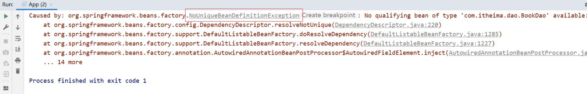

此时，按照类型注入就无法区分到底注入哪个对象，解决方案为按照名称注入。

**7.5.3 按照名称注入**

给两个Dao类分别起个名称

<table>
<colgroup>
<col style="width: 100%" />
</colgroup>
<tbody>
<tr class="odd">
<td>Java 
@Repository("bookDao") 
public class BookDaoImpl implements BookDao { 
public void save() { 
System.out.println("book dao save ..." ); 
} 
} 
@Repository("bookDao2") 
public class BookDaoImpl2 implements BookDao { 
public void save() { 
System.out.println("book dao save ...2" ); 
} 
}</td>
</tr>
</tbody>
</table>

此时就可以注入成功，原因是：@Autowired默认按照类型自动装配，如果IOC容器中同类的Bean找到多个，就按照变量名和Bean的名称匹配，变量名叫bookDao而容器中也有一个bookDao，所以可以成功注入。

例如下面这种情况，按照类型会找到多个bean对象，此时会按照bookDao名称去找，因为IOC容器只有名称叫bookDao1和bookDao2，所以找不到，会报NoUniqueBeanDefinitionException。

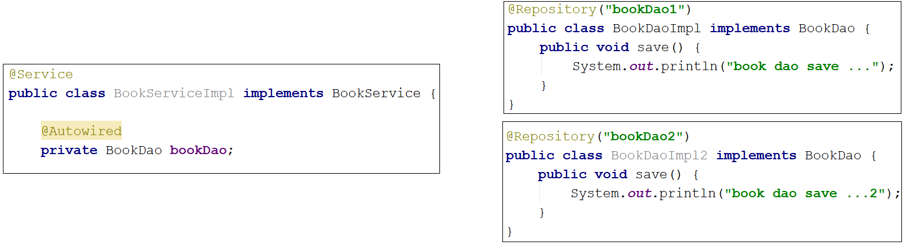

当根据类型在容器中找到多个bean，注入参数的属性名又和容器中bean的名称不一致，这时需要使用**@Qualifier**指定注入哪个名称的bean对象。

<table>
<colgroup>
<col style="width: 100%" />
</colgroup>
<tbody>
<tr class="odd">
<td>Java 
@Service 
public class BookServiceImpl implements BookService { 
@Autowired 
@Qualifier("bookDao1") 
private BookDao bookDao; 
 
public void save() { 
System.out.println("book service save ..."); 
bookDao.save(); 
} 
}</td>
</tr>
</tbody>
</table>

**注意：**@Qualifier不能独立使用，必须和@Autowired一起使用。

**7.5.4 简单数据类型注入**

简单类型注入的是基本数据类型或者字符串类型，下面在BookDaoImpl类中添加一个name属性，用其进行简单类型注入

<table>
<colgroup>
<col style="width: 100%" />
</colgroup>
<tbody>
<tr class="odd">
<td>Java 
@Repository("bookDao") 
public class BookDaoImpl implements BookDao { 
private String name; 
public void save() { 
System.out.println("book dao save ..." + name); 
} 
}</td>
</tr>
</tbody>
</table>

数据类型换了，注解也要跟着换，使用**@Value**注解，将值写入注解的参数中就行了

<table>
<colgroup>
<col style="width: 100%" />
</colgroup>
<tbody>
<tr class="odd">
<td>Java 
@Repository("bookDao") 
public class BookDaoImpl implements BookDao { 
@Value("itheima") 
private String name; 
public void save() { 
System.out.println("book dao save ..." + name); 
} 
}</td>
</tr>
</tbody>
</table>

注意数据格式要匹配，如将"abc"注入给int值，这样程序就会报错。

**7.5.5 注解读取properties配置文件**

**@Value**一般会被用在从properties配置文件中读取内容进行使用，具体步骤如下：

（1）resource下准备jdbc.properties文件

<table>
<colgroup>
<col style="width: 100%" />
</colgroup>
<tbody>
<tr class="odd">
<td>Plaintext 
name=itheima888</td>
</tr>
</tbody>
</table>

（2）使用注解加载properties配置文件

在配置类上添加**@PropertySource**注解

<table>
<colgroup>
<col style="width: 100%" />
</colgroup>
<tbody>
<tr class="odd">
<td>Java 
@Configuration 
@ComponentScan("com.itheima") 
@PropertySource("jdbc.properties") 
public class SpringConfig { 
}</td>
</tr>
</tbody>
</table>

（3）使用@Value读取配置文件中的内容

<table>
<colgroup>
<col style="width: 100%" />
</colgroup>
<tbody>
<tr class="odd">
<td>Java 
@Repository("bookDao") 
public class BookDaoImpl implements BookDao { 
@Value("${name}") 
private String name; 
public void save() { 
System.out.println("book dao save ..." + name); 
} 
}</td>
</tr>
</tbody>
</table>

（4）运行App类，查看运行结果，说明配置文件中的内容已经被加载到

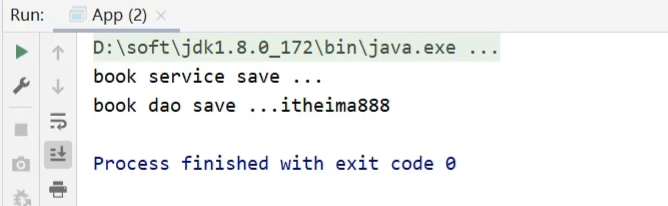

**注意：**

如果读取的properties配置文件有多个，可以使用@PropertySource的属性来指定多个

<table>
<colgroup>
<col style="width: 100%" />
</colgroup>
<tbody>
<tr class="odd">
<td>Java 
@PropertySource({"jdbc.properties","xxx.properties"})</td>
</tr>
</tbody>
</table>

@PropertySource注解属性中不支持使用通配符\*，运行会报错

<table>
<colgroup>
<col style="width: 100%" />
</colgroup>
<tbody>
<tr class="odd">
<td>Java 
@PropertySource({"*.properties"})</td>
</tr>
</tbody>
</table>

@PropertySource注解属性中可以把classpath:加上，代表从当前项目的根路径找文件

<table>
<colgroup>
<col style="width: 100%" />
</colgroup>
<tbody>
<tr class="odd">
<td>Java 
@PropertySource({"classpath:jdbc.properties"})</td>
</tr>
</tbody>
</table>

**@Autowired**

|      |                                                                  |
|------|------------------------------------------------------------------|
| 名称 | @Autowired                                                       |
| 类型 | 属性注解 或 方法注解（了解） 或 方法形参注解（了解）             |
| 位置 | 属性定义上方 或 标准set方法上方 或 类set方法上方 或 方法形参前面 |
| 作用 | 为引用类型属性设置值                                             |
| 属性 | required：true/false，定义该属性是否允许为null                   |

**@Qualifier**

|      |                                                  |
|------|--------------------------------------------------|
| 名称 | @Qualifier                                       |
| 类型 | 属性注解 或 方法注解（了解）                     |
| 位置 | 属性定义上方 或 标准set方法上方 或 类set方法上方 |
| 作用 | 为引用类型属性指定注入的beanId                   |
| 属性 | value（默认）：设置注入的beanId                  |

**@Value**

|      |                                                  |
|------|--------------------------------------------------|
| 名称 | @Value                                           |
| 类型 | 属性注解 或 方法注解（了解）                     |
| 位置 | 属性定义上方 或 标准set方法上方 或 类set方法上方 |
| 作用 | 为 基本数据类型 或 字符串类型 属性设置值         |
| 属性 | value（默认）：要注入的属性值                    |

**@PropertySource**

|      |                                                                       |
|------|-----------------------------------------------------------------------|
| 名称 | @PropertySource                                                       |
| 类型 | 类注解                                                                |
| 位置 | 类定义上方                                                            |
| 作用 | 加载properties文件中的属性值                                          |
| 属性 | value（默认）：设置加载的properties文件对应的文件名或文件名组成的数组 |

**8.注解开发管理第三方bean**

如果是第三方的类，这些类都是在jar包中，没有办法在类上面添加注解，这时就需要有一种更加灵活的方式来定义bean，这种方式不能在原始代码上面书写注解，一样能定义bean，这就用到了一个全新的注解**@Bean**。

**8.1 环境准备**

创建一个Maven项目，pom.xml添加Spring的依赖

<table>
<colgroup>
<col style="width: 100%" />
</colgroup>
<tbody>
<tr class="odd">
<td>XML 
&lt;dependencies&gt; 
&lt;dependency&gt; 
&lt;groupId&gt;org.springframework&lt;/groupId&gt; 
&lt;artifactId&gt;spring-context&lt;/artifactId&gt; 
&lt;version&gt;5.2.10.RELEASE&lt;/version&gt; 
&lt;/dependency&gt; 
&lt;/dependencies&gt;</td>
</tr>
</tbody>
</table>

添加一个配置类SpringConfig

<table>
<colgroup>
<col style="width: 100%" />
</colgroup>
<tbody>
<tr class="odd">
<td>Java 
@Configuration 
public class SpringConfig { 
}</td>
</tr>
</tbody>
</table>

添加BookDao、BookDaoImpl类

<table>
<colgroup>
<col style="width: 100%" />
</colgroup>
<tbody>
<tr class="odd">
<td>Java 
public interface BookDao { 
public void save(); 
} 
 
@Repository 
public class BookDaoImpl implements BookDao { 
public void save() { 
System.out.println("book dao save ..." ); 
} 
}</td>
</tr>
</tbody>
</table>

创建运行类App

<table>
<colgroup>
<col style="width: 100%" />
</colgroup>
<tbody>
<tr class="odd">
<td>Java 
public class App { 
public static void main(String[] args) { 
AnnotationConfigApplicationContext ctx = new AnnotationConfigApplicationContext(SpringConfig.class); 
} 
}</td>
</tr>
</tbody>
</table>

最终项目结构如下：

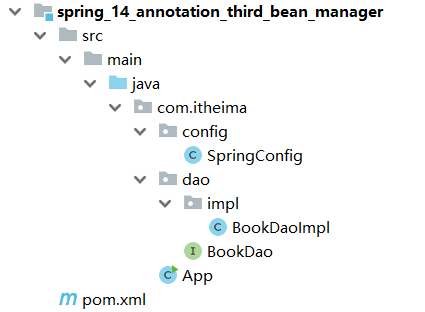

**8.2 注解开发管理第三方bean**

在上述环境中完成对Druid数据源的管理，具体的实现步骤为：

（1）导入对应的jar包

<table>
<colgroup>
<col style="width: 100%" />
</colgroup>
<tbody>
<tr class="odd">
<td>XML 
&lt;dependency&gt; 
&lt;groupId&gt;com.alibaba&lt;/groupId&gt; 
&lt;artifactId&gt;druid&lt;/artifactId&gt; 
&lt;version&gt;1.1.16&lt;/version&gt; 
&lt;/dependency&gt;</td>
</tr>
</tbody>
</table>

（2）在配置类中添加一个方法，方法的返回值就是要创建的Bean对象类型

<table>
<colgroup>
<col style="width: 100%" />
</colgroup>
<tbody>
<tr class="odd">
<td>Java 
@Configuration 
public class SpringConfig { 
public DataSource dataSource(){ 
DruidDataSource ds = new DruidDataSource(); 
ds.setDriverClassName("com.mysql.jdbc.Driver"); 
ds.setUrl("jdbc:mysql://localhost:3306/spring_db"); 
ds.setUsername("root"); 
ds.setPassword("root"); 
return ds; 
} 
}</td>
</tr>
</tbody>
</table>

（3）在方法上添加@Bean注解

@Bean注解的作用是将方法的返回值制作为Spring管理的一个bean对象

<table>
<colgroup>
<col style="width: 100%" />
</colgroup>
<tbody>
<tr class="odd">
<td>Java 
@Configuration 
public class SpringConfig { 
@Bean 
public DataSource dataSource(){ 
DruidDataSource ds = new DruidDataSource(); 
ds.setDriverClassName("com.mysql.jdbc.Driver"); 
ds.setUrl("jdbc:mysql://localhost:3306/spring_db"); 
ds.setUsername("root"); 
ds.setPassword("root"); 
return ds; 
} 
}</td>
</tr>
</tbody>
</table>

**注意：**不能使用DataSource ds = new DruidDataSource()，因为DataSource接口中没有对应的setter方法来设置属性。

（4）从IOC容器中获取对象并打印

<table>
<colgroup>
<col style="width: 100%" />
</colgroup>
<tbody>
<tr class="odd">
<td>Java 
public class App { 
public static void main(String[] args) { 
AnnotationConfigApplicationContext ctx = new AnnotationConfigApplicationContext(SpringConfig.class); 
DataSource dataSource = ctx.getBean(DataSource.class); 
System.out.println(dataSource); 
} 
}</td>
</tr>
</tbody>
</table>

如果有多个bean要被Spring管理，直接在配置类中多些几个方法，方法上添加@Bean注解即可。

**8.3 引入外部配置类**

如果把所有的第三方bean都配置到Spring的配置类SpringConfig中，虽然可以，但是不利于代码阅读和分类管理，所以就需要按照类别将这些bean配置到不同的配置类中。

对于数据源的bean，新建一个JdbcConfig配置类，并把数据源配置到该类下。

<table>
<colgroup>
<col style="width: 100%" />
</colgroup>
<tbody>
<tr class="odd">
<td>Java 
public class JdbcConfig { 
@Bean 
public DataSource dataSource(){ 
DruidDataSource ds = new DruidDataSource(); 
ds.setDriverClassName("com.mysql.jdbc.Driver"); 
ds.setUrl("jdbc:mysql://localhost:3306/spring_db"); 
ds.setUsername("root"); 
ds.setPassword("root"); 
return ds; 
} 
}</td>
</tr>
</tbody>
</table>

接下来就是使这个配置类能被Spring配置类加载到，并创建DataSource对象在IOC容器中。

**8.3.1 使用包扫描引入**

（1）在Spring的配置类上添加包扫描

<table>
<colgroup>
<col style="width: 100%" />
</colgroup>
<tbody>
<tr class="odd">
<td>Java 
@Configuration 
@ComponentScan("com.itheima.config") 
public class SpringConfig { 
 
}</td>
</tr>
</tbody>
</table>

（2）在JdbcConfig上添加配置注解

JdbcConfig类要放入到com.itheima.config包下，需要被Spring的配置类扫描到即可

<table>
<colgroup>
<col style="width: 100%" />
</colgroup>
<tbody>
<tr class="odd">
<td>Java 
@Configuration 
public class JdbcConfig { 
@Bean 
public DataSource dataSource(){ 
DruidDataSource ds = new DruidDataSource(); 
ds.setDriverClassName("com.mysql.jdbc.Driver"); 
ds.setUrl("jdbc:mysql://localhost:3306/spring_db"); 
ds.setUsername("root"); 
ds.setPassword("root"); 
return ds; 
} 
}</td>
</tr>
</tbody>
</table>

（3）运行程序，发现依然能获取到bean对象并打印控制台。

虽然这种方式虽然能够扫描到，但是不能很快知晓都引入了哪些配置类，所以这种方式不推荐使用。

**8.3.2 使用@Import引入**

也可以不加@Configuration注解，但是必须在Spring配置类上使用@Import注解手动引入需要加载的配置类。

（1）去除JdbcConfig类上的注解

<table>
<colgroup>
<col style="width: 100%" />
</colgroup>
<tbody>
<tr class="odd">
<td>Java 
public class JdbcConfig { 
@Bean 
public DataSource dataSource(){ 
DruidDataSource ds = new DruidDataSource(); 
ds.setDriverClassName("com.mysql.jdbc.Driver"); 
ds.setUrl("jdbc:mysql://localhost:3306/spring_db"); 
ds.setUsername("root"); 
ds.setPassword("root"); 
return ds; 
} 
}</td>
</tr>
</tbody>
</table>

（2）在Spring配置类中引入

<table>
<colgroup>
<col style="width: 100%" />
</colgroup>
<tbody>
<tr class="odd">
<td>Java 
@Configuration 
//@ComponentScan("com.itheima.config") 
@Import({JdbcConfig.class}) 
public class SpringConfig { 
 
}</td>
</tr>
</tbody>
</table>

**注意：**

扫描注解可以移除

@Import参数需要的是一个数组，可以引入多个配置类

@Import注解在配置类中只能写一次，下面的方式是不允许的

<table>
<colgroup>
<col style="width: 100%" />
</colgroup>
<tbody>
<tr class="odd">
<td>Java 
@Configuration 
//@ComponentScan("com.itheima.config") 
@Import(JdbcConfig.class) 
@Import(Xxx.class) 
public class SpringConfig { 
 
}</td>
</tr>
</tbody>
</table>

（3）运行程序，结果依然能获取到bean对象并打印控制台

**@Bean**

|      |                                        |
|------|----------------------------------------|
| 名称 | @Bean                                  |
| 类型 | 方法注解                               |
| 位置 | 方法定义上方                           |
| 作用 | 设置该方法的返回值作为spring管理的bean |
| 属性 | value（默认）：定义bean的id            |

**@Import**

<table>
<colgroup>
<col style="width: 50%" />
<col style="width: 50%" />
</colgroup>
<tbody>
<tr class="odd">
<td>名称</td>
<td>@Import</td>
</tr>
<tr class="even">
<td>类型</td>
<td>类注解</td>
</tr>
<tr class="odd">
<td>位置</td>
<td>类定义上方</td>
</tr>
<tr class="even">
<td>作用</td>
<td>导入配置类</td>
</tr>
<tr class="odd">
<td>属性</td>
<td>value（默认）：定义导入的配置类类名， 
当配置类有多个时使用数组格式一次性导入多个配置类</td>
</tr>
</tbody>
</table>

**8.4 为第三方bean注入资源**

在使用@Bean创建bean对象的时候，方法在创建的过程中可能会需要其他资源即简单数据类型 或引用数据类型。

**8.4.1 简单数据类型**

例如，下面代码关于数据库的四要素不应该写死在代码中，应该是从properties配置文件中读取

<table>
<colgroup>
<col style="width: 100%" />
</colgroup>
<tbody>
<tr class="odd">
<td>Java 
public class JdbcConfig { 
@Bean 
public DataSource dataSource(){ 
DruidDataSource ds = new DruidDataSource(); 
ds.setDriverClassName("com.mysql.jdbc.Driver"); 
ds.setUrl("jdbc:mysql://localhost:3306/spring_db"); 
ds.setUsername("root"); 
ds.setPassword("root"); 
return ds; 
} 
}</td>
</tr>
</tbody>
</table>

此时即注入简单数据类型，实现步骤如下：

（1）类中提供四个属性

<table>
<colgroup>
<col style="width: 100%" />
</colgroup>
<tbody>
<tr class="odd">
<td>Java 
public class JdbcConfig { 
private String driver; 
private String url; 
private String userName; 
private String password; 
 
@Bean 
public DataSource dataSource(){ 
DruidDataSource ds = new DruidDataSource(); 
ds.setDriverClassName("com.mysql.jdbc.Driver"); 
ds.setUrl("jdbc:mysql://localhost:3306/spring_db"); 
ds.setUsername("root"); 
ds.setPassword("root"); 
return ds; 
} 
}</td>
</tr>
</tbody>
</table>

（2）使用@Value注解引入值

<table>
<colgroup>
<col style="width: 100%" />
</colgroup>
<tbody>
<tr class="odd">
<td>Java 
 
public class JdbcConfig { 
@Value("com.mysql.jdbc.Driver") 
private String driver; 
@Value("jdbc:mysql://localhost:3306/spring_db") 
private String url; 
@Value("root") 
private String userName; 
@Value("password") 
private String password; 
 
@Bean 
public DataSource dataSource(){ 
DruidDataSource ds = new DruidDataSource(); 
ds.setDriverClassName(driver); 
ds.setUrl(url); 
ds.setUsername(userName); 
ds.setPassword(password); 
return ds; 
} 
}</td>
</tr>
</tbody>
</table>

**扩展**

现在的数据库连接四要素还是写在代码中，需要将这些内容提取到jdbc.properties配置文件，实现思路如下，这里不做具体实现：

resources目录下添加jdbc.properties

配置文件中提供四个键值对分别是数据库的四要素

使用@PropertySource加载jdbc.properties配置文件

修改@Value注解属性的值，将其修改为\${key}，key就是键值对中的键的值

**8.4.2 引用数据类型**

假设在构建DataSource对象的时候，需要用到BookDao对象

<table>
<colgroup>
<col style="width: 100%" />
</colgroup>
<tbody>
<tr class="odd">
<td>Java 
public class JdbcConfig { 
@Bean 
public DataSource dataSource(){ 
DruidDataSource ds = new DruidDataSource(); 
ds.setDriverClassName("com.mysql.jdbc.Driver"); 
ds.setUrl("jdbc:mysql://localhost:3306/spring_db"); 
ds.setUsername("root"); 
ds.setPassword("root"); 
return ds; 
} 
}</td>
</tr>
</tbody>
</table>

此处即注入引用数据类型，只需要为bean定义方法设置形参即可，容器会根据类型自动装配对象。具体的实现步骤如下：

（1）在SpringConfig中扫描BookDao

扫描的目的是让Spring能管理到BookDao，也就是说要让IOC容器中有一个bookDao对象

<table>
<colgroup>
<col style="width: 100%" />
</colgroup>
<tbody>
<tr class="odd">
<td>Java 
@Configuration 
@ComponentScan("com.itheima.dao") 
@Import({JdbcConfig.class}) 
public class SpringConfig { 
}</td>
</tr>
</tbody>
</table>

（2）在JdbcConfig类的方法上添加参数

<table>
<colgroup>
<col style="width: 100%" />
</colgroup>
<tbody>
<tr class="odd">
<td>Java 
@Bean 
public DataSource dataSource(BookDao bookDao){ 
System.out.println(bookDao); 
DruidDataSource ds = new DruidDataSource(); 
ds.setDriverClassName(driver); 
ds.setUrl(url); 
ds.setUsername(userName); 
ds.setPassword(password); 
return ds; 
}</td>
</tr>
</tbody>
</table>

（3）运行程序

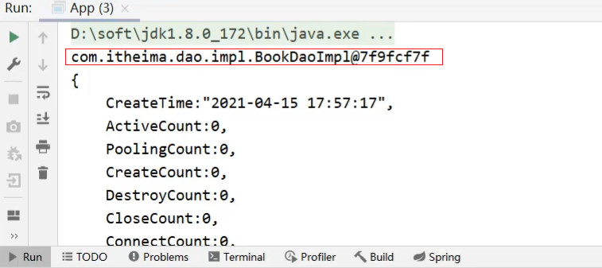

**9.注解开发总结**

XML配置和注解的开发实现对比如下：

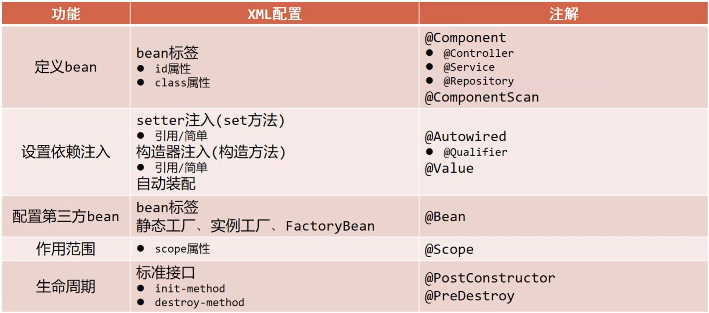

**10.Spring整合**

Spring有一个容器，叫做IOC容器，里面保存bean。在企业级开发时，除了将自己写的类让Spring管理，还有一部分工作就是使用第三方技术，下面结合IOC和DI，整合2个常用技术，进一步加深对Spring的使用理解。

**10.1 Spring整合Mybatis**

**10.1.1 环境准备**

回顾下Mybatis开发的相关内容。

（1）准备数据库表

Mybatis是来操作数据库表，所以先创建一个数据库及表

<table>
<colgroup>
<col style="width: 100%" />
</colgroup>
<tbody>
<tr class="odd">
<td>SQL 
create database spring_db character set utf8; 
use spring_db; 
create table tbl_account( 
id int primary key auto_increment, 
name varchar(35), 
money double 
);</td>
</tr>
</tbody>
</table>

（2）创建项目导入jar包

<table>
<colgroup>
<col style="width: 100%" />
</colgroup>
<tbody>
<tr class="odd">
<td>XML 
&lt;dependencies&gt; 
&lt;dependency&gt; 
&lt;groupId&gt;org.springframework&lt;/groupId&gt; 
&lt;artifactId&gt;spring-context&lt;/artifactId&gt; 
&lt;version&gt;5.2.10.RELEASE&lt;/version&gt; 
&lt;/dependency&gt; 
&lt;dependency&gt; 
&lt;groupId&gt;com.alibaba&lt;/groupId&gt; 
&lt;artifactId&gt;druid&lt;/artifactId&gt; 
&lt;version&gt;1.1.16&lt;/version&gt; 
&lt;/dependency&gt; 
&lt;dependency&gt; 
&lt;groupId&gt;org.mybatis&lt;/groupId&gt; 
&lt;artifactId&gt;mybatis&lt;/artifactId&gt; 
&lt;version&gt;3.5.6&lt;/version&gt; 
&lt;/dependency&gt; 
&lt;dependency&gt; 
&lt;groupId&gt;mysql&lt;/groupId&gt; 
&lt;artifactId&gt;mysql-connector-java&lt;/artifactId&gt; 
&lt;version&gt;5.1.47&lt;/version&gt; 
&lt;/dependency&gt; 
&lt;/dependencies&gt;</td>
</tr>
</tbody>
</table>

（3）根据表创建模型类

<table>
<colgroup>
<col style="width: 100%" />
</colgroup>
<tbody>
<tr class="odd">
<td>Java 
public class Account implements Serializable { 
 
private Integer id; 
private String name; 
private Double money; 
//setter...getter...toString...方法略 
}</td>
</tr>
</tbody>
</table>

（4）创建Dao接口

<table>
<colgroup>
<col style="width: 100%" />
</colgroup>
<tbody>
<tr class="odd">
<td>Java 
public interface AccountDao { 
 
@Insert("insert into tbl_account(name,money) values(#{name},#{money})") 
void save(Account account); 
 
@Delete("delete from tbl_account where id = #{id} ") 
void delete(Integer id); 
 
@Update("update tbl_account set name = #{name} , money = #{money} where id = #{id} ") 
void update(Account account); 
 
@Select("select * from tbl_account") 
List&lt;Account&gt; findAll(); 
 
@Select("select * from tbl_account where id = #{id} ") 
Account findById(Integer id); 
}</td>
</tr>
</tbody>
</table>

（5）创建Service接口和实现类

<table>
<colgroup>
<col style="width: 100%" />
</colgroup>
<tbody>
<tr class="odd">
<td>Java 
public interface AccountService { 
 
void save(Account account); 
 
void delete(Integer id); 
 
void update(Account account); 
 
List&lt;Account&gt; findAll(); 
 
Account findById(Integer id); 
 
} 
 
@Service 
public class AccountServiceImpl implements AccountService { 
 
@Autowired 
private AccountDao accountDao; 
 
public void save(Account account) { 
accountDao.save(account); 
} 
 
public void update(Account account){ 
accountDao.update(account); 
} 
 
public void delete(Integer id) { 
accountDao.delete(id); 
} 
 
public Account findById(Integer id) { 
return accountDao.findById(id); 
} 
 
public List&lt;Account&gt; findAll() { 
return accountDao.findAll(); 
} 
}</td>
</tr>
</tbody>
</table>

（6）添加jdbc.properties文件

resources目录下添加，用于配置数据库连接四要素

<table>
<colgroup>
<col style="width: 100%" />
</colgroup>
<tbody>
<tr class="odd">
<td>Properties 
jdbc.driver=com.mysql.jdbc.Driver 
jdbc.url=jdbc:mysql://localhost:3306/spring_db?useSSL=false 
jdbc.username=root 
jdbc.password=root</td>
</tr>
</tbody>
</table>

*useSSL：关闭MySQL的SSL连接*

（7）添加Mybatis核心配置文件

<table>
<colgroup>
<col style="width: 100%" />
</colgroup>
<tbody>
<tr class="odd">
<td>XML 
&lt;?xml version="1.0" encoding="UTF-8"？&gt; 
&lt;!DOCTYPE configuration 
PUBLIC "-//mybatis.org//DTD Config 3.0//EN" 
"http://mybatis.org/dtd/mybatis-3-config.dtd"&gt; 
&lt;configuration&gt; 
&lt;!--读取外部properties配置文件--&gt; 
&lt;properties resource="jdbc.properties"&gt;&lt;/properties&gt; 
&lt;!--别名扫描的包路径--&gt; 
&lt;typeAliases&gt; 
&lt;package name="com.itheima.domain"/&gt; 
&lt;/typeAliases&gt; 
&lt;!--数据源--&gt; 
&lt;environments default="mysql"&gt; 
&lt;environment id="mysql"&gt; 
&lt;transactionManager type="JDBC"&gt;&lt;/transactionManager&gt; 
&lt;dataSource type="POOLED"&gt; 
&lt;property name="driver" value="${jdbc.driver}"&gt;&lt;/property&gt; 
&lt;property name="url" value="${jdbc.url}"&gt;&lt;/property&gt; 
&lt;property name="username" value="${jdbc.username}"&gt;&lt;/property&gt; 
&lt;property name="password" value="${jdbc.password}"&gt;&lt;/property&gt; 
&lt;/dataSource&gt; 
&lt;/environment&gt; 
&lt;/environments&gt; 
&lt;!--映射文件扫描包路径--&gt; 
&lt;mappers&gt; 
&lt;package name="com.itheima.dao"&gt;&lt;/package&gt; 
&lt;/mappers&gt; 
&lt;/configuration&gt;</td>
</tr>
</tbody>
</table>

（8）编写应用程序

<table>
<colgroup>
<col style="width: 100%" />
</colgroup>
<tbody>
<tr class="odd">
<td>Java 
public class App { 
public static void main(String[] args) throws IOException { 
// 1. 创建SqlSessionFactoryBuilder对象 
SqlSessionFactoryBuilder sqlSessionFactoryBuilder = new SqlSessionFactoryBuilder(); 
// 2. 加载SqlMapConfig.xml配置文件 
InputStream inputStream = Resources.getResourceAsStream("SqlMapConfig.xml.bak"); 
// 3. 创建SqlSessionFactory对象 
SqlSessionFactory sqlSessionFactory = sqlSessionFactoryBuilder.build(inputStream); 
// 4. 获取SqlSession 
SqlSession sqlSession = sqlSessionFactory.openSession(); 
// 5. 执行SqlSession对象执行查询，获取结果User 
AccountDao accountDao = sqlSession.getMapper(AccountDao.class); 
 
Account ac = accountDao.findById(1); 
System.out.println(ac); 
 
// 6. 释放资源 
sqlSession.close(); 
} 
}</td>
</tr>
</tbody>
</table>

（9）运行程序

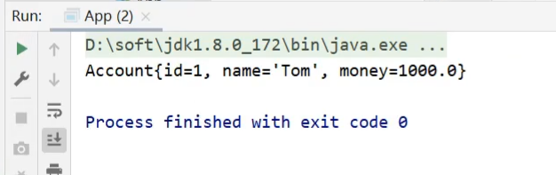

**10.1.2 思路分析**

Mybatis的基础环境准备好后，分析上述内容中哪些对象可以交给Spring来管理？

Mybatis程序核心对象分析

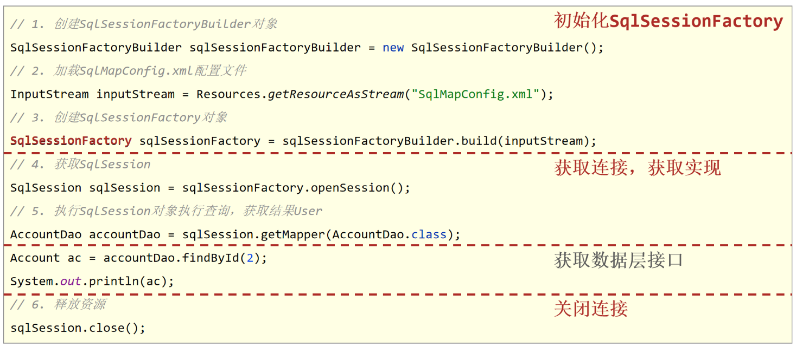

从图中可以获取到，真正需要交给Spring管理的是**SqlSessionFactory**。

整合Mybatis，就是将Mybatis用到的内容交给Spring管理，分析下配置文件：

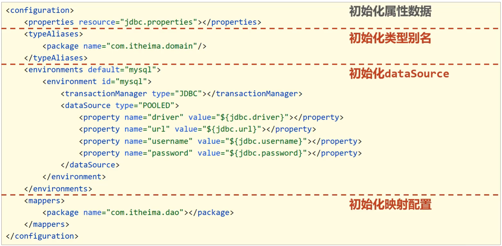

第一行读取外部properties配置文件，Spring有提供具体的解决方案@PropertySource，需要交给Spring

第二行起别名包扫描，为SqlSessionFactory服务的，需要交给Spring

第三行主要用于做连接池，Spring之前我们已经整合了Druid连接池，这块也需要交给Spring

前面三行一起都是为了创建SqlSession对象用的，那么用Spring管理SqlSession对象吗？回忆下SqlSession是由SqlSessionFactory创建出来的，所以只需要将SqlSessionFactory交给Spring管理即可

第四行是Mapper接口和映射文件\[如果使用注解就没有该映射文件\]，这个是在获取到SqlSession以后执行具体操作的时候用，所以它和SqlSessionFactory创建的时机都不在同一个时间，可能需要单独管理

经过分析可以得到，Spring与Mybatis的整合大体需要做两件事：

Spring要管理MyBatis中的SqlSessionFactory

Spring要管理Mapper接口的扫描

**10.1.3 Spring整合Mybatis实现**

（1）项目中导入整合需要的jar包

<table>
<colgroup>
<col style="width: 100%" />
</colgroup>
<tbody>
<tr class="odd">
<td>XML 
&lt;dependency&gt; 
&lt;!--Spring操作数据库需要该jar包--&gt; 
&lt;groupId&gt;org.springframework&lt;/groupId&gt; 
&lt;artifactId&gt;spring-jdbc&lt;/artifactId&gt; 
&lt;version&gt;5.2.10.RELEASE&lt;/version&gt; 
&lt;/dependency&gt; 
&lt;dependency&gt; 
&lt;!-- 
Spring与Mybatis整合的jar包 
这个jar包mybatis在前面，是Mybatis提供的 
--&gt; 
&lt;groupId&gt;org.mybatis&lt;/groupId&gt; 
&lt;artifactId&gt;mybatis-spring&lt;/artifactId&gt; 
&lt;version&gt;1.3.0&lt;/version&gt; 
&lt;/dependency&gt;</td>
</tr>
</tbody>
</table>

（2）创建Spring的主配置类

<table>
<colgroup>
<col style="width: 100%" />
</colgroup>
<tbody>
<tr class="odd">
<td>Java 
// 配置类注解 
@Configuration 
// 包扫描，主要扫描的是项目中的AccountServiceImpl类 
@ComponentScan("com.itheima") 
public class SpringConfig { 
}</td>
</tr>
</tbody>
</table>

（3）创建数据源的配置类

<table>
<colgroup>
<col style="width: 100%" />
</colgroup>
<tbody>
<tr class="odd">
<td>Java 
public class JdbcConfig { 
@Value("${jdbc.driver}") 
private String driver; 
@Value("${jdbc.url}") 
private String url; 
@Value("${jdbc.username}") 
private String userName; 
@Value("${jdbc.password}") 
private String password; 
 
@Bean 
public DataSource dataSource() { 
DruidDataSource ds = new DruidDataSource(); 
ds.setDriverClassName(driver); 
ds.setUrl(url); 
ds.setUsername(userName); 
ds.setPassword(password); 
return ds; 
} 
}</td>
</tr>
</tbody>
</table>

（4）主配置类中读properties并引入数据源配置类

<table>
<colgroup>
<col style="width: 100%" />
</colgroup>
<tbody>
<tr class="odd">
<td>Java 
@Configuration 
@ComponentScan("com.itheima") 
@PropertySource("classpath:jdbc.properties") 
@Import(JdbcConfig.class) 
public class SpringConfig { 
}</td>
</tr>
</tbody>
</table>

（5）创建Mybatis配置类并配置SqlSessionFactory

<table>
<colgroup>
<col style="width: 100%" />
</colgroup>
<tbody>
<tr class="odd">
<td>Java 
public class MybatisConfig { 
// 定义bean，SqlSessionFactoryBean，用于产生SqlSessionFactory对象 
@Bean 
public SqlSessionFactoryBean sqlSessionFactory(DataSource dataSource){ 
SqlSessionFactoryBean ssfb = new SqlSessionFactoryBean(); 
// 设置模型类的别名扫描 
ssfb.setTypeAliasesPackage("com.itheima.domain"); 
// 设置数据源 
ssfb.setDataSource(dataSource); 
return ssfb; 
} 
// 定义bean，返回MapperScannerConfigurer对象 
@Bean 
public MapperScannerConfigurer mapperScannerConfigurer(){ 
MapperScannerConfigurer msc = new MapperScannerConfigurer(); 
msc.setBasePackage("com.itheima.dao"); 
return msc; 
} 
}</td>
</tr>
</tbody>
</table>

**说明：**

使用SqlSessionFactoryBean封装SqlSessionFactory需要的环境信息

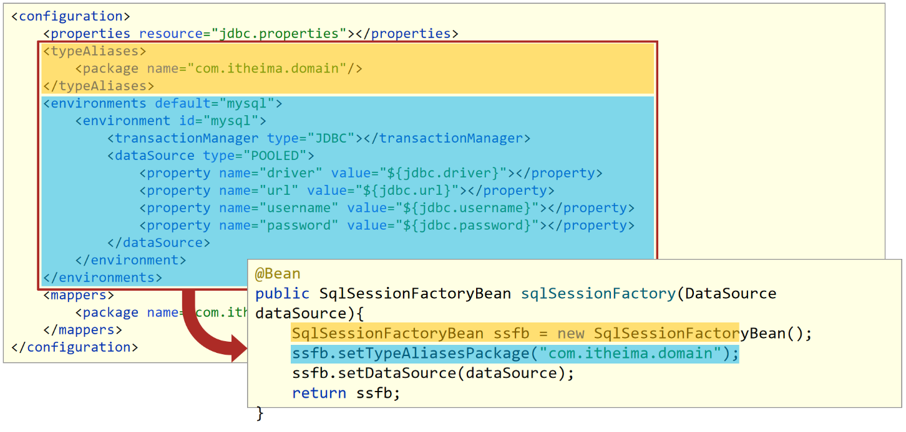

SqlSessionFactoryBean是前面讲解FactoryBean的一个子类，在该类中将SqlSessionFactory的创建进行了封装，简化对象的创建，我们只需要将其需要的内容设置即可。

方法中有一个参数为dataSource，当前Spring容器中已经创建了Druid数据源，类型刚好是DataSource类型，此时在初始化SqlSessionFactoryBean这个对象的时候，发现需要使用DataSource对象，而容器中刚好有这么一个对象，就自动加载了DruidDataSource对象。

使用MapperScannerConfigurer加载Dao接口，创建代理对象保存到IOC容器中

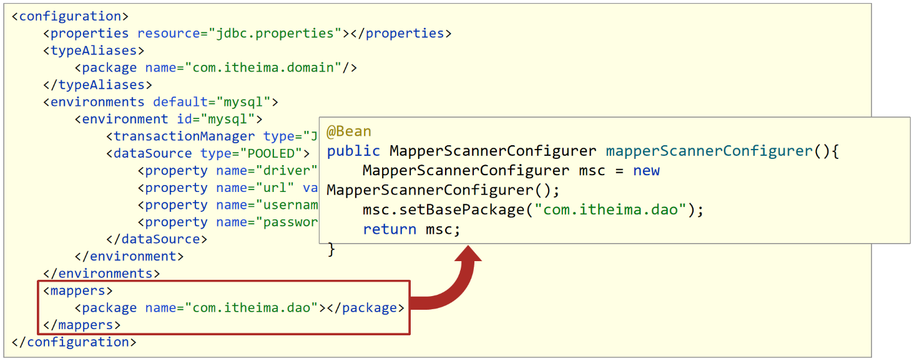

这个MapperScannerConfigurer对象也是MyBatis提供的专用于整合的jar包中的类，用来处理原始配置文件中的mappers相关配置，加载数据层的Mapper接口类

MapperScannerConfigurer有一个核心属性basePackage，就是用来设置所扫描的包路径

（6）主配置类中引入Mybatis配置类

<table>
<colgroup>
<col style="width: 100%" />
</colgroup>
<tbody>
<tr class="odd">
<td>Java 
@Configuration 
@ComponentScan("com.itheima") 
@PropertySource("classpath:jdbc.properties") 
@Import({JdbcConfig.class,MybatisConfig.class}) 
public class SpringConfig { 
}</td>
</tr>
</tbody>
</table>

（7）编写运行类

在运行类中，从IOC容器中获取Service对象，调用方法获取结果

<table>
<colgroup>
<col style="width: 100%" />
</colgroup>
<tbody>
<tr class="odd">
<td>Java 
public class App2 { 
public static void main(String[] args) { 
ApplicationContext ctx = new AnnotationConfigApplicationContext(SpringConfig.class); 
 
AccountService accountService = ctx.getBean(AccountService.class); 
 
Account ac = accountService.findById(1); 
System.out.println(ac); 
} 
}</td>
</tr>
</tbody>
</table>

（8）运行程序

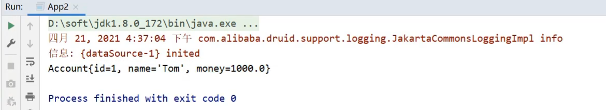

支持Spring与Mybatis的整合就已经完成了，其中主要用到的两个类分别是：

SqlSessionFactoryBean

MapperScannerConfigurer

**10.2 Spring整合Junit**

整合Junit与整合Druid和MyBatis差异比较大。Junit是一个搞单元测试用的工具，不是我们程序的主体，也不会参加最终程序的运行，可以看做是一个辅助工具。

**10.2.1 环境准备**

直接使用Spring与Mybatis整合的环境即可，当然也可以重新创建一个，项目结构如下：

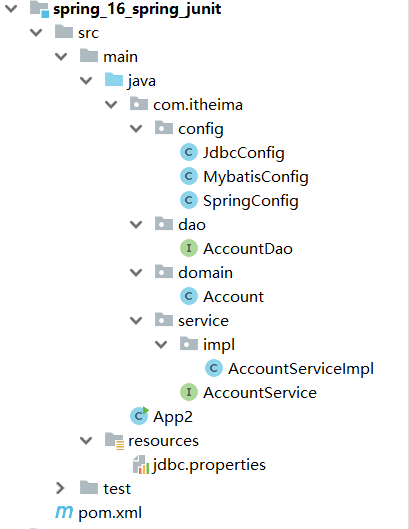

**10.2.2 整合Junit步骤**

（1）引入依赖

<table>
<colgroup>
<col style="width: 100%" />
</colgroup>
<tbody>
<tr class="odd">
<td>XML 
&lt;dependency&gt; 
&lt;groupId&gt;junit&lt;/groupId&gt; 
&lt;artifactId&gt;junit&lt;/artifactId&gt; 
&lt;version&gt;4.12&lt;/version&gt; 
&lt;scope&gt;test&lt;/scope&gt; 
&lt;/dependency&gt; 
 
&lt;dependency&gt; 
&lt;groupId&gt;org.springframework&lt;/groupId&gt; 
&lt;artifactId&gt;spring-test&lt;/artifactId&gt; 
&lt;version&gt;5.2.10.RELEASE&lt;/version&gt; 
&lt;/dependency&gt;</td>
</tr>
</tbody>
</table>

（2）编写测试类

在test\java下创建一个AccountServiceTest（名字任意）

<table>
<colgroup>
<col style="width: 100%" />
</colgroup>
<tbody>
<tr class="odd">
<td>Java 
// 设置类运行器 
@RunWith(SpringJUnit4ClassRunner.class) 
// 设置Spring环境对应的配置类 
@ContextConfiguration(classes = {SpringConfiguration.class}) // 加载配置类 
// @ContextConfiguration(locations={"classpath:applicationContext.xml"})// 加载配置文件 
public class AccountServiceTest { 
// 支持自动装配注入bean 
@Autowired 
private AccountService accountService; 
@Test 
public void testFindById(){ 
System.out.println(accountService.findById(1)); 
 
} 
@Test 
public void testFindAll(){ 
System.out.println(accountService.findAll()); 
} 
}</td>
</tr>
</tbody>
</table>

**注意：**

单元测试，如果测试的是注解配置类，则使用@ContextConfiguration(classes = 配置类.class)

单元测试，如果测试的是配置文件，则使用@ContextConfiguration(locations={配置文件名,...})

Junit运行后是基于Spring环境运行的，所以Spring提供了一个专用的类运行器，这个务必要设置，这个类运行器就在Spring的测试专用包中提供的，导入的坐标就是这个东西SpringJUnit4ClassRunner

上面两个配置都是固定格式，当需要测试哪个bean时，使用自动装配加载对应的对象，下面的工作就和以前做Junit单元测试完全一样了

**@RunWith**

|      |                                   |
|------|-----------------------------------|
| 名称 | @RunWith                          |
| 类型 | 测试类注解                        |
| 位置 | 测试类定义上方                    |
| 作用 | 设置JUnit运行器                   |
| 属性 | value（默认）：运行所使用的运行器 |

**@ContextConfiguration**

<table>
<colgroup>
<col style="width: 50%" />
<col style="width: 50%" />
</colgroup>
<tbody>
<tr class="odd">
<td>名称</td>
<td>@ContextConfiguration</td>
</tr>
<tr class="even">
<td>类型</td>
<td>测试类注解</td>
</tr>
<tr class="odd">
<td>位置</td>
<td>测试类定义上方</td>
</tr>
<tr class="even">
<td>作用</td>
<td>设置JUnit加载的Spring核心配置</td>
</tr>
<tr class="odd">
<td>属性</td>
<td>classes：核心配置类，可以使用数组的格式设定加载多个配置类 
locations：配置文件，可以使用数组的格式设定加载多个配置文件名称</td>
</tr>
</tbody>
</table>

**11.AOP**

OOP：面向对象编程，它是一种编程思想，那么AOP也是一种编程思想，编程思想主要的内容就是指导程序员该如何编写程序，所以它们两个是不同的编程范式。

AOP：面向切面编程，指导开发者如何组织程序结构。

AOP主要作用是在不惊动原始设计的基础上为其进行功能增强，前面咱们有技术就可以实现这样的功能即代理模式。

**11.1 AOP核心概念**

**\[spring_17_aop_demo.zip\]**

准备一个环境spring_17_aop_demo，整个环境的内容暂时不用关注，最主要的类为BookDaoImpl：

<table>
<colgroup>
<col style="width: 100%" />
</colgroup>
<tbody>
<tr class="odd">
<td>Java 
@Repository 
public class BookDaoImpl implements BookDao { 
public void save() { 
//记录程序当前执行执行（开始时间） 
Long startTime = System.currentTimeMillis(); 
//业务执行万次 
for (int i = 0;i&lt;10000;i++) { 
System.out.println("book dao save ..."); 
} 
//记录程序当前执行时间（结束时间） 
Long endTime = System.currentTimeMillis(); 
//计算时间差 
Long totalTime = endTime-startTime; 
//输出信息 
System.out.println("执行万次消耗时间：" + totalTime + "ms"); 
} 
public void update(){ 
System.out.println("book dao update ..."); 
} 
public void delete(){ 
System.out.println("book dao delete ..."); 
} 
public void select(){ 
System.out.println("book dao select ..."); 
} 
}</td>
</tr>
</tbody>
</table>

save方法中有计算万次执行消耗的时间，当在App类中从容器中获取bookDao对象后，分别执行save、delete、update、select，结果如下：

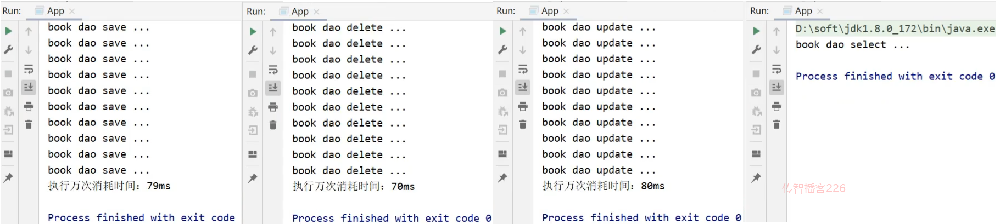

会发现，对于计算万次执行消耗的时间只有save方法有，但是delete和update方法也有，而select方法又没有？

其实这里就使用了Spring的AOP，在不惊动（改动）原有设计（代码）的前提下，给某些代码添加功能，这个就是Spring的理念：无入侵式/无侵入式。基于这个案例来理解AOP的核心概念。

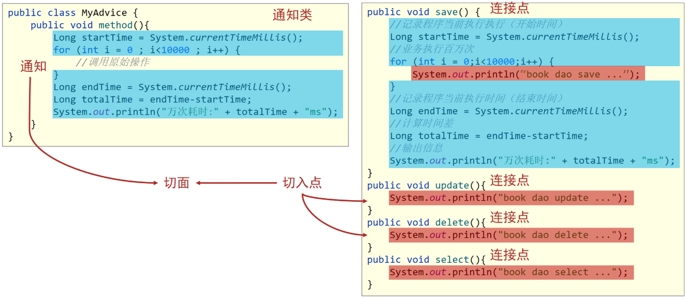

（1）Spring的AOP是对一个类的方法在不进行任何修改的前提下实现增强，例如BookServiceImpl中的save、update、delete、select方法，这些方法就叫**连接点**。

（2）在BookServiceImpl的四个方法中，update和delete只有打印并没有计算万次执行消耗时间，但在运行时已经有该功能，也就是说update和delete方法都已经被增强，这些需要增强的方法就叫**切入点**。

（3）执行BookServiceImpl的update和delete方法时都被添加了计算万次执行消耗时间的功能，将这个功能抽取到一个方法中，这个存放共性功能的方法就叫**通知**。

（4）通知是要增强的内容，会有多个，切入点是需要被增强的方法，也会有多个，而哪个切入点需要添加哪个通知，就需要提前将它们之间的关系描述清楚，将对于通知和切入点之间的关系描述称作**切面**。

（5）通知是一个方法，方法不能独立存在需要被写在一个类中，这个类我们就叫**通知类**。

连接点（JoinPoint）：程序执行过程中的任意位置，粒度为执行方法、抛出异常、设置变量等

在SpringAOP中，理解为方法的执行

切入点（Pointcut）：匹配连接点的式子

在SpringAOP中，一个切入点可以描述一个具体方法，也可也匹配多个方法

一个具体的方法：如com.itheima.dao包下的BookDao接口中的无形参无返回值的save方法

匹配多个方法：所有的save方法，所有的get开头的方法，所有以Dao结尾的接口中的任意方法，所有带有一个参数的方法

连接点范围要比切入点范围大，是切入点的方法也一定是连接点，但是是连接点的方法就不一定要被增强，所以可能不是切入点

通知（Advice）：在切入点处执行的操作，也就是共性功能

在SpringAOP中，功能最终以方法的形式呈现

通知类：定义通知的类

切面（Aspect）：描述通知与切入点的对应关系

**11.2 AOP入门案例**

案例：在方法执行前输出当前系统时间。

对于SpringAOP的开发有两种方式，XML 和 注解，由于注解使用比较多，所以这里采用注解完成AOP的开发。

**11.2.1 环境准备**

创建一个Maven项目，pom.xml添加Spring依赖

<table>
<colgroup>
<col style="width: 100%" />
</colgroup>
<tbody>
<tr class="odd">
<td>XML 
&lt;dependencies&gt; 
&lt;dependency&gt; 
&lt;groupId&gt;org.springframework&lt;/groupId&gt; 
&lt;artifactId&gt;spring-context&lt;/artifactId&gt; 
&lt;version&gt;5.2.10.RELEASE&lt;/version&gt; 
&lt;/dependency&gt; 
&lt;/dependencies&gt;</td>
</tr>
</tbody>
</table>

添加BookDao和BookDaoImpl类

<table>
<colgroup>
<col style="width: 100%" />
</colgroup>
<tbody>
<tr class="odd">
<td>Java 
public interface BookDao { 
public void save(); 
public void update(); 
} 
 
@Repository 
public class BookDaoImpl implements BookDao { 
 
public void save() { 
System.out.println(System.currentTimeMillis()); 
System.out.println("book dao save ..."); 
} 
 
public void update(){ 
System.out.println("book dao update ..."); 
} 
}</td>
</tr>
</tbody>
</table>

创建Spring的配置类

<table>
<colgroup>
<col style="width: 100%" />
</colgroup>
<tbody>
<tr class="odd">
<td>Java 
@Configuration 
@ComponentScan("com.itheima") 
public class SpringConfig { 
}</td>
</tr>
</tbody>
</table>

编写App运行类

<table>
<colgroup>
<col style="width: 100%" />
</colgroup>
<tbody>
<tr class="odd">
<td>Java 
public class App { 
public static void main(String[] args) { 
ApplicationContext ctx = new AnnotationConfigApplicationContext(SpringConfig.class); 
BookDao bookDao = ctx.getBean(BookDao.class); 
bookDao.save(); 
} 
}</td>
</tr>
</tbody>
</table>

最终项目结构如下：

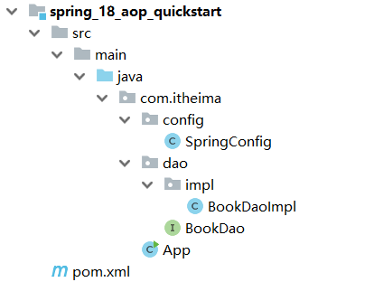

**11.2.2 AOP实现**

（1）添加依赖

<table>
<colgroup>
<col style="width: 100%" />
</colgroup>
<tbody>
<tr class="odd">
<td>XML 
&lt;dependency&gt; 
&lt;groupId&gt;org.aspectj&lt;/groupId&gt; 
&lt;artifactId&gt;aspectjweaver&lt;/artifactId&gt; 
&lt;version&gt;1.9.4&lt;/version&gt; 
&lt;/dependency&gt;</td>
</tr>
</tbody>
</table>

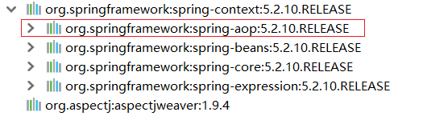

因为spring-context中已经导入了spring-aop，所以不需要再单独导入spring-aop

导入AspectJ的jar包，AspectJ是AOP思想的一个具体实现，Spring有自己的AOP实现，但是相比于AspectJ来说比较麻烦，所以我们直接采用Spring整合ApsectJ的方式进行AOP开发

（2）定义接口与实现类

环境准备时BookDaoImpl已经准备好，不需要做任何修改。

（3）定义通知类和通知

通知是将共性功能抽取出来后形成的方法，共性功能指当前系统时间的打印。

<table>
<colgroup>
<col style="width: 100%" />
</colgroup>
<tbody>
<tr class="odd">
<td>Java 
public class MyAdvice { 
public void method(){ 
System.out.println(System.currentTimeMillis()); 
} 
}</td>
</tr>
</tbody>
</table>

*类名和方法名没有要求，可以任意。*

（4）定义切入点

BookDaoImpl中有两个方法，分别是save和update，需要增强的是update方法

<table>
<colgroup>
<col style="width: 100%" />
</colgroup>
<tbody>
<tr class="odd">
<td>Java 
public class MyAdvice { 
@Pointcut("execution(void com.itheima.dao.BookDao.update())") 
private void pt(){} 
 
public void method(){ 
System.out.println(System.currentTimeMillis()); 
} 
}</td>
</tr>
</tbody>
</table>

*切入点定义依托一个不具有实际意义的方法进行，即无参数、无返回值、方法体无实际逻辑。*

（5）制作切面

<table>
<colgroup>
<col style="width: 100%" />
</colgroup>
<tbody>
<tr class="odd">
<td>Java 
public class MyAdvice { 
@Pointcut("execution(void com.itheima.dao.BookDao.update())") 
private void pt(){} 
 
@Before("pt()") 
public void method(){ 
System.out.println(System.currentTimeMillis()); 
} 
}</td>
</tr>
</tbody>
</table>

绑定切入点与通知关系，并指定通知添加到原始连接点的具体执行位置

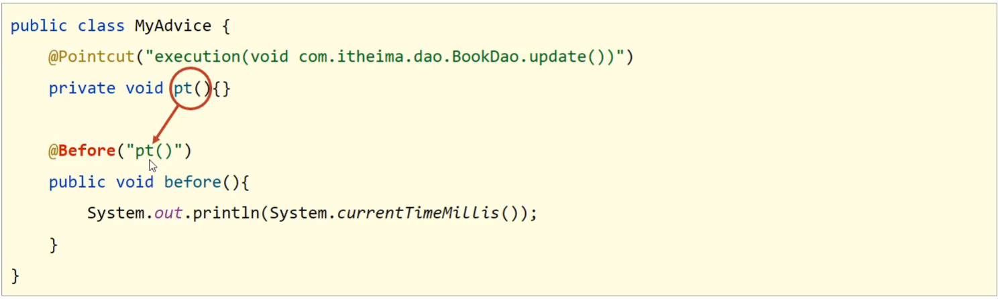

@Before翻译过来是之前，也就是说通知会在切入点方法执行之前执行，其他四种类型后面会讲。

（6）将通知类配给容器并标识其为切面类

<table>
<colgroup>
<col style="width: 100%" />
</colgroup>
<tbody>
<tr class="odd">
<td>Java 
@Component 
@Aspect 
public class MyAdvice { 
@Pointcut("execution(void com.itheima.dao.BookDao.update())") 
private void pt(){} 
 
@Before("pt()") 
public void method(){ 
System.out.println(System.currentTimeMillis()); 
} 
}</td>
</tr>
</tbody>
</table>

（7）开启注解格式AOP功能

<table>
<colgroup>
<col style="width: 100%" />
</colgroup>
<tbody>
<tr class="odd">
<td>Java 
@Configuration 
@ComponentScan("com.itheima") 
@EnableAspectJAutoProxy 
public class SpringConfig { 
}</td>
</tr>
</tbody>
</table>

（8）运行程序

<table>
<colgroup>
<col style="width: 100%" />
</colgroup>
<tbody>
<tr class="odd">
<td>Java 
public class App { 
public static void main(String[] args) { 
ApplicationContext ctx = new AnnotationConfigApplicationContext(SpringConfig.class); 
BookDao bookDao = ctx.getBean(BookDao.class); 
bookDao.update(); 
} 
}</td>
</tr>
</tbody>
</table>

看到在执行update方法之前打印了系统时间戳，说明对原始方法进行了增强，AOP编程成功

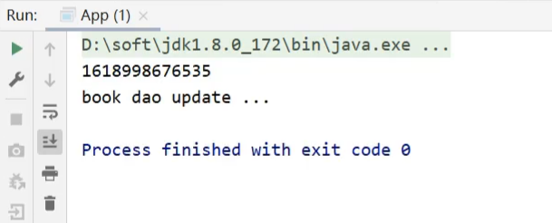

**@EnableAspectJAutoProxy**

|      |                         |
|------|-------------------------|
| 名称 | @EnableAspectJAutoProxy |
| 类型 | 配置类注解              |
| 位置 | 配置类定义上方          |
| 作用 | 开启注解格式AOP功能     |

**@Aspect**

|      |                       |
|------|-----------------------|
| 名称 | @Aspect               |
| 类型 | 类注解                |
| 位置 | 切面类定义上方        |
| 作用 | 设置当前类为AOP切面类 |

**@Pointcut**

|      |                             |
|------|-----------------------------|
| 名称 | @Pointcut                   |
| 类型 | 方法注解                    |
| 位置 | 切入点方法定义上方          |
| 作用 | 设置切入点方法              |
| 属性 | value（默认）：切入点表达式 |

**@Before**

|      |                                                                            |
|------|----------------------------------------------------------------------------|
| 名称 | @Before                                                                    |
| 类型 | 方法注解                                                                   |
| 位置 | 通知方法定义上方                                                           |
| 作用 | 设置当前通知方法与切入点之间的绑定关系，当前通知方法在原始切入点方法前运行 |

**11.3 AOP工作流程**

**11.3.1 AOP工作流程**

由于AOP是基于Spring容器管理的bean做的增强，所以整个工作过程需要从Spring加载bean说起。

流程1，Spring容器启动。容器启动就需要加载bean，需要被加载的类为 需要被增强的类（如BookServiceImpl）和通知类（如MyAdvice），此时bean对象还没有创建成功

流程2，读取所有切面配置中的切入点。下面例子中有两个切入点的配置，但是第一个ptx()并没有被使用，所以不会被读取

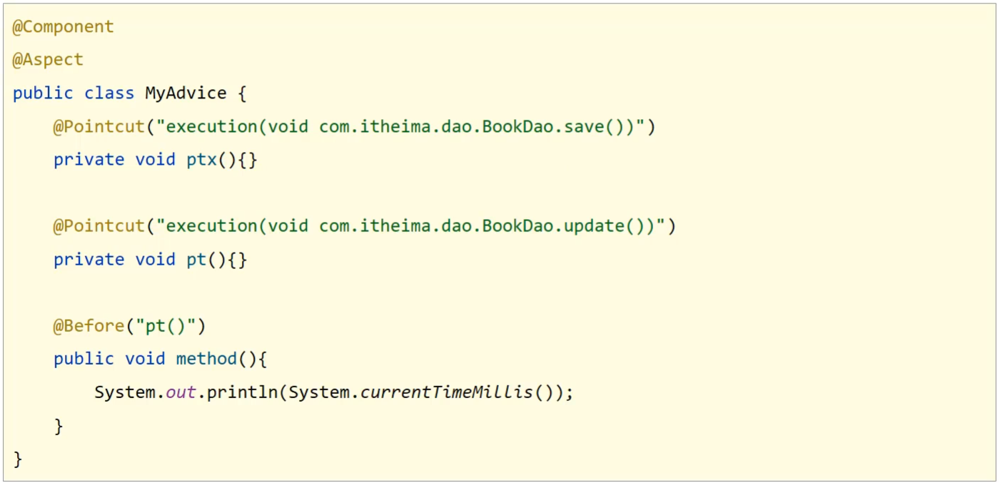

流程3，初始化bean，判定bean对应的类中的方法是否匹配到任意切入点

匹配失败，说明不需要增强，创建原始对象，如UserDao，直接调用原始对象的方法即可

匹配成功，说明需要对其进行增强，创建原始对象（目标对象）的代理对象，如BookDao，最终运行的是代理对象的方法，在该方法中会对原始方法进行功能增强

对哪个类做增强，这个类对应的对象就叫做目标对象

因为要对目标对象进行功能增强，而采用的技术是动态代理，所以会为其创建一个代理对象

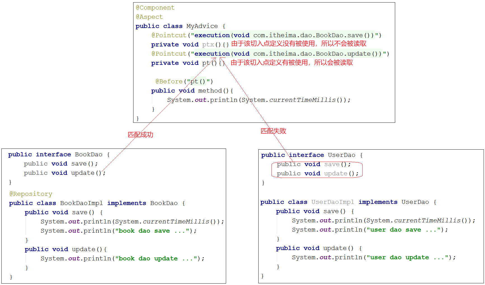

流程4，获取bean执行方法

获取的bean是原始对象时，调用方法并执行，完成操作

获取的bean是代理对象时，根据代理对象的运行模式运行原始方法与增强的内容，完成操作

**验证容器中是否为代理对象**

如果目标对象中的方法会被增强，那么容器中将存入的是目标对象的代理对象

如果目标对象中的方法不被增强，那么容器中将存入的是目标对象本身。

验证步骤：

（1）修改App类，获取类的类型

<table>
<colgroup>
<col style="width: 100%" />
</colgroup>
<tbody>
<tr class="odd">
<td>Java 
public class App { 
public static void main(String[] args) { 
ApplicationContext ctx = new AnnotationConfigApplicationContext(SpringConfig.class); 
BookDao bookDao = ctx.getBean(BookDao.class); 
System.out.println(bookDao); 
System.out.println(bookDao.getClass()); 
} 
}</td>
</tr>
</tbody>
</table>

（2）修改MyAdvice类，不增强

因为定义的切入点中被修改成update1，所以BookDao中的update方法在执行的时候不会被增强，容器中的对象应该是目标对象本身

<table>
<colgroup>
<col style="width: 100%" />
</colgroup>
<tbody>
<tr class="odd">
<td>Java 
@Component 
@Aspect 
public class MyAdvice { 
@Pointcut("execution(void com.itheima.dao.BookDao.update1())") 
private void pt(){} 
 
@Before("pt()") 
public void method(){ 
System.out.println(System.currentTimeMillis()); 
} 
}</td>
</tr>
</tbody>
</table>

（3）运行程序

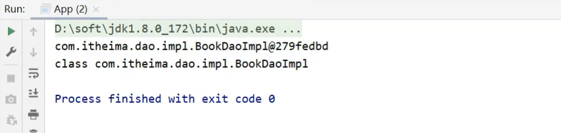

（4）修改MyAdvice类，增强

因为定义的切入点中被修改成update，所以BookDao中的update方法在执行的时候会被增强，容器中的对象应该是目标对象的代理对象

<table>
<colgroup>
<col style="width: 100%" />
</colgroup>
<tbody>
<tr class="odd">
<td>Java 
@Component 
@Aspect 
public class MyAdvice { 
@Pointcut("execution(void com.itheima.dao.BookDao.update())") 
private void pt(){} 
 
@Before("pt()") 
public void method(){ 
System.out.println(System.currentTimeMillis()); 
} 
}</td>
</tr>
</tbody>
</table>

（5）运行程序

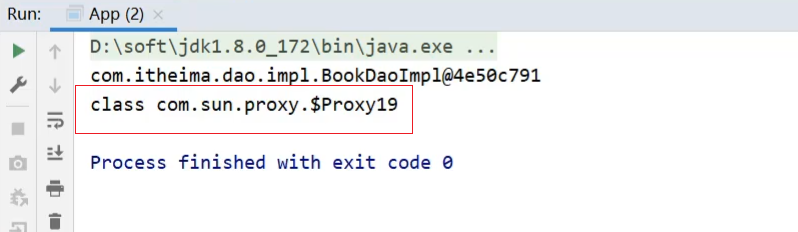

**11.3.2 AOP核心概念**

AOP的工作流程中提到了两个核心概念：

目标对象（Target）：原始功能去掉共性功能对应的类产生的对象，这种对象是无法直接完成最终工作的

代理（Proxy）：目标对象无法直接完成工作，需要对其进行功能回填，通过原始对象的代理对象实现

简单来说：

目标对象就是要增强的类（如BookServiceImpl类）对应的对象，也叫原始对象，不能说它不能运行，只能说它在运行的过程中对于要增强的内容是缺失的。

SpringAOP是在不改变原有设计(代码)的前提下对其进行增强的，它的底层采用的是代理模式实现的，所以要对原始对象进行增强，就需要对原始对象创建代理对象，在代理对象中的方法把通知（如MyAdvice中的method方法）内容加进去，就实现了增强，这就是我们所说的代理（Proxy）。

**11.4 AOP配置管理**

**11.4.1 AOP切入点表达式**

**语法格式**

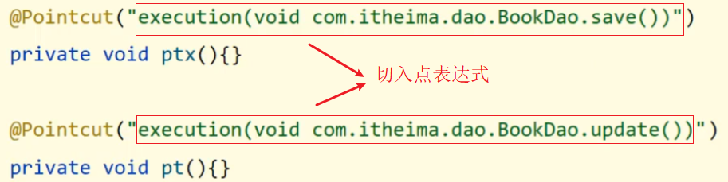

切入点：要进行增强的方法

切入点表达式：要进行增强的方法的描述方式

对于切入点的描述，因为调用接口方法的时候最终运行的还是其实现类的方法，所以以下两种描述方式都可以：

描述方式一：执行com.itheima.dao包下的BookDao接口中的无参数update方法

<table>
<colgroup>
<col style="width: 100%" />
</colgroup>
<tbody>
<tr class="odd">
<td>Java 
execution(void com.itheima.dao.BookDao.update())</td>
</tr>
</tbody>
</table>

描述方式二：执行com.itheima.dao.impl包下的BookDaoImpl类中的无参数update方法

<table>
<colgroup>
<col style="width: 100%" />
</colgroup>
<tbody>
<tr class="odd">
<td>Java 
execution(void com.itheima.dao.impl.BookDaoImpl.update())</td>
</tr>
</tbody>
</table>

切入点表达式的**语法**：

<table>
<colgroup>
<col style="width: 100%" />
</colgroup>
<tbody>
<tr class="odd">
<td>Java 
动作关键字(访问修饰符 返回值 包名.类/接口名.方法名(参数) 异常名）</td>
</tr>
</tbody>
</table>

例如，execution(public User com.itheima.service.UserService.findById(int))的详细含义如下：

execution：动作关键字，描述切入点的行为动作，例如execution表示执行到指定切入点

public：访问修饰符，还可以是public、private等，可以省略

User：返回值，写返回值类型

com.itheima.service：包名，多级包使用点连接

UserService：类/接口名称

findById：方法名

int：参数，直接写参数的类型，多个类型用逗号隔开

异常名：方法定义中抛出指定异常，可以省略

当然，如果每一个方法写一个切入点表达式，会比较麻烦，所以切入点表达式支持**通配符**，简化配置，常见的通配符如下：

\*：单个独立的任意符号，可以独立出现，也可以作为前缀或者后缀的匹配符出现

<table>
<colgroup>
<col style="width: 100%" />
</colgroup>
<tbody>
<tr class="odd">
<td>Java 
// 匹配com.itheima包下的任意包中的UserService类或接口中所有find开头的带有一个参数的方法 
execution(public * com.itheima.*.UserService.find*(*))</td>
</tr>
</tbody>
</table>

..：多个连续的任意符号，可以独立出现，常用于简化包名与参数的书写

<table>
<colgroup>
<col style="width: 100%" />
</colgroup>
<tbody>
<tr class="odd">
<td>Java 
// 匹配com包下的任意包中的UserService类或接口中所有名称为findById的方法 
execution（public User com..UserService.findById(..))</td>
</tr>
</tbody>
</table>

+：专用于匹配子类类型，很少会使用它

<table>
<colgroup>
<col style="width: 100%" />
</colgroup>
<tbody>
<tr class="odd">
<td>Java 
// *Service+ 表示所有以Service结尾的接口的子类 
execution(* *..*Service+.*(..))</td>
</tr>
</tbody>
</table>

**案例**

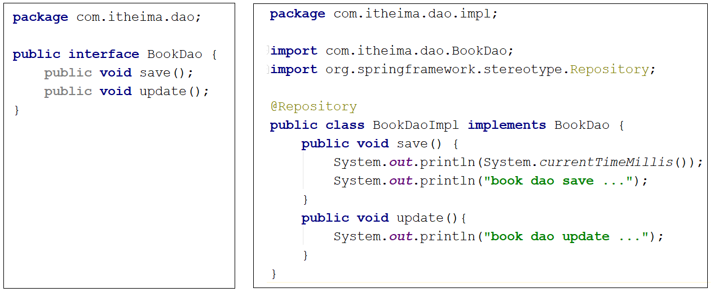

<table>
<colgroup>
<col style="width: 100%" />
</colgroup>
<tbody>
<tr class="odd">
<td>Java 
// 匹配接口，能匹配到 
execution(void com.itheima.dao.BookDao.update()) 
 
// 匹配接口，能匹配到匹配实现类，能匹配到 
execution(void com.itheima.dao.impl.BookDaoImpl.update()) 
 
// 匹配接口，能匹配到返回值任意，能匹配到 
execution(* com.itheima.dao.impl.BookDaoImpl.update()) 
 
// 匹配接口，能匹配到返回值任意，但是update方法必须要有一个参数，无法匹配，要想匹配需要在update接口和实现类添加参数 
execution(* com.itheima.dao.impl.BookDaoImpl.update(*)) 
 
// 匹配接口，能匹配到返回值为void,com包下的任意包三层包下的任意类的update方法，匹配到的是实现类，能匹配 
execution(void com.*.*.*.*.update()) 
 
// 匹配接口，能匹配到返回值为void,com包下的任意两层包下的任意类的update方法，匹配到的是接口，能匹配 
execution(void com.*.*.*.update()) 
 
// 匹配接口，能匹配到返回值为void，方法名是update的任意包下的任意类，能匹配 
execution(void *..update()) 
 
// 匹配接口，能匹配到匹配项目中任意类的任意方法，能匹配，但是不建议使用这种方式，影响范围广 
execution(* *..*(..)) 
 
// 匹配接口，能匹配到匹配项目中任意包任意类下只要以u开头的方法，update方法能满足，能匹配 
execution(* *..u*(..)) 
 
// 匹配接口，能匹配到匹配项目中任意包任意类下只要以e结尾的方法，update和save方法能满足，能匹配 
execution(* *..*e(..)) 
 
// 匹配接口，能匹配到返回值为void，com包下的任意包任意类任意方法，能匹配，*代表的是方法 
execution(void com..*()) 
 
// 匹配接口，能匹配到将项目中所有业务层方法的以find开头的方法匹配 
execution(* com.itheima.*.*Service.find*(..)) 
 
// 匹配接口，能匹配到将项目中所有业务层方法的以save开头的方法匹配 
execution(* com.itheima.*.*Service.save*(..))</td>
</tr>
</tbody>
</table>

**书写技巧**

所有代码按照标准规范开发，否则以下技巧全部失效：

描述切入点通**常描述接口**，而不描述实现类，如果描述到实现类，就出现紧耦合了

访问控制修饰符针对接口开发均采用public描述（**可省略访问控制修饰符描述**）

返回值类型对于增删改类使用精准类型加速匹配，对于查询类使用\*通配快速描述

**包名**书写**尽量不使用..匹配**，效率过低，常用\*做单个包描述匹配，或精准匹配

**接口名/类名**书写名称与模块相关的**采用\*匹配**，例如UserService书写成\*Service，绑定业务层接口名

**方法名**书写以**动词**进行**精准匹配**，名词采用\*匹配，例如getById书写成getBy\*、selectAll书写成selectAll

参数规则较为复杂，根据业务方法灵活调整

通常**不使用异常**作为**匹配**规则

**11.4.2 AOP通知类型**

AOP通知描述了抽取的共性功能，根据共性功能抽取的位置不同，最终运行代码时要将其加入到合理的位置，Spring共提供了5种通知类型：

前置通知：追加功能到方法执行前，类似于在代码1或者代码2添加内容

后置通知：追加功能到方法执行后，不管方法执行的过程中有没有抛出异常都会执行，类似于在代码5添加内容

**环绕通知**：追加功能到方法执行的前后，是比较常用的方式，它可以实现其他四种通知类型的功能

返回后通知：追加功能到方法执行后，只有方法正常执行结束后才进行，类似于在代码3添加内容，如果方法执行抛出异常将不会被添加

抛出异常后通知：追加功能到方法抛出异常后，只有方法执行出异常才进行，类似于在代码4添加内容，只有方法抛出异常后才会被添加

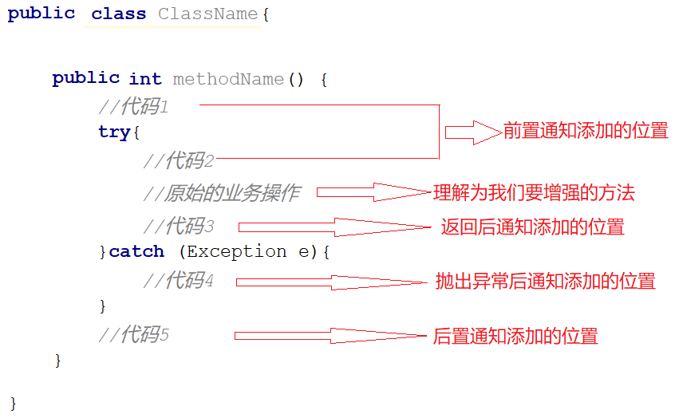

为了更好理解这5种通知类型，先来准备一个环境：

1、创建一个Maven项目，pom.xml添加Spring依赖

<table>
<colgroup>
<col style="width: 100%" />
</colgroup>
<tbody>
<tr class="odd">
<td>XML 
&lt;dependencies&gt; 
&lt;dependency&gt; 
&lt;groupId&gt;org.springframework&lt;/groupId&gt; 
&lt;artifactId&gt;spring-context&lt;/artifactId&gt; 
&lt;version&gt;5.2.10.RELEASE&lt;/version&gt; 
&lt;/dependency&gt; 
&lt;dependency&gt; 
&lt;groupId&gt;org.aspectj&lt;/groupId&gt; 
&lt;artifactId&gt;aspectjweaver&lt;/artifactId&gt; 
&lt;version&gt;1.9.4&lt;/version&gt; 
&lt;/dependency&gt; 
&lt;/dependencies&gt;</td>
</tr>
</tbody>
</table>

2、添加BookDao和BookDaoImpl类

<table>
<colgroup>
<col style="width: 100%" />
</colgroup>
<tbody>
<tr class="odd">
<td>Java 
public interface BookDao { 
public void update(); 
public int select(); 
} 
 
@Repository 
public class BookDaoImpl implements BookDao { 
public void update(){ 
System.out.println("book dao update ..."); 
} 
public int select() { 
System.out.println("book dao select is running ..."); 
return 100; 
} 
}</td>
</tr>
</tbody>
</table>

3、创建Spring的配置类

<table>
<colgroup>
<col style="width: 100%" />
</colgroup>
<tbody>
<tr class="odd">
<td>Java 
@Configuration 
@ComponentScan("com.itheima") 
@EnableAspectJAutoProxy 
public class SpringConfig { 
}</td>
</tr>
</tbody>
</table>

4、创建通知类

<table>
<colgroup>
<col style="width: 100%" />
</colgroup>
<tbody>
<tr class="odd">
<td>Java 
@Component 
@Aspect 
public class MyAdvice { 
@Pointcut("execution(void com.itheima.dao.BookDao.update())") 
private void pt(){} 
 
public void before() { 
System.out.println("before advice ..."); 
} 
 
public void after() { 
System.out.println("after advice ..."); 
} 
 
public void around(){ 
System.out.println("around before advice ..."); 
System.out.println("around after advice ..."); 
} 
 
public void afterReturning() { 
System.out.println("afterReturning advice ..."); 
} 
 
public void afterThrowing() { 
System.out.println("afterThrowing advice ..."); 
} 
}</td>
</tr>
</tbody>
</table>

5、编写App运行类

<table>
<colgroup>
<col style="width: 100%" />
</colgroup>
<tbody>
<tr class="odd">
<td>Java 
public class App { 
public static void main(String[] args) { 
ApplicationContext ctx = new AnnotationConfigApplicationContext(SpringConfig.class); 
BookDao bookDao = ctx.getBean(BookDao.class); 
bookDao.update(); 
} 
}</td>
</tr>
</tbody>
</table>

6、最终项目结构如下：

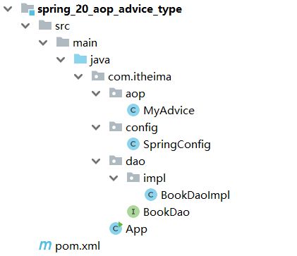

**前置通知**

修改MyAdvice，在before方法上添加@Before注解

<table>
<colgroup>
<col style="width: 100%" />
</colgroup>
<tbody>
<tr class="odd">
<td>Java 
@Component 
@Aspect 
public class MyAdvice { 
@Pointcut("execution(void com.itheima.dao.BookDao.update())") 
private void pt(){} 
 
@Before("pt()") 
//此处也可以写成 @Before("MyAdvice.pt()"),不建议 
public void before() { 
System.out.println("before advice ..."); 
} 
}</td>
</tr>
</tbody>
</table>

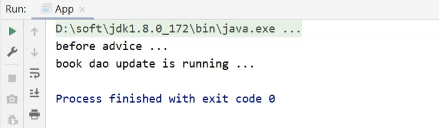

**后置通知**

<table>
<colgroup>
<col style="width: 100%" />
</colgroup>
<tbody>
<tr class="odd">
<td>Java 
@Component 
@Aspect 
public class MyAdvice { 
@Pointcut("execution(void com.itheima.dao.BookDao.update())") 
private void pt(){} 
 
@Before("pt()") 
public void before() { 
System.out.println("before advice ..."); 
} 
@After("pt()") 
public void after() { 
System.out.println("after advice ..."); 
} 
}</td>
</tr>
</tbody>
</table>

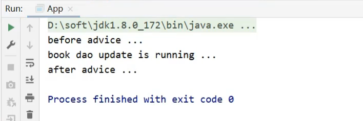

**环绕通知**

<table>
<colgroup>
<col style="width: 100%" />
</colgroup>
<tbody>
<tr class="odd">
<td>Java 
@Component 
@Aspect 
public class MyAdvice { 
@Pointcut("execution(void com.itheima.dao.BookDao.update())") 
private void pt(){} 
 
@Around("pt()") 
public void around(){ 
System.out.println("around before advice ..."); 
System.out.println("around after advice ..."); 
} 
}</td>
</tr>
</tbody>
</table>

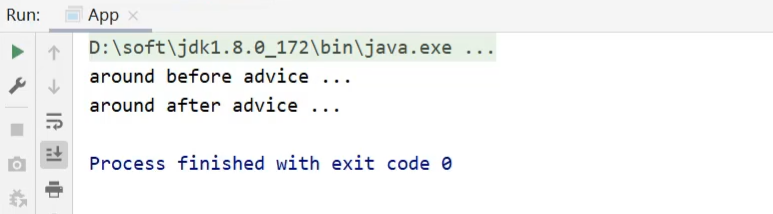

可以看到，原始方法的内容却没有被执行，要想执行原始方法，就必须对原始方法进行调用：

<table>
<colgroup>
<col style="width: 100%" />
</colgroup>
<tbody>
<tr class="odd">
<td>Java 
@Component 
@Aspect 
public class MyAdvice { 
@Pointcut("execution(void com.itheima.dao.BookDao.update())") 
private void pt(){} 
 
@Around("pt()") 
public void around(ProceedingJoinPoint pjp) throws Throwable{ 
System.out.println("around before advice ..."); 
pjp.proceed(); // 表示对原始操作的调用 
System.out.println("around after advice ..."); 
} 
}</td>
</tr>
</tbody>
</table>

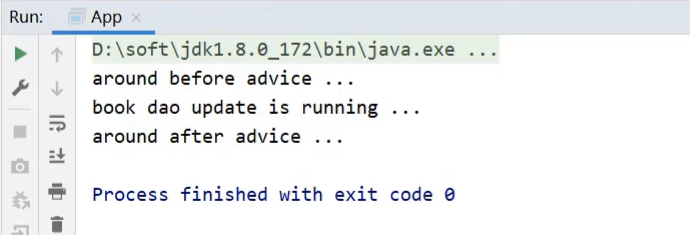

如果原始方法有返回值，就需要根据原始方法的返回值来设置环绕通知的返回值，具体解决方案为：

<table>
<colgroup>
<col style="width: 100%" />
</colgroup>
<tbody>
<tr class="odd">
<td>Java 
@Component 
@Aspect 
public class MyAdvice { 
@Pointcut("execution(void com.itheima.dao.BookDao.update())") 
private void pt(){} 
 
@Pointcut("execution(int com.itheima.dao.BookDao.select())") 
private void pt2(){} 
 
@Around("pt2()") 
public Object aroundSelect(ProceedingJoinPoint pjp) throws Throwable { 
System.out.println("around before advice ..."); 
// 表示对原始操作的调用，返回的是Object而不是原始方法返回值int类型的主要原因是Object类型更通用 
Object ret = pjp.proceed(); 
System.out.println("around after advice ..."); 
return ret; // 通知方法的返回值就是原来方法的返回值 
} 
}</td>
</tr>
</tbody>
</table>

**返回后通知**

<table>
<colgroup>
<col style="width: 100%" />
</colgroup>
<tbody>
<tr class="odd">
<td>Java 
@Component 
@Aspect 
public class MyAdvice { 
@Pointcut("execution(void com.itheima.dao.BookDao.update())") 
private void pt(){} 
 
@Pointcut("execution(int com.itheima.dao.BookDao.select())") 
private void pt2(){} 
 
@AfterReturning("pt2()") 
public void afterReturning() { 
System.out.println("afterReturning advice ..."); 
} 
}</td>
</tr>
</tbody>
</table>

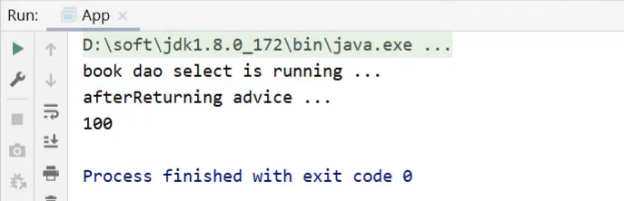

**注意：**返回后通知是需要在原始方法select正常执行后才会被执行，如果select()方法执行的过程中出现了异常，那么返回后通知是不会被执行。后置通知是不管原始方法有没有抛出异常都会被执行。

**异常后通知**

<table>
<colgroup>
<col style="width: 100%" />
</colgroup>
<tbody>
<tr class="odd">
<td>Java 
@Component 
@Aspect 
public class MyAdvice { 
@Pointcut("execution(void com.itheima.dao.BookDao.update())") 
private void pt(){} 
 
@Pointcut("execution(int com.itheima.dao.BookDao.select())") 
private void pt2(){} 
 
@AfterReturning("pt2()") 
public void afterThrowing() { 
System.out.println("afterThrowing advice ..."); 
} 
}</td>
</tr>
</tbody>
</table>

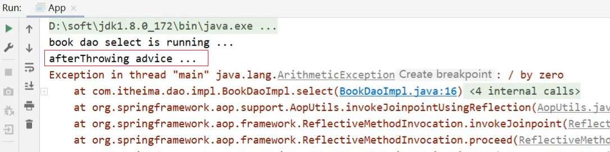

**注意：**异常后通知是需要原始方法抛出异常，可以在select()方法中添加一行代码int i = 1/0即可，如果没有抛异常，异常后通知将不会被执行。

因为环绕通知可以控制原始方法的执行，所以当把增强的代码写在调用原始方法的不同位置时就可以实现不同的通知类型的功能，如：

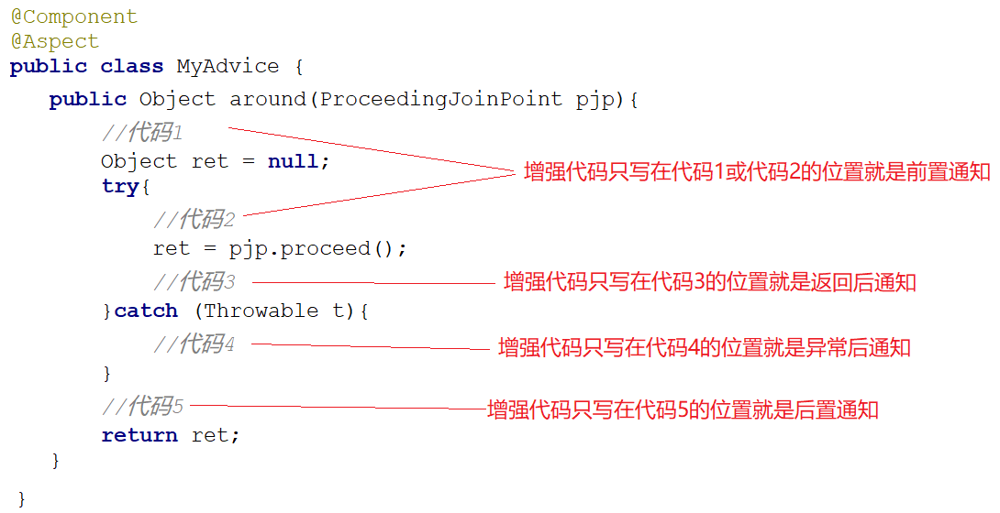

**@After**

|      |                                                                            |
|------|----------------------------------------------------------------------------|
| 名称 | @After                                                                     |
| 类型 | 方法注解                                                                   |
| 位置 | 通知方法定义上方                                                           |
| 作用 | 设置当前通知方法与切入点之间的绑定关系，当前通知方法在原始切入点方法后运行 |

**@AfterReturning**

|      |                                                                                      |
|------|--------------------------------------------------------------------------------------|
| 名称 | @AfterReturning                                                                      |
| 类型 | 方法注解                                                                             |
| 位置 | 通知方法定义上方                                                                     |
| 作用 | 设置当前通知方法与切入点之间绑定关系，当前通知方法在原始切入点方法正常执行完毕后执行 |

**@AfterThrowing**

|      |                                                                                      |
|------|--------------------------------------------------------------------------------------|
| 名称 | @AfterThrowing                                                                       |
| 类型 | 方法注解                                                                             |
| 位置 | 通知方法定义上方                                                                     |
| 作用 | 设置当前通知方法与切入点之间绑定关系，当前通知方法在原始切入点方法运行抛出异常后执行 |

**@Around**

|      |                                                                              |
|------|------------------------------------------------------------------------------|
| 名称 | @Around                                                                      |
| 类型 | 方法注解                                                                     |
| 位置 | 通知方法定义上方                                                             |
| 作用 | 设置当前通知方法与切入点之间的绑定关系，当前通知方法在原始切入点方法前后运行 |

**环绕通知注意事项：**

环绕通知必须依赖形参ProceedingJoinPoint才能实现对原始方法的调用，进而实现原始方法调用前后同时添加通知

通知中如果未使用ProceedingJoinPoint对原始方法进行调用将跳过原始方法的执行

对原始方法的调用可以不接收返回值，通知方法设置成void即可，如果接收返回值，最好设定为Object类型

原始方法的返回值如果是void类型，通知方法的返回值类型可以设置成void，也可以设置成Object

由于无法预知原始方法运行后是否会抛出异常，因此环绕通知方法必须要处理Throwable异常

**11.4.3 业务层接口执行效率**

接下来通过一个案例巩固AOP通知类型。

案例：任意业务层接口执行均可显示其执行效率（执行时长）。

说明：原始方法如果只执行一次，时间太快，两个时间差可能为0，所以要执行万次来计算时间差。

先准备一个环境：

1、创建一个Maven项目，pom.xml添加Spring依赖

<table>
<colgroup>
<col style="width: 100%" />
</colgroup>
<tbody>
<tr class="odd">
<td>XML 
&lt;dependencies&gt; 
&lt;dependency&gt; 
&lt;groupId&gt;org.springframework&lt;/groupId&gt; 
&lt;artifactId&gt;spring-context&lt;/artifactId&gt; 
&lt;version&gt;5.2.10.RELEASE&lt;/version&gt; 
&lt;/dependency&gt; 
&lt;dependency&gt; 
&lt;groupId&gt;org.springframework&lt;/groupId&gt; 
&lt;artifactId&gt;spring-jdbc&lt;/artifactId&gt; 
&lt;version&gt;5.2.10.RELEASE&lt;/version&gt; 
&lt;/dependency&gt; 
&lt;dependency&gt; 
&lt;groupId&gt;org.springframework&lt;/groupId&gt; 
&lt;artifactId&gt;spring-test&lt;/artifactId&gt; 
&lt;version&gt;5.2.10.RELEASE&lt;/version&gt; 
&lt;/dependency&gt; 
&lt;dependency&gt; 
&lt;groupId&gt;org.aspectj&lt;/groupId&gt; 
&lt;artifactId&gt;aspectjweaver&lt;/artifactId&gt; 
&lt;version&gt;1.9.4&lt;/version&gt; 
&lt;/dependency&gt; 
&lt;dependency&gt; 
&lt;groupId&gt;mysql&lt;/groupId&gt; 
&lt;artifactId&gt;mysql-connector-java&lt;/artifactId&gt; 
&lt;version&gt;5.1.47&lt;/version&gt; 
&lt;/dependency&gt; 
&lt;dependency&gt; 
&lt;groupId&gt;com.alibaba&lt;/groupId&gt; 
&lt;artifactId&gt;druid&lt;/artifactId&gt; 
&lt;version&gt;1.1.16&lt;/version&gt; 
&lt;/dependency&gt; 
&lt;dependency&gt; 
&lt;groupId&gt;org.mybatis&lt;/groupId&gt; 
&lt;artifactId&gt;mybatis&lt;/artifactId&gt; 
&lt;version&gt;3.5.6&lt;/version&gt; 
&lt;/dependency&gt; 
&lt;dependency&gt; 
&lt;groupId&gt;org.mybatis&lt;/groupId&gt; 
&lt;artifactId&gt;mybatis-spring&lt;/artifactId&gt; 
&lt;version&gt;1.3.0&lt;/version&gt; 
&lt;/dependency&gt; 
&lt;dependency&gt; 
&lt;groupId&gt;junit&lt;/groupId&gt; 
&lt;artifactId&gt;junit&lt;/artifactId&gt; 
&lt;version&gt;4.12&lt;/version&gt; 
&lt;scope&gt;test&lt;/scope&gt; 
&lt;/dependency&gt; 
&lt;/dependencies&gt;</td>
</tr>
</tbody>
</table>

2、添加AccountService、AccountServiceImpl、AccountDao与Account类

<table>
<colgroup>
<col style="width: 100%" />
</colgroup>
<tbody>
<tr class="odd">
<td>Java 
public interface AccountService { 
void save(Account account); 
void delete(Integer id); 
void update(Account account); 
List&lt;Account&gt; findAll(); 
Account findById(Integer id); 
} 
 
@Service 
public class AccountServiceImpl implements AccountService { 
 
@Autowired 
private AccountDao accountDao; 
 
public void save(Account account) { 
accountDao.save(account); 
} 
 
public void update(Account account){ 
accountDao.update(account); 
} 
 
public void delete(Integer id) { 
accountDao.delete(id); 
} 
 
public Account findById(Integer id) { 
return accountDao.findById(id); 
} 
 
public List&lt;Account&gt; findAll() { 
return accountDao.findAll(); 
} 
} 
public interface AccountDao { 
 
@Insert("insert into tbl_account(name,money)values(#{name},#{money})") 
void save(Account account); 
 
@Delete("delete from tbl_account where id = #{id} ") 
void delete(Integer id); 
 
@Update("update tbl_account set name = #{name} , money = #{money} where id = #{id} ") 
void update(Account account); 
 
@Select("select * from tbl_account") 
List&lt;Account&gt; findAll(); 
 
@Select("select * from tbl_account where id = #{id} ") 
Account findById(Integer id); 
} 
 
public class Account implements Serializable { 
 
private Integer id; 
private String name; 
private Double money; 
//setter..getter..toString方法省略 
}</td>
</tr>
</tbody>
</table>

3、resources下提供一个jdbc.properties

<table>
<colgroup>
<col style="width: 100%" />
</colgroup>
<tbody>
<tr class="odd">
<td>Plaintext 
jdbc.driver=com.mysql.jdbc.Driver 
jdbc.url=jdbc:mysql://localhost:3306/spring_db?useSSL=false 
jdbc.username=root 
jdbc.password=root</td>
</tr>
</tbody>
</table>

4、创建相关配置类

<table>
<colgroup>
<col style="width: 100%" />
</colgroup>
<tbody>
<tr class="odd">
<td>Java 
// Spring配置类：SpringConfig 
@Configuration 
@ComponentScan("com.itheima") 
@PropertySource("classpath:jdbc.properties") 
@Import({JdbcConfig.class,MybatisConfig.class}) 
public class SpringConfig { 
} 
 
// JdbcConfig配置类 
public class JdbcConfig { 
@Value("${jdbc.driver}") 
private String driver; 
@Value("${jdbc.url}") 
private String url; 
@Value("${jdbc.username}") 
private String userName; 
@Value("${jdbc.password}") 
private String password; 
 
@Bean 
public DataSource dataSource(){ 
DruidDataSource ds = new DruidDataSource(); 
ds.setDriverClassName(driver); 
ds.setUrl(url); 
ds.setUsername(userName); 
ds.setPassword(password); 
return ds; 
} 
} 
 
// MybatisConfig配置类 
public class MybatisConfig { 
@Bean 
public SqlSessionFactoryBean sqlSessionFactory(DataSource dataSource){ 
SqlSessionFactoryBean ssfb = new SqlSessionFactoryBean(); 
ssfb.setTypeAliasesPackage("com.itheima.domain"); 
ssfb.setDataSource(dataSource); 
return ssfb; 
} 
 
@Bean 
public MapperScannerConfigurer mapperScannerConfigurer(){ 
MapperScannerConfigurer msc = new MapperScannerConfigurer(); 
msc.setBasePackage("com.itheima.dao"); 
return msc; 
} 
}</td>
</tr>
</tbody>
</table>

5、编写Spring整合Junit的测试类

<table>
<colgroup>
<col style="width: 100%" />
</colgroup>
<tbody>
<tr class="odd">
<td>Java 
@RunWith(SpringJUnit4ClassRunner.class) 
@ContextConfiguration(classes = SpringConfig.class) 
public class AccountServiceTestCase { 
@Autowired 
private AccountService accountService; 
 
@Test 
public void testFindById(){ 
Account ac = accountService.findById(2); 
} 
 
@Test 
public void testFindAll(){ 
List&lt;Account&gt; all = accountService.findAll(); 
} 
}</td>
</tr>
</tbody>
</table>

6、最终项目结构如下：

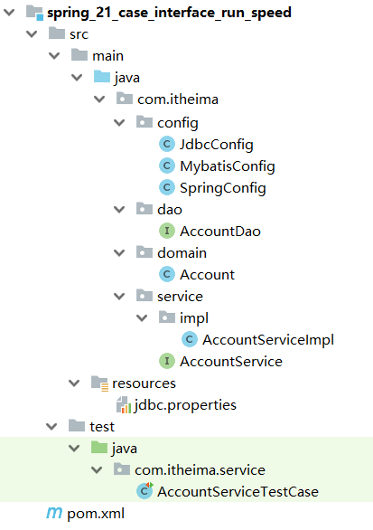

**功能开发**

（1）开启SpringAOP的注解功能，在Spring的主配置文件SpringConfig类中添加注解

<table>
<colgroup>
<col style="width: 100%" />
</colgroup>
<tbody>
<tr class="odd">
<td>Java 
@EnableAspectJAutoProxy</td>
</tr>
</tbody>
</table>

（2）创建AOP的通知类

该类要被Spring管理，需要添加@Component

要标识该类是一个AOP的切面类，需要添加@Aspect

配置切入点表达式，需要添加一个方法，并添加@Pointcut

<table>
<colgroup>
<col style="width: 100%" />
</colgroup>
<tbody>
<tr class="odd">
<td>Java 
@Component 
@Aspect 
public class ProjectAdvice { 
// 配置业务层的所有方法 
@Pointcut("execution(* com.itheima.service.*Service.*(..))") 
private void servicePt(){} 
 
public void runSpeed(){ 
 
} 
}</td>
</tr>
</tbody>
</table>

（3）添加环绕通知，在runSpeed()方法上添加@Around

<table>
<colgroup>
<col style="width: 100%" />
</colgroup>
<tbody>
<tr class="odd">
<td>Java 
@Component 
@Aspect 
public class ProjectAdvice { 
//配置业务层的所有方法 
@Pointcut("execution(* com.itheima.service.*Service.*(..))") 
private void servicePt(){} 
//@Around("ProjectAdvice.servicePt()") 可以简写为下面的方式 
@Around("servicePt()") 
public Object runSpeed(ProceedingJoinPoint pjp){ 
Object ret = pjp.proceed(); 
return ret; 
} 
}</td>
</tr>
</tbody>
</table>

（4）完成核心业务，记录万次执行的时间

<table>
<colgroup>
<col style="width: 100%" />
</colgroup>
<tbody>
<tr class="odd">
<td>Java 
@Component 
@Aspect 
public class ProjectAdvice { 
// 配置业务层的所有方法 
@Pointcut("execution(* com.itheima.service.*Service.*(..))") 
private void servicePt(){} 
// @Around("ProjectAdvice.servicePt()") 可以简写为下面的方式 
@Around("servicePt()") 
public void runSpeed(ProceedingJoinPoint pjp){ 
 
long start = System.currentTimeMillis(); 
for (int i = 0; i &lt; 10000; i++) { 
pjp.proceed(); 
} 
long end = System.currentTimeMillis(); 
System.out.println("业务层接口万次执行时间: "+(end-start)+"ms"); 
} 
}</td>
</tr>
</tbody>
</table>

（5）运行单元测试类

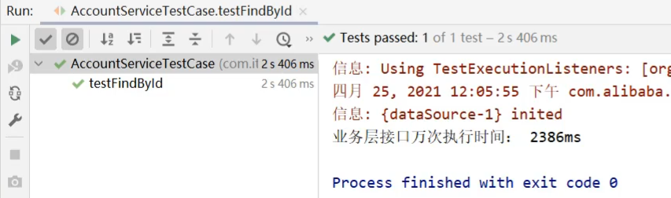

*因为程序每次执行的时长是不一样的，所以运行多次最终的结果是不一样的。*

（6）程序优化

多个方法一起执行测试时，控制台都打印的是业务层接口万次执行时间: XXXms，无法区分是哪个接口的哪个方法执行的具体时间。

<table>
<colgroup>
<col style="width: 100%" />
</colgroup>
<tbody>
<tr class="odd">
<td>Java 
@Component 
@Aspect 
public class ProjectAdvice { 
// 配置业务层的所有方法 
@Pointcut("execution(* com.itheima.service.*Service.*(..))") 
private void servicePt(){} 
// @Around("ProjectAdvice.servicePt()") 可以简写为下面的方式 
@Around("servicePt()") 
public void runSpeed(ProceedingJoinPoint pjp){ 
// 获取执行签名信息 
Signature signature = pjp.getSignature(); 
// 通过签名获取执行操作名称(接口名) 
String className = signature.getDeclaringTypeName(); 
// 通过签名获取执行操作名称(方法名) 
String methodName = signature.getName(); 
 
long start = System.currentTimeMillis(); 
for (int i = 0; i &lt; 10000; i++) { 
pjp.proceed(); 
} 
long end = System.currentTimeMillis(); 
System.out.println("万次执行：" + className + "." + methodName + "----&gt;" + (end-start) + "ms"); 
} 
}</td>
</tr>
</tbody>
</table>

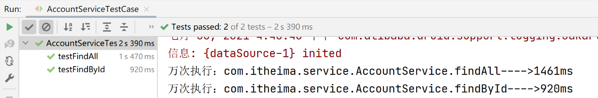

**11.4.4 AOP通知获取数据**

AOP通知获取数据主要是 获取参数、获取返回值、获取异常 这三个方面。

获取切入点方法的参数，所有的通知类型都可以获取参数

JoinPoint：适用于前置、后置、返回后、抛出异常后通知

ProceedingJoinPoint：适用于环绕通知

获取切入点方法返回值，前置和抛出异常后通知是没有返回值，后置通知可有可无，所以不做研究

返回后通知

环绕通知

获取切入点方法运行异常信息，前置和返回后通知是不会有，后置通知可有可无，所以不做研究

抛出异常后通知

环绕通知

要学习AOP通知获取数据，需要先准备一个环境：

1、创建一个Maven项目，pom.xml添加Spring依赖

<table>
<colgroup>
<col style="width: 100%" />
</colgroup>
<tbody>
<tr class="odd">
<td>XML 
&lt;dependencies&gt; 
&lt;dependency&gt; 
&lt;groupId&gt;org.springframework&lt;/groupId&gt; 
&lt;artifactId&gt;spring-context&lt;/artifactId&gt; 
&lt;version&gt;5.2.10.RELEASE&lt;/version&gt; 
&lt;/dependency&gt; 
&lt;dependency&gt; 
&lt;groupId&gt;org.aspectj&lt;/groupId&gt; 
&lt;artifactId&gt;aspectjweaver&lt;/artifactId&gt; 
&lt;version&gt;1.9.4&lt;/version&gt; 
&lt;/dependency&gt; 
&lt;/dependencies&gt;</td>
</tr>
</tbody>
</table>

2、添加BookDao和BookDaoImpl类

<table>
<colgroup>
<col style="width: 100%" />
</colgroup>
<tbody>
<tr class="odd">
<td>Java 
public interface BookDao { 
public String findName(int id); 
} 
@Repository 
public class BookDaoImpl implements BookDao { 
 
public String findName(int id) { 
System.out.println("id:"+id); 
return "itcast"; 
} 
}</td>
</tr>
</tbody>
</table>

3、创建Spring的配置类

<table>
<colgroup>
<col style="width: 100%" />
</colgroup>
<tbody>
<tr class="odd">
<td>Java 
@Configuration 
@ComponentScan("com.itheima") 
@EnableAspectJAutoProxy 
public class SpringConfig { 
}</td>
</tr>
</tbody>
</table>

4、编写通知类

<table>
<colgroup>
<col style="width: 100%" />
</colgroup>
<tbody>
<tr class="odd">
<td>Java 
@Component 
@Aspect 
public class MyAdvice { 
@Pointcut("execution(* com.itheima.dao.BookDao.findName(..))") 
private void pt(){} 
 
@Before("pt()") 
public void before() { 
System.out.println("before advice ..." ); 
} 
 
@After("pt()") 
public void after() { 
System.out.println("after advice ..."); 
} 
 
@Around("pt()") 
public Object around() throws Throwable{ 
Object ret = pjp.proceed(); 
return ret; 
} 
@AfterReturning("pt()") 
public void afterReturning() { 
System.out.println("afterReturning advice ..."); 
} 
 
 
@AfterThrowing("pt()") 
public void afterThrowing() { 
System.out.println("afterThrowing advice ..."); 
} 
}</td>
</tr>
</tbody>
</table>

5、编写App运行类

<table>
<colgroup>
<col style="width: 100%" />
</colgroup>
<tbody>
<tr class="odd">
<td>Java 
public class App { 
public static void main(String[] args) { 
ApplicationContext ctx = new AnnotationConfigApplicationContext(SpringConfig.class); 
BookDao bookDao = ctx.getBean(BookDao.class); 
String name = bookDao.findName(100); 
System.out.println(name); 
} 
}</td>
</tr>
</tbody>
</table>

6、最终项目结构如下：

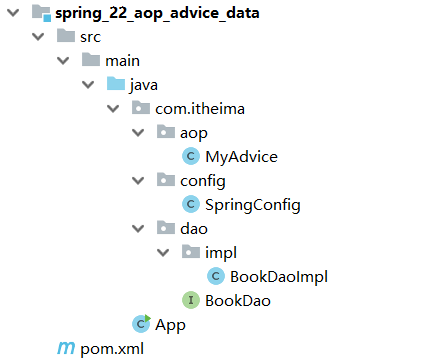

**11.4.4.1 获取参数**

**非环绕通知获取方式**

在方法上添加JoinPoint，通过JoinPoint来获取参数

<table>
<colgroup>
<col style="width: 100%" />
</colgroup>
<tbody>
<tr class="odd">
<td>Java 
@Component 
@Aspect 
public class MyAdvice { 
@Pointcut("execution(* com.itheima.dao.BookDao.findName(..))") 
private void pt(){} 
 
@Before("pt()") 
public void before(JoinPoint jp) 
Object[] args = jp.getArgs(); 
System.out.println(Arrays.toString(args)); 
System.out.println("before advice ..." ); 
} 
//...其他的略 
}</td>
</tr>
</tbody>
</table>

运行App类，可以获取如下内容，说明参数100已经被获取

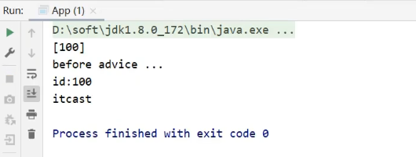

*由于并不能确定方法的参数到底有几个，所以这里获取的会是一个数组。*

**环绕通知获取方式**

环绕通知使用的是ProceedingJoinPoint，因为ProceedingJoinPoint是JoinPoint类的子类，所以对于ProceedingJoinPoint类中也会有对应的getArgs()方法。

<table>
<colgroup>
<col style="width: 100%" />
</colgroup>
<tbody>
<tr class="odd">
<td>Java 
@Component 
@Aspect 
public class MyAdvice { 
@Pointcut("execution(* com.itheima.dao.BookDao.findName(..))") 
private void pt(){} 
 
@Around("pt()") 
public Object around(ProceedingJoinPoint pjp)throws Throwable { 
Object[] args = pjp.getArgs(); 
System.out.println(Arrays.toString(args)); 
Object ret = pjp.proceed(); 
return ret; 
} 
//其他的略 
}</td>
</tr>
</tbody>
</table>

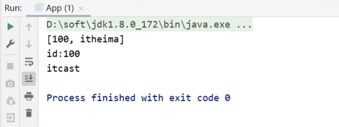

注意，pjp.proceed()方法有两个构造方法，分别是：

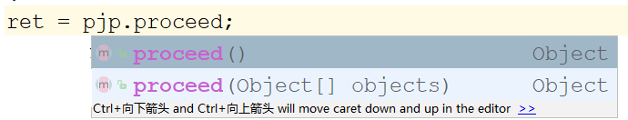

调用无参数的proceed，当原始方法有参数，会在调用的过程中自动传入参数，所以调用这两个方法的任意一个都可以完成功能，但是当需要修改原始方法的参数时，就只能采用带有参数的方法，如下所示。

<table>
<colgroup>
<col style="width: 100%" />
</colgroup>
<tbody>
<tr class="odd">
<td>Java 
@Component 
@Aspect 
public class MyAdvice { 
@Pointcut("execution(* com.itheima.dao.BookDao.findName(..))") 
private void pt(){} 
 
@Around("pt()") 
public Object around(ProceedingJoinPoint pjp) throws Throwable{ 
Object[] args = pjp.getArgs(); 
System.out.println(Arrays.toString(args)); 
args[0] = 666; 
Object ret = pjp.proceed(args); 
return ret; 
} 
//其他的略 
}</td>
</tr>
</tbody>
</table>

有了这个特性后，就可以在环绕通知中对原始方法的参数进行拦截过滤，避免由于参数的问题导致程序无法正确运行，保证代码的健壮性。

**11.4.4.2 获取返回值**

对于返回值，只有返回后AfterReturing和环绕Around这两个通知类型可以获取。

**环绕通知获取返回值**

<table>
<colgroup>
<col style="width: 100%" />
</colgroup>
<tbody>
<tr class="odd">
<td>Java 
@Component 
@Aspect 
public class MyAdvice { 
@Pointcut("execution(* com.itheima.dao.BookDao.findName(..))") 
private void pt(){} 
 
@Around("pt()") 
public Object around(ProceedingJoinPoint pjp) throws Throwable{ 
Object[] args = pjp.getArgs(); 
System.out.println(Arrays.toString(args)); 
args[0] = 666; 
Object ret = pjp.proceed(args); 
return ret; 
} 
//其他的略 
}</td>
</tr>
</tbody>
</table>

*ret就是方法的返回值，不仅可以直接获取，还可以进行修改。*

**返回后通知获取返回值**

<table>
<colgroup>
<col style="width: 100%" />
</colgroup>
<tbody>
<tr class="odd">
<td>Java 
@Component 
@Aspect 
public class MyAdvice { 
@Pointcut("execution(* com.itheima.dao.BookDao.findName(..))") 
private void pt(){} 
 
@AfterReturning(value = "pt()", returning = "ret") 
public void afterReturning(Object ret) { 
System.out.println("afterReturning advice ..."+ret); 
} 
//其他的略 
}</td>
</tr>
</tbody>
</table>

需要注意的是：

（1）参数名的问题

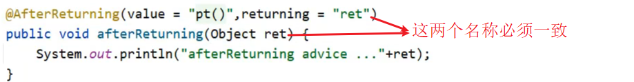

（2）afterReturning方法参数类型可以写成String，但是为了能匹配更多的参数类型，建议写成Object类型

（3）afterReturning方法参数的顺序问题

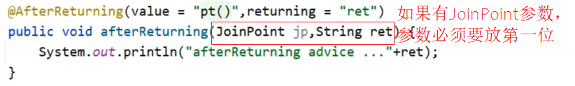

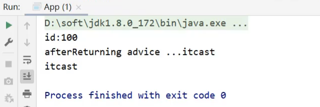

**11.4.4.3 获取异常**

对于获取抛出的异常，只有抛出异常后AfterThrowing和环绕Around这两个通知类型可以获取。

**环绕通知获取异常**

以前处理方式是抛出异常，现在只需要将异常捕获，就可以获取到原始方法的异常信息

<table>
<colgroup>
<col style="width: 100%" />
</colgroup>
<tbody>
<tr class="odd">
<td>Java 
@Component 
@Aspect 
public class MyAdvice { 
@Pointcut("execution(* com.itheima.dao.BookDao.findName(..))") 
private void pt(){} 
 
@Around("pt()") 
public Object around(ProceedingJoinPoint pjp) { 
Object[] args = pjp.getArgs(); 
System.out.println(Arrays.toString(args)); 
args[0] = 666; 
Object ret = null; 
try{ 
ret = pjp.proceed(args); 
}catch(Throwable throwable){ 
t.printStackTrace(); 
} 
return ret; 
} 
//其他的略 
}</td>
</tr>
</tbody>
</table>

**抛出异常后通知获取异常**

<table>
<colgroup>
<col style="width: 100%" />
</colgroup>
<tbody>
<tr class="odd">
<td>Java 
@Component 
@Aspect 
public class MyAdvice { 
@Pointcut("execution(* com.itheima.dao.BookDao.findName(..))") 
private void pt(){} 
 
@AfterThrowing(value = "pt()",throwing = "t") 
public void afterThrowing(Throwable t) { 
System.out.println("afterThrowing advice ..."+t); 
} 
//其他的略 
}</td>
</tr>
</tbody>
</table>

测试，让原始方法抛出异常：

<table>
<colgroup>
<col style="width: 100%" />
</colgroup>
<tbody>
<tr class="odd">
<td>Java 
@Repository 
public class BookDaoImpl implements BookDao { 
 
public String findName(int id,String password) { 
System.out.println("id:"+id); 
if(true){ 
throw new NullPointerException(); 
} 
return "itcast"; 
} 
}</td>
</tr>
</tbody>
</table>

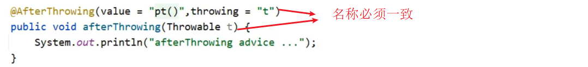

运行App后，查看控制台，就能看的异常信息被打印到控制台

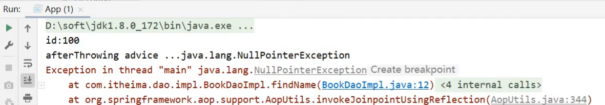

**11.4.5 百度网盘密码数据兼容处理**

当从别的地方复制提取码的时候，有时会多复制到一些空格，直接粘贴到百度的提取码输入框，如果不做处理，直接对比就会引发提取码不一致，这时就需要在业务方法执行之前对所有的输入参数进行格式处理，使用处理后的参数调用原始方法。

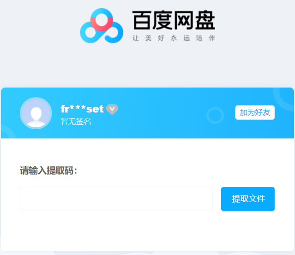

**环境准备**

1、创建一个Maven项目，pom.xml添加Spring依赖

<table>
<colgroup>
<col style="width: 100%" />
</colgroup>
<tbody>
<tr class="odd">
<td>XML 
&lt;dependencies&gt; 
&lt;dependency&gt; 
&lt;groupId&gt;org.springframework&lt;/groupId&gt; 
&lt;artifactId&gt;spring-context&lt;/artifactId&gt; 
&lt;version&gt;5.2.10.RELEASE&lt;/version&gt; 
&lt;/dependency&gt; 
&lt;dependency&gt; 
&lt;groupId&gt;org.aspectj&lt;/groupId&gt; 
&lt;artifactId&gt;aspectjweaver&lt;/artifactId&gt; 
&lt;version&gt;1.9.4&lt;/version&gt; 
&lt;/dependency&gt; 
&lt;/dependencies&gt;</td>
</tr>
</tbody>
</table>

2、添加ResourcesService，ResourcesServiceImpl,ResourcesDao和ResourcesDaoImpl类

<table>
<colgroup>
<col style="width: 100%" />
</colgroup>
<tbody>
<tr class="odd">
<td>Java 
public interface ResourcesDao { 
boolean readResources(String url, String password); 
} 
 
@Repository 
public class ResourcesDaoImpl implements ResourcesDao { 
public boolean readResources(String url, String password) { 
//模拟校验 
return password.equals("root"); 
} 
} 
 
public interface ResourcesService { 
public boolean openURL(String url ,String password); 
} 
 
@Service 
public class ResourcesServiceImpl implements ResourcesService { 
@Autowired 
private ResourcesDao resourcesDao; 
 
public boolean openURL(String url, String password) { 
return resourcesDao.readResources(url,password); 
} 
}</td>
</tr>
</tbody>
</table>

3、创建Spring的配置类

<table>
<colgroup>
<col style="width: 100%" />
</colgroup>
<tbody>
<tr class="odd">
<td>Java 
@Configuration 
@ComponentScan("com.itheima") 
public class SpringConfig { 
}</td>
</tr>
</tbody>
</table>

4、编写App运行类

<table>
<colgroup>
<col style="width: 100%" />
</colgroup>
<tbody>
<tr class="odd">
<td>Java 
public class App { 
public static void main(String[] args) { 
ApplicationContext ctx = new AnnotationConfigApplicationContext(SpringConfig.class); 
ResourcesService resourcesService = ctx.getBean(ResourcesService.class); 
boolean flag = resourcesService.openURL("http://pan.baidu.com/haha", "root"); 
System.out.println(flag); 
} 
}</td>
</tr>
</tbody>
</table>

最终项目结构如下：

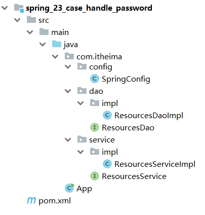

**具体实现**

（1）开启SpringAOP的注解功能

<table>
<colgroup>
<col style="width: 100%" />
</colgroup>
<tbody>
<tr class="odd">
<td>Java 
@Configuration 
@ComponentScan("com.itheima") 
@EnableAspectJAutoProxy 
public class SpringConfig { 
}</td>
</tr>
</tbody>
</table>

（2）编写通知类

<table>
<colgroup>
<col style="width: 100%" />
</colgroup>
<tbody>
<tr class="odd">
<td>Java 
@Component 
@Aspect 
public class DataAdvice { 
@Pointcut("execution(boolean com.itheima.service.*Service.*(*,*))") 
private void servicePt(){} 
 
}</td>
</tr>
</tbody>
</table>

（3）添加环绕通知

<table>
<colgroup>
<col style="width: 100%" />
</colgroup>
<tbody>
<tr class="odd">
<td>Java 
@Component 
@Aspect 
public class DataAdvice { 
@Pointcut("execution(boolean com.itheima.service.*Service.*(*,*))") 
private void servicePt(){} 
 
@Around("DataAdvice.servicePt()") 
// @Around("servicePt()")这两种写法都对 
public Object trimStr(ProceedingJoinPoint pjp) throws Throwable { 
Object ret = pjp.proceed(); 
return ret; 
} 
 
}</td>
</tr>
</tbody>
</table>

（4）完成核心业务，处理参数中的空格

<table>
<colgroup>
<col style="width: 100%" />
</colgroup>
<tbody>
<tr class="odd">
<td>Java 
@Component 
@Aspect 
public class DataAdvice { 
@Pointcut("execution(boolean com.itheima.service.*Service.*(*,*))") 
private void servicePt(){} 
 
@Around("DataAdvice.servicePt()") 
// @Around("servicePt()")这两种写法都对 
public Object trimStr(ProceedingJoinPoint pjp) throws Throwable { 
//获取原始方法的参数 
Object[] args = pjp.getArgs(); 
for (int i = 0; i &lt; args.length; i++) { 
//判断参数是不是字符串 
if(args[i].getClass().equals(String.class)){ 
args[i] = args[i].toString().trim(); 
} 
} 
//将修改后的参数传入到原始方法的执行中 
Object ret = pjp.proceed(args); 
return ret; 
} 
 
}</td>
</tr>
</tbody>
</table>

（5）运行程序

不管密码root前后是否加空格，最终控制台打印的都是true

（6）优化测试

为了能更好的看出AOP已经生效，我们可以修改ResourcesImpl类，在方法中将密码的长度进行打印

<table>
<colgroup>
<col style="width: 100%" />
</colgroup>
<tbody>
<tr class="odd">
<td>Java 
@Repository 
public class ResourcesDaoImpl implements ResourcesDao { 
public boolean readResources(String url, String password) { 
System.out.println(password.length()); 
//模拟校验 
return password.equals("root"); 
} 
}</td>
</tr>
</tbody>
</table>

再次运行成功，就可以根据最终打印的长度来看看，字符串的空格有没有被去除掉。

需要注意的是：

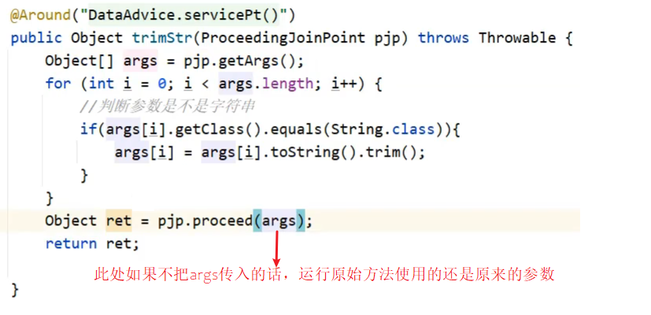

**11.5 AOP总结**

**11.5.1 AOP的核心概念**

概念：AOP（Aspect Oriented Programming）面向切面编程，一种编程范式

作用：在不惊动原始设计的基础上为方法进行功能**增强**

核心概念

代理（Proxy）：SpringAOP的核心本质是采用代理模式实现的

连接点（JoinPoint）：在SpringAOP中，理解为任意方法的执行

切入点（Pointcut）：匹配连接点的式子，也是具有共性功能的方法描述

通知（Advice）：若干个方法的共性功能，在切入点处执行，最终体现为一个方法

切面（Aspect）：描述通知与切入点的对应关系

目标对象（Target）：被代理的原始对象成为目标对象

**11.5.2 切入点表达式**

切入点表达式标准格式：动作关键字(访问修饰符 返回值 包名.类/接口名.方法名（参数）异常名)

<table>
<colgroup>
<col style="width: 100%" />
</colgroup>
<tbody>
<tr class="odd">
<td>Java 
execution(* com.itheima.service.*Service.*(..))</td>
</tr>
</tbody>
</table>

切入点表达式描述通配符：

作用：用于快速描述，范围描述

\*：匹配任意符号（常用）

.. ：匹配多个连续的任意符号（常用）

+：匹配子类类型

切入点表达式书写技巧

按**标准规范**开发

查询操作的返回值建议使用\*匹配

减少使用..的形式描述包

**对接口进行描述**，使用\*表示模块名，例如UserService的匹配描述为\*Service

方法名书写保留动词，例如 get ；使用\*表示名词，例如 getById 匹配描述为getBy\*

参数根据实际情况灵活调整

**11.5.3 五种通知类型**

前置通知

后置通知

环绕通知（重点）

环绕通知依赖形参ProceedingJoinPoint才能实现对原始方法的调用

环绕通知可以隔离原始方法的调用执行

环绕通知返回值设置为Object类型

环绕通知中可以对原始方法调用过程中出现的异常进行处理

返回后通知

抛出异常后通知

**11.5.4 通知中获取参数**

获取切入点方法的参数，所有的通知类型都可以获取参数

JoinPoint：适用于前置、后置、返回后、抛出异常后通知

ProceedingJoinPoint：适用于环绕通知

获取切入点方法返回值，前置和抛出异常后通知是没有返回值，后置通知可有可无，所以不做研究

返回后通知

环绕通知

获取切入点方法运行异常信息，前置和返回后通知是不会有，后置通知可有可无，所以不做研究

抛出异常后通知

环绕通知

**12.AOP事务管理**

**12.1 相关概念介绍**

事务在数据层保障了一系列的数据库操作同成功同失败。Spring事务在数据层或**业务层**保障了一系列的数据库操作同成功同失败。例如转账业务有两次数据层的调用，加钱和减钱，需要保证加钱和减钱同时成功或者同时失败，这时就需要将事务放在业务层进行处理。

Spring为了管理事务，提供了一个平台事务管理器PlatformTransactionManager：

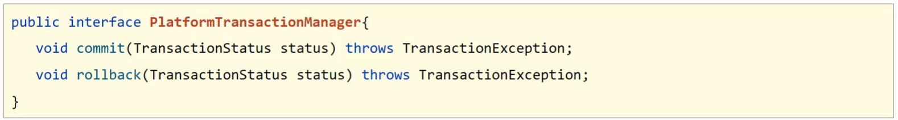

commit是用来提交事务，rollback是用来回滚事务。但是PlatformTransactionManager只是一个接口，Spring还为其提供了一个具体的实现：

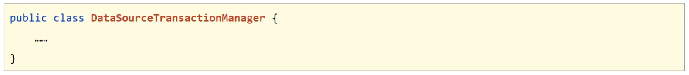

我们只需要给它一个DataSource对象，它就可以帮你去在业务层管理事务。其内部采用的是JDBC的事务，所以如果只要持久层采用的是JDBC相关的技术，就可以采用这个事务管理器来管理事务。而Mybatis内部采用的就是JDBC的事务，所以后期Spring整合Mybatis就采用的这个DataSourceTransactionManager事务管理器。

**12.2 事务管理**

**12.2.1 环境准备**

以实现任意两个账户间转账操作为例，转账分为 A账户减钱、B账户加钱 共两个操作。

（1）准备数据库表

<table>
<colgroup>
<col style="width: 100%" />
</colgroup>
<tbody>
<tr class="odd">
<td>SQL 
create database spring_db character set utf8; 
use spring_db; 
create table tbl_account( 
id int primary key auto_increment, 
name varchar(35), 
money double 
); 
insert into tbl_account values(1,'Tom',1000); 
insert into tbl_account values(2,'Jerry',1000);</td>
</tr>
</tbody>
</table>

（2）创建项目导入jar包

<table>
<colgroup>
<col style="width: 100%" />
</colgroup>
<tbody>
<tr class="odd">
<td>XML 
&lt;dependencies&gt; 
&lt;dependency&gt; 
&lt;groupId&gt;org.springframework&lt;/groupId&gt; 
&lt;artifactId&gt;spring-context&lt;/artifactId&gt; 
&lt;version&gt;5.2.10.RELEASE&lt;/version&gt; 
&lt;/dependency&gt; 
&lt;dependency&gt; 
&lt;groupId&gt;com.alibaba&lt;/groupId&gt; 
&lt;artifactId&gt;druid&lt;/artifactId&gt; 
&lt;version&gt;1.1.16&lt;/version&gt; 
&lt;/dependency&gt; 
 
&lt;dependency&gt; 
&lt;groupId&gt;org.mybatis&lt;/groupId&gt; 
&lt;artifactId&gt;mybatis&lt;/artifactId&gt; 
&lt;version&gt;3.5.6&lt;/version&gt; 
&lt;/dependency&gt; 
 
&lt;dependency&gt; 
&lt;groupId&gt;mysql&lt;/groupId&gt; 
&lt;artifactId&gt;mysql-connector-java&lt;/artifactId&gt; 
&lt;version&gt;5.1.47&lt;/version&gt; 
&lt;/dependency&gt; 
 
&lt;dependency&gt; 
&lt;groupId&gt;org.springframework&lt;/groupId&gt; 
&lt;artifactId&gt;spring-jdbc&lt;/artifactId&gt; 
&lt;version&gt;5.2.10.RELEASE&lt;/version&gt; 
&lt;/dependency&gt; 
 
&lt;dependency&gt; 
&lt;groupId&gt;org.mybatis&lt;/groupId&gt; 
&lt;artifactId&gt;mybatis-spring&lt;/artifactId&gt; 
&lt;version&gt;1.3.0&lt;/version&gt; 
&lt;/dependency&gt; 
 
&lt;dependency&gt; 
&lt;groupId&gt;junit&lt;/groupId&gt; 
&lt;artifactId&gt;junit&lt;/artifactId&gt; 
&lt;version&gt;4.12&lt;/version&gt; 
&lt;scope&gt;test&lt;/scope&gt; 
&lt;/dependency&gt; 
 
&lt;dependency&gt; 
&lt;groupId&gt;org.springframework&lt;/groupId&gt; 
&lt;artifactId&gt;spring-test&lt;/artifactId&gt; 
&lt;version&gt;5.2.10.RELEASE&lt;/version&gt; 
&lt;/dependency&gt; 
&lt;/dependencies&gt;</td>
</tr>
</tbody>
</table>

（3）根据表创建模型类

<table>
<colgroup>
<col style="width: 100%" />
</colgroup>
<tbody>
<tr class="odd">
<td>Java 
public class Account implements Serializable { 
private Integer id; 
private String name; 
private Double money; 
//setter...getter...toString...方法略 
}</td>
</tr>
</tbody>
</table>

（4）创建Dao接口

<table>
<colgroup>
<col style="width: 100%" />
</colgroup>
<tbody>
<tr class="odd">
<td>Java 
public interface AccountDao { 
@Update("update tbl_account set money = money + #{money} where name = #{name}") 
void inMoney(@Param("name") String name, @Param("money") Double money); 
 
@Update("update tbl_account set money = money - #{money} where name = #{name}") 
void outMoney(@Param("name") String name, @Param("money") Double money); 
}</td>
</tr>
</tbody>
</table>

（5）创建Service接口和实现类

<table>
<colgroup>
<col style="width: 100%" />
</colgroup>
<tbody>
<tr class="odd">
<td>Java 
public interface AccountService { 
/** 
* 转账操作 
* @param out 传出方 
* @param in 转入方 
* @param money 金额 
*/ 
public void transfer(String out,String in ,Double money) ; 
} 
 
@Service 
public class AccountServiceImpl implements AccountService { 
@Autowired 
private AccountDao accountDao; 
 
public void transfer(String out,String in ,Double money) { 
accountDao.outMoney(out,money); 
accountDao.inMoney(in,money); 
} 
}</td>
</tr>
</tbody>
</table>

（6）添加jdbc.properties文件

<table>
<colgroup>
<col style="width: 100%" />
</colgroup>
<tbody>
<tr class="odd">
<td>Properties 
jdbc.driver=com.mysql.jdbc.Driver 
jdbc.url=jdbc:mysql://localhost:3306/spring_db?useSSL=false 
jdbc.username=root 
jdbc.password=root</td>
</tr>
</tbody>
</table>

（7）创建JdbcConfig配置类

<table>
<colgroup>
<col style="width: 100%" />
</colgroup>
<tbody>
<tr class="odd">
<td>Java 
public class JdbcConfig { 
@Value("${jdbc.driver}") 
private String driver; 
@Value("${jdbc.url}") 
private String url; 
@Value("${jdbc.username}") 
private String userName; 
@Value("${jdbc.password}") 
private String password; 
 
@Bean 
public DataSource dataSource(){ 
DruidDataSource ds = new DruidDataSource(); 
ds.setDriverClassName(driver); 
ds.setUrl(url); 
ds.setUsername(userName); 
ds.setPassword(password); 
return ds; 
} 
}</td>
</tr>
</tbody>
</table>

（8）创建MybatisConfig配置类

<table>
<colgroup>
<col style="width: 100%" />
</colgroup>
<tbody>
<tr class="odd">
<td>Java 
public class MybatisConfig { 
@Bean 
public SqlSessionFactoryBean sqlSessionFactory(DataSource dataSource){ 
SqlSessionFactoryBean ssfb = new SqlSessionFactoryBean(); 
ssfb.setTypeAliasesPackage("com.itheima.domain"); 
ssfb.setDataSource(dataSource); 
return ssfb; 
} 
 
@Bean 
public MapperScannerConfigurer mapperScannerConfigurer(){ 
MapperScannerConfigurer msc = new MapperScannerConfigurer(); 
msc.setBasePackage("com.itheima.dao"); 
return msc; 
} 
}</td>
</tr>
</tbody>
</table>

（9）创建SpringConfig配置类

<table>
<colgroup>
<col style="width: 100%" />
</colgroup>
<tbody>
<tr class="odd">
<td>Java 
@Configuration 
@ComponentScan("com.itheima") 
@PropertySource("classpath:jdbc.properties") 
@Import({JdbcConfig.class,MybatisConfig.class}) 
public class SpringConfig { 
}</td>
</tr>
</tbody>
</table>

（10）编写测试类

<table>
<colgroup>
<col style="width: 100%" />
</colgroup>
<tbody>
<tr class="odd">
<td>Java 
@RunWith(SpringJUnit4ClassRunner.class) 
@ContextConfiguration(classes = SpringConfig.class) 
public class AccountServiceTest { 
@Autowired 
private AccountService accountService; 
 
@Test 
public void testTransfer() throws IOException { 
accountService.transfer("Tom","Jerry",100D); 
} 
}</td>
</tr>
</tbody>
</table>

最终项目结构如下：

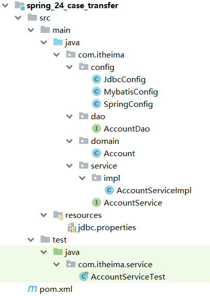

**12.2.2 事务管理**

上述环境，运行单元测试类会执行转账操作，Tom的账户会减少100，Jerry的账户会加100，但是如果在转账的过程中出现了异常，例如：

<table>
<colgroup>
<col style="width: 100%" />
</colgroup>
<tbody>
<tr class="odd">
<td>Java 
@Service 
public class AccountServiceImpl implements AccountService { 
@Autowired 
private AccountDao accountDao; 
 
public void transfer(String out,String in ,Double money) { 
accountDao.outMoney(out,money); 
int i = 1/0; 
accountDao.inMoney(in,money); 
} 
}</td>
</tr>
</tbody>
</table>

正确的操作应该是Tom还是900，Jerry还是1100，但运行后会发现Tom账户为800，而Jerry还是1100，100块钱凭空消失了，这是不允许出现的，原因是程序出现异常后，转账失败，但是异常之前操作成功，异常之后操作失败，整体业务失败。当程序出问题后，需要让事务进行回滚，而且这个事务应该是加在业务层上，而Spring的事务管理就是用来解决这类问题的，具体的实现步骤如下：

Spring事务管理具体的实现步骤为:

（1）在需要被事务管理的方法上添加注解

<table>
<colgroup>
<col style="width: 100%" />
</colgroup>
<tbody>
<tr class="odd">
<td>Java 
public interface AccountService { 
/** 
* 转账操作 
* @param out 传出方 
* @param in 转入方 
* @param money 金额 
*/ 
//配置当前接口方法具有事务 
public void transfer(String out,String in ,Double money) ; 
} 
 
@Service 
public class AccountServiceImpl implements AccountService { 
@Autowired 
private AccountDao accountDao; 
 
@Transactional 
public void transfer(String out, String in, Double money) { 
accountDao.outMoney(out,money); 
int i = 1/0; 
accountDao.inMoney(in,money); 
} 
 
}</td>
</tr>
</tbody>
</table>

@Transactional可以写在接口类上、接口方法上、实现类上和实现类方法上，建议写在实现类或实现类的方法上：

写在接口类上，该接口的所有实现类的所有方法都会有事务

写在接口方法上，该接口的所有实现类的该方法都会有事务

写在实现类上，该类中的所有方法都会有事务

写在实现类方法上，该方法上有事务

（2）在JdbcConfig类中配置事务管理器

<table>
<colgroup>
<col style="width: 100%" />
</colgroup>
<tbody>
<tr class="odd">
<td>Java 
public class JdbcConfig { 
@Value("${jdbc.driver}") 
private String driver; 
@Value("${jdbc.url}") 
private String url; 
@Value("${jdbc.username}") 
private String userName; 
@Value("${jdbc.password}") 
private String password; 
 
@Bean 
public DataSource dataSource(){ 
DruidDataSource ds = new DruidDataSource(); 
ds.setDriverClassName(driver); 
ds.setUrl(url); 
ds.setUsername(userName); 
ds.setPassword(password); 
return ds; 
} 
 
 
//配置事务管理器，mybatis使用的是jdbc事务 
@Bean 
public PlatformTransactionManager transactionManager(DataSource dataSource){ 
DataSourceTransactionManager transactionManager = new DataSourceTransactionManager(); 
transactionManager.setDataSource(dataSource); 
return transactionManager; 
} 
}</td>
</tr>
</tbody>
</table>

事务管理器要根据使用技术进行选择，Mybatis框架使用的是JDBC事务，可以直接使用DataSourceTransactionManager。

（3）开启事务注解

<table>
<colgroup>
<col style="width: 100%" />
</colgroup>
<tbody>
<tr class="odd">
<td>Java 
@Configuration 
@ComponentScan("com.itheima") 
@PropertySource("classpath:jdbc.properties") 
@Import({JdbcConfig.class,MybatisConfig.class 
// 开启注解式事务驱动 
@EnableTransactionManagement 
public class SpringConfig { 
}</td>
</tr>
</tbody>
</table>

（4）运行测试类

运行后发现在转换的业务出现错误后，事务就可以控制回滚，保证数据的一致性。

**@EnableTransactionManagement**

|      |                                        |
|------|----------------------------------------|
| 名称 | @EnableTransactionManagement           |
| 类型 | 配置类注解                             |
| 位置 | 配置类定义上方                         |
| 作用 | 设置当前Spring环境中开启注解式事务支持 |

**@Transactional**

|      |                                                                                  |
|------|----------------------------------------------------------------------------------|
| 名称 | @Transactional                                                                   |
| 类型 | 接口注解 类注解 方法注解                                                         |
| 位置 | 业务层接口上方 业务层实现类上方 业务方法上方                                     |
| 作用 | 为当前业务层方法添加事务（如果设置在类或接口上方则类或接口中所有方法均添加事务） |

**12.3 Spring事务角色**

未开启Spring事务之前：AccountDao的outMoney因为是修改操作，会开启一个事务T1；AccountDao的inMoney因为是修改操作，会开启一个事务T2；AccountService的transfer没有事务，运行过程中如果没有抛出异常，则T1和T2都正常提交，数据正确，如果在两个方法中间抛出异常，T1因为执行成功提交事务，T2因为抛异常不会被执行，就会导致数据出现错误。

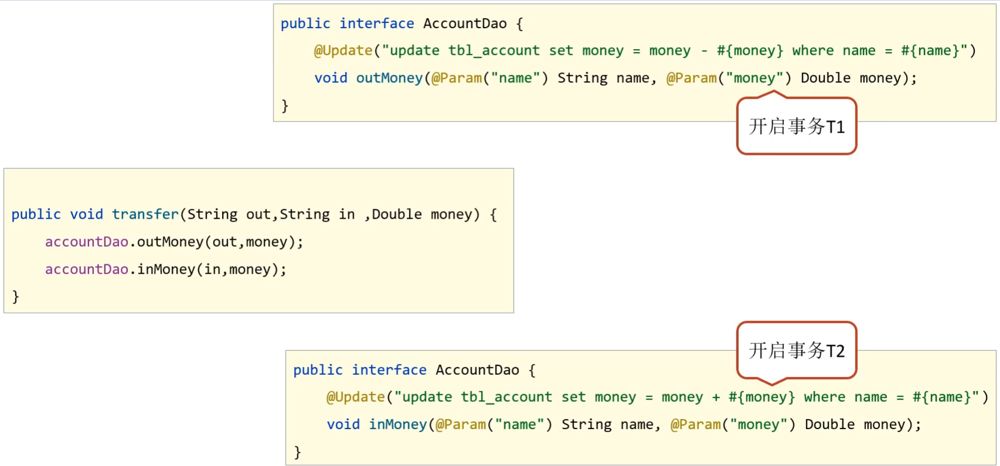

开启Spring的事务管理后：transfer上添加了@Transactional注解，在该方法上就会有一个事务T，AccountDao的outMoney方法的事务T1加入到transfer的事务T中，AccountDao的inMoney方法的事务T2加入到transfer的事务T中，这样就保证他们在同一个事务中，当业务层中出现异常，整个事务就会回滚，保证数据的准确性。

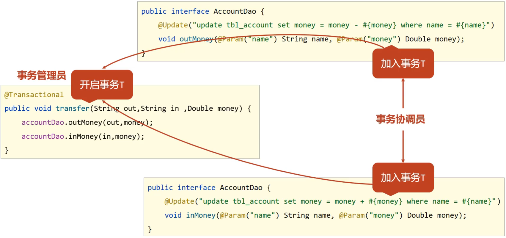

通过分析，得到下面两个概念：

事务管理员：发起事务方，在Spring中通常指代业务层开启事务的方法

事务协调员：加入事务方，在Spring中通常指代数据层方法，也可以是业务层方法

目前的事务管理是基于DataSourceTransactionManager和SqlSessionFactoryBean使用的是同一个数据源。

**12.4 Spring事务属性**

**12.4.1 事务配置**

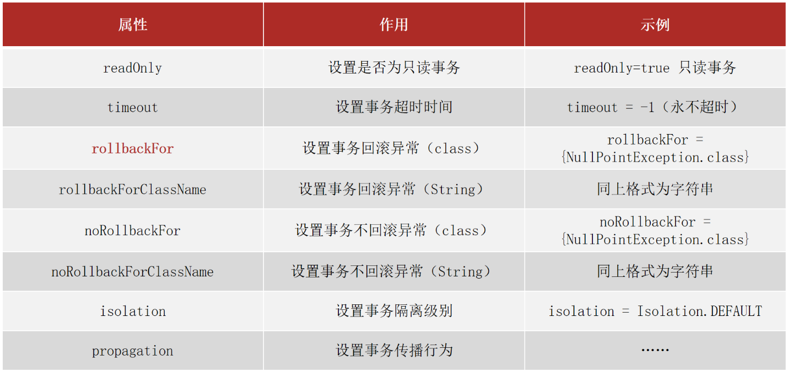

上面这些属性都可以在@Transactional注解的参数上进行设置。

readOnly：true只读事务，false读写事务，增删改要设为false，查询设为true。

timeout：设置超时时间单位秒，在多长时间之内事务没有提交成功就自动回滚，-1表示不设置超时时间。

rollbackFor：当出现指定异常进行事务回滚

noRollbackFor：当出现指定异常不进行事务回滚

rollbackForClassName：等同于rollbackFor，只不过属性为异常的类全名字符串

noRollbackForClassName：等同于noRollbackFor，只不过属性为异常的类全名字符串

isolation：设置事务的隔离级别

DEFAULT：默认隔离级别，会采用数据库的隔离级别

READ_UNCOMMITTED：读未提交

READ_COMMITTED：读已提交

REPEATABLE_READ：重复读取

SERIALIZABLE：串行化

默认并不是所有的异常都会回滚事务，比如下面的代码就不会回滚

<table>
<colgroup>
<col style="width: 100%" />
</colgroup>
<tbody>
<tr class="odd">
<td>Java 
public interface AccountService { 
/** 
* 转账操作 
* @param out 传出方 
* @param in 转入方 
* @param money 金额 
*/ 
//配置当前接口方法具有事务 
public void transfer(String out,String in ,Double money) throws IOException; 
} 
 
@Service 
public class AccountServiceImpl implements AccountService { 
@Autowired 
private AccountDao accountDao; 
 
@Transactional 
public void transfer(String out,String in ,Double money) throws IOException{ 
accountDao.outMoney(out,money); 
//int i = 1/0; //这个异常事务会回滚 
if(true){ 
throw new IOException(); //这个异常事务就不会回滚 
} 
accountDao.inMoney(in,money); 
} 
 
}</td>
</tr>
</tbody>
</table>

原因是Spring的事务只会对Error异常和RuntimeException异常及其子类进行事务回滚，其他的异常类型是不会回滚的，IOException不符合上述条件所以不回滚，此时就可以使用rollbackFor属性来设置出现IOException异常就回滚

<table>
<colgroup>
<col style="width: 100%" />
</colgroup>
<tbody>
<tr class="odd">
<td>Java 
@Service 
public class AccountServiceImpl implements AccountService { 
@Autowired 
private AccountDao accountDao; 
 
@Transactional(rollbackFor = {IOException.class}) 
public void transfer(String out,String in ,Double money) throws IOException{ 
accountDao.outMoney(out,money); 
//int i = 1/0; //这个异常事务会回滚 
if(true){ 
throw new IOException(); //这个异常事务就不会回滚 
} 
accountDao.inMoney(in,money); 
} 
 
}</td>
</tr>
</tbody>
</table>

**12.4.2 转账业务追加日志**

在前面的转案例的基础上，无论转账操作是否成功，均进行转账操作的日志留痕。

1、创建日志表

<table>
<colgroup>
<col style="width: 100%" />
</colgroup>
<tbody>
<tr class="odd">
<td>SQL 
create table tbl_log( 
id int primary key auto_increment, 
info varchar(255), 
createDate datetime 
)</td>
</tr>
</tbody>
</table>

2、添加LogDao接口

<table>
<colgroup>
<col style="width: 100%" />
</colgroup>
<tbody>
<tr class="odd">
<td>Java 
public interface LogDao { 
@Insert("insert into tbl_log (info,createDate) values(#{info},now())") 
void log(String info); 
}</td>
</tr>
</tbody>
</table>

3、添加LogService接口与实现类

<table>
<colgroup>
<col style="width: 100%" />
</colgroup>
<tbody>
<tr class="odd">
<td>Java 
public interface LogService { 
void log(String out, String in, Double money); 
} 
 
@Service 
public class LogServiceImpl implements LogService { 
@Autowired 
private LogDao logDao; 
@Transactional 
public void log(String out,String in,Double money ) { 
logDao.log("转账操作由"+out+"到"+in+",金额："+money); 
} 
}</td>
</tr>
</tbody>
</table>

4、在转账的业务中添加记录日志

<table>
<colgroup>
<col style="width: 100%" />
</colgroup>
<tbody>
<tr class="odd">
<td>Java 
public interface AccountService { 
/** 
* 转账操作 
* @param out 传出方 
* @param in 转入方 
* @param money 金额 
*/ 
// 配置当前接口方法具有事务 
public void transfer(String out,String in ,Double money)throws IOException ; 
} 
@Service 
public class AccountServiceImpl implements AccountService { 
@Autowired 
private AccountDao accountDao; 
@Autowired 
private LogService logService; 
@Transactional 
public void transfer(String out,String in ,Double money) { 
try{ 
accountDao.outMoney(out,money); 
accountDao.inMoney(in,money); 
}finally { 
logService.log(out,in,money); 
} 
} 
}</td>
</tr>
</tbody>
</table>

5、运行程序

当程序正常运行，tbl_account表中转账成功，tbl_log表中日志记录成功。但是，当转账业务之间出现异常(int i =1/0)，转账失败，tbl_account成功回滚，但是tbl_log表未添加数据，这是因为日志的记录与转账操作隶属同一个事务，同成功同失败，而期望的是无论转账操作是否成功，日志必须保留，这就需要用到事务传播行为。

**12.4.3 事务传播行为**

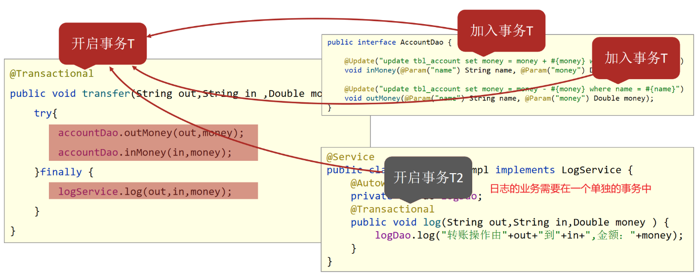

对于上述案例的分析：

log方法、inMoney方法和outMoney方法都属于增删改，分别有事务T1，T2，T3

transfer因为加了@Transactional注解，也开启了事务T

Spring事务会把T1，T2，T3都加入到事务T中

当转账失败后，所有的事务都回滚，导致日志没有记录下来

要想解决这个问题，就需要用到事务传播行为，所谓的事务传播行为指的是：事务协调员对事务管理员所携带事务的处理态度。

解决它需要用到propagation属性：

<table>
<colgroup>
<col style="width: 100%" />
</colgroup>
<tbody>
<tr class="odd">
<td>Java 
@Service 
public class LogServiceImpl implements LogService { 
@Autowired 
private LogDao logDao; 
 
// propagation设置事务属性：传播行为设置为当前操作需要新事务 
@Transactional(propagation = Propagation.REQUIRES_NEW) 
public void log(String out,String in,Double money ) { 
logDao.log("转账操作由"+out+"到"+in+",金额："+money); 
} 
}</td>
</tr>
</tbody>
</table>

运行后，不管转账是否成功，都会记录日志。

**事务传播行为的可选值**

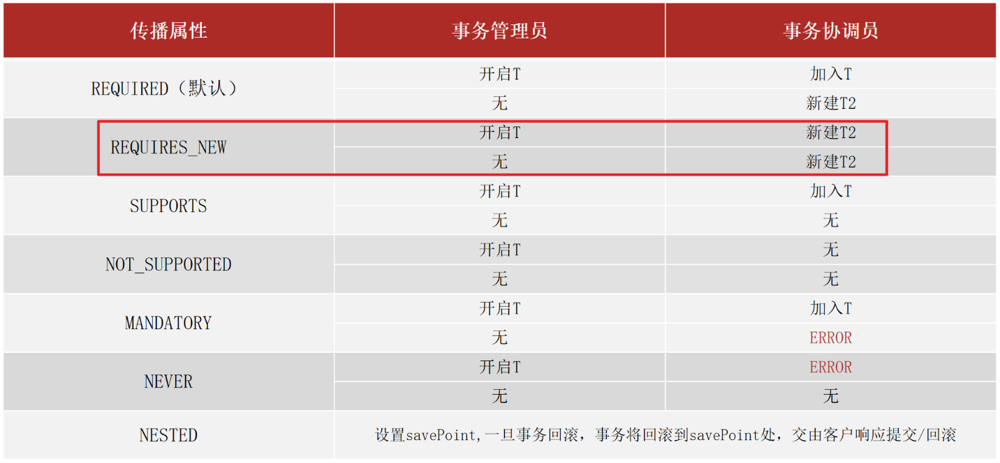

对于开发实际中使用的话，因为默认值需要事务是常态的，根据开发过程选择其他的就可以了， 例如案例中需要新事务就需要手工配置，其实入账和出账操作上也有事务，采用的就是默认值。

**SpringMVC**

**1.SpringMVC概述**

原始的web程序中，浏览器发送一个请求给后端服务器，后端服务器使用Servlet接收请求和数据，后端服务器将Servlet拆分成三层，分别是web、service、dao。web层主要由servlet处理，负责页面请求和数据的收集以及响应结果给前端，service层主要负责业务逻辑的处理，dao层主要负责数据的增删改查操作。但是，这种架构一个servlet只能处理一个请求，很不方便。

所以Spring针对web层进行优化，采用**MVC设计模式**，将其设计为controller、view和Model。controller负责请求和数据的接收，接收后将其转发给service进行业务处理，service根据需要调用dao对数据进行增删改查，dao把数据处理完后将结果交给service，service再交给controller，controller根据需求组装成Model和View，Model和View组合起来生成页面转发给前端浏览器。这样controller可以处理多个请求，并对请求进行分发，执行不同的业务操作。

随着互联网的发展，上面的模式因为是同步调用，性能慢慢的跟不上需求，所以异步调用慢慢的走到前台。异步调用中，后端不需要返回view视图，将其去除，前端如果通过异步调用的方式进行交互，后台就需要将返回的数据转换成JSON格式进行返回。**SpringMVC**就是处于Web层的框架，主要作用是接收前端发过来的请求和数据然后经过处理并将处理的结果转换成JSON响应给前端，所以如何处理请求和响应是SpringMVC中非常重要的一块内容。

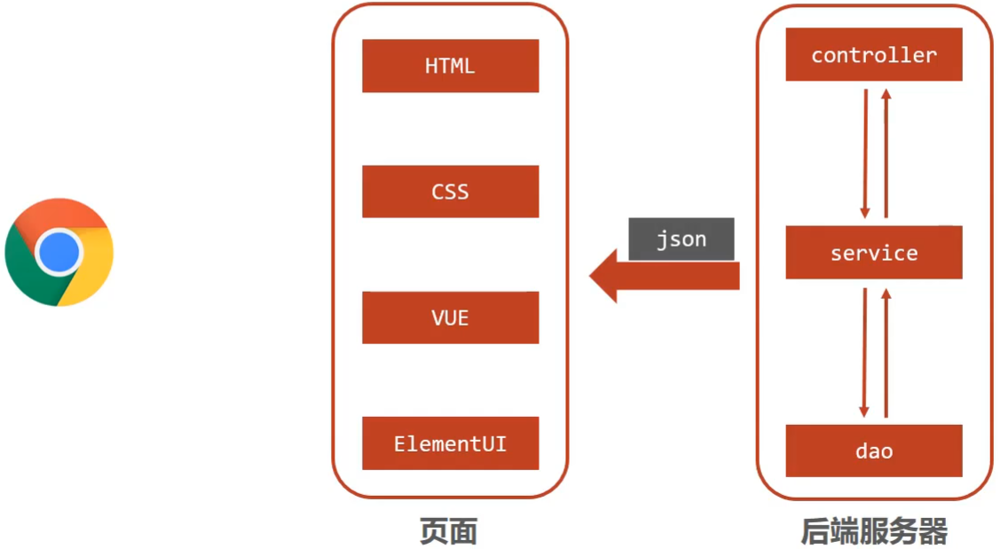

**2.SpringMVC入门案例**

**2.1 案例实现**

（1）创建Maven项目

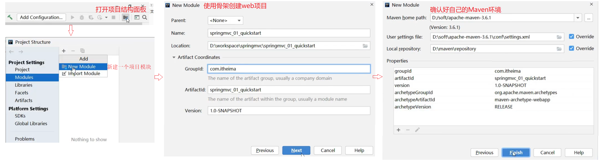

（2）补全目录结构

使用骨架创建的项目结构不完整，需要手动补全

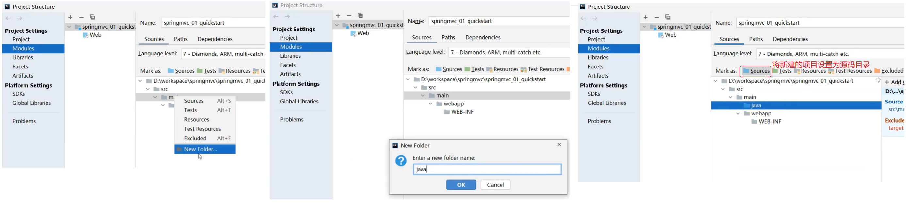

（3）导入jar包

将pom.xml中多余的内容删除掉，添加SpringMVC需要的依赖

<table>
<colgroup>
<col style="width: 100%" />
</colgroup>
<tbody>
<tr class="odd">
<td>XML 
&lt;?xml version="1.0" encoding="UTF-8"？&gt; 
&lt;project xmlns="http://maven.apache.org/POM/4.0.0" xmlns:xsi="http://www.w3.org/2001/XMLSchema-instance" 
xsi:schemaLocation="http://maven.apache.org/POM/4.0.0 http://maven.apache.org/xsd/maven-4.0.0.xsd"&gt; 
&lt;modelVersion&gt;4.0.0&lt;/modelVersion&gt; 
&lt;groupId&gt;com.itheima&lt;/groupId&gt; 
&lt;artifactId&gt;springmvc_01_quickstart&lt;/artifactId&gt; 
&lt;version&gt;1.0-SNAPSHOT&lt;/version&gt; 
&lt;packaging&gt;war&lt;/packaging&gt; 
 
&lt;dependencies&gt; 
&lt;dependency&gt; 
&lt;groupId&gt;javax.servlet&lt;/groupId&gt; 
&lt;artifactId&gt;javax.servlet-api&lt;/artifactId&gt; 
&lt;version&gt;3.1.0&lt;/version&gt; 
&lt;scope&gt;provided&lt;/scope&gt; 
&lt;/dependency&gt; 
&lt;dependency&gt; 
&lt;groupId&gt;org.springframework&lt;/groupId&gt; 
&lt;artifactId&gt;spring-webmvc&lt;/artifactId&gt; 
&lt;version&gt;5.2.10.RELEASE&lt;/version&gt; 
&lt;/dependency&gt; 
&lt;/dependencies&gt; 
 
&lt;build&gt; 
&lt;plugins&gt; 
&lt;plugin&gt; 
&lt;groupId&gt;org.apache.tomcat.maven&lt;/groupId&gt; 
&lt;artifactId&gt;tomcat7-maven-plugin&lt;/artifactId&gt; 
&lt;version&gt;2.1&lt;/version&gt; 
&lt;configuration&gt; 
&lt;port&gt;80&lt;/port&gt; 
&lt;path&gt;/&lt;/path&gt; 
&lt;/configuration&gt; 
&lt;/plugin&gt; 
&lt;/plugins&gt; 
&lt;/build&gt; 
&lt;/project&gt;</td>
</tr>
</tbody>
</table>

说明：servlet的坐标中，scope是maven中jar包依赖作用范围的描述，如果不设置默认是compile在在编译、运行、测试时均有效，如果运行有效的话就会和tomcat中的servlet-api包发生冲突，导致启动报错，provided代表的是该包只在编译和测试的时候用，运行的时候无效直接使用tomcat中的，就避免冲突。

（4）创建配置类

<table>
<colgroup>
<col style="width: 100%" />
</colgroup>
<tbody>
<tr class="odd">
<td>Java 
@Configuration 
@ComponentScan("com.itheima.controller") 
public class SpringMvcConfig { 
}</td>
</tr>
</tbody>
</table>

（5）创建Controller类

<table>
<colgroup>
<col style="width: 100%" />
</colgroup>
<tbody>
<tr class="odd">
<td>Java 
@Controller 
public class UserController { 
 
@RequestMapping("/save") 
public void save(){ 
System.out.println("user save ..."); 
} 
}</td>
</tr>
</tbody>
</table>

（6）使用配置类替换web.xml

将web.xml删除，换成ServletContainersInitConfig

<table>
<colgroup>
<col style="width: 100%" />
</colgroup>
<tbody>
<tr class="odd">
<td>Java 
public class ServletContainersInitConfig extends AbstractDispatcherServletInitializer { 
// 加载springmvc配置类 
protected WebApplicationContext createServletApplicationContext() { 
// 初始化WebApplicationContext对象 
AnnotationConfigWebApplicationContext ctx = new AnnotationConfigWebApplicationContext(); 
// 加载指定配置类 
ctx.register(SpringMvcConfig.class); 
return ctx; 
} 
 
// 设置由springmvc控制器处理的请求映射路径 
protected String[] getServletMappings() { 
return new String[]{"/"}; 
} 
 
// 加载spring配置类 
protected WebApplicationContext createRootApplicationContext() { 
return null; 
} 
}</td>
</tr>
</tbody>
</table>

（7）配置Tomcat环境

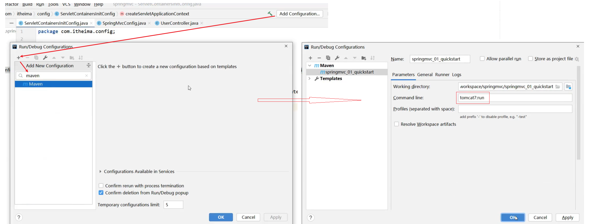

（8）启动运行项目

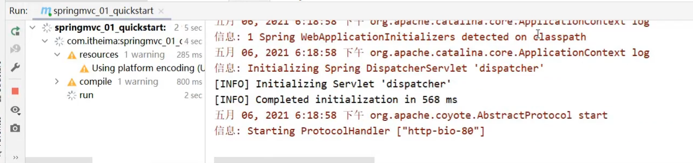

（9）浏览器访问

浏览器输入http://localhost/save进行访问，会报如下错误，原因是后台没有指定返回的页面，目前只需要关注控制台看user save ...有没有被执行即可

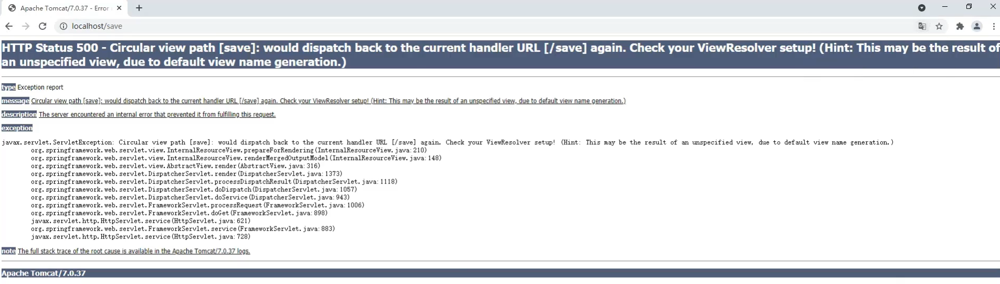

（10）修改Controller返回值解决上述问题

前面说过现在主要的是前端发送异步请求，后台响应json数据，所以接下来把Controller类的save方法进行修改

<table>
<colgroup>
<col style="width: 100%" />
</colgroup>
<tbody>
<tr class="odd">
<td>Java 
@Controller 
public class UserController { 
 
@RequestMapping("/save") 
public String save(){ 
System.out.println("user save ..."); 
return "{'info':'springmvc'}"; 
} 
}</td>
</tr>
</tbody>
</table>

再次重启tomcat服务器，然后重新通过浏览器测试访问，会发现还是会报错，这次的错是404

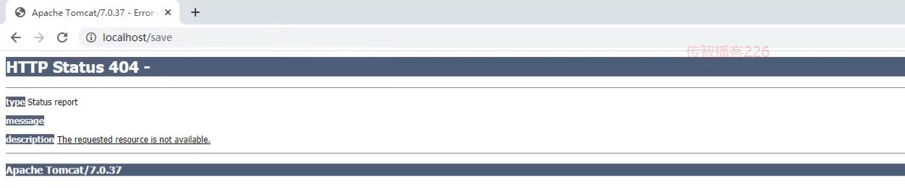

原因是，如果方法直接返回字符串，springMVC会把字符串当成页面的名称在项目中进行查找返回，因为不存在对应返回值名称的页面，所以会报404错误，找不到资源，而希望直接返回的是json数据。

（11）设置返回数据为json

<table>
<colgroup>
<col style="width: 100%" />
</colgroup>
<tbody>
<tr class="odd">
<td>Java 
@Controller 
public class UserController { 
 
@RequestMapping("/save") 
@ResponseBody 
public String save(){ 
System.out.println("user save ..."); 
return "{'info':'springmvc'}"; 
} 
}</td>
</tr>
</tbody>
</table>

再次重启tomcat服务器，然后重新通过浏览器测试访问，就能看到返回的结果数据

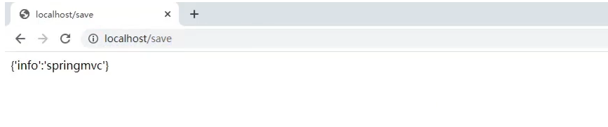

**注意事项**

SpringMVC是基于Spring的，在pom.xml只导入了spring-webmvc的原因是它会自动依赖spring相关坐标

AbstractDispatcherServletInitializer类是SpringMVC提供的快速初始化Web3.0容器的抽象类

AbstractDispatcherServletInitializer提供了三个接口方法供用户实现

createServletApplicationContext方法：创建Servlet容器时，加载SpringMVC对应的bean并放入WebApplicationContext对象范围中，而WebApplicationContext的作用范围为ServletContext范围，即整个web容器范围

getServletMappings方法：设定SpringMVC对应的请求映射路径，即SpringMVC拦截哪些请求

createRootApplicationContext方法：如果创建Servlet容器时需要加载非SpringMVC对应的bean，使用当前方法进行，使用方式和createServletApplicationContext相同

createServletApplicationContext用来加载SpringMVC环境

createRootApplicationContext用来加载Spring环境

**@Controller**

|      |                               |
|------|-------------------------------|
| 名称 | @Controller                   |
| 类型 | 类注解                        |
| 位置 | SpringMVC控制器类定义上方     |
| 作用 | 设定SpringMVC的核心控制器bean |

**@RequestMapping**

|          |                                 |
|----------|---------------------------------|
| 名称     | @RequestMapping                 |
| 类型     | 类注解或方法注解                |
| 位置     | SpringMVC控制器类或方法定义上方 |
| 作用     | 设置当前控制器方法请求访问路径  |
| 相关属性 | value(默认)，请求访问路径       |

**@ResponseBody**

|      |                                                  |
|------|--------------------------------------------------|
| 名称 | @ResponseBody                                    |
| 类型 | 类注解或方法注解                                 |
| 位置 | SpringMVC控制器类或方法定义上方                  |
| 作用 | 设置当前控制器方法响应内容为当前返回值，无需解析 |

**2.2 入门案例总结**

一次性工作

创建工程，设置服务器，加载工程

导入坐标

创建web容器启动类，加载SpringMVC配置，并设置SpringMVC请求拦截路径

SpringMVC核心配置类（设置配置类，扫描controller包，加载Controller控制器bean）

多次工作

定义处理请求的控制器类

定义处理请求的控制器方法，并配置映射路径（@RequestMapping）与返回json数据（@ResponseBody）

**2.3 工作流程解析**

为了更好地使用SpringMVC，将SpringMVC的使用过程分两个阶段分析，分别是 启动服务器初始化过程 和 单次请求过程。

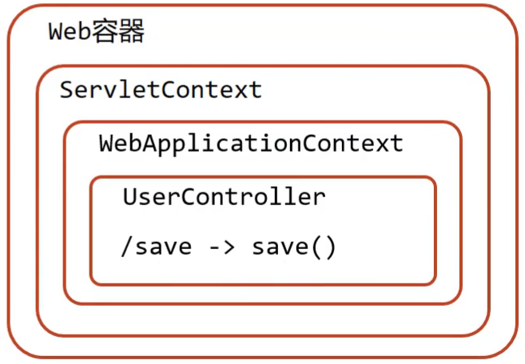

**启动服务器初始化过程**

服务器启动，执行ServletContainersInitConfig类，初始化web容器，功能类似于以前的web.xml

执行createServletApplicationContext方法，创建了WebApplicationContext对象，该方法加载SpringMVC的配置类SpringMvcConfig来初始化SpringMVC的容器

加载SpringMvcConfig配置类

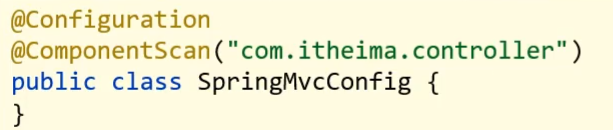

执行@ComponentScan，扫描指定包及其子包下所有类上的注解，如Controller类上的@Controller注解，加载对应的bean

加载UserController，每个@RequestMapping的名称对应一个具体的方法，例如下面就建立了 /save 和 save方法的对应关系

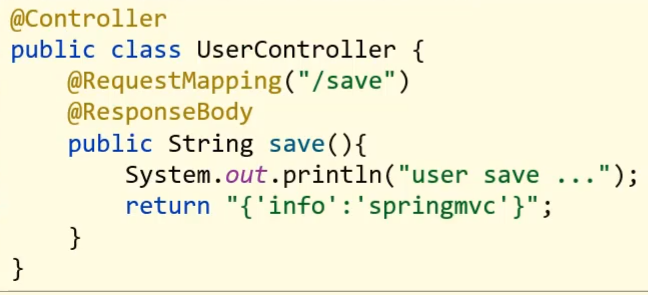

执行getServletMappings方法，设定SpringMVC拦截请求的路径规则，例如下面的/代表所拦截请求的路径规则，只有被拦截后才能交给SpringMVC来处理请求

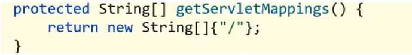

**单次请求过程**

发送请求http://localhost/save

web容器发现该请求满足SpringMVC拦截规则，将请求交给SpringMVC处理

解析请求路径/save

由/save匹配执行对应的方法save()

启动服务器初始化过程的第五步已经将请求路径和方法建立了对应关系，通过/save就能找到对应的save方法

执行save()

检测到有@ResponseBody直接将save()方法的返回值作为响应体返回给请求方

**2.4 bean加载控制**

**2.4.1 问题分析**

思考这里入门案例中的配置类SpringMvcConfig和学习Spring时创建的配置类SpringConfig分别需要加载哪些内容？

目前的项目结构：

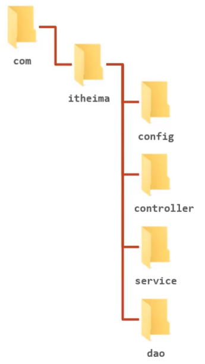

config目录放的是配置类：

ServletContainersInitConfig

SpringConfig

SpringMvcConfig

JdbcConfig

MybatisConfig

controller目录放的是SpringMVC的controller类

service目录放的是service接口和实现类

dao目录放的是dao/Mapper接口

controller、service和dao这些类都需要被容器管理成bean对象，那么到底是该让SpringMVC加载还是让Spring加载？

SpringMVC加载其相关bean（表现层bean），也就是controller包下的类

Spring控制业务bean（Service）和功能bean（DataSource、SqlSessionFactoryBean、MapperScannerConfigurer等）

分析清楚谁该管哪些bean以后，接下来要解决的问题是如何让Spring和SpringMVC分开加载各自的内容。

在SpringMVC的配置类SpringMvcConfig中使用注解@ComponentScan，只需要将其扫描范围设置到controller即可：

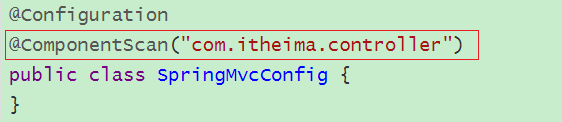

在Spring的配置类SpringConfig中使用注解@ComponentScan，当时扫描的范围中其实已经包含了controller：

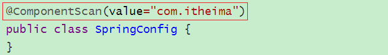

从包结构来看的话，Spring已经多把SpringMVC的controller类也给扫描到，所以接下来就是解决：因为功能不同，如何避免Spring错误加载到SpringMVC的bean？

解决方案也比较简单，就是加载Spring控制的bean的时候排除掉SpringMVC控制的bean，有三种排除方式：

方式一：Spring加载的bean设定扫描范围为精准范围，例如service包、dao包等

方式二：Spring加载的bean设定扫描范围为com.itheima，排除掉controller包中的bean

方式三：不区分Spring与SpringMVC的环境，加载到同一个环境中【了解即可】

**2.4.2 环境准备**

创建一个Web的Maven项目，pom.xml添加Spring依赖

<table>
<colgroup>
<col style="width: 100%" />
</colgroup>
<tbody>
<tr class="odd">
<td>XML 
&lt;?xml version="1.0" encoding="UTF-8"？&gt; 
 
&lt;project xmlns="http://maven.apache.org/POM/4.0.0" xmlns:xsi="http://www.w3.org/2001/XMLSchema-instance" 
xsi:schemaLocation="http://maven.apache.org/POM/4.0.0 http://maven.apache.org/xsd/maven-4.0.0.xsd"&gt; 
&lt;modelVersion&gt;4.0.0&lt;/modelVersion&gt; 
 
&lt;groupId&gt;com.itheima&lt;/groupId&gt; 
&lt;artifactId&gt;springmvc_02_bean_load&lt;/artifactId&gt; 
&lt;version&gt;1.0-SNAPSHOT&lt;/version&gt; 
&lt;packaging&gt;war&lt;/packaging&gt; 
 
&lt;dependencies&gt; 
&lt;dependency&gt; 
&lt;groupId&gt;javax.servlet&lt;/groupId&gt; 
&lt;artifactId&gt;javax.servlet-api&lt;/artifactId&gt; 
&lt;version&gt;3.1.0&lt;/version&gt; 
&lt;scope&gt;provided&lt;/scope&gt; 
&lt;/dependency&gt; 
&lt;dependency&gt; 
&lt;groupId&gt;org.springframework&lt;/groupId&gt; 
&lt;artifactId&gt;spring-webmvc&lt;/artifactId&gt; 
&lt;version&gt;5.2.10.RELEASE&lt;/version&gt; 
&lt;/dependency&gt; 
&lt;dependency&gt; 
&lt;groupId&gt;com.alibaba&lt;/groupId&gt; 
&lt;artifactId&gt;druid&lt;/artifactId&gt; 
&lt;version&gt;1.1.16&lt;/version&gt; 
&lt;/dependency&gt; 
 
&lt;dependency&gt; 
&lt;groupId&gt;org.mybatis&lt;/groupId&gt; 
&lt;artifactId&gt;mybatis&lt;/artifactId&gt; 
&lt;version&gt;3.5.6&lt;/version&gt; 
&lt;/dependency&gt; 
 
&lt;dependency&gt; 
&lt;groupId&gt;mysql&lt;/groupId&gt; 
&lt;artifactId&gt;mysql-connector-java&lt;/artifactId&gt; 
&lt;version&gt;5.1.47&lt;/version&gt; 
&lt;/dependency&gt; 
 
&lt;dependency&gt; 
&lt;groupId&gt;org.springframework&lt;/groupId&gt; 
&lt;artifactId&gt;spring-jdbc&lt;/artifactId&gt; 
&lt;version&gt;5.2.10.RELEASE&lt;/version&gt; 
&lt;/dependency&gt; 
 
&lt;dependency&gt; 
&lt;groupId&gt;org.mybatis&lt;/groupId&gt; 
&lt;artifactId&gt;mybatis-spring&lt;/artifactId&gt; 
&lt;version&gt;1.3.0&lt;/version&gt; 
&lt;/dependency&gt; 
&lt;/dependencies&gt; 
 
&lt;build&gt; 
&lt;plugins&gt; 
&lt;plugin&gt; 
&lt;groupId&gt;org.apache.tomcat.maven&lt;/groupId&gt; 
&lt;artifactId&gt;tomcat7-maven-plugin&lt;/artifactId&gt; 
&lt;version&gt;2.1&lt;/version&gt; 
&lt;configuration&gt; 
&lt;port&gt;80&lt;/port&gt; 
&lt;path&gt;/&lt;/path&gt; 
&lt;/configuration&gt; 
&lt;/plugin&gt; 
&lt;/plugins&gt; 
&lt;/build&gt; 
&lt;/project&gt;</td>
</tr>
</tbody>
</table>

创建对应的配置类

<table>
<colgroup>
<col style="width: 100%" />
</colgroup>
<tbody>
<tr class="odd">
<td>Java 
public class ServletContainersInitConfig extends AbstractDispatcherServletInitializer { 
protected WebApplicationContext createServletApplicationContext() { 
AnnotationConfigWebApplicationContext ctx = new AnnotationConfigWebApplicationContext(); 
ctx.register(SpringMvcConfig.class); 
return ctx; 
} 
protected String[] getServletMappings() { 
return new String[]{"/"}; 
} 
protected WebApplicationContext createRootApplicationContext() { 
return null; 
} 
} 
 
@Configuration 
@ComponentScan("com.itheima.controller") 
public class SpringMvcConfig { 
} 
 
@Configuration 
@ComponentScan("com.itheima") 
public class SpringConfig { 
}</td>
</tr>
</tbody>
</table>

编写Controller、Service、Dao、Domain类

<table>
<colgroup>
<col style="width: 100%" />
</colgroup>
<tbody>
<tr class="odd">
<td>Java 
@Controller 
public class UserController { 
 
@RequestMapping("/save") 
@ResponseBody 
public String save(){ 
System.out.println("user save ..."); 
return "{'info':'springmvc'}"; 
} 
} 
 
public interface UserService { 
public void save(User user); 
} 
 
@Service 
public class UserServiceImpl implements UserService { 
public void save(User user) { 
System.out.println("user service ..."); 
} 
} 
 
public interface UserDao { 
@Insert("insert into tbl_user(name,age)values(#{name},#{age})") 
public void save(User user); 
} 
public class User { 
private Integer id; 
private String name; 
private Integer age; 
//setter..getter..toString略 
}</td>
</tr>
</tbody>
</table>

最终项目结构如下：

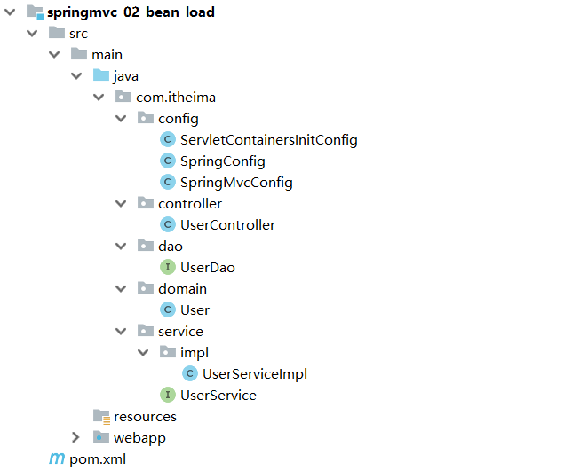

**2.4.3 设置bean加载控制**

方式一：修改Spring配置类，设定扫描范围为精准范围。

<table>
<colgroup>
<col style="width: 100%" />
</colgroup>
<tbody>
<tr class="odd">
<td>Java 
@Configuration 
@ComponentScan({"com.itheima.service","comitheima.dao"}) 
public class SpringConfig { 
}</td>
</tr>
</tbody>
</table>

上述只是通过例子说明可以精确指定Spring扫描对应的包结构，真正做开发时，因为Dao最终是交给MapperScannerConfigurer对象进行扫描处理的，我们只需要将其扫描到service包即可。

方式二：修改Spring配置类，设定扫描范围为com.itheima，排除掉controller包中的bean

<table>
<colgroup>
<col style="width: 100%" />
</colgroup>
<tbody>
<tr class="odd">
<td>Java 
@Configuration 
@ComponentScan(value="com.itheima", 
excludeFilters=@ComponentScan.Filter( 
type = FilterType.ANNOTATION, 
classes = Controller.class 
) 
) 
public class SpringConfig { 
}</td>
</tr>
</tbody>
</table>

excludeFilters属性：设置扫描加载bean时，排除的过滤规则

type属性：设置排除规则，当前使用按照bean定义时的注解类型进行排除

ANNOTATION：按照注解排除

ASSIGNABLE_TYPE：按照指定的类型过滤

ASPECTJ：按照Aspectj表达式排除，基本上不会用

REGEX：按照正则表达式排除

CUSTOM：按照自定义规则排除

classes属性：设置排除的具体注解类，当前设置排除@Controller定义的bean

测试controller类已经被排除掉：

<table>
<colgroup>
<col style="width: 100%" />
</colgroup>
<tbody>
<tr class="odd">
<td>Java 
public class App{ 
public static void main (String[] args){ 
AnnotationConfigApplicationContext ctx = new AnnotationConfigApplicationContext(SpringConfig.class); 
System.out.println(ctx.getBean(UserController.class)); 
} 
}</td>
</tr>
</tbody>
</table>

如果被排除了，该方法执行就会报bean未被定义的错误

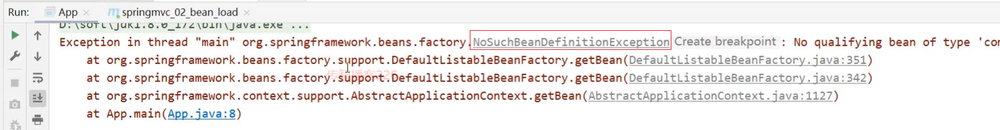

注意：测试的时候，需要把SpringMvcConfig配置类上的@ComponentScan注解注释掉，否则不会报错，原因是

Spring配置类扫描的包是com.itheima

SpringMVC的配置类，SpringMvcConfig上有一个@Configuration注解，也会被Spring扫描到

SpringMvcConfig上又有一个@ComponentScan，把controller类又给扫描进来了

所以如果不把@ComponentScan注释掉，Spring配置类将Controller排除，但是因为扫描到SpringMVC的配置类，又将其加载回来，演示的效果就出不来

解决方案也简单，把SpringMVC的配置类移出Spring配置类的扫描范围即可

有了Spring的配置类，要想在tomcat服务器启动将其加载，就需要修改ServletContainersInitConfig：

<table>
<colgroup>
<col style="width: 100%" />
</colgroup>
<tbody>
<tr class="odd">
<td>Java 
public class ServletContainersInitConfig extends AbstractDispatcherServletInitializer { 
protected WebApplicationContext createServletApplicationContext() { 
AnnotationConfigWebApplicationContext ctx = new AnnotationConfigWebApplicationContext(); 
ctx.register(SpringMvcConfig.class); 
return ctx; 
} 
protected String[] getServletMappings() { 
return new String[]{"/"}; 
} 
protected WebApplicationContext createRootApplicationContext() { 
AnnotationConfigWebApplicationContext ctx = new AnnotationConfigWebApplicationContext(); 
ctx.register(SpringConfig.class); 
return ctx; 
} 
}</td>
</tr>
</tbody>
</table>

对于上述的配置方式，Spring还提供了一种更简单的配置方式，可以不用创建AnnotationConfigWebApplicationContext对象，不用手动register对应的配置类：

<table>
<colgroup>
<col style="width: 100%" />
</colgroup>
<tbody>
<tr class="odd">
<td>Java 
public class ServletContainersInitConfig extends AbstractAnnotationConfigDispatcherServletInitializer { 
 
protected Class&lt;?&gt;[] getRootConfigClasses() { 
return new Class[]{SpringConfig.class}; 
} 
 
protected Class&lt;?&gt;[] getServletConfigClasses() { 
return new Class[]{SpringMvcConfig.class}; 
} 
 
protected String[] getServletMappings() { 
return new String[]{"/"}; 
} 
}</td>
</tr>
</tbody>
</table>

**@ComponentScan**

<table>
<colgroup>
<col style="width: 50%" />
<col style="width: 50%" />
</colgroup>
<tbody>
<tr class="odd">
<td>名称</td>
<td>@ComponentScan</td>
</tr>
<tr class="even">
<td>类型</td>
<td>类注解</td>
</tr>
<tr class="odd">
<td>位置</td>
<td>类定义上方</td>
</tr>
<tr class="even">
<td>作用</td>
<td>设置spring配置类扫描路径，用于加载使用注解格式定义的bean</td>
</tr>
<tr class="odd">
<td>相关属性</td>
<td>excludeFilters：排除扫描路径中加载的bean,需要指定类别（type）和具体项（classes） 
includeFilters：加载指定的bean，需要指定类别（type）和具体项（classes）</td>
</tr>
</tbody>
</table>

**3.PostMan工具的使用**

**3.1 PostMan简介**

PostMan是一款功能强大的网页调试与发送网页HTTP请求的Chrome插件，常用于进行接口测试。

**3.2 PostMan安装**

双击资料中的Postman-win64-8.3.1-Setup.exe即可自动安装，看到如下界面，就说明已经安装成功。

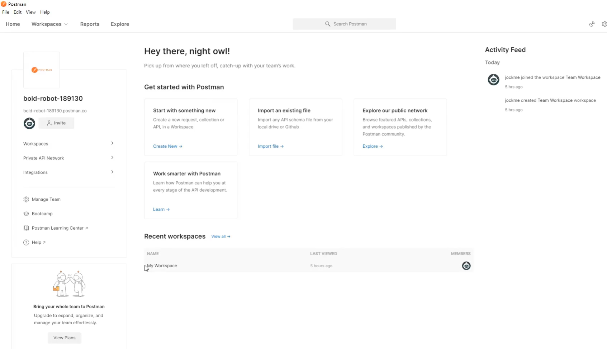

需要注意的是，需要先关闭自己电脑的防火墙，否则Postman无法正常启动使用。

**3.3 PostMan使用**

创建WorkSpace工作空间

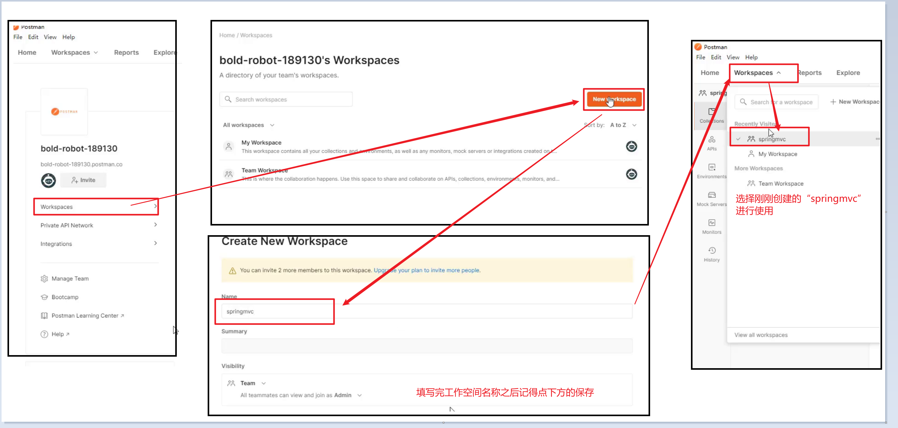

发送请求

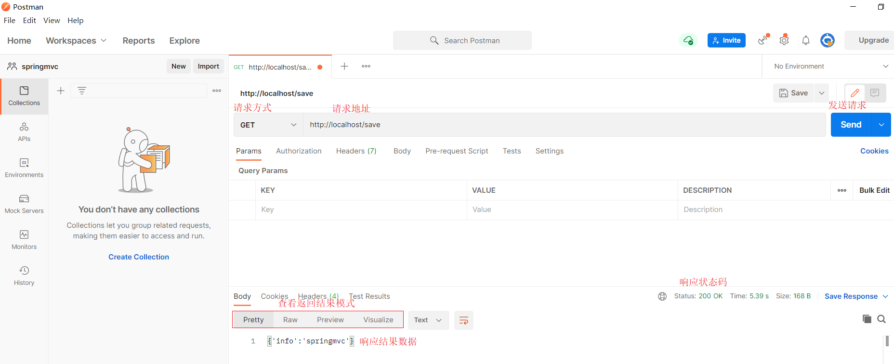

保存当前请求

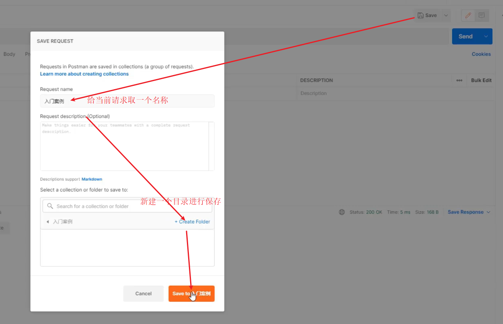

第一次请求需要创建一个新的目录，后面就不需要创建新目录，直接保存到已经创建好的目录即可。

**4.请求与响应**

SpringMVC是web层的框架，主要的作用是接收请求、接收数据、响应结果，所以这一章节是学习SpringMVC的重点内容。

**4.1 设置请求映射路径**

创建一个Web的Maven项目，pom.xml添加Spring依赖

<table>
<colgroup>
<col style="width: 100%" />
</colgroup>
<tbody>
<tr class="odd">
<td>XML 
&lt;?xml version="1.0" encoding="UTF-8"？&gt; 
 
&lt;project xmlns="http://maven.apache.org/POM/4.0.0" xmlns:xsi="http://www.w3.org/2001/XMLSchema-instance" 
xsi:schemaLocation="http://maven.apache.org/POM/4.0.0 http://maven.apache.org/xsd/maven-4.0.0.xsd"&gt; 
&lt;modelVersion&gt;4.0.0&lt;/modelVersion&gt; 
 
&lt;groupId&gt;com.itheima&lt;/groupId&gt; 
&lt;artifactId&gt;springmvc_03_request_mapping&lt;/artifactId&gt; 
&lt;version&gt;1.0-SNAPSHOT&lt;/version&gt; 
&lt;packaging&gt;war&lt;/packaging&gt; 
 
&lt;dependencies&gt; 
&lt;dependency&gt; 
&lt;groupId&gt;javax.servlet&lt;/groupId&gt; 
&lt;artifactId&gt;javax.servlet-api&lt;/artifactId&gt; 
&lt;version&gt;3.1.0&lt;/version&gt; 
&lt;scope&gt;provided&lt;/scope&gt; 
&lt;/dependency&gt; 
&lt;dependency&gt; 
&lt;groupId&gt;org.springframework&lt;/groupId&gt; 
&lt;artifactId&gt;spring-webmvc&lt;/artifactId&gt; 
&lt;version&gt;5.2.10.RELEASE&lt;/version&gt; 
&lt;/dependency&gt; 
&lt;/dependencies&gt; 
 
&lt;build&gt; 
&lt;plugins&gt; 
&lt;plugin&gt; 
&lt;groupId&gt;org.apache.tomcat.maven&lt;/groupId&gt; 
&lt;artifactId&gt;tomcat7-maven-plugin&lt;/artifactId&gt; 
&lt;version&gt;2.1&lt;/version&gt; 
&lt;configuration&gt; 
&lt;port&gt;80&lt;/port&gt; 
&lt;path&gt;/&lt;/path&gt; 
&lt;/configuration&gt; 
&lt;/plugin&gt; 
&lt;/plugins&gt; 
&lt;/build&gt; 
&lt;/project&gt;</td>
</tr>
</tbody>
</table>

创建对应的配置类

<table>
<colgroup>
<col style="width: 100%" />
</colgroup>
<tbody>
<tr class="odd">
<td>Java 
public class ServletContainersInitConfig extends AbstractAnnotationConfigDispatcherServletInitializer { 
 
protected Class&lt;?&gt;[] getServletConfigClasses() { 
return new Class[]{SpringMvcConfig.class}; 
} 
protected String[] getServletMappings() { 
return new String[]{"/"}; 
} 
protected Class&lt;?&gt;[] getRootConfigClasses() { 
return new Class[0]; 
} 
} 
 
@Configuration 
@ComponentScan("com.itheima.controller") 
public class SpringMvcConfig { 
}</td>
</tr>
</tbody>
</table>

编写BookController和UserController

<table>
<colgroup>
<col style="width: 100%" />
</colgroup>
<tbody>
<tr class="odd">
<td>Java 
@Controller 
public class UserController { 
 
@RequestMapping("/save") 
@ResponseBody 
public String save(){ 
System.out.println("user save ..."); 
return "{'module':'user save'}"; 
} 
 
@RequestMapping("/delete") 
@ResponseBody 
public String save(){ 
System.out.println("user delete ..."); 
return "{'module':'user delete'}"; 
} 
} 
 
@Controller 
public class BookController { 
 
@RequestMapping("/save") 
@ResponseBody 
public String save(){ 
System.out.println("book save ..."); 
return "{'module':'book save'}"; 
} 
}</td>
</tr>
</tbody>
</table>

最终项目结构如下：

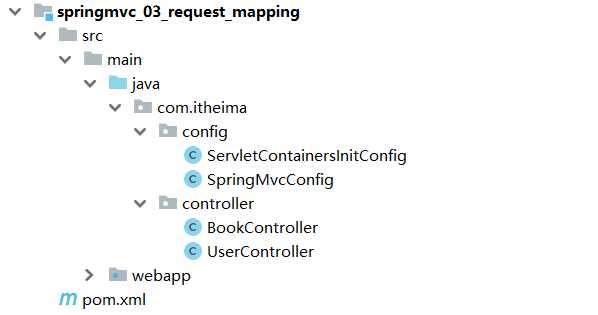

把环境准备好后，启动Tomcat服务器，后台会报错：

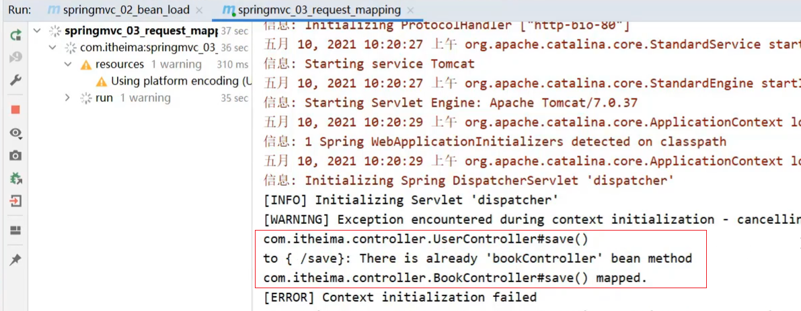

从错误信息可以看出，UserController有一个save方法，访问路径为http://localhost/save，BookController也有一个save方法，访问路径为http://localhost/save，当访问http://localhost/saved时，访问路径冲突。

解决办法是为不同模块设置模块名作为请求路径前置，对于Book模块的save，将其访问路径设置http://localhost/book/save，对于User模块的save，将其访问路径设置http://localhost/user/save。

<table>
<colgroup>
<col style="width: 100%" />
</colgroup>
<tbody>
<tr class="odd">
<td>Java 
@Controller 
public class UserController { 
 
@RequestMapping("/user/save") 
@ResponseBody 
public String save(){ 
System.out.println("user save ..."); 
return "{'module':'user save'}"; 
} 
 
@RequestMapping("/user/delete") 
@ResponseBody 
public String save(){ 
System.out.println("user delete ..."); 
return "{'module':'user delete'}"; 
} 
} 
 
@Controller 
public class BookController { 
 
@RequestMapping("/book/save") 
@ResponseBody 
public String save(){ 
System.out.println("book save ..."); 
return "{'module':'book save'}"; 
} 
}</td>
</tr>
</tbody>
</table>

问题虽然解决，但是每个方法前面都需要进行修改，写起来比较麻烦，如果/user后期发生变化，所有的方法都需要改，耦合度太高。可以在类上和方法上都添加了@RequestMapping注解，前端发送请求的时候，要和两个注解的value值相加匹配才能访问到：

<table>
<colgroup>
<col style="width: 100%" />
</colgroup>
<tbody>
<tr class="odd">
<td>Java 
@Controller 
@RequestMapping("/user") 
public class UserController { 
 
@RequestMapping("/save") 
@ResponseBody 
public String save(){ 
System.out.println("user save ..."); 
return "{'module':'user save'}"; 
} 
 
@RequestMapping("/delete") 
@ResponseBody 
public String save(){ 
System.out.println("user delete ..."); 
return "{'module':'user delete'}"; 
} 
} 
 
@Controller 
@RequestMapping("/book") 
public class BookController { 
 
@RequestMapping("/save") 
@ResponseBody 
public String save(){ 
System.out.println("book save ..."); 
return "{'module':'book save'}"; 
} 
}</td>
</tr>
</tbody>
</table>

*@RequestMapping注解value属性前面加不加/都可以。*

**4.2 请求参数**

请求路径设置好后，只要确保页面发送请求地址和后台Controller类中配置的路径一致，就可以接收到前端的请求，而请求中是可以携带请求参数的，请求参数的传递与接收和请求方式有关，比较常见请求方式有两种，GET和POST。

在了解请求参数接收前，需要准备环境：

（1）创建一个Web的Maven项目，pom.xml添加Spring依赖

<table>
<colgroup>
<col style="width: 100%" />
</colgroup>
<tbody>
<tr class="odd">
<td>XML 
&lt;?xml version="1.0" encoding="UTF-8"？&gt; 
 
&lt;project xmlns="http://maven.apache.org/POM/4.0.0" xmlns:xsi="http://www.w3.org/2001/XMLSchema-instance" 
xsi:schemaLocation="http://maven.apache.org/POM/4.0.0 http://maven.apache.org/xsd/maven-4.0.0.xsd"&gt; 
&lt;modelVersion&gt;4.0.0&lt;/modelVersion&gt; 
 
&lt;groupId&gt;com.itheima&lt;/groupId&gt; 
&lt;artifactId&gt;springmvc_03_request_mapping&lt;/artifactId&gt; 
&lt;version&gt;1.0-SNAPSHOT&lt;/version&gt; 
&lt;packaging&gt;war&lt;/packaging&gt; 
 
&lt;dependencies&gt; 
&lt;dependency&gt; 
&lt;groupId&gt;javax.servlet&lt;/groupId&gt; 
&lt;artifactId&gt;javax.servlet-api&lt;/artifactId&gt; 
&lt;version&gt;3.1.0&lt;/version&gt; 
&lt;scope&gt;provided&lt;/scope&gt; 
&lt;/dependency&gt; 
&lt;dependency&gt; 
&lt;groupId&gt;org.springframework&lt;/groupId&gt; 
&lt;artifactId&gt;spring-webmvc&lt;/artifactId&gt; 
&lt;version&gt;5.2.10.RELEASE&lt;/version&gt; 
&lt;/dependency&gt; 
&lt;/dependencies&gt; 
 
&lt;build&gt; 
&lt;plugins&gt; 
&lt;plugin&gt; 
&lt;groupId&gt;org.apache.tomcat.maven&lt;/groupId&gt; 
&lt;artifactId&gt;tomcat7-maven-plugin&lt;/artifactId&gt; 
&lt;version&gt;2.1&lt;/version&gt; 
&lt;configuration&gt; 
&lt;port&gt;80&lt;/port&gt; 
&lt;path&gt;/&lt;/path&gt; 
&lt;/configuration&gt; 
&lt;/plugin&gt; 
&lt;/plugins&gt; 
&lt;/build&gt; 
&lt;/project&gt;</td>
</tr>
</tbody>
</table>

创建对应的配置类

<table>
<colgroup>
<col style="width: 100%" />
</colgroup>
<tbody>
<tr class="odd">
<td>Java 
public class ServletContainersInitConfig extends AbstractAnnotationConfigDispatcherServletInitializer { 
 
protected Class&lt;?&gt;[] getServletConfigClasses() { 
return new Class[]{SpringMvcConfig.class}; 
} 
protected String[] getServletMappings() { 
return new String[]{"/"}; 
} 
protected Class&lt;?&gt;[] getRootConfigClasses() { 
return new Class[0]; 
} 
} 
 
@Configuration 
@ComponentScan("com.itheima.controller") 
public class SpringMvcConfig { 
}</td>
</tr>
</tbody>
</table>

编写UserController

<table>
<colgroup>
<col style="width: 100%" />
</colgroup>
<tbody>
<tr class="odd">
<td>Java 
@Controller 
public class UserController { 
 
@RequestMapping("/commonParam") 
@ResponseBody 
public String commonParam(){ 
return "{'module':'commonParam'}"; 
} 
}</td>
</tr>
</tbody>
</table>

编写模型类，User和Address

<table>
<colgroup>
<col style="width: 100%" />
</colgroup>
<tbody>
<tr class="odd">
<td>Java 
public class Address { 
private String province; 
private String city; 
//setter...getter...略 
} 
public class User { 
private String name; 
private int age; 
//setter...getter...略 
}</td>
</tr>
</tbody>
</table>

最终项目结构如下：

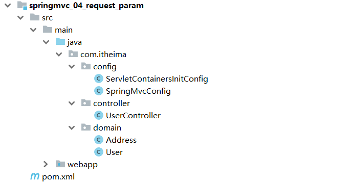

**4.2.1 GET请求参数**

**发送单个参数**

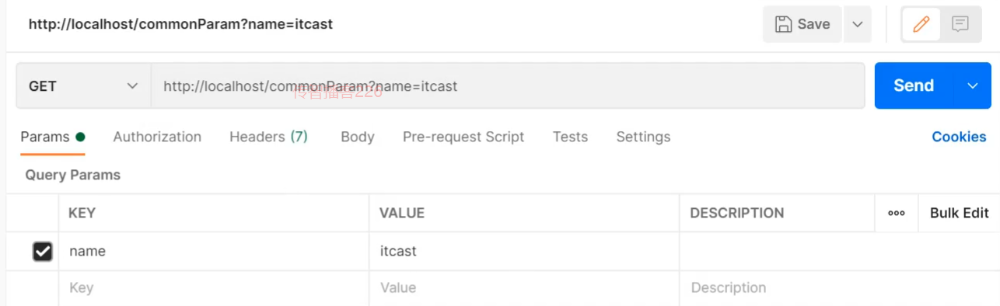

<table>
<colgroup>
<col style="width: 100%" />
</colgroup>
<tbody>
<tr class="odd">
<td>Java 
@Controller 
public class UserController { 
 
@RequestMapping("/commonParam") 
@ResponseBody 
public String commonParam(String name){ 
System.out.println("普通参数传递 name ==&gt; "+name); 
return "{'module':'commonParam'}"; 
} 
}</td>
</tr>
</tbody>
</table>

**发送多个参数**

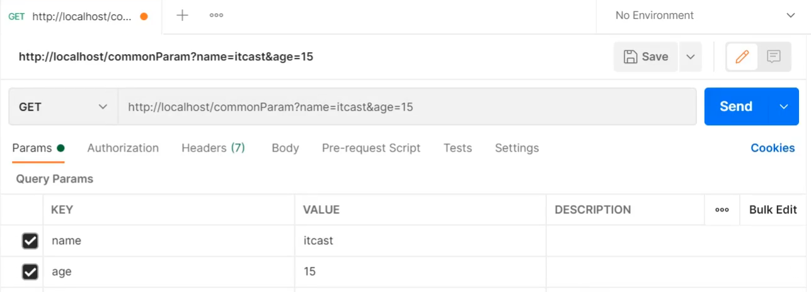

接收参数：

<table>
<colgroup>
<col style="width: 100%" />
</colgroup>
<tbody>
<tr class="odd">
<td>Java 
@Controller 
public class UserController { 
 
@RequestMapping("/commonParam") 
@ResponseBody 
public String commonParam(String name,int age){ 
System.out.println("普通参数传递 name ==&gt; "+name); 
System.out.println("普通参数传递 age ==&gt; "+age); 
return "{'module':'commonParam'}"; 
} 
}</td>
</tr>
</tbody>
</table>

**GET请求中文乱码**

如果传递的参数中有中文，例如http://localhost/commonParam?name=张三&age=18，会发现接收到的参数会出现中文乱码问题。

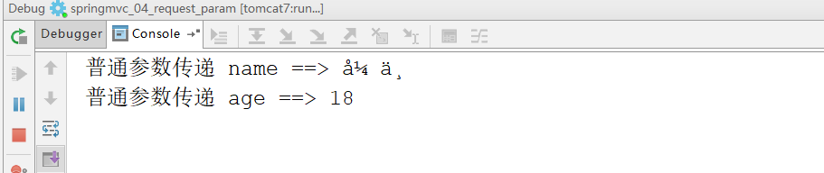

出现乱码的原因为，Tomcat8.5以后的版本已经处理了中文乱码的问题，但是IDEA中的Tomcat插件目前只到Tomcat7，所以需要修改pom.xml来解决GET请求中文乱码问题

<table>
<colgroup>
<col style="width: 100%" />
</colgroup>
<tbody>
<tr class="odd">
<td>XML 
&lt;build&gt; 
&lt;plugins&gt; 
&lt;plugin&gt; 
&lt;groupId&gt;org.apache.tomcat.maven&lt;/groupId&gt; 
&lt;artifactId&gt;tomcat7-maven-plugin&lt;/artifactId&gt; 
&lt;version&gt;2.1&lt;/version&gt; 
&lt;configuration&gt; 
&lt;port&gt;80&lt;/port&gt;&lt;!--tomcat端口号--&gt; 
&lt;path&gt;/&lt;/path&gt; &lt;!--虚拟目录--&gt; 
&lt;uriEncoding&gt;UTF-8&lt;/uriEncoding&gt;&lt;!--访问路径编解码字符集--&gt; 
&lt;/configuration&gt; 
&lt;/plugin&gt; 
&lt;/plugins&gt; 
&lt;/build&gt;</td>
</tr>
</tbody>
</table>

**4.2.2 POST请求参数**

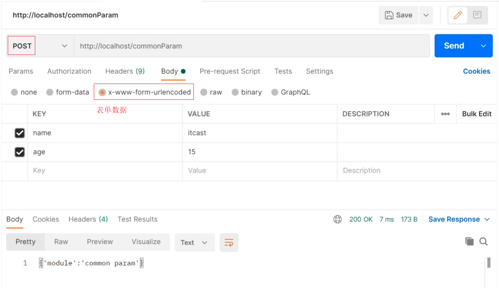

接收参数和GET一致，不用做任何修改

<table>
<colgroup>
<col style="width: 100%" />
</colgroup>
<tbody>
<tr class="odd">
<td>Java 
@Controller 
public class UserController { 
 
@RequestMapping("/commonParam") 
@ResponseBody 
public String commonParam(String name,int age){ 
System.out.println("普通参数传递 name ==&gt; "+name); 
System.out.println("普通参数传递 age ==&gt; "+age); 
return "{'module':'commonParam'}"; 
} 
}</td>
</tr>
</tbody>
</table>

**POST请求中文乱码**

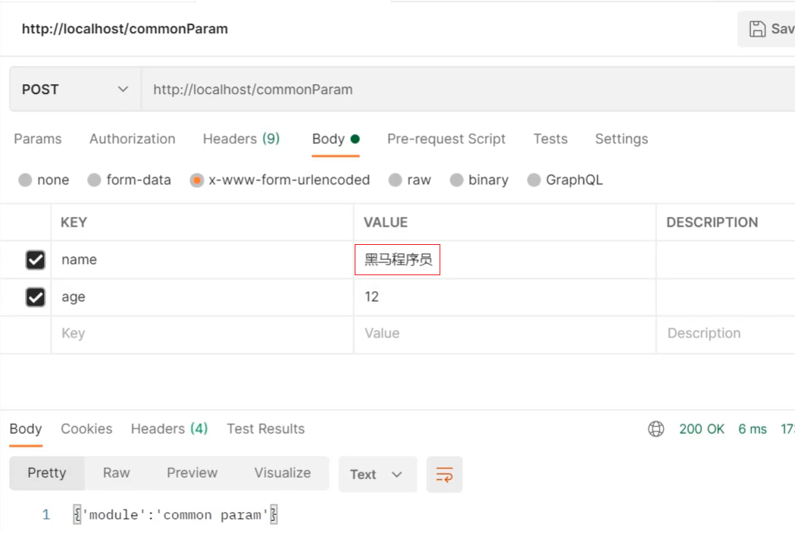

控制台打印，会发现有中文乱码问题

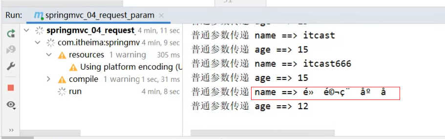

解决方案就是配置过滤器

<table>
<colgroup>
<col style="width: 100%" />
</colgroup>
<tbody>
<tr class="odd">
<td>Java 
public class ServletContainersInitConfig extends AbstractAnnotationConfigDispatcherServletInitializer { 
protected Class&lt;?&gt;[] getRootConfigClasses() { 
return new Class[0]; 
} 
 
protected Class&lt;?&gt;[] getServletConfigClasses() { 
return new Class[]{SpringMvcConfig.class}; 
} 
 
protected String[] getServletMappings() { 
return new String[]{"/"}; 
} 
 
// 乱码处理 
@Override 
protected Filter[] getServletFilters() { 
CharacterEncodingFilter filter = new CharacterEncodingFilter(); 
filter.setEncoding("UTF-8"); 
return new Filter[]{filter}; 
} 
}</td>
</tr>
</tbody>
</table>

CharacterEncodingFilter是在spring-web包中，所以用之前需要导入对应的jar包。

**4.3 五种类型参数传递**

常见的参数种类有：

普通参数

POJO类型参数

嵌套POJO类型参数

数组类型参数

集合类型参数

**4.3.1 普通参数**

普通参数：url地址传参，地址参数名与形参变量名相同，定义形参即可接收参数。

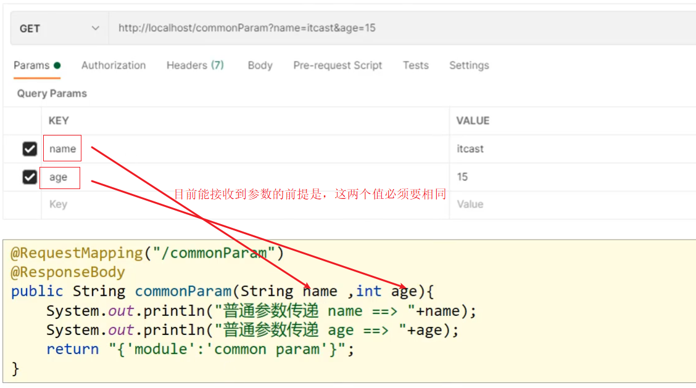

如果形参与地址参数名不一致，例如使用username形参接收参数：

<table>
<colgroup>
<col style="width: 100%" />
</colgroup>
<tbody>
<tr class="odd">
<td>Java 
@RequestMapping("/commonParamDifferentName") 
@ResponseBody 
public String commonParamDifferentName(String userName , int age){ 
System.out.println("普通参数传递 userName ==&gt; "+userName); 
System.out.println("普通参数传递 age ==&gt; "+age); 
return "{'module':'common param different name'}"; 
}</td>
</tr>
</tbody>
</table>

因为前端给的是name，后台接收使用的是userName，两个名称对不上，导致接收数据失败。

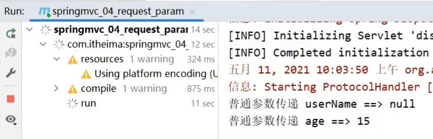

解决方案是使用**@RequestParam**注解：

<table>
<colgroup>
<col style="width: 100%" />
</colgroup>
<tbody>
<tr class="odd">
<td>Java 
@RequestMapping("/commonParamDifferentName") 
@ResponseBody 
public String commonParamDifferentName(@RequestPaam("name") String userName , int age){ 
System.out.println("普通参数传递 userName ==&gt; "+userName); 
System.out.println("普通参数传递 age ==&gt; "+age); 
return "{'module':'common param different name'}"; 
}</td>
</tr>
</tbody>
</table>

写上@RequestParam注解框架就不需要自己去解析注入，能提升框架处理性能。

**4.3.2 POJO数据类型**

简单数据类型一般处理的是参数个数比较少的请求，如果参数比较多，那么后台接收参数的时候就比较复杂，这个时候可以考虑使用POJO数据类型。

POJO参数：请求参数名与形参对象属性名相同，定义POJO类型形参即可接收参数。

此时需要使用前面准备好的POJO类，先来看下User

<table>
<colgroup>
<col style="width: 100%" />
</colgroup>
<tbody>
<tr class="odd">
<td>Java 
public class User { 
private String name; 
private int age; 
//setter...getter...略 
}</td>
</tr>
</tbody>
</table>

发送请求和参数：

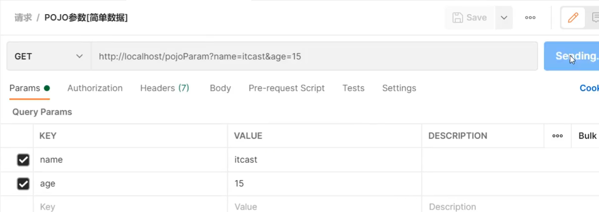

后台接收参数：

<table>
<colgroup>
<col style="width: 100%" />
</colgroup>
<tbody>
<tr class="odd">
<td>Java 
//POJO参数：请求参数与形参对象中的属性对应即可完成参数传递 
@RequestMapping("/pojoParam") 
@ResponseBody 
public String pojoParam(User user){ 
System.out.println("pojo参数传递 user ==&gt; "+user); 
return "{'module':'pojo param'}"; 
}</td>
</tr>
</tbody>
</table>

POJO参数接收，前端GET和POST发送请求数据的方式不变。

请求参数key的名称要和POJO中属性的名称一致，否则无法封装。

**4.3.3 嵌套POJO类型参数**

如果POJO对象中嵌套了其他的POJO类，如：

<table>
<colgroup>
<col style="width: 100%" />
</colgroup>
<tbody>
<tr class="odd">
<td>Java 
public class Address { 
private String province; 
private String city; 
//setter...getter...略 
} 
public class User { 
private String name; 
private int age; 
private Address address; 
//setter...getter...略 
}</td>
</tr>
</tbody>
</table>

这时请求参数名与形参对象属性名相同，按照对象层次结构关系即可接收嵌套POJO属性参数。

发送请求和参数：

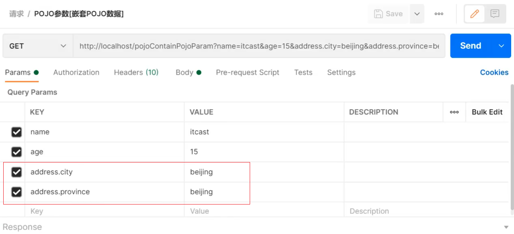

后台接收参数：

<table>
<colgroup>
<col style="width: 100%" />
</colgroup>
<tbody>
<tr class="odd">
<td>Java 
//POJO参数：请求参数与形参对象中的属性对应即可完成参数传递 
@RequestMapping("/pojoParam") 
@ResponseBody 
public String pojoParam(User user){ 
System.out.println("pojo参数传递 user ==&gt; "+user); 
return "{'module':'pojo param'}"; 
}</td>
</tr>
</tbody>
</table>

请求参数key的名称要和POJO中属性的名称一致，否则无法封装。

**4.3.4 数组类型参数**

数组参数：请求参数名与形参对象属性名相同且请求参数为多个，定义数组类型即可接收参数。

发送请求和参数：

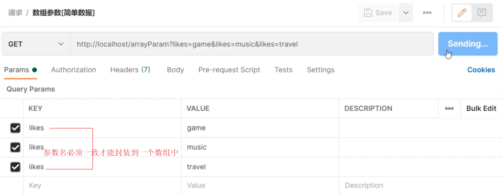

后台接收参数：

<table>
<colgroup>
<col style="width: 100%" />
</colgroup>
<tbody>
<tr class="odd">
<td>Java 
//数组参数：同名请求参数可以直接映射到对应名称的形参数组对象中 
@RequestMapping("/arrayParam") 
@ResponseBody 
public String arrayParam(String[] likes){ 
System.out.println("数组参数传递 likes ==&gt; "+ Arrays.toString(likes)); 
return "{'module':'array param'}"; 
}</td>
</tr>
</tbody>
</table>

**4.3.5 集合类型参数**

如果直接使用集合接收数组参数：

<table>
<colgroup>
<col style="width: 100%" />
</colgroup>
<tbody>
<tr class="odd">
<td>Java 
//集合参数：同名请求参数可以使用@RequestParam注解映射到对应名称的集合对象中作为数据 
@RequestMapping("/listParam") 
@ResponseBody 
public String listParam(List&lt;String&gt; likes){ 
System.out.println("集合参数传递 likes ==&gt; "+ likes); 
return "{'module':'list param'}"; 
}</td>
</tr>
</tbody>
</table>

运行会报错：

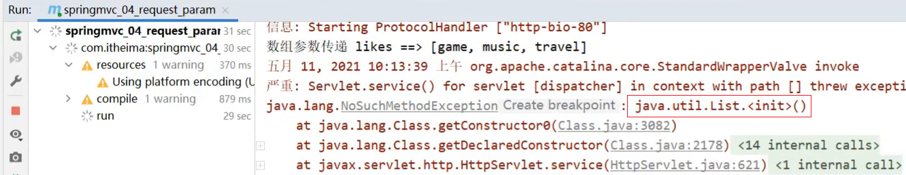

原因是SpringMVC将List看做是一个POJO对象来处理，将其创建一个对象并准备把前端的数据封装到对象中，但是List是一个接口无法创建对象，所以报错，解决方案是使用**@RequestParam**注解绑定参数关系：

<table>
<colgroup>
<col style="width: 100%" />
</colgroup>
<tbody>
<tr class="odd">
<td>Java 
//集合参数：同名请求参数可以使用@RequestParam注解映射到对应名称的集合对象中作为数据 
@RequestMapping("/listParam") 
@ResponseBody 
public String listParam(@RequestParam List&lt;String&gt; likes){ 
System.out.println("集合参数传递 likes ==&gt; "+ likes); 
return "{'module':'list param'}"; 
}</td>
</tr>
</tbody>
</table>

**@RequestParam**

<table>
<colgroup>
<col style="width: 50%" />
<col style="width: 50%" />
</colgroup>
<tbody>
<tr class="odd">
<td>名称</td>
<td>@RequestParam</td>
</tr>
<tr class="even">
<td>类型</td>
<td>形参注解</td>
</tr>
<tr class="odd">
<td>位置</td>
<td>SpringMVC控制器方法形参定义前面</td>
</tr>
<tr class="even">
<td>作用</td>
<td>绑定请求参数与处理器方法形参间的关系</td>
</tr>
<tr class="odd">
<td>相关参数</td>
<td>required：是否为必传参数 
defaultValue：参数默认值</td>
</tr>
</tbody>
</table>

**4.4 JSON数据参数**

现在比较流行的开发方式为异步调用，前后台以异步方式进行交换，传输的数据使用的是**JSON**。对于JSON数据类型，常见的有三种：

json普通数组，例如\["value1","value2","value3",...\]

json对象，例如{key1:value1,key2:value2,...}

json对象数组，例如\[{key1:value1,...},{key2:value2,...}\]

**4.4.1 JSON普通数组**

（1）pom.xml添加依赖

SpringMVC默认使用的是jackson来处理json的转换，所以需要在pom.xml添加jackson依赖

<table>
<colgroup>
<col style="width: 100%" />
</colgroup>
<tbody>
<tr class="odd">
<td>XML 
&lt;dependency&gt; 
&lt;groupId&gt;com.fasterxml.jackson.core&lt;/groupId&gt; 
&lt;artifactId&gt;jackson-databind&lt;/artifactId&gt; 
&lt;version&gt;2.9.0&lt;/version&gt; 
&lt;/dependency&gt;</td>
</tr>
</tbody>
</table>

（2）PostMan发送JSON数据

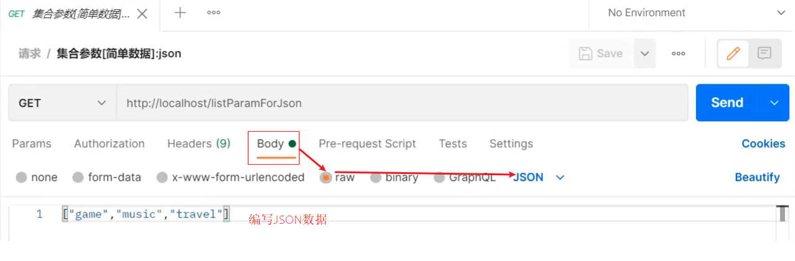

（3）开启SpringMVC注解支持

在SpringMVC的配置类中开启SpringMVC的注解支持，这里面就包含了将JSON转换成对象的功能。

<table>
<colgroup>
<col style="width: 100%" />
</colgroup>
<tbody>
<tr class="odd">
<td>Java 
@Configuration 
@ComponentScan("com.itheima.controller") 
//开启json数据类型自动转换 
@EnableWebMvc 
public class SpringMvcConfig { 
}</td>
</tr>
</tbody>
</table>

（4）参数前添加@RequestBody

<table>
<colgroup>
<col style="width: 100%" />
</colgroup>
<tbody>
<tr class="odd">
<td>Java 
//使用@RequestBody注解将外部传递的json数组数据映射到形参的集合对象中作为数据 
@RequestMapping("/listParamForJson") 
@ResponseBody 
public String listParamForJson(@RequestBody List&lt;String&gt; likes){ 
System.out.println("list common(json)参数传递 list ==&gt; "+likes); 
return "{'module':'list common for json param'}"; 
}</td>
</tr>
</tbody>
</table>

（5）启动运行程序

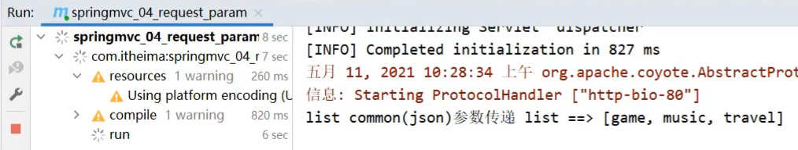

**4.4.2 JSON对象数据**

请求和数据的发送：

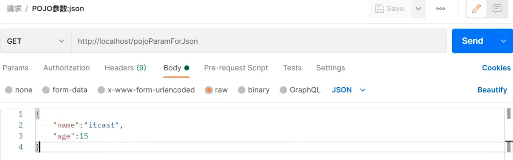

后端接收数据：

<table>
<colgroup>
<col style="width: 100%" />
</colgroup>
<tbody>
<tr class="odd">
<td>Java 
@RequestMapping("/pojoParamForJson") 
@ResponseBody 
public String pojoParamForJson(@RequestBody User user){ 
System.out.println("pojo(json)参数传递 user ==&gt; "+user); 
return "{'module':'pojo for json param'}"; 
}</td>
</tr>
</tbody>
</table>

启动程序访问测试：

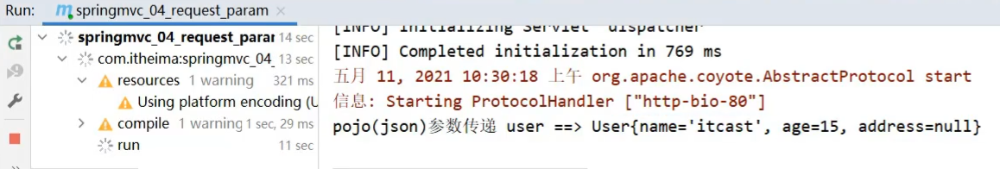

由于前端没有传递数据给后端，所以address为null，如果想要address也有数据，需求修改前端传递的数据内容：

<table>
<colgroup>
<col style="width: 100%" />
</colgroup>
<tbody>
<tr class="odd">
<td>JSON 
{ 
"name":"itcast", 
"age":15, 
"address":{ 
"province":"beijing", 
"city":"beijing" 
} 
}</td>
</tr>
</tbody>
</table>

再次发送请求，就能看到address中的数据：

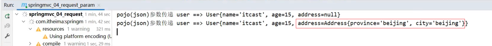

**4.4.3 JSON对象数组**

请求和数据的发送：

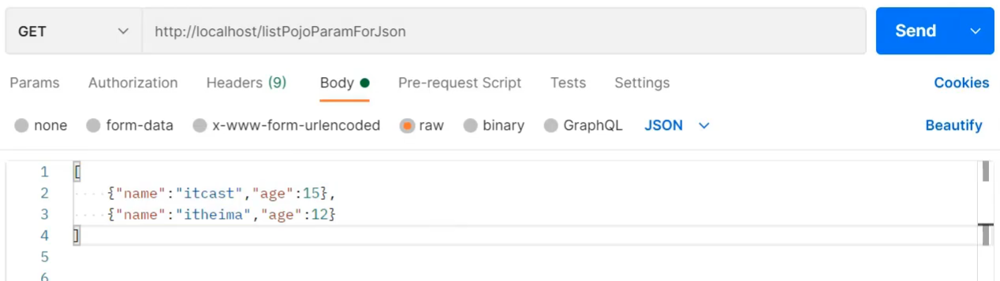

后端接收数据：

<table>
<colgroup>
<col style="width: 100%" />
</colgroup>
<tbody>
<tr class="odd">
<td>Java 
@RequestMapping("/listPojoParamForJson") 
@ResponseBody 
public String listPojoParamForJson(@RequestBody List&lt;User&gt; list){ 
System.out.println("list pojo(json)参数传递 list ==&gt; "+list); 
return "{'module':'list pojo for json param'}"; 
}</td>
</tr>
</tbody>
</table>

启动程序访问测试：

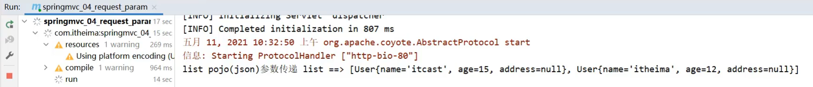

**4.4.4 JSON数据参数总结**

SpringMVC接收JSON数据的实现步骤为：

导入jackson包

使用PostMan发送JSON数据

开启SpringMVC注解驱动，在配置类上添加@EnableWebMvc注解

Controller方法的参数前添加@RequestBody注解

**@EnableWebMvc**

|      |                           |
|------|---------------------------|
| 名称 | @EnableWebMvc             |
| 类型 | **配置类注解**            |
| 位置 | SpringMVC配置类定义上方   |
| 作用 | 开启SpringMVC多项辅助功能 |

**@RequestBody**

|      |                                                                            |
|------|----------------------------------------------------------------------------|
| 名称 | @RequestBody                                                               |
| 类型 | **形参注解**                                                               |
| 位置 | SpringMVC控制器方法形参定义前面                                            |
| 作用 | 将请求中请求体所包含的数据传递给请求参数，此注解一个处理器方法只能使用一次 |

**@RequestBody与@RequestParam的区别**

区别

@RequestParam用于接收url地址传参，表单传参【application/x-www-form-urlencoded】

@RequestBody用于接收json数据【application/json】

应用

后期开发中，发送json格式数据为主，@RequestBody应用较广

如果发送非json格式数据，选用@RequestParam接收请求参数

**4.5 日期类型参数传递**

**4.5.1 接收日期类型参数**

日期类型比较特殊，因为对于日期的格式有很多输入方式，比如 2088-08-18、2088/08/18、08/18/2088 等。

（1）编写方法接收日期数据

<table>
<colgroup>
<col style="width: 100%" />
</colgroup>
<tbody>
<tr class="odd">
<td>Java 
@RequestMapping("/dataParam") 
@ResponseBody 
public String dataParam(Date date) 
System.out.println("参数传递 date ==&gt; "+date); 
return "{'module':'data param'}"; 
}</td>
</tr>
</tbody>
</table>

（2）启动Tomcat服务器，使用PostMan发送GET请求，并设置date参数

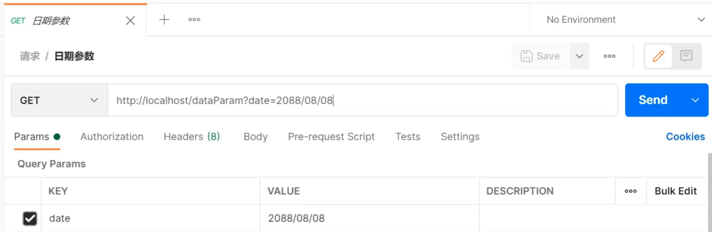

（3）查看控制台

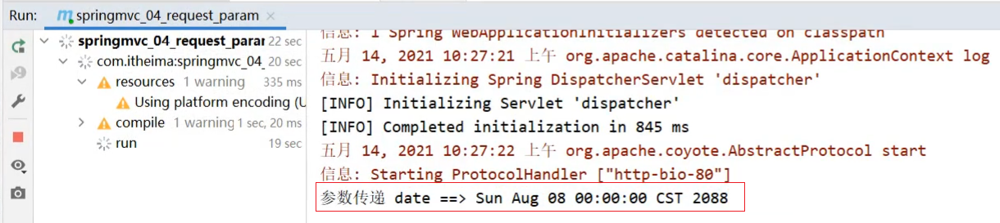

发现SpringMVC可以接收日期数据类型，并将其打印在控制台。

（5）更换日期格式

为了能更好的看到程序运行的结果，在方法中多添加一个日期参数

<table>
<colgroup>
<col style="width: 100%" />
</colgroup>
<tbody>
<tr class="odd">
<td>Java 
@RequestMapping("/dataParam") 
@ResponseBody 
public String dataParam(Date date, Date date1) 
System.out.println("参数传递 date ==&gt; "+date); 
return "{'module':'data param'}"; 
}</td>
</tr>
</tbody>
</table>

（6）使用PostMan发送请求，携带两个不同的日期格式

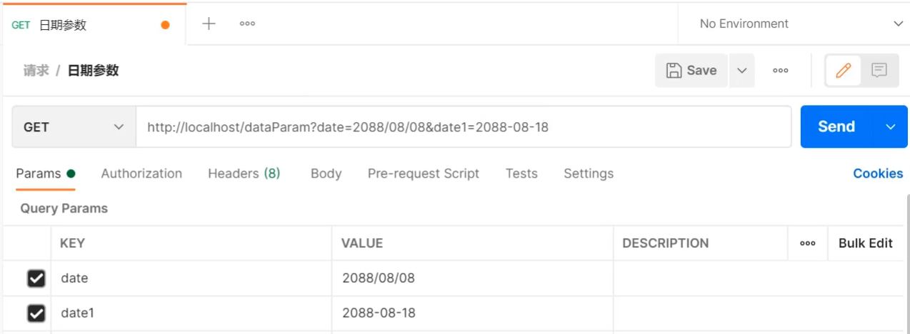

发送请求和数据后，页面会报400，控制台报出如下错误：

<table>
<colgroup>
<col style="width: 100%" />
</colgroup>
<tbody>
<tr class="odd">
<td>Java 
Resolved [org.springframework.web.method.annotation.==MethodArgumentTypeMismatchException==: Failed to convert value of type 'java.lang.String' to required type 'java.util.Date'; nested exception is org.springframework.core.convert.==ConversionFailedException==: Failed to convert from type [java.lang.String] to type [java.util.Date] for value '2088-08-08'; nested exception is java.lang.IllegalArgumentException]</td>
</tr>
</tbody>
</table>

从错误信息可以看出，错误的原因是在将2088-08-08转换成日期类型的时候失败了，原因是SpringMVC默认支持的字符串转日期的格式为yyyy/MM/dd，而现在传递的不符合其默认格式，SpringMVC就无法进行格式转换。

解决方案也比较简单，需要使用**@DateTimeFormat**

<table>
<colgroup>
<col style="width: 100%" />
</colgroup>
<tbody>
<tr class="odd">
<td>Java 
@RequestMapping("/dataParam") 
@ResponseBody 
public String dataParam(Date date, @DateTimeFormat(pattern="yyyy-MM-dd") Date date1) 
System.out.println("参数传递 date ==&gt; "+date); 
System.out.println("参数传递 date1(yyyy-MM-dd) ==&gt; "+date1); 
return "{'module':'data param'}"; 
}</td>
</tr>
</tbody>
</table>

重新启动服务器，重新发送请求测试，SpringMVC可以正确的进行日期转换

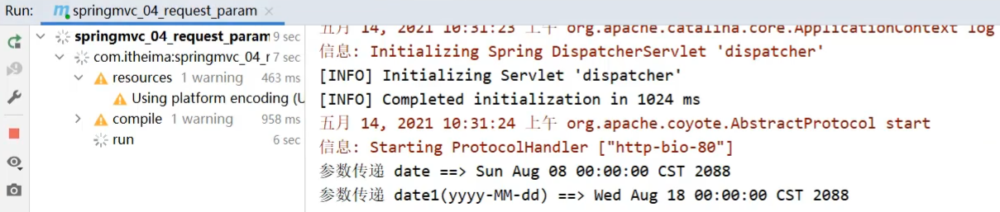

（7）携带时间的日期

修改UserController类，添加第三个参数

<table>
<colgroup>
<col style="width: 100%" />
</colgroup>
<tbody>
<tr class="odd">
<td>Java 
@RequestMapping("/dataParam") 
@ResponseBody 
public String dataParam(Date date, 
@DateTimeFormat(pattern="yyyy-MM-dd") Date date1, 
@DateTimeFormat(pattern="yyyy/MM/dd HH:mm:ss") Date date2) 
System.out.println("参数传递 date ==&gt; "+date); 
System.out.println("参数传递 date1(yyyy-MM-dd) ==&gt; "+date1); 
System.out.println("参数传递 date2(yyyy/MM/dd HH:mm:ss) ==&gt; "+date2); 
return "{'module':'data param'}"; 
}</td>
</tr>
</tbody>
</table>

（8）使用PostMan发送请求，携带两个不同的日期格式

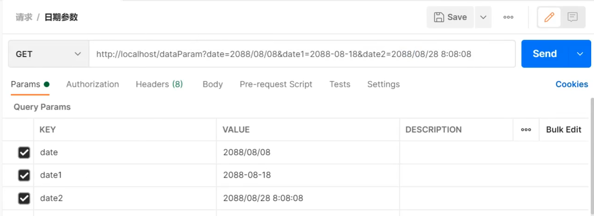

（9）重新启动服务器，重新发送请求测试，SpringMVC就可以将日期时间的数据进行转换

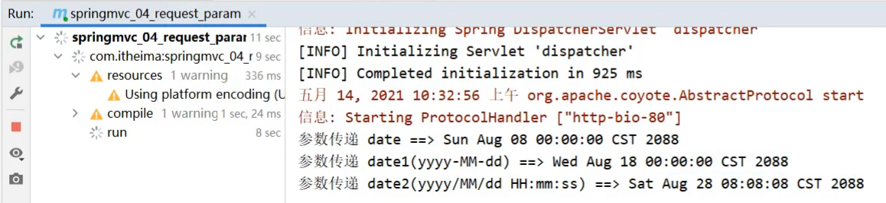

**@DateTimeFormat**

|          |                                 |
|----------|---------------------------------|
| 名称     | @DateTimeFormat                 |
| 类型     | **形参注解**                    |
| 位置     | SpringMVC控制器方法形参前面     |
| 作用     | 设定日期时间型数据格式          |
| 相关属性 | pattern：指定日期时间格式字符串 |

**4.5.2 内部实现原理**

在数据的传递过程中存在很多类型的转换，例如字符串使用日期Date接收、JSON使用对象接收、字符串使用Integer接收，SpringMVC中提供了很多类型转换接口和实现类用来做类型转换。

Converter接口

<table>
<colgroup>
<col style="width: 100%" />
</colgroup>
<tbody>
<tr class="odd">
<td>Java 
/** 
* S: the source type 
* T: the target type 
*/ 
// org.springframework.core.convert.converter包下的Converter 
public interface Converter&lt;S, T&gt; { 
@Nullable 
//该方法就是将从页面上接收的数据(S)转换成我们想要的数据类型(T)返回 
T convert(S source); 
}</td>
</tr>
</tbody>
</table>

框架中有提供很多对应Converter接口的实现类，用来实现不同数据类型之间的转换，例如HttpMessageConverter接口用于实现对象与JSON之间的转换工作。

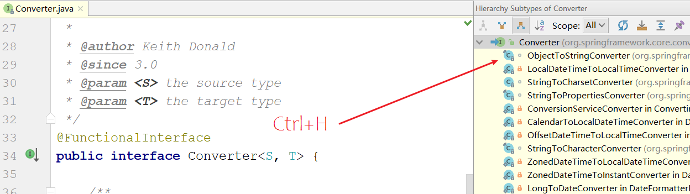

**注意：**SpringMVC的配置类把@EnableWebMvc当做标配配置上去，不要省略。

**4.6 响应**

SpringMVC接收到请求和数据后，进行一些了的处理，当然这个处理可以是转发给Service，Service层再调用Dao层完成的，不管怎样，处理完以后，都需要将结果告知给用户。

对于响应，主要就包含两部分内容：

响应页面

响应数据

文本数据

json数据

因为异步调用是目前常用的主流方式，所以我们需要更关注的就是如何返回JSON数据，对于其他只需要认识了解即可。

**4.6.1 环境准备**

创建一个Web的Maven项目，pom.xml添加Spring依赖

<table>
<colgroup>
<col style="width: 100%" />
</colgroup>
<tbody>
<tr class="odd">
<td>XML 
&lt;?xml version="1.0" encoding="UTF-8"？&gt; 
 
&lt;project xmlns="http://maven.apache.org/POM/4.0.0" xmlns:xsi="http://www.w3.org/2001/XMLSchema-instance" 
xsi:schemaLocation="http://maven.apache.org/POM/4.0.0 http://maven.apache.org/xsd/maven-4.0.0.xsd"&gt; 
&lt;modelVersion&gt;4.0.0&lt;/modelVersion&gt; 
 
&lt;groupId&gt;com.itheima&lt;/groupId&gt; 
&lt;artifactId&gt;springmvc_05_response&lt;/artifactId&gt; 
&lt;version&gt;1.0-SNAPSHOT&lt;/version&gt; 
&lt;packaging&gt;war&lt;/packaging&gt; 
 
&lt;dependencies&gt; 
&lt;dependency&gt; 
&lt;groupId&gt;javax.servlet&lt;/groupId&gt; 
&lt;artifactId&gt;javax.servlet-api&lt;/artifactId&gt; 
&lt;version&gt;3.1.0&lt;/version&gt; 
&lt;scope&gt;provided&lt;/scope&gt; 
&lt;/dependency&gt; 
&lt;dependency&gt; 
&lt;groupId&gt;org.springframework&lt;/groupId&gt; 
&lt;artifactId&gt;spring-webmvc&lt;/artifactId&gt; 
&lt;version&gt;5.2.10.RELEASE&lt;/version&gt; 
&lt;/dependency&gt; 
&lt;dependency&gt; 
&lt;groupId&gt;com.fasterxml.jackson.core&lt;/groupId&gt; 
&lt;artifactId&gt;jackson-databind&lt;/artifactId&gt; 
&lt;version&gt;2.9.0&lt;/version&gt; 
&lt;/dependency&gt; 
&lt;/dependencies&gt; 
 
&lt;build&gt; 
&lt;plugins&gt; 
&lt;plugin&gt; 
&lt;groupId&gt;org.apache.tomcat.maven&lt;/groupId&gt; 
&lt;artifactId&gt;tomcat7-maven-plugin&lt;/artifactId&gt; 
&lt;version&gt;2.1&lt;/version&gt; 
&lt;configuration&gt; 
&lt;port&gt;80&lt;/port&gt; 
&lt;path&gt;/&lt;/path&gt; 
&lt;/configuration&gt; 
&lt;/plugin&gt; 
&lt;/plugins&gt; 
&lt;/build&gt; 
&lt;/project&gt;</td>
</tr>
</tbody>
</table>

创建对应的配置类

<table>
<colgroup>
<col style="width: 100%" />
</colgroup>
<tbody>
<tr class="odd">
<td>Java 
public class ServletContainersInitConfig extends AbstractAnnotationConfigDispatcherServletInitializer { 
protected Class&lt;?&gt;[] getRootConfigClasses() { 
return new Class[0]; 
} 
 
protected Class&lt;?&gt;[] getServletConfigClasses() { 
return new Class[]{SpringMvcConfig.class}; 
} 
 
protected String[] getServletMappings() { 
return new String[]{"/"}; 
} 
 
//乱码处理 
@Override 
protected Filter[] getServletFilters() { 
CharacterEncodingFilter filter = new CharacterEncodingFilter(); 
filter.setEncoding("UTF-8"); 
return new Filter[]{filter}; 
} 
} 
 
@Configuration 
@ComponentScan("com.itheima.controller") 
//开启json数据类型自动转换 
@EnableWebMvc 
public class SpringMvcConfig { 
}</td>
</tr>
</tbody>
</table>

编写模型类User

<table>
<colgroup>
<col style="width: 100%" />
</colgroup>
<tbody>
<tr class="odd">
<td>Java 
public class User { 
private String name; 
private int age; 
//getter...setter...toString省略 
}</td>
</tr>
</tbody>
</table>

webapp下创建page.jsp

<table>
<colgroup>
<col style="width: 100%" />
</colgroup>
<tbody>
<tr class="odd">
<td>Java 
&lt;html&gt; 
&lt;body&gt; 
&lt;h2&gt;Hello Spring MVC!&lt;/h2&gt; 
&lt;/body&gt; 
&lt;/html&gt;</td>
</tr>
</tbody>
</table>

编写UserController

<table>
<colgroup>
<col style="width: 100%" />
</colgroup>
<tbody>
<tr class="odd">
<td>Java 
@Controller 
public class UserController { 
 
}</td>
</tr>
</tbody>
</table>

最终项目结构如下：

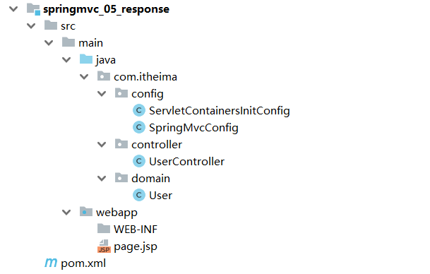

**4.6.2 响应页面**

（1）设置返回页面

<table>
<colgroup>
<col style="width: 100%" />
</colgroup>
<tbody>
<tr class="odd">
<td>Java 
@Controller 
public class UserController { 
 
@RequestMapping("/toJumpPage") 
//注意 
//1.此处不能添加@ResponseBody,如果加了该注入，会直接将page.jsp当字符串返回前端 
//2.方法需要返回String 
public String toJumpPage(){ 
System.out.println("跳转页面"); 
return "page.jsp"; 
} 
 
}</td>
</tr>
</tbody>
</table>

（2）启动程序测试

打开浏览器，访问http://localhost/toJumpPage

**4.6.3 返回文本数据**

（1）设置返回文本内容

<table>
<colgroup>
<col style="width: 100%" />
</colgroup>
<tbody>
<tr class="odd">
<td>Java 
@Controller 
public class UserController { 
 
@RequestMapping("/toText") 
//注意此处该注解就不能省略，如果省略了,会把response text当前页面名称去查找，如果没有回报404错误 
@ResponseBody 
public String toText(){ 
System.out.println("返回纯文本数据"); 
return "response text"; 
} 
 
}</td>
</tr>
</tbody>
</table>

（2）启动程序测试

此使用PostMan进行测试，输入地址http://localhost/toText

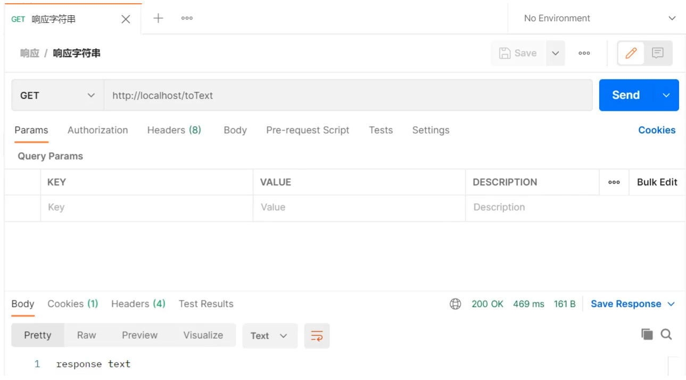

**4.6.4 响应JSON数据**

**响应POJO对象**

<table>
<colgroup>
<col style="width: 100%" />
</colgroup>
<tbody>
<tr class="odd">
<td>Java 
@Controller 
public class UserController { 
 
@RequestMapping("/toJsonPOJO") 
@ResponseBody 
public User toJsonPOJO(){ 
System.out.println("返回json对象数据"); 
User user = new User(); 
user.setName("itcast"); 
user.setAge(15); 
return user; 
} 
}</td>
</tr>
</tbody>
</table>

返回值为实体类对象，设置返回值为实体类类型，即可实现返回对应对象的json数据，需要依赖**@ResponseBody**注解和**@EnableWebMvc**注解。

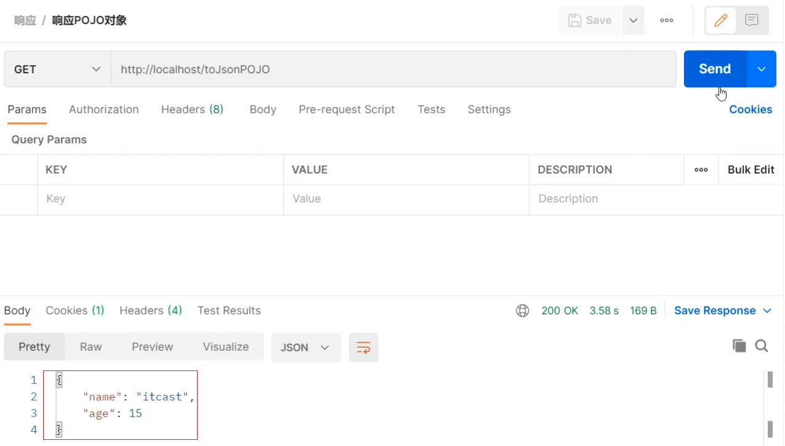

**响应POJO集合对象**

<table>
<colgroup>
<col style="width: 100%" />
</colgroup>
<tbody>
<tr class="odd">
<td>Java 
@Controller 
public class UserController { 
 
@RequestMapping("/toJsonList") 
@ResponseBody 
public List&lt;User&gt; toJsonList(){ 
System.out.println("返回json集合数据"); 
User user1 = new User(); 
user1.setName("传智播客"); 
user1.setAge(15); 
 
User user2 = new User(); 
user2.setName("黑马程序员"); 
user2.setAge(12); 
 
List&lt;User&gt; userList = new ArrayList&lt;User&gt;(); 
userList.add(user1); 
userList.add(user2); 
 
return userList; 
} 
 
}</td>
</tr>
</tbody>
</table>

重新启动服务器，访问http://localhost/toJsonList

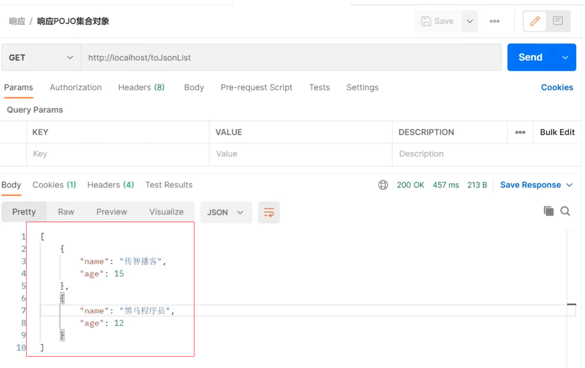

**@ResponseBody**

<table>
<colgroup>
<col style="width: 50%" />
<col style="width: 50%" />
</colgroup>
<tbody>
<tr class="odd">
<td>名称</td>
<td>@ResponseBody</td>
</tr>
<tr class="even">
<td>类型</td>
<td><strong>方法\类注解</strong></td>
</tr>
<tr class="odd">
<td>位置</td>
<td>SpringMVC控制器方法定义上方和控制类上</td>
</tr>
<tr class="even">
<td>作用</td>
<td>设置当前控制器返回值作为响应体， 
写在类上，该类的所有方法都有该注解功能</td>
</tr>
<tr class="odd">
<td>相关属性</td>
<td>pattern：指定日期时间格式字符串</td>
</tr>
</tbody>
</table>

该注解可以写在类上或者方法上

写在类上就是该类下的所有方法都有@ReponseBody功能

当方法上有@ReponseBody注解后

方法的返回值为字符串，会将其作为文本内容直接响应给前端

方法的返回值为对象，会将对象转换成JSON响应给前端

此处又使用到了类型转换，内部还是通过Converter接口的实现类完成的，所以Converter除了前面所说的功能外，它还可以实现 对象转Json数据 和 集合转Json数据。

**5.Rest风格**

**5.1 REST简介**

REST（Representational State Transfer），表现形式状态转换，它是一种软件架构**风格**。

当我们想表示一个网络资源的时候，可以使用两种方式：

传统风格资源描述形式

http://localhost/user/getById?id=1 查询id为1的用户信息

http://localhost/user/saveUser 保存用户信息

REST风格描述形式

http://localhost/user/1

http://localhost/user

传统方式一般是一个请求url对应一种操作，这样做不仅麻烦，也不安全。REST风格的描述请求地址变的简单，从而隐藏资源的访问行为，无法通过地址得知对资源是何种操作。

但是一个相同的url地址即可以是新增也可以是修改或者查询，按照REST风格访问资源时使用**行为动作**区分对资源区分是何种操作，即按照不同的请求方式代表不同的操作类型：

发送GET请求是用来做查询

发送POST请求是用来做新增

发送PUT请求是用来做修改

发送DELETE请求是用来做删除

**注意：**上述行为是约定方式，约定不是规范，可以打破，所以称REST风格，而不是REST规范，例如也可以使用GET请求做删除，只是这样代码就莫名其妙了。

描述模块的名称通常使用复数，也就是加s的格式描述，表示此类资源，而非单个资源，例如users、books、accounts

根据REST风格对资源进行访问称为**RESTful**。

后期在进行开发的过程中，大多是都是遵从REST风格访问后台服务，所以以后都是基于RESTful进行开发。

**5.2 RESTful入门案例**

**5.2.1 环境准备**

创建一个Web的Maven项目，pom.xml添加Spring依赖

<table>
<colgroup>
<col style="width: 100%" />
</colgroup>
<tbody>
<tr class="odd">
<td>XML 
&lt;?xml version="1.0" encoding="UTF-8"？&gt; 
 
&lt;project xmlns="http://maven.apache.org/POM/4.0.0" xmlns:xsi="http://www.w3.org/2001/XMLSchema-instance" 
xsi:schemaLocation="http://maven.apache.org/POM/4.0.0 http://maven.apache.org/xsd/maven-4.0.0.xsd"&gt; 
&lt;modelVersion&gt;4.0.0&lt;/modelVersion&gt; 
 
&lt;groupId&gt;com.itheima&lt;/groupId&gt; 
&lt;artifactId&gt;springmvc_06_rest&lt;/artifactId&gt; 
&lt;version&gt;1.0-SNAPSHOT&lt;/version&gt; 
&lt;packaging&gt;war&lt;/packaging&gt; 
 
&lt;dependencies&gt; 
&lt;dependency&gt; 
&lt;groupId&gt;javax.servlet&lt;/groupId&gt; 
&lt;artifactId&gt;javax.servlet-api&lt;/artifactId&gt; 
&lt;version&gt;3.1.0&lt;/version&gt; 
&lt;scope&gt;provided&lt;/scope&gt; 
&lt;/dependency&gt; 
&lt;dependency&gt; 
&lt;groupId&gt;org.springframework&lt;/groupId&gt; 
&lt;artifactId&gt;spring-webmvc&lt;/artifactId&gt; 
&lt;version&gt;5.2.10.RELEASE&lt;/version&gt; 
&lt;/dependency&gt; 
&lt;dependency&gt; 
&lt;groupId&gt;com.fasterxml.jackson.core&lt;/groupId&gt; 
&lt;artifactId&gt;jackson-databind&lt;/artifactId&gt; 
&lt;version&gt;2.9.0&lt;/version&gt; 
&lt;/dependency&gt; 
&lt;/dependencies&gt; 
 
&lt;build&gt; 
&lt;plugins&gt; 
&lt;plugin&gt; 
&lt;groupId&gt;org.apache.tomcat.maven&lt;/groupId&gt; 
&lt;artifactId&gt;tomcat7-maven-plugin&lt;/artifactId&gt; 
&lt;version&gt;2.1&lt;/version&gt; 
&lt;configuration&gt; 
&lt;port&gt;80&lt;/port&gt; 
&lt;path&gt;/&lt;/path&gt; 
&lt;/configuration&gt; 
&lt;/plugin&gt; 
&lt;/plugins&gt; 
&lt;/build&gt; 
&lt;/project&gt;</td>
</tr>
</tbody>
</table>

创建对应的配置类

<table>
<colgroup>
<col style="width: 100%" />
</colgroup>
<tbody>
<tr class="odd">
<td>Java 
public class ServletContainersInitConfig extends AbstractAnnotationConfigDispatcherServletInitializer { 
protected Class&lt;?&gt;[] getRootConfigClasses() { 
return new Class[0]; 
} 
 
protected Class&lt;?&gt;[] getServletConfigClasses() { 
return new Class[]{SpringMvcConfig.class}; 
} 
 
protected String[] getServletMappings() { 
return new String[]{"/"}; 
} 
 
//乱码处理 
@Override 
protected Filter[] getServletFilters() { 
CharacterEncodingFilter filter = new CharacterEncodingFilter(); 
filter.setEncoding("UTF-8"); 
return new Filter[]{filter}; 
} 
} 
 
@Configuration 
@ComponentScan("com.itheima.controller") 
//开启json数据类型自动转换 
@EnableWebMvc 
public class SpringMvcConfig { 
}</td>
</tr>
</tbody>
</table>

编写模型类User和Book

<table>
<colgroup>
<col style="width: 100%" />
</colgroup>
<tbody>
<tr class="odd">
<td>Java 
public class User { 
private String name; 
private int age; 
//getter...setter...toString省略 
} 
 
public class Book { 
private String name; 
private double price; 
//getter...setter...toString省略 
}</td>
</tr>
</tbody>
</table>

编写UserController和BookController

<table>
<colgroup>
<col style="width: 100%" />
</colgroup>
<tbody>
<tr class="odd">
<td>Java 
@Controller 
public class UserController { 
@RequestMapping("/save") 
@ResponseBody 
public String save(@RequestBody User user) { 
System.out.println("user save..."+user); 
return "{'module':'user save'}"; 
} 
 
@RequestMapping("/delete") 
@ResponseBody 
public String delete(Integer id) { 
System.out.println("user delete..." + id); 
return "{'module':'user delete'}"; 
} 
 
@RequestMapping("/update") 
@ResponseBody 
public String update(@RequestBody User user) { 
System.out.println("user update..." + user); 
return "{'module':'user update'}"; 
} 
 
@RequestMapping("/getById") 
@ResponseBody 
public String getById(Integer id) { 
System.out.println("user getById..." + id); 
return "{'module':'user getById'}"; 
} 
 
@RequestMapping("/findAll") 
@ResponseBody 
public String getAll() { 
System.out.println("user getAll..."); 
return "{'module':'user getAll'}"; 
} 
} 
 
 
@Controller 
public class BookController { 
 
@RequestMapping(value = "/books",method = RequestMethod.POST) 
@ResponseBody 
public String save(@RequestBody Book book){ 
System.out.println("book save..." + book); 
return "{'module':'book save'}"; 
} 
 
@RequestMapping(value = "/books/{id}",method = RequestMethod.DELETE) 
@ResponseBody 
public String delete(@PathVariable Integer id){ 
System.out.println("book delete..." + id); 
return "{'module':'book delete'}"; 
} 
 
@RequestMapping(value = "/books",method = RequestMethod.PUT) 
@ResponseBody 
public String update(@RequestBody Book book){ 
System.out.println("book update..." + book); 
return "{'module':'book update'}"; 
} 
 
@RequestMapping(value = "/books/{id}",method = RequestMethod.GET) 
@ResponseBody 
public String getById(@PathVariable Integer id){ 
System.out.println("book getById..." + id); 
return "{'module':'book getById'}"; 
} 
 
@RequestMapping(value = "/books",method = RequestMethod.GET) 
@ResponseBody 
public String getAll(){ 
System.out.println("book getAll..."); 
return "{'module':'book getAll'}"; 
} 
}</td>
</tr>
</tbody>
</table>

最终项目结构如下：

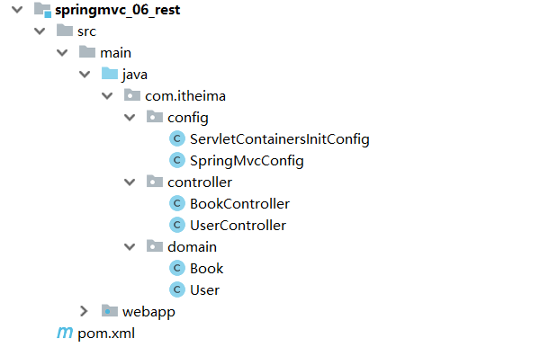

**5.2.2 修改RESTful风格**

**新增**

<table>
<colgroup>
<col style="width: 100%" />
</colgroup>
<tbody>
<tr class="odd">
<td>Java 
@Controller 
public class UserController { 
//设置当前请求方法为POST，表示REST风格中的添加操作 
@RequestMapping(value = "/users", method = RequestMethod.POST) 
@ResponseBody 
public String save() { 
System.out.println("user save..."); 
return "{'module':'user save'}"; 
} 
}</td>
</tr>
</tbody>
</table>

访问该方法使用 POST方式http://localhost/users，属性限定该方法的访问方式为POST，如果发送的不是POST请求，比如发送GET请求则会报错

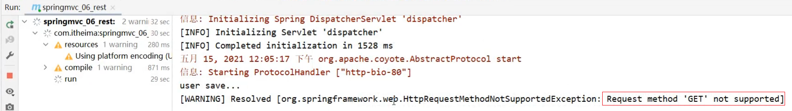

**删除**

<table>
<colgroup>
<col style="width: 100%" />
</colgroup>
<tbody>
<tr class="odd">
<td>Java 
@Controller 
public class UserController { 
//设置当前请求方法为DELETE，表示REST风格中的删除操作 
@RequestMapping(value = "/users",method = RequestMethod.DELETE) 
@ResponseBody 
public String delete(Integer id) { 
System.out.println("user delete..." + id); 
return "{'module':'user delete'}"; 
} 
}</td>
</tr>
</tbody>
</table>

访问该方法使用 DELETE方式http://localhost/users，访问成功，但是删除方法没有携带所要删除数据的id，RESTful的开发需要**传递路径参数**，前端发送请求的时候使用http://localhost/users/1，路径中的1就是要传递的参数。

后端获取路径参数，需要修改@RequestMapping的value属性，将其中修改为/users/{id}，目的是和路径匹配，并在方法的形参前添加**@PathVariable**注解：

<table>
<colgroup>
<col style="width: 100%" />
</colgroup>
<tbody>
<tr class="odd">
<td>Java 
@Controller 
public class UserController { 
//设置当前请求方法为DELETE，表示REST风格中的删除操作 
@RequestMapping(value = "/users/{id}",method = RequestMethod.DELETE) 
@ResponseBody 
public String delete(@PathVariable Integer id) { 
System.out.println("user delete..." + id); 
return "{'module':'user delete'}"; 
} 
}</td>
</tr>
</tbody>
</table>

如果方法形参的名称和路径{}中的值不一致，就需要在@PathVariable注解后添加属性或保持形参名和路径中的变量名一致：

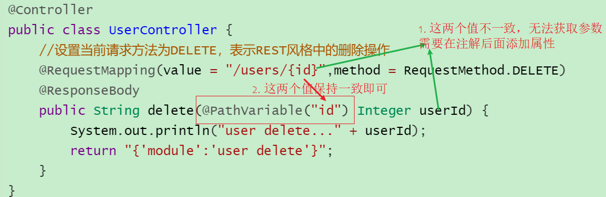

如果有多个参数需要传递，例如请求http://localhost/users/1/tom中的1和tom就是传递的两个参数，此时后端获取参数，需要做如下修改：

<table>
<colgroup>
<col style="width: 100%" />
</colgroup>
<tbody>
<tr class="odd">
<td>Java 
@Controller 
public class UserController { 
//设置当前请求方法为DELETE，表示REST风格中的删除操作 
@RequestMapping(value = "/users/{id}/{name}",method = RequestMethod.DELETE) 
@ResponseBody 
public String delete(@PathVariable Integer id,@PathVariable String name) { 
System.out.println("user delete..." + id+","+name); 
return "{'module':'user delete'}"; 
} 
}</td>
</tr>
</tbody>
</table>

**修改**

<table>
<colgroup>
<col style="width: 100%" />
</colgroup>
<tbody>
<tr class="odd">
<td>Java 
@Controller 
public class UserController { 
//设置当前请求方法为PUT，表示REST风格中的修改操作 
@RequestMapping(value = "/users",method = RequestMethod.PUT) 
@ResponseBody 
public String update(@RequestBody User user) { 
System.out.println("user update..." + user); 
return "{'module':'user update'}"; 
} 
}</td>
</tr>
</tbody>
</table>

访问该方法使用 PUT方式http://localhost/users，访问并携带参数：

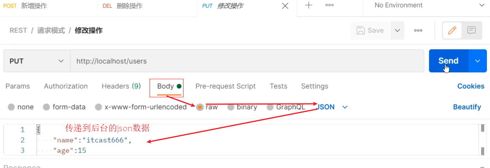

**根据ID查询**

<table>
<colgroup>
<col style="width: 100%" />
</colgroup>
<tbody>
<tr class="odd">
<td>Java 
@Controller 
public class UserController { 
//设置当前请求方法为GET，表示REST风格中的查询操作 
@RequestMapping(value = "/users/{id}" ,method = RequestMethod.GET) 
@ResponseBody 
public String getById(@PathVariable Integer id){ 
System.out.println("user getById..."+id); 
return "{'module':'user getById'}"; 
} 
}</td>
</tr>
</tbody>
</table>

访问该方法使用 GET方式http://localhost/users/666

**查询所有**

<table>
<colgroup>
<col style="width: 100%" />
</colgroup>
<tbody>
<tr class="odd">
<td>Java 
@Controller 
public class UserController { 
//设置当前请求方法为GET，表示REST风格中的查询操作 
@RequestMapping(value = "/users" ,method = RequestMethod.GET) 
@ResponseBody 
public String getAll() { 
System.out.println("user getAll..."); 
return "{'module':'user getAll'}"; 
} 
}</td>
</tr>
</tbody>
</table>

访问该方法使用 GET方式http://localhost/users

**小结**

（1）设定Http请求动作（动词）

<table>
<colgroup>
<col style="width: 100%" />
</colgroup>
<tbody>
<tr class="odd">
<td>Java 
@RequestMapping(value="",method = RequestMethod.POST|GET|PUT|DELETE)</td>
</tr>
</tbody>
</table>

（2）设定请求参数（路径变量）

<table>
<colgroup>
<col style="width: 100%" />
</colgroup>
<tbody>
<tr class="odd">
<td>Java 
@RequestMapping(value="/users/{id}",method = RequestMethod.DELETE) 
@ReponseBody 
public String delete(@PathVariable Integer id) { 
 
}</td>
</tr>
</tbody>
</table>

**@PathVariable**

|      |                                                                      |
|------|----------------------------------------------------------------------|
| 名称 | @PathVariable                                                        |
| 类型 | 形参注解                                                             |
| 位置 | SpringMVC控制器方法形参定义前面                                      |
| 作用 | 绑定路径参数与处理器方法形参间的关系，要求路径参数名与形参名一一对应 |

@RequestBody、@RequestParam、@PathVariable这三个注解之间的区别和应用：

区别

@RequestParam用于接收url地址传参或表单传参

@RequestBody用于接收json数据

@PathVariable用于接收路径参数，使用{参数名称}描述路径参数

应用

后期开发中，发送请求参数超过1个时，以json格式为主，@RequestBody应用较广

如果发送非json格式数据，选用@RequestParam接收请求参数

采用RESTful进行开发，当参数数量较少时，例如1个，可以采用@PathVariable接收请求路径变量，通常用于传递id值

**5.3 RESTful快速开发**

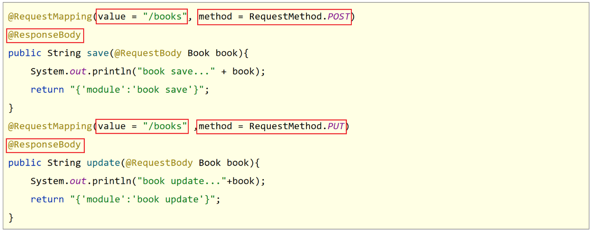

问题1：每个方法的@RequestMapping注解中都定义了访问路径/books，重复性太高。

解决方案：将@RequestMapping提到类上面，用来定义所有方法共同的访问路径

问题2：每个方法的@RequestMapping注解中都要使用method属性定义请求方式，重复性太高。

解决方案：使用@GetMapping、@PostMapping、@PutMapping、@DeleteMapping代替

问题3：每个方法响应json都需要加上@ResponseBody注解，重复性太高。

解决方案：

将ResponseBody提到类上面，让所有的方法都有@ResponseBody的功能

使用@RestController注解替换@Controller与@ResponseBody注解，简化书写

<table>
<colgroup>
<col style="width: 100%" />
</colgroup>
<tbody>
<tr class="odd">
<td>Java 
@RestController //@Controller + ReponseBody 
@RequestMapping("/books") 
public class BookController { 
 
//@RequestMapping(method = RequestMethod.POST) 
@PostMapping 
public String save(@RequestBody Book book){ 
System.out.println("book save..." + book); 
return "{'module':'book save'}"; 
} 
 
//@RequestMapping(value = "/{id}",method = RequestMethod.DELETE) 
@DeleteMapping("/{id}") 
public String delete(@PathVariable Integer id){ 
System.out.println("book delete..." + id); 
return "{'module':'book delete'}"; 
} 
 
//@RequestMapping(method = RequestMethod.PUT) 
@PutMapping 
public String update(@RequestBody Book book){ 
System.out.println("book update..." + book); 
return "{'module':'book update'}"; 
} 
 
//@RequestMapping(value = "/{id}",method = RequestMethod.GET) 
@GetMapping("/{id}") 
public String getById(@PathVariable Integer id){ 
System.out.println("book getById..." + id); 
return "{'module':'book getById'}"; 
} 
 
//@RequestMapping(method = RequestMethod.GET) 
@GetMapping 
public String getAll(){ 
System.out.println("book getAll..."); 
return "{'module':'book getAll'}"; 
} 
 
}</td>
</tr>
</tbody>
</table>

**@RestController**

|      |                                                                                 |
|------|---------------------------------------------------------------------------------|
| 名称 | @RestController                                                                 |
| 类型 | 类注解                                                                          |
| 位置 | 基于SpringMVC的RESTful开发控制器类定义上方                                      |
| 作用 | 设置当前控制器类为RESTful风格，等同于@Controller与@ResponseBody两个注解组合功能 |

**@GetMapping、@PostMapping、@PutMapping、@DeleteMapping**

|          |                                                                                            |
|----------|--------------------------------------------------------------------------------------------|
| 名称     | @GetMapping、@PostMapping、@PutMapping、@DeleteMapping                                     |
| 类型     | 方法注解                                                                                   |
| 位置     | 基于SpringMVC的RESTful开发控制器方法定义上方                                               |
| 作用     | 设置当前控制器方法请求访问路径与请求动作，每种对应一个请求动作，例如@GetMapping对应GET请求 |
| 相关属性 | value（默认）：请求访问路径                                                                |

**5.4 RESTful案例**

**5.4.1 需求分析**

图片列表查询：从后台返回数据，将数据展示在页面上

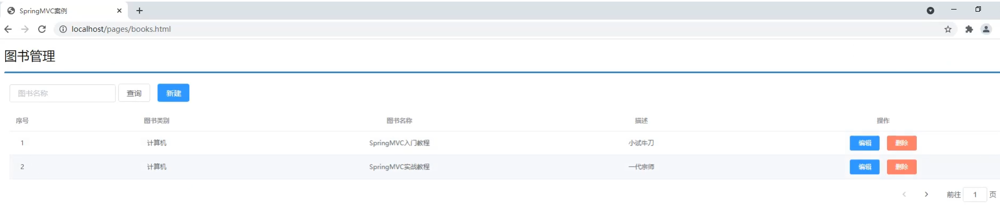

新增图片：将新增图书的数据传递到后台，并在控制台打印

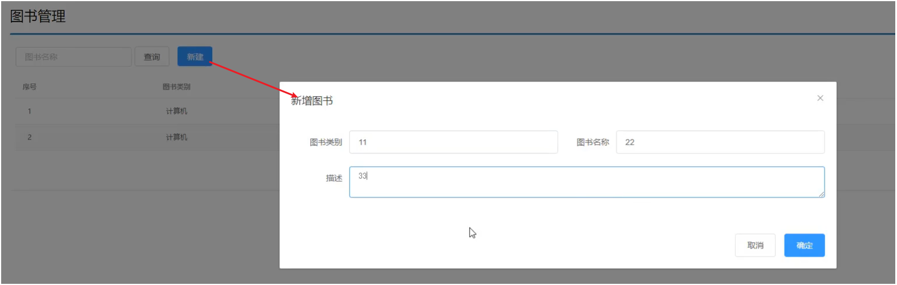

此次案例的重点是在SpringMVC中如何使用RESTful实现前后台交互，所以本案例并没有和数据库进行交互，所有数据使用假数据来完成开发。

**5.4.2 环境准备**

创建一个Web的Maven项目，pom.xml添加Spring依赖

<table>
<colgroup>
<col style="width: 100%" />
</colgroup>
<tbody>
<tr class="odd">
<td>XML 
&lt;?xml version="1.0" encoding="UTF-8"？&gt; 
 
&lt;project xmlns="http://maven.apache.org/POM/4.0.0" xmlns:xsi="http://www.w3.org/2001/XMLSchema-instance" 
xsi:schemaLocation="http://maven.apache.org/POM/4.0.0 http://maven.apache.org/xsd/maven-4.0.0.xsd"&gt; 
&lt;modelVersion&gt;4.0.0&lt;/modelVersion&gt; 
 
&lt;groupId&gt;com.itheima&lt;/groupId&gt; 
&lt;artifactId&gt;springmvc_07_rest_case&lt;/artifactId&gt; 
&lt;version&gt;1.0-SNAPSHOT&lt;/version&gt; 
&lt;packaging&gt;war&lt;/packaging&gt; 
 
&lt;dependencies&gt; 
&lt;dependency&gt; 
&lt;groupId&gt;javax.servlet&lt;/groupId&gt; 
&lt;artifactId&gt;javax.servlet-api&lt;/artifactId&gt; 
&lt;version&gt;3.1.0&lt;/version&gt; 
&lt;scope&gt;provided&lt;/scope&gt; 
&lt;/dependency&gt; 
&lt;dependency&gt; 
&lt;groupId&gt;org.springframework&lt;/groupId&gt; 
&lt;artifactId&gt;spring-webmvc&lt;/artifactId&gt; 
&lt;version&gt;5.2.10.RELEASE&lt;/version&gt; 
&lt;/dependency&gt; 
&lt;dependency&gt; 
&lt;groupId&gt;com.fasterxml.jackson.core&lt;/groupId&gt; 
&lt;artifactId&gt;jackson-databind&lt;/artifactId&gt; 
&lt;version&gt;2.9.0&lt;/version&gt; 
&lt;/dependency&gt; 
&lt;/dependencies&gt; 
 
&lt;build&gt; 
&lt;plugins&gt; 
&lt;plugin&gt; 
&lt;groupId&gt;org.apache.tomcat.maven&lt;/groupId&gt; 
&lt;artifactId&gt;tomcat7-maven-plugin&lt;/artifactId&gt; 
&lt;version&gt;2.1&lt;/version&gt; 
&lt;configuration&gt; 
&lt;port&gt;80&lt;/port&gt; 
&lt;path&gt;/&lt;/path&gt; 
&lt;/configuration&gt; 
&lt;/plugin&gt; 
&lt;/plugins&gt; 
&lt;/build&gt; 
&lt;/project&gt;</td>
</tr>
</tbody>
</table>

创建对应的配置类

<table>
<colgroup>
<col style="width: 100%" />
</colgroup>
<tbody>
<tr class="odd">
<td>Java 
public class ServletContainersInitConfig extends AbstractAnnotationConfigDispatcherServletInitializer { 
protected Class&lt;?&gt;[] getRootConfigClasses() { 
return new Class[0]; 
} 
 
protected Class&lt;?&gt;[] getServletConfigClasses() { 
return new Class[]{SpringMvcConfig.class}; 
} 
 
protected String[] getServletMappings() { 
return new String[]{"/"}; 
} 
 
//乱码处理 
@Override 
protected Filter[] getServletFilters() { 
CharacterEncodingFilter filter = new CharacterEncodingFilter(); 
filter.setEncoding("UTF-8"); 
return new Filter[]{filter}; 
} 
} 
 
@Configuration 
@ComponentScan("com.itheima.controller") 
//开启json数据类型自动转换 
@EnableWebMvc 
public class SpringMvcConfig { 
}</td>
</tr>
</tbody>
</table>

编写模型类Book

<table>
<colgroup>
<col style="width: 100%" />
</colgroup>
<tbody>
<tr class="odd">
<td>Java 
public class Book { 
private Integer id; 
private String type; 
private String name; 
private String description; 
//setter...getter...toString略 
}</td>
</tr>
</tbody>
</table>

编写BookController

<table>
<colgroup>
<col style="width: 100%" />
</colgroup>
<tbody>
<tr class="odd">
<td>Java 
@Controller 
public class BookController { 
 
 
}</td>
</tr>
</tbody>
</table>

最终项目结构如下：

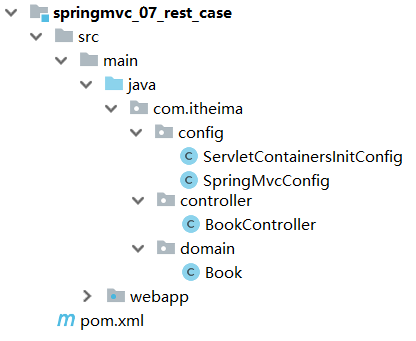

**5.4.3 后台接口开发**

（1）编写Controller类并使用RESTful进行配置

<table>
<colgroup>
<col style="width: 100%" />
</colgroup>
<tbody>
<tr class="odd">
<td>Java 
@RestController 
@RequestMapping("/books") 
public class BookController { 
 
@PostMapping 
public String save(@RequestBody Book book){ 
System.out.println("book save ==&gt; "+ book); 
return "{'module':'book save success'}"; 
} 
 
@GetMapping 
public List&lt;Book&gt; getAll(){ 
System.out.println("book getAll is running ..."); 
List&lt;Book&gt; bookList = new ArrayList&lt;Book&gt;(); 
 
Book book1 = new Book(); 
book1.setType("计算机"); 
book1.setName("SpringMVC入门教程"); 
book1.setDescription("小试牛刀"); 
bookList.add(book1); 
 
Book book2 = new Book(); 
book2.setType("计算机"); 
book2.setName("SpringMVC实战教程"); 
book2.setDescription("一代宗师"); 
bookList.add(book2); 
 
Book book3 = new Book(); 
book3.setType("计算机丛书"); 
book3.setName("SpringMVC实战教程进阶"); 
book3.setDescription("一代宗师呕心创作"); 
bookList.add(book3); 
 
return bookList; 
} 
 
}</td>
</tr>
</tbody>
</table>

（2）使用PostMan进行测试

测试新增

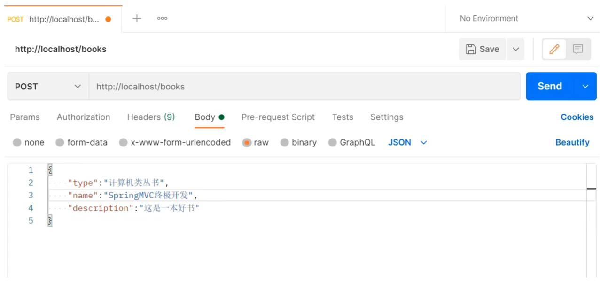

测试查询

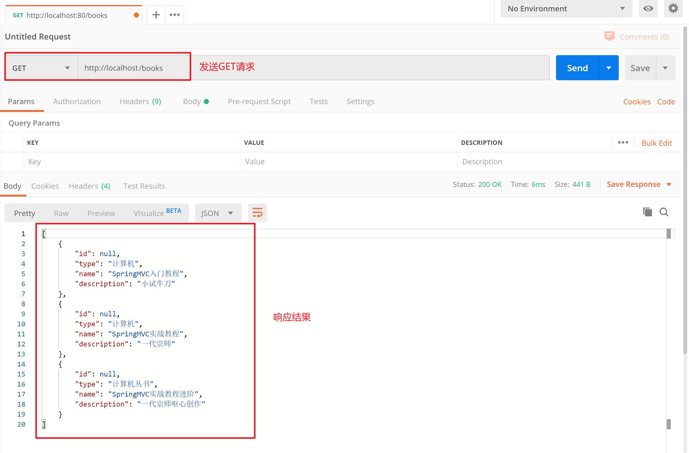

**5.4.4 页面访问处理**

（1）拷贝静态页面

**\[功能页面.zip\]**

将资料中的功能页面文件夹下所有内容拷贝到项目的webapp目录下

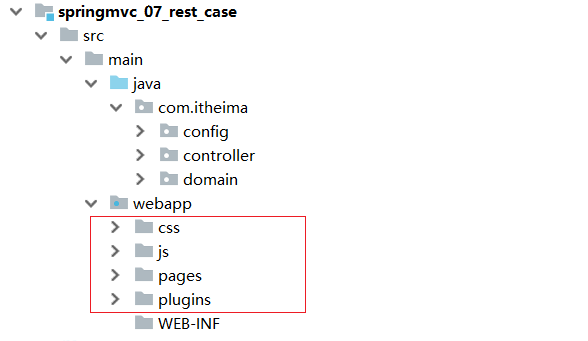

（2）访问pages目录下的books.html

打开浏览器访问http://localhost/pages/books.html

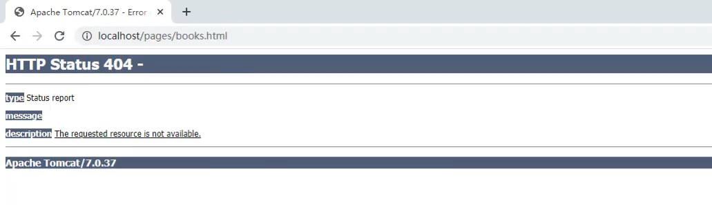

会发现出现了404错误，原因是SpringMVC拦截了静态资源，根据/pages/books.html去controller找对应的方法，找不到所以会报404的错误

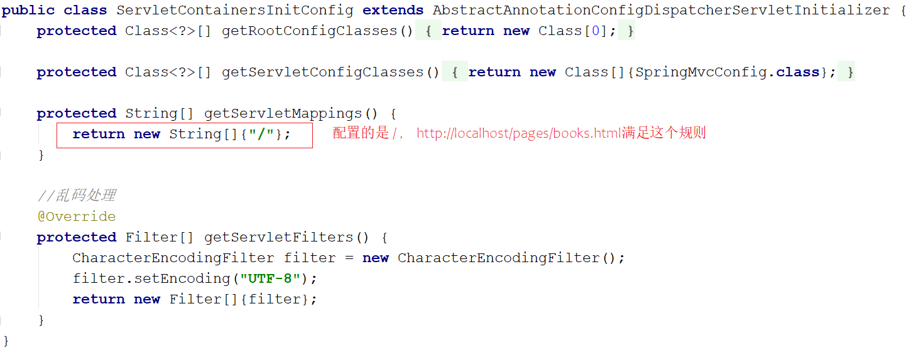

所以SpringMVC需要将静态资源进行放行

<table>
<colgroup>
<col style="width: 100%" />
</colgroup>
<tbody>
<tr class="odd">
<td>Java 
@Configuration 
public class SpringMvcSupport extends WebMvcConfigurationSupport { 
//设置静态资源访问过滤，当前类需要设置为配置类，并被扫描加载 
@Override 
protected void addResourceHandlers(ResourceHandlerRegistry registry) { 
//当访问/pages/？???时候，从/pages目录下查找内容 
registry.addResourceHandler("/pages/**").addResourceLocations("/pages/"); 
registry.addResourceHandler("/js/**").addResourceLocations("/js/"); 
registry.addResourceHandler("/css/**").addResourceLocations("/css/"); 
registry.addResourceHandler("/plugins/**").addResourceLocations("/plugins/"); 
} 
}</td>
</tr>
</tbody>
</table>

该配置类是在config目录下，SpringMVC扫描的是controller包，所以该配置类还未生效，要想生效需要将SpringMvcConfig配置类进行修改

<table>
<colgroup>
<col style="width: 100%" />
</colgroup>
<tbody>
<tr class="odd">
<td>Java 
@Configuration 
@ComponentScan({"com.itheima.controller","com.itheima.config"}) 
@EnableWebMvc 
public class SpringMvcConfig { 
} 
 
或者 
 
@Configuration 
@ComponentScan("com.itheima") 
@EnableWebMvc 
public class SpringMvcConfig { 
}</td>
</tr>
</tbody>
</table>

（3）修改books.html页面

<table>
<colgroup>
<col style="width: 100%" />
</colgroup>
<tbody>
<tr class="odd">
<td>HTML 
&lt;!DOCTYPE html&gt; 
 
&lt;html&gt; 
&lt;head&gt; 
&lt;!-- 页面meta --&gt; 
&lt;meta charset="utf-8"&gt; 
&lt;title&gt;SpringMVC案例&lt;/title&gt; 
&lt;!-- 引入样式 --&gt; 
&lt;link rel="stylesheet" href="../plugins/elementui/index.css"&gt; 
&lt;link rel="stylesheet" href="../plugins/font-awesome/css/font-awesome.min.css"&gt; 
&lt;link rel="stylesheet" href="../css/style.css"&gt; 
&lt;/head&gt; 
 
&lt;body class="hold-transition"&gt; 
 
&lt;div id="app"&gt; 
 
&lt;div class="content-header"&gt; 
&lt;h1&gt;图书管理&lt;/h1&gt; 
&lt;/div&gt; 
 
&lt;div class="app-container"&gt; 
&lt;div class="box"&gt; 
&lt;div class="filter-container"&gt; 
&lt;el-input placeholder="图书名称" style="width: 200px;" class="filter-item"&gt;&lt;/el-input&gt; 
&lt;el-button class="dalfBut"&gt;查询&lt;/el-button&gt; 
&lt;el-button type="primary" class="butT" @click="openSave()"&gt;新建&lt;/el-button&gt; 
&lt;/div&gt; 
 
&lt;el-table size="small" current-row-key="id" :data="dataList" stripe highlight-current-row&gt; 
&lt;el-table-column type="index" align="center" label="序号"&gt;&lt;/el-table-column&gt; 
&lt;el-table-column prop="type" label="图书类别" align="center"&gt;&lt;/el-table-column&gt; 
&lt;el-table-column prop="name" label="图书名称" align="center"&gt;&lt;/el-table-column&gt; 
&lt;el-table-column prop="description" label="描述" align="center"&gt;&lt;/el-table-column&gt; 
&lt;el-table-column label="操作" align="center"&gt; 
&lt;template slot-scope="scope"&gt; 
&lt;el-button type="primary" size="mini"&gt;编辑&lt;/el-button&gt; 
&lt;el-button size="mini" type="danger"&gt;删除&lt;/el-button&gt; 
&lt;/template&gt; 
&lt;/el-table-column&gt; 
&lt;/el-table&gt; 
 
&lt;div class="pagination-container"&gt; 
&lt;el-pagination 
class="pagiantion" 
@current-change="handleCurrentChange" 
:current-page="pagination.currentPage" 
:page-size="pagination.pageSize" 
layout="total, prev, pager, next, jumper" 
:total="pagination.total"&gt; 
&lt;/el-pagination&gt; 
&lt;/div&gt; 
 
&lt;!-- 新增标签弹层 --&gt; 
&lt;div class="add-form"&gt; 
&lt;el-dialog title="新增图书" :visible.sync="dialogFormVisible"&gt; 
&lt;el-form ref="dataAddForm" :model="formData" :rules="rules" label-position="right" label-width="100px"&gt; 
&lt;el-row&gt; 
&lt;el-col :span="12"&gt; 
&lt;el-form-item label="图书类别" prop="type"&gt; 
&lt;el-input v-model="formData.type"/&gt; 
&lt;/el-form-item&gt; 
&lt;/el-col&gt; 
&lt;el-col :span="12"&gt; 
&lt;el-form-item label="图书名称" prop="name"&gt; 
&lt;el-input v-model="formData.name"/&gt; 
&lt;/el-form-item&gt; 
&lt;/el-col&gt; 
&lt;/el-row&gt; 
&lt;el-row&gt; 
&lt;el-col :span="24"&gt; 
&lt;el-form-item label="描述"&gt; 
&lt;el-input v-model="formData.description" type="textarea"&gt;&lt;/el-input&gt; 
&lt;/el-form-item&gt; 
&lt;/el-col&gt; 
&lt;/el-row&gt; 
&lt;/el-form&gt; 
&lt;div slot="footer" class="dialog-footer"&gt; 
&lt;el-button @click="dialogFormVisible = false"&gt;取消&lt;/el-button&gt; 
&lt;el-button type="primary" @click="saveBook()"&gt;确定&lt;/el-button&gt; 
&lt;/div&gt; 
&lt;/el-dialog&gt; 
&lt;/div&gt; 
 
&lt;/div&gt; 
&lt;/div&gt; 
&lt;/div&gt; 
&lt;/body&gt; 
 
&lt;!-- 引入组件库 --&gt; 
&lt;script src="../js/vue.js"&gt;&lt;/script&gt; 
&lt;script src="../plugins/elementui/index.js"&gt;&lt;/script&gt; 
&lt;script type="text/javascript" src="../js/jquery.min.js"&gt;&lt;/script&gt; 
&lt;script src="../js/axios-0.18.0.js"&gt;&lt;/script&gt; 
 
&lt;script&gt; 
var vue = new Vue({ 
 
el: '#app', 
 
 
data:{ 
dataList: [],//当前页要展示的分页列表数据 
formData: {},//表单数据 
dialogFormVisible: false,//增加表单是否可见 
dialogFormVisible4Edit:false,//编辑表单是否可见 
pagination: {},//分页模型数据，暂时弃用 
}, 
 
//钩子函数，VUE对象初始化完成后自动执行 
created() { 
this.getAll(); 
}, 
 
methods: { 
// 重置表单 
resetForm() { 
//清空输入框 
this.formData = {}; 
}, 
 
// 弹出添加窗口 
openSave() { 
this.dialogFormVisible = true; 
this.resetForm(); 
}, 
 
//添加 
saveBook () { 
axios.post("/books",this.formData).then((res)=&gt;{ 
 
}); 
}, 
 
//主页列表查询 
getAll() { 
axios.get("/books").then((res)=&gt;{ 
this.dataList = res.data; 
}); 
}, 
 
} 
}) 
&lt;/script&gt; 
&lt;/html&gt;</td>
</tr>
</tbody>
</table>

**6.SSM整合**

**6.1 流程分析**

（1）创建工程

创建一个Maven的web工程

pom.xml添加SSM需要的依赖jar包

编写Web项目的入口配置类，实现AbstractAnnotationConfigDispatcherServletInitializer重写以下方法

getRootConfigClasses()：返回Spring的配置类，需要SpringConfig配置类

getServletConfigClasses()：返回SpringMVC的配置类，需要SpringMvcConfig配置类

getServletMappings()：设置SpringMVC请求拦截路径规则

getServletFilters()：设置过滤器，解决POST请求中文乱码问题

（2）SSM整合【重点是各个配置的编写】

SpringConfig

标识该类为配置类 @Configuration

扫描Service所在的包 @ComponentScan

在Service层要管理事务 @EnableTransactionManagement

读取外部的properties配置文件 @PropertySource

整合Mybatis需要引入Mybatis相关配置类 @Import

第三方数据源配置类 JdbcConfig

构建DataSource数据源，DruidDataSouroce,需要注入数据库连接四要素， @Bean @Value

构建平台事务管理器，DataSourceTransactionManager，@Bean

Mybatis配置类 MybatisConfig

构建SqlSessionFactoryBean并设置别名扫描与数据源，@Bean

构建MapperScannerConfigurer并设置DAO层的包扫描

SpringMvcConfig

标识该类为配置类 @Configuration

扫描Controller所在的包 @ComponentScan

开启SpringMVC注解支持 @EnableWebMvc

（3）功能模块【与具体的业务模块有关】

创建数据库表

根据数据库表创建对应的模型类

通过Dao层完成数据库表的增删改查（接口 + 自动代理）

编写Service层【Service接口 + 实现类】

@Service

@Transactional

整合Junit对业务层进行单元测试

@RunWith

@ContextConfiguration

@Test

编写Controller层

接收请求 @RequestMapping @GetMapping @PostMapping @PutMapping @DeleteMapping

接收数据 简单、POJO、嵌套POJO、集合、数组、JSON数据类型

@RequestParam

@PathVariable

@RequestBody

转发业务层

@Autowired

响应结果

@ResponseBody

**6.2 整合配置**

（1）创建Maven的web项目

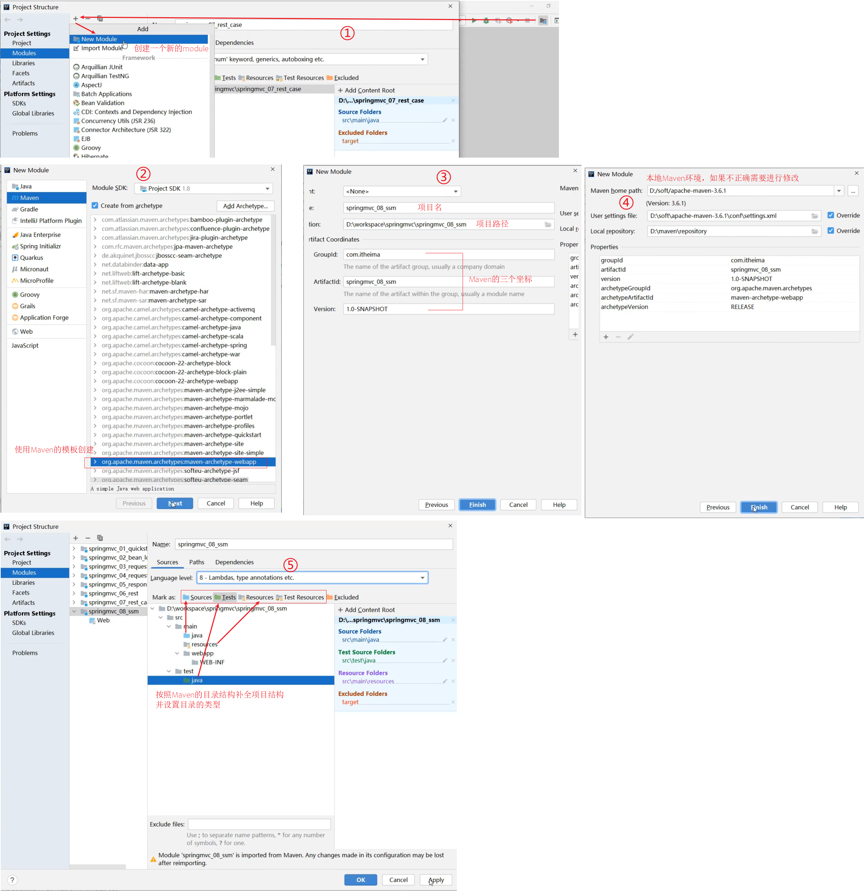

（2）添加依赖

<table>
<colgroup>
<col style="width: 100%" />
</colgroup>
<tbody>
<tr class="odd">
<td>XML 
&lt;?xml version="1.0" encoding="UTF-8"?&gt; 
 
&lt;project xmlns="http://maven.apache.org/POM/4.0.0" xmlns:xsi="http://www.w3.org/2001/XMLSchema-instance" 
xsi:schemaLocation="http://maven.apache.org/POM/4.0.0 http://maven.apache.org/xsd/maven-4.0.0.xsd"&gt; 
&lt;modelVersion&gt;4.0.0&lt;/modelVersion&gt; 
 
&lt;groupId&gt;com.itheima&lt;/groupId&gt; 
&lt;artifactId&gt;springmvc_08_ssm&lt;/artifactId&gt; 
&lt;version&gt;1.0-SNAPSHOT&lt;/version&gt; 
&lt;packaging&gt;war&lt;/packaging&gt; 
 
&lt;dependencies&gt; 
&lt;dependency&gt; 
&lt;groupId&gt;org.springframework&lt;/groupId&gt; 
&lt;artifactId&gt;spring-webmvc&lt;/artifactId&gt; 
&lt;version&gt;5.2.10.RELEASE&lt;/version&gt; 
&lt;/dependency&gt; 
 
&lt;dependency&gt; 
&lt;groupId&gt;org.springframework&lt;/groupId&gt; 
&lt;artifactId&gt;spring-jdbc&lt;/artifactId&gt; 
&lt;version&gt;5.2.10.RELEASE&lt;/version&gt; 
&lt;/dependency&gt; 
 
&lt;dependency&gt; 
&lt;groupId&gt;org.springframework&lt;/groupId&gt; 
&lt;artifactId&gt;spring-test&lt;/artifactId&gt; 
&lt;version&gt;5.2.10.RELEASE&lt;/version&gt; 
&lt;/dependency&gt; 
 
&lt;dependency&gt; 
&lt;groupId&gt;org.mybatis&lt;/groupId&gt; 
&lt;artifactId&gt;mybatis&lt;/artifactId&gt; 
&lt;version&gt;3.5.6&lt;/version&gt; 
&lt;/dependency&gt; 
 
&lt;dependency&gt; 
&lt;groupId&gt;org.mybatis&lt;/groupId&gt; 
&lt;artifactId&gt;mybatis-spring&lt;/artifactId&gt; 
&lt;version&gt;1.3.0&lt;/version&gt; 
&lt;/dependency&gt; 
 
&lt;dependency&gt; 
&lt;groupId&gt;mysql&lt;/groupId&gt; 
&lt;artifactId&gt;mysql-connector-java&lt;/artifactId&gt; 
&lt;version&gt;5.1.47&lt;/version&gt; 
&lt;/dependency&gt; 
 
&lt;dependency&gt; 
&lt;groupId&gt;com.alibaba&lt;/groupId&gt; 
&lt;artifactId&gt;druid&lt;/artifactId&gt; 
&lt;version&gt;1.1.16&lt;/version&gt; 
&lt;/dependency&gt; 
 
&lt;dependency&gt; 
&lt;groupId&gt;junit&lt;/groupId&gt; 
&lt;artifactId&gt;junit&lt;/artifactId&gt; 
&lt;version&gt;4.12&lt;/version&gt; 
&lt;scope&gt;test&lt;/scope&gt; 
&lt;/dependency&gt; 
 
&lt;dependency&gt; 
&lt;groupId&gt;javax.servlet&lt;/groupId&gt; 
&lt;artifactId&gt;javax.servlet-api&lt;/artifactId&gt; 
&lt;version&gt;3.1.0&lt;/version&gt; 
&lt;scope&gt;provided&lt;/scope&gt; 
&lt;/dependency&gt; 
 
&lt;dependency&gt; 
&lt;groupId&gt;com.fasterxml.jackson.core&lt;/groupId&gt; 
&lt;artifactId&gt;jackson-databind&lt;/artifactId&gt; 
&lt;version&gt;2.9.0&lt;/version&gt; 
&lt;/dependency&gt; 
&lt;/dependencies&gt; 
 
&lt;build&gt; 
&lt;plugins&gt; 
&lt;plugin&gt; 
&lt;groupId&gt;org.apache.tomcat.maven&lt;/groupId&gt; 
&lt;artifactId&gt;tomcat7-maven-plugin&lt;/artifactId&gt; 
&lt;version&gt;2.1&lt;/version&gt; 
&lt;configuration&gt; 
&lt;port&gt;80&lt;/port&gt; 
&lt;path&gt;/&lt;/path&gt; 
&lt;/configuration&gt; 
&lt;/plugin&gt; 
&lt;/plugins&gt; 
&lt;/build&gt; 
&lt;/project&gt;</td>
</tr>
</tbody>
</table>

（3）创建项目包结构

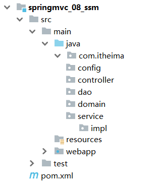

config目录存放的是相关的配置类

controller编写的是Controller类

dao存放的是Dao接口，因为使用的是Mapper接口代理方式，所以没有实现类包

service存的是Service接口，impl存放的是Service实现类

resources存入的是配置文件，如Jdbc.properties

webapp目录可以存放静态资源

test/java存放的是测试类

（4）创建SpringConfig配置类

<table>
<colgroup>
<col style="width: 100%" />
</colgroup>
<tbody>
<tr class="odd">
<td>Java 
@Configuration 
@ComponentScan({"com.itheima.service"}) 
@PropertySource("classpath:jdbc.properties") 
@Import({JdbcConfig.class,MyBatisConfig.class}) 
@EnableTransactionManagement 
public class SpringConfig { 
}</td>
</tr>
</tbody>
</table>

（5）创建JdbcConfig配置类

<table>
<colgroup>
<col style="width: 100%" />
</colgroup>
<tbody>
<tr class="odd">
<td>Java 
public class JdbcConfig { 
@Value("${jdbc.driver}") 
private String driver; 
@Value("${jdbc.url}") 
private String url; 
@Value("${jdbc.username}") 
private String username; 
@Value("${jdbc.password}") 
private String password; 
 
@Bean 
public DataSource dataSource(){ 
DruidDataSource dataSource = new DruidDataSource(); 
dataSource.setDriverClassName(driver); 
dataSource.setUrl(url); 
dataSource.setUsername(username); 
dataSource.setPassword(password); 
return dataSource; 
} 
 
@Bean 
public PlatformTransactionManager transactionManager(DataSource dataSource){ 
DataSourceTransactionManager ds = new DataSourceTransactionManager(); 
ds.setDataSource(dataSource); 
return ds; 
} 
}</td>
</tr>
</tbody>
</table>

（6）创建MybatisConfig配置类

<table>
<colgroup>
<col style="width: 100%" />
</colgroup>
<tbody>
<tr class="odd">
<td>Java 
public class MyBatisConfig { 
@Bean 
public SqlSessionFactoryBean sqlSessionFactory(DataSource dataSource){ 
SqlSessionFactoryBean factoryBean = new SqlSessionFactoryBean(); 
factoryBean.setDataSource(dataSource); 
factoryBean.setTypeAliasesPackage("com.itheima.domain"); 
return factoryBean; 
} 
 
@Bean 
public MapperScannerConfigurer mapperScannerConfigurer(){ 
MapperScannerConfigurer msc = new MapperScannerConfigurer(); 
msc.setBasePackage("com.itheima.dao"); 
return msc; 
} 
}</td>
</tr>
</tbody>
</table>

（7）创建jdbc.properties

在resources下提供jdbc.properties,设置数据库连接四要素

<table>
<colgroup>
<col style="width: 100%" />
</colgroup>
<tbody>
<tr class="odd">
<td>Plaintext 
jdbc.driver=com.mysql.jdbc.Driver 
jdbc.url=jdbc:mysql://localhost:3306/ssm_db 
jdbc.username=root 
jdbc.password=root</td>
</tr>
</tbody>
</table>

（8）创建SpringMVC配置类

<table>
<colgroup>
<col style="width: 100%" />
</colgroup>
<tbody>
<tr class="odd">
<td>Java 
@Configuration 
@ComponentScan("com.itheima.controller") 
@EnableWebMvc 
public class SpringMvcConfig { 
}</td>
</tr>
</tbody>
</table>

（9）创建Web项目入口配置类

<table>
<colgroup>
<col style="width: 100%" />
</colgroup>
<tbody>
<tr class="odd">
<td>Java 
public class ServletConfig extends AbstractAnnotationConfigDispatcherServletInitializer { 
//加载Spring配置类 
protected Class&lt;?&gt;[] getRootConfigClasses() { 
return new Class[]{SpringConfig.class}; 
} 
//加载SpringMVC配置类 
protected Class&lt;?&gt;[] getServletConfigClasses() { 
return new Class[]{SpringMvcConfig.class}; 
} 
//设置SpringMVC请求地址拦截规则 
protected String[] getServletMappings() { 
return new String[]{"/"}; 
} 
//设置post请求中文乱码过滤器 
@Override 
protected Filter[] getServletFilters() { 
CharacterEncodingFilter filter = new CharacterEncodingFilter(); 
filter.setEncoding("utf-8"); 
return new Filter[]{filter}; 
} 
}</td>
</tr>
</tbody>
</table>

**6.3 功能模块开发**

对表tbl_book进行新增、修改、删除、根据ID查询和查询所有。

（1）创建数据库及表

<table>
<colgroup>
<col style="width: 100%" />
</colgroup>
<tbody>
<tr class="odd">
<td>SQL 
create database ssm_db character set utf8; 
use ssm_db; 
create table tbl_book( 
id int primary key auto_increment, 
type varchar(20), 
name varchar(50), 
description varchar(255) 
) 
 
insert into `tbl_book`(`id`,`type`,`name`,`description`) values (1,'计算机理论','Spring实战 第五版','Spring入门经典教程，深入理解Spring原理技术内幕'),(2,'计算机理论','Spring 5核心原理与30个类手写实践','十年沉淀之作，手写Spring精华思想'),(3,'计算机理论','Spring 5设计模式','深入Spring源码刨析Spring源码中蕴含的10大设计模式'),(4,'计算机理论','Spring MVC+Mybatis开发从入门到项目实战','全方位解析面向Web应用的轻量级框架，带你成为Spring MVC开发高手'),(5,'计算机理论','轻量级Java Web企业应用实战','源码级刨析Spring框架，适合已掌握Java基础的读者'),(6,'计算机理论','Java核心技术 卷Ⅰ 基础知识(原书第11版)','Core Java第11版，Jolt大奖获奖作品，针对Java SE9、10、11全面更新'),(7,'计算机理论','深入理解Java虚拟机','5个纬度全面刨析JVM,大厂面试知识点全覆盖'),(8,'计算机理论','Java编程思想(第4版)','Java学习必读经典，殿堂级著作！赢得了全球程序员的广泛赞誉'),(9,'计算机理论','零基础学Java(全彩版)','零基础自学编程的入门图书，由浅入深，详解Java语言的编程思想和核心技术'),(10,'市场营销','直播就这么做:主播高效沟通实战指南','李子柒、李佳奇、薇娅成长为网红的秘密都在书中'),(11,'市场营销','直播销讲实战一本通','和秋叶一起学系列网络营销书籍'),(12,'市场营销','直播带货:淘宝、天猫直播从新手到高手','一本教你如何玩转直播的书，10堂课轻松实现带货月入3W+');</td>
</tr>
</tbody>
</table>

（2）编写模型类

<table>
<colgroup>
<col style="width: 100%" />
</colgroup>
<tbody>
<tr class="odd">
<td>Java 
public class Book { 
private Integer id; 
private String type; 
private String name; 
private String description; 
//getter...setter...toString省略 
}</td>
</tr>
</tbody>
</table>

（3）编写Dao接口

<table>
<colgroup>
<col style="width: 100%" />
</colgroup>
<tbody>
<tr class="odd">
<td>Java 
public interface BookDao { 
 
// @Insert("insert into tbl_book values(null,#{type},#{name},#{description})") 
@Insert("insert into tbl_book (type,name,description) values(#{type},#{name},#{description})") 
public void save(Book book); 
 
@Update("update tbl_book set type = #{type}, name = #{name}, description = #{description} where id = #{id}") 
public void update(Book book); 
 
@Delete("delete from tbl_book where id = #{id}") 
public void delete(Integer id); 
 
@Select("select * from tbl_book where id = #{id}") 
public Book getById(Integer id); 
 
@Select("select * from tbl_book") 
public List&lt;Book&gt; getAll(); 
}</td>
</tr>
</tbody>
</table>

（4）编写Service接口和实现类

<table>
<colgroup>
<col style="width: 100%" />
</colgroup>
<tbody>
<tr class="odd">
<td>Java 
@Transactional 
public interface BookService { 
/** 
* 保存 
* @param book 
* @return 
*/ 
public boolean save(Book book); 
 
/** 
* 修改 
* @param book 
* @return 
*/ 
public boolean update(Book book); 
 
/** 
* 按id删除 
* @param id 
* @return 
*/ 
public boolean delete(Integer id); 
 
/** 
* 按id查询 
* @param id 
* @return 
*/ 
public Book getById(Integer id); 
 
/** 
* 查询全部 
* @return 
*/ 
public List&lt;Book&gt; getAll(); 
}</td>
</tr>
</tbody>
</table>

<table>
<colgroup>
<col style="width: 100%" />
</colgroup>
<tbody>
<tr class="odd">
<td>Java 
@Service 
public class BookServiceImpl implements BookService { 
@Autowired 
private BookDao bookDao; 
 
public boolean save(Book book) { 
bookDao.save(book); 
return true; 
} 
 
public boolean update(Book book) { 
bookDao.update(book); 
return true; 
} 
 
public boolean delete(Integer id) { 
bookDao.delete(id); 
return true; 
} 
 
public Book getById(Integer id) { 
return bookDao.getById(id); 
} 
 
public List&lt;Book&gt; getAll() { 
return bookDao.getAll(); 
} 
}</td>
</tr>
</tbody>
</table>

bookDao在Service中注入的地方会提示一个红线，这时因为BookDao是一个接口，没有实现类，接口是不能创建对象的，所以最终注入的应该是代理对象，但是代理对象是由Spring的IOC容器来创建管理的，而IOC容器又是在Web服务器启动的时候才会创建，IDEA在检测依赖关系的时候，没有找到适合的类注入，所以会提示错误提示，但程序运行的时候，代理对象就会被创建，框架会使用DI进行注入，所以程序运行无影响，这个问题可以不用理会，或设置错误提示级别。

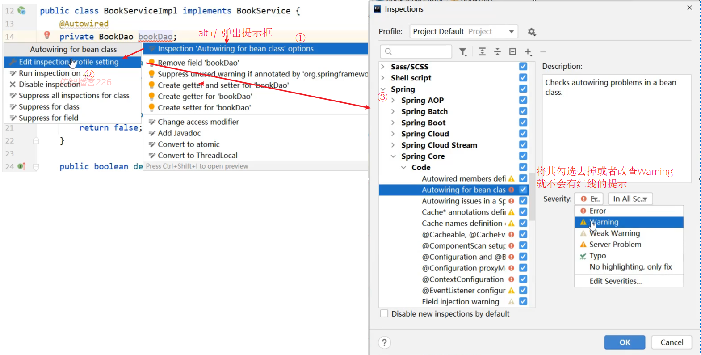

（5）编写Contorller类

<table>
<colgroup>
<col style="width: 100%" />
</colgroup>
<tbody>
<tr class="odd">
<td>Java 
@RestController 
@RequestMapping("/books") 
public class BookController { 
 
@Autowired 
private BookService bookService; 
 
@PostMapping 
public boolean save(@RequestBody Book book) { 
return bookService.save(book); 
} 
 
@PutMapping 
public boolean update(@RequestBody Book book) { 
return bookService.update(book); 
} 
 
@DeleteMapping("/{id}") 
public boolean delete(@PathVariable Integer id) { 
return bookService.delete(id); 
} 
 
@GetMapping("/{id}") 
public Book getById(@PathVariable Integer id) { 
return bookService.getById(id); 
} 
 
@GetMapping 
public List&lt;Book&gt; getAll() { 
return bookService.getAll(); 
} 
}</td>
</tr>
</tbody>
</table>

**6.4 单元测试**

（1）新建测试类

<table>
<colgroup>
<col style="width: 100%" />
</colgroup>
<tbody>
<tr class="odd">
<td>Java 
@RunWith(SpringJUnit4ClassRunner.class) 
@ContextConfiguration(classes = SpringConfig.class) 
public class BookServiceTest { 
 
}</td>
</tr>
</tbody>
</table>

（2）注入Service类

<table>
<colgroup>
<col style="width: 100%" />
</colgroup>
<tbody>
<tr class="odd">
<td>Java 
@RunWith(SpringJUnit4ClassRunner.class) 
@ContextConfiguration(classes = SpringConfig.class) 
public class BookServiceTest { 
 
@Autowired 
private BookService bookService; 
 
 
}</td>
</tr>
</tbody>
</table>

（3）编写测试方法

先对查询进行单元测试

<table>
<colgroup>
<col style="width: 100%" />
</colgroup>
<tbody>
<tr class="odd">
<td>Java 
@RunWith(SpringJUnit4ClassRunner.class) 
@ContextConfiguration(classes = SpringConfig.class) 
public class BookServiceTest { 
 
@Autowired 
private BookService bookService; 
 
@Test 
public void testGetById(){ 
Book book = bookService.getById(1); 
System.out.println(book); 
} 
 
@Test 
public void testGetAll(){ 
List&lt;Book&gt; all = bookService.getAll(); 
System.out.println(all); 
} 
 
}</td>
</tr>
</tbody>
</table>

根据ID查询，测试的结果为：

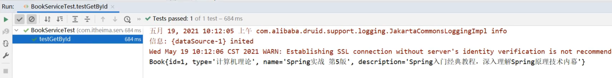

查询所有，测试的结果为：

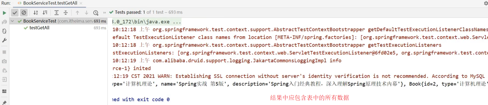

**6.5 PostMan测试**

**新增**

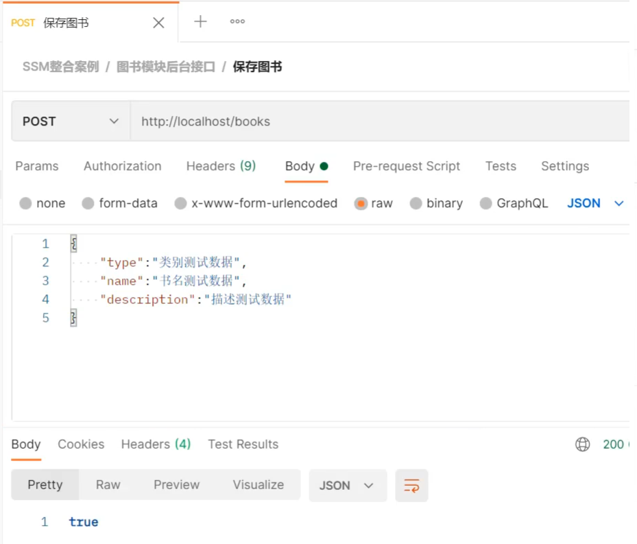

**修改**

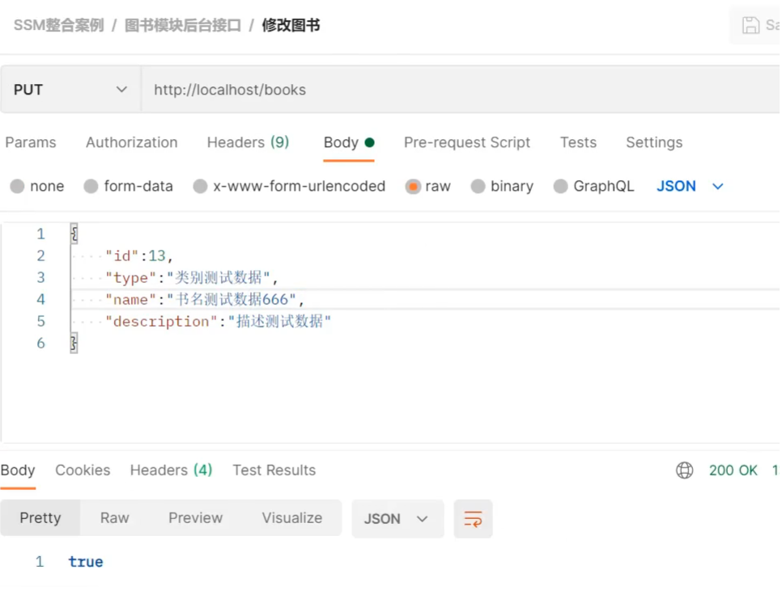

**删除**

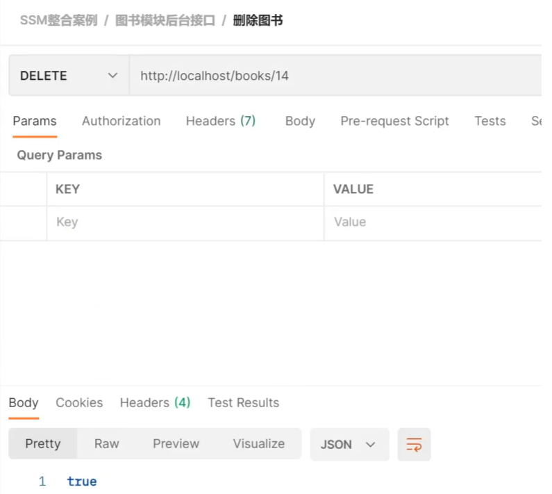

**查询单个**

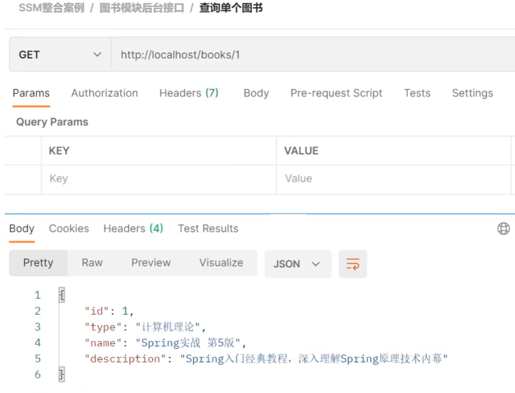

**查询所有**

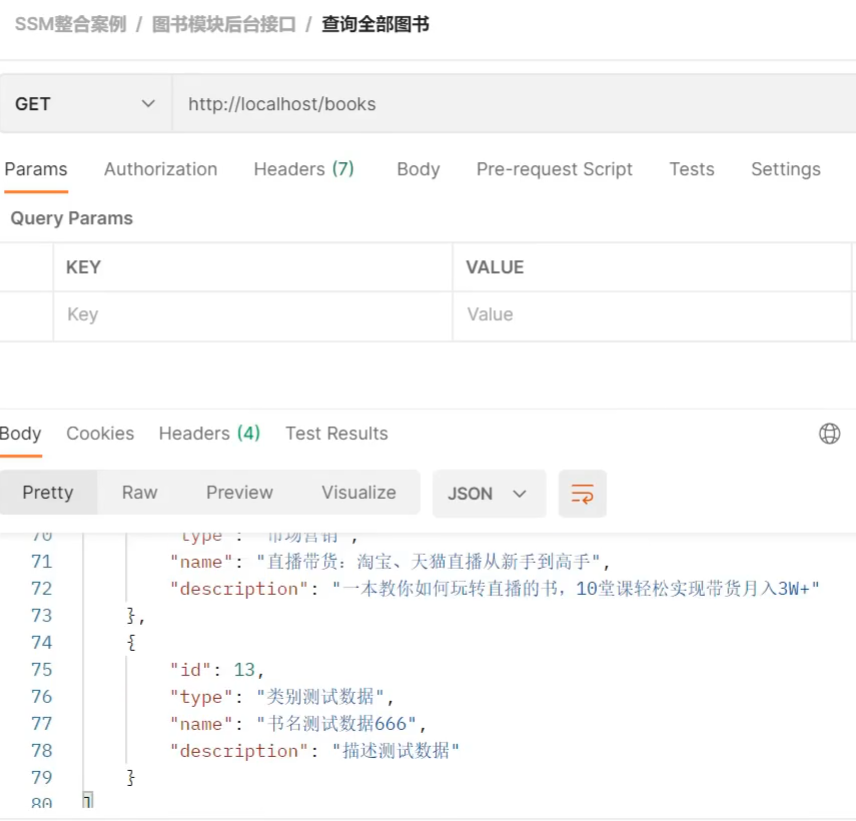

**7.统一结果封装**

现在，在Controller层增删改返回给前端的是boolean类型数据，在Controller层查询单个返回给前端的是对象，在Controller层查询所有返回给前端的是集合对象，随着业务的增长，需要返回的数据类型会越来越多，这对于前端开发人员在解析数据时比较凌乱，所以后台就需要将返回结果的数据进行统一，大体的思路为：

封装返回的结果数据：创建结果模型类，封装数据到data属性中

封装返回的数据是何种操作及是否操作成功：封装操作结果到code属性中

操作失败后封装返回的错误信息：封装特殊消息到message（msg）属性中

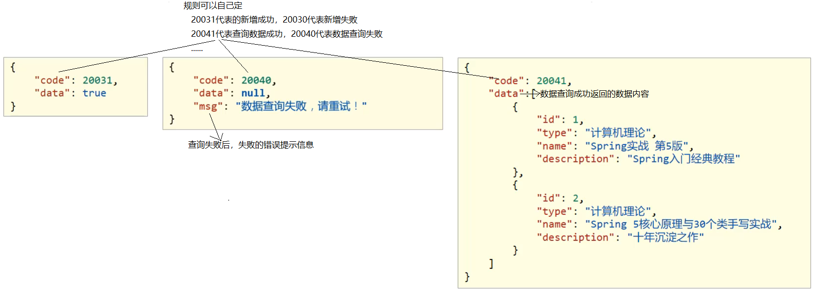

根据分析，可以设置统一数据返回结果类Result：

<table>
<colgroup>
<col style="width: 100%" />
</colgroup>
<tbody>
<tr class="odd">
<td>Java 
public class Result { 
private Object data; 
private Integer code; 
private String msg; 
}</td>
</tr>
</tbody>
</table>

在进行代码实现统一结果封装前，先准备一个环境，只需要复用SSM整合的代码即可，项目结构如下：

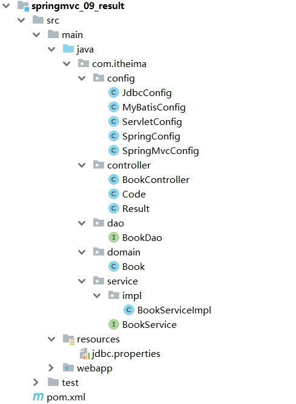

（1）创建Result类

<table>
<colgroup>
<col style="width: 100%" />
</colgroup>
<tbody>
<tr class="odd">
<td>Java 
public class Result { 
//描述统一格式中的数据 
private Object data; 
//描述统一格式中的编码，用于区分操作，可以简化配置0或1表示成功失败 
private Integer code; 
//描述统一格式中的消息，可选属性 
private String msg; 
 
public Result() { 
} 
//构造方法是方便对象的创建 
public Result(Integer code,Object data) { 
this.data = data; 
this.code = code; 
} 
//构造方法是方便对象的创建 
public Result(Integer code, Object data, String msg) { 
this.data = data; 
this.code = code; 
this.msg = msg; 
} 
//setter...getter...省略 
}</td>
</tr>
</tbody>
</table>

（2）定义返回码Code类

<table>
<colgroup>
<col style="width: 100%" />
</colgroup>
<tbody>
<tr class="odd">
<td>Java 
//状态码 
public class Code { 
public static final Integer SAVE_OK = 20011; 
public static final Integer DELETE_OK = 20021; 
public static final Integer UPDATE_OK = 20031; 
public static final Integer GET_OK = 20041; 
 
public static final Integer SAVE_ERR = 20010; 
public static final Integer DELETE_ERR = 20020; 
public static final Integer UPDATE_ERR = 20030; 
public static final Integer GET_ERR = 20040; 
}</td>
</tr>
</tbody>
</table>

*code类中的常量设计不是固定的，可以根据需要自行增减，例如将查询再进行细分为GET_OK、GET_ALL_OK、GET_PAGE_OK等。*

（3）修改Controller类的返回值

<table>
<colgroup>
<col style="width: 100%" />
</colgroup>
<tbody>
<tr class="odd">
<td>Java 
//统一每一个控制器方法返回值 
@RestController 
@RequestMapping("/books") 
public class BookController { 
 
@Autowired 
private BookService bookService; 
 
@PostMapping 
public Result save(@RequestBody Book book) { 
boolean flag = bookService.save(book); 
return new Result(flag ? Code.SAVE_OK:Code.SAVE_ERR,flag); 
} 
 
@PutMapping 
public Result update(@RequestBody Book book) { 
boolean flag = bookService.update(book); 
return new Result(flag ? Code.UPDATE_OK:Code.UPDATE_ERR,flag); 
} 
 
@DeleteMapping("/{id}") 
public Result delete(@PathVariable Integer id) { 
boolean flag = bookService.delete(id); 
return new Result(flag ? Code.DELETE_OK:Code.DELETE_ERR,flag); 
} 
 
@GetMapping("/{id}") 
public Result getById(@PathVariable Integer id) { 
Book book = bookService.getById(id); 
Integer code = book != null ? Code.GET_OK : Code.GET_ERR; 
String msg = book != null ? "" : "数据查询失败，请重试！"; 
return new Result(code,book,msg); 
} 
 
@GetMapping 
public Result getAll() { 
List&lt;Book&gt; bookList = bookService.getAll(); 
Integer code = bookList != null ? Code.GET_OK : Code.GET_ERR; 
String msg = bookList != null ? "" : "数据查询失败，请重试！"; 
return new Result(code,bookList,msg); 
} 
}</td>
</tr>
</tbody>
</table>

（4）启动服务测试

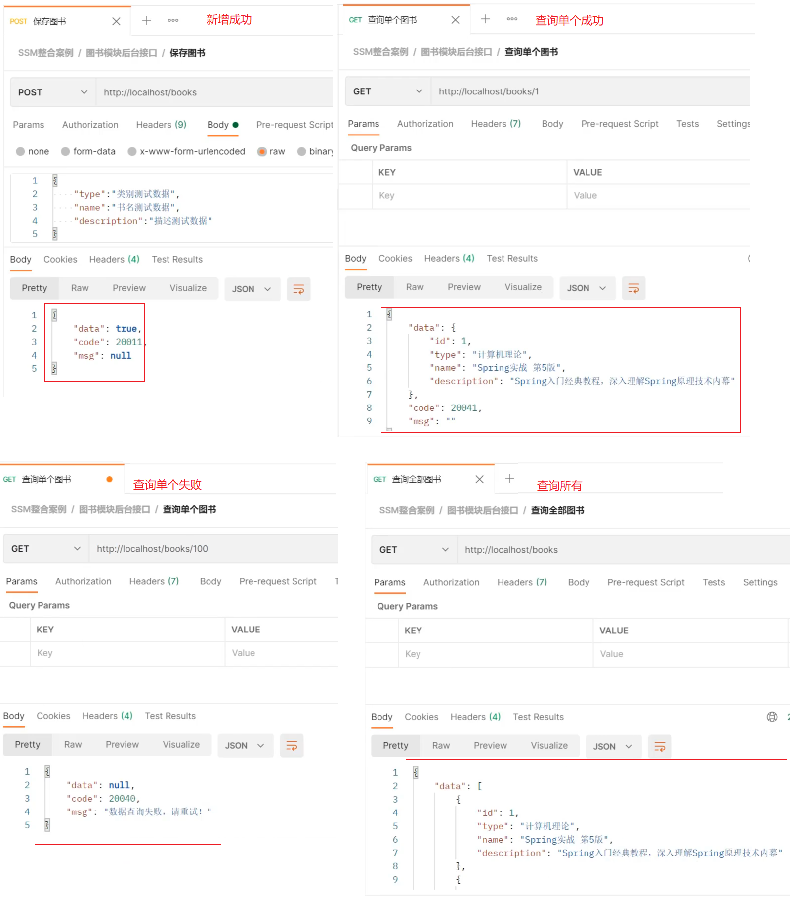

至此，返回结果就已经能以一种统一的格式返回给前端，前端根据返回的结果，先从中获取code，根据code判断，如果成功则取data属性的值，如果失败，则取msg中的值做提示。

**8.统一异常处理**

**8.1 问题描述**

修改BookController类的getById方法

<table>
<colgroup>
<col style="width: 100%" />
</colgroup>
<tbody>
<tr class="odd">
<td>Java 
@GetMapping("/{id}") 
public Result getById(@PathVariable Integer id) { 
//手动添加一个错误信息 
if(id==1) { 
int i = 1/0; 
} 
Book book = bookService.getById(id); 
Integer code = book != null ? Code.GET_OK : Code.GET_ERR; 
String msg = book != null ? "" : "数据查询失败，请重试！"; 
return new Result(code,book,msg); 
}</td>
</tr>
</tbody>
</table>

重新启动运行项目，使用PostMan发送请求，当传入的id为1，则会出现如下效果：

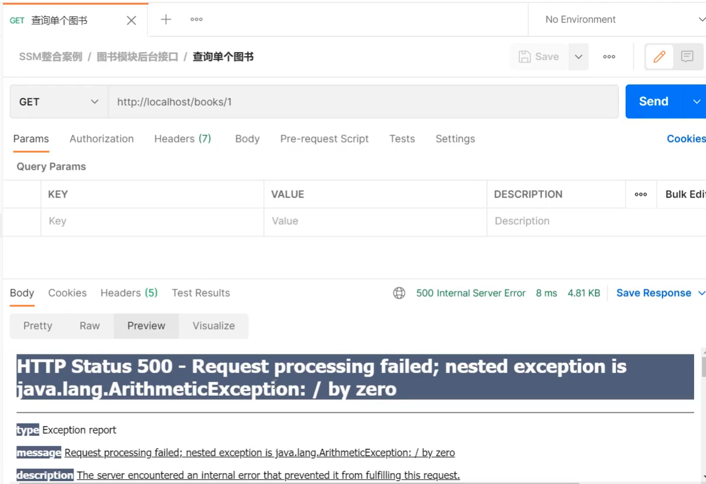

前端接收到这个信息后和约定的格式不一致，这是业务出现异常导致的，异常的种类及出现异常的原因：

框架内部抛出的异常：因使用不合规导致

数据层抛出的异常：因外部服务器故障导致（例如服务器访问超时）

业务层抛出的异常：因业务逻辑书写错误导致（例如遍历业务书写操作，导致索引异常等）

表现层抛出的异常：因数据收集、校验等规则导致（例如不匹配的数据类型间导致异常）

工具类抛出的异常：因工具类书写不严谨不够健壮导致（例如必要释放的连接长期未释放等）

会发现在开发的任何一个位置都有可能出现异常，而且这些异常是不能避免的。所以我们就需要将异常进行处理。

这些异常最终其实都会抛到表现层（Controller层），如果在每一个表现层的方法中都进行try会很繁琐，SpringMVC为我们提供了**异常处理器**，用于进行集中的、统一的处理项目中出现的异常。

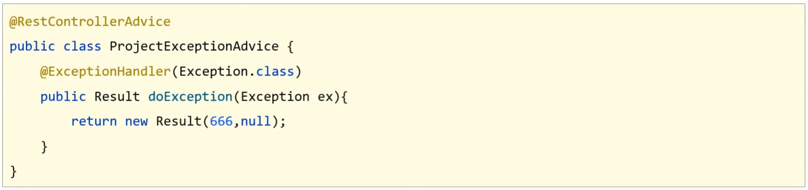

**8.2 异常处理器的使用**

这里直接使用前面的项目进行异常处理器的使用，最终项目结构如下：

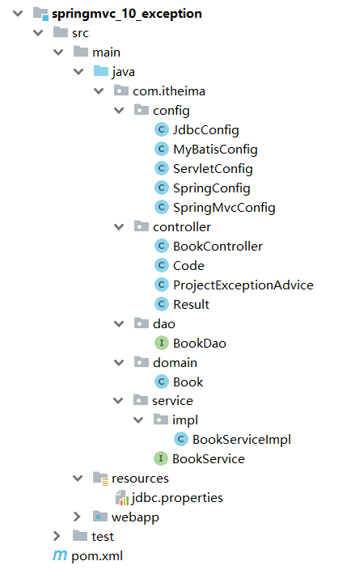

（1）创建异常处理器类，确保SpringMvcConfig能够扫描到异常处理器类

<table>
<colgroup>
<col style="width: 100%" />
</colgroup>
<tbody>
<tr class="odd">
<td>Java 
//@RestControllerAdvice用于标识当前类为REST风格对应的异常处理器 
@RestControllerAdvice 
public class ProjectExceptionAdvice { 
//除了自定义的异常处理器，保留对Exception类型的异常处理，用于处理非预期的异常 
@ExceptionHandler(Exception.class) 
public void doException(Exception ex){ 
System.out.println("嘿嘿,异常你哪里跑！") 
} 
}</td>
</tr>
</tbody>
</table>

（2）让程序抛出异常

修改BookController的getById方法，添加int i = 1/0

<table>
<colgroup>
<col style="width: 100%" />
</colgroup>
<tbody>
<tr class="odd">
<td>Java 
@GetMapping("/{id}") 
public Result getById(@PathVariable Integer id) { 
int i = 1/0; 
Book book = bookService.getById(id); 
Integer code = book != null ? Code.GET_OK : Code.GET_ERR; 
String msg = book != null ? "" : "数据查询失败，请重试！"; 
return new Result(code,book,msg); 
}</td>
</tr>
</tbody>
</table>

（3）运行程序，测试

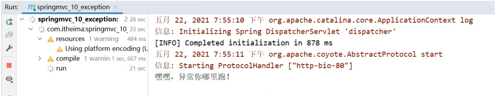

说明异常已经被拦截并执行了doException方法。

（4）异常处理器类返回结果给前端

<table>
<colgroup>
<col style="width: 100%" />
</colgroup>
<tbody>
<tr class="odd">
<td>Java 
//@RestControllerAdvice用于标识当前类为REST风格对应的异常处理器 
@RestControllerAdvice 
public class ProjectExceptionAdvice { 
//除了自定义的异常处理器，保留对Exception类型的异常处理，用于处理非预期的异常 
@ExceptionHandler(Exception.class) 
public Result doException(Exception ex){ 
System.out.println("嘿嘿,异常你哪里跑！") 
return new Result(666,null,"嘿嘿,异常你哪里跑！"); 
} 
}</td>
</tr>
</tbody>
</table>

（5）启动运行程序，测试

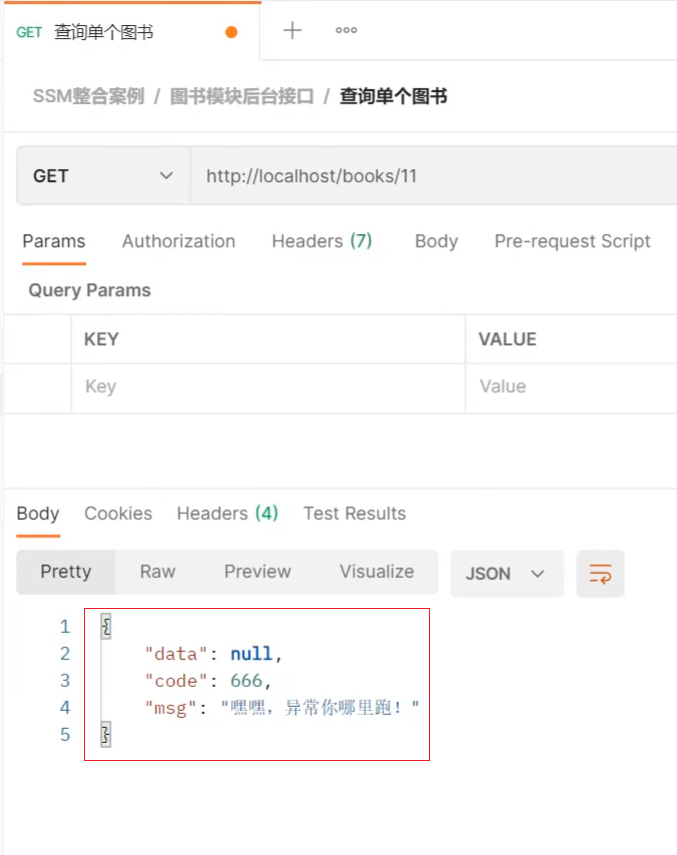

**@RestControllerAdvice**

|      |                                    |
|------|------------------------------------|
| 名称 | @RestControllerAdvice              |
| 类型 | **类注解**                         |
| 位置 | Rest风格开发的控制器增强类定义上方 |
| 作用 | 为Rest风格开发的控制器类做增强     |

@RestControllerAdvice注解自带@ResponseBody注解与@Component注解，具备对应的功能。

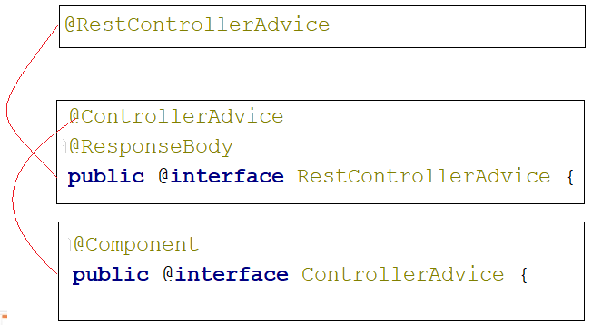

**@ExceptionHandler**

|      |                                                                                               |
|------|-----------------------------------------------------------------------------------------------|
| 名称 | @ExceptionHandler                                                                             |
| 类型 | **方法注解**                                                                                  |
| 位置 | 专用于异常处理的控制器方法上方                                                                |
| 作用 | 设置指定异常的处理方案，功能等同于控制器方法，出现异常后终止原始控制器执行,并转入当前方法执行 |

**说明：**此类方法可以根据处理的异常不同，制作多个方法分别处理对应的异常。

**8.3 项目异常处理方案**

**8.3.1 异常分类**

因为异常的种类有很多，如果每一个异常都对应一个@ExceptionHandler，所以在处理异常之前，需要对异常进行一个分类：

业务异常（BusinessException）

规范的用户行为产生的异常

用户在页面输入内容的时候未按照指定格式进行数据填写，如在年龄框输入的是字符串

> 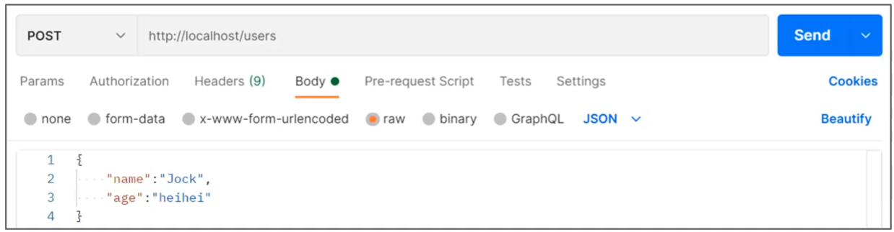

不规范的用户行为操作产生的异常

如用户故意传递错误数据

> 

系统异常（SystemException）

项目运行过程中可预计但无法避免的异常

比如数据库或服务器宕机

其他异常（Exception）

编程人员未预期到的异常，如:用到的文件不存在

> 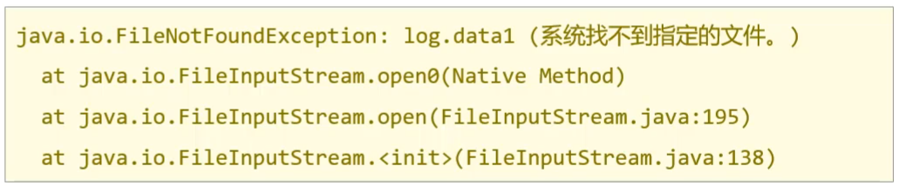

**8.3.2 异常解决方案**

业务异常（BusinessException）

发送对应消息传递给用户，提醒规范操作：如 用户名已存在、密码格式不正确 等

系统异常（SystemException）

发送固定消息传递给用户，安抚用户：如 系统繁忙，请稍后再试、系统正在维护升级，请稍后再试、系统出问题，请联系系统管理员 等

发送特定消息给运维人员，提醒维护：可以发送短信、邮箱或者是公司内部通信软件

记录日志：发消息和记录日志对用户来说是不可见的，属于后台程序

其他异常（Exception）

发送固定消息传递给用户，安抚用户

发送特定消息给编程人员，提醒维护（纳入预期范围内）：一般是程序没有考虑全，比如未做非空校验等

记录日志

**8.3.3 异常解决方案的具体实现**

（1）自定义异常类

<table>
<colgroup>
<col style="width: 100%" />
</colgroup>
<tbody>
<tr class="odd">
<td>Java 
//自定义异常处理器，用于封装异常信息，对异常进行分类 
public class SystemException extends RuntimeException{ 
private Integer code; 
 
public Integer getCode() { 
return code; 
} 
 
public void setCode(Integer code) { 
this.code = code; 
} 
 
public SystemException(Integer code, String message) { 
super(message); 
this.code = code; 
} 
 
public SystemException(Integer code, String message, Throwable cause) { 
super(message, cause); 
this.code = code; 
} 
 
} 
 
//自定义异常处理器，用于封装异常信息，对异常进行分类 
public class BusinessException extends RuntimeException{ 
private Integer code; 
 
public Integer getCode() { 
return code; 
} 
 
public void setCode(Integer code) { 
this.code = code; 
} 
 
public BusinessException(Integer code, String message) { 
super(message); 
this.code = code; 
} 
 
public BusinessException(Integer code, String message, Throwable cause) { 
super(message, cause); 
this.code = code; 
} 
 
}</td>
</tr>
</tbody>
</table>

让自定义异常类继承RuntimeException的好处是，后期在抛出这两个异常的时候不需要再 try...catch... 或 throws 了。

自定义异常类中添加code属性的原因是为了更好的区分异常来自哪个业务。

（2）将其他异常包成自定义异常

假如在BookServiceImpl的getById方法抛异常了

<table>
<colgroup>
<col style="width: 100%" />
</colgroup>
<tbody>
<tr class="odd">
<td>Java 
public Book getById(Integer id) { 
//模拟业务异常，包装成自定义异常 
if(id == 1){ 
throw new BusinessException(Code.BUSINESS_ERR, "请不要使用你的技术挑战我的耐性!"); 
} 
//模拟系统异常，将可能出现的异常进行包装，转换成自定义异常 
try{ 
int i = 1/0; 
}catch (Exception e){ 
throw new SystemException(Code.SYSTEM_TIMEOUT_ERR, "服务器访问超时，请重试!",e); 
} 
return bookDao.getById(id); 
}</td>
</tr>
</tbody>
</table>

具体的包装方式有：

try{}catch(){}在catch中重新throw我们自定义异常

直接throw自定义异常

为了使code看着更专业些，可以在Code类中再新增需要的属性

<table>
<colgroup>
<col style="width: 100%" />
</colgroup>
<tbody>
<tr class="odd">
<td>Java 
//状态码 
public class Code { 
public static final Integer SAVE_OK = 20011; 
public static final Integer DELETE_OK = 20021; 
public static final Integer UPDATE_OK = 20031; 
public static final Integer GET_OK = 20041; 
 
public static final Integer SAVE_ERR = 20010; 
public static final Integer DELETE_ERR = 20020; 
public static final Integer UPDATE_ERR = 20030; 
public static final Integer GET_ERR = 20040; 
public static final Integer SYSTEM_ERR = 50001; 
public static final Integer SYSTEM_TIMEOUT_ERR = 50002; 
public static final Integer SYSTEM_UNKNOW_ERR = 59999; 
 
public static final Integer BUSINESS_ERR = 60002; 
}</td>
</tr>
</tbody>
</table>

（3）处理器类中处理自定义异常

<table>
<colgroup>
<col style="width: 100%" />
</colgroup>
<tbody>
<tr class="odd">
<td>Java 
//@RestControllerAdvice用于标识当前类为REST风格对应的异常处理器 
@RestControllerAdvice 
public class ProjectExceptionAdvice { 
//@ExceptionHandler用于设置当前处理器类对应的异常类型 
@ExceptionHandler(SystemException.class) 
public Result doSystemException(SystemException ex){ 
//记录日志 
//发送消息给运维 
//发送邮件给开发人员,ex对象发送给开发人员 
return new Result(ex.getCode(),null,ex.getMessage()); 
} 
 
@ExceptionHandler(BusinessException.class) 
public Result doBusinessException(BusinessException ex){ 
return new Result(ex.getCode(),null,ex.getMessage()); 
} 
 
//除了自定义的异常处理器，保留对Exception类型的异常处理，用于处理非预期的异常 
@ExceptionHandler(Exception.class) 
public Result doOtherException(Exception ex){ 
//记录日志 
//发送消息给运维 
//发送邮件给开发人员,ex对象发送给开发人员 
return new Result(Code.SYSTEM_UNKNOW_ERR,null,"系统繁忙，请稍后再试！"); 
} 
}</td>
</tr>
</tbody>
</table>

（4）运行程序

根据ID查询，如果传入的参数为1，会报BusinessException

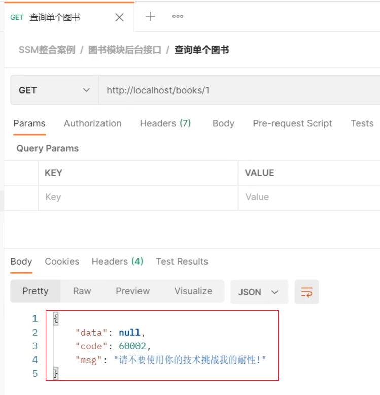

如果传入的是其他参数，会报SystemException

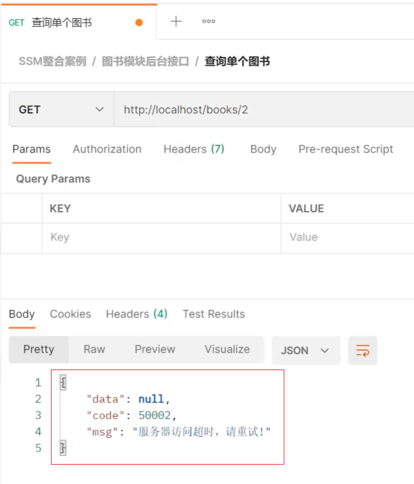

此时不管后台哪一层抛出异常，都会以与前端约定好的方式进行返回，前端只需要把信息获取到，根据返回的正确与否来展示不同的内容即可。

**小结**

以后项目中的异常处理方式为：

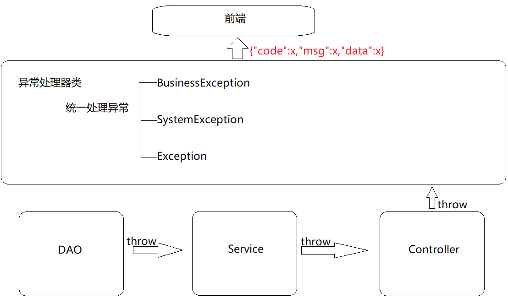

**9.前后台协议联调**

**9.1 环境准备**

内容参考前面的项目或者直接使用前面的项目，最终项目结构如下：

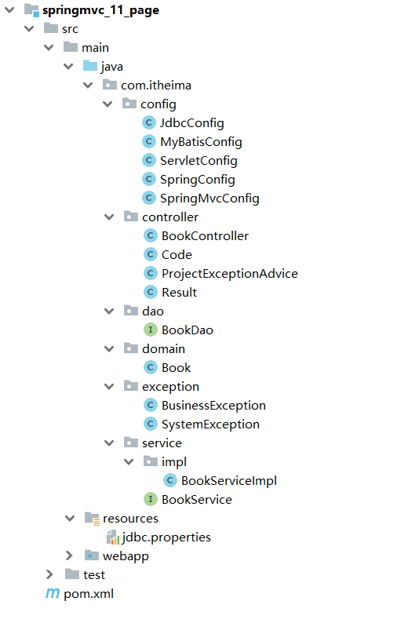

**\[SSM功能页面.zip\]**

将资料中SSM功能页面文件夹下的静态资源拷贝到webapp下：

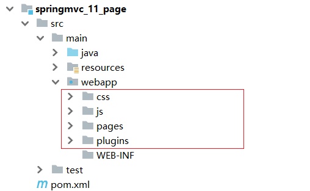

因为添加了静态资源，SpringMVC会拦截，所有需要在SpringConfig的配置类中将静态资源进行放行。

新建SpringMvcSupport

<table>
<colgroup>
<col style="width: 100%" />
</colgroup>
<tbody>
<tr class="odd">
<td>Java 
@Configuration 
public class SpringMvcSupport extends WebMvcConfigurationSupport { 
@Override 
protected void addResourceHandlers(ResourceHandlerRegistry registry) { 
registry.addResourceHandler("/pages/**").addResourceLocations("/pages/"); 
registry.addResourceHandler("/css/**").addResourceLocations("/css/"); 
registry.addResourceHandler("/js/**").addResourceLocations("/js/"); 
registry.addResourceHandler("/plugins/**").addResourceLocations("/plugins/"); 
} 
}</td>
</tr>
</tbody>
</table>

在SpringMvcConfig中扫描SpringMvcSupport

<table>
<colgroup>
<col style="width: 100%" />
</colgroup>
<tbody>
<tr class="odd">
<td>Java 
@Configuration 
@ComponentScan({"com.itheima.controller","com.itheima.config"}) 
@EnableWebMvc 
public class SpringMvcConfig { 
}</td>
</tr>
</tbody>
</table>

接下来就需要将所有的列表查询、新增、修改、删除等功能一个个实现。

**9.2 列表功能**

返回数据res.data的内容如下：

<table>
<colgroup>
<col style="width: 100%" />
</colgroup>
<tbody>
<tr class="odd">
<td>JSON 
{ 
"data": [ 
{ 
"id": 1, 
"type": "计算机理论", 
"name": "Spring实战 第五版", 
"description": "Spring入门经典教程，深入理解Spring原理技术内幕" 
}, 
{ 
"id": 2, 
"type": "计算机理论", 
"name": "Spring 5核心原理与30个类手写实践", 
"description": "十年沉淀之作，手写Spring精华思想" 
},... 
], 
"code": 20041, 
"msg": "" 
}</td>
</tr>
</tbody>
</table>

发送方式：

<table>
<colgroup>
<col style="width: 100%" />
</colgroup>
<tbody>
<tr class="odd">
<td>JavaScript 
getAll() { 
//发送ajax请求 
axios.get("/books").then((res)=&gt;{ 
this.dataList = res.data.data; 
}); 
}</td>
</tr>
</tbody>
</table>

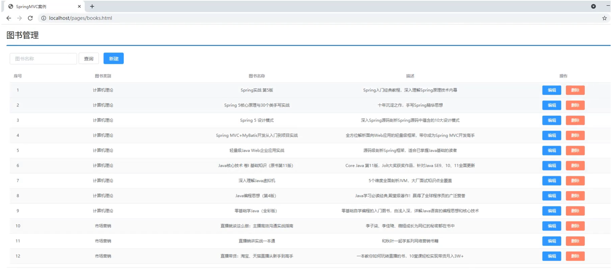

**9.3 添加功能**

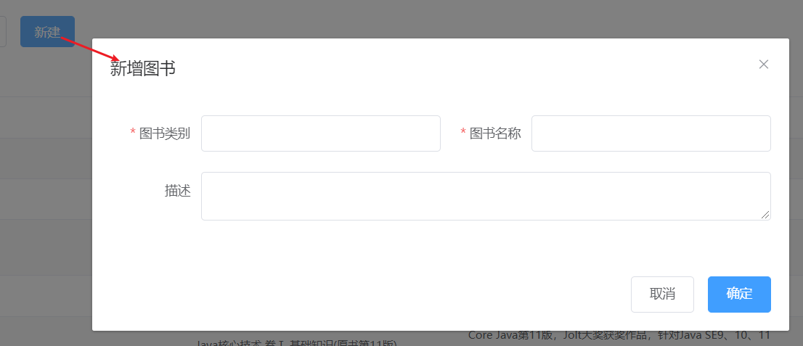

handleCreate打开新增面板

<table>
<colgroup>
<col style="width: 100%" />
</colgroup>
<tbody>
<tr class="odd">
<td>JavaScript 
handleCreate() { 
this.dialogFormVisible = true; 
},</td>
</tr>
</tbody>
</table>

handleAdd方法发送异步请求并携带数据

<table>
<colgroup>
<col style="width: 100%" />
</colgroup>
<tbody>
<tr class="odd">
<td>JavaScript 
handleAdd () { 
//发送ajax请求 
//this.formData是表单中的数据，最后是一个json数据 
axios.post("/books",this.formData).then((res)=&gt;{ 
this.dialogFormVisible = false; 
this.getAll(); 
}); 
}</td>
</tr>
</tbody>
</table>

新增成功是关闭面板，重新查询数据，如果新增失败：

在handlerAdd方法中根据后台返回的数据来进行不同的处理

如果后台返回的是成功，则提示成功信息，并关闭面板

如果后台返回的是失败，则提示错误信息

1、修改前端页面

<table>
<colgroup>
<col style="width: 100%" />
</colgroup>
<tbody>
<tr class="odd">
<td>JavaScript 
handleAdd () { 
//发送ajax请求 
axios.post("/books",this.formData).then((res)=&gt;{ 
//如果操作成功，关闭弹层，显示数据 
if(res.data.code == 20011){ 
this.dialogFormVisible = false; 
this.$message.success("添加成功"); 
}else if(res.data.code == 20010){ 
this.$message.error("添加失败"); 
}else{ 
this.$message.error(res.data.msg); 
} 
}).finally(()=&gt;{ 
this.getAll(); 
}); 
}</td>
</tr>
</tbody>
</table>

2、后台返回操作结果，将Dao层的增删改方法返回值从void改成int

<table>
<colgroup>
<col style="width: 100%" />
</colgroup>
<tbody>
<tr class="odd">
<td>Java 
public interface BookDao { 
 
// @Insert("insert into tbl_book values(null,#{type},#{name},#{description})") 
@Insert("insert into tbl_book (type,name,description) values(#{type},#{name},#{description})") 
public int save(Book book); 
 
@Update("update tbl_book set type = #{type}, name = #{name}, description = #{description} where id = #{id}") 
public int update(Book book); 
 
@Delete("delete from tbl_book where id = #{id}") 
public int delete(Integer id); 
 
@Select("select * from tbl_book where id = #{id}") 
public Book getById(Integer id); 
 
@Select("select * from tbl_book") 
public List&lt;Book&gt; getAll(); 
}</td>
</tr>
</tbody>
</table>

3、在BookServiceImpl中，增删改方法根据DAO的返回值来决定返回true/false

<table>
<colgroup>
<col style="width: 100%" />
</colgroup>
<tbody>
<tr class="odd">
<td>Java 
@Service 
public class BookServiceImpl implements BookService { 
@Autowired 
private BookDao bookDao; 
 
public boolean save(Book book) { 
return bookDao.save(book) &gt; 0; 
} 
 
public boolean update(Book book) { 
return bookDao.update(book) &gt; 0; 
} 
 
public boolean delete(Integer id) { 
return bookDao.delete(id) &gt; 0; 
} 
 
public Book getById(Integer id) { 
if(id == 1){ 
throw new BusinessException(Code.BUSINESS_ERR,"请不要使用你的技术挑战我的耐性!"); 
} 
// //将可能出现的异常进行包装，转换成自定义异常 
// try{ 
// int i = 1/0; 
// }catch (Exception e){ 
// throw new SystemException(Code.SYSTEM_TIMEOUT_ERR,"服务器访问超时，请重试!",e); 
// } 
return bookDao.getById(id); 
} 
 
public List&lt;Book&gt; getAll() { 
return bookDao.getAll(); 
} 
}</td>
</tr>
</tbody>
</table>

4、测试错误情况，将图书类别长度设置超出范围即可

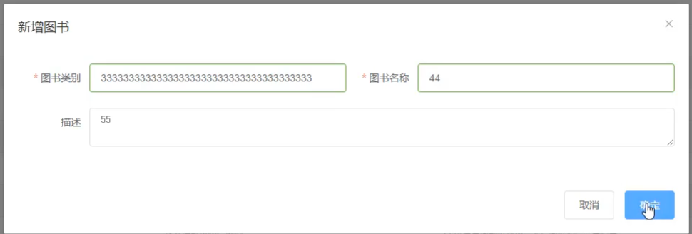

新增成功后，再次点击新增按钮会发现之前的数据还存在，这个时候就需要在新增的时候将表单内容清空：

<table>
<colgroup>
<col style="width: 100%" />
</colgroup>
<tbody>
<tr class="odd">
<td>JavaScript 
resetForm(){ 
this.formData = {}; 
} 
handleCreate() { 
this.dialogFormVisible = true; 
this.resetForm(); 
}</td>
</tr>
</tbody>
</table>

**9.4 修改功能**

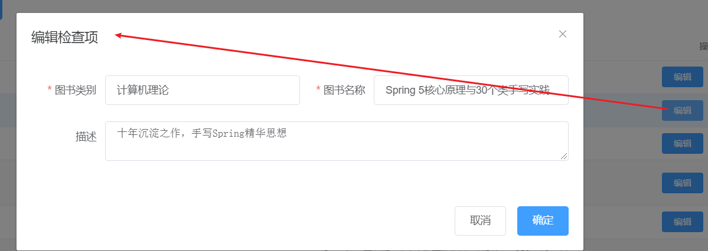

修改图书信息后，如果成功提示错误信息，关闭修改面板，重新查询数据，如果失败提示错误信息。

scope.row代表的是当前行的行数据，也就是说,scope.row就是选中行对应的json数据，如下：

<table>
<colgroup>
<col style="width: 100%" />
</colgroup>
<tbody>
<tr class="odd">
<td>JSON 
{ 
"id": 1, 
"type": "计算机理论", 
"name": "Spring实战 第五版", 
"description": "Spring入门经典教程，深入理解Spring原理技术内幕" 
}</td>
</tr>
</tbody>
</table>

修改handleUpdate方法

<table>
<colgroup>
<col style="width: 100%" />
</colgroup>
<tbody>
<tr class="odd">
<td>JavaScript 
//弹出编辑窗口 
handleUpdate(row) { 
// console.log(row); //row.id 查询条件 
//查询数据，根据id查询 
axios.get("/books/"+row.id).then((res)=&gt;{ 
if(res.data.code == 20041){ 
//展示弹层，加载数据 
this.formData = res.data.data; 
this.dialogFormVisible4Edit = true; 
}else{ 
this.$message.error(res.data.msg); 
} 
}); 
}</td>
</tr>
</tbody>
</table>

修改handleEdit方法

<table>
<colgroup>
<col style="width: 100%" />
</colgroup>
<tbody>
<tr class="odd">
<td>JavaScript 
handleEdit() { 
//发送ajax请求 
axios.put("/books",this.formData).then((res)=&gt;{ 
//如果操作成功，关闭弹层，显示数据 
if(res.data.code == 20031){ 
this.dialogFormVisible4Edit = false; 
this.$message.success("修改成功"); 
}else if(res.data.code == 20030){ 
this.$message.error("修改失败"); 
}else{ 
this.$message.error(res.data.msg); 
} 
}).finally(()=&gt;{ 
this.getAll(); 
}); 
}</td>
</tr>
</tbody>
</table>

**9.5 删除功能**

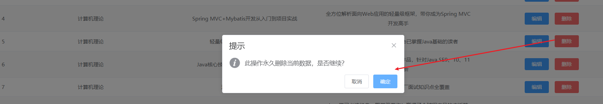

删除后，如果返回成功，提示成功信息，并重新查询数据，如果返回失败，提示错误信息，并重新查询数据。

修改handleDelete方法

<table>
<colgroup>
<col style="width: 100%" />
</colgroup>
<tbody>
<tr class="odd">
<td>JavaScript 
handleDelete(row) { 
//1.弹出提示框 
this.$confirm("此操作永久删除当前数据，是否继续？","提示",{ 
type:'info' 
}).then(()=&gt;{ 
//2.做删除业务 
axios.delete("/books/"+row.id).then((res)=&gt;{ 
if(res.data.code == 20021){ 
this.$message.success("删除成功"); 
}else{ 
this.$message.error("删除失败"); 
} 
}).finally(()=&gt;{ 
this.getAll(); 
}); 
}).catch(()=&gt;{ 
//3.取消删除 
this.$message.info("取消删除操作"); 
}); 
}</td>
</tr>
</tbody>
</table>

接下来，下面是一个完整页面

<table>
<colgroup>
<col style="width: 100%" />
</colgroup>
<tbody>
<tr class="odd">
<td>HTML 
&lt;!DOCTYPE html&gt; 
&lt;html&gt; 
&lt;head&gt; 
&lt;!-- 页面meta --&gt; 
&lt;meta charset="utf-8"&gt; 
&lt;meta http-equiv="X-UA-Compatible" content="IE=edge"&gt; 
&lt;title&gt;SpringMVC案例&lt;/title&gt; 
&lt;meta content="width=device-width,initial-scale=1,maximum-scale=1,user-scalable=no" name="viewport"&gt; 
&lt;!-- 引入样式 --&gt; 
&lt;link rel="stylesheet" href="../plugins/elementui/index.css"&gt; 
&lt;link rel="stylesheet" href="../plugins/font-awesome/css/font-awesome.min.css"&gt; 
&lt;link rel="stylesheet" href="../css/style.css"&gt; 
&lt;/head&gt; 
 
&lt;body class="hold-transition"&gt; 
&lt;div id="app"&gt; 
&lt;div class="content-header"&gt; 
&lt;h1&gt;图书管理&lt;/h1&gt; 
&lt;/div&gt; 
&lt;div class="app-container"&gt; 
&lt;div class="box"&gt; 
&lt;div class="filter-container"&gt; 
&lt;el-input placeholder="图书名称" v-model="pagination.queryString" style="width: 200px;" class="filter-item"&gt;&lt;/el-input&gt; 
&lt;el-button @click="getAll()" class="dalfBut"&gt;查询&lt;/el-button&gt; 
&lt;el-button type="primary" class="butT" @click="handleCreate()"&gt;新建&lt;/el-button&gt; 
&lt;/div&gt; 
&lt;el-table size="small" current-row-key="id" :data="dataList" stripe highlight-current-row&gt; 
&lt;el-table-column type="index" align="center" label="序号"&gt;&lt;/el-table-column&gt; 
&lt;el-table-column prop="type" label="图书类别" align="center"&gt;&lt;/el-table-column&gt; 
&lt;el-table-column prop="name" label="图书名称" align="center"&gt;&lt;/el-table-column&gt; 
&lt;el-table-column prop="description" label="描述" align="center"&gt;&lt;/el-table-column&gt; 
&lt;el-table-column label="操作" align="center"&gt; 
&lt;template slot-scope="scope"&gt; 
&lt;el-button type="primary" size="mini" @click="handleUpdate(scope.row)"&gt; 
编辑 
&lt;/el-button&gt; 
&lt;el-button type="danger" size="mini" @click="handleDelete(scope.row)"&gt; 
删除 
&lt;/el-button&gt; 
&lt;/template&gt; 
&lt;/el-table-column&gt; 
&lt;/el-table&gt; 
 
&lt;!-- 新增标签弹层 --&gt; 
&lt;div class="add-form"&gt; 
&lt;el-dialog title="新增图书" :visible.sync="dialogFormVisible"&gt; 
&lt;el-form ref="dataAddForm" :model="formData" :rules="rules" label-position="right" label-width="100px"&gt; 
&lt;el-row&gt; 
&lt;el-col :span="12"&gt; 
&lt;el-form-item label="图书类别" prop="type"&gt; 
&lt;el-input v-model="formData.type"/&gt; 
&lt;/el-form-item&gt; 
&lt;/el-col&gt; 
&lt;el-col :span="12"&gt; 
&lt;el-form-item label="图书名称" prop="name"&gt; 
&lt;el-input v-model="formData.name"/&gt; 
&lt;/el-form-item&gt; 
&lt;/el-col&gt; 
&lt;/el-row&gt; 
&lt;el-row&gt; 
&lt;el-col :span="24"&gt; 
&lt;el-form-item label="描述"&gt; 
&lt;el-input v-model="formData.description" type="textarea"&gt; 
&lt;/el-input&gt; 
&lt;/el-form-item&gt; 
&lt;/el-col&gt; 
&lt;/el-row&gt; 
&lt;/el-form&gt; 
&lt;div slot="footer" class="dialog-footer"&gt; 
&lt;el-button @click="dialogFormVisible = false"&gt;取消&lt;/el-button&gt; 
&lt;el-button type="primary" @click="handleAdd()"&gt;确定&lt;/el-button&gt; 
&lt;/div&gt; 
&lt;/el-dialog&gt; 
&lt;/div&gt; 
 
&lt;!-- 编辑标签弹层 --&gt; 
&lt;div class="add-form"&gt; 
&lt;el-dialog title="编辑检查项" :visible.sync="dialogFormVisible4Edit"&gt; 
&lt;el-form ref="dataEditForm" :model="formData" :rules="rules" label-position="right" label-width="100px"&gt; 
&lt;el-row&gt; 
&lt;el-col :span="12"&gt; 
&lt;el-form-item label="图书类别" prop="type"&gt; 
&lt;el-input v-model="formData.type"/&gt; 
&lt;/el-form-item&gt; 
&lt;/el-col&gt; 
&lt;el-col :span="12"&gt; 
&lt;el-form-item label="图书名称" prop="name"&gt; 
&lt;el-input v-model="formData.name"/&gt; 
&lt;/el-form-item&gt; 
&lt;/el-col&gt; 
&lt;/el-row&gt; 
&lt;el-row&gt; 
&lt;el-col :span="24"&gt; 
&lt;el-form-item label="描述"&gt; 
&lt;el-input v-model="formData.description" type="textarea"&gt; 
&lt;/el-input&gt; 
&lt;/el-form-item&gt; 
&lt;/el-col&gt; 
&lt;/el-row&gt; 
&lt;/el-form&gt; 
&lt;div slot="footer" class="dialog-footer"&gt; 
&lt;el-button @click="dialogFormVisible4Edit = false"&gt;取消&lt;/el-button&gt; 
&lt;el-button type="primary" @click="handleEdit()"&gt;确定&lt;/el-button&gt; 
&lt;/div&gt; 
&lt;/el-dialog&gt; 
&lt;/div&gt; 
&lt;/div&gt; 
&lt;/div&gt; 
&lt;/div&gt; 
&lt;/body&gt; 
 
&lt;!-- 引入组件库 --&gt; 
&lt;script src="../js/vue.js"&gt;&lt;/script&gt; 
&lt;script src="../plugins/elementui/index.js"&gt;&lt;/script&gt; 
&lt;script type="text/javascript" src="../js/jquery.min.js"&gt;&lt;/script&gt; 
&lt;script src="../js/axios-0.18.0.js"&gt;&lt;/script&gt; 
&lt;script&gt; 
var vue = new Vue({ 
el: '#app', 
data:{ 
pagination: {}, 
dataList: [],//当前页要展示的列表数据 
formData: {},//表单数据 
dialogFormVisible: false,//控制表单是否可见 
dialogFormVisible4Edit:false,//编辑表单是否可见 
rules: {//校验规则 
type: [{ required: true, message: '图书类别为必填项', trigger: 'blur' }], 
name: [{ required: true, message: '图书名称为必填项', trigger: 'blur' }] 
} 
}, 
 
//钩子函数，VUE对象初始化完成后自动执行 
created() { 
this.getAll(); 
}, 
 
methods: { 
//列表 
getAll() { 
//发送ajax请求 
axios.get("/books").then((res)=&gt;{ 
this.dataList = res.data.data; 
}); 
}, 
 
//弹出添加窗口 
handleCreate() { 
this.dialogFormVisible = true; 
this.resetForm(); 
}, 
 
//重置表单 
resetForm() { 
this.formData = {}; 
}, 
 
//添加 
handleAdd () { 
//发送ajax请求 
axios.post("/books",this.formData).then((res)=&gt;{ 
console.log(res.data); 
//如果操作成功，关闭弹层，显示数据 
if(res.data.code == 20011){ 
this.dialogFormVisible = false; 
this.$message.success("添加成功"); 
}else if(res.data.code == 20010){ 
this.$message.error("添加失败"); 
}else{ 
this.$message.error(res.data.msg); 
} 
}).finally(()=&gt;{ 
this.getAll(); 
}); 
}, 
 
//弹出编辑窗口 
handleUpdate(row) { 
// console.log(row); //row.id 查询条件 
//查询数据，根据id查询 
axios.get("/books/"+row.id).then((res)=&gt;{ 
// console.log(res.data.data); 
if(res.data.code == 20041){ 
//展示弹层，加载数据 
this.formData = res.data.data; 
this.dialogFormVisible4Edit = true; 
}else{ 
this.$message.error(res.data.msg); 
} 
}); 
}, 
 
//编辑 
handleEdit() { 
//发送ajax请求 
axios.put("/books",this.formData).then((res)=&gt;{ 
//如果操作成功，关闭弹层，显示数据 
if(res.data.code == 20031){ 
this.dialogFormVisible4Edit = false; 
this.$message.success("修改成功"); 
}else if(res.data.code == 20030){ 
this.$message.error("修改失败"); 
}else{ 
this.$message.error(res.data.msg); 
} 
}).finally(()=&gt;{ 
this.getAll(); 
}); 
}, 
 
 
// 删除 
handleDelete(row) { 
//1.弹出提示框 
this.$confirm("此操作永久删除当前数据，是否继续？","提示",{ 
type:'info' 
}).then(()=&gt;{ 
//2.做删除业务 
axios.delete("/books/"+row.id).then((res)=&gt;{ 
if(res.data.code == 20021){ 
this.$message.success("删除成功"); 
}else{ 
this.$message.error("删除失败"); 
} 
}).finally(()=&gt;{ 
this.getAll(); 
}); 
}).catch(()=&gt;{ 
//3.取消删除 
this.$message.info("取消删除操作"); 
}); 
} 
} 
}) 
&lt;/script&gt; 
&lt;/html&gt;</td>
</tr>
</tbody>
</table>

**10.拦截器**

**10.1 拦截器概念**

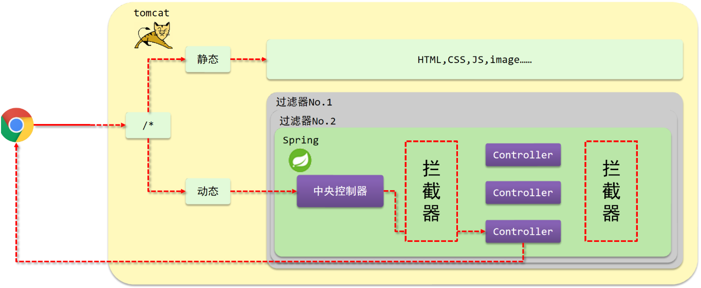

浏览器发送一个请求会先到Tomcat的web服务器

Tomcat服务器接收到请求以后，会去判断请求的是静态资源还是动态资源

如果是静态资源，会直接到Tomcat的项目部署目录下去直接访问

如果是动态资源，就需要交给项目的后台代码进行处理

在找到具体的方法之前，我们可以去配置过滤器（可以配置多个），按照顺序进行执行

然后进入到到中央处理器（SpringMVC中的内容），SpringMVC会根据配置的规则进行拦截

如果满足规则，则进行处理，找到其对应的controller类中的方法进行执行，完成后返回结果

如果不满足规则，则不进行处理

这时，如果需要在每个Controller方法执行的前后添加业务，就需要使用**拦截器**

拦截器（Interceptor）是一种动态拦截方法调用的机制，在SpringMVC中动态拦截控制器方法的执行，即阻止原始方法的执行，在指定的方法调用前后执行预先设定的代码。

拦截器和过滤器在作用和执行顺序上很相似，区别如下：

归属不同：Filter属于Servlet技术，Interceptor属于SpringMVC技术

拦截内容不同：Filter对所有访问进行增强，Interceptor仅针对SpringMVC的访问进行增强

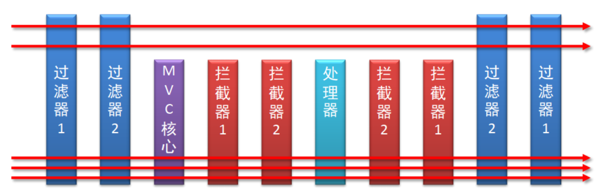

**10.2 拦截器入门案例**

**10.2.1 环境准备**

（1）创建一个Web的Maven项目，pom.xml添加SSM整合所需jar包

<table>
<colgroup>
<col style="width: 100%" />
</colgroup>
<tbody>
<tr class="odd">
<td>XML 
&lt;?xml version="1.0" encoding="UTF-8"?&gt; 
 
&lt;project xmlns="http://maven.apache.org/POM/4.0.0" xmlns:xsi="http://www.w3.org/2001/XMLSchema-instance" 
xsi:schemaLocation="http://maven.apache.org/POM/4.0.0 http://maven.apache.org/xsd/maven-4.0.0.xsd"&gt; 
&lt;modelVersion&gt;4.0.0&lt;/modelVersion&gt; 
 
&lt;groupId&gt;com.itheima&lt;/groupId&gt; 
&lt;artifactId&gt;springmvc_12_interceptor&lt;/artifactId&gt; 
&lt;version&gt;1.0-SNAPSHOT&lt;/version&gt; 
&lt;packaging&gt;war&lt;/packaging&gt; 
 
&lt;dependencies&gt; 
&lt;dependency&gt; 
&lt;groupId&gt;javax.servlet&lt;/groupId&gt; 
&lt;artifactId&gt;javax.servlet-api&lt;/artifactId&gt; 
&lt;version&gt;3.1.0&lt;/version&gt; 
&lt;scope&gt;provided&lt;/scope&gt; 
&lt;/dependency&gt; 
&lt;dependency&gt; 
&lt;groupId&gt;org.springframework&lt;/groupId&gt; 
&lt;artifactId&gt;spring-webmvc&lt;/artifactId&gt; 
&lt;version&gt;5.2.10.RELEASE&lt;/version&gt; 
&lt;/dependency&gt; 
&lt;dependency&gt; 
&lt;groupId&gt;com.fasterxml.jackson.core&lt;/groupId&gt; 
&lt;artifactId&gt;jackson-databind&lt;/artifactId&gt; 
&lt;version&gt;2.9.0&lt;/version&gt; 
&lt;/dependency&gt; 
&lt;/dependencies&gt; 
 
&lt;build&gt; 
&lt;plugins&gt; 
&lt;plugin&gt; 
&lt;groupId&gt;org.apache.tomcat.maven&lt;/groupId&gt; 
&lt;artifactId&gt;tomcat7-maven-plugin&lt;/artifactId&gt; 
&lt;version&gt;2.1&lt;/version&gt; 
&lt;configuration&gt; 
&lt;port&gt;80&lt;/port&gt; 
&lt;path&gt;/&lt;/path&gt; 
&lt;/configuration&gt; 
&lt;/plugin&gt; 
&lt;plugin&gt; 
&lt;groupId&gt;org.apache.maven.plugins&lt;/groupId&gt; 
&lt;artifactId&gt;maven-compiler-plugin&lt;/artifactId&gt; 
&lt;configuration&gt; 
&lt;source&gt;8&lt;/source&gt; 
&lt;target&gt;8&lt;/target&gt; 
&lt;/configuration&gt; 
&lt;/plugin&gt; 
&lt;/plugins&gt; 
&lt;/build&gt; 
&lt;/project&gt;</td>
</tr>
</tbody>
</table>

（2）创建对应的配置类

<table>
<colgroup>
<col style="width: 100%" />
</colgroup>
<tbody>
<tr class="odd">
<td>Java 
public class ServletContainersInitConfig extends AbstractAnnotationConfigDispatcherServletInitializer { 
protected Class&lt;?&gt;[] getRootConfigClasses() { 
return new Class[0]; 
} 
 
protected Class&lt;?&gt;[] getServletConfigClasses() { 
return new Class[]{SpringMvcConfig.class}; 
} 
 
protected String[] getServletMappings() { 
return new String[]{"/"}; 
} 
 
//乱码处理 
@Override 
protected Filter[] getServletFilters() { 
CharacterEncodingFilter filter = new CharacterEncodingFilter(); 
filter.setEncoding("UTF-8"); 
return new Filter[]{filter}; 
} 
} 
 
@Configuration 
@ComponentScan({"com.itheima.controller"}) 
@EnableWebMvc 
public class SpringMvcConfig{ 
 
}</td>
</tr>
</tbody>
</table>

（3）创建模型类Book

<table>
<colgroup>
<col style="width: 100%" />
</colgroup>
<tbody>
<tr class="odd">
<td>Java 
public class Book { 
private String name; 
private double price; 
 
public String getName() { 
return name; 
} 
 
public void setName(String name) { 
this.name = name; 
} 
 
public double getPrice() { 
return price; 
} 
 
public void setPrice(double price) { 
this.price = price; 
} 
 
@Override 
public String toString() { 
return "Book{" + 
"书名='" + name + '\'' + 
", 价格=" + price + 
'}'; 
} 
}</td>
</tr>
</tbody>
</table>

（4）编写Controller

<table>
<colgroup>
<col style="width: 100%" />
</colgroup>
<tbody>
<tr class="odd">
<td>Java 
@RestController 
@RequestMapping("/books") 
public class BookController { 
 
@PostMapping 
public String save(@RequestBody Book book){ 
System.out.println("book save..." + book); 
return "{'module':'book save'}"; 
} 
 
@DeleteMapping("/{id}") 
public String delete(@PathVariable Integer id){ 
System.out.println("book delete..." + id); 
return "{'module':'book delete'}"; 
} 
 
@PutMapping 
public String update(@RequestBody Book book){ 
System.out.println("book update..."+book); 
return "{'module':'book update'}"; 
} 
 
@GetMapping("/{id}") 
public String getById(@PathVariable Integer id){ 
System.out.println("book getById..."+id); 
return "{'module':'book getById'}"; 
} 
 
@GetMapping 
public String getAll(){ 
System.out.println("book getAll..."); 
return "{'module':'book getAll'}"; 
} 
}</td>
</tr>
</tbody>
</table>

最终项目结构如下：

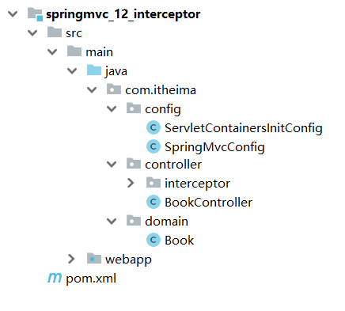

**10.2.2 拦截器开发**

（1）创建拦截器类

让类实现HandlerInterceptor接口，重写接口中的三个方法

<table>
<colgroup>
<col style="width: 100%" />
</colgroup>
<tbody>
<tr class="odd">
<td>Java 
@Component 
//定义拦截器类，实现HandlerInterceptor接口 
//注意当前类必须受Spring容器控制 
public class ProjectInterceptor implements HandlerInterceptor { 
@Override 
//原始方法调用前执行的内容 
public boolean preHandle(HttpServletRequest request, HttpServletResponse response, Object handler) throws Exception { 
System.out.println("preHandle..."); 
return true; 
} 
 
@Override 
//原始方法调用后执行的内容 
public void postHandle(HttpServletRequest request, HttpServletResponse response, Object handler, ModelAndView modelAndView) throws Exception { 
System.out.println("postHandle..."); 
} 
 
@Override 
//原始方法调用完成后执行的内容 
public void afterCompletion(HttpServletRequest request, HttpServletResponse response, Object handler, Exception ex) throws Exception { 
System.out.println("afterCompletion..."); 
} 
}</td>
</tr>
</tbody>
</table>

**拦截器类要被SpringMVC容器扫描到**。

（2）配置拦截器类

<table>
<colgroup>
<col style="width: 100%" />
</colgroup>
<tbody>
<tr class="odd">
<td>Java 
@Configuration 
public class SpringMvcSupport extends WebMvcConfigurationSupport { 
@Autowired 
private ProjectInterceptor projectInterceptor; 
 
@Override 
protected void addResourceHandlers(ResourceHandlerRegistry registry) { 
registry.addResourceHandler("/pages/**").addResourceLocations("/pages/"); 
} 
 
@Override 
protected void addInterceptors(InterceptorRegistry registry) { 
//配置拦截器 
registry.addInterceptor(projectInterceptor).addPathPatterns("/books" ); 
} 
}</td>
</tr>
</tbody>
</table>

（3）SpringMVC添加SpringMvcSupport包扫描

<table>
<colgroup>
<col style="width: 100%" />
</colgroup>
<tbody>
<tr class="odd">
<td>Java 
@Configuration 
@ComponentScan({"com.itheima.controller","com.itheima.config"}) 
@EnableWebMvc 
public class SpringMvcConfig{ 
 
}</td>
</tr>
</tbody>
</table>

（4）运行程序测试

使用PostMan发送http://localhost/books

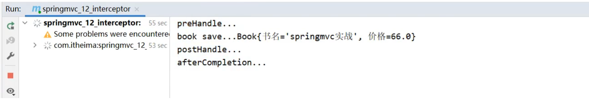

发送http://localhost/books/100会发现拦截器没有被执行，原因是拦截器的addPathPatterns方法配置的拦截路径是/books，现在发送的是/books/100，所以没有匹配上，因此没有拦截，拦截器就不会执行。

（5）修改拦截器拦截规则

<table>
<colgroup>
<col style="width: 100%" />
</colgroup>
<tbody>
<tr class="odd">
<td>Java 
@Configuration 
public class SpringMvcSupport extends WebMvcConfigurationSupport { 
@Autowired 
private ProjectInterceptor projectInterceptor; 
 
@Override 
protected void addResourceHandlers(ResourceHandlerRegistry registry) { 
registry.addResourceHandler("/pages/**").addResourceLocations("/pages/"); 
} 
 
@Override 
protected void addInterceptors(InterceptorRegistry registry) { 
//配置拦截器 
registry.addInterceptor(projectInterceptor).addPathPatterns("/books","/books/*" ); 
} 
}</td>
</tr>
</tbody>
</table>

这时再访问http://localhost/books/100拦截器就会被执行。

（6）简化SpringMvcSupport的编写

<table>
<colgroup>
<col style="width: 100%" />
</colgroup>
<tbody>
<tr class="odd">
<td>Java 
@Configuration 
@ComponentScan({"com.itheima.controller"}) 
@EnableWebMvc 
//实现WebMvcConfigurer接口可以简化开发，但具有一定的侵入性 
public class SpringMvcConfig implements WebMvcConfigurer { 
@Autowired 
private ProjectInterceptor projectInterceptor; 
 
@Override 
public void addInterceptors(InterceptorRegistry registry) { 
//配置多拦截器 
registry.addInterceptor(projectInterceptor).addPathPatterns("/books","/books/*"); 
} 
}</td>
</tr>
</tbody>
</table>

拦截器的执行流程：当有拦截器后，请求会先进入preHandle方法，如果方法返回true，则放行继续执行后面的handle（controller的方法）和后面的方法，如果返回false，则直接跳过后面方法的执行。

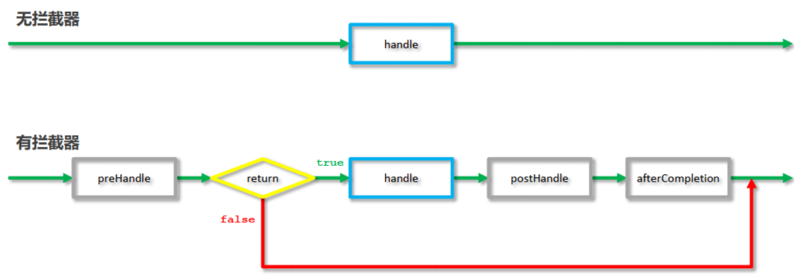

**10.3 拦截器参数**

**10.3.1 前置处理方法**

原始方法之前运行preHandle

<table>
<colgroup>
<col style="width: 100%" />
</colgroup>
<tbody>
<tr class="odd">
<td>Java 
public boolean preHandle(HttpServletRequest request, 
HttpServletResponse response, 
Object handler) throws Exception { 
System.out.println("preHandle"); 
return true; 
}</td>
</tr>
</tbody>
</table>

request：请求对象

response：响应对象

handler：被调用的处理器对象，本质上是一个方法对象，对反射中的Method对象进行了再包装

使用request对象可以获取请求数据中的内容，如获取请求头的Content-Type

<table>
<colgroup>
<col style="width: 100%" />
</colgroup>
<tbody>
<tr class="odd">
<td>Java 
public boolean preHandle(HttpServletRequest request, HttpServletResponse response, Object handler) throws Exception { 
String contentType = request.getHeader("Content-Type"); 
System.out.println("preHandle..."+contentType); 
return true; 
}</td>
</tr>
</tbody>
</table>

使用handler参数，可以获取方法的相关信息

<table>
<colgroup>
<col style="width: 100%" />
</colgroup>
<tbody>
<tr class="odd">
<td>Java 
public boolean preHandle(HttpServletRequest request, HttpServletResponse response, Object handler) throws Exception { 
HandlerMethod hm = (HandlerMethod)handler; 
String methodName = hm.getMethod().getName(); //可以获取方法的名称 
System.out.println("preHandle..."+methodName); 
return true; 
}</td>
</tr>
</tbody>
</table>

**10.3.2 后置处理方法**

原始方法运行后运行，如果原始方法被拦截，则不执行

<table>
<colgroup>
<col style="width: 100%" />
</colgroup>
<tbody>
<tr class="odd">
<td>Java 
 
public void postHandle(HttpServletRequest request, 
HttpServletResponse response, 
Object handler, 
ModelAndView modelAndView) throws Exception { 
System.out.println("postHandle"); 
}</td>
</tr>
</tbody>
</table>

前三个参数和上面的一致

modelAndView：如果处理器执行完成具有返回结果，可以读取到对应数据与页面信息，并进行调整。因为现在都是返回json数据，所以该参数的使用率不高

**10.3.3 完成处理方法**

拦截器最后执行的方法，无论原始方法是否执行

<table>
<colgroup>
<col style="width: 100%" />
</colgroup>
<tbody>
<tr class="odd">
<td>Java 
public void afterCompletion(HttpServletRequest request, 
HttpServletResponse response, 
Object handler, 
Exception ex) throws Exception { 
System.out.println("afterCompletion"); 
}</td>
</tr>
</tbody>
</table>

前三个参数与上面的一致

ex：如果处理器执行过程中出现异常对象，可以针对异常情况进行单独处理。因为现在已经有全局异常处理器类，所以该参数的使用率也不高

这三个方法中，最常用的是preHandle，在这个方法中可以通过返回值来决定是否要进行放行，可以把业务逻辑放在该方法中，如果满足业务则返回true放行，不满足则返回false拦截。

**10.4 拦截器链配置**

目前项目中只添加了一个拦截器，也可以添加多个拦截器。

**10.4.1 配置多个拦截器**

（1）创建拦截器类

实现接口，并重写接口中的方法

<table>
<colgroup>
<col style="width: 100%" />
</colgroup>
<tbody>
<tr class="odd">
<td>Java 
@Component 
public class ProjectInterceptor2 implements HandlerInterceptor { 
@Override 
public boolean preHandle(HttpServletRequest request, HttpServletResponse response, Object handler) throws Exception { 
System.out.println("preHandle...222"); 
return false; 
} 
 
@Override 
public void postHandle(HttpServletRequest request, HttpServletResponse response, Object handler, ModelAndView modelAndView) throws Exception { 
System.out.println("postHandle...222"); 
} 
 
@Override 
public void afterCompletion(HttpServletRequest request, HttpServletResponse response, Object handler, Exception ex) throws Exception { 
System.out.println("afterCompletion...222"); 
} 
}</td>
</tr>
</tbody>
</table>

（2）配置拦截器类

<table>
<colgroup>
<col style="width: 100%" />
</colgroup>
<tbody>
<tr class="odd">
<td>Java 
@Configuration 
@ComponentScan({"com.itheima.controller"}) 
@EnableWebMvc 
//实现WebMvcConfigurer接口可以简化开发，但具有一定的侵入性 
public class SpringMvcConfig implements WebMvcConfigurer { 
@Autowired 
private ProjectInterceptor projectInterceptor; 
@Autowired 
private ProjectInterceptor2 projectInterceptor2; 
 
@Override 
public void addInterceptors(InterceptorRegistry registry) { 
//配置多拦截器 
registry.addInterceptor(projectInterceptor).addPathPatterns("/books","/books/*"); 
registry.addInterceptor(projectInterceptor2).addPathPatterns("/books","/books/*"); 
} 
}</td>
</tr>
</tbody>
</table>

（3）运行程序，观察顺序

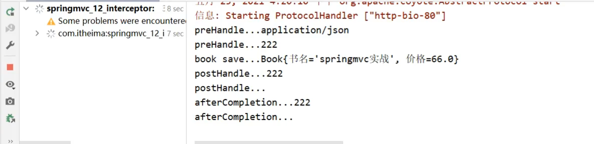

**10.4.2 拦截器的运行顺序**

当配置多个拦截器时，形成拦截器链

拦截器链的运行顺序和拦截器添加顺序有关，先进后出

preHandle：与配置顺序相同，必定运行

postHandle：与配置顺序相反，可能不运行

afterCompletion：与配置顺序相反，可能不运行

当拦截器中出现对原始处理器的拦截，后面的拦截器均终止运行

当拦截器运行中断，仅运行配置在前面的拦截器的afterCompletion操作

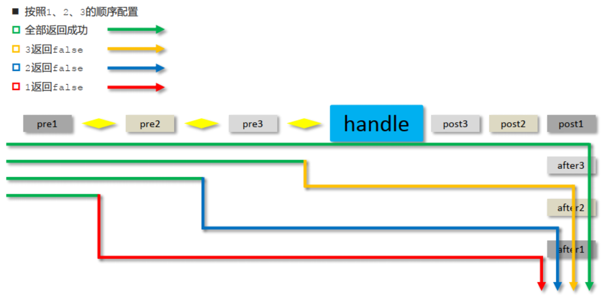
