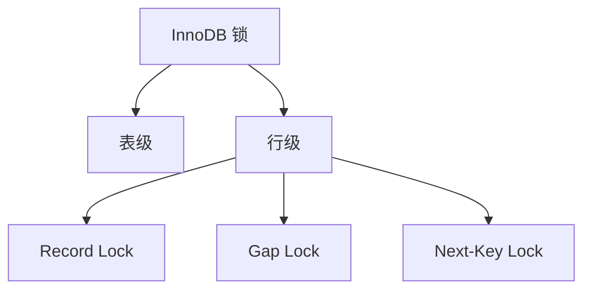

# MySQL 锁

## 为什么还需要锁

MVCC 主要优化一致性读，但涉及修改、当前读和并发写冲突时仍然需要锁。

## 第一层分类

```mermaid
flowchart TD
    A[InnoDB 锁] --> B[表级]
    A --> C[行级]
    C --> D[Record Lock]
    C --> E[Gap Lock]
    C --> F[Next-Key Lock]
```

## Record Lock

锁住索引记录本身。

## Gap Lock

锁住索引记录之间的间隙。

## Next-Key Lock

通常可以理解为 Record Lock + Gap Lock。
