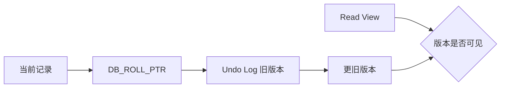

# MVCC

MVCC：Multi-Version Concurrency Control，多版本并发控制。

## 1. 为什么需要 MVCC

数据库并发访问时，如果读写都加锁，会降低并发度。

MVCC 的核心价值是让很多一致性读不必等待写锁。

## 2. 核心组成

主要理解：

1. 行记录隐藏字段
2. Undo Log
3. 版本链
4. Read View

## 3. 隐藏字段

| 字段 | 作用 |
|---|---|
| `DB_TRX_ID` | 最近修改该记录的事务 ID |
| `DB_ROLL_PTR` | 指向 Undo Log 历史版本 |
| `DB_ROW_ID` | 必要时生成的隐藏行 ID |

## 4. RC 与 RR

- RC：通常每次一致性读生成新的 Read View
- RR：同一事务中的一致性读通常复用 Read View

!!! warning "易错点"
    MVCC 主要解决一致性读的并发问题，并不意味着数据库完全不需要锁。
