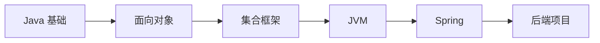

# Java

Java 后端知识主线。

```mermaid
flowchart LR
    A[Java 基础] --> B[面向对象]
    B --> C[集合框架]
    C --> D[JVM]
    D --> E[Spring]
    E --> F[后端项目]
```

## 学习顺序

1. Java 基础语法
2. 面向对象
3. 集合与泛型
4. 异常与 IO
5. 多线程与并发
6. JVM
7. Spring / Spring Boot
8. 项目实践
