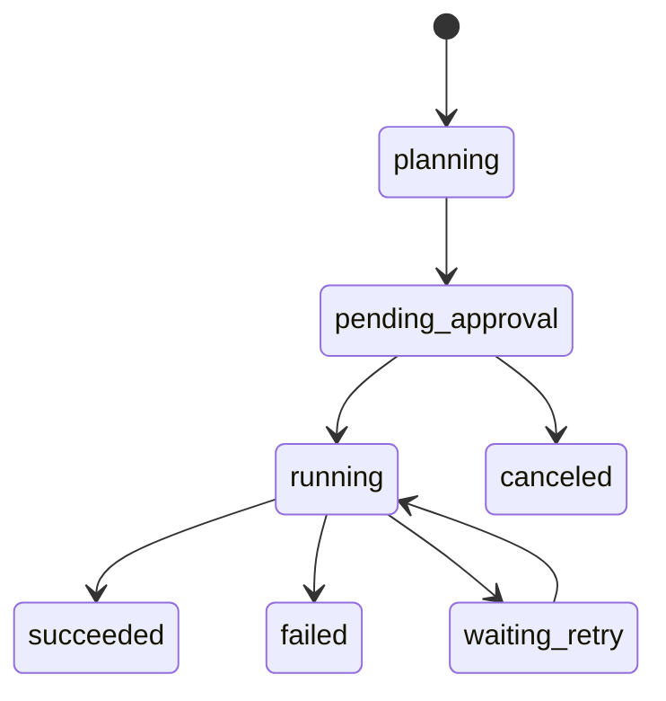

# AERA-Lite

AI-Native 异常响应与资源编排后端。

## 状态机

```mermaid
stateDiagram-v2
    [*] --> planning
    planning --> pending_approval
    pending_approval --> running
    running --> succeeded
    running --> failed
    running --> waiting_retry
    waiting_retry --> running
    pending_approval --> canceled
```

## 项目文档建议

1. Problem
2. Architecture
3. State Machine
4. Locking
5. Webhook
6. Approval
7. Observability
8. Demo Path
9. Interview Talking Points
