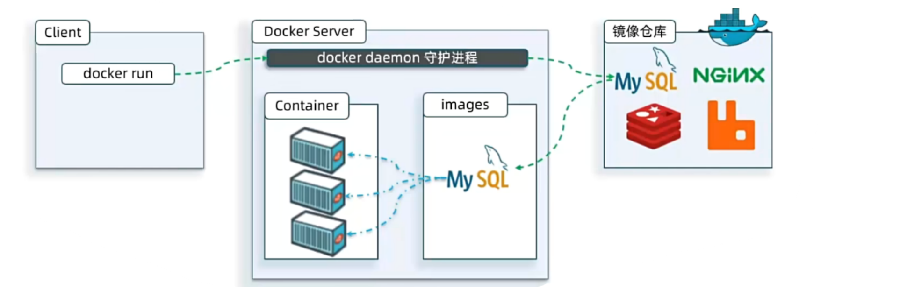
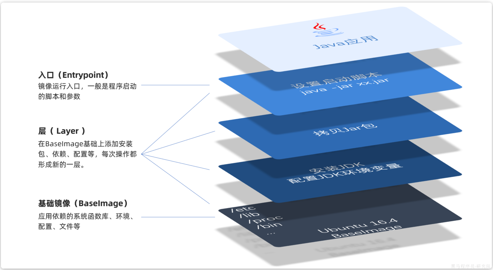
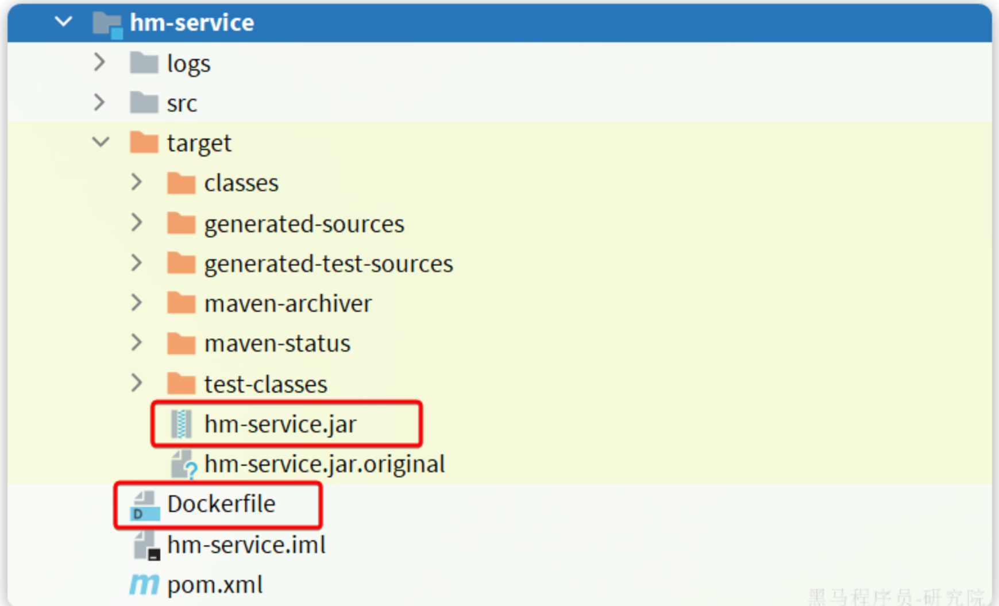

# Docker笔记

**一、基础概念篇**

Docker 是一个开源的应用容器引擎，它允许开发者将应用程序及其所有依赖项打包成一个可移植的容器，然后发布到任何支持 Docker 的环境中运行。这种 “一次构建，到处运行” 的特性，解决了传统开发和部署过程中环境不一致的问题，极大地提高了开发、测试和部署的效率

Docker官网：

**\[该类型的内容暂不支持下载\]**

**1.Docker 核心组件**

**镜像**（Image）：Docker 镜像类似于一个只读的模板，包含了运行应用程序所需的所有内容，如代码、运行时环境、系统工具、系统库等。可以将镜像理解为一个软件安装包。

**容器**（Container）：容器是镜像的运行实例，是可运行的实体。容器可以被启动、停止、删除，每个容器都是相互隔离的，保证应用程序之间不会相互干扰。

**仓库**（Repository）：仓库是存储镜像的地方，分为公共仓库和私有仓库。公共仓库如 Docker Hub，用户可以从中下载官方或其他开发者共享的镜像，也可以将自己创建的镜像上传到仓库中进行分享。

**2.Docker与传统虚拟化对比**

传统虚拟化技术（如 VMware、VirtualBox）是通过 Hypervisor 在硬件层面模拟出多个虚拟操作系统，每个虚拟系统都有独立的内核、文件系统和资源，资源占用较高；而 Docker 利用 Linux 内核的 Namespaces 和 Cgroups 实现资源隔离和限制，多个容器共享宿主机的内核，因此更轻量级，启动速度更快，资源利用率更高。

**二、核心操作篇**

官方帮助文档：

**\[该类型的内容暂不支持下载\]**

**1.安装Docker**

首先删除原来的Docker：

<table>
<colgroup>
<col style="width: 100%" />
</colgroup>
<tbody>
<tr class="odd">
<td>PowerShell 
yum remove docker \ 
docker-client \ 
docker-client-latest \ 
docker-common \ 
docker-latest \ 
docker-latest-logrotate \ 
docker-logrotate \ 
docker-engine \ 
docker-selinux</td>
</tr>
</tbody>
</table>

安装一个yum工具：

<table>
<colgroup>
<col style="width: 100%" />
</colgroup>
<tbody>
<tr class="odd">
<td>PowerShell 
sudo yum install -y yum-utils device-mapper-persistent-data lvm2</td>
</tr>
</tbody>
</table>

安装成功后，执行命令，配置Docker的yum源（已更新为阿里云源）：

<table>
<colgroup>
<col style="width: 100%" />
</colgroup>
<tbody>
<tr class="odd">
<td>PowerShell 
sudo yum-config-manager --add-repo https://mirrors.aliyun.com/docker-ce/linux/centos/docker-ce.repo 
 
sudo sed -i 's+download.docker.com+mirrors.aliyun.com/docker-ce+' /etc/yum.repos.d/docker-ce.repo</td>
</tr>
</tbody>
</table>

更新yum，建立缓存：

<table>
<colgroup>
<col style="width: 100%" />
</colgroup>
<tbody>
<tr class="odd">
<td>PowerShell 
sudo yum makecache fast</td>
</tr>
</tbody>
</table>

最后，执行命令，安装Docker：

<table>
<colgroup>
<col style="width: 100%" />
</colgroup>
<tbody>
<tr class="odd">
<td>PowerShell 
yum install -y docker-ce docker-ce-cli containerd.io docker-buildx-plugin docker-compose-plugin</td>
</tr>
</tbody>
</table>

启动和校验：

<table>
<colgroup>
<col style="width: 100%" />
</colgroup>
<tbody>
<tr class="odd">
<td>PowerShell 
# 启动Docker 
systemctl start docker 
 
# 停止Docker 
systemctl stop docker 
 
# 重启 
systemctl restart docker 
 
# 设置开机自启 
systemctl enable docker 
 
# 执行docker ps命令，如果不报错，说明安装启动成功 
docker ps</td>
</tr>
</tbody>
</table>

由于Docker中央仓库在国外，拉取镜像时速度可能很慢，所以需要配置镜像加速：

1.创建daemon.json文件并打开

<table>
<colgroup>
<col style="width: 100%" />
</colgroup>
<tbody>
<tr class="odd">
<td>PowerShell 
sudo mkdir -p /etc/docker 
sudo touch /etc/docker/daemon.json 
vim /etc/docker/daemon.json</td>
</tr>
</tbody>
</table>

2.在daemon.json文件中粘贴如下内容

<table>
<colgroup>
<col style="width: 100%" />
</colgroup>
<tbody>
<tr class="odd">
<td>JSON 
{ 
"builder": { 
"gc": { 
"defaultKeepStorage": "20GB", 
"enabled": true 
} 
}, 
"experimental": true, 
"features": { 
"buildkit": true 
}, 
"insecure-registries": [ 
"172.24.86.231" 
], 
"registry-mirrors": [ 
"https://dockerproxy.com", 
"https://mirror.baidubce.com", 
"https://ccr.ccs.tencentyun.com", 
"https://docker.m.daocloud.io", 
"https://docker.nju.edu.cn", 
"https://docker.mirrors.ustc.edu.cn" 
], 
"log-driver":"json-file", 
"log-opts": { 
"max-size":"500m", 
"max-file":"3" 
} 
}</td>
</tr>
</tbody>
</table>

3.添加完成之后重新加载文件，重启Docker

<table>
<colgroup>
<col style="width: 100%" />
</colgroup>
<tbody>
<tr class="odd">
<td>PowerShell 
systemctl daemon-reload 
systemctl restart docker</td>
</tr>
</tbody>
</table>

**2.镜像操作**

Docker的镜像是从**镜像仓库**（DockerRegistry）下载的，Docker镜像仓库分为公共镜像仓库和私有镜像仓库：

公共镜像仓库：Docker官方提供的仓库，其中包含基本所有软件的镜像，任何人都可以下载镜像和上传自己制作的镜像

私有镜像仓库：各大软件公司可以搭建私有的镜像仓库，也称为第三方仓库。由于官方仓库下载速度较慢，一般我们都会使用第三方仓库提供的镜像加速功能

docker官方镜像仓库网址：

**\[该类型的内容暂不支持下载\]**

国内可能访问不了这个网址，可以用国内提供的如轩辕镜像站代替：

**\[该类型的内容暂不支持下载\]**

<table>
<colgroup>
<col style="width: 25%" />
<col style="width: 25%" />
<col style="width: 25%" />
<col style="width: 25%" />
</colgroup>
<tbody>
<tr class="odd">
<td>操作类型</td>
<td>命令</td>
<td>功能</td>
<td>示例</td>
</tr>
<tr class="even">
<td>检索</td>
<td>docker search [关键词]</td>
<td>在Docker Hub上搜索镜像</td>
<td>docker search ubuntu：搜索名称或描述中包含“ubuntu”的镜像</td>
</tr>
<tr class="odd">
<td>下载</td>
<td>docker pull [镜像名称[:标签]]</td>
<td>从仓库拉取指定镜像，不指定标签时默认拉取latest标签镜像</td>
<td>docker pull ubuntu拉取Ubuntu官方最新版镜像 
docker pull nginx:1.23：拉取Nginx1.23版本镜像</td>
</tr>
<tr class="even">
<td>列表</td>
<td>docker images</td>
<td>查看本地已下载的镜像列表</td>
<td>无</td>
</tr>
<tr class="odd">
<td>删除</td>
<td>docker rmi [镜像ID/镜像名称[:标签]]</td>
<td>删除本地镜像，若镜像被容器使用，需先停止相关容器</td>
<td>docker rmi ubuntu：删除本地的Ubuntu镜像 
docker rmi -f [镜像ID]：强制删除镜像</td>
</tr>
</tbody>
</table>

**3.容器操作**

<table>
<colgroup>
<col style="width: 25%" />
<col style="width: 25%" />
<col style="width: 25%" />
<col style="width: 25%" />
</colgroup>
<tbody>
<tr class="odd">
<td>操作类型</td>
<td>命令</td>
<td>功能</td>
<td>示例</td>
</tr>
<tr class="even">
<td>检索正在运行的容器</td>
<td>docker ps</td>
<td>查看正在运行的容器</td>
<td>无</td>
</tr>
<tr class="odd">
<td>检索所有容器</td>
<td>docker ps -a</td>
<td>查看所有容器（包括已停止的）</td>
<td>无</td>
</tr>
<tr class="even">
<td>创建并运行容器</td>
<td>docker run [参数] [镜像名称] [命令]</td>
<td>基于指定镜像创建并运行容器，[参数]用于配置容器运行方式，[命令]为容器启动后执行的命令</td>
<td>无</td>
</tr>
<tr class="odd">
<td rowspan="5">docker run常用参数</td>
<td>-p &lt;宿主机端口&gt;:&lt;容器端口&gt;</td>
<td>将宿主机端口映射到容器端口，实现外部对容器服务的访问</td>
<td>docker run -p 8080:80 nginx：将宿主机的8080端口映射到Nginx容器的80端口，可通过宿主机IP:8080访问Nginx容器</td>
</tr>
<tr class="even">
<td>-d</td>
<td>以后台守护进程模式运行容器，容器在后台持续运行</td>
<td>docker run -d nginx：在后台运行Nginx容器</td>
</tr>
<tr class="odd">
<td>--name &lt;容器名称&gt;</td>
<td>为容器指定一个自定义名称，方便后续管理和识别</td>
<td>docker run --name my_nginx_nginx：创建一个名为my_nginx的Nginx容器</td>
</tr>
<tr class="even">
<td>-e KEY=VALUE</td>
<td>为容器设置环境变量，KEY是键，VALUE是值</td>
<td>docker run -d --name mysql -p 3306:3306 -e TZ=Asia/Shanghai -e MYSQL_ROOT_PASSWORD=123 mysql：安装mysql最新版的命令，TZ=Asia/Shanghai设置时区，MYSQL_ROOT_PASSWORD=123设置密码</td>
</tr>
<tr class="odd">
<td>-v &lt;宿主机路径&gt;:&lt;容器路径&gt;</td>
<td>挂载数据卷或绑定挂载，实现数据在宿主机和容器间共享</td>
<td>docker run -v /data:/app/data ubuntu：将宿主机的 /data 目录挂载到 Ubuntu 容器的 /app/data 目录 
docker run -v my_volume:/app/data ubuntu：将名为 my_volume 的数据卷挂载到容器的 /app/data 目录</td>
</tr>
<tr class="even">
<td>启动容器</td>
<td>docker start [容器ID/容器名称]</td>
<td>启动已停止的容器</td>
<td>docker start my_container：启动名为“my_container”的容器</td>
</tr>
<tr class="odd">
<td>停止容器</td>
<td>docker stop [容器ID/容器名称]</td>
<td>停止正在运行的容器</td>
<td>docker stop 123abc：停止ID为“123abc”的容器</td>
</tr>
<tr class="even">
<td>重启容器</td>
<td>docker restart [容器ID/容器名称]</td>
<td>重新启动容器</td>
<td>docker restart my_container：重启名为“my_container”的容器</td>
</tr>
<tr class="odd">
<td>进入容器</td>
<td>docker exec -it [容器ID/容器名称] [命令]</td>
<td>进入正在运行的容器并执行指定命令，通常执行bash或sh进入容器的shell</td>
<td>docker exec -it my_container bash：进入名为“my_container”的容器的bash终端</td>
</tr>
<tr class="even">
<td>删除已停止的容器</td>
<td>docker rm [容器ID/容器名称]</td>
<td>删除已停止的容器</td>
<td>docker rm my_container：删除名为“my_container”且已停止的容器</td>
</tr>
<tr class="odd">
<td>强制删除正在运行的容器</td>
<td>docker rm -f [容器ID/容器名称]</td>
<td>强制删除正在运行的容器</td>
<td>docker rm -f 123abc：强制删除ID为“123abc”正在运行的容器</td>
</tr>
<tr class="even">
<td>查看容器日志</td>
<td>docker logs [参数] [容器ID/容器名称]</td>
<td>查看容器的日志输出，-f参数可以实时跟踪日志（类似tail -f），--tail=n参数指定显示最后n行日志</td>
<td>docker logs my_container：查看名为“my_container”的容器日志 
docker logs -f my_container：实时跟踪“my_container”的日志输出</td>
</tr>
<tr class="odd">
<td>查看容器资源使用统计信息</td>
<td>docker stats [容器ID/容器名称]</td>
<td>实时显示容器的CPU、内存、网络、磁盘I/O等资源使用情况</td>
<td>docker stats my_container：显示名为“my_container”的容器资源使用统计信息</td>
</tr>
<tr class="even">
<td>查看容器配置、环境变量等信息</td>
<td>docker inspect [容器ID/容器名称]</td>
<td>获取容器的完整配置、运行状态、网络、存储、环境变量等所有细节</td>
<td>docker inspect mysql：查看mysql容器的配置信息 
`docker inspect mysql</td>
</tr>
</tbody>
</table>

**4.提交、保存与加载操作**

|          |                                                                   |                                                                                        |                                                                          |                                                                                                                                                                                |
|----------|-------------------------------------------------------------------|----------------------------------------------------------------------------------------|--------------------------------------------------------------------------|--------------------------------------------------------------------------------------------------------------------------------------------------------------------------------|
| 操作类型 | 命令                                                              | 功能                                                                                   | 详细说明                                                                 | 示例                                                                                                                                                                           |
| 提交     | docker commit \[参数\] \[容器ID或名称\] \[目标镜像名称\[:标签\]\] | 将容器的修改保存为新的镜像。容器内的文件系统变更、安装的软件等内容都会被记录到新镜像中 | -a参数指定作者信息，-m参数添加提交说明。常用于基于现有容器定制个性化镜像 | docker commit -m "添加nginx配置" -a "John Doe" my_nginx_container my_nginx_image:v1：将名为 my_nginx_container 的容器提交为新镜像 my_nginx_image:v1 ，并添加提交说明和作者信息 |
| 保存     | docker save \[参数\] \[镜像名称\[:标签\]\] -o \[保存文件名\]      | 将本地镜像保存为一个文件，便于在不同环境间传输镜像                                     | -o参数指定输出文件名，文件格式为 tar。可通过压缩进一步减小文件体积       | docker save ubuntu:latest -o ubuntu_latest.tar：将本地的 ubuntu:latest 镜像保存为 ubuntu_latest.tar 文件                                                                       |
| 加载     | docker load -i \[镜像文件路径\]                                   | 加载通过docker save保存的镜像文件到本地镜像库                                          | -i参数指定镜像文件路径                                                   | docker load -i ubuntu_latest.tar：将 ubuntu_latest.tar 文件中的镜像加载到本地 Docker 环境中                                                                                    |

**三、进阶技术篇**

**1.数据管理**

**1.1 数据卷**

数据卷是一个可供容器使用的特殊目录，它绕过了联合文件系统，可以实现数据的持久化存储，并且数据卷的更改可以直接反映在宿主机上。

创建数据卷：docker volume create my_volume

在容器中使用数据卷：docker run -v my_volume:/app/data ubuntu

Docker 能够依据 -v 命令参数的格式差异，精准识别数据卷挂载与绑定挂载，这背后有着严谨的设计逻辑。

**1.1.1 数据卷挂载原理**

当 -v 命令的参数格式为 \[数据卷名称\]:\[容器内路径\] 时，Docker 会将其识别为**数据卷挂载**。Docker 内部维护着一套数据卷管理机制，所有的数据卷默认存储在宿主机的 **/var/lib/docker/volumes** 目录下。当用户指定数据卷名称进行挂载时，Docker 会检查该数据卷是否存在，以docker run -v ngconf:/etc/nginx为例：

若数据卷ngconf 不存在，按照既定规则在 /var/lib/docker/volumes 目录下创建新的数据卷ngconf，将容器内路径/etc/nginx下的内容复制到/var/lib/docker/volumes 目录下，并建立与容器内路径/etc/nginx的映射关系，实现双向数据绑定

若数据卷ngconf 存在，不论是否为空，都会将容器内路径/etc/nginx下的所有内容隐藏，建立/var/lib/docker/volumes/ngconf与容器内路径/etc/nginx的映射关系（数据卷内容替代容器内原有内容），实现双向数据绑定

从技术实现角度看，Docker 利用了 Linux 的文件系统特性，结合自身的数据管理策略，确保数据卷的稳定运行和数据安全。

**1.1.2 应用场景**

**持久化存储**：适用于数据库容器（如 MySQL、PostgreSQL），确保容器删除或重启后，数据库数据不会丢失，例如，docker run -d -v my_db_volume:/var/lib/mysql mysql ，将 MySQL 的数据存储在my_db_volume数据卷中

**多容器数据共享**：当多个容器需要共享数据时，数据卷是理想选择，比如，一个 Web 应用容器和一个文件处理容器需要共享上传的文件，可通过挂载同一个数据卷实现

**1.2 绑定挂载**

绑定挂载允许将宿主机上的目录或文件直接挂载到容器中，语法为 docker run -v /host/path:/container/path ubuntu ，其中 /host/path 是宿主机路径，/container/path 是容器内路径。

**1.2.1 绑定挂载原理**

当 -v 命令的参数格式为 \[宿主机绝对路径\]:\[容器内路径\] 时，Docker 会将其识别为**绑定挂载**。这种方式下，Docker 直接利用宿主机已存在的目录或文件进行挂载操作，跳过了自身对数据存储的管理环节，而是通过文件系统的链接机制，将容器内的路径与宿主机的路径建立直接联系。因此，容器内的数据操作会直接作用于宿主机对应路径，实现数据的快速同步更新。

以 docker run -v /data/nginx/html/:/usr/share/nginx/html为例 ：

不论宿主机绝对路径/data/nginx/html/是否存在，也不论/data/nginx/html/的内容如何，Docker只会将容器内路径/usr/share/nginx/html下的所有内容隐藏，建立宿主机绝对路径/data/nginx/html/与容器内路径/usr/share/nginx/html的映射关系（宿主机目录内容替代容器内原有内容），实现双向数据绑定

在实现过程中，Docker 借助了 Linux 系统的 mount 机制以及相关的文件系统接口，保障绑定挂载的高效运行。

**1.2.2 应用场景**

**开发调试**：开发过程中，可将本地代码目录挂载到容器内，容器内应用修改后无需重新构建镜像，直接生效，例如，docker run -v \$(pwd):/app node:latest npm start ，将当前目录挂载到 Node.js 容器的/app目录，方便实时调试代码

**配置文件管理**：将宿主机的配置文件挂载到容器内，实现灵活配置，如将 Nginx 的配置文件挂载到 Nginx 容器中，docker run -v /etc/nginx/conf.d:/etc/nginx/conf.d nginx ，便于修改配置而不改变镜像

**1.3 数据卷和绑定挂载区别**

不论是数据卷挂载，还是绑定挂载，都可以实现宿主机目录和容器内目录的**双向数据绑定**，即在宿主机上操作数据内容，容器内的数据也会被修改。

但是在实现原理上，两者还是有区别的：

**绑定挂载**：不管是什么情况（不存在、存在但为空、目录完整、目录不完整），都会直接将本地目录挂载到docker容器内的目录，容器内目录原有数据被隐藏

**数据卷挂载**：只在第一次挂载且数据卷不存在时才从容器中复制数据到数据卷中，其他情况下（存在但为空、目录完整、目录不完整）和数据挂载的操作一样，直接将本地目录挂载到docker容器内的目录，容器内目录原有数据被隐藏

数据卷是由Docker进行管理的，而绑定挂载的目录是本地绝对路径或相对路径，是由用户管理的，但是都支持双向数据绑定，那两种管理方式的区别是什么？

|                 |                                      |                                            |
|-----------------|--------------------------------------|--------------------------------------------|
| 维度            | 数据卷（Docker管理）                 | 绑定挂载（用户管理）                       |
| 路径归属        | Docker专属目录，用户无需关注具体路径 | 宿主机任意路径，用户完全掌控               |
| 生命周期        | 独立于容器，需手动删除卷才会清除数据 | 依赖宿主机路径，容器删除后数据仍由用户管理 |
| 跨平台/集群适配 | 优秀（Docker 统一管理，支持集群）    | 差（路径格式依赖系统，不支持集群）         |
| 权限管理        | Docker 自动适配，无需手动配置        | 需用户手动调整，易出现权限问题             |
| 隔离性/安全性   | 强（与宿主机隔离，降低逃逸风险）     | 弱（可挂载敏感路径，安全风险高）           |
| 使用场景        | 生产环境、持久化存储、跨环境部署     | 开发环境、临时调试、宿主机文件实时共享     |

**1.4 数据管理示例**

以命令 docker run -d -p 80:80 -v /data/nginx/html/:/usr/share/nginx/html -v ngconf:/etc/nginx --name myng nginx 为例，对数据卷和绑定挂载进行详细解析：

**数据卷应用解析**

命令片段：-v ngconf:/etc/nginx

解析：这里 ngconf 作为数据卷名称（若不存在，Docker 会自动创建），它将数据卷 ngconf 挂载到容器内的 /etc/nginx 目录 ，构建起数据卷与容器目录的映射关系。在实际使用中，容器内对 /etc/nginx 目录下的配置文件（如 Nginx 的配置文件）进行的任何修改，都会被持久化存储在数据卷 ngconf 中，即便容器被删除或重新创建，只要再次将 ngconf 数据卷挂载到新容器的 /etc/nginx 目录，之前的配置数据依然能够保留 ，实现了配置数据的持久化和多容器间的共享。  
**绑定挂载应用解析**

命令片段：-v /data/nginx/html/:/usr/share/nginx/html

解析：此为绑定挂载操作，将宿主机上的 /data/nginx/html/ 目录直接挂载到容器内的 /usr/share/nginx/html 目录，若宿主机的 /data/nginx/html/ 目录存放了 Nginx 网站的 HTML 页面文件，容器内的 Nginx 服务会直接读取和使用这些文件。当在宿主机上修改了 HTML 文件内容后，容器内的 Nginx 服务无需重启或重新构建镜像，便能立即展示更新后的内容 ，这种特性使其非常适合用于开发调试阶段快速迭代网站内容，或者在生产环境中方便地管理网站静态资源。

**其他参数解析**：

-d：以后台守护进程模式运行容器，使容器在后台持续运行，不占用当前终端，方便用户进行其他操作

-p 80:80：将宿主机的 80 端口映射到容器的 80 端口，通过访问宿主机的 IP 地址和 80 端口，即可访问容器内 Nginx 服务，实现容器服务与外部网络的通信

--name myng：为容器指定名称 myng ，便于后续对该容器进行管理和操作，如使用容器名称进行启动、停止、删除等操作

**2.网路管理**

**2.1 网络基础概念**

Docker 网络主要实现三大功能：

容器与容器之间的通信

容器与宿主机之间的通信

容器与外部网络（如互联网）的通信

同时提供网络隔离能力，确保不同应用的网络环境互不干扰。

**底层技术支持**

**网络命名空间（Network Namespace）**：每个容器默认拥有独立的网络命名空间，包含独立的网卡、IP 地址、路由表和防火墙规则，实现网络环境的完全隔离

**虚拟网桥（Bridge）**：Docker 创建的虚拟交换机，用于连接同一网络内的容器，是容器间通信的核心枢纽

**veth 对（Virtual Ethernet Pair）**：一对虚拟网络接口，一端存在于容器内部（通常命名为eth0），另一端连接到虚拟网桥，形成容器与网桥的通信通道

**NAT（网络地址转换）**：实现容器与外部网络的通信，容器通过宿主机的 IP 地址访问外部网络，外部网络通过宿主机端口映射访问容器服务

**2.2 默认网络模式**

Docker 安装后自动创建三种默认网络，可通过docker network ls命令查看。

**2.2.1 bridge模式**

**网络特性**：bridge模式是默认模式，容器连接到 Docker 默认网桥docker0，自动分配172.17.0.0/16网段内的 IP 地址，通过网桥实现容器间通信

**通信规则**：

同一 bridge 网络内的容器可通过 IP 地址相互通信

需通过-p参数进行端口映射（如-p 8080:80）实现外部网络访问容器

**适用场景**：大多数单主机多容器场景，需网络隔离且保持容器间通信能力

**示例命令**：

<table>
<colgroup>
<col style="width: 100%" />
</colgroup>
<tbody>
<tr class="odd">
<td>PowerShell 
# 启动容器时默认使用bridge网络 
docker run -d --name web1 nginx</td>
</tr>
</tbody>
</table>

**2.2.2 host模式**

**网络特性**：容器共享宿主机的网络命名空间，无独立 IP 地址，直接使用宿主机的网络接口和端口

**通信规则**：

容器服务直接占用宿主机端口（如容器内 80 端口对应宿主机 80 端口）

无需端口映射即可被外部访问

**适用场景**：对网络性能要求高的场景（如高并发服务），避免端口映射的性能损耗

**示例命令**：

<table>
<colgroup>
<col style="width: 100%" />
</colgroup>
<tbody>
<tr class="odd">
<td>PowerShell 
# 启动容器使用host网络 
docker run -d --network host --name web2 nginx</td>
</tr>
</tbody>
</table>

**2.2.3 none模式**

**网络特性**：容器拥有独立网络命名空间，但无任何网络配置（无 IP、无网卡、无路由）

**通信规则**：

无法与任何网络（包括宿主机和其他容器）通信

需手动配置网络（如添加网卡、设置 IP）才能实现通信

**适用场景**：需完全隔离网络的安全敏感场景（如数据加密处理容器）

**示例命令**：

<table>
<colgroup>
<col style="width: 100%" />
</colgroup>
<tbody>
<tr class="odd">
<td>PowerShell 
# 启动容器使用none网络 
docker run -d --network none --name web3 nginx</td>
</tr>
</tbody>
</table>

**2.2.4 container模式**

**网络特性**：新容器共享指定容器的网络命名空间，与被共享容器使用相同的 IP 和端口

**通信规则**：

与被共享容器完全共享网络栈，可通过localhost访问对方服务

端口不能冲突（如被共享容器占用 80 端口，新容器不能再使用 80 端口）

**适用场景**：两个紧耦合的服务（如前端容器与后端 API 容器）

**示例命令**：

<table>
<colgroup>
<col style="width: 100%" />
</colgroup>
<tbody>
<tr class="odd">
<td>PowerShell 
# 先启动一个基础容器 
docker run -d --name base nginx 
 
# 新容器共享base的网络 
docker run -it --network container:base --name web4 busybox</td>
</tr>
</tbody>
</table>

**2.3 自定义网络**

相比默认网络，自定义网络具有以下优势：

支持容器名称直接通信（内置 DNS 解析）

可自定义网段和网关，避免 IP 地址冲突

提供更好的网络隔离（不同自定义网络的容器默认无法通信）

支持多种网络驱动（如 bridge、overlay 等）

常用网络驱动类型：

|          |                               |                                                    |
|----------|-------------------------------|----------------------------------------------------|
| 驱动类型 | 适用场景                      | 特点                                               |
| bridge   | 单主机多容器通信              | 自定义网桥，功能类似默认 bridge 但支持 DNS 解析    |
| overlay  | 跨主机容器通信（Swarm 集群）  | 可在多个 Docker 主机间创建分布式网络               |
| macvlan  | 需容器拥有独立 MAC 地址的场景 | 容器直接连接物理网络，获得与物理设备类似的网络身份 |
| host     | 同默认 host 模式              | 无额外特性，一般直接使用默认 host 网络             |

**自定义 bridge 网络操作**

创建自定义网络：

<table>
<colgroup>
<col style="width: 100%" />
</colgroup>
<tbody>
<tr class="odd">
<td>PowerShell 
# 创建基础自定义bridge网络 
docker network create my_bridge 
 
# 创建指定网段和网关的网络 
docker network create --driver bridge \ 
--subnet 192.168.100.0/24 \ 
--gateway 192.168.100.1 \ 
my_custom_bridge</td>
</tr>
</tbody>
</table>

查看网络详情：

<table>
<colgroup>
<col style="width: 100%" />
</colgroup>
<tbody>
<tr class="odd">
<td>PowerShell 
# 查看所有网络 
docker network ls 
 
# 查看指定网络详情（包含关联容器、IP网段等） 
docker network inspect my_custom_bridge</td>
</tr>
</tbody>
</table>

连接 / 断开容器与网络：

<table>
<colgroup>
<col style="width: 100%" />
</colgroup>
<tbody>
<tr class="odd">
<td>PowerShell 
# 将现有容器连接到指定网络 
docker network connect my_custom_bridge web1 
 
# 将容器从网络中断开 
docker network disconnect my_custom_bridge web1</td>
</tr>
</tbody>
</table>

删除自定义网络：

<table>
<colgroup>
<col style="width: 100%" />
</colgroup>
<tbody>
<tr class="odd">
<td>PowerShell 
# 需先断开所有关联容器 
docker network rm my_bridge</td>
</tr>
</tbody>
</table>

**2.4 容器间通信机制**

**2.4.1 同一网络内通信**

自定义 bridge 网络的通信：

<table>
<colgroup>
<col style="width: 100%" />
</colgroup>
<tbody>
<tr class="odd">
<td>PowerShell 
# 1. 创建自定义网络 
docker network create app_net 
 
# 2. 启动两个容器并加入该网络 
docker run -d --name app1 --network app_net nginx 
docker run -d --name app2 --network app_net nginx 
 
# 3. 在app1中访问app2（通过容器名称） 
docker exec -it app1 ping app2 # 成功通信（DNS自动解析）</td>
</tr>
</tbody>
</table>

基于默认 bridge 网络的通信：默认 bridge 网络不支持容器名称通信，需通过 IP 地址

<table>
<colgroup>
<col style="width: 100%" />
</colgroup>
<tbody>
<tr class="odd">
<td>PowerShell 
# 查看容器IP 
docker inspect -f '{{.NetworkSettings.IPAddress}}' app1 # 输出如172.17.0.2 
 
# 在另一个容器中通过IP访问 
docker exec -it app2 ping 172.17.0.2</td>
</tr>
</tbody>
</table>

**2.4.2 跨网络通信**

通过多网络连接实现：

<table>
<colgroup>
<col style="width: 100%" />
</colgroup>
<tbody>
<tr class="odd">
<td>PowerShell 
# 1. 创建两个网络 
docker network create net1 
docker network create net2 
 
# 2. 启动容器并加入net1 
docker run -d --name cross_app --network net1 nginx 
 
# 3. 将容器同时连接到net2 
docker network connect net2 cross_app 
 
# 4. 此时cross_app可与net1和net2中的容器通信</td>
</tr>
</tbody>
</table>

通过宿主机端口映射实现：

<table>
<colgroup>
<col style="width: 100%" />
</colgroup>
<tbody>
<tr class="odd">
<td>PowerShell 
# 容器1加入net1 
docker run -d --name net1_app --network net1 -p 8080:80 nginx 
 
# 容器2加入net2，通过宿主机IP:8080访问容器1 
docker run -it --network net2 busybox 
wget http://宿主机IP:8080 # 成功访问</td>
</tr>
</tbody>
</table>

**2.4.3 容器与外部网络通信**

Docker 默认配置路由和 NAT 规则，容器可直接访问外部网络：

<table>
<colgroup>
<col style="width: 100%" />
</colgroup>
<tbody>
<tr class="odd">
<td>PowerShell 
# 在容器内访问外部网站 
docker exec -it app1 ping baidu.com</td>
</tr>
</tbody>
</table>

外部网络访问容器需要通过端口映射实现：

<table>
<colgroup>
<col style="width: 100%" />
</colgroup>
<tbody>
<tr class="odd">
<td>PowerShell 
# 将容器80端口映射到宿主机8080端口 
docker run -d --name public_app -p 8080:80 nginx 
 
# 外部设备通过宿主机IP:8080访问容器服务 
curl http://宿主机IP:8080</td>
</tr>
</tbody>
</table>

**2.5 网络操作命令汇总**

|                  |                                          |                                              |
|------------------|------------------------------------------|----------------------------------------------|
| 操作目的         | 命令                                     | 示例                                         |
| 查看网络列表     | docker network ls                        | 无                                           |
| 创建网络         | docker network create \[选项\] 网络名    | docker network create --driver bridge my_net |
| 查看网络详情     | docker network inspect 网络名/ID         | docker network inspect my_net                |
| 连接容器到网络   | docker network connect 网络名 容器名     | docker network connect my_net app1           |
| 断开容器与网络   | ocker network disconnect 网络名 容器名   | docker network disconnect my_net app1        |
| 删除网络         | docker network rm 网络名/ID              | docker network rm my_net                     |
| 指定容器网络模式 | docker run --network 网络名 镜像名       | docker run --network host nginx              |
| 端口映射         | docker run -p 宿主机端口:容器端口 镜像名 | docker run -p 80:80 nginx                    |

**2.6 实战配置示例**

**多容器服务网络配置（单主机）**

需求：部署 Web 应用（Nginx）和数据库（MySQL），实现两者通信且 Web 可被外部访问

<table>
<colgroup>
<col style="width: 100%" />
</colgroup>
<tbody>
<tr class="odd">
<td>PowerShell 
# 1. 创建专用网络 
docker network create web_db_net 
 
# 2. 启动MySQL容器（加入网络，设置密码） 
docker run -d \ 
--name mysql_db \ 
--network web_db_net \ 
-e MYSQL_ROOT_PASSWORD=123456 \ 
-v mysql_data:/var/lib/mysql \ 
mysql:8.0 
 
# 3. 启动Nginx容器（加入网络，映射端口） 
docker run -d \ 
--name web_server \ 
--network web_db_net \ 
-p 80:80 \ 
-v ./html:/usr/share/nginx/html \ 
nginx 
 
# 4. 测试通信（Web容器访问MySQL） 
docker exec -it web_server bash 
ping mysql_db # 成功解析并通信</td>
</tr>
</tbody>
</table>

**跨网络服务通信配置**

需求：让处于frontend_net的前端容器访问backend_net的后端 API 容器

<table>
<colgroup>
<col style="width: 100%" />
</colgroup>
<tbody>
<tr class="odd">
<td>PowerShell 
# 1. 创建两个网络 
docker network create frontend_net 
docker network create backend_net 
 
# 2. 启动后端API容器（加入backend_net） 
docker run -d --name api --network backend_net -p 3000:3000 node:16 
 
# 3. 启动前端容器（加入frontend_net） 
docker run -d --name frontend --network frontend_net nginx 
 
# 4. 让前端容器同时连接到backend_net 
docker network connect backend_net frontend 
 
# 5. 测试通信 
docker exec -it frontend curl api:3000 # 成功访问后端API</td>
</tr>
</tbody>
</table>

**2.7 常见问题与排查**

**容器间无法通信**

检查是否处于同一网络：docker network inspect 网络名查看容器列表

验证网络隔离：不同自定义网络默认隔离，需通过多网络连接解决

检查防火墙规则：宿主机防火墙可能阻止容器间通信

**外部无法访问容器服务**

确认端口映射正确：docker ps查看PORTS列是否显示映射关系

检查宿主机 IP：外部访问需使用宿主机的实际 IP（非容器 IP）

验证容器服务运行：进入容器内部通过curl localhost:端口确认服务正常

**IP 地址冲突**

自定义网络时指定网段：避免与宿主机或其他网络网段重叠

定期清理无用容器和网络：减少 IP 资源占用

**DNS 解析失败**

优先使用自定义网络：默认支持容器名称解析

手动指定 DNS 服务器：创建网络时通过--dns参数配置，如docker network create --dns 8.8.8.8 my_net

**四、镜像构建篇（Dockerfile 详解）**

Dockerfile 是一个文本文件，包含一系列构建指令，用于**自动化构建 Docker 镜像**。通过 Dockerfile，开发者可以将应用程序的构建流程（如环境配置、依赖安装、代码复制等）以代码形式固化，实现 ”**一次编写，到处构建**“ 的标准化镜像生成过程。

例如，从零开始部署一个Java应用，分为 准备Linux服务（如CentOS）、安装并配置JDK、上传jar包、运行jar包 四个步骤，那么打包镜像就是 准备Linux运行环境、安装并配置JDK、拷贝jar包、配置启动脚本 四个操作，每一次操作就是生产一些文件，即镜像就是文件的集合。但是，镜像文件不是随意堆放的，而是按照操作步骤分层叠加而成，每一层形成的文件都会单独打包并标记一个唯一id，称为**Layer**（**层**），如果构建时用到的某些层其他人已经制作过，就可以直接拷贝使用这些层，而不用重复制作。

由于制作镜像的过程中，需要逐层处理和打包，比较复杂，所以Docker就提供了自动打包镜像的功能。我们只需要将打包的过程，每一层要做的事情用固定的语法写下来，交给Docker去执行即可。这种记录镜像结构的文件就称为**Dockerfile**。

**Dockerfile的作用**：

自动化构建：替代手动执行 docker commit 等命令，通过指令自动完成镜像构建，避免人为操作误差

可追溯性：Dockerfile 作为文本文件可纳入版本控制（如 Git），便于跟踪镜像变更历史，实现 “镜像即代码”

环境一致性：通过统一的 Dockerfile，确保不同环境（开发、测试、生产）中构建的镜像完全一致，解决 “开发环境能跑，生产环境报错” 的问题

**镜像与容器的关系**：

镜像（Image）：是一个只读模板，包含运行应用所需的代码、运行时、库、环境变量和配置文件，是容器的 “静态模板”。

容器（Container）：是镜像的运行实例，基于镜像创建，具有可写层，可被启动、停止、删除。

关系：Dockerfile 构建出镜像，镜像运行生成容器，即 “Dockerfile → 镜像 → 容器”。

**1.Dockerfile基本结构**

Dockerfile 由一系列**指令（Instruction）** 组成，指令格式为 “指令名称 参数”（指令名称通常大写，便于区分），典型结构如下：

<table>
<colgroup>
<col style="width: 100%" />
</colgroup>
<tbody>
<tr class="odd">
<td>Dockerfile 
# 基础镜像 
FROM ubuntu:20.04 
 
# 维护者信息（可选） 
LABEL maintainer="example@xxx.com" 
 
# 安装依赖 
RUN apt-get update &amp;&amp; apt-get install -y python3 
 
# 设置环境变量 
ENV APP_HOME /app 
 
# 指定工作目录 
WORKDIR $APP_HOME 
 
# 复制代码到镜像 
COPY . . 
 
# 暴露端口 
EXPOSE 8080 
 
# 启动命令 
CMD ["python3", "app.py"]</td>
</tr>
</tbody>
</table>

**构建上下文（Build Context）**

执行 docker build 命令时，会将指定目录（默认为当前目录）作为构建上下文，Docker 引擎会将上下文目录中的所有文件发送到 Docker 守护进程，供 Dockerfile 中的指令（如 COPY、ADD）使用。

示例：docker build -t myapp:v1 . 中，. 表示当前目录为构建上下文，Dockerfile文件就是放在这个目录中。

|                                                                                                      |
|------------------------------------------------------------------------------------------------------|
| **注意**：避免将无关文件（如日志、缓存）放入上下文，可通过 .dockerignore 文件排除（类似 .gitignore） |

**2.常用指令详解**

**2.1 FROM**

**作用**：指定基础镜像，所有后续指令都基于该镜像构建。

**格式**：FROM \<镜像名称\>:\<标签\>

**示例**：

<table>
<colgroup>
<col style="width: 100%" />
</colgroup>
<tbody>
<tr class="odd">
<td>Dockerfile 
# 使用官方 Python 镜像作为基础 
FROM python:3.9-slim 
 
# 使用 Alpine 精简镜像（体积更小） 
FROM alpine:3.16</td>
</tr>
</tbody>
</table>

|                                                                                                               |
|---------------------------------------------------------------------------------------------------------------|
| **说明**：每个 Dockerfile 必须以 FROM 开头，若需构建基础镜像（无父镜像），可使用 FROM scratch（表示空镜像）。 |

**2.2 LABEL**

**作用**：为镜像添加元数据（如作者、版本、描述等），替代已过时的 MAINTAINER 指令。

**格式**：LABEL \<键\>=\<值\> ...

**示例**：

<table>
<colgroup>
<col style="width: 100%" />
</colgroup>
<tbody>
<tr class="odd">
<td>Dockerfile 
LABEL maintainer="dev@example.com" \ 
version="1.0" \ 
description="A demo Python app"</td>
</tr>
</tbody>
</table>

**查看**：通过 docker inspect \<镜像名\> 可查看镜像的 LABEL 信息。

**2.3 RUN**

**作用**：在当前镜像层执行命令，并提交为新的镜像层（用于安装依赖、配置环境等）。

**格式**：

shell 格式：RUN \<命令\>（类似终端执行命令）

exec 格式：RUN \["可执行文件", "参数1", "参数2"\]（推荐，避免 shell 解析问题）

**示例**：

<table>
<colgroup>
<col style="width: 100%" />
</colgroup>
<tbody>
<tr class="odd">
<td>Dockerfile 
# 安装 nginx（shell 格式） 
RUN apt-get update &amp;&amp; apt-get install -y nginx 
 
# 创建目录（exec 格式） 
RUN ["mkdir", "-p", "/app/logs"]</td>
</tr>
</tbody>
</table>

**注意**：

多条命令建议合并为一条（用 && 连接），减少镜像层数（每层都会增加镜像体积）

避免 RUN apt-get update 单独执行（可能导致依赖版本不一致），应与 install 合并：

<table>
<colgroup>
<col style="width: 100%" />
</colgroup>
<tbody>
<tr class="odd">
<td>Dockerfile 
# 错误：单独执行 update，后续 install 可能用旧缓存 
RUN apt-get update 
RUN apt-get install -y nginx 
 
# 正确：合并命令 
RUN apt-get update &amp;&amp; \ 
apt-get install -y nginx &amp;&amp; \ 
rm -rf /var/lib/apt/lists/* # 清理缓存，减小体积</td>
</tr>
</tbody>
</table>

**2.4 CMD**

**作用**：指定容器启动时默认执行的命令。

**格式**：

shell 格式：CMD \<命令\>

exec 格式：CMD \["可执行文件", "参数1", "参数2"\]（推荐）

参数格式：CMD \["参数1", "参数2"\]（需与 ENTRYPOINT 配合使用）

**示例**：

<table>
<colgroup>
<col style="width: 100%" />
</colgroup>
<tbody>
<tr class="odd">
<td>Dockerfile 
# 启动 Python 应用（exec 格式） 
CMD ["python3", "app.py"] 
 
# 启动 bash（shell 格式） 
CMD bash</td>
</tr>
</tbody>
</table>

**特点**：

一个 Dockerfile 中只能有一条 CMD，若有多条，仅最后一条生效

容器启动时，命令行参数会覆盖 CMD（例如 docker run myapp python3 test.py 会替换默认的 app.py）

**2.5 ENTRYPOINT**

**作用**：设置容器启动时的 “入口程序”，与 CMD 类似，但参数不会被命令行参数覆盖（仅追加）。

**格式**：

shell 格式：ENTRYPOINT \<命令\>

exec 格式：ENTRYPOINT \["可执行文件", "参数1", "参数2"\]（推荐）

**示例**：

<table>
<colgroup>
<col style="width: 100%" />
</colgroup>
<tbody>
<tr class="odd">
<td>Dockerfile 
# 以 exec 格式定义入口程序 
ENTRYPOINT ["python3", "app.py"] 
 
# 配合 CMD 提供默认参数（若启动时无命令行参数，使用 "start"） 
CMD ["start"]</td>
</tr>
</tbody>
</table>

**运行效果**：

docker run myapp → 执行 python3 app.py start

docker run myapp stop → 执行 python3 app.py stop（命令行参数 “stop” 追加到 ENTRYPOINT 后）

**与 CMD 的区别**：

CMD 可被命令行参数覆盖，ENTRYPOINT 不会（仅追加）

通常 ENTRYPOINT 定义固定程序，CMD 提供默认参数

**2.6 EXPOSE**

**作用**：声明容器运行时监听的端口（仅为文档说明，不实际映射端口）。

**格式**：EXPOSE \<端口1\> \<端口2\> ...

**示例**：

<table>
<colgroup>
<col style="width: 100%" />
</colgroup>
<tbody>
<tr class="odd">
<td>Dockerfile 
# 声明容器监听 80 和 443 端口 
EXPOSE 80 443</td>
</tr>
</tbody>
</table>

**说明**：

实际端口映射需在 docker run 时通过 -p 或 -P 实现（如 docker run -p 8080:80 myapp）

用于告知使用者该镜像需要映射哪些端口，增强可读性

**2.7 ENV**

**作用**：设置环境变量，可在构建阶段和容器运行阶段使用。

**格式**：

ENV \<键\> \<值\>（单变量）

ENV \<键1\>=\<值1\> \<键2\>=\<值2\> ...（多变量）

**示例**：

<table>
<colgroup>
<col style="width: 100%" />
</colgroup>
<tbody>
<tr class="odd">
<td>Dockerfile 
# 设置单个环境变量 
ENV APP_PORT 8080 
 
# 设置多个环境变量 
ENV DB_HOST=localhost \ 
DB_PORT=3306</td>
</tr>
</tbody>
</table>

**使用**：

构建阶段：可被 RUN 等指令引用（如 RUN echo \$APP_PORT）

运行阶段：容器内可通过 \$键名 访问（如应用程序中读取 DB_HOST）

**2.8 ADD 和 COPY**

**作用**：将构建上下文（或远程文件）复制到镜像中。

|      |                                                                    |                          |
|------|--------------------------------------------------------------------|--------------------------|
| 指令 | 功能                                                               | 推荐场景                 |
| COPY | 仅复制本地文件 / 目录到镜像（支持通配符）                          | 本地文件复制（优先使用） |
| ADD  | 除复制外，支持自动解压压缩包（如 .tar、.zip）和下载远程文件（URL） | 需解压或下载远程文件时   |

**格式**：

<table>
<colgroup>
<col style="width: 100%" />
</colgroup>
<tbody>
<tr class="odd">
<td>Dockerfile 
# COPY：复制当前目录的 app.py 到镜像的 /app 目录 
COPY app.py /app/ 
 
# ADD：复制并解压 local.tar.gz 到镜像的 /data 目录 
ADD local.tar.gz /data/ 
 
# ADD：下载远程文件到镜像的 /tmp 目录 
ADD https://example.com/file.txt /tmp/</td>
</tr>
</tbody>
</table>

<table>
<colgroup>
<col style="width: 100%" />
</colgroup>
<tbody>
<tr class="odd">
<td>
<strong>注意</strong>：

路径若为目录，需以 / 结尾（如 COPY src/ /app/src/ 表示复制 src 目录下的内容到 /app/src/）

避免使用 ADD 下载远程文件（建议用 RUN wget 或 curl，更灵活控制下载后操作）
</td>
</tr>
</tbody>
</table>

**2.9 VOLUME**

**作用**：声明容器中的 “匿名卷”（持久化数据，避免容器删除时数据丢失）。

**格式**：VOLUME \["\<路径1\>", "\<路径2\>", ...\]

**示例**：

<table>
<colgroup>
<col style="width: 100%" />
</colgroup>
<tbody>
<tr class="odd">
<td>Dockerfile 
# 声明 /data 为匿名卷（容器运行时数据会保存在这里） 
VOLUME ["/data"]</td>
</tr>
</tbody>
</table>

**说明**：

容器启动时，若未通过 -v 指定宿主机目录映射，Docker 会自动创建匿名卷

通常用于数据库数据、日志等需要持久化的目录

**2.10 WORKDIR**

**作用**：设置后续指令（如 RUN、CMD、COPY 等）的工作目录（类似 cd 命令）。

**格式**：WORKDIR \<目录路径\>

**示例**：

<table>
<colgroup>
<col style="width: 100%" />
</colgroup>
<tbody>
<tr class="odd">
<td>Dockerfile 
# 设置工作目录为 /app 
WORKDIR /app 
 
# 后续命令在 /app 下执行（相当于 cd /app &amp;&amp; touch test.txt） 
RUN touch test.txt 
 
# 复制文件到当前工作目录（即 /app） 
COPY app.py .</td>
</tr>
</tbody>
</table>

|                                                                                        |
|----------------------------------------------------------------------------------------|
| **注意**：若目录不存在，WORKDIR 会自动创建；建议使用绝对路径，避免相对路径导致的混乱。 |

**2.11 USER**

**作用**：指定后续指令执行的用户（默认使用 root 用户）。

**格式**：USER \<用户名/UID\>

<table>
<colgroup>
<col style="width: 100%" />
</colgroup>
<tbody>
<tr class="odd">
<td>Dockerfile 
# 创建非 root 用户 appuser 
RUN useradd -m appuser 
 
# 切换到 appuser 执行后续命令 
USER appuser 
 
# 此时 RUN 命令以 appuser 身份执行 
RUN echo "Current user: $(whoami)"</td>
</tr>
</tbody>
</table>

|                                                                                            |
|--------------------------------------------------------------------------------------------|
| **安全意义**：避免容器内使用 root 用户，减少权限滥用风险（如应用程序漏洞被利用时的危害）。 |

**2.12 ARG**

**作用**：定义构建阶段的变量（仅在 docker build 时有效，容器运行时不可用）。

**格式**：ARG \<变量名\>\[=\<默认值\>\]

**示例**：

<table>
<colgroup>
<col style="width: 100%" />
</colgroup>
<tbody>
<tr class="odd">
<td>Dockerfile 
# 定义构建参数，默认值为 3.9 
ARG PYTHON_VERSION=3.9 
 
# 引用参数（构建时可通过 --build-arg 覆盖） 
FROM python:${PYTHON_VERSION}</td>
</tr>
</tbody>
</table>

**构建时传递参数**：

<table>
<colgroup>
<col style="width: 100%" />
</colgroup>
<tbody>
<tr class="odd">
<td>Dockerfile 
# 覆盖默认的 PYTHON_VERSION 
docker build --build-arg PYTHON_VERSION=3.10 -t myapp:v1 .</td>
</tr>
</tbody>
</table>

**2.13 其他常用指令**

**ONBUILD**：为当前镜像添加 “触发器”，当该镜像被用作其他镜像的基础镜像时，触发器指令会自动执行（用于制作 “基础镜像模板”）。

<table>
<colgroup>
<col style="width: 100%" />
</colgroup>
<tbody>
<tr class="odd">
<td>Dockerfile 
# 当其他镜像以本镜像为基础时，自动复制 app 目录 
ONBUILD COPY app /app</td>
</tr>
</tbody>
</table>

**HEALTHCHECK**：定义容器健康检查命令，用于判断容器是否正常运行（如应用是否响应请求）。

<table>
<colgroup>
<col style="width: 100%" />
</colgroup>
<tbody>
<tr class="odd">
<td>Dockerfile 
# 每 30 秒检查一次，超时 3 秒，连续 3 次失败视为不健康 
HEALTHCHECK --interval=30s --timeout=3s --retries=3 \ 
CMD curl -f http://localhost:8080/health || exit 1</td>
</tr>
</tbody>
</table>

**STOPSIGNAL**：指定容器停止时发送的系统信号（默认 SIGTERM）。

<table>
<colgroup>
<col style="width: 100%" />
</colgroup>
<tbody>
<tr class="odd">
<td>Dockerfile 
# 容器停止时发送 SIGINT 信号（类似 Ctrl+C） 
STOPSIGNAL SIGINT</td>
</tr>
</tbody>
</table>

**3.构建流程**

**3.1 完整构建步骤**

1、创建Dockerfile：在项目根目录创建Dockerfile（文件名固定，无后缀）。

2、编写Dockerfile：根据应用需求，按顺序编写FROM、RUN、COPY等指令。

3、创建.dockerignore：排除构建上下文无关文件（如 node_modules、.git），示例：

<table>
<colgroup>
<col style="width: 100%" />
</colgroup>
<tbody>
<tr class="odd">
<td>Dockerfile 
# .dockerignore 
node_modules/ 
.git/ 
*.log</td>
</tr>
</tbody>
</table>

4、执行构建命令

<table>
<colgroup>
<col style="width: 100%" />
</colgroup>
<tbody>
<tr class="odd">
<td>PowerShell 
# -t 指定镜像名称和标签，. 表示当前目录为上下文 
docker build -t &lt;镜像名&gt;:&lt;标签&gt; .</td>
</tr>
</tbody>
</table>

5、验证镜像

<table>
<colgroup>
<col style="width: 100%" />
</colgroup>
<tbody>
<tr class="odd">
<td>PowerShell 
# 查看镜像 
docker images &lt;镜像名&gt; 
 
# 运行容器测试 
docker run -it --rm &lt;镜像名&gt;:&lt;标签&gt;</td>
</tr>
</tbody>
</table>

**3.2 构建缓存机制**

Docker 构建时会对每一层指令结果进行缓存，若指令未修改，直接复用缓存，加速构建。

**缓存失效场景**：

指令内容修改（如 RUN 命令变更）

指令之前的任何一层发生变化（缓存是 “链式依赖”，前层失效则后续层均失效）

使用 --no-cache 强制禁用缓存：docker build --no-cache -t myapp:v1 .

**3.3 构建优化技巧**

**合并 RUN 指令**：减少镜像层数（每层约占 100-200MB 空间）。

**合理排序指令**：将频繁变更的指令（如 COPY 代码）放在末尾，利用缓存（不变的指令如 RUN apt-get 放前面）。

<table>
<colgroup>
<col style="width: 100%" />
</colgroup>
<tbody>
<tr class="odd">
<td>Dockerfile 
# 优化前：COPY 放在前面，代码变更会导致后续层缓存失效 
FROM python:3.9 
COPY . . # 代码频繁变更，导致下面的 RUN 缓存失效 
RUN pip install -r requirements.txt 
 
# 优化后：先安装依赖（依赖变更少），再复制代码 
FROM python:3.9 
COPY requirements.txt . # 依赖文件变更少，缓存易命中 
RUN pip install -r requirements.txt 
COPY . . # 代码变更仅影响最后一层</td>
</tr>
</tbody>
</table>

**清理缓存文件**：在 RUN 中删除安装缓存（如 apt-get clean、rm -rf /var/lib/apt/lists/\*）。

**3.4 最佳实践**

**3.4.1 保持镜像精简**

使用精简基础镜像（如 alpine 替代 ubuntu，slim 标签镜像）：

<table>
<colgroup>
<col style="width: 100%" />
</colgroup>
<tbody>
<tr class="odd">
<td>Dockerfile 
# 体积对比：ubuntu:20.04（约 72MB） vs alpine:3.16（约 5MB） 
FROM alpine:3.16</td>
</tr>
</tbody>
</table>

避免安装无用工具（如生产环境不需要 vim、curl 等调试工具）。

**3.4.2 非root用户运行**

<table>
<colgroup>
<col style="width: 100%" />
</colgroup>
<tbody>
<tr class="odd">
<td>Dockerfile 
# 创建用户并切换 
RUN addgroup -S appgroup &amp;&amp; adduser -S appuser -G appgroup 
USER appuser</td>
</tr>
</tbody>
</table>

**3.4.3 多阶段构建（减小镜像体积）**

适用于编译型语言（如 Go、Java），将 “构建阶段” 和 “运行阶段” 分离，仅保留运行所需文件。

**示例（Go 应用）**：

<table>
<colgroup>
<col style="width: 100%" />
</colgroup>
<tbody>
<tr class="odd">
<td>Dockerfile 
# 阶段 1：构建（使用包含编译工具的镜像） 
FROM golang:1.20 AS builder 
WORKDIR /app 
COPY . . 
RUN go build -o myapp main.go # 编译生成可执行文件 
 
# 阶段 2：运行（使用精简镜像） 
FROM alpine:3.16 
WORKDIR /app 
# 仅复制构建产物到运行阶段 
COPY --from=builder /app/myapp . 
CMD ["./myapp"]</td>
</tr>
</tbody>
</table>

**效果**：构建阶段镜像可能数百 MB，运行阶段镜像仅几 MB（仅包含可执行文件）。

**3.4.4 避免敏感信息泄露**

不将密码、密钥写入 Dockerfile，改用 ARG（构建时传入）或运行时环境变量：

<table>
<colgroup>
<col style="width: 100%" />
</colgroup>
<tbody>
<tr class="odd">
<td>Dockerfile 
# 错误：硬编码密钥 
ENV API_KEY=123456 
 
# 正确：构建时传入（不写入镜像） 
ARG API_KEY 
 
# 或运行时通过 -e 传入：docker run -e API_KEY=123456 myapp</td>
</tr>
</tbody>
</table>

**4.实战案例**

**\[docker-demo.jar\]**

将资料中提供的docker-demo.jar包拷贝到虚拟机的/root/demo目录，然后在构建上下文/root/demo下创建并编写Dockerfile文件：

<table>
<colgroup>
<col style="width: 100%" />
</colgroup>
<tbody>
<tr class="odd">
<td>Dockerfile 
# 基础镜像 
FROM openjdk:11.0-jre-buster 
# 设定时区 
ENV TZ=Asia/Shanghai 
RUN ln -snf /usr/share/zoneinfo/$TZ /etc/localtime &amp;&amp; echo $TZ &gt; /etc/timezone 
# 拷贝jar包 
COPY docker-demo.jar /app.jar 
# 入口 
ENTRYPOINT ["java", "-jar", "/app.jar"]</td>
</tr>
</tbody>
</table>

执行命令，构建镜像：

<table>
<colgroup>
<col style="width: 100%" />
</colgroup>
<tbody>
<tr class="odd">
<td>PowerShell 
# 进入镜像构建上下文 
cd /root/demo 
# 开始构建 
docker build -t docker-demo:1.0 . 
 
# 或者执行如下命令构建 
# docker build -t docker-demo:1.0 /root/demo</td>
</tr>
</tbody>
</table>

尝试运行该镜像：

<table>
<colgroup>
<col style="width: 100%" />
</colgroup>
<tbody>
<tr class="odd">
<td>PowerShell 
docker run -d --name dd -p 8080:8080 docker-demo:1.0 
 
# 3.访问 
curl localhost:8080/hello/count 
# 结果： 
# &lt;h5&gt;欢迎访问黑马商城, 这是您第1次访问&lt;h5&gt;</td>
</tr>
</tbody>
</table>

**5.常见问题与解决方案**

（1）构建失败：COPY 命令找不到文件

检查文件是否在构建上下文目录中（如docker build执行目录）

检查.dockerignore是否误排除了该文件

（2）镜像体积过大

采用多阶段构建，删除构建缓存

更换为精简基础镜像（如alpine）

（3）容器启动后立即退出

检查CMD或ENTRYPOINT指令是否正确（如命令是否存在，是否为前台运行）

示例：后台运行的命令（如nginx -d）会导致容器退出，需改为前台运行（nginx -g 'daemon off;'）

（4）权限错误（如无法写入文件）

确保容器内用户对目标目录有写入权限，可通过RUN chmod或切换用户解决

**五、服务编排篇**

**\[hmall.zip\]**

资料中已经提供了黑马商城项目hamll，其中包含如下内容：

hmall：商城的后端代码

hmall-portal：商城用户端的前端代码

hmall-admin：商城管理端的前端代码

部署的容器及端口说明：

|              |            |          |                     |
|--------------|------------|----------|---------------------|
| **项目**     | **容器名** | **端口** | **备注**            |
| hmall        | hmall      | 8080     | 黑马商城后端API入口 |
| hmall-portal | nginx      | 18080    | 黑马商城用户端入口  |
| hmall-admin  | nginx      | 18081    | 黑马商城管理端入口  |
| mysql        | mysql      | 3306     | 数据库              |

在正式部署前，我们先删除之前的nginx、dd两个容器：

<table>
<colgroup>
<col style="width: 100%" />
</colgroup>
<tbody>
<tr class="odd">
<td>PowerShell 
docker rm -f nginx dd</td>
</tr>
</tbody>
</table>

**1.部署黑马商城**

**1.1 安装mysql容器**

**\[mysql.zip\]**

将资料中的mysql目录上传至虚拟机的/root目录下，mysql目录中有如下两个文件：

conf目录：hm.cnf主要是配置了MySQL的默认编码，改为utf8mb4

init目录：而hmall.sql则是黑马商城项目的初始化SQL脚本

上传完成后，进行本地目录挂载：

<table>
<colgroup>
<col style="width: 100%" />
</colgroup>
<tbody>
<tr class="odd">
<td>PowerShell 
# 1.删除原来的MySQL容器 
docker rm -f mysql 
 
# 2.进入root目录 
cd ~ 
 
# 3.创建并运行新mysql容器，挂载本地目录 
docker run -d \ 
--name mysql \ 
-p 3306:3306 \ 
-e TZ=Asia/Shanghai \ 
-e MYSQL_ROOT_PASSWORD=123 \ 
-v ./mysql/data:/var/lib/mysql \ 
-v ./mysql/conf:/etc/mysql/conf.d \ 
-v ./mysql/init:/docker-entrypoint-initdb.d \ 
mysql 
 
# 4.查看root目录，可以发现~/mysql/data目录已经自动创建好了 
ls -l mysql 
 
# 查看data目录，会发现里面有大量数据库数据，说明数据库完成了初始化 
ls -l data</td>
</tr>
</tbody>
</table>

**1.2 部署Java项目**

**\[hmall.zip\]**

hmall项目是一个maven聚合项目，使用IDEA打开资料中提供的hmall项目，其中有两个模块：

hm-common：通用工具模块

hm-service：业务模块

部署的就是其中的hm-service，查看YAML配置文件可以发现在dev开发环境（也就是Docker部署时）采用了mysql作为地址，刚好是我们的mysql容器名，只要两者在一个网络，就一定能互相访问。

执行package生命周期进行项目打包，结果如下：

将hm-service目录下的Dockerfile和hm-service/target目录下的hm-service.jar一起上传到虚拟机的root目录，其中Dockerfile文件内容如下：

<table>
<colgroup>
<col style="width: 100%" />
</colgroup>
<tbody>
<tr class="odd">
<td>Dockerfile 
# 基础镜像 
FROM openjdk:11.0-jre-buster 
# 设定时区 
ENV TZ=Asia/Shanghai 
RUN ln -snf /usr/share/zoneinfo/$TZ /etc/localtime &amp;&amp; echo $TZ &gt; /etc/timezone 
# 拷贝jar包 
COPY hm-service.jar /app.jar 
# 入口 
ENTRYPOINT ["java", "-jar", "/app.jar"]</td>
</tr>
</tbody>
</table>

部署项目：

<table>
<colgroup>
<col style="width: 100%" />
</colgroup>
<tbody>
<tr class="odd">
<td>PowerShell 
# 1.构建项目镜像，不指定tag，则默认为latest 
docker build -t hmall . 
 
# 2.查看镜像 
docker images 
# 结果 
REPOSITORY TAG IMAGE ID CREATED SIZE 
hmall latest 0bb07b2c34b9 43 seconds ago 362MB 
docker-demo 1.0 49743484da68 24 hours ago 327MB 
nginx latest 605c77e624dd 16 months ago 141MB 
mysql latest 3218b38490ce 17 months ago 516MB 
 
# 3.创建并运行容器，并通过--network将其加入hmall网络，这样才能通过容器名访问mysql 
docker run -d --name hmall --network hmall -p 8080:8080 hmall</td>
</tr>
</tbody>
</table>

测试，通过浏览器访问http://你的虚拟机地址:8080/search/list

**1.3 部署前端**

hmall-portal和hmall-admin是前端代码，需要基于nginx部署，资料中已经提供了nginx的部署目录nginx：

html是静态资源目录，我们需要把hmall-portal以及hmall-admin都复制进去

nginx.conf是nginx的配置文件，主要是完成对html下的两个静态资源目录做代理

**\[nginx.zip\]**

把整个nginx目录上传到虚拟机的/root目录下，然后创建nginx容器并完成两个挂载：

把/root/nginx/nginx.conf挂载到/etc/nginx/ng\`\`inx.conf

把/root/nginx/html挂载到/usr/share/nginx/html

由于需要让nginx同时代理hmall-portal和hmall-admin两套前端资源，因此我们需要暴露两个端口：

18080：对应hmall-portal

18081：对应hmall-admin

命令如下：

<table>
<colgroup>
<col style="width: 100%" />
</colgroup>
<tbody>
<tr class="odd">
<td>PowerShell 
docker run -d \ 
--name nginx \ 
-p 18080:18080 \ 
-p 18081:18081 \ 
-v /root/nginx/html:/usr/share/nginx/html \ 
-v /root/nginx/nginx.conf:/etc/nginx/nginx.conf \ 
--network hmall \ 
nginx</td>
</tr>
</tbody>
</table>

测试，通过浏览器访问http://你的虚拟机ip:18080，最终看到如下页面：

**2.Docker Compose**

可以看到，部署一个简单的java项目，其中包含 MySQL、Nginx、Java项目 共3个容器，对于稍微复杂的项目，其中还会有各种各样的其它中间件，需要部署的东西远不止3个，如果还手动逐一部署，就太麻烦了。

Docker Compose可以帮助实现**多个相互关联的Docker容器的快速部署**，它允许用户通过一个 YAML 配置文件定义一组相关联的应用容器，配置应用程序的服务、网络和数据卷，然后使用单个命令创建并启动所有服务。

官网地址：

**\[该类型的内容暂不支持下载\]**

**2.1 Compose 文件格式**

docker-compose文件中可以定义多个相互关联的应用容器，每一个应用容器被称为一个服务（service）。由于service就是在定义某个应用的运行时参数，因此与docker run参数非常相似。

举例来说，用docker run部署MySQL的命令如下：

<table>
<colgroup>
<col style="width: 100%" />
</colgroup>
<tbody>
<tr class="odd">
<td>PowerShell 
docker run -d \ 
--name mysql \ 
-p 3306:3306 \ 
-e TZ=Asia/Shanghai \ 
-e MYSQL_ROOT_PASSWORD=123 \ 
-v ./mysql/data:/var/lib/mysql \ 
-v ./mysql/conf:/etc/mysql/conf.d \ 
-v ./mysql/init:/docker-entrypoint-initdb.d \ 
--network hmall 
mysql</td>
</tr>
</tbody>
</table>

如果用docker-compose.yml文件来定义，就是这样：

<table>
<colgroup>
<col style="width: 100%" />
</colgroup>
<tbody>
<tr class="odd">
<td>YAML 
# 指定Docker Compose文件版本 
version: "3.8" 
 
services: 
# 定义mysql服务 
mysql: 
# 使用官方mysql镜像 
image: mysql 
# 容器名称 
container_name: mysql 
# 端口映射：宿主机3306映射到容器3306 
ports: 
- "3306:3306" 
# 环境变量配置 
environment: 
TZ: Asia/Shanghai # 设置时区 
MYSQL_ROOT_PASSWORD: 123 # 设置root密码 
# 数据卷挂载，实现数据持久化 
volumes: 
- "./mysql/conf:/etc/mysql/conf.d" # 挂载自定义配置文件 
- "./mysql/data:/var/lib/mysql" # 挂载数据目录 
# 关联自定义网络 
networks: 
- new 
# 定义自定义网络 
networks: 
new: 
name: hmall # 自定义网络名称为hmall</td>
</tr>
</tbody>
</table>

**黑马商城部署docker-compose文件**

<table>
<colgroup>
<col style="width: 100%" />
</colgroup>
<tbody>
<tr class="odd">
<td>YAML 
version: "3.8" 
 
services: 
mysql: 
image: mysql 
container_name: mysql 
ports: 
- "3306:3306" 
environment: 
TZ: Asia/Shanghai 
MYSQL_ROOT_PASSWORD: 123 
volumes: 
- "./mysql/conf:/etc/mysql/conf.d" 
- "./mysql/data:/var/lib/mysql" 
- "./mysql/init:/docker-entrypoint-initdb.d" 
networks: 
- hm-net 
hmall: 
build: 
context: . 
dockerfile: Dockerfile 
container_name: hmall 
ports: 
- "8080:8080" 
networks: 
- hm-net 
depends_on: 
- mysql 
nginx: 
image: nginx 
container_name: nginx 
ports: 
- "18080:18080" 
- "18081:18081" 
volumes: 
- "./nginx/nginx.conf:/etc/nginx/nginx.conf" 
- "./nginx/html:/usr/share/nginx/html" 
depends_on: 
- hmall 
networks: 
- hm-net 
networks: 
hm-net: 
name: hmall</td>
</tr>
</tbody>
</table>

**2.2 常用 Compose 命令**

基本语法如下：

<table>
<colgroup>
<col style="width: 100%" />
</colgroup>
<tbody>
<tr class="odd">
<td>PowerShell 
docker compose [OPTIONS] [COMMAND]</td>
</tr>
</tbody>
</table>

常用的OPTIONS：

|      |                                                                                  |
|------|----------------------------------------------------------------------------------|
| 参数 | 说明                                                                             |
| -f   | 指定compose文件的路径和名称                                                      |
| -p   | 指定project名称。project就是当前compose文件中设置的多个service的集合，是逻辑概念 |

常用的COMMAND：

|         |                              |
|---------|------------------------------|
| 指令    | 说明                         |
| up      | 创建并启动所有service容器    |
| down    | 停止并移除所有容器、网络     |
| ps      | 列出所有启动的容器           |
| logs    | 查看指定容器的日志           |
| stop    | 停止容器                     |
| start   | 启动容器                     |
| restart | 重启容器                     |
| top     | 查看运行的进程               |
| exec    | 在指定的运行中容器中执行命令 |

示例：

<table>
<colgroup>
<col style="width: 100%" />
</colgroup>
<tbody>
<tr class="odd">
<td>PowerShell 
# 1.进入root目录 
cd /root 
 
# 2.删除旧容器 
docker rm -f $(docker ps -qa) 
 
# 3.删除hmall镜像 
docker rmi hmall 
 
# 4.清空MySQL数据 
rm -rf mysql/data 
 
# 5.启动所有, -d 参数是后台启动 
docker compose up -d 
# 结果： 
[+] Building 15.5s (8/8) FINISHED 
=&gt; [internal] load build definition from Dockerfile 0.0s 
=&gt; =&gt; transferring dockerfile: 358B 0.0s 
=&gt; [internal] load .dockerignore 0.0s 
=&gt; =&gt; transferring context: 2B 0.0s 
=&gt; [internal] load metadata for docker.io/library/openjdk:11.0-jre-buster 15.4s 
=&gt; [1/3] FROM docker.io/library/openjdk:11.0-jre-buster@sha256:3546a17e6fb4ff4fa681c3 0.0s 
=&gt; [internal] load build context 0.0s 
=&gt; =&gt; transferring context: 98B 0.0s 
=&gt; CACHED [2/3] RUN ln -snf /usr/share/zoneinfo/Asia/Shanghai /etc/localtime &amp;&amp; echo 0.0s 
=&gt; CACHED [3/3] COPY hm-service.jar /app.jar 0.0s 
=&gt; exporting to image 0.0s 
=&gt; =&gt; exporting layers 0.0s 
=&gt; =&gt; writing image sha256:32eebee16acde22550232f2eb80c69d2ce813ed099640e4cfed2193f71 0.0s 
=&gt; =&gt; naming to docker.io/library/root-hmall 0.0s 
[+] Running 4/4 
✔ Network hmall Created 0.2s 
✔ Container mysql Started 0.5s 
✔ Container hmall Started 0.9s 
✔ Container nginx Started 1.5s 
 
# 6.查看镜像 
docker compose images 
# 结果 
CONTAINER REPOSITORY TAG IMAGE ID SIZE 
hmall root-hmall latest 32eebee16acd 362MB 
mysql mysql latest 3218b38490ce 516MB 
nginx nginx latest 605c77e624dd 141MB 
 
# 7.查看容器 
docker compose ps 
# 结果 
NAME IMAGE COMMAND SERVICE CREATED STATUS PORTS 
hmall root-hmall "java -jar /app.jar" hmall 54 seconds ago Up 52 seconds 0.0.0.0:8080-&gt;8080/tcp, :::8080-&gt;8080/tcp 
mysql mysql "docker-entrypoint.s…" mysql 54 seconds ago Up 53 seconds 0.0.0.0:3306-&gt;3306/tcp, :::3306-&gt;3306/tcp, 33060/tcp 
nginx nginx "/docker-entrypoint.…" nginx 54 seconds ago Up 52 seconds 80/tcp, 0.0.0.0:18080-18081-&gt;18080-18081/tcp, :::18080-18081-&gt;18080-18081/tcp</td>
</tr>
</tbody>
</table>

**六、Docker Swarm**

Docker Swarm 是 Docker 官方提供的容器编排工具，可以将多个 Docker 主机组成一个集群，实现容器的分布式部署、负载均衡和故障转移。

**Swarm 集群搭建**

1、初始化 Swarm 集群：在管理节点执行

<table>
<colgroup>
<col style="width: 100%" />
</colgroup>
<tbody>
<tr class="odd">
<td>PowerShell 
# 初始化 Swarm 集群 
docker swarm init --advertise-addr &lt;管理节点IP&gt; 
 
# 查看加入集群的令牌 
docker swarm join-token worker 
docker swarm join-token manager</td>
</tr>
</tbody>
</table>

2、节点加入集群：在工作节点执行

<table>
<colgroup>
<col style="width: 100%" />
</colgroup>
<tbody>
<tr class="odd">
<td>PowerShell 
# 工作节点加入集群 
docker swarm join --token &lt;token&gt; &lt;管理节点IP&gt;:2377</td>
</tr>
</tbody>
</table>

**集群管理命令**

<table>
<colgroup>
<col style="width: 100%" />
</colgroup>
<tbody>
<tr class="odd">
<td>PowerShell 
# 查看集群节点 
docker node ls 
 
# 查看集群服务 
docker service ls 
 
# 创建服务 
docker service create --name web --replicas 3 -p 80:80 nginx 
 
# 扩缩容服务 
docker service scale web=5 
 
# 更新服务 
docker service update --image nginx:latest web</td>
</tr>
</tbody>
</table>

**服务发现与负载均衡**

Docker Swarm 内置服务发现和负载均衡功能：

**服务发现**：服务可通过服务名称相互访问

**负载均衡**：请求自动分发到健康的容器实例

**健康检查**：自动检测并替换不健康的容器

**七、拓展与优化篇**

**1.性能优化**

**1.1 镜像优化**

使用多阶段构建减小镜像体积

选择合适的基础镜像（如 alpine）

清理构建缓存和临时文件

合并 RUN 指令减少镜像层

**1.2 容器优化**

限制容器资源使用：

<table>
<colgroup>
<col style="width: 100%" />
</colgroup>
<tbody>
<tr class="odd">
<td>PowerShell 
# 限制内存和 CPU 
docker run -m 512m --cpus="1.5" nginx</td>
</tr>
</tbody>
</table>

使用健康检查：

<table>
<colgroup>
<col style="width: 100%" />
</colgroup>
<tbody>
<tr class="odd">
<td>PowerShell 
HEALTHCHECK --interval=30s --timeout=3s --retries=3 \ 
CMD curl -f http://localhost/ || exit 1</td>
</tr>
</tbody>
</table>

**2.安全最佳实践**

**2.1 镜像安全**

使用官方镜像或受信任的镜像

定期更新基础镜像

扫描镜像漏洞

<table>
<colgroup>
<col style="width: 100%" />
</colgroup>
<tbody>
<tr class="odd">
<td>PowerShell 
# 使用 Docker Scout 扫描镜像 
docker scout cves nginx:latest</td>
</tr>
</tbody>
</table>

**2.2 容器安全**

使用非 root 用户运行容器

限制容器权限：

<table>
<colgroup>
<col style="width: 100%" />
</colgroup>
<tbody>
<tr class="odd">
<td>PowerShell 
# 只读文件系统 
docker run --read-only nginx 
 
# 移除特权 
docker run --user 1000:1000 nginx</td>
</tr>
</tbody>
</table>

**2.3 监控与日志**

**日志管理**

<table>
<colgroup>
<col style="width: 100%" />
</colgroup>
<tbody>
<tr class="odd">
<td>PowerShell 
# 配置日志驱动 
docker run --log-driver=syslog nginx 
 
# 限制日志大小 
docker run --log-opt max-size=10m --log-opt max-file=3 nginx</td>
</tr>
</tbody>
</table>

**监控工具**

Portainer：Docker 可视化管理界面

Prometheus + Grafana：监控指标收集与展示

ELK Stack：日志收集与分析

**2.4 CI/CD 集成**

GitLab CI 示例：

<table>
<colgroup>
<col style="width: 100%" />
</colgroup>
<tbody>
<tr class="odd">
<td>PowerShell 
# .gitlab-ci.yml 
stages: 
- build 
- deploy 
 
build: 
stage: build 
script: 
- docker build -t myapp:$CI_COMMIT_SHA . 
- docker push myapp:$CI_COMMIT_SHA 
 
deploy: 
stage: deploy 
script: 
- docker service update --image myapp:$CI_COMMIT_SHA myapp</td>
</tr>
</tbody>
</table>
