# Linux笔记

**一、初始Linux**

**1.操作系统概述**

计算机由硬件和软件两部分组成：

硬件：计算机系统中由电子，机械和光电元件等组成的各种物理装置的总称

软件：用户和计算机硬件之间的接口和桥梁，用户通过软件与计算机进行交流

操作系统是软件的一员，主要作用是协助用户调度硬件工作，充当用户和计算机硬件之间的桥梁。

微信聊天时，操作系统的作用如下图：

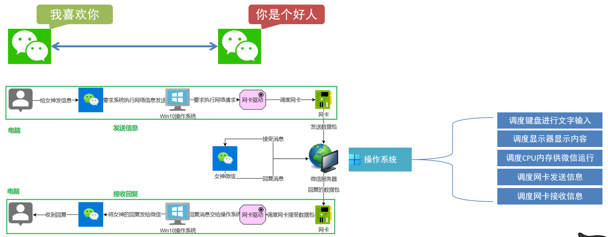

常见的操作系统：

PC端：Windows、Linux、MacOS

移动端：Android、IOS、鸿蒙系统

**2.Linux概述**

**2.1 Linux内核**

Linux操作系统由Linux系统内核和系统级应用程序组成。

内核提供系统最核心的功能，如：调度CPU、调度内存、调度文件系统、调度网络通讯、调度IO等

系统级应用程序为出厂自带程序，供用户快速上手操作系统，如：文件管理器、任务管理器、图片查看、音乐播放等。

用户播放音乐时，不管是使用系统自带播放器还是第三方播放器，最终都会调用系统内核的相关功能：

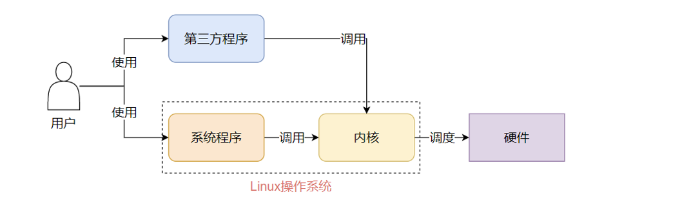

**2.2 Linux发行版**

Linux内核是开源免费的，任何人都可以获得并修改内核，并且自行集成系统级程序，提供 内核+系统级程序 的完整封装，称为Linux发行版，我们主要基于CentOS辅以Ubuntu进行学习。

Linux内核获取网址：

**\[该类型的内容暂不支持下载\]**

**3.虚拟机**

通过虚拟化技术，在计算机内，通过软件虚拟出计算机硬件，并给虚拟的硬件安装真实的操作系统，即可得到一台虚拟的电脑，称之为虚拟机。

通过虚拟机，可以在一台计算机上模拟出多台计算机，而不用花钱购买多台电脑。

**4.VMware WorkStation安装**

市面上提供了很多虚拟化的软件帮助我们虚拟出一台计算机，比如VMware WorkStation

VMware WorkStation安装地址（资料中已提供）：

**\[该类型的内容暂不支持下载\]**

双击安装包后按照如下步骤，最后输入密钥即可：

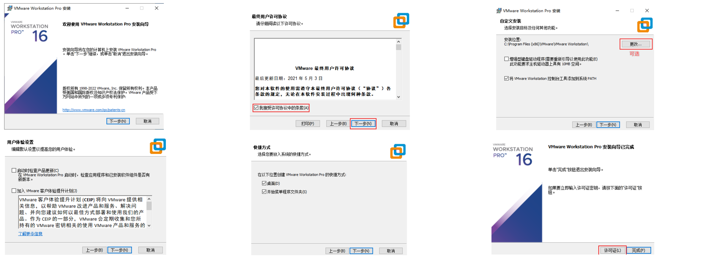

软件安装完成后，验证一下网络适配器是否正常配置：

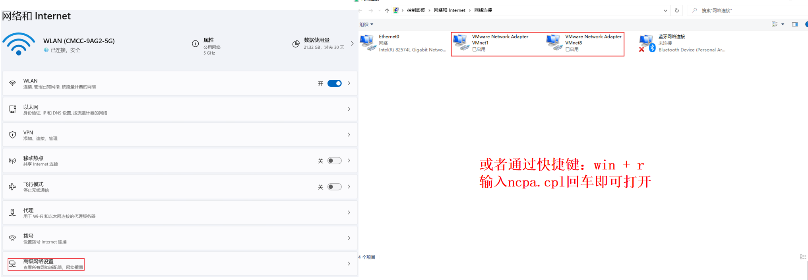

**5.VMware上安装Linux虚拟机**

下载操作系统的安装文件（以CentOS7.6为例）：

**\[该类型的内容暂不支持下载\]**

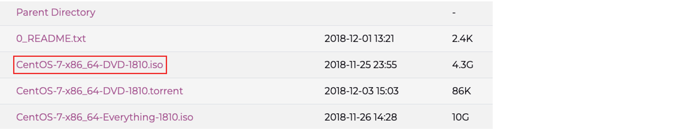

或者直接使用如下链接下载（资料中已经提供CentOS操作系统的安装文件）：

**\[该类型的内容暂不支持下载\]**

下载好操作系统的安装文件后，记住文件的位置，然后按照下列步骤操作：

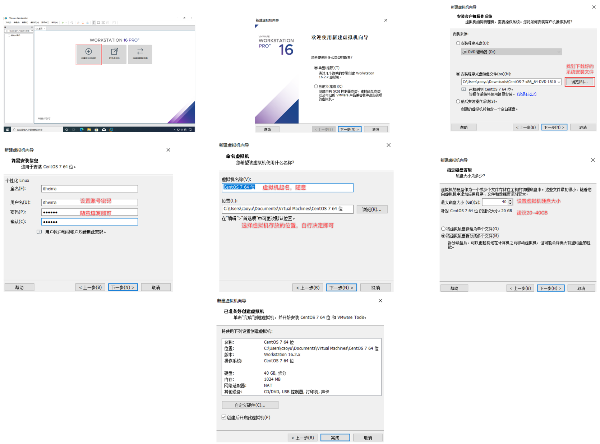

点击完成后，即开启了CentOS系统的安装，耐心等待安装完成即可，后续都是自动化的：

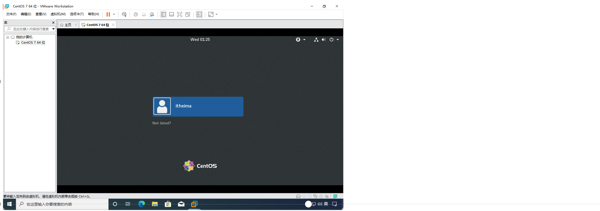

***注**：mac系统的相关安装和操作可以自己上网查找，这里只以windows系统为例。*

**6.远程连接Linux系统**

**6.1 Linux的图形化和命令行**

无论是什么操作系统，都支持图形化和命令行两种形式操作操作系统，如windows常用图形化操作，而Linux通常用命令行操作。这是因为Linux在开发时重点就不在图形化页面上，使用图形化操作效率较低，而使用命令行效率高、资源占用低、程序运行稳定。

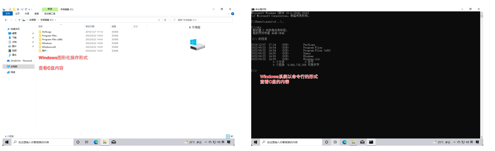

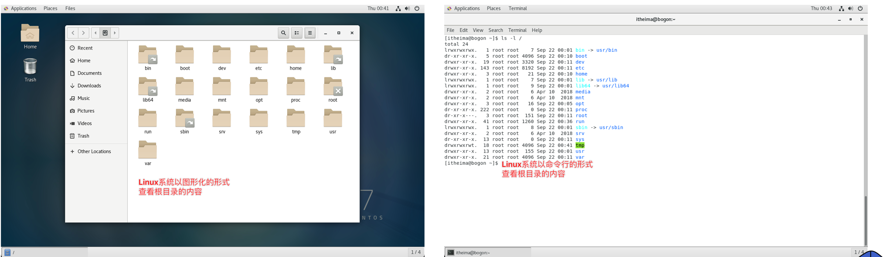

**6.2 FinalShell简介**

使用VMware可以得到Linux虚拟机，但是在VMware中操作Linux的命令行页面不太方便，主要是因为和Linux系统的各类交互，跨越VMware不方便。

通过第三方软件FinalShell，可以远程连接到Linux操作系统之上，通过FinalShell去操作Linux系统会非常方便。

**6.3 FinalShell安装**

FinalShell的下载地址（资料中已提供）：http://www.hostbuf.com/downloads/finalshell_install.exe

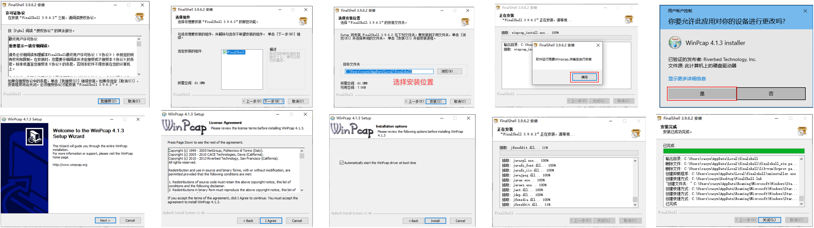

**6.4 连接到Linux**

先打开VMware中刚刚创建的虚拟机，在桌面右键选择最后一项Open Terminal打开命令行，输入ifconfig命令查询Linux系统的IP地址：

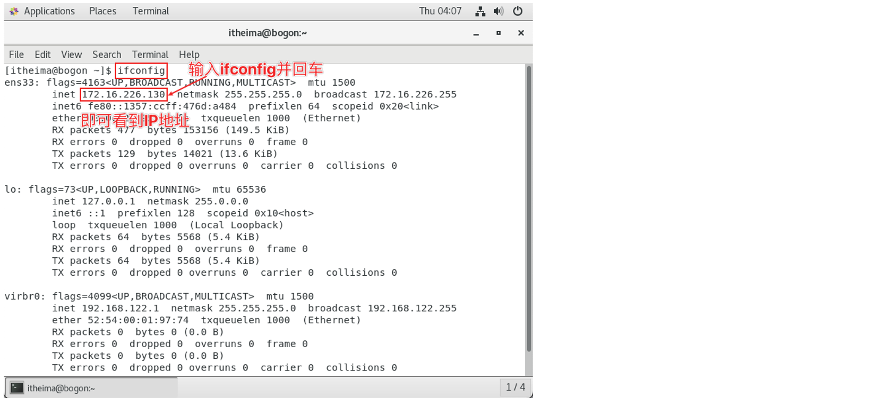

打开Finshell软件，配置到Linux系统的连接：

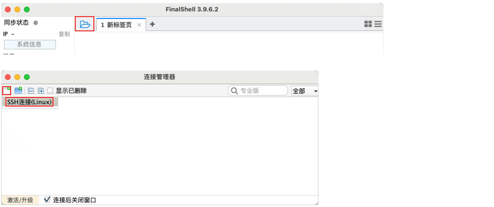

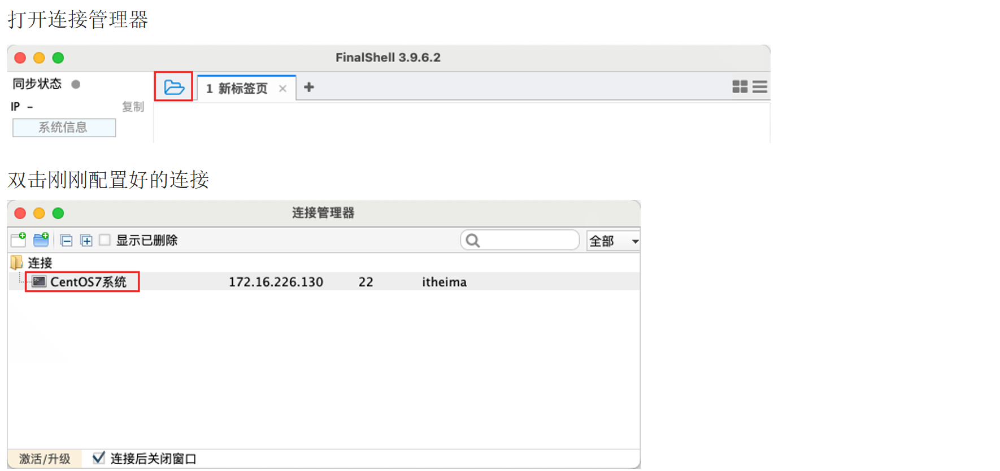

点击接受并保存显示如下就表示连接成功：

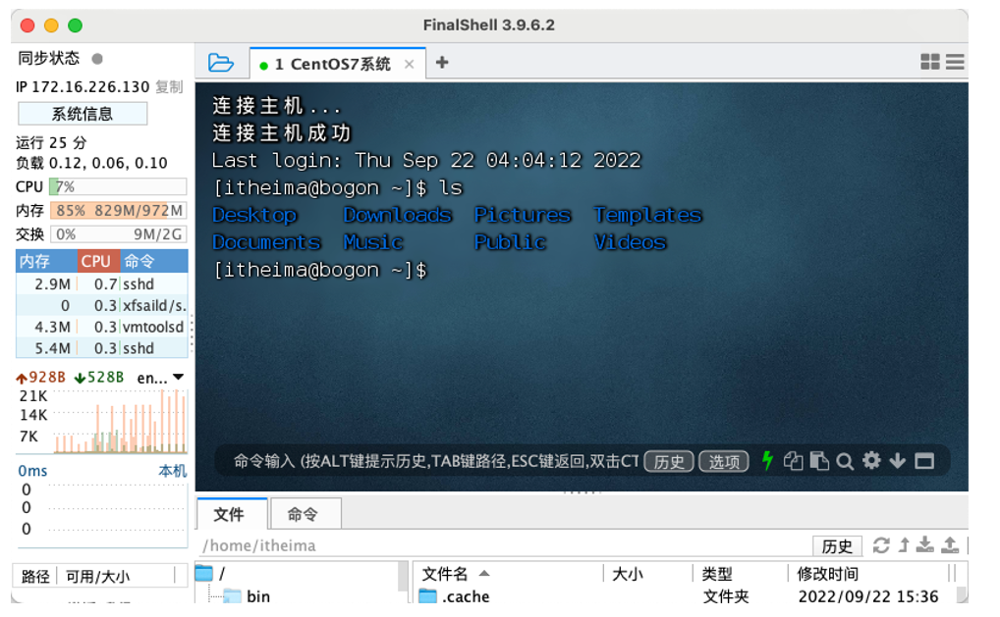

**注意**：Linux虚拟机如果重启，有可能，发生IP改变如果改变IP需要在FinalShell中修改连接的IP地址，固定IP的操作后续会讲（[虚拟机固定IP](https://mcnerzykwkel.feishu.cn/wiki/YLdtwfBTKiRhy9k0bNocH0rPn3g?fromScene=spaceOverview#share-QQvrdT3KToxWMtx3M2hc6IS4ned)）。

**7.WSL**

**7.1 WSL简介**

WSL是用于Windows系统之上的Linux子系统，可以在Windows系统中获得Linux系统环境，并完全**直连计算机硬件**，无需通过虚拟机虚拟硬件：

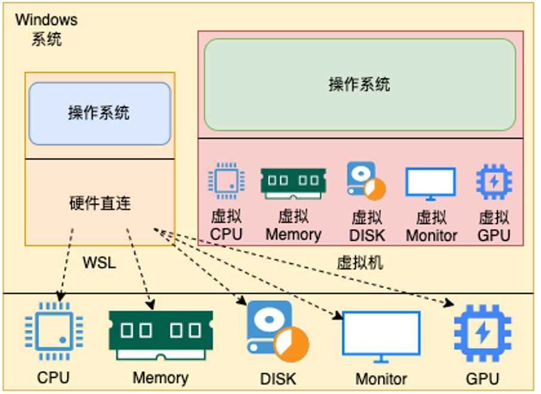

WSL是Windows10自带功能，需要开启，无需下载：

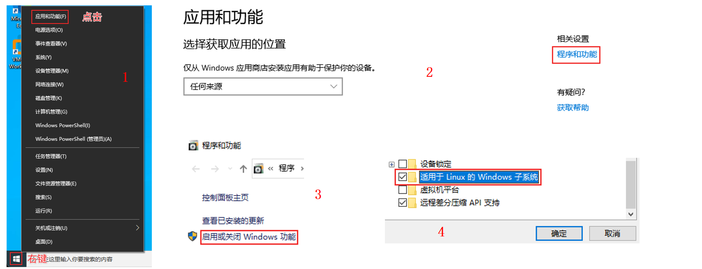

确定后会进行部署，重启计算机就可以了。

**7.2 WSL部署**

开启WSL后，接下来就是安装Ubuntu。

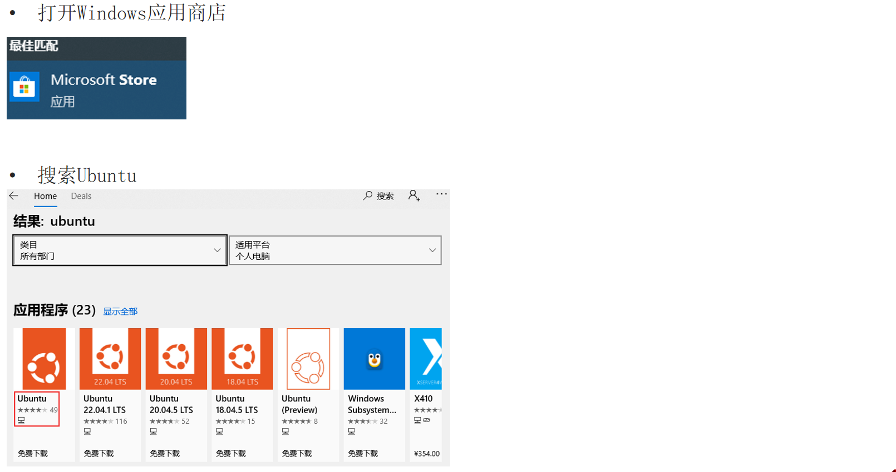

点击获取并安装：

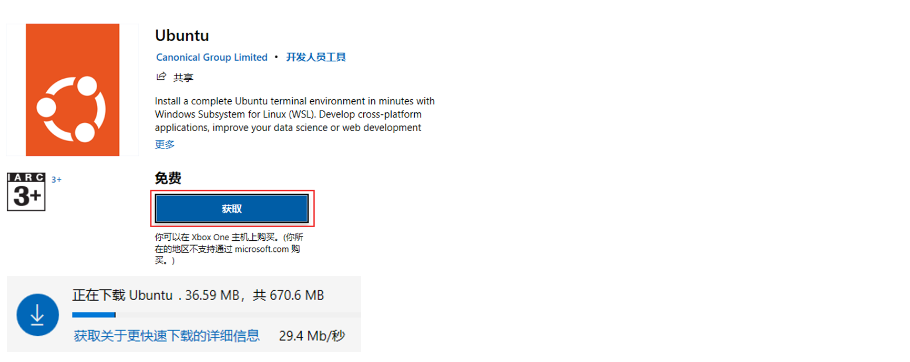

点击启动：

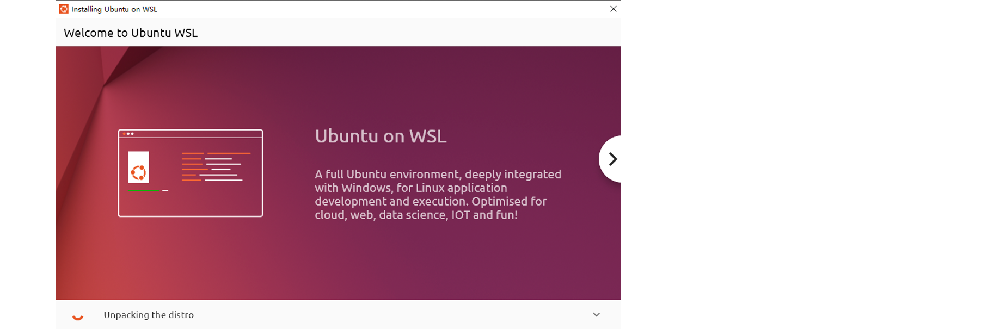

输入用户名用以创建一个用户：

输入两次密码确认（注意，输入密码没有反馈，不用理会，正常输入即可）：

至此，得到了一个可用的Ubuntu操作系统环境：

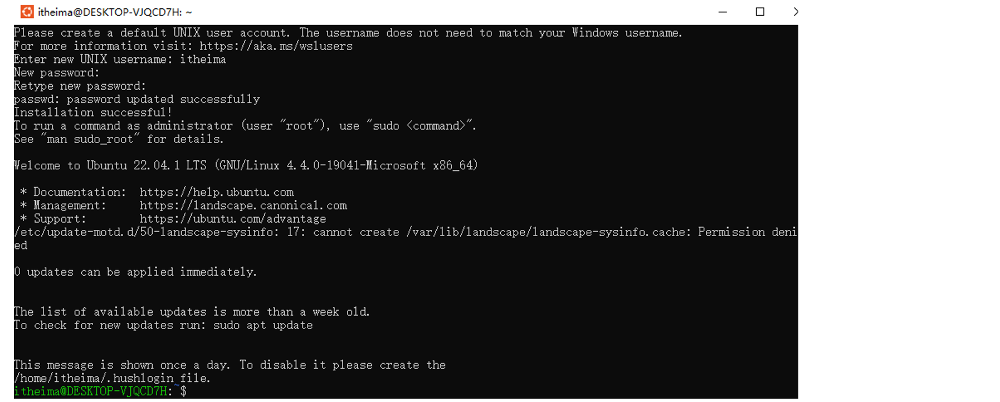

Ubuntu自带的终端窗口软件不太好用，我们可以使用微软推出的：Windows Terminal软件。

在应用商店中搜索terminal关键字，找到Windows Terminal软件下载并安装：

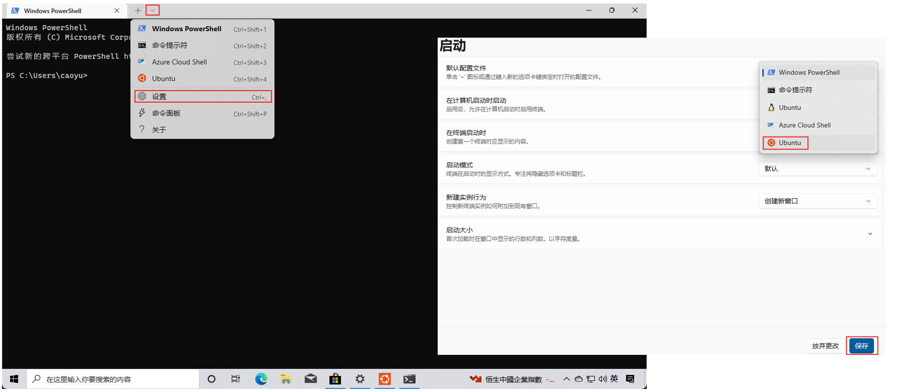

再次打开Windows Terminal软件，即默认使用Ubuntu系统了（WSL）

**8.快照**

在操作虚拟机时可能会损坏虚拟机，此时再虚拟一个计算机非常麻烦，可以在某个时间点为虚拟机创建一个快照，通过快照将当前虚拟机的状态保存下来，在以后可以通过快照恢复虚拟机到保存的状态

**在VMware Workstation Pro中制作快照**

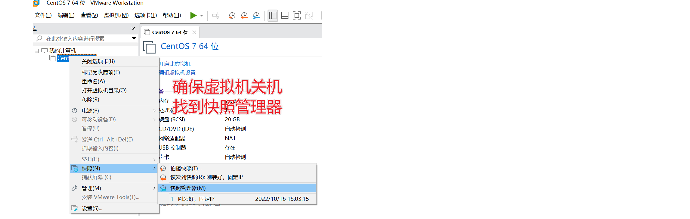

填写好快照名称和快照描述后，点击拍摄快照就拍摄完成了。

**在VMware Workstation Pro中还原快照**

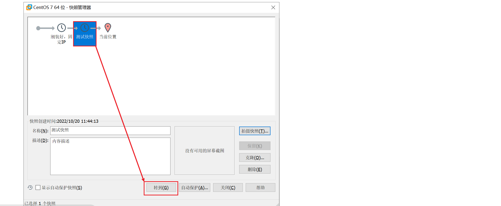

**二、Linux基础命令**

**1.Linux的目录结构**

Linux不像Windows系统那样，有多个盘符，Linux只有一个根目录/，所有文件都在它下面：

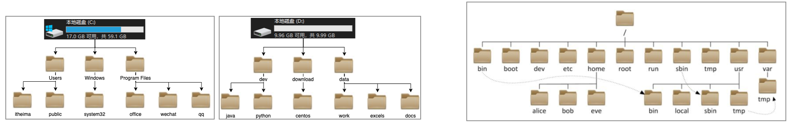

在Linux系统中，路径之间的层级关系，使用：/ 来表示

在Windows系统中，路径之间的层级关系，使用： \\ 来表示

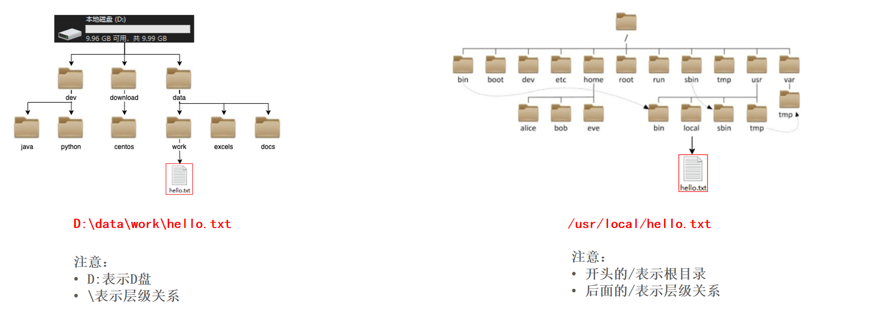

**2.Linux命令入门**

**2.1 Linux命令基础格式**

在Linux中，命令有其通用的格式：

<table>
<colgroup>
<col style="width: 100%" />
</colgroup>
<tbody>
<tr class="odd">
<td>Bash 
command [-options] [parameter]</td>
</tr>
</tbody>
</table>

command：命令本身

-options：\[可选，非必填\]命令的一些选项，可以通过选项控制命令的行为细节

parameter：\[可选，非必填\]命令的参数，多数用于命令的指向目标等

**2.2 ls命令**

作用：列出目录下的内容

语法：ls \[-a -l -h\] \[Linux路径\]

-l，以列表形式查看

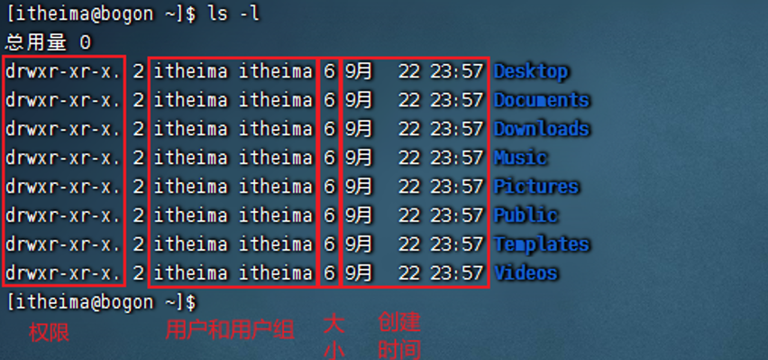

-h，以易于阅读的形式，列出文件大小，如K、M、G，必须和 -l 选项搭配使用

-a，列出全部文件，包含隐藏的文件和文件夹。文件或文件夹只要以.开头就会被自动隐藏，必须通过-a选项才能看到

Linux路径是此命令可选的参数

不使用选项和参数，直接使用ls命令本体，表示以平铺形式，列出当前工作目录下的内容：

*Linux的命令行的终端启动时默认打开当前登录用户的HOME目录作为当前工作目录。*

*HOME目录：每个Linux操作用户在Linux系统的个人账户目录，路径在：/home/用户名，如图中的HOME目录就是/home/itheima*

多个选项可以合并，而且顺序可以任意，如ls -a -l /、ls -la /、ls -al /三者等价。

**3.目录切换相关命令**

**3.1 cd命令**

作用：更改当前所在的工作目录

语法：cd \[Linux路径\]

cd命令无需选项，只有参数，表示要切换到哪个目录下

cd命令直接执行，不写参数，表示回到用户的HOME目录

**3.2 pwd命令**

作用：查看当前所在的工作目录

语法：pwd

pwd命令，无选项，无参数，直接输入pwd即可

**4.相对路径、绝对路径和特殊路径**

绝对路径：以根目录为起点，描述路径的一种写法，路径描述以 / 开头

相对路径：以当前目录为起点，描述路径的一种写法，路径描述无需以 / 开头

例如，从当前用户HOME目录/home/itheima切换到当前用户HOME目录下的Desktop文件里有两种写法：

相对路径写法：cd Desktop

绝对路径写法：cd /home/itheima/Desktop

特殊路径符：

. 表示当前目录，比如cd ./Desktop表示切换到当前目录下的Desktop目录内，和cd Desktop效果一致

.. 表示上一级目录，比如：cd ..即可切换到上一级目录，cd ../..切换到上二级的目录

~ 表示HOME目录，比如：cd ~即可切换到HOME目录或cd ~/Desktop，切换到HOME内的Desktop目录

**5.mkdir命令**

作用：创建新的目录（文件夹）

语法：mkdir \[-p\] Linux路径

参数必填，表示要创建的文件夹的路径，相对路径或绝对路径均可

-p选项可选，表示自动创建不存在的父目录，适用于创建连续多层级的目录

*创建目录需要权限，需确保所有操作在HOME目录内，否则会受到权限限制*

**6.文件操作命令**

**6.1 touch命令**

作用：创建文件（mkdir创建文件夹，touch创建文件）

语法：touch Linux路径

touch命令无选项，参数必填，表示要创建的文件路径，相对、绝对、特殊路径符均可以

**6.2 cat命令**

作用：查看文件的全部内容

语法：cat Linux路径

cat命令没有选项，参数必填，表示被查看的文件路径，相对、绝对、特殊路径符都可以

**6.3 more命令**

作用：分页查看文件的内容

语法：more Linux路径

more命令没有选项，参数必填，表示被查看的文件路径，相对、绝对、特殊路径符都可以

在翻页的过程中，空格翻页，q退出

**more命令和cat命令的区别**：

cat命令是直接将内容全部展示出来

more命令支持翻页，如果内容太多，可以一页一页的展示

**6.4 cp命令**

作用：复制文件或文件夹

语法：cp \[-r\] 参数1 参数2

-r选项，可选，用于复制文件夹使用，表示递归

参数1，Linux路径，表示被复制的文件或文件夹

参数2，Linux路径，表示要复制去的地方

|                                                          |
|----------------------------------------------------------|
| **注意**：复制文件夹必须要用-r选项，复制文件可用可不用。 |

**6.5 mv命令**

作用：移动文件或文件夹

语法：mv 参数1 参数2

参数1，Linux路径，表示被移动的文件或文件夹

参数2，Linux路径，表示要移动去的地方，如果目标不存在，则进行改名，确保目标存在

mv test01.txt test02.txt命令具有重命名的效果。

**6.6 rm命令**

作用：删除文件或文件夹

语法：rm \[-r -f\] 参数1 参数2 ...... 参数N

-r选项，用于删除文件夹，删除文件夹必须要用-r选项

-f选项，表示强制删除，不会弹出提示确认信息

普通用户删除内容不会弹出提示，只有root管理员用户删除内容会有提示

参数1、参数2、......、参数N，表示要删除的文件或文件夹路径，按照空格隔开

*切换到root用户：通过su - root命令，输入密码（和普通用户默认一样），可以切换到root用户，输入exit命令返回普通用户*

**通配符**

符号\*表示通配符，即匹配任意长度内容（包含空），rm命令支持通配符 \*，用来做模糊匹配：

test\*，表示匹配任何以test开头的内容

\*test，表示匹配任何以test结尾的内容

\*test\*，表示匹配任何包含test的内容

|                                                                             |
|-----------------------------------------------------------------------------|
| **切忌**：不要使用rm -rf \*或rm -rf /\*，效果等同于在Windows上执行C盘格式化 |

**7.查找命令**

**7.1 which命令**

作用：查看所使用的一系列命令的程序文件存放在哪里

语法：which 要查找的命令

命令文件一般位于/usr/bin/命令名称下，如which cp返回/usr/bin/cp

**7.2 find命令**

**7.2.1 按文件名查找文件**

语法：find 起始路径 -name "被查找的文件名"

作用：按文件名查找文件和文件夹

被查找文件名，支持使用通配符 \* 来做模糊查询：

find / -name "test\*"，表示查找所有位于根目录及其子目录下的以test开头的文件或文件夹

**7.2.2 按文件大小查找文件**

语法：find 起始路径 -size +\|-n\[kMG\]

+、- 表示大于和小于

n表示大小数字

kMG表示大小单位，k(小写字母)表示kb，M表示MB，G表示GB

作用：按文件大小查找文件和文件夹

*可以按照文件名和文件大小同时查找文件，如find / -name "\*test\*" -size -10M -size +1M表示查找所有1MB~10MB的包含test的文件和文件夹。*

**8.grep、wc和管道符**

**8.1 grep命令**

作用：从文件中通过关键字过滤文件行

语法：grep \[-n\] 关键字 文件路径

选项-n，可选，表示在结果中显示匹配的行的行号

参数，关键字，必填，表示过滤的关键字，带有空格或其它特殊符号，建议使用””将关键字包围起来

参数，文件路径，必填，表示要过滤内容的文件路径，可作为内容输入端口

**8.2 wc命令**

作用：统计文件的行数、单词数量等

语法：wc \[-c -m -l -w\] 文件路径

选项，-c，统计bytes数量

选项，-m，统计字符数量

选项，-l，统计行数

选项，-w，统计单词数量

参数，文件路径，被统计的文件，可作为内容输入端口

不带选项，统计文件

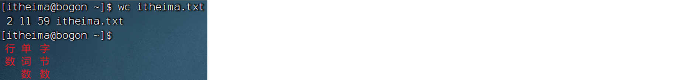

**8.3 管道符 \|**

含义：将管道符左边命令的结果，作为右边命令的输入

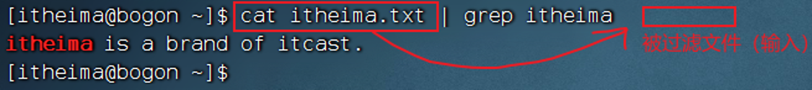

管道符可以嵌套使用，如cat itheima.txt \| grep itcast \| grep itheima：

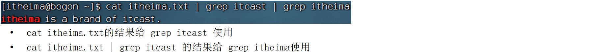

**9.echo、tail和重定向符**

**9.1 echo命令**

作用：在命令行内输出指定内容

语法：echo 输出的内容

无需选项，只有一个参数，表示要输出的内容

带有空格或 \\ 等特殊符号，建议使用""包围

echo pwd命令不会把pwd命令的结果输出到命令行，而是直接输出pwd到命令行，如果想要输出pwd命令的结果，需要将pwd用反引号\`\`包裹起来，被反引号包裹的内容会被作为命令执行。

**9.2 重定向符**

重定向符分为\>和\>\>两种：

\>，将左侧命令的结果，**覆盖**写入到符号右侧指定的文件中

\>\>，将左侧命令的结果，**追加**写入到符号右侧指定的文件中

echo “Hello itheima” \> itheima.txt会把字符串Hello itheima覆盖写入到同级目录下的itheima.txt文件中（旧内容不存在）

echo “Hello itheima” \>\> itheima.txt会把字符串Hello itheima追加到同级目录下的itheima.txt文件中（旧内容仍然存在）

**9.3 tail命令**

作用：查看文件尾部内容，跟踪文件的最新更改

语法：tail \[-f -num\] Linux路径

参数，Linux路径，表示被跟踪的文件路径

选项，-f，表示持续跟踪

复制一个新的FinalShell的标签

> 

在第一个标签中，执行：touch test.txt，创建一个test.txt文件

在第一个标签中，执行：tail -f test.txt，持续跟踪文件更改

在第二个标签中，多次执行：echo “内容” \>\> test.txt，向文件追加内容

观察第一个标签的变化

选项, -num，表示，查看尾部多少行，不填默认10行

**10.vi \\ vim编辑器**

vi\vim是Linux中最经典的文本编辑器，同图形化界面中的文本编辑器一样，vi是命令行下对文本文件进行编辑的绝佳选择。

vim 是 vi 的加强版本，兼容 vi 的所有指令，不仅能编辑文本，而且还具有 shell 程序编辑的功能，可以不同颜色的字体来辨别语法的正确性，极大方便了程序的设计和编辑性。

**10.1 vi \\ vim编辑器的三种工作方式**

命令模式：命令模式下，所敲的按键编辑器都理解为命令，以命令驱动执行不同的功能，此模式下不能自由编辑文本

输入模式：即编辑模式、插入模式，此模式下可以自由编辑文本

底线命令模式：以：开始，通常用于文件的保存、退出

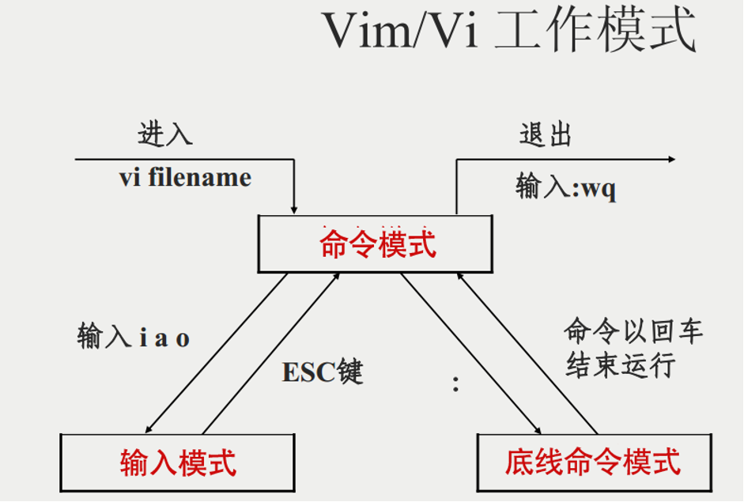

**10.2 vi \\ vim编辑器的基本使用**

**语法**

vi 文件路径或vim 文件路径，由于vim完全兼容vi，所以推荐使用vim进行文件编辑。

如果文件路径表示的文件不存在，那么此命令会用于编辑新文件

如果文件路径表示的文件存在，那么此命令用于编辑已有文件

**vi编辑器的快速体验**

通过vi/vim命令编辑文件，会打开一个新的窗口，就是命令模式窗口，命令模式是vi编辑器的入口和出口（见10.1中的图）：

进入vi编辑器会进入命令模式

通过命令模式输入键盘指令，可以进入输入模式

输入模式需要退回到命令模式，然后通过命令可以进入底线命令模式

快速体验：

使用vim hello.txt，编辑一个新文件，执行后进入的是命令模式

在命令模式内，按键盘 i ，进入输入模式

在输入模式内输入：itheima and itcast

输入完成后，按esc回退到命令模式

在命令模式内，按键盘 : ，进入底线命令模式

在底线命令内输入wq，保存文件并退出vi编辑器

**10.3 快捷键**

**命令模式快捷键**

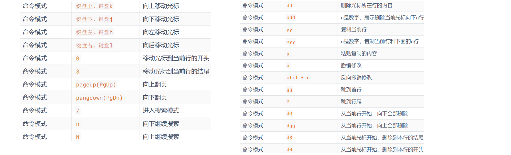

**底线命令模式快捷键**

**11.查看命令帮助和手册**

任何命令都支持：--help 选项， 可以通过这个选项，查看命令的帮助：

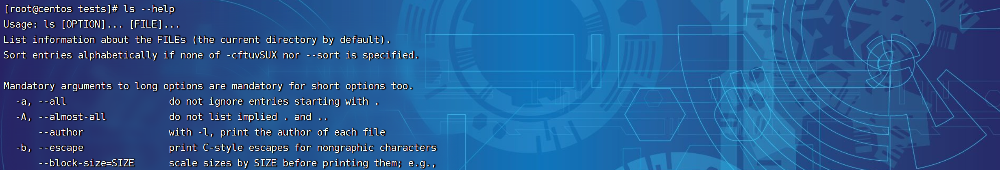

如果想要查看命令的详细手册，可以通过man（manual， 手册）命令查看，如man cd查看cd命令的详细手册：

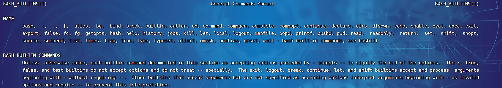

命令的详细手册是英文的，如果看起来吃力，可以通过重定向写入到文件中，通过翻译软件翻译查看。

**三、用户和权限**

**1.root用户和用户切换**

**1.1 root用户**

无论是Windows、MacOS、Linux均采用多用户的管理模式进行权限管理，Linux中权限最大的用户是root（超级管理员），前期一直使用的普通用户itheima

普通用户的权限，一般在其HOME目录内是不受限的，一旦出了HOME目录，大多数地方仅有只读和执行权限，无修改权限。

**1.2 su命令**

作用：切换到指定用户

语法：su \[-\] \[用户名\]

-符号是可选的，表示是否在切换用户后加载环境变量（后续讲解），建议带上

参数：用户名，表示要切换的用户，用户名也可以省略，省略表示切换到root

切换用户后，可以通过exit命令退回上一个用户，也可以使用快捷键：Ctrl + d

使用普通用户，切换到其它用户需要输入密码，如切换到root用户

使用root用户切换到其它用户，无需密码，可以直接切换

**提醒**：不建议长期使用root用户，避免带来系统损坏

**1.3 sudo命令**

作用：为这一条命令临时赋予root授权

语法：sudo 其他命令

并不是所有的用户，都有权利使用sudo，我们需要为普通用户配置sudo认证：

切换到root用户，执行visudo命令，会自动通过vi编辑器打开：/etc/sudoers

在文件的最后添加：

<table>
<colgroup>
<col style="width: 100%" />
</colgroup>
<tbody>
<tr class="odd">
<td>Bash 
itheima ALL=(ALL) NOPASSWD:ALL</td>
</tr>
</tbody>
</table>

其中最后的NOPASSWD:ALL 表示使用sudo命令，无需输入密码

itheima是用户名，也可以是其他用户名如itcast

最后通过 wq 保存

**2.用户、用户组管理**

**2.1 用户、用户组简介**

Linux系统中可以配置多个用户，也可以配置多个用户组，其中，用户可以加入多个用户组中（如）

Linux中关于权限的管控级别有2个级别，分别是：

针对用户的权限控制

针对用户组的权限控制

比如，针对某文件，可以控制用户的权限，也可以控制用户组的权限。

**2.2 用户、用户组管理的基础命令**

以下命令需root用户执行：

1.创建用户组：groupadd 用户组名

2.删除用户组：groupdel 用户组名

创建用户：useradd \[-g 用户组 -d HOME路径\] 用户名

选项：-g指定用户的组，不指定-g，会创建同名组并自动加入，指定-g需要组已经存在，如已存在同名组，必须使用-g

选项：-d指定用户HOME路径，不指定，HOME目录默认在：/home/用户名

4.删除用户：userdel \[-r\] 用户名

选项：-r，删除用户的HOME目录，不使用-r，删除用户时，HOME目录保留

5.查看用户所属组：id \[用户名\]

参数：用户名，被查看的用户，如果不提供则查看自身

6.修改用户所属组：usermod -aG 用户组 用户名

将指定用户加入指定用户组

7.查看当前系统中有哪些用户：getent passwd

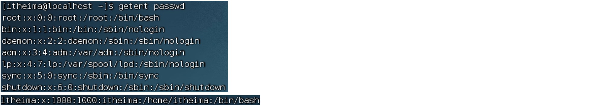

每个结果有7条信息，用户名:密码(x):用户ID:组ID:描述信息(无用):HOME目录:执行终端(默认bash)

8.查看当前系统中有哪些用户组：getent group

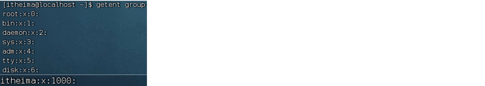

每个结果有3条信息，组名称:组认证(显示为x):组ID

**3.查看权限控制**

通过ls -l 可以以列表形式查看内容，并显示权限细节：

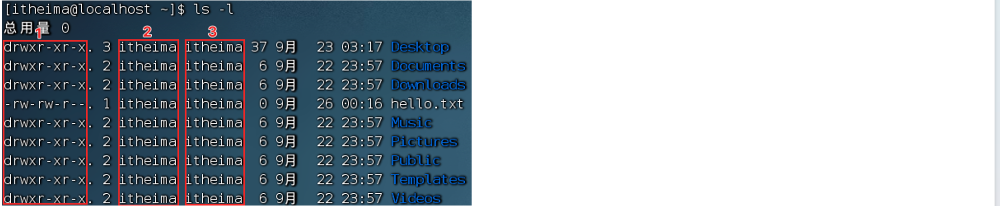

序号1，表示文件、文件夹的权限控制信息

序号2，表示文件、文件夹所属用户

序号3，表示文件、文件夹所属用户组

序号2序号3刚刚说过，序号1表示权限细节，共分为10个槽位：

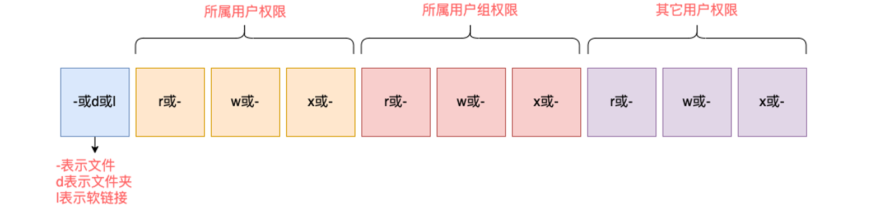

例如drwxr-xr-x表示：

这是一个文件夹，首字母d表示

所属用户（上上图序号2）的权限是：有r有w有x，rwx

所属用户组（上上图序号3）的权限是：有r无w有x，r-x （-表示无此权限）

其它用户的权限是：有r无w有x，r-x

rwx分别代表不同的权限：r表示读权限，w表示写权限，x表示执行权限。

针对文件、文件夹的不同，rwx的含义有细微差别：

r，针对文件可以查看文件内容

针对文件夹，可以查看文件夹内容，如ls命令

w，针对文件表示可以修改此文件

针对文件夹，可以在文件夹内：创建、删除、改名等操作

x，针对文件表示可以将文件作为程序执行

针对文件夹，表示可以更改工作目录到此文件夹，即cd进入

**4.修改权限控制**

**4.1 chmod命令**

作用：修改文件、文件夹的权限信息

条件：只有文件、文件夹的所属用户或root用户才可以修改

语法：chmod \[-R\] 权限 文件或文件夹

选项：-R，对文件夹内的全部内容应用同样的操作

示例：

chmod u=rwx,g=rx,o=x hello.txt，将文件权限修改为：rwxr-x--x

其中：u表示user所属用户权限，g表示group组权限，o表示other其它用户权限

chmod -R u=rwx,g=rx,o=x test，将文件夹test以及文件夹内全部内容权限设置为：rwxr-x--x

权限还可以使用数字代替以减轻书写压力：

|      |            |     |
|------|------------|-----|
| 数字 | 权限说明   | rwx |
| 0    | 无任何权限 | --- |
| 1    | 仅有x权限  | --x |
| 2    | 仅有w权限  | -w- |
| 3    | 有w和x权限 | -wx |
| 4    | 仅有r权限  | r-- |
| 5    | 有r和x权限 | r-x |
| 6    | 有r和w权限 | rw- |
| 7    | 有全部权限 | rwx |

数字的细节如下：r记为4，w记为2，x记为1，其他的就是把对应权限的数值相加。

所以chmod u=rwx,g=rx,o=x hello.txt可以简写为chmod 751 hello.txt

**4.2 chown命令**

作用：修改文件、文件夹的所属用户和用户组

条件：普通用户无法修改所属为其它用户或组，所以此命令只适用于root用户执行

语法：chown \[-R\] \[用户\]\[:\]\[用户组\] 文件或文件夹

选项，-R，同chmod，对文件夹内全部内容应用相同规则

选项，用户，修改所属用户

选项，用户组，修改所属用户组

:用于分隔用户和用户组

如：chown :root hello.txt，将hello.txt所属用户组修改为root

**四、Linux实用操作**

**1.小技巧（快捷键）**

**ctrl + c 强制停止**

Linux某些程序的运行，如果想要强制停止它（如tail -f），可以使用快捷键ctrl + c

命令输入错误，也可以通过快捷键ctrl + c，退出当前输入，重新输入

**ctrl + d 退出或登出**

可以通过快捷键：ctrl + d，退出账户的登录（如su - root）

退出某些特定程序的专属页面（如python、mysql）

ctrl + d不能用于退出vi/vim

**history命令**

可以通过history命令，查看历史输入过的命令

可以通过：!命令前缀，自动执行上一次匹配前缀的命令

可以通过快捷键：ctrl + r，输入内容去匹配历史命令。如果搜索到的内容是所需要的，那么：

回车键可以直接执行

键盘左右键，可以得到此命令（不执行）

**光标移动快捷键**

ctrl + a，跳到命令开头

ctrl + e，跳到命令结尾

ctrl + 键盘左键，向左跳一个单词

ctrl + 键盘右键，向右跳一个单词

**清屏**

通过快捷键ctrl + l，可以清空终端内容

通过命令clear得到同样效果

**2.软件安装**

**2.1 yum命令**

yum：RPM包软件管理器，用于自动化安装配置Linux软件，并可以自动解决依赖问题。

条件：yum命令需要root权限，可以su切换到root，或使用sudo提权；yum命令需要联网

语法：yum \[-y\] \[install \| remove \| search\] 软件名称

选项：-y，自动确认，无需手动确认安装或卸载过程

install：安装

remove：卸载

search：搜索

**2.2 apt命令**

CentOS软件安装使用yum管理器，而Ubuntu软件安装需要使用apt命令，两个命令的差别仅在于yum换成了apt，其他一模一样：

<table>
<colgroup>
<col style="width: 100%" />
</colgroup>
<tbody>
<tr class="odd">
<td>Bash 
apt [-y] [install | remove | search] 软件名称</td>
</tr>
</tbody>
</table>

**3.systemctl命令**

systemctl命令用于启动、停止、开机自启Linux系统的软件（内置或第三方），能被systemctl管理的软件也称之为服务。

语法：systemctl start \| stop \| status \| enable \| disable 服务名

start 启动

stop 关闭

status 查看状态

enable 开启开机自启

disable 关闭开机自启

以下是一些比较重要的系统服务：

NetworkManager，主网络服务

network，副网络服务

firewalld，防火墙服务

sshd，ssh服务（FinalShell远程登录Linux使用的就是这个服务）

**4.ln命令**

软连接：类似Windows中的桌面快捷方式，可以将文件、文件夹链接到其它位置，在权限的第一个槽位中用l表示。

ln命令可以用于创建软连接。

语法：ln -s 参数1 参数2

-s选项，创建软连接

参数1：被链接的文件或文件夹

参数2：要链接去的目的地

**5.日期、时区**

**5.1 date命令**

作用：查看系统的时间

语法：date \[-d\] \[+格式化字符串\]

-d 按照给定的字符串显示日期，一般用于日期计算

> 

支持的时间标记：

year年

month月

day天

hour小时

minute分钟

second秒

-d选项可以和格式化字符串配合一起使用

格式化字符串：通过特定的字符串标记控制显示的日期格式，如果格式化字符串还有特殊字符（如空格），建议使用""包围

%Y 年

%y 年份后两位数字 (00..99)

%m 月份 (01..12)

%d 日 (01..31)

%H 小时 (00..23)

%M 分钟 (00..59)

%S 秒 (00..60)

%s 自 1970-01-01 00:00:00 UTC 到现在的秒数

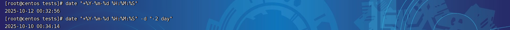

**5.2 修改Linux时区**

通过date获取的日期时区并非中国所在的东八区，所以获取的时间和北京时间有偏差，可以使用root权限运行如下指令矫正或修改时区：

<table>
<colgroup>
<col style="width: 100%" />
</colgroup>
<tbody>
<tr class="odd">
<td>Bash 
rm -f /etc/localtime 
sudo ln -s /usr/share/zoneinfo/Asia/Shanghai /etc/localtime</td>
</tr>
</tbody>
</table>

**5.3 校准系统时间**

有时即使时区正确，时间也会和真实时间有偏差，这时就需要校准系统时间。

可以通过ntp程序自动校准系统时间：

安装ntp：yum -y install ntp

启动并设置开机自启

systemctl start ntpd

systemctl enable ntpd

当然，也可以通过阿里云提供的服务网址配合ntpdate（安装ntp后会附带这个命令）命令手动矫准系统时间（需要root权限）：ntpdate -u ntp.aliyun.com

**6.IP地址、主机名**

**6.1 IP地址**

每一台计算机都会有一个IP地址用于和其他计算机通讯，IP地址主要有两个版本，IPv4和IPv6（本笔记只使用IPv4）

IPv4版本的地址格式是：a.b.c.d，其中abcd表示0~255的数字，如192.168.88.101就是一个标准的IP地址

通过ifconfig命令可以查看本机IP地址，如无法使用ifconfig命令，可以安装：yum -y install net-tools

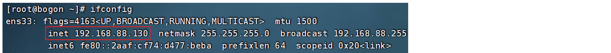

**特殊IP地址**

127.0.0.1，这个IP地址用于指代本机

0.0.0.0，特殊IP地址

可以用于指代本机

可以在端口绑定中用来确定绑定关系（后续讲解）

在一些IP地址限制中，表示所有IP的意思，如放行规则设置为0.0.0.0，表示允许任意IP访问

**6.2 主机名**

每一台计算机除了对外联络地址（IP地址）以外，也可以有一个名字，称之为主机名

查看主机名：hostname

修改主机名（需root权限）：hostnamectl set-hostname 主机名

**6.3 域名解析**

域名：简单说就是用一个字符串代替IP地址，通过字符串就能访问到服务器，这个字符串就是域名。如www.baidu.com就代表百度的网址。

域名解析：可以通过主机名找到对应计算机的IP地址，这就是主机名映射（域名解析）

以访问www.baidu.com为例，解释域名解析流程：

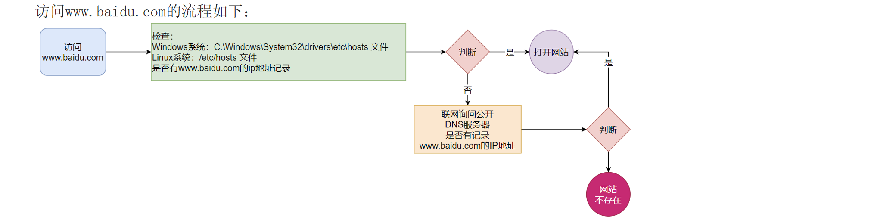

先查看本机的记录（私人地址本）

Windows看：C:\Windows\System32\drivers\etc\hosts

Linux看：/etc/hosts

再联网去DNS服务器（如114.114.114.114，8.8.8.8等）询问

**配置主机名映射**

在Windows系统的：C:\Windows\System32\drivers\etc\hosts文件中配置记录：

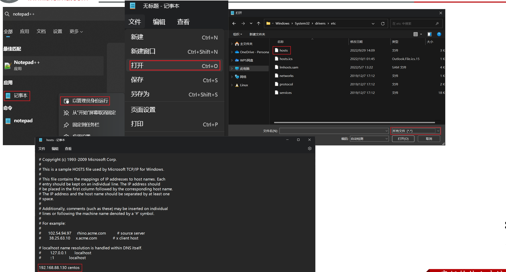

将FinalShell连接时使用的IP修改成centos：

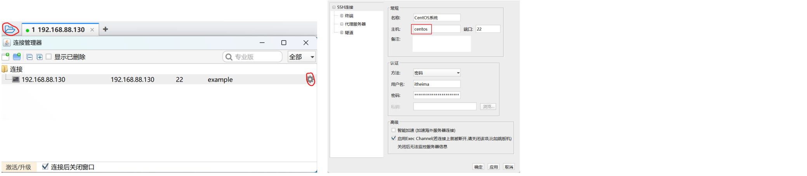

**6.4 虚拟机配置固定IP**

DHCP：动态获取IP地址，即每次重启设备后都会获取一次，可能导致IP地址频繁变更

当前Linux的IP地址我们是通过DHCP服务获取的，所得IP不固定，固定虚拟机IP地址的步骤：

在VMware Workstation（或Fusion）中配置IP地址网关和网段（IP地址的范围）

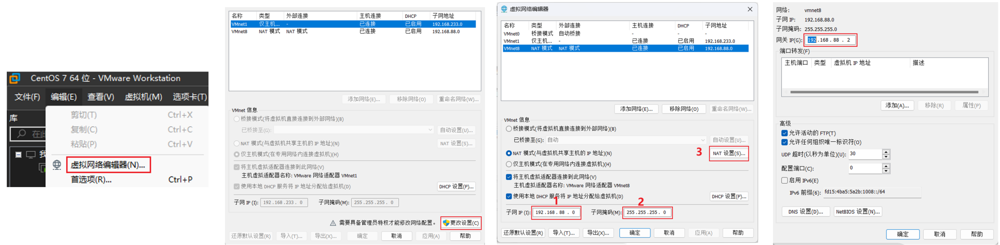

在Linux系统中手动修改配置文件，固定IP

使用vim编辑/etc/sysconfig/network-scripts/ifcfg-ens33文件，填入如下内容

> 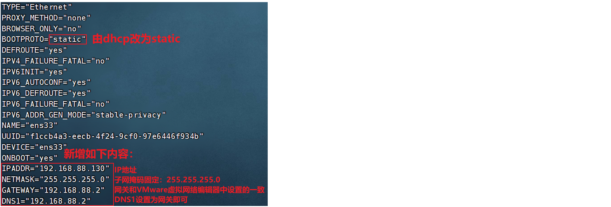

执行：systemctl restart network 重启网卡，执行ifconfig即可看到ip地址固定为192.168.88.130了

**7.网络传输**

**7.1 ping命令**

作用：检查指定的网络服务器是否是可联通状态

语法：ping \[-c num\] ip或主机名

选项：-c，检查的次数，不使用-c选项，将无限次数持续检查

参数：ip或主机名，被检查的服务器的ip地址或主机名地址

**7.2 wget命令**

作用：非交互式的文件下载器，可以在命令行内下载网络文件

语法：wget \[-b\] url

选项：-b，可选，后台下载，会将日志写入到当前工作目录的wget-log文件

参数：url，下载链接

通过tail命令可以监控后台下载进度：tail -f wget-log

无论下载是否完成，都会在工作目录生成要下载的文件，如果下载未完成，需要手动删除下载文件

**7.3 curl命令**

作用：发送http网络请求，可用于：下载文件、获取信息等

语法：curl \[-O\] url

选项：-O，用于下载文件，当url是下载链接时，可以使用此选项保存文件

参数：url，要发起请求的网络地址

例如：通过命令curl cip.cc可以获取主机的公网IP

**7.4 端口**

**7.4.1 端口介绍**

端口：设备与外界通讯交流的出入口。端口可以分为物理端口和虚拟端口两类：

物理端口：又可称之为接口，是可见的端口，如USB接口，RJ45网口，HDMI端口等

虚拟端口：是指计算机内部的端口，是不可见的，是用来操作系统和外部进行交互使用的

每台计算机内都有许多应用程序（QQ、微信等），通过IP地址只能锁定计算机，不能锁定计算机内的应用程序，如果两台电脑的同一个应用程序进行交流，那么需要确定端口号：

Linux系统可以支持65535个端口，这些端口分为3类：

公认端口：1~1023，用于一些系统内置或知名程序的预留使用，如SSH服务的22端口，HTTPS服务的443端口。**非特殊需要，不要占用这个范围的端口**

注册端口：1024~49151，通常可以随意使用，用于松散的绑定一些程序或服务

动态端口：49152~65535，通常不会固定绑定程序，而是当程序对外进行网络链接时，用于临时使用

*22端口，一般是SSH服务使用，即FinalShell远程连接Linux所使用的端口*

**7.4.2 查看端口占用**

**netstat命令**

作用：查看端口的占用情况

条件：安装nmap：yum -y install nmap

语法：nmap 被查看的IP地址

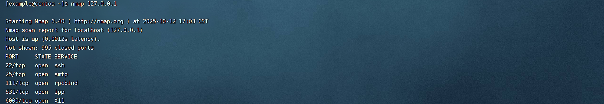

**netstat命令**

作用：可以通过netstat命令配合管道符查看指定端口的占用情况

条件：安装netstat：yum -y install net-tools

语法：netstat -anp \| grep 端口号

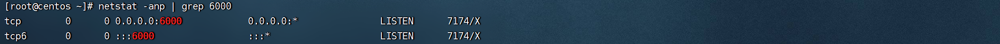

可以看到当前系统6000端口被程序（进程号7174）占用了

0.0.0.0:6000，表示端口绑定在0.0.0.0这个IP地址上，表示允许外部访问

**8.进程管理**

程序运行在操作系统中是被操作系统管理的，为了管理运行的程序，每一个运行程序会被操作系统注册为系统中的一个进程，并分配一个独有的进程ID（进程号）

**8.1 ps命令**

作用：查看Linux系统中的进程信息

语法：ps \[-e -f\]

选项：-e，显示出全部的进程

选项：-f，以完全格式化的形式展示信息（展示全部信息）

**结果解析**

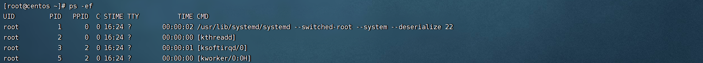

UID：进程所属的用户ID

PID：进程的进程号ID

PPID：进程的父ID（启动此进程的其它进程）

C：此进程的CPU占用率（百分比）

STIME：进程的启动时间

TTY：启动此进程的终端序号，如显示?，表示非终端启动

TIME：进程占用CPU的时间

CMD：进程对应的名称或启动路径或启动命令

**查看指定进程**

结合管道符，可以实现查看指定的进程，如：

ps -ef \| grep tail，查看tail命令相关进程：

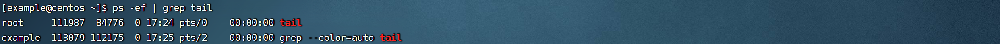

第二个结果是ps -ef \| grep tail这个命令的进程，不用理会即可

ps -ef \| grep 30001，过滤带有30001关键字的进程信息，一般指代过滤30001进程号

**8.2 kill命令**

作用：关闭指定进程

语法：kill \[-9\] 进程ID

选项：-9，表示强制关闭进程。不使用此选项会向进程发送信号要求其关闭，但是否关闭看进程自身的处理机制

**9.主机状态**

**9.1 top命令**

作用：查看CPU、内存使用情况，类似Windows的任务管理器

语法：top

默认每5秒刷新一次，按q或ctrl + c退出

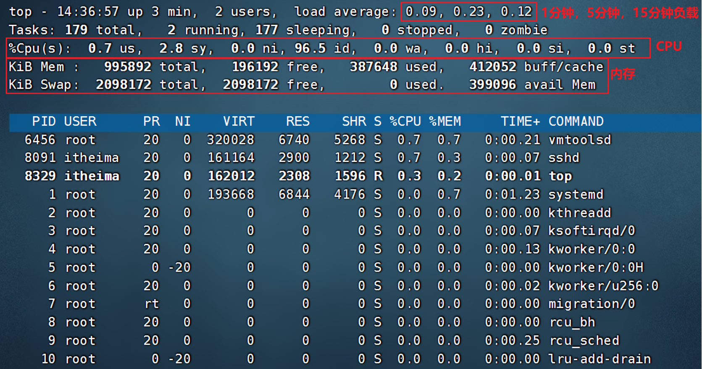

**top命令内容解析**

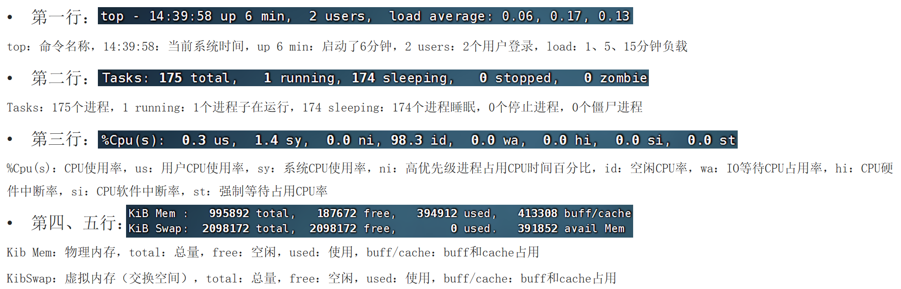

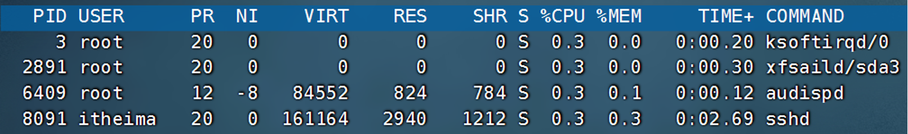

PID：进程id

USER：进程所属用户

PR：进程优先级，越小越高

NI：负值表示高优先级，正表示低优先级

VIRT：进程使用虚拟内存，单位KB

RES：进程使用物理内存，单位KB

SHR：进程使用共享内存，单位KB

S：进程状态（S休眠，R运行，Z僵死状态，N负数优先级，I空闲状态）

%CPU：进程占用CPU率

%MEM：进程占用内存率

TIME+：进程使用CPU时间总计，单位10毫秒

COMMAND：进程的命令或名称或程序文件路径

**top命令选项**

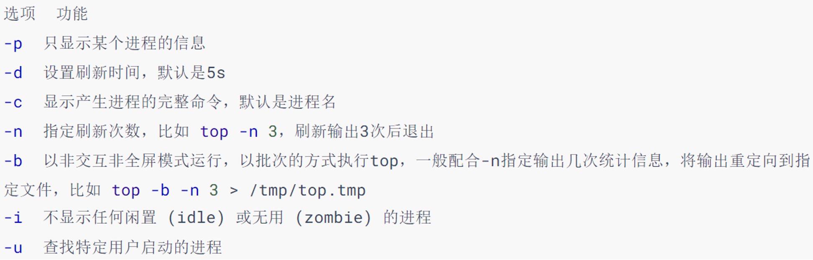

当top以交互式运行（非-b选项启动），可以用以下交互式命令进行控制：

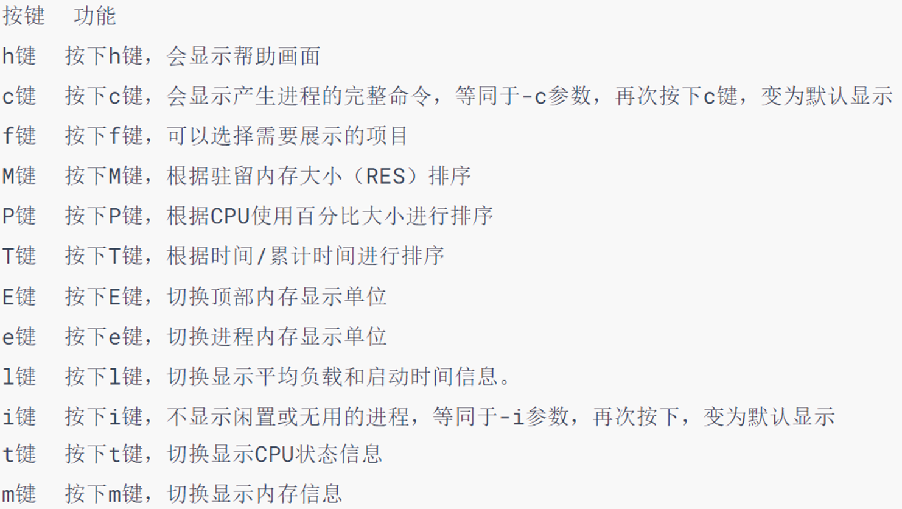

**9.2 df命令**

作用：查看硬盘的使用情况

语法：df \[-h\]

选项：-h，以更加人性化的单位显示

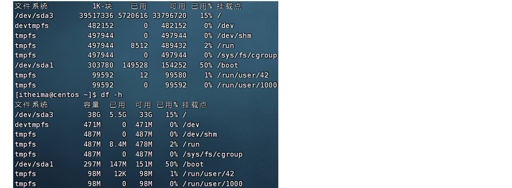

**9.3 iostat命令**

作用：查看CPU、磁盘的相关信息

语法：iostat \[-x\] \[num1\] \[num2\]

选项：-x，显示更多信息

num1：数字，刷新间隔

num2：数字，刷新几次

**iostat命令内容解析**

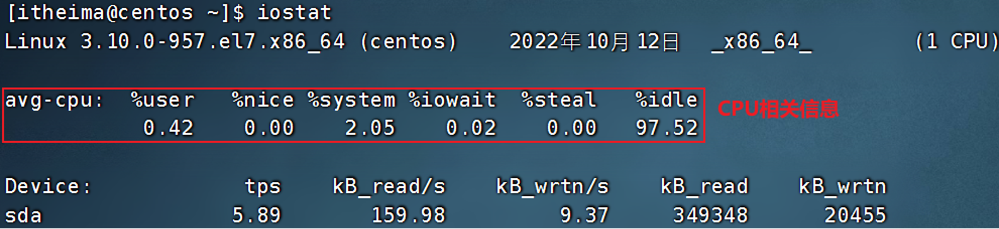

使用iostat的-x选项，可以显示更多信息：

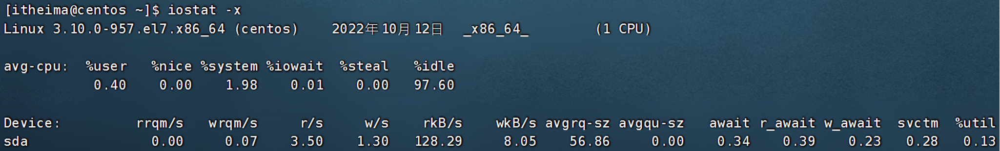

rrqm/s：每秒这个设备相关的读取请求有多少被Merge了（当系统调用需要读取数据的时候，VFS将请求发到各个FS，如果FS发现不同的读取请求读取的是相同Block的数据，FS会将这个请求合并Merge, 提高IO利用率, 避免重复调用）

wrqm/s：每秒这个设备相关的写入请求有多少被Merge了

rsec/s：每秒读取的扇区数；sectors

wsec/：每秒写入的扇区数

rKB/s：每秒发送到设备的读取请求数

wKB/s：每秒发送到设备的写入请求数

avgrq-sz：平均请求扇区的大小

avgqu-sz：平均请求队列的长度。毫无疑问，队列长度越短越好。

await：每一个IO请求的处理的平均时间（单位是微秒毫秒）

svctm：表示平均每次设备I/O操作的服务时间（以毫秒为单位）

%util：磁盘利用率

**9.4 sar命令**

作用：查看网络的相关统计（sar命令非常复杂，这里仅简单用于统计网络）

语法：sar -n DEV num1 num2

选项：-n，查看网络，DEV表示查看网络接口

num1：刷新间隔（不填就查看一次结束）

num2：查看次数（不填无限次数）

**sar命令内容解析**

查看2次，隔3秒刷新一次，并最终汇总平均记录：

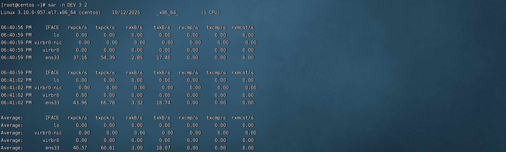

IFACE 本地网卡接口的名称

rxpck/s 每秒钟接受的数据包

txpck/s 每秒钟发送的数据包

rxKB/S 每秒钟接受的数据包大小，单位为KB

txKB/S 每秒钟发送的数据包大小，单位为KB

rxcmp/s 每秒钟接受的压缩数据包

txcmp/s 每秒钟发送的压缩包

rxmcst/s 每秒钟接收的多播数据包

**10.环境变量**

环境变量是操作系统在运行的时候，记录的一些关键性信息，用以辅助系统运行。环境变量是以KeyValue键值对的形式存放的。

在Linux系统中，env命令即可查看当前系统中记录的环境变量。

HOME：记录用户的HOME路径

USER：记录当前的操作用户

PWD：记录当前工作路径

**10.1 PATH**

PATH记录了系统执行任何命令的搜索路径，多个路径之间以:隔开，如上图中的PATH记录了：

/usr/local/bin

/usr/bin

/usr/local/sbin

/usr/sbin

/home/itheima/.local/bin

/home/itheima/bin

当执行任何命令，都会按照顺序，从上述路径中搜索要执行的程序的本体，如cd命令就位于/usr/bin内。

**10.2 取环境变量**

取得环境变量的值可以通过语法：\$环境变量名来取得，如echo \$PATH命令就可以取得PATH环境变量的值。

当和其它内容混合在一起的时候，可以通过{}来标注取的变量是谁，如echo \${PATH}ABC

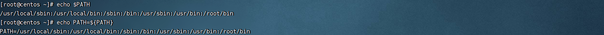

**10.3 设置环境变量**

临时设置，语法：export 变量名=变量值

永久生效：

针对当前用户生效，配置在当前用户的：~/.bashrc文件中

针对所有用户生效，配置在系统的：/etc/profile文件中

并通过语法：source 配置文件，进行立刻生效，或重新登录FinalShell生效

例如配置当前用户永久生效的环境变量MYNAME=example的步骤：

使用vim编辑~/.bashrc：vim ~/.bashrc

在~/.bashrc文件最后添加命名：export MYNAME=example

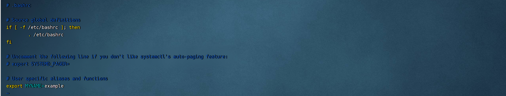

保存退出后，执行命令source ~/.bashrc

最后通过echo \$MYNAME查看环境变量MYNAME是否配置成功

自定义环境变量PATH和普通变量一样，只是变量值前加了\$PATH:而已，例如：

临时设置：export PATH=\$PATH:/home/itheima/myenv

永久生效：将export PATH=\$PATH:/home/itheima/myenv填入用户环境变量文件或系统环境变量文件中去，再执行source命令即可

|                                                                                                 |
|-------------------------------------------------------------------------------------------------|
| **注意**：如果不加\$PATH:，相当于直接修改PATH环境变量的值，而不是追加，可能会造成很严重的问题。 |

**11.上传、下载**

Linux进行文件的上传和下载时，上传会上传电脑桌面fsdownload文件夹中的内容，下载也是自动下载到这个文件夹。

**11.1 使用FinalShell上传和下载**

在FinalShell软件的下方窗体中，提供了Linux的文件系统视图，可以方便的：

浏览文件系统，找到合适的文件，右键点击下载，即可传输到本地电脑

浏览文件系统，找到合适的目录，将本地电脑的文件拓展进入，即可方便的上传数据到Linux中

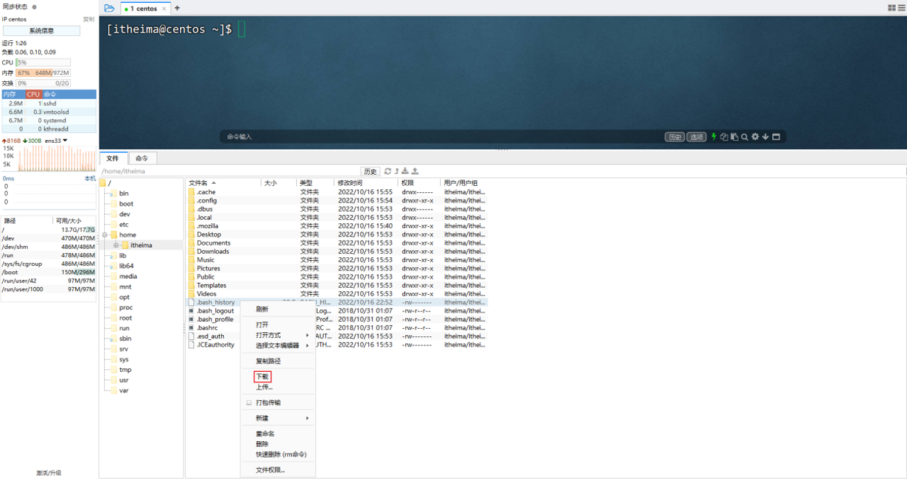

**11.2 rz、sz命令**

作用：进行文件传输

条件：yum -y install lrzsz

语法：

rz命令，进行上传，语法：直接输入rz即可

sz命令进行下载，语法：sz 要下载的文件

*rz、sz命令需要终端软件支持才可正常运行，FinalShell、SecureCRT、XShell等常用终端软件均支持此操作*

**12.压缩、解压**

**12.1 压缩格式**

zip格式：Linux、Windows、MacOS，常用

7zip：Windows系统常用

rar：Windows系统常用

tar：Linux、MacOS常用

gzip：Linux、MacOS常用

所以，Linux的压缩和解压主要是针对tar、gzip、zip这三种压缩格式

**12.2 tar命令**

Linux和Mac系统常用有2种压缩格式，后缀名分别是：

.tar，归档文件，即简单的将文件组装到一个.tar的文件内，并没有太多文件体积的减少

.gz，也常见为.tar.gz，gzip格式压缩文件，即使用gzip压缩算法将文件压缩到一个文件内，可以极大的减少压缩后的体积

tar命令就是针对这两种格式进行压缩和解压的

语法：tar \[-c -v -x -f -z -C\] 参数1 参数2 ... 参数N

-c，创建压缩文件，用于压缩模式

-v，显示压缩、解压过程，用于查看进度

-x，解压模式

-f，要创建的文件，或要解压的文件，必须在选项位最后一个

-z，gzip模式，不使用-z就是普通的tarball格式，建议处于选项位第一个

-C，选择解压的目的地，用于解压模式

**tar 压缩常用组合**

tar -cvf test.tar 1.txt 2.txt 3.txt，将1.txt 2.txt 3.txt 压缩到test.tar文件内

tar -zcvf test.tar.gz 1.txt 2.txt 3.txt，将1.txt 2.txt 3.txt 压缩到test.tar.gz文件内，使用gzip模式

**tar 解压常用组合**

tar -xvf test.tar，解压test.tar，将文件解压至当前目录

tar -xvf test.tar -C /home/itheima，解压test.tar，将文件解压至指定目录（/home/itheima）

tar -zxvf test.tar.gz -C /home/itheima，以Gzip模式解压test.tar.gz，将文件解压至指定目录（/home/itheima）

**12.3 zip命令**

作用：压缩文件为zip压缩包

语法：zip \[-r\] 参数1 参数2 ... 参数N

-r，被压缩的内容包含文件夹的时候，需要使用-r选项，和rm、cp等命令的-r效果一致

**12.4 unzip命令**

作用：解压zip压缩包

语法：unzip \[-d\] 参数

-d，指定要解压去的位置，同tar的-C选项

参数，被解压的zip压缩包文件

**五、Linux系统软件安装**

这部分参考[Linux系统软件安装](https://mcnerzykwkel.feishu.cn/docx/VUCQdkWmmoPBn2xaodQcW0AenNh?from=from_copylink)
