# MySQL笔记

**一、MySQL概述**

**1.数据库相关概念**

**数据库（DB）**：按照一定的数据结构来组织、存储和管理数据的仓库

**数据库管理系统(DBMS)**：一种操纵和管理数据库的大型软件，用于创建、使用和维护数据库

**关系型数据库（RDBMS）**：由多张相互连接的二维表组成的数据库

**非关系型数据库**：泛指非关系型数据库，是对关系型数据库的补充

**结构化查询语言（SQL）**：一种操作关系型数据库的编程语言，定义了一套操作关系型数据库统一SQL标准

**2.MySQL数据库概述**

**2.1 安装和卸载**

下载地址：

**\[该类型的内容暂不支持下载\]**

Windows安装和下载MySQL参考如下资料即可：

**\[MySQL安装.pdf\]**

**\[MySQL卸载文档-Windows版.pdf\]**

Linux系统安装MySQL软件的操作可以参考下面这个资料：

**\[Linux软件安装-MySQL.pdf\]**

**2.2 启动与停止**

1.管理员连接（以管理员方式打开命令行窗口）：

启动：net start mysql80

停止：net stop mysql80

默认mysql是开机自动启动的

2.客户端连接：

方式一：开始菜单找到MySQL提供的客户端命令行工具MySQL 8.0 Command Line Client

方式二：系统自带的命令行工具执行指令mysql \[-h 127.0.0.1\] \[-P 3306\] -u root -p

方式二需要配置环境变量C:\Program Files\MySQL\MySQL Server 8.0\bin\\

**二、SQL**

**1.SQL通用语法**

SQL语句可以单行或多行书写，以分号结尾

SQL语句可以使用空格/缩进来增强语句的可读性

不区分大小写，关键字建议使用大写

注释

单行注释：-- 注释内容 或 \# 注释内容(MySQL特有)

多行注释： /\* 注释内容 \*/

**2.SQL分类**

DDL：数据定义语言，用来定义数据库对象(数据库，表，字段)

DML：数据操作语言，用来对数据库表中的数据进行增删改

DQL：数据查询语言，用来查询数据库中表的记录

DCL：数据控制语言，用来创建数据库用户、控制数据库的访问权限

**3.数据定义语言DDL**

**3.1 DDL-数据库操作**

查询所有数据库

<table>
<colgroup>
<col style="width: 100%" />
</colgroup>
<tbody>
<tr class="odd">
<td>SQL 
SHOW DATABASES;</td>
</tr>
</tbody>
</table>

查询当前数据库

<table>
<colgroup>
<col style="width: 100%" />
</colgroup>
<tbody>
<tr class="odd">
<td>SQL 
SELECT DATABASE();</td>
</tr>
</tbody>
</table>

创建数据库

<table>
<colgroup>
<col style="width: 100%" />
</colgroup>
<tbody>
<tr class="odd">
<td>SQL 
CREATE DATABASE [IF NOT EXISTS] 数据库名 [DEFAULT CHARSET 字符集] [COLLATE 排序规则];</td>
</tr>
</tbody>
</table>

*默认的字符集和排序规则分别是utf8mb4字符集和utf8mb4_unicode_ci排序规则，也是推荐使用的字符集和排序规则*

删除数据库

<table>
<colgroup>
<col style="width: 100%" />
</colgroup>
<tbody>
<tr class="odd">
<td>SQL 
DROP DATABASE [IF EXISTS] 数据库名;</td>
</tr>
</tbody>
</table>

使用数据库

<table>
<colgroup>
<col style="width: 100%" />
</colgroup>
<tbody>
<tr class="odd">
<td>SQL 
USE 数据库名;</td>
</tr>
</tbody>
</table>

**3.2 DDL-表操作-查询**

查询当前数据库所有表

<table>
<colgroup>
<col style="width: 100%" />
</colgroup>
<tbody>
<tr class="odd">
<td>SQL 
SHOW TABLES;</td>
</tr>
</tbody>
</table>

查询表结构

<table>
<colgroup>
<col style="width: 100%" />
</colgroup>
<tbody>
<tr class="odd">
<td>SQL 
DESC 表名;</td>
</tr>
</tbody>
</table>

查询指定表的建表语句

<table>
<colgroup>
<col style="width: 100%" />
</colgroup>
<tbody>
<tr class="odd">
<td>SQL 
SHOW CREATE TABLE 表名;</td>
</tr>
</tbody>
</table>

**3.3 DDL-表操作-创建**

<table>
<colgroup>
<col style="width: 100%" />
</colgroup>
<tbody>
<tr class="odd">
<td>SQL 
CREATE TABLE 表名( 
字段1 字段1类型 [COMMENT 字段1注释], 
字段2 字段2类型 [COMMENT 字段2注释], 
... 
字段n 字段n类型 [COMMENT 字段n注释] 
)[COMMENT 表注释];</td>
</tr>
</tbody>
</table>

**3.4 DDL-表操作-数据类型**

**3.4.1 数值类型**

**整数类型：**

**TINYINT**：1字节，小整数，范围：-128 ~ 127（有符号）或 0 ~ 255（无符号）

**SMALLINT**：2字节，大整数，范围：-32,768 ~ 32,767（有符号）或 0 ~ 65,535（无符号）

**MEDIUMINT**：3字节，大整数，范围：-8,388,608 ~ 8,388,607（有符号）或 0 ~ 16,777,215（无符号）

**INT或INTEGER**：4字节，大整数，范围：-2,147,483,648 ~ 2,147,483,647（有符号）或 0 ~ 4,294,967,295（无符号）

**BIGINT**：8字节，极大整数，范围：-9,223,372,036,854,775,808 ~ 9,223,372,036,854,775,807（有符号）或 0 ~ 18,446,744,073,709,551,615（无符号）

**浮点数类型：**

**FLOAT**：4字节，单精度浮点数，范围：-3.402823466 E+38 ~ 3.402823466351 E+38（有符号）或 0 和 1.175494351 E-38 ~ 3.402823466 E+38，近似值

**DOUBLE**：8字节，双精度浮点数，范围：-1.7976931348623157 E+308 ~ 1.7976931348623157 E+308 或 0 和 2.2250738585072014 E-308 ~ 1.7976931348623157 E+308，近似值

**DECIMAL(M, D)**：精确值，M 是总位数，D 是小数位数。例如，DECIMAL(5, 2)可以存储 123.45

**3.4.2 字符串类型**

**CHAR(N)**：固定长度字符串，最多 255 个字符

**VARCHAR(N)**：可变长度字符串，最多 65,535 个字符

**TINYBLOB**：不超过 255 个字符的二进制数据

**TINYTEXT**：短文本字符串，最多 255 个字符

**BLOB**：二进制形式的长文本数据，最多 65,535 个字符

**TEXT**：长文本数据，最多65,535个字符

**MEDIUMBLOB**：二进制形式的中等长度文本数据，最多 16,777,215 个字符

**MEDIUMTEXT**：中等长度文本数据，最多 16,777,215 个字符

**LONGBLOB**：二进制形式的极大文本数据，最多 4,294,967,295 个字符

**LONGTEXT**：极大文本数据，最多 4,294,967,295 个字符

**3.4.3 日期时间类型**

**DATE**：日期值，3字节，格式为YYYY-MM-DD，范围是1000-01-01 至 9999-12-31

**TIME**：时间值或持续时间，3字节，格式为HH:MM:SS，范围是-838:59:59 至 838:59:59

**YEAR**：年份值，1字节，格式为YYYY，范围是1901 至 2155

**DATETIME**：混合日期和时间值，8字节，格式为YYYY-MM-DD HH:MM:SS，范围是1000-01-01 00:00:00 至 9999-12-31 23:59:59

**TIMESTAMP**：混合日期和时间值，时间戳，4字节，格式为YYYY-MM-DD HH:MM:SS，范围是1970-01-01 00:00:01 至 2038-01-19 03:14:07

**3.4.4 布尔类型**

**BOOLEAN或BOOL**：底层会自动转换成TINYINT(1)，赋值时可以用FALSE和TRUE，也可以使用0和1

**3.4.5 枚举类型**

**ENUM**：示例ENUM('value1', 'value2', ..., 'valueN')

只能存字符串，列的值只能是预定义列表中的一个

如果没有指定默认值，那么可以取空值NULL，指定默认值后会默认取默认值，如果未指定默认值且不能为空，会默认取第一个值

索引会按照列表顺序从1开始，空字符串 '' 的索引为 0（如果允许空值）

**3.5 DDL-表操作-修改**

添加字段

<table>
<colgroup>
<col style="width: 100%" />
</colgroup>
<tbody>
<tr class="odd">
<td>SQL 
ALTER TABLE 表名 ADD 字段名 类型(长度) [COMMENT 注释] [约束];</td>
</tr>
</tbody>
</table>

修改数据类型

<table>
<colgroup>
<col style="width: 100%" />
</colgroup>
<tbody>
<tr class="odd">
<td>SQL 
ALTER TABLE 表名 MODIFY 字段名 新数据类型(长度);</td>
</tr>
</tbody>
</table>

修改字段名和字段类型

<table>
<colgroup>
<col style="width: 100%" />
</colgroup>
<tbody>
<tr class="odd">
<td>SQL 
ALTER TABLE 表名 CHANGE 旧字段名 新字段名 类型(长度) [COMMENT 注释] [约束];</td>
</tr>
</tbody>
</table>

删除字段

<table>
<colgroup>
<col style="width: 100%" />
</colgroup>
<tbody>
<tr class="odd">
<td>SQL 
ALTER TABLE 表名 DROP 字段名;</td>
</tr>
</tbody>
</table>

修改表名

<table>
<colgroup>
<col style="width: 100%" />
</colgroup>
<tbody>
<tr class="odd">
<td>SQL 
ALTER TABLE 表名 RENAME TO 新表名;</td>
</tr>
</tbody>
</table>

**3.6 DDL-表操作-删除**

删除表

<table>
<colgroup>
<col style="width: 100%" />
</colgroup>
<tbody>
<tr class="odd">
<td>SQL 
DROP TABLE [IF EXISTS] 表名;</td>
</tr>
</tbody>
</table>

删除指定表，并重新创建该表

<table>
<colgroup>
<col style="width: 100%" />
</colgroup>
<tbody>
<tr class="odd">
<td>SQL 
TRUNCATE TABLE 表名;</td>
</tr>
</tbody>
</table>

**4.数据操作语言DML**

**4.1 DML-添加数据**

给指定字段添加数据

<table>
<colgroup>
<col style="width: 100%" />
</colgroup>
<tbody>
<tr class="odd">
<td>SQL 
INSERT INTO 表名 (字段名1,字段名2,...) VALUES (值1,值2,...);</td>
</tr>
</tbody>
</table>

给全部字段添加数据

<table>
<colgroup>
<col style="width: 100%" />
</colgroup>
<tbody>
<tr class="odd">
<td>SQL 
INSERT INTO 表名 VALUES (值1,值2,...);</td>
</tr>
</tbody>
</table>

批量添加数据

<table>
<colgroup>
<col style="width: 100%" />
</colgroup>
<tbody>
<tr class="odd">
<td>SQL 
INSERT INTO 表名 (字段名1,字段名2,...) VALUES (值1,值2,...),(值1,值2,...),...,(值1,值2,...); 
INSERT INTO 表名 VALUES (值1,值2,...),(值1,值2,...),...,(值1,值2,...);</td>
</tr>
</tbody>
</table>

插入数据时，指定的字段顺序需要与值的顺序是一一对应的

字符串和日期型数据应该包含在单引号中

插入的数据大小，应该在字段的规定范围内

**4.2 DML-修改数据**

<table>
<colgroup>
<col style="width: 100%" />
</colgroup>
<tbody>
<tr class="odd">
<td>SQL 
UPDATE 表名 SET 字段1=值1,字段2=值2,...[WHERE 条件];</td>
</tr>
</tbody>
</table>

如果没有条件，会修改整张表的所有数据

**4.3 DML-删除数据**

<table>
<colgroup>
<col style="width: 100%" />
</colgroup>
<tbody>
<tr class="odd">
<td>SQL 
DELETE FROM 表名 [WHERE 条件];</td>
</tr>
</tbody>
</table>

DELETE如果没有指定条件，会删除整张表的所有数据

DELETE不能删除某一个字段的值（可以使用UPDATE）

DELETE仅仅删除表中的数据，DROP会把整张表和数据一起删除

**5.数据查询语言DQL**

**5.1 DQL-语法**

<table>
<colgroup>
<col style="width: 100%" />
</colgroup>
<tbody>
<tr class="odd">
<td>SQL 
SELECT 
字段列表 
FROM 
表名列表 
WHERE 
条件列表 
GROUP BY 
分组字段列表 
HAVING 
分组后条件列表 
ORDER BY 
排序字段列表 
LIMIT 
分页参数</td>
</tr>
</tbody>
</table>

**5.2 DQL-基本查询**

查询多个字段

<table>
<colgroup>
<col style="width: 100%" />
</colgroup>
<tbody>
<tr class="odd">
<td>SQL 
SELECT 字段1,字段2,... FROM 表名; 
SELECT * FROM 表名; -- *代表所有字段，因为不够直观，不建议使用</td>
</tr>
</tbody>
</table>

设置别名

<table>
<colgroup>
<col style="width: 100%" />
</colgroup>
<tbody>
<tr class="odd">
<td>SQL 
SELECT 字段1 [AS 别名1],字段2 [AS 别名2]... FROM 表名; -- AS可以省略</td>
</tr>
</tbody>
</table>

去除重复记录

<table>
<colgroup>
<col style="width: 100%" />
</colgroup>
<tbody>
<tr class="odd">
<td>SQL 
SELECT DISTINCT 字段列表 FROM 表名;</td>
</tr>
</tbody>
</table>

**5.3 DQL-条件查询**

<table>
<colgroup>
<col style="width: 100%" />
</colgroup>
<tbody>
<tr class="odd">
<td>SQL 
SELECT 字段列表 FROM 表名 WHERE 条件列表;</td>
</tr>
</tbody>
</table>

条件：

|                           |                                             |
|---------------------------|---------------------------------------------|
| 比较运算符                | 说明                                        |
| \>                        | 大于                                        |
| \>=                       | 大于等于                                    |
| \<                        | 小于                                        |
| \<=                       | 小于等于                                    |
| =                         | 等于                                        |
| \<\>或!=                  | 不等于                                      |
| BETWEEN 最小值 AND 最大值 | 在最小值和最大值之间（包含最小值和最大值）  |
| IN(...)                   | 在in之后的列表中的值，多选一                |
| LIKE 占位符               | 模糊匹配（\_匹配单个字符, %匹配任意个字符） |
| IS NULL                   | 是NULL                                      |
| IS NOT NULL               | 不是NULL                                    |

|            |                             |
|------------|-----------------------------|
| 逻辑运算符 | 说明                        |
| AND 或 &&  | 并且 (多个条件同时成立)     |
| OR 或 \|\| | 或者 (多个条件任意一个成立) |
| NOT 或 !   | 非 , 不是                   |

|                                                 |
|-------------------------------------------------|
| LIKE 后如果要表示单纯的_或%，需要用到转义字符\\ |

**5.4 DQL-聚合函数**

<table>
<colgroup>
<col style="width: 100%" />
</colgroup>
<tbody>
<tr class="odd">
<td>SQL 
SELECT 聚合函数(字段列表) FROM 表名;</td>
</tr>
</tbody>
</table>

常见聚合函数

|       |          |
|-------|----------|
| 函数  | 功能     |
| COUNT | 统计个数 |
| MAX   | 最大值   |
| MIN   | 最小值   |
| AVG   | 平均值   |
| SUM   | 求和     |

|                            |
|----------------------------|
| NULL值不参与聚合函数的运算 |

**5.5 DQL-分组查询**

<table>
<colgroup>
<col style="width: 100%" />
</colgroup>
<tbody>
<tr class="odd">
<td>SQL 
SELECT 字段列表 FROM 表名 [WHERE 条件] GROUP BY 分组字段名 [HAVING 分组后的过滤条件];</td>
</tr>
</tbody>
</table>

**WHERE和HAVING的区别**

执行时机不同：执行时机不同：WHERE是分组之前进行过滤，不满足WHERE条件，不参与分组；而HAVING是分组之后对结果进行过滤

判断条件不同：WHERE不能对聚合函数进行判断，而HAVING可以

执行顺序: where \> 聚合函数 \> having

**5.6 DQL-排序查询**

<table>
<colgroup>
<col style="width: 100%" />
</colgroup>
<tbody>
<tr class="odd">
<td>SQL 
SELECT 字段列表 FROM 表名 ORDER BY 字段1 排序方式1,字段2 排序方式2...;</td>
</tr>
</tbody>
</table>

排序方式：ASC升序排列（默认值），DESC降序排列

*如果是多字段排序，当第一个字段值相同时，才会根据第二个字段进行排序*

**5.7 DQL-分页查询**

<table>
<colgroup>
<col style="width: 100%" />
</colgroup>
<tbody>
<tr class="odd">
<td>SQL 
SELECT 字段列表 FROM 表名 LIMIT 起始索引,查询记录数;</td>
</tr>
</tbody>
</table>

起始索引从0开始，起始索引 = （查询页码 - 1）\* 每页显示记录数

分页查询是数据库的方言，不同的数据库有不同的实现，MySQL中是LIMIT

如果查询的是第一页数据，起始索引可以省略，直接简写为 limit 10

**5.8 DQL-执行顺序**

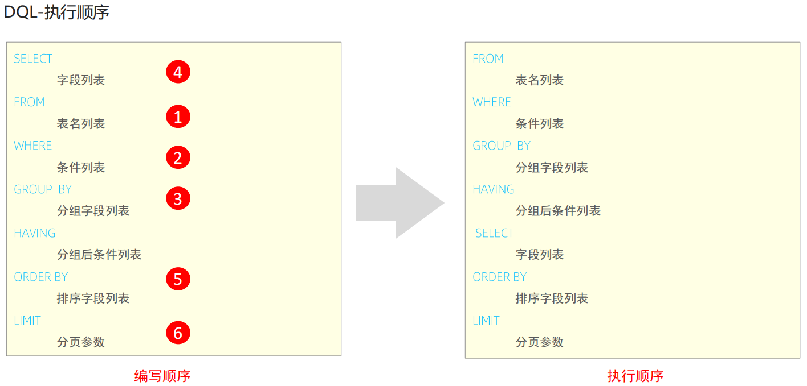

**6.数据控制语言DCL**

**6.1 DCL-管理用户**

查询用户

<table>
<colgroup>
<col style="width: 100%" />
</colgroup>
<tbody>
<tr class="odd">
<td>SQL 
USE mysql 
SELECT * FROM user;</td>
</tr>
</tbody>
</table>

创建用户

<table>
<colgroup>
<col style="width: 100%" />
</colgroup>
<tbody>
<tr class="odd">
<td>SQL 
CREATE USER '用户名'@'主机名' IDENTIFIED BY '密码';</td>
</tr>
</tbody>
</table>

修改用户密码

<table>
<colgroup>
<col style="width: 100%" />
</colgroup>
<tbody>
<tr class="odd">
<td>SQL 
-- MySQL 5.7.6 及以上版本使用 
ALTER USER '用户名'@'主机名' IDENTIFIED [WITH mysql_native_password] BY '新密码'; 
 
-- MySQL 5.7.6 以下版本使用 
SET PASSWORD FOR '用户名'@'主机名' = PASSWORD('new_password');</td>
</tr>
</tbody>
</table>

修改用户名和主机名

<table>
<colgroup>
<col style="width: 100%" />
</colgroup>
<tbody>
<tr class="odd">
<td>SQL 
RENAME USER '用户名'@'主机名' TO '新用户名'@'新主机名';</td>
</tr>
</tbody>
</table>

删除用户

<table>
<colgroup>
<col style="width: 100%" />
</colgroup>
<tbody>
<tr class="odd">
<td>SQL 
DROP USER '用户名'@'主机名';</td>
</tr>
</tbody>
</table>

主机名可以用%通配，表示所有主机

localhost代表当前主机

这类语言主要是DBA使用

**6.2 DCL-权限控制**

|                     |                    |
|---------------------|--------------------|
| 权限                | 说明               |
| ALL, ALL PRIVILEGES | 所有权限           |
| SELECT              | 查询数据           |
| INSERT              | 插入数据           |
| UPDATE              | 修改数据           |
| DELETE              | 删除数据           |
| ALTER               | 修改表             |
| DROP                | 删除数据库/表/视图 |
| CREATE              | 创建数据库/表      |

查询权限

<table>
<colgroup>
<col style="width: 100%" />
</colgroup>
<tbody>
<tr class="odd">
<td>SQL 
SHOW GRANTS FOR '用户名'@'主机名';</td>
</tr>
</tbody>
</table>

授予权限

<table>
<colgroup>
<col style="width: 100%" />
</colgroup>
<tbody>
<tr class="odd">
<td>SQL 
GRANT 权限列表 ON 数据库名.表名 TO '用户名'@'主机名';</td>
</tr>
</tbody>
</table>

撤销权限

<table>
<colgroup>
<col style="width: 100%" />
</colgroup>
<tbody>
<tr class="odd">
<td>SQL 
REVOKE 权限列表 ON 数据库名.表名 FROM '用户名'@'主机名';</td>
</tr>
</tbody>
</table>

多个权限之间，使用逗号分隔

USAGE代表用户没有任何权限，创建一个用户后用户权限默认是USAGE

授权时，数据库名或表名可以使用\*通配符，代表所有数据库或表

**6.3 函数**

函数就是一段可以直接被另一段程序调用的程序或代码。

**6.3.1 字符串函数**

|                          |                                                                      |
|--------------------------|----------------------------------------------------------------------|
| 函数                     | 说明                                                                 |
| CONCAT(S1,S2,...,Sn)     | 字符串拼接，将S1,S2,...,Sn拼接成一个字符串                           |
| LOWER(str)               | 将字符串str全部转为小写                                              |
| UPPER(str)               | 将字符串str全部转为大写                                              |
| LPAD(str,n,pad)          | 左填充，用字符串pad对str的左边进行填充，达到n个字符串长度            |
| RPAD(str,n,pad)          | 右填充，用字符串pad对str的右边进行填充，达到n个字符串长度            |
| TRIM(str)                | 去掉字符串头部和尾部的空格                                           |
| SUBSTRING(str,start,len) | 返回从字符串str的start位置开始的len个长度的字符串（默认索引从1开始） |

<table>
<colgroup>
<col style="width: 100%" />
</colgroup>
<tbody>
<tr class="odd">
<td>SQL 
SELECT 函数(参数);</td>
</tr>
</tbody>
</table>

**6.3.2 数值函数**

|            |                                    |
|------------|------------------------------------|
| 函数       | 功能                               |
| CEIL(x)    | 向上取整                           |
| FLOOR(x)   | 向下取整                           |
| MOD(x,y)   | 返回x/y的模                        |
| RAND()     | 返回0~1内的随机数                  |
| ROUND(x,y) | 求参数x的四舍五入的值，保留y位小数 |

**6.3.3 日期函数**

|                                   |                                                            |
|-----------------------------------|------------------------------------------------------------|
| 函数                              | 功能                                                       |
| CURDATE()                         | 返回当前日期（yyyy-mm-dd）                                 |
| CURTIME()                         | 返回当前时间（hh:mm:ss）                                   |
| NOW()                             | 返回当前日期和时间（yyyy-mm-dd hh:mm:ss）                  |
| YEAR(date)                        | 获取指定date的年份                                         |
| MONTH(date)                       | 获取指定date的月份                                         |
| DAY(date)                         | 获取指定date的日期（每月的第几号）                         |
| DATE_ADD(date,INTERVAL expr type) | 返回一个日期/时间值加上一个时间间隔expr后的时间值          |
| DATEDIFF(date1,date2)             | 返回起始时间date1和结束时间date2之间的天数（date1减date2） |

**DATE_ADD(date,INTERVAL expr type)函数细节：**

expr如果是正数，表示从时间date向后推，如果是负数就表示往前推，如果是0就表示是date本身

type常用的类型：YEAR(年)、MONTH(月)、DAY(天)、HOUR(小时)、MINUTE(分钟)、SECOND(秒)

**6.3.4 流程函数**

|                                                                          |                                                   |
|--------------------------------------------------------------------------|---------------------------------------------------|
| 函数                                                                     | 功能                                              |
| IF(value, t, f)                                                          | 如果value为true，则返回t，否则返回f               |
| IFNULL(value1, value2)                                                   | 如果value1不为空，返回value1，否则返回value2      |
| CASE WHEN \[ val1 \] THEN \[ res1 \] … ELSE \[ default \] END            | 如果val1为true，返回res1，… 否则返回default       |
| CASE \[ expr \] WHEN \[ val1 \] THEN \[ res1 \] … ELSE \[ default \] END | 如果expr的值等于val1，返回res1，… 否则返回default |

**7.约束**

约束是作用于表中字段上的规则，用于限制存储在表中的数据，目的是保证数据库中数据的正确、有效性和完整性

|                          |                                                          |                   |
|--------------------------|----------------------------------------------------------|-------------------|
| 约束                     | 描述                                                     | 关键字            |
| 非空约束                 | 限制该字段的数据不能为null                               | NOT NULL          |
| 唯一约束                 | 保证该字段的所有数据都是唯一、不重复的                   | UNIQUE            |
| 主键约束                 | 主键是一行数据的唯一标识，要求非空且唯一                 | PRIMARY KEY       |
| 默认约束                 | 保存数据时，如果未指定该字段的值，则采用默认值           | DEFAULT           |
| 检查约束（8.0.16版本后） | 保证字段值满足某一个条件                                 | CHECK(自定义条件) |
| 自动增长                 | 添加数据时如果没有为字段设置值，会自动增长1个单位        | AUTO_INCREMENT    |
| 外键约束                 | 用来让两张图的数据之间建立连接，保证数据的一致性和完整性 | FOREIGN KEY       |

约束是作用于表中字段上的，可以在创建表/修改表的时候添加约束

有些情况下，虽然数据没有成功添加，但仍然会占用自动增长一个值，比如事务回滚；违反约束条件或数据类型不匹配等导致插入操作失败

示例：

<table>
<colgroup>
<col style="width: 100%" />
</colgroup>
<tbody>
<tr class="odd">
<td>SQL 
create table user( 
id int primary key auto_increment, 
name varchar(10) not null unique, 
age int check(age &gt; 0 and age &lt; 120), 
status char(1) default '1', 
gender char(1) 
);</td>
</tr>
</tbody>
</table>

**外键约束**

外键用来让两张表之间建立连接，从而保证数据的一致性和完整性

**1.语法**

添加外键

<table>
<colgroup>
<col style="width: 100%" />
</colgroup>
<tbody>
<tr class="odd">
<td>SQL 
CREATE TABLE 表名( 
字段名 字段类型, 
... 
[CONSTRAINT] [外键名称] FOREIGN KEY(外键字段名) REFERENCES 主表(主表列名) 
); 
ALTER TABLE 表名 ADD CONSTRAINT 外键名称 FOREIGN KEY (外键字段名) REFERENCES 主表(主表列名);</td>
</tr>
</tbody>
</table>

删除外键

<table>
<colgroup>
<col style="width: 100%" />
</colgroup>
<tbody>
<tr class="odd">
<td>SQL 
ALTER TABLE 表名 DROP FOREIGN KEY 外键名称;</td>
</tr>
</tbody>
</table>

**2.删除/更新行为**

|             |                                                                                                                       |
|-------------|-----------------------------------------------------------------------------------------------------------------------|
| 行为        | 说明                                                                                                                  |
| NO ACTION   | 当在父表中删除/更新对应记录时，首先检查该记录是否有对应外键，如果有则不允许删除/更新（与RESTRICT一致）                |
| RESTRICT    | 当在父表中删除/更新对应记录时，首先检查该记录是否有对应外键，如果有则不允许删除/更新（与NO ACTION一致）               |
| CASCADE     | 当在父表中删除/更新对应记录时，首先检查该记录是否有对应外键，如果有则也删除/更新外键在子表中的记录                    |
| SET NULL    | 当在父表中删除/更新对应记录时，首先检查该记录是否有对应外键，如果有则设置子表中该外键值为null（要求该外键允许为null） |
| SET DEFAULT | 父表有变更时，子表将外键设为一个默认值（Innodb不支持）                                                                |

<table>
<colgroup>
<col style="width: 100%" />
</colgroup>
<tbody>
<tr class="odd">
<td>SQL 
ALTER TABLE 表名 ADD CONSTRAINT 外键名称 FOREIGN KEY (外键字段) REFERENCES 主表名(主表字段名) ON UPDATE 行为 ON DELETE 行为;</td>
</tr>
</tbody>
</table>

**8.多表查询**

**8.1 多表关系**

**8.1.1 一对多（多对一）**

案例：部门与员工  
关系：一个部门对应多个员工，一个员工对应一个部门  
实现：**在多的一方建立外键，指向一的一方的主键**

**8.1.2 多对多**

案例：学生与课程  
关系：一个学生可以选多门课程，一门课程也可以供多个学生选修  
实现：**建立第三张中间表，中间表至少包含两个外键，分别关联两方主键**

**8.1.3 一对一**

案例：用户与用户详情  
关系：一对一关系，多用于单表拆分，将一张表的基础字段放在一张表中，其他详情字段放在另一张表中，以提升操作效率  
实现：**在任意一方加入外键，关联另外一方的主键，并且设置外键为唯一的**（UNIQUE）

**8.2 查询**

笛卡尔积：表1和表2的笛卡尔积等于表1的每一行和表2的所有行合并和的新的表，假设表1有m行，表2有n行，则笛卡尔积有mn行

<table>
<colgroup>
<col style="width: 100%" />
</colgroup>
<tbody>
<tr class="odd">
<td>SQL 
select * from 表1, 表2;</td>
</tr>
</tbody>
</table>

多个表的笛卡尔积就是所有的可能结合构成的表，笛卡尔积的行数是各个表行数的乘积

一般笛卡尔积是没有意义的，我们会加上WHERE条件筛选

**8.3 内连接查询**

内连接查询的是两张表交集的部分

隐式内连接：

<table>
<colgroup>
<col style="width: 100%" />
</colgroup>
<tbody>
<tr class="odd">
<td>SQL 
SELECT 字段列表 FROM 表1, 表2 WHERE 条件 ...;</td>
</tr>
</tbody>
</table>

显式内连接：

<table>
<colgroup>
<col style="width: 100%" />
</colgroup>
<tbody>
<tr class="odd">
<td>SQL 
SELECT 字段列表 FROM 表1 [ INNER ] JOIN 表2 ON 连接条件 ...;</td>
</tr>
</tbody>
</table>

如果已经为表起了别名，执行顺序之后的语句只能通过表的别名访问表，不能通过表名访问表

隐式内连接和显式内连接仅仅是代码上的区别，功能上完全一致

**8.4 外连接查询**

**左外连接**

查询左表所有数据，以及两张表交集部分数据

<table>
<colgroup>
<col style="width: 100%" />
</colgroup>
<tbody>
<tr class="odd">
<td>SQL 
SELECT 字段列表 FROM 表1 LEFT [ OUTER ] JOIN 表2 ON 条件 ...;</td>
</tr>
</tbody>
</table>

相当于查询表1的所有数据，包含表1和表2交集部分数据

**右外连接**

查询右表所有数据，以及两张表交集部分数据

<table>
<colgroup>
<col style="width: 100%" />
</colgroup>
<tbody>
<tr class="odd">
<td>SQL 
SELECT 字段列表 FROM 表1 RIGHT [ OUTER ] JOIN 表2 ON 条件 ...;</td>
</tr>
</tbody>
</table>

左外连接可以查询到左边表的null字段，右外连接可以查询到右边表的null字段

**8.5 自连接查询**

当前表与自身的连接查询，自连接必须使用表别名

<table>
<colgroup>
<col style="width: 100%" />
</colgroup>
<tbody>
<tr class="odd">
<td>SQL 
SELECT 字段列表 FROM 表A 别名A JOIN 表A 别名B ON 条件 ...;</td>
</tr>
</tbody>
</table>

自连接查询，可以是内连接查询，也可以是外连接查询

**8.6 联合查询-union, union all**

把多次查询的结果合并，形成一个新的查询集

<table>
<colgroup>
<col style="width: 100%" />
</colgroup>
<tbody>
<tr class="odd">
<td>SQL 
SELECT 字段列表 FROM 表A ... 
UNION [ALL] 
SELECT 字段列表 FROM 表B ...</td>
</tr>
</tbody>
</table>

UNION ALL 会有重复结果，UNION 不会

联合查询多张表的查询列要一致，否则会出错

联合查询比使用or效率高，不会使索引失效

**8.7 子查询**

SQL语句中嵌套SELECT语句，称谓嵌套查询，又称子查询

<table>
<colgroup>
<col style="width: 100%" />
</colgroup>
<tbody>
<tr class="odd">
<td>SQL 
SELECT * FROM t1 WHERE 列名 = ( SELECT 列名 FROM t2);</td>
</tr>
</tbody>
</table>

子查询外部的语句可以是 INSERT / UPDATE / DELETE / SELECT 的任何一个

**8.7.1 子查询分类**

1.根据子查询结果可以分为：

标量子查询（子查询结果为单个值）

列子查询（子查询结果为一列）

行子查询（子查询结果为一行）

表子查询（子查询结果为多行多列）

2.根据子查询位置可分为：

WHERE 之后

FROM 之后

SELECT 之后

**8.7.2 标量子查询**

子查询返回的结果是单个值（数字、字符串、日期等）

常用操作符：= \<\> \> \>= \< \<=

**8.7.3 列子查询**

返回的结果是一列（可以是多行）

常用操作符：

|        |                                        |
|--------|----------------------------------------|
| 操作符 | 描述                                   |
| IN     | 在指定的集合范围内，多选一             |
| NOT IN | 不在指定的集合范围内                   |
| ANY    | 子查询返回列表中，有任意一个满足即可   |
| SOME   | 与ANY等同，使用SOME的地方都可以使用ANY |
| ALL    | 子查询返回列表的所有值都必须满足       |

**8.7.4 行子查询**

返回的结果是一行（可以是多列）

常用操作符：= \< \> IN NOT IN

**8.7.5 表子查询**

返回的结果是多行多列

常用操作符：IN

示例：

<table>
<colgroup>
<col style="width: 100%" />
</colgroup>
<tbody>
<tr class="odd">
<td>SQL 
-- 查询与xxx1，xxx2的职位和薪资相同的员工 
select * from employee where (job, salary) in (select job, salary from employee where name = 'xxx1' or name = 'xxx2'); 
-- 查询入职日期是2006-01-01之后的员工，及其部门信息 
select e.*, d.* from (select * from employee where entrydate &gt; '2006-01-01') as e left join dept as d on e.dept = d.id;</td>
</tr>
</tbody>
</table>

**三、事务**

事务是一组操作的集合，事务会把所有操作作为一个整体一起向系统提交或撤销操作请求，即这些操作要么同时成功，要么同时失败。

**1.代码设置**

**1.1 方式一**

查看/设置事务提交方式

<table>
<colgroup>
<col style="width: 100%" />
</colgroup>
<tbody>
<tr class="odd">
<td>SQL 
SELECT @@AUTOCOMMIT; 
SET @@AUTOCOMMIT = 0;</td>
</tr>
</tbody>
</table>

@@AUTOCOMMIT的值有两种：1为自动提交，0为手动提交，该设置只对当前会话有效

提交事务

<table>
<colgroup>
<col style="width: 100%" />
</colgroup>
<tbody>
<tr class="odd">
<td>SQL 
COMMIT;</td>
</tr>
</tbody>
</table>

回滚事务

<table>
<colgroup>
<col style="width: 100%" />
</colgroup>
<tbody>
<tr class="odd">
<td>SQL 
ROLLBACK;</td>
</tr>
</tbody>
</table>

**1.2 方式二**

开启事务

<table>
<colgroup>
<col style="width: 100%" />
</colgroup>
<tbody>
<tr class="odd">
<td>SQL 
START TRANSACTION 或 BEGIN [TRANSACTION];</td>
</tr>
</tbody>
</table>

提交事务

<table>
<colgroup>
<col style="width: 100%" />
</colgroup>
<tbody>
<tr class="odd">
<td>SQL 
COMMIT;</td>
</tr>
</tbody>
</table>

回滚事务

<table>
<colgroup>
<col style="width: 100%" />
</colgroup>
<tbody>
<tr class="odd">
<td>SQL 
ROLLBACK;</td>
</tr>
</tbody>
</table>

**2.事务的四大特性(ACID)**

原子性(**A**tomicity)：事务是不可分割的最小操作单元，要么全部成功，要么全部失败

一致性(**C**onsistency)：事务完成时，必须使所有数据都保持一致状态

隔离性(**I**solation)：数据库系统提供的隔离机制，保证事务在不受外部并发操作影响的独立环境下运行

持久性(**D**urability)：事务一旦提交或回滚，它对数据库中的数据的改变就是永久的

**3.并发事务问题**

|            |                                                                                        |
|------------|----------------------------------------------------------------------------------------|
| 问题       | 描述                                                                                   |
| 脏读       | 一个事务读到另一个事务还没提交的数据                                                   |
| 不可重复读 | 一个事务先后读取同一条记录，但两次读取的数据不同                                       |
| 幻读       | 一个事务按照条件查询数据时，没有对应的数据行，但是再插入数据时，又发现这行数据已经存在 |

**4.事务隔离级别**

|                       |      |            |      |
|-----------------------|------|------------|------|
| 隔离级别              | 脏读 | 不可重复读 | 幻读 |
| Read uncommitted      | √    | √          | √    |
| Read committed        | ×    | √          | √    |
| Repeatable Read(默认) | ×    | ×          | √    |
| Serializable          | ×    | ×          | ×    |

查看事务隔离级别

<table>
<colgroup>
<col style="width: 100%" />
</colgroup>
<tbody>
<tr class="odd">
<td>SQL 
SELECT @@TRANSACTION_ISOLATION;</td>
</tr>
</tbody>
</table>

设置事务隔离级别

<table>
<colgroup>
<col style="width: 100%" />
</colgroup>
<tbody>
<tr class="odd">
<td>SQL 
SET [SESSION | GLOBAL] TRANSACTION ISOLATION LEVEL {READ UNCOMMITTED | READ COMMITTED | REPEATABLE READ | SERIALIZABLE};</td>
</tr>
</tbody>
</table>

SESSION 是会话级别，表示只针对当前会话有效，GLOBAL 表示对所有会话有效

事务隔离级别越高，数据安全性越安全，但是性能越低，Read uncommitted事务隔离级别最低，Serializable事务隔离级别最高

**四、存储引擎**

**1.MySQL体系结构**

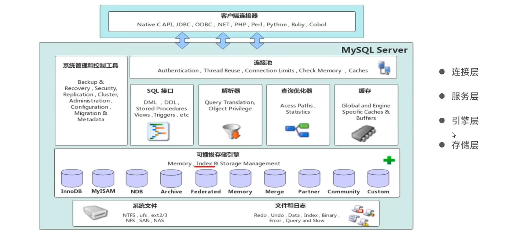

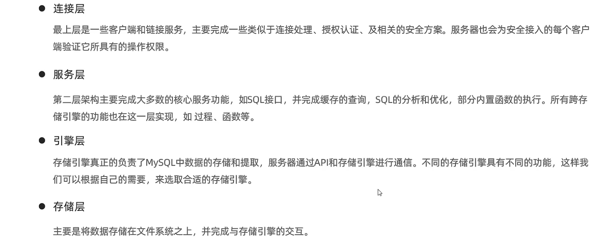

存储引擎就是存储数据、建立索引、更新/查询数据等技术的实现方式。存储引擎是基于表而不是基于库的，所以存储引擎也可以被称为表引擎。

默认存储引擎是InnoDB

**2.相关语句**

创建表时指定存储引擎

<table>
<colgroup>
<col style="width: 100%" />
</colgroup>
<tbody>
<tr class="odd">
<td>SQL 
CREATE TABLE 表名( 
... 
) ENGINE=INNODB;</td>
</tr>
</tbody>
</table>

查看当前数据库支持的存储引擎

<table>
<colgroup>
<col style="width: 100%" />
</colgroup>
<tbody>
<tr class="odd">
<td>SQL 
show engines;</td>
</tr>
</tbody>
</table>

**3.InnoDB**

InnoDB 是一种兼顾高可靠性和高性能的通用存储引擎，在 MySQL 5.5 之后，InnoDB 是默认的 MySQL 引擎。

**3.1 特点**

DML 操作遵循 ACID 模型，支持**事务**

**行级锁**，提高并发访问性能

支持**外键**约束，保证数据的完整性和正确性

**3.2 文件**

xxx.ibd：xxx代表表名，InnoDB 引擎的每张表都会对应这样一个表空间文件，存储该表的表结构（frm、sdi）、数据和索引。  
参数：innodb_file_per_table，决定多张表共享一个表空间（OFF）还是每张表对应一个表空间（ON）

查看MySQL变量

<table>
<colgroup>
<col style="width: 100%" />
</colgroup>
<tbody>
<tr class="odd">
<td>SQL 
show variables like 'innodb_file_per_table';</td>
</tr>
</tbody>
</table>

从idb文件提取表结构数据（在cmd执行）

<table>
<colgroup>
<col style="width: 100%" />
</colgroup>
<tbody>
<tr class="odd">
<td>PowerShell 
ibd2sdi 表名.ibd</td>
</tr>
</tbody>
</table>

**3.3 InnoDB 逻辑存储结构**

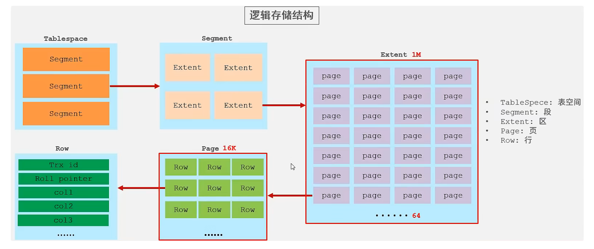

**4.MyISAM**

MyISAM 是 MySQL 早期的默认存储引擎。

**4.1 特点**

不支持事务，不支持外键

支持表锁，不支持行锁

访问速度快

**4.2 文件**

表名.sdi：存储表结构信息

表名.MYD：存储数据

表名.MYI：存储索引

**5.Memory**

Memory 引擎的表数据是存储在内存中的，受硬件问题、断电问题的影响，只能将这些表作为临时表或缓存使用。

**5.1 特点**

存放在内存中，速度快

hash索引（默认）

**5.2 文件**

表名.sdi：存储表结构信息

**6.存储引擎的比较**

|              |                     |        |        |
|--------------|---------------------|--------|--------|
| 特点         | InnoDB              | MyISAM | Memory |
| 存储限制     | 64TB                | 有     | 有     |
| 事务安全     | **支持**            | \-     | \-     |
| 锁机制       | **行锁**            | 表锁   | 表锁   |
| B+tree索引   | 支持                | 支持   | 支持   |
| Hash索引     | \-                  | \-     | 支持   |
| 全文索引     | 支持（5.6版本之后） | 支持   | \-     |
| 空间使用     | 高                  | 低     | N/A    |
| 内存使用     | 高                  | 低     | 中等   |
| 批量插入速度 | 低                  | 高     | 高     |
| 支持外键     | **支持**            | \-     | \-     |

**7.存储引擎的选择**

在选择存储引擎时，应该根据应用系统的特点选择合适的存储引擎。对于复杂的应用系统，还可以根据实际情况选择多种存储引擎进行组合。

InnoDB: 如果应用对事物的完整性有比较高的要求，在并发条件下要求数据的一致性，数据操作除了插入和查询之外，还包含很多的更新、删除操作，则 InnoDB 是比较合适的选择

MyISAM: 如果应用是以读操作和插入操作为主，只有很少的更新和删除操作，并且对事务的完整性、并发性要求不高，那这个存储引擎是非常合适的。

Memory: 将所有数据保存在内存中，访问速度快，通常用于临时表及缓存。Memory 的缺陷是对表的大小有限制，太大的表无法缓存在内存中，而且无法保障数据的安全性

电商中的足迹和评论适合使用 MyISAM 引擎，缓存适合使用 Memory 引擎。

**五、性能分析**

**1.查看执行频次**

MySQL客户端连接成功后，通过show \[session\|global\] status命令可以提供服务器状态信息，通过以下指令可以查看当前数据库的 INSERT, UPDATE, DELETE, SELECT 访问频次

<table>
<colgroup>
<col style="width: 100%" />
</colgroup>
<tbody>
<tr class="odd">
<td>SQL 
SHOW GLOBAL|SESSION STATUS LIKE 'Com_______';(7个下划线)</td>
</tr>
</tbody>
</table>

**2.慢查询日志**

慢查询日志记录了所有执行时间超过指定参数（long_query_time，单位：秒，默认10秒）的所有SQL语句的日志。

查看慢查询日志开关状态（ON为开启，OFF为关闭）

<table>
<colgroup>
<col style="width: 100%" />
</colgroup>
<tbody>
<tr class="odd">
<td>SQL 
show variables like 'slow_query_log';</td>
</tr>
</tbody>
</table>

启用慢查询日志（重启后失效）

<table>
<colgroup>
<col style="width: 100%" />
</colgroup>
<tbody>
<tr class="odd">
<td>SQL 
SET GLOBAL slow_query_log = 'ON';</td>
</tr>
</tbody>
</table>

MySQL的慢查询日志默认没有开启，需要在MySQL的配置文件（/etc/my.cnf）中配置如下信息（重启后不会失效）

1.开启慢查询日志开关

<table>
<colgroup>
<col style="width: 100%" />
</colgroup>
<tbody>
<tr class="odd">
<td>Properties 
slow_query_log=1</td>
</tr>
</tbody>
</table>

2.设置慢查询日志的时间（例如2秒），SQL语句执行时间超过2秒，就会视为慢查询，记录慢查询日志

<table>
<colgroup>
<col style="width: 100%" />
</colgroup>
<tbody>
<tr class="odd">
<td>Properties 
long_query_time=2</td>
</tr>
</tbody>
</table>

在执行这两条命令前，需要以管理员身份打开慢查询日志文件，具体操作可以上网搜索

更改后记得重启MySQL服务，日志文件位置：/var/lib/mysql/localhost-slow.log

**3.profile**

show profile 能在做SQL优化时帮我们了解时间都耗费在哪里。通过 have_profiling 参数，能看到当前 MySQL 是否支持 profile 操作

查看当前 MySQL 是否支持 profile 操作

<table>
<colgroup>
<col style="width: 100%" />
</colgroup>
<tbody>
<tr class="odd">
<td>SQL 
SELECT @@have_profiling;</td>
</tr>
</tbody>
</table>

查看当前profiling是否开启

<table>
<colgroup>
<col style="width: 100%" />
</colgroup>
<tbody>
<tr class="odd">
<td>SQL 
select @@profiling;</td>
</tr>
</tbody>
</table>

profiling 默认关闭，可以通过set语句在session/global级别开启 profiling

<table>
<colgroup>
<col style="width: 100%" />
</colgroup>
<tbody>
<tr class="odd">
<td>SQL 
SET profiling = 1;</td>
</tr>
</tbody>
</table>

查看所有语句的耗时

<table>
<colgroup>
<col style="width: 100%" />
</colgroup>
<tbody>
<tr class="odd">
<td>SQL 
show profiles;</td>
</tr>
</tbody>
</table>

查看指定query_id（SQL语句的编号）的SQL语句各个阶段的耗时

<table>
<colgroup>
<col style="width: 100%" />
</colgroup>
<tbody>
<tr class="odd">
<td>SQL 
show profile for query query_id;</td>
</tr>
</tbody>
</table>

查看指定query_id（SQL语句的编号）的SQL语句CPU的使用情况

<table>
<colgroup>
<col style="width: 100%" />
</colgroup>
<tbody>
<tr class="odd">
<td>SQL 
show profile cpu for query query_id;</td>
</tr>
</tbody>
</table>

**4.explain**

EXPLAIN 或者 DESC 命令获取 MySQL 如何执行 SELECT 语句的信息，包括在 SELECT 语句执行过程中表如何连接和连接的顺序

语法（直接在select语句之前加上关键字 explain / desc）

<table>
<colgroup>
<col style="width: 100%" />
</colgroup>
<tbody>
<tr class="odd">
<td>SQL 
EXPLAIN|DESC SELECT 字段列表 FROM 表名 HWERE 条件;</td>
</tr>
</tbody>
</table>

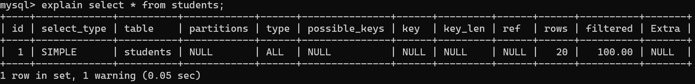

**EXPLAIN 各字段含义:**

**id**：select 查询的序列号，表示查询中执行 select 子句或者操作表的顺序（id相同，执行顺序从上到下（多表查询）；id不同，值越大越先执行（子查询））

**select_type**：表示 SELECT 的类型，常见取值有 SIMPLE（简单表，即不使用表连接或者子查询）、PRIMARY（主查询，即外层的查询）、UNION（UNION中的第二个或者后面的查询语句）、SUBQUERY（SELECT/WHERE之后包含了子查询）等

**type**：表示连接类型，性能由好到差的连接类型为 NULL、system、const、eq_ref、ref、range、index、all

NULL：查询不访问任何表时出现，一般不会出现

system：当访问系统表或表中仅有一行记录时出现

const：使用 PRIMARY KEY 或者 UNIQUE 索引进行精确匹配，且只匹配到一行记录时会出现

eq_ref：在连接查询里使用 PRIMARY KEY 或者 UNIQUE 索引进行连接，且对于每个来自前面表的记录，在当前表中都能通过索引找到唯一匹配的记录时出现

ref：使用非唯一性索引查询时会出现

range：使用索引进行范围查询时出现

index：查询需要扫描整个索引树来获取数据时出现（不一定扫描全表）

all：扫描全表数据时出现

从优到劣：NULL\> system \> const \> eq_ref \> ref \> range \> index \> ALL

**possible_key**：可能应用在这张表上的索引，一个或多个

**Key**：实际使用的索引，如果为 NULL，则没有使用索引

**Key_len**：表示索引中使用的字节数，该值为索引字段最大可能长度，并非实际使用长度，在不损失精确性的前提下，长度越短越好

**rows**：MySQL认为必须要执行的行数，在InnoDB引擎的表中，是一个估计值，可能并不总是准确的

**filtered**：表示返回结果的行数占需读取行数的百分比，filtered的值越大越好

**六、索引**

**1.概述**

索引是帮助 MySQL **高效获取数据**的**数据结构（有序）**。在数据之外，数据库系统还维护着满足特定查找算法的数据结构，这些数据结构以某种方式引用（指向）数据，这样就可以在这些数据结构上实现高级查询算法，这种数据结构就是索引。

**优点**：

提高数据检索效率，降低数据库的IO成本

通过索引列对数据进行排序，降低数据排序的成本，降低CPU的消耗

**缺点**：

索引列也是要占用空间的

索引大大提高了查询效率，但降低了更新的速度，比如 INSERT、UPDATE、DELETE

**2.索引结构**

|                     |                                                                                  |
|---------------------|----------------------------------------------------------------------------------|
| 索引结构            | 描述                                                                             |
| **B+Tree**          | 最常见的索引类型，大部分引擎都支持B+树索引                                       |
| Hash                | 底层数据结构是用哈希表实现，只有精确匹配索引列的查询才有效，不支持范围查询       |
| R-Tree(空间索引)    | 空间索引是 MyISAM 引擎的一个特殊索引类型，主要用于地理空间数据类型，通常使用较少 |
| Full-Text(全文索引) | 是一种通过建立倒排索引，快速匹配文档的方式，类似于 Lucene, Solr, ES              |

|            |               |        |        |
|------------|---------------|--------|--------|
| 索引       | InnoDB        | MyISAM | Memory |
| B+Tree索引 | 支持          | 支持   | 支持   |
| Hash索引   | 不支持        | 不支持 | 支持   |
| R-Tree索引 | 不支持        | 支持   | 不支持 |
| Full-text  | 5.6版本后支持 | 支持   | 不支持 |

**2.1 B+Tree**

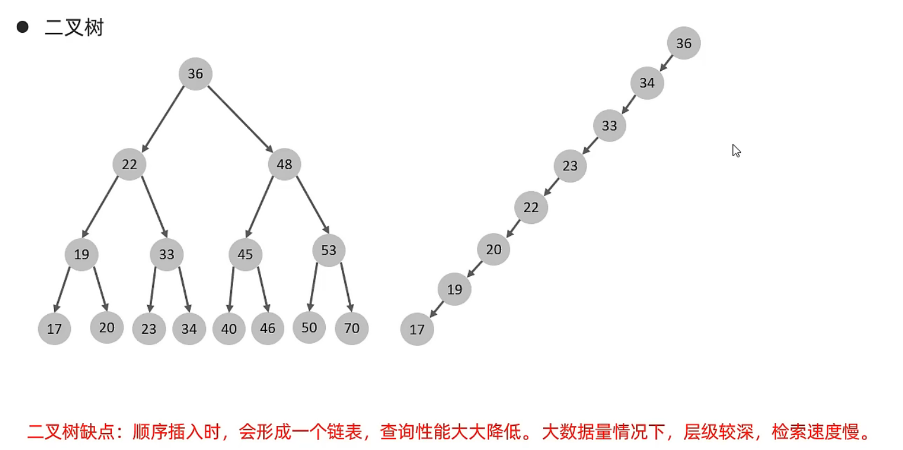

二叉树的缺点可以用红黑树来解决：

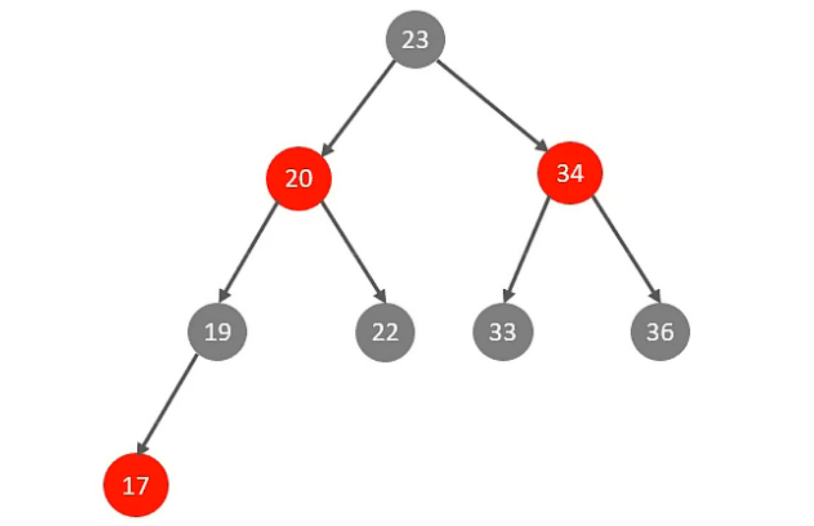

红黑树也存在大数据量情况下，层级较深，检索速度慢的问题。

**2.2 B-Tree（多路平衡查找树）**

以一棵最大度数（max-degree，指一个节点的子节点个数）为5（5阶）的 b-tree 为例（每个节点最多存储4个key，5个指针）：

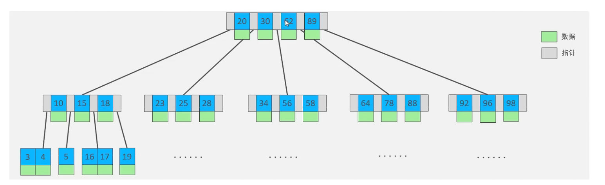

每一个节点都存储数据

演示网站：

**\[该类型的内容暂不支持下载\]**

**2.3 B+Tree**

所有的数据都会出现在叶子节点

叶子节点形成一个单向链表

演示网站：

**\[该类型的内容暂不支持下载\]**

MySQL 索引数据结构对经典的 B+Tree 进行了优化。在原 B+Tree 的基础上，增加一个指向相邻叶子节点的链表指针，就形成了带有顺序指针的 B+Tree，提高区间访问的性能：

**2.4 Hash**

哈希索引就是采用一定的hash算法，将键值换算成新的hash值，映射到对应的槽位上，然后存储在hash表中。

如果两个（或多个）键值，映射到一个相同的槽位上，他们就产生了hash冲突（也称为hash碰撞），可以通过链表来解决

**特点**：

Hash索引只能用于对等比较（=、in），不支持范围查询（betwwn、\>、\<、…）

无法利用索引完成排序操作

查询效率高，通常只需要一次检索就可以了，效率通常要高于 B+Tree 索引

**存储引擎支持**：

在MySQL中，支持hash索引的是Memory引擎，而InnoDB中具有自适应hash功能，hash索引是存储引擎根据 B+Tree 索引在指定条件下自动构建的。

**2.5 思考**

为什么 InnoDB 存储引擎选择使用 B+Tree 索引结构？

相对于二叉树，层级更少，搜索效率高

对于 B-Tree，无论是叶子节点还是非叶子节点，都会保存数据，这样导致一页中存储的键值减少，指针也跟着减少，要同样保存大量数据，只能增加树的高度，导致性能降低

相对于 Hash 索引，B+Tree 支持范围匹配及排序操作

**3.索引分类**

**3.1 分类**

|          |                                                      |                          |          |
|----------|------------------------------------------------------|--------------------------|----------|
| 分类     | 含义                                                 | 特点                     | 关键字   |
| 主键索引 | 针对于表中主键创建的索引                             | 默认自动创建，只能有一个 | PRIMARY  |
| 唯一索引 | 避免同一个表中某数据列中的值重复                     | 可以有多个               | UNIQUE   |
| 常规索引 | 快速定位特定数据                                     | 可以有多个               |          |
| 全文索引 | 全文索引查找的是文本中的关键词，而不是比较索引中的值 | 可以有多个               | FULLTEXT |

在 InnoDB 存储引擎中，根据索引的存储形式，又可以分为以下两种：

|                           |                                                            |                      |
|---------------------------|------------------------------------------------------------|----------------------|
| 分类                      | 含义                                                       | 特点                 |
| 聚集索引(Clustered Index) | 将数据存储与索引放一块，索引结构的叶子节点保存了行数据     | 必须有，而且只有一个 |
| 二级索引(Secondary Index) | 将数据与索引分开存储，索引结构的叶子节点关联的是对应的主键 | 可以存在多个         |

**3.2 演示图**

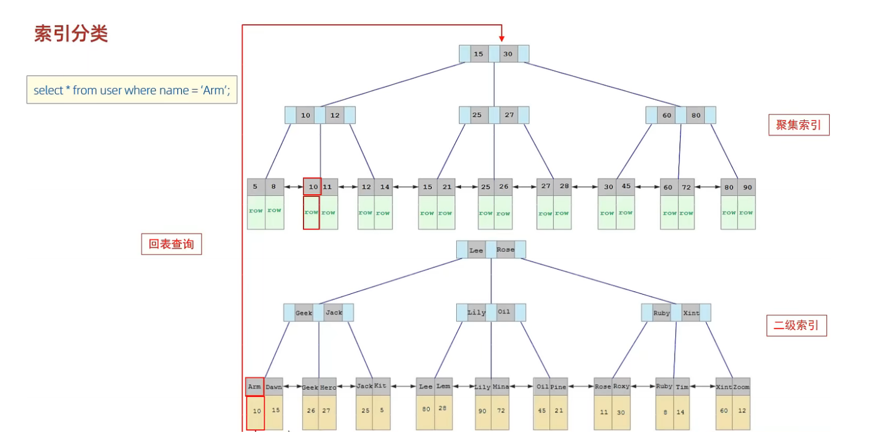

**3.3 聚集索引选取规则**

如果存在主键，主键索引就是聚集索引

如果不存在主键，将使用第一个唯一(UNIQUE)索引作为聚集索引

如果表没有主键或没有合适的唯一索引，则 InnoDB 会自动生成一个 rowid 作为隐藏的聚集索引

**3.4 思考**

（1）以下 SQL 语句，哪个执行效率高？为什么？

<table>
<colgroup>
<col style="width: 100%" />
</colgroup>
<tbody>
<tr class="odd">
<td>SQL 
select * from user where id = 10; 
select * from user where name = 'Arm'; 
-- 备注：id为主键，name字段创建的有索引</td>
</tr>
</tbody>
</table>

答：第一条语句，因为第二条需要回表查询，相当于两个步骤。

（2）InnoDB 主键索引的 B+Tree 高度为多少？

答：假设一行数据大小为1k，一页中可以存储16行这样的数据。InnoDB 的指针占用6个字节的空间，主键假设为bigint，占用字节数为8.  
可得公式：n \* 8 + (n + 1) \* 6 = 16 \* 1024，其中 8 表示 bigint 占用的字节数，n 表示当前节点存储的key的数量，(n + 1) 表示指针数量（比key多一个）。算出n约为1170。

如果树的高度为2，那么他能存储的数据量大概为：1171 \* 16 = 18736；  
如果树的高度为3，那么他能存储的数据量大概为：1171 \* 1171 \* 16 = 21939856。

另外，如果有成千上万的数据，那么就要考虑分表。

**4.语法**

创建索引

<table>
<colgroup>
<col style="width: 100%" />
</colgroup>
<tbody>
<tr class="odd">
<td>SQL 
CREATE [ UNIQUE | FULLTEXT ] INDEX index_name ON table_name (index_col_name, ...);</td>
</tr>
</tbody>
</table>

如果不加 CREATE 后面索引类型参数，则创建的是常规索引

查看索引

<table>
<colgroup>
<col style="width: 100%" />
</colgroup>
<tbody>
<tr class="odd">
<td>SQL 
SHOW INDEX FROM table_name;</td>
</tr>
</tbody>
</table>

删除索引

<table>
<colgroup>
<col style="width: 100%" />
</colgroup>
<tbody>
<tr class="odd">
<td>SQL 
DROP INDEX index_name ON table_name;</td>
</tr>
</tbody>
</table>

**5.索引使用规则**

**5.1 最左前缀法则**

如果索引关联了多列（联合索引），要遵守最左前缀法则，最左前缀法则指的是查询从索引的最左列开始，并且不跳过索引中的列。

如果跳跃某一列，索引将部分失效（后面的字段索引失效）。

比较特殊的一种情况是如果直接跳跃第一列，那么第一列后面的索引都会失效，即此时联合索引完全失效

联合索引中，出现范围查询（\<, \>），范围查询右侧的列索引失效。可以用\>=或者\<=来规避索引失效问题。

字段的位置可以任意，只要缺少复合索引某个字段，后面的字段索引全部失效

**5.2 索引失效情况**

在索引列上进行运算操作，索引将失效。如：explain select \* from tb_user where substring(phone, 10, 2) = '15';

字符串类型字段使用时，不加引号，索引将失效。如：explain select \* from tb_user where phone = 17799990015;，此处phone的值没有加引号

模糊查询中，如果仅仅是尾部模糊匹配，索引不会失效；如果是头部模糊匹配，索引失效。如：explain select \* from tb_user where profession like '%工程';，前后都有 % 也会失效

用 or 分割开的条件，如果 or 其中一个条件的列没有索引，那么涉及的索引都不会被用到

如果 MySQL 评估使用索引比全表更慢，则不使用索引

**5.3 SQL 提示**

是优化数据库的一个重要手段，简单来说，就是在SQL语句中加入一些人为的提示来达到优化操作的目的。

使用索引：

<table>
<colgroup>
<col style="width: 100%" />
</colgroup>
<tbody>
<tr class="odd">
<td>SQL 
select * from 表名 use index(索引名) where 查询条件;</td>
</tr>
</tbody>
</table>

不使用哪个索引：

<table>
<colgroup>
<col style="width: 100%" />
</colgroup>
<tbody>
<tr class="odd">
<td>SQL 
select * from 表名 ignore index(索引名) where 查询条件;</td>
</tr>
</tbody>
</table>

必须使用哪个索引：

<table>
<colgroup>
<col style="width: 100%" />
</colgroup>
<tbody>
<tr class="odd">
<td>SQL 
select * from 表名 force index(索引名) where 查询条件;</td>
</tr>
</tbody>
</table>

use 是建议，不一定使用，实际使用哪个索引 MySQL 还会自己权衡运行速度去更改，force就是无论如何都强制使用该索引。

**5.4 覆盖索引**

即查询使用了索引，并且需要返回的列，在该索引中已经全部能找到

尽量使用覆盖索引，减少select \*的书写

**5.4.1 explain 中 extra 字段含义**

using index condition：查找使用了索引，但是需要回表查询数据

using where; using index;：查找使用了索引，但是需要的数据都在索引列中能找到，所以不需要回表查询

如果在聚集索引中直接能找到对应的行，则直接返回行数据，只需要一次查询，哪怕是select \*；如果在辅助索引中找聚集索引，如select id, name from xxx where name='xxx';，也只需要通过辅助索引(name)查找到对应的id，返回name和name索引对应的id即可，只需要一次查询；如果是通过辅助索引查找其他字段，则需要回表查询，如select id, name, gender from xxx where name='xxx';

所以尽量不要用select \*，容易出现回表查询，降低效率，除非有联合索引包含了所有字段

**5.4.2 面试题**

一张表，有四个字段（id, username, password, status），由于数据量大，需要对以下SQL语句进行优化，该如何进行才是最优方案：  
select id, username, password from tb_user where username='itcast';

解：给username和password字段建立联合索引，则不需要回表查询，直接覆盖索引

**5.5 前缀索引**

当字段类型为字符串（varchar, text等）时，有时候需要索引很长的字符串，这会让索引变得很大，查询时，浪费大量的磁盘IO，影响查询效率，此时可以只降字符串的一部分前缀，建立索引，这样可以大大节约索引空间，从而提高索引效率

<table>
<colgroup>
<col style="width: 100%" />
</colgroup>
<tbody>
<tr class="odd">
<td>SQL 
create index 索引名 on 表名(列名(n));</td>
</tr>
</tbody>
</table>

前缀长度：可以根据索引的选择性来决定，而选择性是指不重复的索引值（基数）和数据表的记录总数的比值，索引选择性越高则查询效率越高，唯一索引的选择性是1，这是最好的索引选择性，性能也是最好的。

求选择性公式（截取长度可以任取，不断运行，直到合适为止）：

<table>
<colgroup>
<col style="width: 100%" />
</colgroup>
<tbody>
<tr class="odd">
<td>SQL 
select count(distinct 列名) / count(*) from 表名; 
select count(distinct substring(列名, 1, 截取长度)) / count(*) from 表名;</td>
</tr>
</tbody>
</table>

show index 里面的sub_part可以看到接取的长度

**5.6 不满足最左前缀法则仍可能触发复合索引的情况**

只是可能触发，优化器可能仍选择全表扫描。

**5.6.1 覆盖索引**

当查询的字段完全包含在联合索引中，即使 WHERE 条件不满足最左前缀，MySQL 可能选择 全索引扫描（而非全表扫描）来直接返回数据例如：

索引（a,b,c），SELECT b, c FROM table WHERE b = 10;，数据可直接从索引中提取（无需回表），优化器可能选择扫描整个索引。

**5.6.2 索引下推（ICP）**

MySQL 5.6+ 支持 ICP，当查询条件包含部分联合索引列时，即使不满足最左前缀，存储引擎层仍会利用索引过滤数据，减少回表次数，例如：

索引（a,b,c），SELECT \* FROM table WHERE a = 1 AND c = 3;，a 作为最左前缀生效，c 的条件通过 ICP 在存储引擎层过滤。

索引下推（ICP）需在 MySQL 5.6+ 且开启 optimizer_switch=index_condition_pushdown=on

**5.6.3 排序/索引优化**

若 ORDER BY 或 GROUP BY 的字段顺序与联合索引一致，即使 WHERE 条件不满足最左前缀，仍可能利用索引优化排序或分组，例如：

索引（a,b），SELECT \* FROM table WHERE a \> 1 ORDER BY b;，索引 (a, b) 天然按 a, b 排序，优化器可能选择索引避免 filesort。

**5.6.4 范围查询后的等值查询**

若查询条件中 最左前缀为范围查询，后续列的等值条件可能仍会使用索引，例如：

索引（a,b,c），SELECT \* FROM table WHERE a \> 1 AND b = 2;，索引会先按 a 的范围查找，再匹配 b 的等值条件（需结合索引下推）。

**5.7 单列索引和联合索引**

单列索引：即一个索引只包含单个列

联合索引：即一个索引包含了多个列

在业务场景中，如果存在多个查询条件，考虑针对于查询字段建立索引时，**建议建立联合索引**，而非单列索引

多条件联合查询时，MySQL优化器会评估哪个字段的索引效率更高，会选择该索引完成本次查询

**5.8 设计原则**

针对于数据量较大，且查询比较频繁的表建立索引

针对于常作为查询条件（where）、排序（order by）、分组（group by）操作的字段建立索引

尽量选择区分度高的列作为索引，尽量建立唯一索引，区分度越高，使用索引的效率越高

如果是字符串类型的字段，字段长度较长，可以针对于字段的特点，建立前缀索引

尽量使用联合索引，减少单列索引，查询时，联合索引很多时候可以覆盖索引，节省存储空间，避免回表，提高查询效率

要控制索引的数量，索引并不是多多益善，索引越多，维护索引结构的代价就越大，会影响增删改的效率

如果索引列不能存储NULL值，请在创建表时使用NOT NULL约束它。当优化器知道每列是否包含NULL值时，它可以更好地确定哪个索引最有效地用于查询

**七、SQL 优化**

**1.插入数据**

**1.1 普通插入**

采用批量插入（一次插入的数据不建议超过1000条）

手动提交事务

主键顺序插入

**1.2 大批量插入**

如果一次性需要插入大批量数据，使用insert语句插入性能较低，此时可以使用MySQL数据库提供的load指令插入

<table>
<colgroup>
<col style="width: 100%" />
</colgroup>
<tbody>
<tr class="odd">
<td>PowerShell 
# 客户端连接服务端时，加上参数 --local-infile（这一行在bash/cmd界面输入） 
mysql --local-infile -u root -p 
# 设置全局参数local_infile为1，开启从本地加载文件导入数据的开关 
set global local_infile = 1; 
select @@local_infile; 
# 执行load指令将准备好的数据，加载到表结构中 
load data local infile '/root/sql1.log' into table 'tb_user' fields terminated by ',' lines terminated by '\n';</td>
</tr>
</tbody>
</table>

在Windows的cmd命令行中进行load导入数据时，/root/sql1.log路径应使用绝对路径，格式为C:\\path\\to\\file.log（注意转义反斜杠）或 C:/path/to/file.log（使用正斜杠），而且需要根据不同文件的默认换行符使用合适的换行符替换\n

**2.主键优化**

数据组织方式：在InnoDB存储引擎中，**表数据都是根据主键顺序组织存放**的，这种存储方式的表称为索引组织表（Index organized table, IOT）

**2.1 页分裂**

页可以为空，也可以填充一半，也可以填充100%，每个页包含了2-N行数据（如果一行数据过大，会行溢出），根据主键排列

**2.1.1 主键顺序插入**

当主键是顺序递增时，InnoDB会将新记录插入到当前页的末尾。如果当前页已满或剩余空间不足以插入这条记录，则分配一个新页并维护一个双向指针建立两个页的联系，然后继续插入，依次类推，直到插入完毕

按照顺序插入1,2,3,4,5,6,7,8,9,10,11,12,13,14

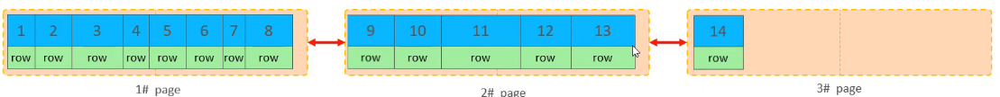

**2.1.2 主键乱序插入**

当主键无序时，InnoDB需要找到合适的插入位置进行插入。如果目标页已满或剩余空间不足以插入这条记录，会触发页分裂，即从当前页中间处分裂成两个子页并维护双向指针建立页之间的联系，然后继续插入，依次类推，直到插入完毕

插入50

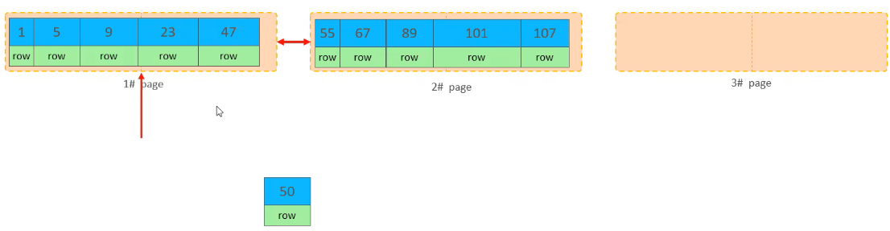

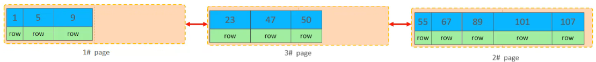

**2.1.3 应插入位置不在页末尾的情况**

若插入点位于页中间且页内有空间，InnoDB会执行以下操作：

页内空间充足：移动页内现有记录，为新记录腾出空间

页内空间不足：触发页分裂

**2.2 页合并**

当删除一行记录时，实际上记录并没有被物理删除，只是记录被标记（flaged）为删除并且它的空间变得允许被其他记录声明使用。当页中删除的记录到达 MERGE_THRESHOLD（默认为页的50%），InnoDB会开始寻找最靠近的页（前后）看看是否可以将这两个页合并（将要合并的页合并到被删除元素的页中）以优化空间使用。

MERGE_THRESHOLD：合并页的阈值，可以自己设置，在创建表或创建索引时指定

**2.3 主键设计原则**

满足业务需求的情况下，尽量降低主键的长度

插入数据时，尽量选择顺序插入，选择使用 AUTO_INCREMENT 自增主键

尽量不要使用 UUID 做主键或者是其他的自然主键，如身份证号

业务操作时，避免对主键的修改

**3.order by优化**

Using filesort：通过表的索引或全表扫描，读取满足条件的数据行，然后在排序缓冲区 sort buffer 中完成排序操作，所有不是通过索引直接返回排序结果的排序都叫 FileSort 排序

Using index：通过有序索引顺序扫描直接返回有序数据，这种情况即为 using index，不需要额外排序，操作效率高

如果order by字段全部使用升序排序或者降序排序，则都会走索引，但是如果一个字段升序排序，另一个字段降序排序，则不会走索引，explain的extra信息显示的是Using index, Using filesort，如果要优化掉Using filesort，则需要另外再创建一个索引，如：create index idx_user_age_phone_ad on tb_user(age asc, phone desc);，此时使用select id, age, phone from tb_user order by age asc, phone desc;会全部走索引

对于语句explain select id,age,phone from tb_user order by phone,age;Using filesort和Using index都会出现，原因是底层会先排序phone字段，由于缺少age，不满足最左前缀法则，不会使用idx_user_age_phone索引，出现Using filesort，然后排序age字段，满足最左前缀法则，使用索引idx_user_age_phone，出现Using index

总结：

根据排序字段建立合适的索引，多字段排序时，也遵循最左前缀法则

尽量使用覆盖索引

多字段排序，一个升序一个降序，此时需要注意联合索引在创建时的规则（ASC/DESC）

如果不可避免出现filesort，大数据量排序时，可以适当增大排序缓冲区大小 sort_buffer_size（默认256k）

**4.group by优化**

在分组操作时，可以通过索引来提高效率

分组操作时，索引的使用也是满足最左前缀法则的

如索引为idx_user_pro_age_stat，则句式可以是select ... where profession='软件工程' group by age，这样也符合最左前缀法则

**5.limit优化**

常见的问题如limit 2000000, 10，此时需要 MySQL 排序前2000010条记录，但仅仅返回2000000 - 2000010的记录，其他记录丢弃，查询排序的代价非常大。

<table>
<colgroup>
<col style="width: 100%" />
</colgroup>
<tbody>
<tr class="odd">
<td>
<strong>疑问</strong>：这里明明没有使用order by，为什么要先排序前2000010条记录？

<strong>MySQL并不能保证数据插入顺序和读取顺序一致。</strong>因为必须存在一个聚集索引，所以数据在插入时实际是按照主键顺序插入到B+树（索引底层结构就是一个树）中，所以实际存储是按照主键顺序存储的，但是插入时主键不一定有序，例如插入1、3、5、4、2，但select * from table却是1、2、3、4、5，因此select * from table limit 2000000, 10本质上是select * from table order by id limit 2000000, 10，所以这里需要先排序再返回。
</td>
</tr>
</tbody>
</table>

优化方案：一般分页查询时，通过创建覆盖索引能够比较好地提高性能，可以通过覆盖索引加子查询形式进行优化

<table>
<colgroup>
<col style="width: 100%" />
</colgroup>
<tbody>
<tr class="odd">
<td>SQL 
-- 此语句耗时很长 
select * from tb_sku limit 9000000, 10; 
-- 通过覆盖索引加快速度，直接通过主键索引进行排序及查询 
select id from tb_sku order by id limit 9000000, 10; 
-- 下面的语句是错误的，因为 MySQL 不支持 in 里面使用 limit 
-- select * from tb_sku where id in (select id from tb_sku order by id limit 9000000, 10); 
-- 通过连表查询即可实现第一句的效果，并且能达到第二句的速度 
select * from tb_sku as s, (select id from tb_sku order by id limit 9000000, 10) as a where s.id = a.id;</td>
</tr>
</tbody>
</table>

**6.count优化**

MyISAM 引擎把一个表的总行数存在了磁盘上，因此执行 count(\*) 的时候会直接返回这个数，效率很高（前提是不适用where）

InnoDB 在执行 count(\*) 时，需要把数据一行一行地从引擎里面读出来，然后累计计数。

优化方案：自己计数，如创建key-value表存储在内存或硬盘，或者使用redis。

**6.1 count的几种用法**

如果count函数的参数（count里面写的那个字段）不是NULL（字段值不为NULL），累计值就加一，最后返回累计值

用法：count(\*)、count(主键)、count(字段)、count(1)

count(主键)跟count(\*)一样，因为主键不能为空

count(字段)只计算字段值不为NULL的行

count(1)引擎会为每行添加一个1，然后就count这个1，返回结果也跟count(\*)一样，也可用其他非0数字代替1

count(null)返回0

**6.2 各种用法的性能**

count(主键)：InnoDB引擎会遍历整张表，把每行的主键id值都取出来，返回给服务层，服务层拿到主键后，直接按行进行累加（主键不可能为空）

count(字段)：没有not null约束的话，InnoDB引擎会遍历整张表把每一行的字段值都取出来，返回给服务层，服务层判断是否为null，不为null，计数累加；有not null约束的话，InnoDB引擎会遍历整张表把每一行的字段值都取出来，返回给服务层，直接按行进行累加

count(1)：InnoDB 引擎遍历整张表，但不取值。服务层对于返回的每一层，放一个数字 1 进去，直接按行进行累加

count(\*)：InnoDB 引擎并不会把全部字段取出来，而是专门做了优化，不取值，服务层直接按行进行累加

**按效率排序**：count(字段) \< count(主键) \< count(1) \< count(\*)，所以尽量使用 count(\*)

**7.update优化（避免行锁升级为表锁）**

InnoDB 的行锁是针对**索引**加的锁，不是针对记录加的锁，并且该索引不能失效，否则会从行锁升级为表锁。

如以下两条语句：

update student set no = '123' where id = 1;，这句由于id有主键索引，所以只会锁这一行

update student set no = '123' where name = 'test';，这句由于name没有索引，所以会把整张表都锁住进行数据更新，解决方法是给name字段添加索引

**八、视图、存储过程、触发器**

**1.视图**

视图(View)是一种虚拟存在的表。视图中的数据并不在数据库中实际存在，行和列数据来自定义视图的查询中使用的表，并且是在使用视图时动态生成的。

通俗的讲，视图只保存了查询的SQL逻辑，不保存查询结果。所以我们在创建视图的时候，主要的工作就落在创建这条SQL查询语句上。

**1.1 语法**

创建视图

<table>
<colgroup>
<col style="width: 100%" />
</colgroup>
<tbody>
<tr class="odd">
<td>SQL 
CREATE [OR REPLACE] VIEW 视图名称(列名列表) AS SELECT语句[WITH[CASCADED|LOCAL] CHECK OPTION]</td>
</tr>
</tbody>
</table>

查看创建视图语句

<table>
<colgroup>
<col style="width: 100%" />
</colgroup>
<tbody>
<tr class="odd">
<td>SQL 
SHOW CREATE VIEW 视图名称;</td>
</tr>
</tbody>
</table>

查看视图数据

<table>
<colgroup>
<col style="width: 100%" />
</colgroup>
<tbody>
<tr class="odd">
<td>SQL 
SELECT * FROM 视图名称…;</td>
</tr>
</tbody>
</table>

查看数据中中所有视图

<table>
<colgroup>
<col style="width: 100%" />
</colgroup>
<tbody>
<tr class="odd">
<td>SQL 
SHOW FULL TABLES IN 数据库名 WHERE Table_type = 'VIEW';</td>
</tr>
</tbody>
</table>

修改视图

<table>
<colgroup>
<col style="width: 100%" />
</colgroup>
<tbody>
<tr class="odd">
<td>SQL 
CREATE [OR REPLACE] VIEW 视图名称(列名列表) AS SELECT语句 [WITH [CASCADED|LOCAL] CHECK OPTION]; 或 
ALTER VIEW 视图名称(列名列表) AS SELECT语句 [WITH [CASCADED|LOCAL] CHECK OPTION];</td>
</tr>
</tbody>
</table>

删除视图

<table>
<colgroup>
<col style="width: 100%" />
</colgroup>
<tbody>
<tr class="odd">
<td>SQL 
DROP VIEW [IF EXISTS] 视图名称[,视图名称];</td>
</tr>
</tbody>
</table>

**1.2 检查选项**

当使用WITH CHECK OPTION子句创建视图时，MySOL会通过视图检查正在更改的每个行，例如 插入，更新，删除，以使其符合视图的定义。MySQL允许基于另一个视图创建视图，它还会检查依赖视图中的规则以保持一致性。

视图的插入、删除、更新语句和基本表的语句一致，当执行增删改操作时，实际改变的是基本表中的数据，但是不建议通过视图更改基本表。

为了确定检查的范围，mysql 提供了两个选项:CASCADED 和 LOCAL，默认值为CASCADED

**cascaded：在对视图进行更删改操作时，会核查该视图及所有直接或间接依赖的视图创建语句中的条件，只有当所有条件**都满足才能够操作成功，例如：

create view v1 as select id,name from student where id\<=20;因为没有指定WITH CHECK OPTION子句，插入时不会核查条件id\<=20，直接插入成功

create view v2 as select id,name from v1 where id\>10 with cascaded check option;插入时会核查v2中的条件id\>10和v1中的条件id\<=20，只有全部满足时才会插入成功，相当于给v1添加了with cascaded check option子句

create view v3 as select id,name from v2 where id\<=15;由于v3没有指定WITH CHECK OPTION子句，不会核查条件id\<=15，但是由于v2指定了with cascaded check option子句，所以会核查v2的条件id\>10和v1的条件id\<=20;

**local：在对视图进行更删改操作时，会核查该视图及所有直接或间接依赖的且使用WITH CHECK OPTION子句的视图创建语句中的条件，只有当所有条件**都满足才能够操作成功，例如：

create view v4 as select id,name from student where id\<=20;因为没有指定WITH CHECK OPTION子句，插入时不会核查条件id\<=20，直接插入成功

create view v5 as select id,name from v4 where id\>10 with local check option;插入时会核查v5中的条件id\>10，因为v4中没有使用WITH CHECK OPTION子句，所以不会核查v4中的条件id\<=20，也就是说，不会给v4添加with local check option子句

create view v6 as select id,name from v5 where id\<=15;因为没有指定WITH CHECK OPTION子句，插入时不会核查条件id\<=15，由于v5使用了with local check option子句，所以会核查v5中的条件id\>10，又因为v4中没有使用WITH CHECK OPTION子句，所以不会核查v4中的条件id\<=20，也就是说，仅仅核查有with local check option子句的视图中的条件

**1.3 更新及作用**

要使视图可更新，视图中的行与基础表中的行之间**必须存在一对一的关系**，即视图中的每一行必须直接对应基础表中的**唯一一行**，不能有多行映射到视图中的同一行，也不能有视图中的一行映射到基础表中的多行

如果视图包含以下任何一项，则该视图不可更新或插入：

聚合函数或窗口函数SUM()、MIN()、MAX()、COUNT()等

DISTINCT

GROUP BY

HAVINGA

UNION 或者 UNION ALL

**1.4 视图的作用**

**简单**  
视图不仅可以简化用户对数据的理解，也可以简化他们的操作。那些被经常使用的查询可以被定义为视图，从而使得用户不必为以后的操作每次指定全部的条件。

**安全**  
数据库可以授权，但不能授权到数据库特定行和特定的列上。通过视图用户只能查询和修改他们所能见到的数据。

**数据独立**  
视图可帮助用户屏蔽真实表结构变化带来的影响。

**九、存储过程**

存储过程是事先经过编译并存储在数据库中的一段 SQL语句的集合，调用存储过程可以简化应用开发人员的很多工作，减少数据在数据库和应用服务器之间的传输，对于提高数据处理的效率是有好处的。

存储过程思想上很简单，就是数据库 SQL语言层面的代码封装与重用

**特点**：

封装，复用

可以接收参数，也可以返回数据

减少网络交互，效率提升

**1.基本语法**

创建

<table>
<colgroup>
<col style="width: 100%" />
</colgroup>
<tbody>
<tr class="odd">
<td>SQL 
CREATE PROCEDURE 存储过程名字([参数列表]) 
BEGIN 
SQL语句 
END;</td>
</tr>
</tbody>
</table>

调用

<table>
<colgroup>
<col style="width: 100%" />
</colgroup>
<tbody>
<tr class="odd">
<td>SQL 
CALL 名称([参数]);</td>
</tr>
</tbody>
</table>

查看

<table>
<colgroup>
<col style="width: 100%" />
</colgroup>
<tbody>
<tr class="odd">
<td>SQL 
SELECT * FROM INFORMATION_SCHEMA.ROUTINES WHERE ROUTINE_SCHEMA='xx'; ##查询数据库的存储过程及状态信息 
SHOW CREATE PROCEDURE 存储过程名称; ##查询某个存储过程的定义</td>
</tr>
</tbody>
</table>

删除

<table>
<colgroup>
<col style="width: 100%" />
</colgroup>
<tbody>
<tr class="odd">
<td>SQL 
DROP PROCEDURE [IF EXISTS]存储过程名称;</td>
</tr>
</tbody>
</table>

|                                                                                                                                                                                  |
|----------------------------------------------------------------------------------------------------------------------------------------------------------------------------------|
| **注意**：在命令行中，执行存储过程的SQL语句时，需要通过关键字delimiter指定SQL语句的结束符，如：delimiter \$\$，此会话之后所有的SQL语句遇到分号不会结束，结束符由分号替换成了\$\$ |

**2.变量**

**2.1 系统变量**

系统变量是MySQL服务器提供，不是用户定义的，属于服务器层面。分为全局变量(GLOBAL)、会话变量(SESSION)

查看系统变量

<table>
<colgroup>
<col style="width: 100%" />
</colgroup>
<tbody>
<tr class="odd">
<td>SQL 
SHOW [SESSION|GLOBAL] VARIABLES ; --查看所有系统变量 
SHOW [SESSION|GLOBAL] VARIABLES LIKE '...'; --可以通过LIKE模糊匹配方式查找变量 
SELECT @@[SESSION.|GLOBAL.]系统变量名; --查看指定变量的值</td>
</tr>
</tbody>
</table>

设置系统变量

<table>
<colgroup>
<col style="width: 100%" />
</colgroup>
<tbody>
<tr class="odd">
<td>SQL 
SET [SESSION|GLOBAL] 系统变量名 = 值; --设置全局/会话变量 
SET @@GLOBAL.系统变量名 = 值, @@SESSION.系统变量名 = 值; --同时设置全局系统变量和会话系统变量</td>
</tr>
</tbody>
</table>

如果没有指定 session / global，默认 session，会话变量

myesql 服务器重启之后，所设置的全局参数会失效，要想不失效，需要更改/etc/my.cnf 中的配置。

**2.2 用户定义变量**

用户定义变量是用户根据需要自己定义的变量，用户变量不用提前声明，在用的时候直接用“@变量名”使用就可以。其作用域为当前连接

赋值

<table>
<colgroup>
<col style="width: 100%" />
</colgroup>
<tbody>
<tr class="odd">
<td>SQL 
SET @var_name = expr [,@var_name = expr]...; --定义单个或多个变量 
SET @var_name := expr [,@var_name := expr]...; 
 
SELECT @var_name := expr [,@var_name = expr]...; 
SELECT 字段名 INTO @var_name FROM 表名; --将查询结果赋值给变量@var_name</td>
</tr>
</tbody>
</table>

使用

<table>
<colgroup>
<col style="width: 100%" />
</colgroup>
<tbody>
<tr class="odd">
<td>SQL 
SELECT @var_name;</td>
</tr>
</tbody>
</table>

用户定义的变量无需对其进行声明或者初始化，只不过获取到的值为 NULL

**2.3 局部变量**

局部变量是根据需要定义的在局部生效的变量，访问之前，需要DECLARE声明。可用作存储过程内的局部变量和输入参数，局部变量的范围是在其内声明的BEGIN .. END块

声明

<table>
<colgroup>
<col style="width: 100%" />
</colgroup>
<tbody>
<tr class="odd">
<td>SQL 
DECLARE 变量名 变量类型 [DEFAULT 默认值];</td>
</tr>
</tbody>
</table>

变量类型就是数据库字段类型：INT、BIGINT、CHAR、VARCHAR、DATE、TIME等

赋值

<table>
<colgroup>
<col style="width: 100%" />
</colgroup>
<tbody>
<tr class="odd">
<td>SQL 
SET 变量名=值; 
 
SET 变量名:=值; 
 
SELECT 字段名 INTO 变量名 FROM 表名 ...; --将查询结果赋值给局部变量</td>
</tr>
</tbody>
</table>

**3.if 判断**

语法

<table>
<colgroup>
<col style="width: 100%" />
</colgroup>
<tbody>
<tr class="odd">
<td>SQL 
IF 条件1 THEN 
语句1 
ELSEIF 条件2 THEN -- 可选 
语句2 
... 
ELSE -- 可选 
语句n 
END IF;</td>
</tr>
</tbody>
</table>

执行流程：先判断条件1是否成立，成立就执行语句1，否则判断条件2是否成立，成立就执行语句2，否则继续判断，最后执行语句n

案例

<table>
<colgroup>
<col style="width: 100%" />
</colgroup>
<tbody>
<tr class="odd">
<td>SQL 
create procedure p3() 
begin 
declare score int default 58; 
declare result varchar(10); 
if score &gt;= 85 then 
set result :='优秀'; 
elseif score &gt;= 60 then 
set result :='及格'; 
else 
set result :='不及格'; 
end if; 
select result; 
end;</td>
</tr>
</tbody>
</table>

**4.带参存储过程**

|       |                                              |      |
|-------|----------------------------------------------|------|
| 类型  | 含义                                         | 备注 |
| IN    | 该类参数作为输入，也就是需要调用时传入值     | 默认 |
| OUT   | 该类参数作为输出，也就是该参数可以作为返回值 |      |
| INOUT | 既可以作为输入参数，也可以作为输出参数       |      |

用法

<table>
<colgroup>
<col style="width: 100%" />
</colgroup>
<tbody>
<tr class="odd">
<td>SQL 
CREATE PROCEDURE 存储过程名称([IN|OUT|INOUT 参数名 参数类型 ]...) 
BEGIN 
SQL语句 
END;</td>
</tr>
</tbody>
</table>

**5.case语句**

语法一

<table>
<colgroup>
<col style="width: 100%" />
</colgroup>
<tbody>
<tr class="odd">
<td>SQL 
CASE case_value 
WHEN when_value1 THEN statement_list1 
[WHEN when_value2 THEN statement_list2]... 
[ELSE statement_list ] 
END CASE;</td>
</tr>
</tbody>
</table>

先得到case_value的值，依次与每个WHEN后的数值when_value比较，如果相等就执行相应的statement_list语句，然后结束CASE语句，如果没有一个when_value与case_value相等，会执行语句ELSE后的语句statement_list，然后结束CASE语句

语法二

<table>
<colgroup>
<col style="width: 100%" />
</colgroup>
<tbody>
<tr class="odd">
<td>SQL 
CASE 
WHEN search_conditionl THEN statement_list1 
WHEN search_condition2 THEN statement_list2]... 
[ELSE statement_list] 
END CASE;</td>
</tr>
</tbody>
</table>

按照顺序判断每个WHEN后的条件search_condition，如果条件为true，就执行相应的语句statement_list，然后结束CASE语句，如果每个WHEN后的条件search_condition都为false，就执行ELSE后的语句statement_list，然后结束CASE语句

**6.循环**

**6.1 while**

while 循环是有条件的循环控制语句。满足条件后，再执行循环体中的SQL语句

语法

<table>
<colgroup>
<col style="width: 100%" />
</colgroup>
<tbody>
<tr class="odd">
<td>SQL 
--先判定条件，如果条件为true，则执行逻辑，否则，不执行逻辑 
WHILE 循环条件 DO 
SOL逻辑... 
END WHILE;</td>
</tr>
</tbody>
</table>

案例

<table>
<colgroup>
<col style="width: 100%" />
</colgroup>
<tbody>
<tr class="odd">
<td>SQL 
--计算从1累加到 n 的值 
create procedure p7(in n int) 
begin 
declare total int default 0; 
 
while n&gt;0 do 
set total := total + n 
set n:=n-1; 
end while; 
 
select total; 
end; 
call p7( n: 100);</td>
</tr>
</tbody>
</table>

**6.2 repeat**

repeat是有条件的循环控制语句,当满足条件的时候退出循环

与 while 区别：

先进行循环一次再判断。相当于 c 语言中的 do while();

满足条件则退出

语法

<table>
<colgroup>
<col style="width: 100%" />
</colgroup>
<tbody>
<tr class="odd">
<td>SQL 
--先执行一次逻辑，然后判定逻辑是否满足，如果满足，则退出。如果不满足，则继续下一次循环 
REPEAT 
SOL逻辑 
UNTIL 循环条件 
END REPEAT;</td>
</tr>
</tbody>
</table>

案例

<table>
<colgroup>
<col style="width: 100%" />
</colgroup>
<tbody>
<tr class="odd">
<td>SQL 
--计算从1累加到 n 的值 
create procedure p8(in n int) 
begin 
declare total int default 0; 
 
repeat 
set total := total + n; 
set n := n - 1; 
until n &lt;= 0 
end repeat; 
 
select total; 
end; 
 
call p8( n: 100);</td>
</tr>
</tbody>
</table>

**6.3 loop**

LOOP 实现简单的循环，如果不在SQL逻辑中增加退出循环的条件，可以用其来实现简单的死循环。LOOP可以配合以下两个语句使用

LEAVE：配合循环使用，退出循环（类似break）

ITERATE：必须用在循环中，作用是跳过当前循环剩下的语句，直接进入下一次循环（类似continue）

语句

<table>
<colgroup>
<col style="width: 100%" />
</colgroup>
<tbody>
<tr class="odd">
<td>SQL 
--label：LOOP循环的名字 
[begin label:] LOOP 
SQL逻辑 
END LOOP [end label]; 
 
LEAVE label; -- 退出指定标记的循环体 
ITERATE label; -- 直接进入下一次循环</td>
</tr>
</tbody>
</table>

案例

<table>
<colgroup>
<col style="width: 100%" />
</colgroup>
<tbody>
<tr class="odd">
<td>SQL 
--计算从1到n之间的偶数累加的值 
create procedure p10(in n int) 
begin 
declare total int default 0; 
 
sum: loop 
if n &lt;= 1 then 
leave sum; 
end if; 
 
if n %2 = 1 then 
set n := n - 1; 
iterate sum; 
end if; 
 
set total := total + n; 
set n := n - 1; 
end loop sum; 
 
select total; 
end;</td>
</tr>
</tbody>
</table>

**7.游标-cursor**

游标(CURSOR)是用来存储查询结果集的数据类型，在存储过程和函数中可以使用游标对结果集进行循环的处理。游标的使用包括游标的声明、OPEN、FETCH和 CLOSE，其语法分别如下

声明游标

<table>
<colgroup>
<col style="width: 100%" />
</colgroup>
<tbody>
<tr class="odd">
<td>SQL 
DECLARE 游标名称 CURSOR FOR 查询语句;</td>
</tr>
</tbody>
</table>

游标的声明必须放到变量声明的后面，否则会出错无法运行成功

打开游标

<table>
<colgroup>
<col style="width: 100%" />
</colgroup>
<tbody>
<tr class="odd">
<td>SQL 
OPEN 游标名称;</td>
</tr>
</tbody>
</table>

获取游标记录

<table>
<colgroup>
<col style="width: 100%" />
</colgroup>
<tbody>
<tr class="odd">
<td>SQL 
FETCH 游标名称 INTO 变量[,变量];</td>
</tr>
</tbody>
</table>

关闭游标

<table>
<colgroup>
<col style="width: 100%" />
</colgroup>
<tbody>
<tr class="odd">
<td>SQL 
CLOSE 游标名称;</td>
</tr>
</tbody>
</table>

案例

<table>
<colgroup>
<col style="width: 100%" />
</colgroup>
<tbody>
<tr class="odd">
<td>SQL 
--根据传入的参数uage，来查询用户表tb_user 中， 所有的用户年龄小于uage的用户姓名（name)和专业（profession）， 
--并将用户的姓名和专业插入到所创建的一张新表(id,name,profession)中 
create procedure p11(in uage int) 
begin 
declare uname varchar(100); 
declare upro varchar(100); 
--声明游标，存储查询结果集 
declare u_cursor cursor for select name, profession from tb_user where age &lt;= uage; 
--创建表tb_user_pro存游标中的记录 
drop table if exists tb_user_pro; 
create table if not exists tb_user_pro( 
id int primary key auto_increment, 
name varchar(100), 
profession varchar(100) 
); 
--打开游标 
open u_cursor; 
--获取游标中的数据并将其插入到表tb_user_pro中，会发生错误02000，解决方法见 条件处理程序-handler的案例 
while true do 
fetch u_cursor into uname,upro; 
insert into tb_user_pro values(null, uname, upro); 
end while; 
close u_cursor; 
end;</td>
</tr>
</tbody>
</table>

**8.条件处理程序-handler**

条件处理程序(Handler)可以用来定义在流程控制结构执行过程中遇到问题时相应的处理步骤

语法

<table>
<colgroup>
<col style="width: 100%" />
</colgroup>
<tbody>
<tr class="odd">
<td>SQL 
DECLARE handler_action HANDLER FOR condition_value1, condition_value2... statement; 
 
handler_action 
CONTINUE: 继续执行当前程序 
EXIT: 终止执行当前程序，即退出当前的"BEGIN...END"块 
 
condition_value 
SQLSTATE sqlstate_value：状态码，如 02000 
SQLWARNING：所有以01开头的SQLSTATE代码的简写 
NOT FOUND：所有以02开头的SQLSTATE代码的简写 
SQLEXCEPTION：所有没有被SQLWARNING 或 NOT FOUND捕获的SQLSTATE代码的简写</td>
</tr>
</tbody>
</table>

案例

<table>
<colgroup>
<col style="width: 100%" />
</colgroup>
<tbody>
<tr class="odd">
<td>SQL 
create procedure p11(in uage int) 
begin 
declare uname varchar(100); 
declare upro varchar(100); 
declare u_cursor cursor for select name, profession from tb_user where age &lt;= uage; 
 
-- 监控到02000的状态码后，关闭游标后执行exit退出操作。 
declare exit handler for not found close u_cursor; 
 
drop table if exists tb_user_pro; 
create table if not exists tb_user_pro( 
id int primary key auto_increment, 
name varchar(100), 
profession varchar(100) 
); 
 
open u_cursor; 
while true do 
fetch u_cursor into uname,upro; 
insert into tb_user_pro values(null, uname, upro); 
end while; 
close u_cursor; 
end;</td>
</tr>
</tbody>
</table>

**9.存储函数**

存储函数是**有返回值**的存储过程，存储函数的**参数只能是IN类型**的

存储函数用的较少，能够使用存储函数的地方都可以用存储过程替换

语法

<table>
<colgroup>
<col style="width: 100%" />
</colgroup>
<tbody>
<tr class="odd">
<td>SQL 
CREATE FUNCTION 存储函数名称([ 参数列表 ]) 
RETURNS type [characteristic ...] 
BEGIN 
SQL语句 
RETURN 返回值; 
END ; 
 
characteristic说明: 
DETERMINISTIC：相同的输入参数总是产生相同的结果 
NO SQL：不包含SQL语句。 
READS SQL DATA：包含读取数据的语句，但不包含写入数据的语句</td>
</tr>
</tbody>
</table>

案例

<table>
<colgroup>
<col style="width: 100%" />
</colgroup>
<tbody>
<tr class="odd">
<td>SQL 
--计算从1累加到 n 的值 
create function fun1(n int) 
returns int deterministic 
begin 
declare total int default 0; 
 
while n &gt; 0 do 
set total := total + n; 
set n := n - 1; 
end while; 
 
return total; 
end;</td>
</tr>
</tbody>
</table>

**十、触发器**

触发器是与表有关的数据库对象，指在 insert/update/delete 之前或之后，触发并执行触发器中定义的SQL语句集合。触发器的这种特性可以协助应用在数据库端确保数据的完整性，日志记录，数据校验等操作

使用别名 OLD 和 NEW 来引用触发器中发生变化的记录内容，这与其他的数据库是相似的。现在触发器还**只支持行级触发**，不支持语句级触发（即改变一行就触发一次）

|                 |                                                        |
|-----------------|--------------------------------------------------------|
| 触发器类型      | NEW 和 OLD                                             |
| insert 型触发器 | NEW 表示将要或者已经新增的数据                         |
| update 型触发器 | OLD 表示修改之前的数据，NEW 表示将要或已经修改后的数据 |
| delete 型触发器 | OLD 表示将要或者已经删除的数据                         |

创建触发器

<table>
<colgroup>
<col style="width: 100%" />
</colgroup>
<tbody>
<tr class="odd">
<td>SQL 
CREATE TRIGGER trigger_name 
BEFORE|AFTER INSERT|UPDATE|DELETE 
ON tb_name FOR EACH ROW --行级触发器BEGIN 
trigger_stmt; 
END;</td>
</tr>
</tbody>
</table>

查看当前数据库中的所有触发器

<table>
<colgroup>
<col style="width: 100%" />
</colgroup>
<tbody>
<tr class="odd">
<td>SQL 
SHOW TRIGGERS;</td>
</tr>
</tbody>
</table>

删除

<table>
<colgroup>
<col style="width: 100%" />
</colgroup>
<tbody>
<tr class="odd">
<td>SQL 
DROP TRIGGER [schema_name.]trigger_name; --如果没有指定 schema_name，默认为当前数据库</td>
</tr>
</tbody>
</table>

案例

通过触发器记录tb_user表的数据变更日志，将变更日志插入到日志表user_logs中，包含增加、删除和修改

<table>
<colgroup>
<col style="width: 100%" />
</colgroup>
<tbody>
<tr class="odd">
<td>SQL 
create table user_logs( 
id int(11) not null auto_increment, 
operation varchar(20) not null comment '操作类型, insert/update/delete', 
operate_time datetime not null comment '操作时间', 
operate_id int(11) not null comment '操作的ID', 
operate_params varchar(500) comment '操作参数', 
primary key(`id`) 
)engine=innodb default charset=utf8;</td>
</tr>
</tbody>
</table>

<table>
<colgroup>
<col style="width: 100%" />
</colgroup>
<tbody>
<tr class="odd">
<td>SQL 
-- 插入数据触发器 
create trigger tb_user_insert_trigger 
after insert on tb_user for each row 
begin 
insert into user_logs(id, operation, operate_time, operate_id, operate_params)values 
(null, 'insert', now(), new.id, concat('插入的数据内容为：id=', new.id, ',name=', new.name, ', phone=', new.phone, ', email=', new.email, ', profession=', new.profession)); 
end; 
 
-- 修改数据触发器 
create trigger tb_user_update_trigger 
after update on tb_user for each row 
begin 
insert into user_logs(id, operation, operate_time, operate_id, operate_params)values 
(null, 'update', now(), new.id, 
concat('更新之前的数据：id=', old.id, ',name=', old.name, ', phone=', old.phone, ', email=', old.email, ', profession=', old.profession, 
'更新之后的数据：id=', new.id, ',name=', new.name, ', phone=', new.phone, ', email=', new.email, ', profession=', new.profession)); 
end; 
 
-- 删除数据触发器 
create trigger tb_user_delete_trigger 
after delete on tb_user for each row 
begin 
insert into user_logs(id, operation, operate_time, operate_id, operate_params)values 
(null, 'insert', now(), old.id, 
concat('删除之前的数据：id=', new.id, ',name=', old.name, ', phone=', old.phone, ', email=', old.email, ', profession=', old.profession)); 
end;</td>
</tr>
</tbody>
</table>

**十一、锁**

锁是计算机协调多个进程或线程并发访问某一资源的机制。在数据库中，除传统的计算资源(CPU、RAM、I/O)的争用以外，数据也是一种供许多用户共享的资源。如何保证数据并发访问的一致性、有效性是所有数据库必须解决的一个问题，锁冲突也是影响数据库并发访问性能的一个重要因素。从这个角度来说，锁对数据库而言显得尤其重要，也更加复杂

MySQL中的锁，按照锁的粒度分，分为以下三类：

全局锁：锁定数据库中的所有表

表级锁：每次操作锁住整张表

行级锁：每次操作锁住对应的行数据

**1.全局锁**

全局锁就是对整个数据库实例加锁，加锁后整个实例就处于**只读状态**，后续的DML的写语句，DDL语句，已经更新操作的事务提交语句都将**被阻塞**。

其典型的使用场景是做全库的逻辑备份，对所有的表进行锁定，从而获取一致性视图，保证数据的完整性。

**1.1 语句**

使用全局锁

<table>
<colgroup>
<col style="width: 100%" />
</colgroup>
<tbody>
<tr class="odd">
<td>SQL 
flush tables with read lock;</td>
</tr>
</tbody>
</table>

拷贝数据库

<table>
<colgroup>
<col style="width: 100%" />
</colgroup>
<tbody>
<tr class="odd">
<td>PowerShell 
mysqldump [--single-transaction] -uroot -p[123456] itcast &gt; itcast.sql</td>
</tr>
</tbody>
</table>

不属于MySQL命令，需要退出数据库管理系统后在命令行执行

只适用于支持 可重复读隔离级别的事务 的存储引擎

-u后面跟用户名，如root用户，但要保证用户有足够权限拷贝数据库

-p后面可以跟用户密码，也可以不跟，不跟命令执行后需要手动输入密码，建议不加密码

itcast代表要拷贝的数据库，只写数据库名就可以了

itcast.sql可以写绝对路径，但要保证路径存在，格式是D:/backup/itcast.sql或D:\\backup\\itcast.sql

释放全局锁

<table>
<colgroup>
<col style="width: 100%" />
</colgroup>
<tbody>
<tr class="odd">
<td>SQL 
unlock tables;</td>
</tr>
</tbody>
</table>

**1.2 特点**

数据库中加全局锁，是一个比较重的操作，存在以下问题:

如果在主库上备份，那么在备份期间都不能执行更新，业务基本上就得停摆

如果在从库上备份，那么在备份期间从库不能执行主库同步过来的二进制日志(binlog)，会导致主从延迟（该结构会在后续主从复制讲解）

**解决方法**：

在InnoDB引擎中，我们可以在备份时加上参数 --single-transaction 参数来完成不加锁的一致性数据备份，通过加上这个参数，确保了在备份开始时创建一个一致性的快照，通过启动一个新的事务来实现这一点（该事务的隔离级别是Repeatable Read级别），从而确保在备份数据库时可以对数据库数据进行操作。

**2.表级锁**

每次操作**锁住整张表**。锁定粒度大，发生锁的冲突的概率最高，并发度最低。应用在MyISAM、InnoDB、BDB等存储引擎中

对于表级锁，主要分为以下三类：

表锁

元数据锁（meta data lock，MDL）

意向锁

**2.1 表锁**

对于表锁，分为两类：

表共享读锁（read lock）：当前客户端和其他客户端都能读，当前客户端不能写，其他客户端写被阻塞

表独占写锁（write lock）：当前客户端可以读和写，其他客户端的读和写会被阻塞

加锁

<table>
<colgroup>
<col style="width: 100%" />
</colgroup>
<tbody>
<tr class="odd">
<td>SQL 
lock tables 表名... read|write;</td>
</tr>
</tbody>
</table>

释放锁

<table>
<colgroup>
<col style="width: 100%" />
</colgroup>
<tbody>
<tr class="odd">
<td>SQL 
unlock tables;</td>
</tr>
</tbody>
</table>

用户端断开与数据库的连接会自动释放锁，如事务结束事务内加的锁全部释放

**2.2 元数据锁（MDL）**

MDL加锁过程是系统自动控制，无需显式使用，在访问一张表的时候会自动加上。MDL锁主要作用是维护表元数据的数据一致性，在表上有活动事务的时候，不可以对元数据进行写入操作。

元数据：描述数据库对象结构的信息，而不是实际的数据内容，是描述数据库对象的结构和属性的信息，如表结构、视图定义等

元数据锁是为了避免DML与DDL冲突，保证读写的正确性。

在MySQL5.5中引入了MDL，当对一张表进行增删改查时，加**MDL读锁（共享）**；当对表结构进行变更时，加**MDL写锁（排他）**

|                                             |                                        |                                                  |
|---------------------------------------------|----------------------------------------|--------------------------------------------------|
| 对应SQL                                     | 锁类型                                 | 说明                                             |
| lock tables xxx read \| write               | SHARED_READ_ONLY\|SHARED_NO_READ_WRITE |                                                  |
| select 、 select … lock in share mode       | SHARED_READ（共享读锁）                | 与SHARED_READ、SHARED_WRITE兼容，与EXCLUSIVE互斥 |
| insert 、update、delete、select …for update | SHARED_WRITE（共享写锁）               | 与SHARED_READ、SHARED_WRITE兼容，与EXCLUSIVE互斥 |
| alter table …                               | EXCLYSIVE（写锁）                      | 与其他的MDL都互斥                                |

SHARED_READ和SHARED_WRITE是兼容的，即可以同时存在，但是这两个锁和EXCLYSIVE是互斥的，即EXCLYSIVE和他们不能同时存在，会发生阻塞

查看元数据锁

<table>
<colgroup>
<col style="width: 100%" />
</colgroup>
<tbody>
<tr class="odd">
<td>SQL 
 
select object_type,object_schema,object_name,lock_type,lock_duration from performance_schema.metadata_locks;</td>
</tr>
</tbody>
</table>

**2.3 意向锁**

当线程A对基本表某一行加行锁后，如果线程B要对基本表加表锁，那么MySQL会检查基本表的每一行，判断是否有其他线程加的锁，如果有，会判断表锁和行锁是否冲突，如果不冲突会直接加锁，如果冲突会被阻塞，直到其他线程全部释放锁

为了避免DML在执行时，加的行锁与表锁的冲突，在InnoDB中引入了意向锁，使得表锁不用检查每行数据是否加锁，使用意向锁来减少表锁的检查

意向锁分为两类：

**意向共享锁（IS）**：与表锁共享锁（read）兼容，与表锁排他锁（write）互斥

**意向排他锁（IX）**：与表锁共享锁（read）和排他锁（write）都互斥，意向锁之间不会互斥

意向锁的好处：

如果没有「意向锁」，那么加「独占表锁」时，就需要遍历表里所有记录，查看是否有记录存在独占锁，这样效率会很慢

那么有了「意向锁」，由于在对记录加独占锁前，先会加上表级别的意向独占锁，那么在加「独占表锁」时，直接查该表是否有意向独占锁，如果有就意味着表里已经有记录被加了独占锁，这样就不用去遍历表里的记录

*意向锁的目的是为了快速判断表里是否有记录被加锁*

查看锁及元数据锁的加锁情况

<table>
<colgroup>
<col style="width: 100%" />
</colgroup>
<tbody>
<tr class="odd">
<td>SQL 
select object_schema,object_name,index_name,lock_type,lock_mode,lock_data from performance_schema.data_locks;</td>
</tr>
</tbody>
</table>

添加意向共享锁

<table>
<colgroup>
<col style="width: 100%" />
</colgroup>
<tbody>
<tr class="odd">
<td>SQL 
select ... lock in share mode;</td>
</tr>
</tbody>
</table>

执行语句后，MySQL会先在表上加上意向共享锁，然后对读取的记录加共享锁，也就是说会加两个锁

添加意向独占锁

<table>
<colgroup>
<col style="width: 100%" />
</colgroup>
<tbody>
<tr class="odd">
<td>SQL 
insert、 update、 delete、 select ... for update</td>
</tr>
</tbody>
</table>

在执行增删改语句后会自动加上意向独占锁，不需要手动指定

执行语句后，MySQL会先在表上加上意向独占锁，然后对读取的记录加独占锁，也就是说会加两个锁

**2.4 AUTO-INC锁**

**3.行级锁**

行级锁，每次操作**锁住对应的行数据**。锁定粒度最小，发生锁冲突的概率最低，并发度最高。应用在InnoDB存储引擎中

InnoDB数据是基于索引组成的，行锁是通过对索引上的索引项加锁来实现的，而不是对记录加的锁

行级锁主要分为三类：

行锁(Record Lock)：锁定单个行记录的锁，防止其他事务对此行进行update和delete。在RC、RR隔离级别下都支持

间隙锁(GapLock)：锁定索引记录间隙(不含该记录)，确保索引记录间隙不变，防止其他事务在这个间隙进行insert，产生幻读。在RR隔离级别下都支持

临键锁(Next-Key Lock)：行锁和间隙锁组合，同时锁住数据，并锁住数据前面的间隙Gap。在RR隔离级别下支持

**3.1 Record Lock（行锁）**

Record Lock 称为记录锁，锁住的是一行记录。而且记录锁是有 S 锁和 X 锁之分：

共享锁(S)：允许一个事务去读一行，阻止其他事务获得相同数据集的排它锁。

当前客户端和其他客户端都能读，当前客户端不能写，其他客户端写被阻塞

排他锁(X)：允许获取排他锁的事务更新数据，阻止其他事务获得相同数据集的共享锁和排他锁。

当前客户端可以读和写，其他客户端的读和写会被阻塞

|           |           |           |
|-----------|-----------|-----------|
|           | S(共享锁) | X(排他锁) |
| S(共享锁) | 兼容      | 冲突      |
| X(排他锁) | 冲突      | 冲突      |

行锁类型：

|                                |            |                                          |
|--------------------------------|------------|------------------------------------------|
| SQL                            | 行锁类型   | 说明                                     |
| insert...，update...，delete … | 排他锁     | 自动加锁                                 |
| select...（正常）              | 不加任何锁 |                                          |
| select … lock in share mode    | 共享锁     | 需要手动select之后加上lock in share mode |
| select … for update            | 排他锁     | 需要手动在select之后for update           |

默认情况下，InnoDB在 REPEATABLE READ事务隔离级别运行，InnoDB使用 next-key锁进行搜索和索引扫描，以防止幻读。

通过唯一索引进行检索时，对已存在的记录进行等值匹配时，将会**自动优化为行锁**

InnoDB的行锁是针对于索引加的锁，如果不通过索引检索数据，那么InnoDB将对表中的所有记录加锁，此时**就会升级为表锁**

查看意向锁及行锁的加锁情况

<table>
<colgroup>
<col style="width: 100%" />
</colgroup>
<tbody>
<tr class="odd">
<td>SQL 
select object_schema,object_name,index_name,lock_type,lock_mode,lock_data from performance_schema.data_locks;</td>
</tr>
</tbody>
</table>

**3.2 Gap Lock（间隙锁）和Next-Key Lock（临键锁）**

默认情况下，InnoDB在 REPEATABLE READ（可重复读）事务隔离级别运行，InnoDB使用 next-key 锁进行搜索和索引扫描，以防止幻读

索引上的等值查询(唯一索引)：给不存在的记录加锁时, **优化为间隙锁**

会在应存在的位置（间隙）插入一个间隙锁，其他事务访问这个间隙时会被阻塞

索引上的等值查询(非唯一性索引)：向右遍历时最后一个值不满足查询需求时，next-key lock **退化为间隙锁**

如果值存在，会把查询的节点加行锁，并且在查询的节点前后两个间隙都添加间隙锁

如果值不存在，会在应存在的位置（间隙）插入一个间隙锁

索引上的范围查询(唯一索引)：会访问到不满足条件的第一个值为止

对查询范围内的所有行加行锁，对查询范围内的所有间隙加间隙锁

索引上的范围查询(非唯一索引)：向左遍历时第一个范围不满足查询范围，向右遍历时最后一个范围不满足查询范围

对查询范围内的所有行加行锁，对查询范围内的所有间隙以及起始点的前一个间隙和终止点的后一个间隙加间隙锁

**十二、InnoDB引擎**

**1.逻辑存储结构**

**表空间（ibd文件）**：一个mysql实例可以对应多个表空间，用于存储记录、索引等数据。

**段**：分为数据段（Leaf node segment）、索引段（Non-leaf node segment）、回滚段（Rollback segment），InnoDB 是索引组织表，数据段就是B+树的叶子节点， 索引段即为B+树的非叶子节点。段用来管理多个Extent（区）。

**区**：表空间的单元结构，每个区的大小为1M。 默认情况下， InnoDB存储引擎页大小为16K， 即一个区中一共有64个连续的页。

**页**：是InnoDB 存储引擎磁盘管理的最小单元，每个页的大小默认为 16KB。为了保证页的连续性，InnoDB 存储引擎每次从磁盘申请 4-5 个区。

**行**：InnoDB 存储引擎数据是按行进行存放的。

Trx_id：每次对某条记录进行改动时，都会把对应的事务id赋值给trx_id隐藏列。

Roll_pointer：每次对某条引记录进行改动时，都会把旧的版本写入到undo日志中，然后这个隐藏列就相当于一个指针，可以通过它来找到该记录修改前的信息。

**2.架构**

MySQL5.5 版本开始，默认使用InnoDB存储引擎，它擅长事务处理，具有崩溃恢复特性，在日常开发中使用非常广泛。下面是InnoDB架构图，左侧为内存结构，右侧为磁盘结构：

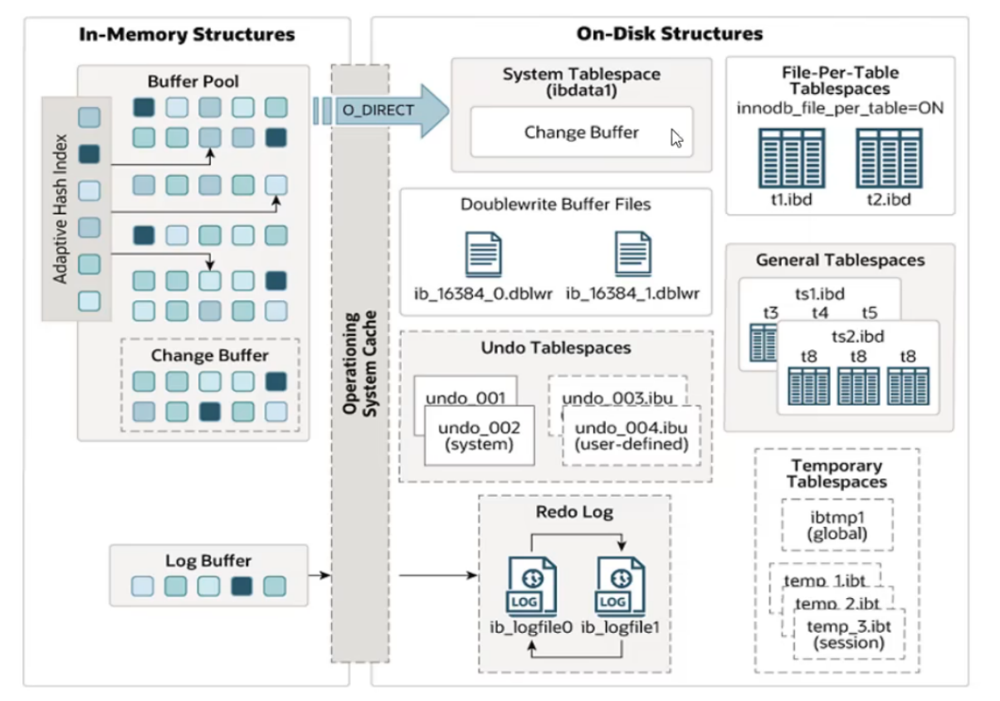

**2.1 内存架构**

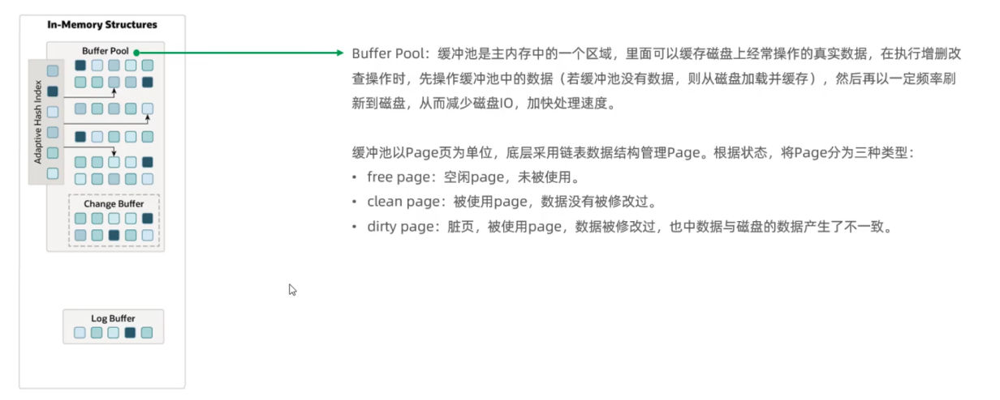

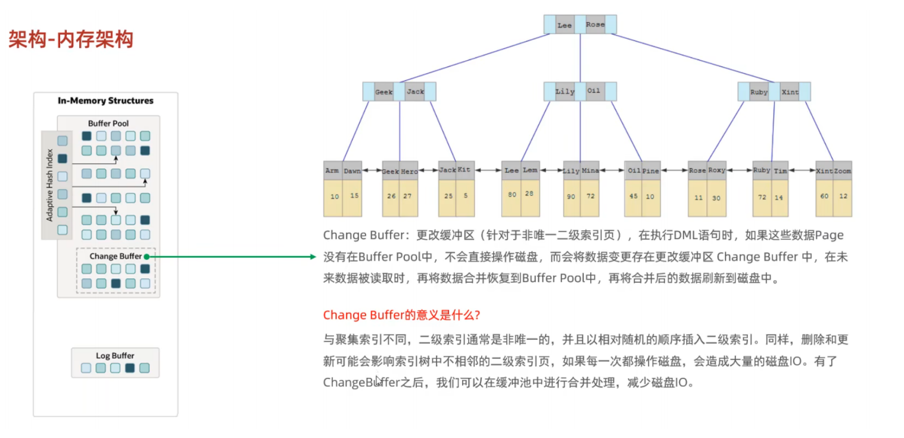

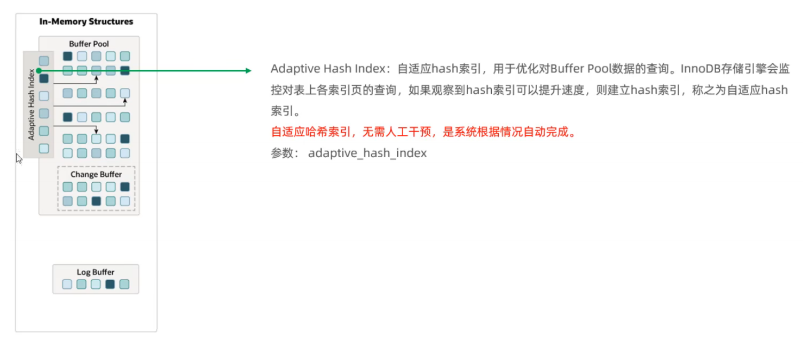

adaptive_hash_index：控制是否启用自适应哈希索引，ON表示开启，OFF表示关闭，默认值是ON；具体操作参考系统变量。

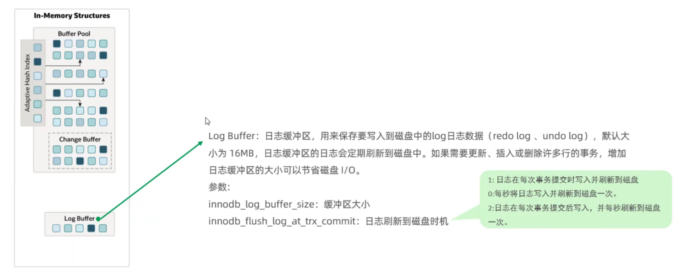

**2.2 磁盘结构**

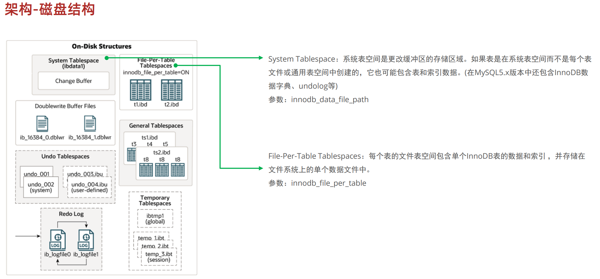

innodb_data_file_path：用于定义InnoDB的系统表空间（System Tablespace）的文件路径、大小和属性。

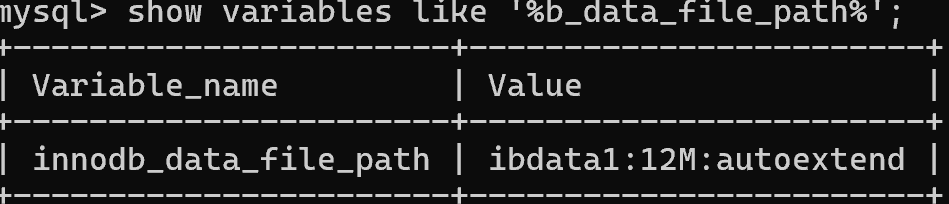

innodb_file_per_table：控制InnoDB是否为每个表创建独立的表空间文件，ON表示每个表都有自己的表空间文件，OFF表示所有表的数据和索引存储在系统表空间中，默认值是ON。

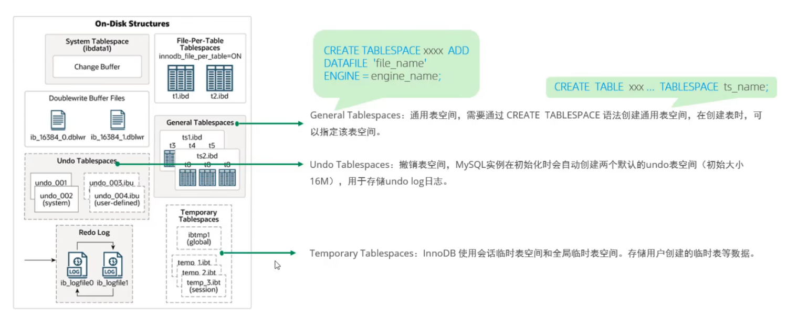

通用表空间：将多个表的数据存储在一个共享的文件中，方便管理和维护。

创建通用表空间文件

<table>
<colgroup>
<col style="width: 100%" />
</colgroup>
<tbody>
<tr class="odd">
<td>SQL 
CREATE TABLESPACE tablespace_name 
ADD DATAFILE 'file_name.ibd' 
[FILE_BLOCK_SIZE = value] 
[ENGINE [=] InnoDB]; 
 
tablespace_name：通用表空间的名称 
file_name.ibd：表空间文件的路径和名称，要确保指定的文件路径是MySQL可访问的，并且有足够的权限 
FILE_BLOCK_SIZE：可选参数，指定表空间的文件块大小（通常与表的页大小一致），必须与表的页大小一致（例如16K） 
ENGINE：指定存储引擎，默认为 InnoDB。</td>
</tr>
</tbody>
</table>

创建表时指定表空间

<table>
<colgroup>
<col style="width: 100%" />
</colgroup>
<tbody>
<tr class="odd">
<td>SQL 
CREATE TABLE ...[TABLESPACE tablespace_name]; 
 
tablespace_name：指定表存储的通用表空间名称</td>
</tr>
</tbody>
</table>

将现有表移动到通用表空间

<table>
<colgroup>
<col style="width: 100%" />
</colgroup>
<tbody>
<tr class="odd">
<td>SQL 
ALTER TABLE table_name TABLESPACE tablespace_name;</td>
</tr>
</tbody>
</table>

删除通用表空间

<table>
<colgroup>
<col style="width: 100%" />
</colgroup>
<tbody>
<tr class="odd">
<td>SQL 
DROP TABLESPACE tablespace_name;</td>
</tr>
</tbody>
</table>

**2.3 后台线程**

**3.事务原理**

特性原理分类图：

原子性通过undo log日志实现，持久性通过redo log日志实现，一致性通过undo log和redo log两个日志实现，隔离性通过锁和MVCC实现

**3.1 redo log**

重做日志，记录的是事务提交时数据页的物理修改，是用来实现事务的**持久性**。

该日志文件由两部分组成:重做日志缓冲(redo log buffer)以及重做日志文件(redo log file)，前者是在内存中，后者在磁盘中。当事务提交之后会把所有修改信息都存到该日志文件中,用于在刷新脏页到磁盘,发生错误时,进行数据恢复使用。

Buffer Pool在产生脏页数据的时候，会先将数据存储到 redo log buffer 再存储到 redo log 中进行磁盘持久化存储，在内存出现异常（比如突然断电）时，通过redo log中持久化的数据进行回滚。过程如下图：

当用户执行UPDATE或DELETE操作时，数据页会被加载到内存的Buffer Pool中进行修改，同时生成Redo Log记录并暂存于Redo Log Buffer中。事务提交时，Redo Log Buffer中的日志会先写入磁盘的Redo Log文件（ib_logfile0/1），确保事务的持久性，而数据页的修改则通过后台线程异步刷入磁盘的表空间文件（.ibd）。这种WAL机制保证了即使系统崩溃，也能通过Redo Log恢复未刷盘的数据变更，从而确保数据的一致性和持久性。

问题：数据为什么要通过redolog写入ibd表空间文件，而不是直接从Buffer Pool直接刷新到磁盘ibd文件？

答：Buffer Pool 刷盘是**随机写**：数据页在磁盘上的位置是分散的、随机的，每次刷盘都需要寻址，性能较低。Redo Log 是**顺序写**：每次写入都是追加到日志文件的末尾，性能非常高。

**3.2 undo log**

回滚日志，用于记录数据被修改前的信息，作用包含：提供回滚 和 MVCC(多版本并发控制)。

undo log 和 redo log 记录物理日志不一样，它是逻辑日志。可以认为当 delete 一条记录时，undo log中会记录一条对应的insert记录，反之亦然，当 update 一条记录时，它记录一条对应相反的 update 记录。当执行 rollback 时，就可以从 undo log 中的逻辑记录读取到相应的内容并进行回滚。

Undo log 销毁：undo log 在事务执行时产生，事务提交时，并不会立即删除undol0g，因为这些日志可能还用于 MVCC

Undo log 存储：undo log 采用段的方式进行管理和记录，存放在前面介绍的 rollback segment 回滚段中，内部包含1024个 undo log segment

**3.3 MVCC**

**3.3.1 基本概念**

**当前读**：读取的是记录的最新版本，读取时还要保证其他并发事务不能修改当前记录，会对读取的记录进行加锁。对于我们日常的操作，如:select…lock in share mode(共享锁)，select… for update、update、insert、delete(排他锁)都是一种当前读

**快照读**：简单的select(不加锁)就是快照读，快照读，读取的是记录数据的可见版本，有可能是历史数据，不加锁，是非阻塞读

Read committed：每次select，都生成一个快照读

Repeatable Read：开启事务后第一个select语句才是快照读的地方

Serializable：快照读会退化为当前读

**MVCC**：全称 Multi-Version Concurrency Control，多版本并发控制。指维护一个数据的多个版本，使得读写操作没有冲突，快照读为MySQL实现MVCC提供了一个非阻塞读功能。MVCC的具体实现，还需要依赖于数据库记录中的三个隐式字段、undo log日志、read View

**3.3.2 记录中的隐藏字段**

每一张创建的表都有两个或三个隐藏字段：DB_TRX_ID、DB_ROOL_PRT、DB_ROW_ID（表没有主键时存在）

**3.3.3 undo log**

回滚日志，在insert、update、delete的时候产生的便于数据回滚的日志。

当insert的时候，产生的undoloq日志只在回滚时需要，在事务提交后，可被立即删除。

当update、delete的时候，产生的undo log日志不仅在回滚时需要，在快照读时也需要，不会立即被删除。

那么何时删除？

当所有依赖于该undo log的快照读取操作结束后，undo log才会被删除。这意味着如果有一个事务正在进行快照读取，并且依赖于某个undo log，那么这个undo log会一直保留直到该事务结束。

**undo log版本链**：

**3.3.4 readview**

ReadView(读视图)是 快照读 SQL执行时MVCC提取数据的依据，记录并维护系统当前活跃的事务(未提交的)id

ReadView中包含了四个核心字段：

|                |                                                      |
|----------------|------------------------------------------------------|
| 字段           | 含义                                                 |
| m_ids          | 当前活跃的事务ID集合                                 |
| min_trx_id     | 最小活跃事务ID                                       |
| max_trx_id     | 预分配事务ID，当前最大事务ID+1（因为事务ID是自增的） |
| creator_trx_id | ReadView创建者的事务ID                               |

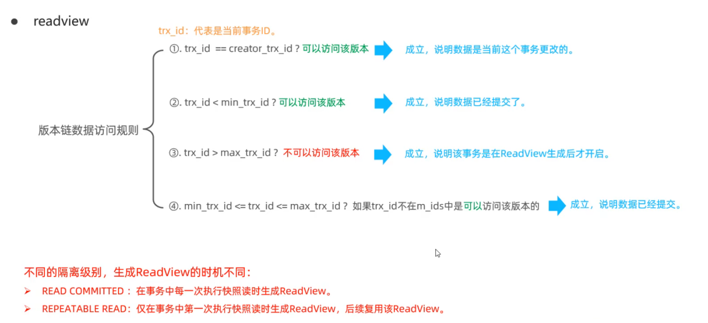

**READ COMMITTED**

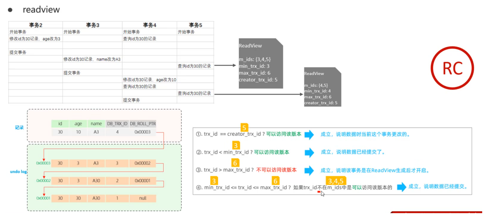

针对事务5的两条查询语句，第一条查询语句：记录一次ReadView读视图，拿着当前事务id即DB_TRX_ID=4根据版本链数据访问规则依次判断，判断到第4条发现trx_id=4在集合m_ids中，在链表结构找到下一个DB_TRX_ID=3，再次进行判断，发现3仍然在集合m_ids中，再次在链表结构找到下一个DB_TRX_ID=2，发现满足第2条规则，所以查询到0x00002指向的记录（id: 30, age: 3, name: A30）;

事务5的第二条查询语句重新记录一次ReadView读视图，然后根据新的ReadView读视图重新判断，直到找到满足版本链数据访问规则的一条版本记录为止，所以两次查询结果不一定一致

**REPEATBLE READ**

查询过程和READ COMMITTED相同，只是事务5的第二条查询语句不会重新生成ReadView读视图，会复用第一条查询语句的ReadView读视图，所以两次查询的结果一致

**十三、MySQL管理**

**1.系统数据库**

Mysql数据库安装完成后，自带了四个数据库，具体作用如下：

|                    |                                                                                         |
|--------------------|-----------------------------------------------------------------------------------------|
| 数据库             | 含义                                                                                    |
| mysql              | 存储MVSQL服务器正常运行所需要的各种信息(时区、主从、用户、权限等)                       |
| information_schema | 提供了访问数据库元数据的各种表和视图，包含数据库、表、字段类型及访问权限等              |
| performance_schema | 为MySQL服务器运行时状态提供了一个底层监控功能，主要用于收集数据库服务器性能参数         |
| sys                | 包含了一系列方便 DBA和开发人员利用 performance_schema性能数据库进行性能调优和诊断的视图 |

**2.常用工具**

**2.1 mysql**

该mysql不是指mysql服务，而是指mysql的客户端工具

<table>
<colgroup>
<col style="width: 100%" />
</colgroup>
<tbody>
<tr class="odd">
<td>Properties 
mysql [options] [database] 
 
options选项: 
-u[username]|--user=username : 指定用户名，如-uroot 
-p[password]|--password[=password] : 指定用户密码，如-p123456 
-h[host]|--host=host : 指定服务器IP或域名，如-h127.0.0.1 
-P[port]|--port=port : 指定连接端口（P为大写），如-P3306 
-e[execute]|execute=execute : 在客户端执行SQL语句并退出（无需进入mysql系统），但前面要跟上操作的数据库名，SQL用双引号包裹，如mysql -uroot -p123456 mysql -e"select * from user"</td>
</tr>
</tbody>
</table>

**2.2 mysqladmin**

mysqladmin是一个执行管理操作的客户端程序，可以用它来检查服务器的配置和当前运行状态，创建并删除数据库等

<table>
<colgroup>
<col style="width: 100%" />
</colgroup>
<tbody>
<tr class="odd">
<td>Properties 
## 通过帮助文档查看选项： 
mysqladmin --help 
 
示例选项: 
create dbname : 创建指定数据库，如mysqladmin -uroot -p123456 create text 
drop dbname : 删除指定数据库，如mysqladmin -uroot -p123456 drop text 
ping : 检查MySQL服务器是否正在运行，如mysqladmin -uroot -p123456 ping 
status : 查看服务器状态，如mysqladmin -uroot -p123456 status 
shutdown : 关闭MySQL服务器，如mysqladmin -uroot -p123456 shutdown</td>
</tr>
</tbody>
</table>

**2.3 mysqlbinlog**

由于服务器生成的二进制文件以二进制格式保存，所以如果想要检查这些文本的文本格式，就会使用到mysqlbinlog日志管理工具（需要管理员身份）

<table>
<colgroup>
<col style="width: 100%" />
</colgroup>
<tbody>
<tr class="odd">
<td>Properties 
mysqlbinlog [options] log-files1 log-files2 ... 
 
mysqlbinlog log-file 
 
options选项: 
-d dbname|--database=dbname : 指定数据库名称，只列出指定的数据库相关操作，如mysqlbinlog -d mysql binlog.000001 
-o n|--offset=n : 忽略日志中的前n行数据，如mysqlbinlog -o 10 binlog.000001 
-r filename|--result-file=filename : 将输出的文本日志格式写到目标文件filename中,filename可以用绝对路径，如 
mysqlbinlog -s binlog.000001 -r "F:\login.000001" 
-s|--short-form : 让输出内容更简洁，只输出必要的信息，如mysqlbinlog -s mysql binlog.000001 
--start-datetime : 读取指定开始时间之后的事件，如mysqlbinlog --start-datetime="2025-03-18 10:00:00" binlog.000001 
--stop-datetime : 读取指定结束时间之前的时间，如mysqlbinlog --stop-datetime="2025-03-18 12:00:00" binlog.000001 
--start-position : 指定从二进制日志的哪个位置开始读取事件,如mysqlbinlog --start-position=100 binlog.000001 
--stop-position : 指定读取二进制日志时的结束位置，如mysqlbinlog --stop-position=200 binlog.000001</td>
</tr>
</tbody>
</table>

在使用mysqlbinlog之前，需要先定位到binlog.000001所在文件夹，否则后面的使用要用到绝对路径或相对路径

**2.4 mysqlshow**

客户端对象查找工具，用来很快地查看存在哪些数据库、数据库中的表、表中的列和或者索引

<table>
<colgroup>
<col style="width: 100%" />
</colgroup>
<tbody>
<tr class="odd">
<td>Properties 
mysqlshow [options] [db_name [table_name [col_name]]] 
 
options选项: 
--count : 显示数据库及表的统计信息（数据库、表均可以不指定） 
-i : 显示指定数据库或者指定表的状态信息 
 
示例: 
## 查询每个数据库的表的数量及表中记录的数量 
mysqlshow -uroot -p123456 --count 
## 查询mysql库中每个表中的字段数及行数 
mysqlshow -uroot -p123456 mysql --count 
## 查询mysql库中user表的详细信息 
mysqlshow -uroot -p123456 mysql user --count</td>
</tr>
</tbody>
</table>

**2.5 mysqldump**

mysqldump客户端工具用来备份数据库或在不同数据库之间进行数据迁移。备份内容包含创建表、及插入表的SQL语句

<table>
<colgroup>
<col style="width: 100%" />
</colgroup>
<tbody>
<tr class="odd">
<td>Properties 
## 目标文件filename.sql可以用绝对路径或相对路径 
mysqldump [options] db_name[tables] &gt; filename.sql ##备份指定数据库中的部分或全部表到目标文件 
mysqldump [options] --database|-B db1 [db2 db3 ...] &gt; filename.sql ##备份多个指定的数据库到目标文件 
mysqldump [options] --all-databases|-A &gt; filename.sql ##备份 MySQL 服务器上的所有数据库到目标文件 
 
options连接选项: 
-u[username]|--user=username : 指定用户名 
-p[password]|--password[=password] : 指定用户密码，如-p123456 
-h[host]|--host=host : 指定服务器IP或域名，如-h127.0.0.1 
-P[port]|--port=port : 指定连接端口（P为大写），如-P3306 
 
options输出选项: 
--add-drop-database : 在每个数据库创建语句前加上drop database语句 
--add-drop-table : 在每个表创建语句前加上drop table语句，默认开启，不开启（--skip-add-drop-table） 
-n|--no-create-db : 不包含数据库的创建语句 
-t|--no-create-info : 不包含数据表的创建语句 
-d|--no-data : 不包含数据 
-T filename|--tab[=filename] : 自动生成两个文件，一个.sql文件，创建表结构的语句，一个.txt文件，数据文件,例如： 
## 拷贝mysql数据库下的user表 
mysqldump -u root -p --tab=/path/to/export/directory mysql user 或 
mysqldump -u root -p -T /path/to/export/directory mysql user</td>
</tr>
</tbody>
</table>

**-T filename\|--tab\[=filename\]参数**：

生成的两个文件文件名和表名一致

filename指文件存放路径，可以是绝对路径，也可以是相对路径，如果当前已定位到指定路径，可以不指定filename

-T后必须跟filename，而--tab后可以不跟filename

**2.6 mysqlimport/source**

mysqlimport是客户端数据导入工具，用来导入mysqldump加-T参数后导出的文本文件

<table>
<colgroup>
<col style="width: 100%" />
</colgroup>
<tbody>
<tr class="odd">
<td>Properties 
mysqlimport [options] db_name textfile1 [textfile2 ...] 
 
示例：mysqlimport -uroot -p text /tmp/city.txt</td>
</tr>
</tbody>
</table>

如果需要导入sql文件，可以使用mysql中的source命令

<table>
<colgroup>
<col style="width: 100%" />
</colgroup>
<tbody>
<tr class="odd">
<td>Properties 
## filename.sql可以使用路径 
source filename.sql;</td>
</tr>
</tbody>
</table>

**十四、日志**

**1.错误日志**

错误日志是 MySQL 中最重要的日志之一，它记录了当 mysqld 启动和停止时，以及服务器在运行过程中发生任何严重错误时的相关信息，当数据库出现任何故障导致无法正常使用时，建议首先查看此日志。

该日志是默认开启的，默认存放目录 /var/log/，默认的日志文件名为 mysqld.log 。

查看日志位置：

<table>
<colgroup>
<col style="width: 100%" />
</colgroup>
<tbody>
<tr class="odd">
<td>SQL 
show variables like '%log_error%'; -- log_error</td>
</tr>
</tbody>
</table>

**2.二进制日志**

**2.1 介绍**

二进制日志(BINLOG)记录了所有的 DDL(数据定义语言)语句和 DML(数据操纵语言)语句，但不包括数据查询(SELECT、SHOW)语句。

作用：

灾难时的数据恢复

MySQL的主从复制

在MVSOL8版本中，默认二进制日志是开启着的，涉及到的参数如下：

<table>
<colgroup>
<col style="width: 100%" />
</colgroup>
<tbody>
<tr class="odd">
<td>SQL 
show variables like '%log_bin%' -- log_bin</td>
</tr>
</tbody>
</table>

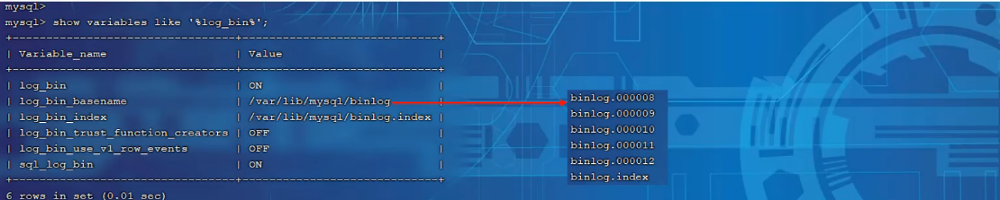

**2.2 日志格式**

MySQL服务器中提供了多种格式来记录二进制记录，具体格式及特点如下：

|           |                                                                                            |
|-----------|--------------------------------------------------------------------------------------------|
| 日志格式  | 含义                                                                                       |
| statement | 基于SQL语句的日志记录，记录的是SQL语句，对数据进行修改的SQL都会记录在日志文件中。          |
| row       | 基于行的日志记录，记录的是每一行的数据变更。(默认)                                         |
| mined     | 混合了STATEMENT和ROW两种格式，默认采用STATEMENT，在某些特殊情况下会自动切换为ROW进行记录。 |

查看参数方式

<table>
<colgroup>
<col style="width: 100%" />
</colgroup>
<tbody>
<tr class="odd">
<td>SQL 
show variables like '%binlog_format%'; -- binlog_format</td>
</tr>
</tbody>
</table>

修改参数

<table>
<colgroup>
<col style="width: 100%" />
</colgroup>
<tbody>
<tr class="odd">
<td>SQL 
set binlog_format = statement|row|mined;</td>
</tr>
</tbody>
</table>

**2.3 日志查看**

由于日志是以二进制方式存储的，不能直接读取，需要通过二进制日志查询工具 mysqlbinlog 来查看。

<table>
<colgroup>
<col style="width: 100%" />
</colgroup>
<tbody>
<tr class="odd">
<td>Properties 
mysqlbinlog [参数选项] logfilename 
 
参数选项： 
-d 指定数据库名称，只列出指定的数据库相关的操作。 
-o 忽略掉日志中的前n行命令。 
-v 将行事件(数据变更)重构为SOL语句。 
-w 将行事件(数据变更)重构为SQL语句，并输出注释信息</td>
</tr>
</tbody>
</table>

**2.4 日志删除**

对于比较繁忙的业务系统，每天生成的binlog数据巨大，如果长时间不清除，将会占用大量磁盘空间。可以通过以下几种方式清理日志：

|                                                   |                                                                    |
|---------------------------------------------------|--------------------------------------------------------------------|
| 指令                                              | 含义                                                               |
| reset master;                                     | 删除全部 binlog 日志，删除之后，日志编号将从 binlog.000001重新开始 |
| purge master logs to 'binlog.\*\*\*';             | 删除 \*\*\* 编号之前的所有日志                                     |
| purge master logs before 'yyyy-mm-dd hh24:mi:ss'; | 删除日志为”yyyy-mm-dd hh24:mi:ss”之前产生的所有日志                |

也可以在mysql的配置文件中配置二进制日志的过期时间，设置了之后，二进制日志过期会自动删除.

<table>
<colgroup>
<col style="width: 100%" />
</colgroup>
<tbody>
<tr class="odd">
<td>SQL 
show variables like '%binlog_expire_logs_seconds%'; -- binlog_expire_logs_seconds</td>
</tr>
</tbody>
</table>

设置过期时间

<table>
<colgroup>
<col style="width: 100%" />
</colgroup>
<tbody>
<tr class="odd">
<td>SQL 
set global binlog_expire_logs_seconds = seconds;</td>
</tr>
</tbody>
</table>

**3.查询日志**

查询日志中记录了客户端的所有操作语句，而二进制日志不包含查询数据的SQL语句。默认情况下，查询日志是未开启的。如果需要开启查询日志，可以设置一下配置：

修改MySQL的配置文件my.cnf或my.ini 文件，添加如下内容：

<table>
<colgroup>
<col style="width: 100%" />
</colgroup>
<tbody>
<tr class="odd">
<td>Properties 
#该选项用来开启查询日志，可选值：0或者1；0代表关闭，1代表开启 
general_log=1 
#设置日志的文件名，如果没有指定，默认的文件名为 host_name.log 
general_log_file=mysql_query.log</td>
</tr>
</tbody>
</table>

**4.慢查询日志**

慢查询日志记录了所有执行时间超过参数 long_query_time 设置值并且扫描记录数不小于 min_examined_row_limit 的所有的SQL语句的日志，默认未开启。long_query_time 默认为 10 秒，最小为0，精度可以到微秒。

<table>
<colgroup>
<col style="width: 100%" />
</colgroup>
<tbody>
<tr class="odd">
<td>Properties 
#慢查询日志 
slow_query_log=1 
#执行时间参数 
long_query_time=2</td>
</tr>
</tbody>
</table>

默认情况下，不会记录管理语句，也不会记录不使用索引进行查找的查询。可以使用log_slow_admin_statements和更改此行为log_queries_not_using_indexes

<table>
<colgroup>
<col style="width: 100%" />
</colgroup>
<tbody>
<tr class="odd">
<td>Properties 
#记录执行较慢的管理语句 
log_slow_admin_statements = 1 
#记录执行较慢的未使用索引的语句 
log_queries_not_using_indexes = 1</td>
</tr>
</tbody>
</table>

**十五、主从复制**

**1.概述**

主从复制是指将主数据库的DDL 和 DML 操作通过二进制日志传到从库服务器中，然后在从库上对这些日志重新执行（也叫重做），从而 使得从库和主库的数据保持同步。

MySQL支持一台主库同时向多台从库进行复制， 从库同时也可以作为其他从服务器的主库，实现链状复制。

MySQL 复制的主要特点包含以下三个方面：

主库出现问题，可以快速切换到从库提供服务

实现读写分离，降低主库的访问压力

可以在从库中执行备份，以避免备份期间影响主库服务

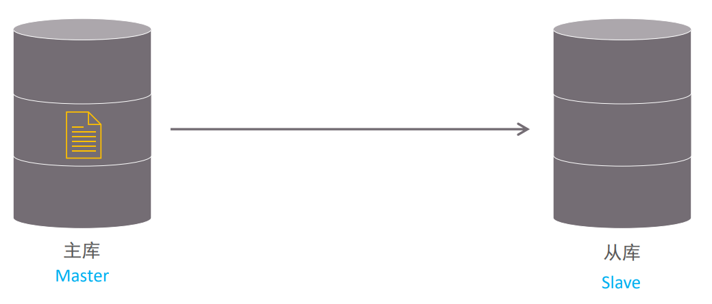

**2.原理**

MySQL主从复制原理：

从上图来看，复制分成三步：

Master 主库在事务提交时，会把数据变更记录在二进制日志文件 Binlog（记录原始 SQL 语句 ）中

从库的IO线程读取主库的二进制日志文件 Binlog ，写入到从库的中继日志 Relay Log

slave的SQL线程重做中继日志中的事件，即读取中继日志中的 SQL 语句并执行，将改变反映它自己的数据

**3.搭建实现**

**3.1 主库配置**

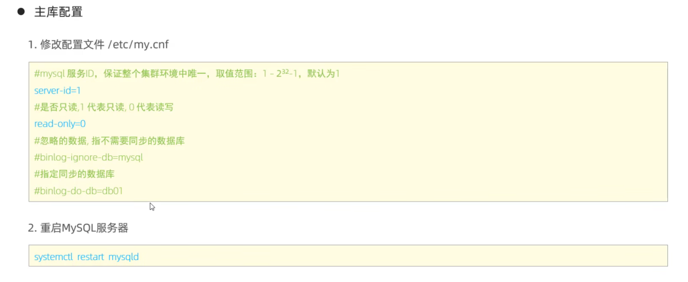

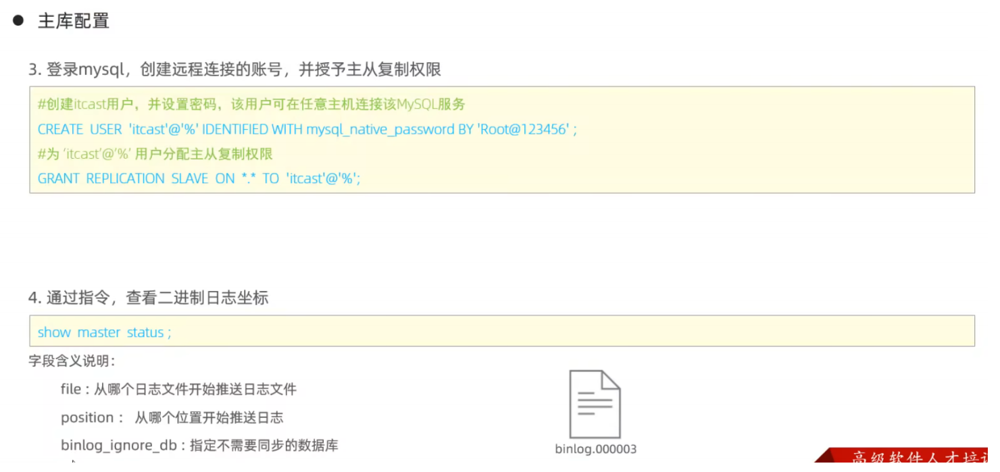

**3.2 从库配置**

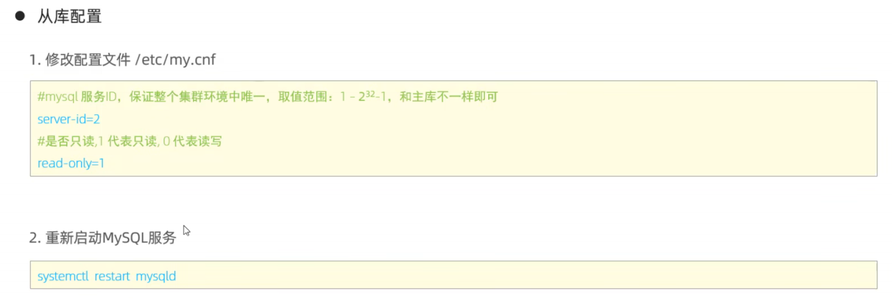

设置read_only=1后，超级管理员不是只读，如果想要让超级管理员也是只读，就需要额外配置super_read_only=1

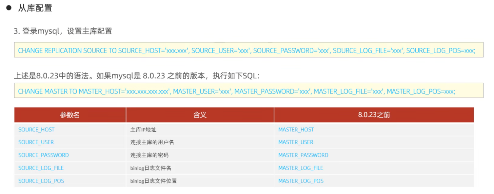

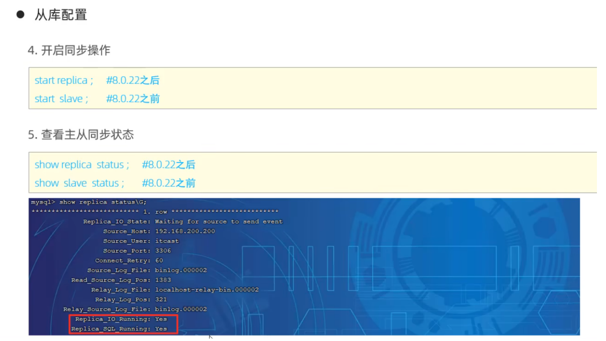

当Replica_IO_Running和Replica_SQL_Running都显示Yes时才表示配置正常，否则检查重新配置

**4.测试**

在主库上创建数据库、表，并插入数据

<table>
<colgroup>
<col style="width: 100%" />
</colgroup>
<tbody>
<tr class="odd">
<td>SQL 
create database db01; 
use db01; 
create table tb_use( 
id int(11) primary key not null auto_increment, 
name varchar(50) not null, 
sex varchar(1) 
)engine=innodb default charset=utf8mb4; 
insert into tb_user(id, name, sex) valurs (null, 'Tom', '1'), (null, 'Trigger', '0'), (null, 'Dawn', '1');</td>
</tr>
</tbody>
</table>

在从库中查询数据，验证主从是否同步

**十六、分库分表**

**1.介绍**

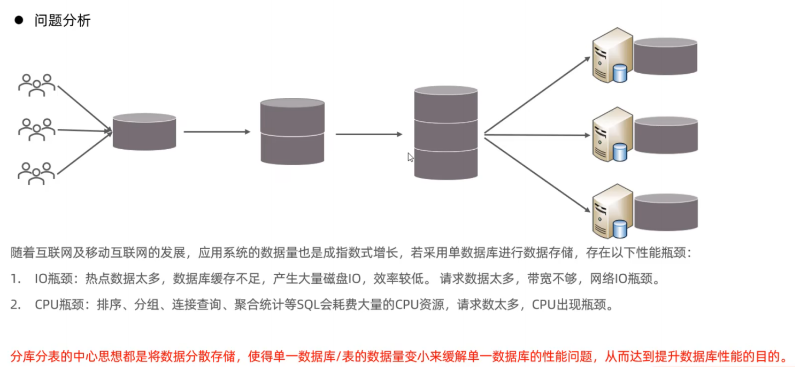

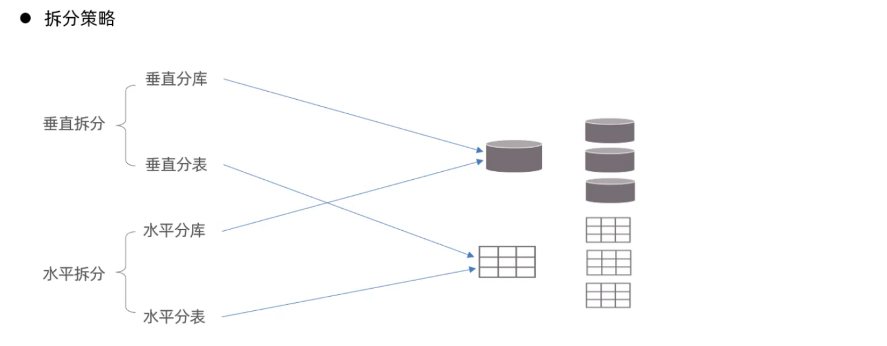

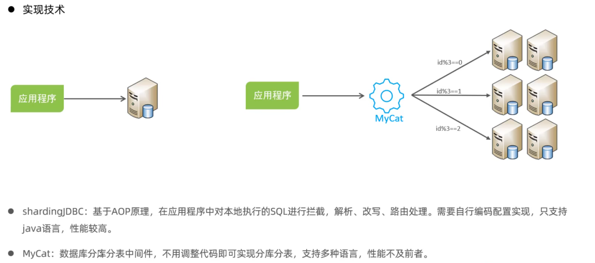

**2.Mycat概述**

Mycat是开源的、活跃的、基于Java语言编写的MySQL**数据库中间件**。可以像使用mysql一样来使用mycat，对于开发人员来说根本感觉 不到mycat的存在。

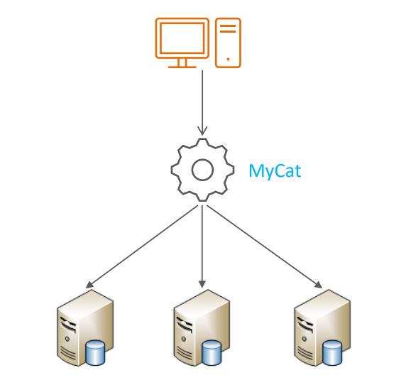

优势：

性能可靠稳定

强大的技术团队

体系完善

社区活跃

**2.1 安装**

Mycat是采用java语言开发的开源的数据库中间件，支持Windows和Linux运行环境，下面介绍MyCat的Linux中的环境搭建。我们需要在 准备好的服务器中安装如下软件：

MySQL

JDK

Mycat

|                 |            |                   |
|-----------------|------------|-------------------|
| 服务器          | 安装的软件 | 说明              |
| 192.168.200.210 | JDK、Mycat | Mycat中间件服务器 |
| 192.168.200.210 | MySQL      | 分片服务器        |
| 192.168.200.213 | MySQL      | 分片服务器        |
| 192.168.200.214 | MySQL      | 分片服务器        |

**\[MyCat安装文档.pdf\]**

**2.2 目录结构**

bin : 存放可执行文件，用于启动停止mycat

conf：存放mycat的配置文件

lib：存放mycat的项目依赖包（jar）

logs：存放mycat的日志文件

**2.3 概念介绍**

Mycat本身不直接存储数据，只负责管理数据请求的路由和分发，而实际的数据存储由后端数据库完成

**3.Mycat入门**

**3.1 需求**

以 tb_order 表为例：由于 tb_order 表中数据量很大，磁盘IO及容量都到达了瓶颈，现在需要对 tb_order 表进行数据分片，分为三个数据节点，每一个节点主机位于不同的服务器上。

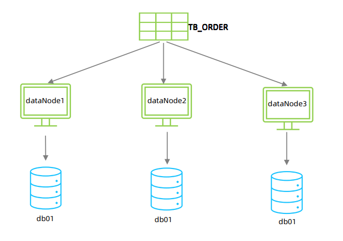

**3.2 环境准备**

关闭三台服务器的防火墙

分别在三台服务器里创建数据库（分库、库名要一致）

**3.3 分片配置**

**schema.xml**

**server.xml**

配置mycat的用户及用户的权限信息：

**3.4 启动服务**

切换到Mycat的安装目录，执行如下指令，启动Mycat：

<table>
<colgroup>
<col style="width: 100%" />
</colgroup>
<tbody>
<tr class="odd">
<td>PowerShell 
## 启动 
bin/mycat start 
## 停止 
bin/mycat stop</td>
</tr>
</tbody>
</table>

**Mycat启动之后，占用端口号 8066**

启动完毕之后，可以查看logs目录下的启动日志，查看Mycat是否启动完成

**3.5 分片测试**

通过如下指令，就可以连接并登陆MyCat：

<table>
<colgroup>
<col style="width: 100%" />
</colgroup>
<tbody>
<tr class="odd">
<td>PowerShell 
mysql -h 192.168.200.210 -P 8066 -uroot -p123456</td>
</tr>
</tbody>
</table>

然后就可以在MyCat中来创建表，并往表结构中插入数据，查看数据在MySQL中的分布情况

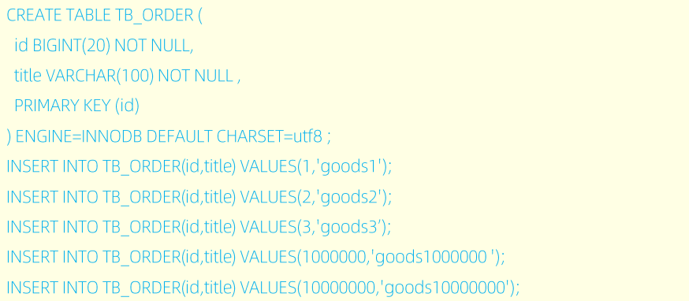

**4.Mycat配置**

**4.1 schema.xml**

schema.xml 作为MyCat中最重要的配置文件之一 , 涵盖了MyCat的逻辑库、逻辑表、分片规则、分片节点及数据源的配置

主要包含以下三组标签：

schema标签

datanode标签

datahost标签

**schema标签**

schema 标签用于定义 MyCat实例中的逻辑库 , 一个MyCat实例中, 可以有多个逻辑库 , 可以通过 schema 标签来划分不同的逻辑库。MyCat中的逻辑库的概念，等同于MySQL中的database概念 , 需要操作某个逻辑库下的表时, 也需要切换逻辑库(use xxx)。

**核心属性**：

name：指定自定义的逻辑库库名

checkSQLschema：在SQL语句操作时指定了数据库名称，执行时是否自动去除；true：自动去除，false：不自动去除

sqlMaxLimit：如果未指定limit进行查询，列表查询模式查询多少条记录

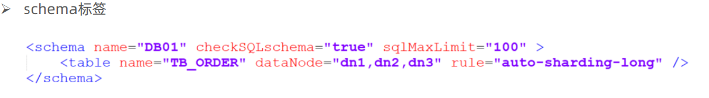

table 标签定义了MyCat中逻辑库schema下的逻辑表 , 所有需要拆分的表都需要在table标签中定义 。

**核心属性**：

name：定义逻辑表表名，在该逻辑库下唯一

dataNode：定义逻辑表所属的dataNode，该属性需要与dataNode标签中name对应；多个dataNode逗号分隔

rule：分片规则的名字，分片规则名字是在rule.xml中定义的

primaryKey：逻辑表对应真实表的主键

type：逻辑表的类型，目前逻辑表只有全局表和普通表，如果未配置，就是普通表；全局表，配置为 global

**dataNode标签**

dataNode标签中定义了MyCat中的数据节点, 也就是我们通常说的数据分片。一个dataNode标签就是一个独立的数据分片。

**核心属性**：

name：定义数据节点名

dataHost：数据库实例主机名称，引用自 dataHost 标签中name属性

database：定义分片所属数据库

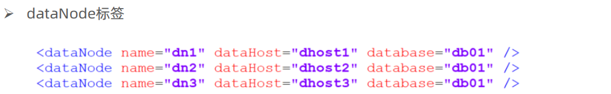

**dataHost标签**

该标签在MyCat逻辑库中作为底层标签存在, 直接定义了具体的数据库实例、读写分离、心跳语句。

**核心属性**：

name：唯一标识，供上层标签使用

maxCon/minCon：最大连接数/最小连接数

balance：负载均衡策略，取值 0,1,2,3

writeType：写操作分发方式（0：写操作转发到第一个writeHost，第一个挂了，切换到第二个；1：写操作随机分发到配置的writeHost）

dbDriver：数据库驱动，支持 native、jdbc

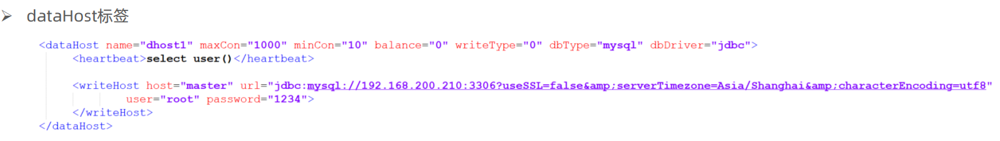

**4.2 rule.xml**

rule.xml中定义所有拆分表的规则, 在使用过程中可以灵活的使用分片算法, 或者对同一个分片算法使用不同的参数, 它让分片过程可配 置化。

主要包含两类标签：

tableRule

Function

**4.3 server.xml**

**\[server.xml\]**

server.xml配置文件包含了MyCat的系统配置信息。

主要有两个重要的标签：

system

user

**system标签**

对应的系统配置项及其含义，参考[server系统配置信息含义](https://mcnerzykwkel.feishu.cn/sheets/JkgNsdO9Ch7H7ft8J6scJCPAnAf?from=from_copylink)：

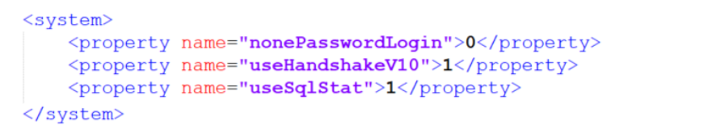

**user标签**

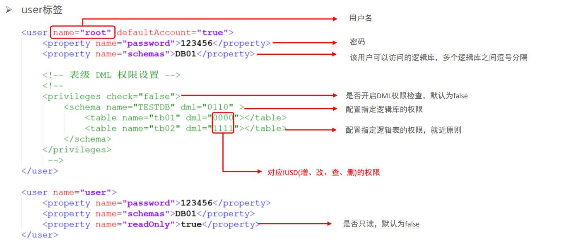

**5.Mycat分片**

**5.1 垂直拆分**

在业务系统中, 涉及以下表结构 ,但是由于用户与订单每天都会产生大量的数据, 单台服务器的数据存储及处理能力是有限的, 可以对数据 库表进行拆分, 原有的数据库表如下：

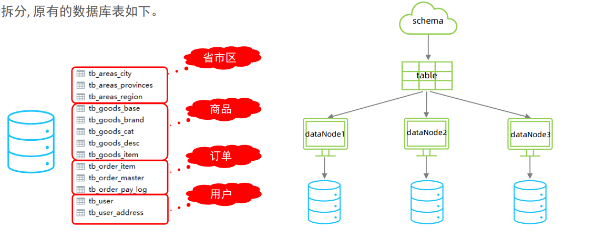

**5.1.1 准备**

分别在三台MySQL中创建数据库 shopping。

**5.1.2 配置**

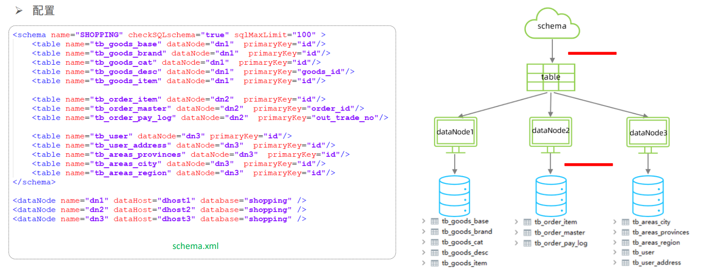

**5.1.3 测试**

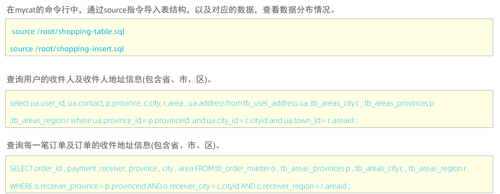

**全局表配置**：对于第二个查询语句，省、市、区/县表tb_areas_provinces , tb_areas_city , tb_areas_region，是属于数据字典表，只能在本子数据库中可以使用，但是在多个业务模块中都可能会遇到，可以将其设置为全局表，利于业务操作：

**5.2 水平拆分**

在业务系统中, 有一张表(日志表), 业务系统每天都会产生大量的日志数据 , 单台服务器的数据存储及处理能力是有限的, 可以对数据库表 进行拆分。

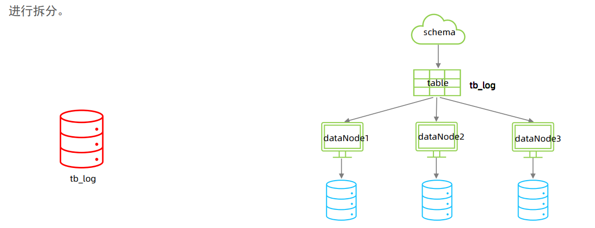

**5.2.1 准备**

分别在三台MySQL中创建数据库 itcast。

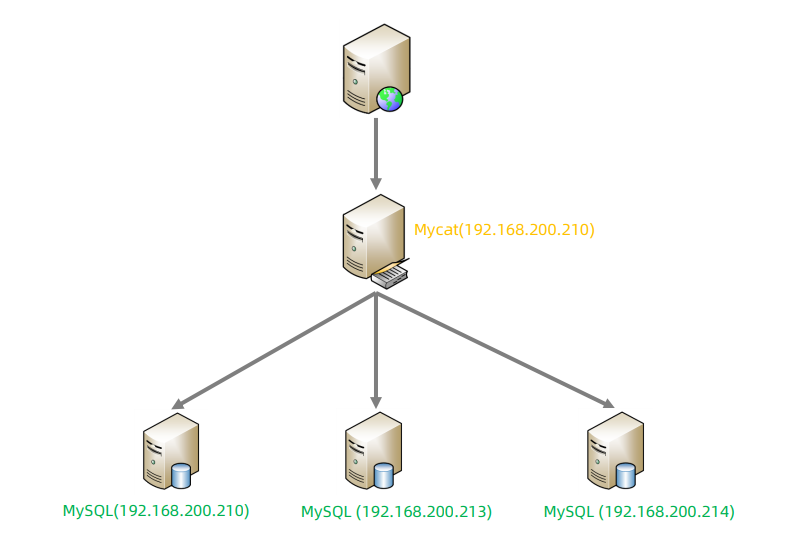

**5.2.2 配置**

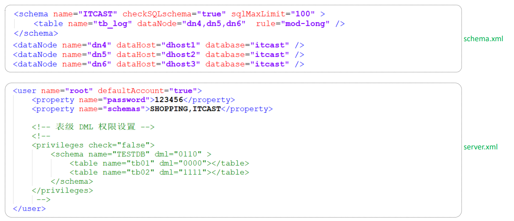

**5.2.3 测试**

在Mycat中创建表、插入数据后分表会自动创建和插入相应的数据，不需要像垂直分表那样手动创建表

**5.3 分片规则**

**5.3.1 分片规则-范围**

根据指定的字段及其配置的范围与数据节点的对应情况， 来决定该数据属于哪一个分片。

**5.3.2 分片规则-取模**

根据指定的字段值与节点数量进行求模运算，根据运算结果， 来决定该数据属于哪一个分片。

范围分片和取模分片只适用于数字，其他如字符串就不适用了

**5.3.3 分片规则-一致性hash**

所谓一致性哈希， 相同的哈希因子计算值总是被划分到相同的分区表中，不会因为分区节点的增加而改变原来数据的分区位置。

**5.3.4 分片规则-枚举**

通过在配置文件中配置可能的枚举值, 指定数据分布到不同数据节点上, 本规则适用于按照身份、性别、状态拆分数据等业务 。

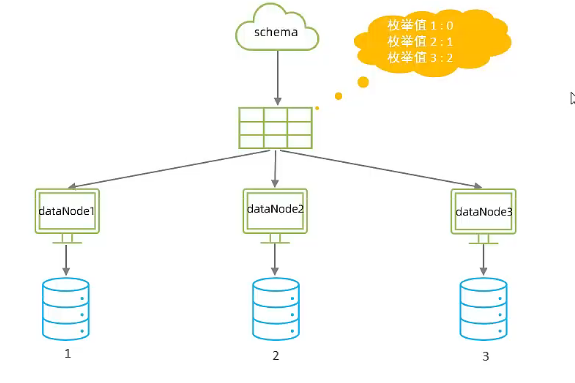

**5.3.5 分片规则-应用指定**

运行阶段由应用自主决定路由到那个分片 , 直接根据字符子串（必须是数字）计算分片号。

**5.3.6 分片规则-固定分片hash算法**

该算法类似于十进制的求模运算，但是为二进制的操作，例如，取 id 的二进制低 10 位 与 1111111111 进行位 & 运算。

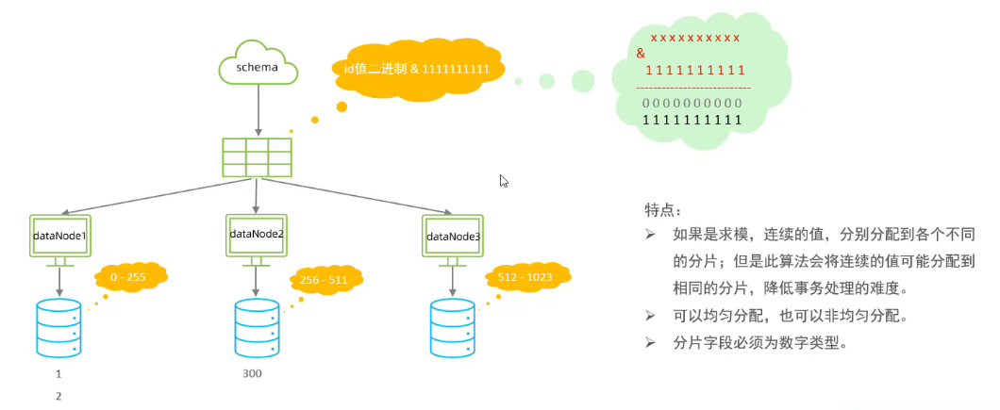

**5.3.7 分片规则-字符串hash解析**

截取字符串中的指定位置的子字符串, 进行hash算法， 算出分片。

**5.3.8 分片规则-按（天）日期分片**

**5.3.9 分片规则-自然月**

使用场景为按照月份来分片, 每个自然月为一个分片。

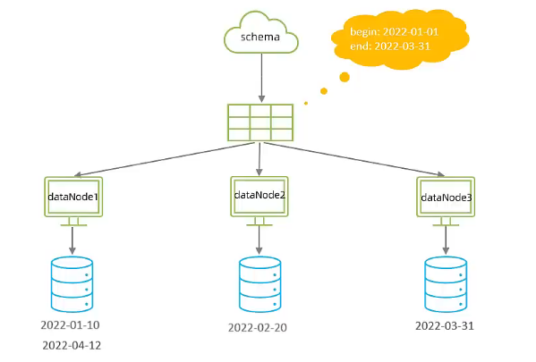

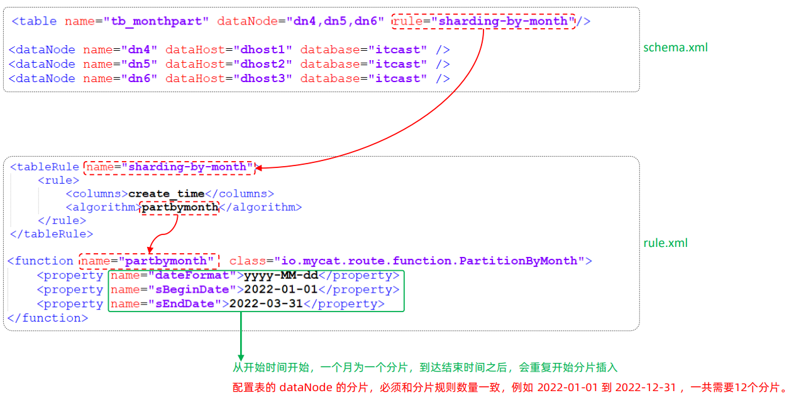

**6.Mycat管理及监控**

**6.1 Mycat原理**

Mycat从客户端接收到信息后，会先进行SQL语句解析，进行分片分析和路由分析，根据分片规则将 SQL 路由到相应的数据库节点，Mycat 支持读写分离，将写操作发往主库，读操作发往从库，服务器处理运行Mycat路由过来的SQL后，将运行结果返回给Mycat，Mycat从各节点获取数据后，在中间件层进行结果合并和聚合处理，如果SQL语句有排序操作和分页操作，会对聚合后的数据进行排序处理和分页处理，最后把最终结果返回给客户端。

**6.2 Mycat管理**

Mycat默认开通2个端口，可以在[server.xml](https://mcnerzykwkel.feishu.cn/file/HV1Lb4yr5ojkhfxzctkcYyihnzd?from=from_copylink)中进行修改：

8066 数据访问端口，即进行 DML 和 DDL 操作

9066 数据库管理端口，即 mycat 服务管理控制功能，用于管理mycat的整个集群状态

<table>
<colgroup>
<col style="width: 100%" />
</colgroup>
<tbody>
<tr class="odd">
<td>PowerShell 
mysql -h 192.168.200.210 -P 9066 -uroot -p123456</td>
</tr>
</tbody>
</table>

|                   |                             |
|-------------------|-----------------------------|
| 命令              | 含义                        |
| show @@help       | 查看Mycat管理工具帮助文档   |
| show @@version    | 查看Mycat的版本             |
| show @@config     | 重新加载Mycat的配置文件     |
| show @@datasource | 查看Mycat的数据源信息       |
| show @@datanode   | 查看Mycat现有的分片节点信息 |
| show @@threadpool | 查看Mycat的线程池信息       |
| show @@sql        | 查看执行的SQL               |
| show @@sql.sum    | 查看执行的SQL统计           |

**6.3 Mycat-eye**

Mycat-web（Mycat-eye）是对mycat-server提供监控服务，功能不局限于对mycat-server使用。他通过JDBC连接对Mycat、Mysql监控，监控远程服务器（目前仅限于linux系统）的cpu、内存、网络、磁盘。

Mycat-eye运行过程中需要依赖zookeeper，因此需要先安装zookeeper。

安装：Zookeeper安装和MyCat-web安装

**\[MyCat-web安装文档.pdf\]**

访问：http://192.168.200.210:8082/mycat

配置：

**十七、读写分离**

**1.介绍**

主从复制在进行数据库操作时，客户端服务器会先判断目前操作是读还是写，再决定是分配到哪个服务器，压力较大。

读写分离,简单地说就是把对数据库的读和写操作分开,以对应不同的数据库服务器。主数据库提供写操作，从数据库提供读操作，这样能有效地减轻单台数据库的压力。

通过MyCat即可轻易实现上述功能，不仅可以支持MySQL，也可以支持Oracle和SQL Server。

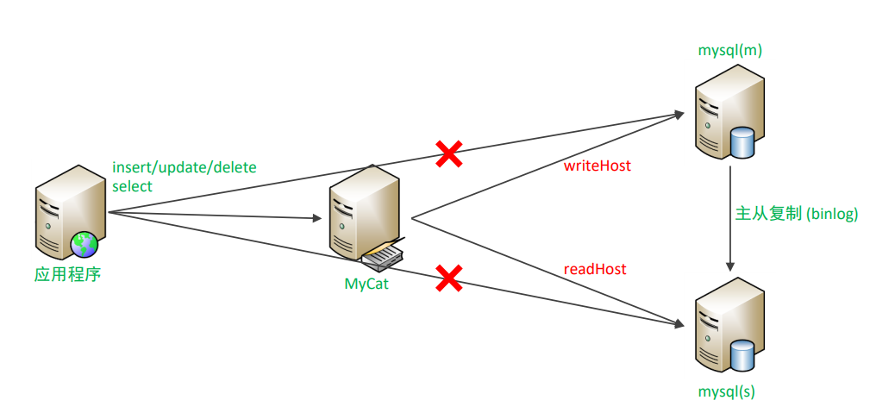

**2.一主一从**

MySQL的主从复制，是基于二进制日志（binlog）实现的。

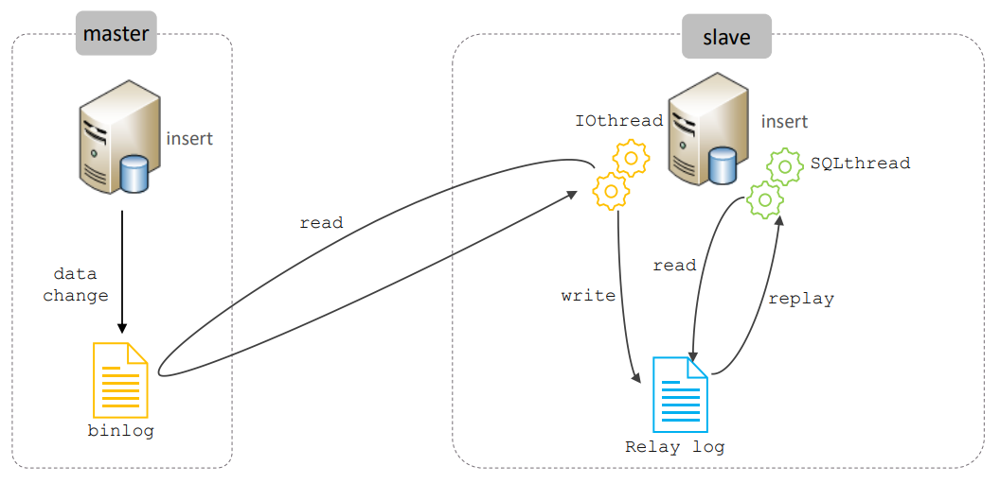

**环境准备**：

|                 |        |        |      |
|-----------------|--------|--------|------|
| 主机            | 角色   | 用户名 | 密码 |
| 192.168.200.211 | master | root   | 1234 |
| 192.168.200.212 | slave  | root   | 1234 |

主从复制的搭建，可以参考[十五、主从复制](https://mcnerzykwkel.feishu.cn/wiki/I8Tyw4doGimwFhkQ9imc02kfnVd?fromScene=spaceOverview#share-DXSRdYUp0ovDPMxDwwEcaO5unOg)

**3.一主一从读写分离**

**3.1 配置**

MyCat控制后台数据库的读写分离和负载均衡由schema.xml文件datahost标签的balance属性控制。

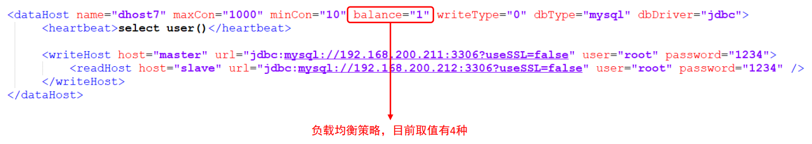

|        |                                                                                      |
|--------|--------------------------------------------------------------------------------------|
| 参数值 | 含义                                                                                 |
| 0      | 不开启读写分离机制 所有读操作都发送到当前可用的writeHost上                           |
| 1      | 全部的readHost与writeHost备用的 都参与select语句的负载均衡（主要针对于双主双从模式） |
| 2      | 所有的读写操作都随机在writeHost、readHost上分发                                      |
| 3      | 所有的读请求随机分发到writeHost对应的readHost上执行，writeHost不负担读压力           |

**3.2 测试**

连接Mycat，并在Mycat中执行DML、DQL查看是否能够进行读写分离。

主节点Master宕机之后，业务系统就只能够读，而不能写入数据了，可以通过双主双从

**4.双主双从**

一个主机 Master1 用于处理所有写请求，它的从机 Slave1 和另一台主机 Master2 还有它的从机 Slave2 负责所有读请求。当 Master1 主机宕机后，Master2 主机负责写请求，Master1 、Master2 互为备机：

**4.1 准备工作**

我们需要准备5台服务器，具体的服务器及软件安装情况如下：

|      |                 |              |                   |
|------|-----------------|--------------|-------------------|
| 编号 | IP              | 安装软件     | 角色              |
| 1    | 192.168.200.210 | Mycat、MySQL | Mycat中间件服务器 |
| 2    | 192.168.200.211 | MySQL        | M1                |
| 3    | 192.168.200.212 | MySQL        | S1                |
| 4    | 192.168.200.213 | MySQL        | M2                |
| 5    | 192.168.200.214 | MySQL        | S2                |

关闭以上所有服务器的防火墙：

systemctl stop firewalld

systemctl disable firewalld

**4.2 主库配置（ Master1-192.168.200.211 ）**

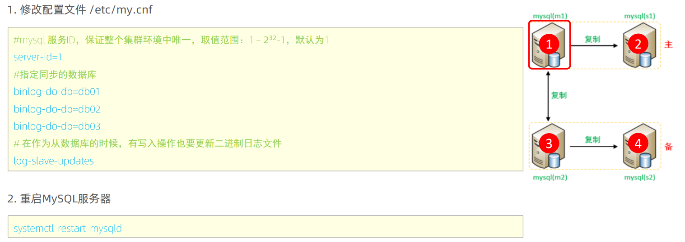

**4.3 主库配置（ Master2-192.168.200.213 ）**

**4.4 两台主库创建账户并授权**

**4.5 从库配置（ Slave1-192.168.200.212 ）**

**4.6 从库配置（ Slave2-192.168.200.214 ）**

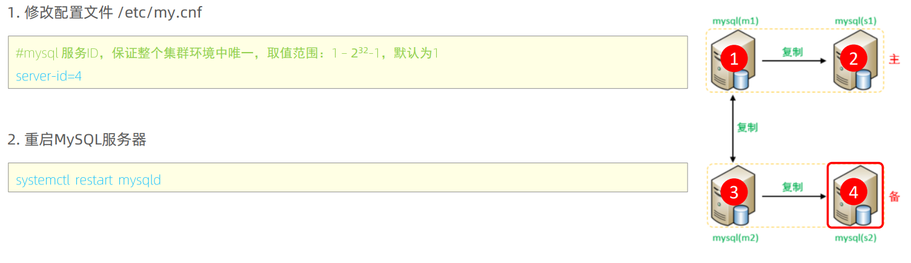

**4.7 两台从库配置关联的主库**

MASTER_HOST跟从库所关联的主库IP，MASTER_USER跟用户名，MASTER_PASSWORD跟用户密码，MASTER_LOG_FILE和MASTER_LOG_POS可以在对应主库中通过show master status获得

两台从库 2 和 4 都要配置

**4.8 两台主库相互复制**

**4.9 测试**

分别在两台主库Master1、Master2上执行DDL、DML语句，查看涉及到的数据库服务器的数据同步情况

<table>
<colgroup>
<col style="width: 100%" />
</colgroup>
<tbody>
<tr class="odd">
<td>SQL 
create database db01; 
use db01; 
create table tb_user( 
id in(11)not null primary key, 
name varchar(50) not null, 
sex varcahr(1) 
)engine=innodb default charset=utf8mb4 
 
insert into tb user(id,name,sex) values(l,'Tom','1'); 
insert into tb user(id,name,sex) values(2,'Trigger','0'); 
insert into tb user(id,name,sex) values(3,'Dawn','1'); 
insert into tb user(id,name,sex) values(4,"ack Ma','1'); 
insertinto tb user(id,name,sex) values(5,'Coco','0'); 
insert into tb user(id,name,sex) values(6,'erry','1');</td>
</tr>
</tbody>
</table>

**5.双主双从读写分离**

**5.1 配置**

MyCat控制后台数据库的读写分离和负载均衡由schema.xml文件datahost标签的balance属性控制，通过writeType及switchType来完成失败自动切换。

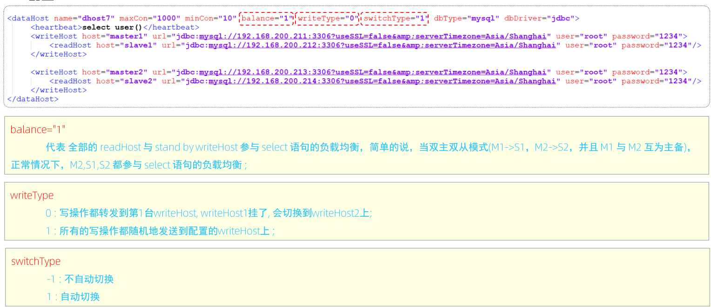

**5.2 测试**

登录MyCat，测试查询及更新操作，判定是否能够进行读写分离，以及读写分离的策略是否正确。

查询时，从哪个服务器查询时随机的，插入时，默认插入到master1当中，然后同步到其他三台服务器

当主库挂掉一个之后，是否能够自动切换。

**十八、补充内容**

**1.权限一览表**

具体权限的作用详见[官方文档](https://dev.mysql.com/doc/refman/8.0/en/privileges-provided.html)。

GRANT 和 REVOKE 允许的静态权限

|                                                                                                                          |                              |                                       |
|--------------------------------------------------------------------------------------------------------------------------|------------------------------|---------------------------------------|
| Privilege                                                                                                                | Grant Table Column           | Context                               |
| [ALL \[PRIVILEGES\\](https://dev.mysql.com/doc/refman/8.0/en/privileges-provided.html#priv_all)                          | Synonym for “all privileges” | Server administration                 |
| [ALTER](https://dev.mysql.com/doc/refman/8.0/en/privileges-provided.html#priv_alter)                                     | Alter_priv                   | Tables                                |
| [ALTER ROUTINE](https://dev.mysql.com/doc/refman/8.0/en/privileges-provided.html#priv_alter-routine)                     | Alter_routine_priv           | Stored routines                       |
| [CREATE](https://dev.mysql.com/doc/refman/8.0/en/privileges-provided.html#priv_create)                                   | Create_priv                  | Databases, tables, or indexes         |
| [CREATE ROLE](https://dev.mysql.com/doc/refman/8.0/en/privileges-provided.html#priv_create-role)                         | Create_role_priv             | Server administration                 |
| [CREATE ROUTINE](https://dev.mysql.com/doc/refman/8.0/en/privileges-provided.html#priv_create-routine)                   | Create_routine_priv          | Stored routines                       |
| [CREATE TABLESPACE](https://dev.mysql.com/doc/refman/8.0/en/privileges-provided.html#priv_create-tablespace)             | Create_tablespace_priv       | Server administration                 |
| [CREATE TEMPORARY TABLES](https://dev.mysql.com/doc/refman/8.0/en/privileges-provided.html#priv_create-temporary-tables) | Create_tmp_table_priv        | Tables                                |
| [CREATE USER](https://dev.mysql.com/doc/refman/8.0/en/privileges-provided.html#priv_create-user)                         | Create_user_priv             | Server administration                 |
| [CREATE VIEW](https://dev.mysql.com/doc/refman/8.0/en/privileges-provided.html#priv_create-view)                         | Create_view_priv             | Views                                 |
| [DELETE](https://dev.mysql.com/doc/refman/8.0/en/privileges-provided.html#priv_delete)                                   | Delete_priv                  | Tables                                |
| [DROP](https://dev.mysql.com/doc/refman/8.0/en/privileges-provided.html#priv_drop)                                       | Drop_priv                    | Databases, tables, or views           |
| [DROP ROLE](https://dev.mysql.com/doc/refman/8.0/en/privileges-provided.html#priv_drop-role)                             | Drop_role_priv               | Server administration                 |
| [EVENT](https://dev.mysql.com/doc/refman/8.0/en/privileges-provided.html#priv_event)                                     | Event_priv                   | Databases                             |
| [EXECUTE](https://dev.mysql.com/doc/refman/8.0/en/privileges-provided.html#priv_execute)                                 | Execute_priv                 | Stored routines                       |
| [FILE](https://dev.mysql.com/doc/refman/8.0/en/privileges-provided.html#priv_file)                                       | File_priv                    | File access on server host            |
| [GRANT OPTION](https://dev.mysql.com/doc/refman/8.0/en/privileges-provided.html#priv_grant-option)                       | Grant_priv                   | Databases, tables, or stored routines |
| [INDEX](https://dev.mysql.com/doc/refman/8.0/en/privileges-provided.html#priv_index)                                     | Index_priv                   | Tables                                |
| [INSERT](https://dev.mysql.com/doc/refman/8.0/en/privileges-provided.html#priv_insert)                                   | Insert_priv                  | Tables or columns                     |
| [LOCK TABLES](https://dev.mysql.com/doc/refman/8.0/en/privileges-provided.html#priv_lock-tables)                         | Lock_tables_priv             | Databases                             |
| [PROCESS](https://dev.mysql.com/doc/refman/8.0/en/privileges-provided.html#priv_process)                                 | Process_priv                 | Server administration                 |
| [PROXY](https://dev.mysql.com/doc/refman/8.0/en/privileges-provided.html#priv_proxy)                                     | See proxies_priv table       | Server administration                 |
| [REFERENCES](https://dev.mysql.com/doc/refman/8.0/en/privileges-provided.html#priv_references)                           | References_priv              | Databases or tables                   |
| [RELOAD](https://dev.mysql.com/doc/refman/8.0/en/privileges-provided.html#priv_reload)                                   | Reload_priv                  | Server administration                 |
| [REPLICATION CLIENT](https://dev.mysql.com/doc/refman/8.0/en/privileges-provided.html#priv_replication-client)           | Repl_client_priv             | Server administration                 |
| [REPLICATION SLAVE](https://dev.mysql.com/doc/refman/8.0/en/privileges-provided.html#priv_replication-slave)             | Repl_slave_priv              | Server administration                 |
| [SELECT](https://dev.mysql.com/doc/refman/8.0/en/privileges-provided.html#priv_select)                                   | Select_priv                  | Tables or columns                     |
| [SHOW DATABASES](https://dev.mysql.com/doc/refman/8.0/en/privileges-provided.html#priv_show-databases)                   | Show_db_priv                 | Server administration                 |
| [SHOW VIEW](https://dev.mysql.com/doc/refman/8.0/en/privileges-provided.html#priv_show-view)                             | Show_view_priv               | Views                                 |
| [SHUTDOWN](https://dev.mysql.com/doc/refman/8.0/en/privileges-provided.html#priv_shutdown)                               | Shutdown_priv                | Server administration                 |
| [SUPER](https://dev.mysql.com/doc/refman/8.0/en/privileges-provided.html#priv_super)                                     | Super_priv                   | Server administration                 |
| [TRIGGER](https://dev.mysql.com/doc/refman/8.0/en/privileges-provided.html#priv_trigger)                                 | Trigger_priv                 | Tables                                |
| [UPDATE](https://dev.mysql.com/doc/refman/8.0/en/privileges-provided.html#priv_update)                                   | Update_priv                  | Tables or columns                     |
| [USAGE](https://dev.mysql.com/doc/refman/8.0/en/privileges-provided.html#priv_usage)                                     | Synonym for “no privileges”  | Server administration                 |

GRANT 和 REVOKE 允许的动态权限

|                                                                                                                                  |                                                 |
|----------------------------------------------------------------------------------------------------------------------------------|-------------------------------------------------|
| Privilege                                                                                                                        | Context                                         |
| [APPLICATION_PASSWORD_ADMIN](https://dev.mysql.com/doc/refman/8.0/en/privileges-provided.html#priv_application-password-admin)   | Dual password administration                    |
| [AUDIT_ABORT_EXEMPT](https://dev.mysql.com/doc/refman/8.0/en/privileges-provided.html#priv_audit-abort-exempt)                   | Allow queries blocked by audit log filter       |
| [AUDIT_ADMIN](https://dev.mysql.com/doc/refman/8.0/en/privileges-provided.html#priv_audit-admin)                                 | Audit log administration                        |
| [AUTHENTICATION_POLICY_ADMIN](https://dev.mysql.com/doc/refman/8.0/en/privileges-provided.html#priv_authentication-policy-admin) | Authentication administration                   |
| [BACKUP_ADMIN](https://dev.mysql.com/doc/refman/8.0/en/privileges-provided.html#priv_backup-admin)                               | Backup administration                           |
| [BINLOG_ADMIN](https://dev.mysql.com/doc/refman/8.0/en/privileges-provided.html#priv_binlog-admin)                               | Backup and Replication administration           |
| [BINLOG_ENCRYPTION_ADMIN](https://dev.mysql.com/doc/refman/8.0/en/privileges-provided.html#priv_binlog-encryption-admin)         | Backup and Replication administration           |
| [CLONE_ADMIN](https://dev.mysql.com/doc/refman/8.0/en/privileges-provided.html#priv_clone-admin)                                 | Clone administration                            |
| [CONNECTION_ADMIN](https://dev.mysql.com/doc/refman/8.0/en/privileges-provided.html#priv_connection-admin)                       | Server administration                           |
| [ENCRYPTION_KEY_ADMIN](https://dev.mysql.com/doc/refman/8.0/en/privileges-provided.html#priv_encryption-key-admin)               | Server administration                           |
| [FIREWALL_ADMIN](https://dev.mysql.com/doc/refman/8.0/en/privileges-provided.html#priv_firewall-admin)                           | Firewall administration                         |
| [FIREWALL_EXEMPT](https://dev.mysql.com/doc/refman/8.0/en/privileges-provided.html#priv_firewall-exempt)                         | Firewall administration                         |
| [FIREWALL_USER](https://dev.mysql.com/doc/refman/8.0/en/privileges-provided.html#priv_firewall-user)                             | Firewall administration                         |
| [FLUSH_OPTIMIZER_COSTS](https://dev.mysql.com/doc/refman/8.0/en/privileges-provided.html#priv_flush-optimizer-costs)             | Server administration                           |
| [FLUSH_STATUS](https://dev.mysql.com/doc/refman/8.0/en/privileges-provided.html#priv_flush-status)                               | Server administration                           |
| [FLUSH_TABLES](https://dev.mysql.com/doc/refman/8.0/en/privileges-provided.html#priv_flush-tables)                               | Server administration                           |
| [FLUSH_USER_RESOURCES](https://dev.mysql.com/doc/refman/8.0/en/privileges-provided.html#priv_flush-user-resources)               | Server administration                           |
| [GROUP_REPLICATION_ADMIN](https://dev.mysql.com/doc/refman/8.0/en/privileges-provided.html#priv_group-replication-admin)         | Replication administration                      |
| [GROUP_REPLICATION_STREAM](https://dev.mysql.com/doc/refman/8.0/en/privileges-provided.html#priv_group-replication-stream)       | Replication administration                      |
| [INNODB_REDO_LOG_ARCHIVE](https://dev.mysql.com/doc/refman/8.0/en/privileges-provided.html#priv_innodb-redo-log-archive)         | Redo log archiving administration               |
| [NDB_STORED_USER](https://dev.mysql.com/doc/refman/8.0/en/privileges-provided.html#priv_ndb-stored-user)                         | NDB Cluster                                     |
| [PASSWORDLESS_USER_ADMIN](https://dev.mysql.com/doc/refman/8.0/en/privileges-provided.html#priv_passwordless-user-admin)         | Authentication administration                   |
| [PERSIST_RO_VARIABLES_ADMIN](https://dev.mysql.com/doc/refman/8.0/en/privileges-provided.html#priv_persist-ro-variables-admin)   | Server administration                           |
| [REPLICATION_APPLIER](https://dev.mysql.com/doc/refman/8.0/en/privileges-provided.html#priv_replication-applier)                 | PRIVILEGE_CHECKS_USER for a replication channel |
| [REPLICATION_SLAVE_ADMIN](https://dev.mysql.com/doc/refman/8.0/en/privileges-provided.html#priv_replication-slave-admin)         | Replication administration                      |
| [RESOURCE_GROUP_ADMIN](https://dev.mysql.com/doc/refman/8.0/en/privileges-provided.html#priv_resource-group-admin)               | Resource group administration                   |
| [RESOURCE_GROUP_USER](https://dev.mysql.com/doc/refman/8.0/en/privileges-provided.html#priv_resource-group-user)                 | Resource group administration                   |
| [ROLE_ADMIN](https://dev.mysql.com/doc/refman/8.0/en/privileges-provided.html#priv_role-admin)                                   | Server administration                           |
| [SESSION_VARIABLES_ADMIN](https://dev.mysql.com/doc/refman/8.0/en/privileges-provided.html#priv_session-variables-admin)         | Server administration                           |
| [SET_USER_ID](https://dev.mysql.com/doc/refman/8.0/en/privileges-provided.html#priv_set-user-id)                                 | Server administration                           |
| [SHOW_ROUTINE](https://dev.mysql.com/doc/refman/8.0/en/privileges-provided.html#priv_show-routine)                               | Server administration                           |
| [SYSTEM_USER](https://dev.mysql.com/doc/refman/8.0/en/privileges-provided.html#priv_system-user)                                 | Server administration                           |
| [SYSTEM_VARIABLES_ADMIN](https://dev.mysql.com/doc/refman/8.0/en/privileges-provided.html#priv_system-variables-admin)           | Server administration                           |
| [TABLE_ENCRYPTION_ADMIN](https://dev.mysql.com/doc/refman/8.0/en/privileges-provided.html#priv_table-encryption-admin)           | Server administration                           |
| [VERSION_TOKEN_ADMIN](https://dev.mysql.com/doc/refman/8.0/en/privileges-provided.html#priv_version-token-admin)                 | Server administration                           |
| [XA_RECOVER_ADMIN](https://dev.mysql.com/doc/refman/8.0/en/privileges-provided.html#priv_xa-recover-admin)                       | Server administration                           |

**2.小技巧**

在SQL语句之后加上\G会将结果的表格形式转换成行文本形式

查看Mysql数据库占用空间：

<table>
<colgroup>
<col style="width: 100%" />
</colgroup>
<tbody>
<tr class="odd">
<td>SQL 
SELECT table_schema "Database Name" 
, SUM(data_length + index_length) / (1024 * 1024) "Database Size in MB" 
FROM information_schema.TABLES 
GROUP BY table_schema;</td>
</tr>
</tbody>
</table>
