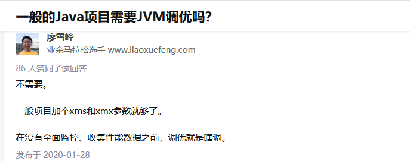

# 面试-JVM+GC

*🔗 原文链接： [⁣⁢⁣⁣⁡JVM+GC](https://my.feishu.cn/wiki/LN7vwLCa6ibFjMkb4RmcMzXwnLb)*

*⏰ 剪存时间：2026-03-13 17:30:14*

*✂️ 本文档由* [*游侠飞书剪存*](https://pwwjpto7tva.feishu.cn/wiki/space/7517832277555544092) *一键生成*

*💖 更多好物请访问* [*游侠创客*](https://uibot.cn) *微信：xuefuta*

**JVM vs JDK vs JRE**

**JVM** 是 Java 代码的 **运行环境** ，负责加载、解释、编译和执行 Java 字节码。

**JRE** = **JVM + Java API** ，用于运行 Java 程序。

**JDK** = **JRE + 开发工具** ，用于编写和编译 Java 代码。

**JVM**

**JVM主要组件**

JVM 是 Java 程序运行的执行环境，负责将字节码转换为机器指令，管理内存、垃圾回收等核心功能。

JVM（Java 虚拟机）负责 Java 代码的执行，主要组件

**类加载器** （ClassLoader）：加载 .class 文件。

**运行时数据区** ：包括堆（Heap）、方法区（Metaspace）、栈（Stack）等。

**执行引擎** ：解释执行或 JIT 编译。

**GC（垃圾回收）** ：管理对象生命周期，回收无用对象。

**JVM内存结构🟢**

**JVM在运行Java程序时，将内存划分为若干区域，每个区域有不同作用：**

<table>
<colgroup>
<col style="width: 100%" />
</colgroup>
<tbody>
<tr class="odd">
<td>Plaintext 
┌───────────────────┐ 
│ 方法区（元空间） │ ← 存储类信息、常量池 
├───────────────────┤ 
│ 堆（Heap） │ ← 存储对象实例（新生代 + 老年代） 
├───────────────────┤ 
│ 线程 1 ──────────────┐ 
│ │ JVM 栈（栈帧） │ ← 方法调用栈 
│ │ 本地方法栈（JNI） │ 
│ │ 程序计数器（PC） │ 
│ └───────────────────┘ 
│ 线程 2 ... 
└───────────────────┘ 
 
线程私有部分： 程序计数器， 虚拟机栈， 本地方法栈 
 
线程共享的： 堆， 方法区以及直接内存</td>
</tr>
</tbody>
</table>

**程序计数器（PC）**

每个线程独有

保存当前线程执行的字节码地址

用于线程切换后恢复执行状态

**Java虚拟机栈（Java Stack）**

每个线程独有

存储方法调用的局部变量、操作数栈、动态链接和返回地址

生命周期：方法调用开始创建，结束销毁

典型异常： StackOverflowError

**本地方法栈（Native Stack）**

支持本地方法（JNI）

类似Java栈，但用于本地方法调用

**堆（Heap）**

所有线程共享

存放对象实例和数组

**垃圾回收器（GC）管理**

通过 -Xms和 -Xmx 参数调节。

-Xms ：初始堆大小（如 -Xms256m ）。

-Xmx ：最大堆大小（如 -Xmx2g ）。

又可划分为：

新生代（Young Generation）：Eden + Survivor0 + Survivor1

老年代（Old Generation）

元空间（Metaspace，JDK8后替代永久代）

**方法区（Method Area）**

所有线程共享

存储类信息、常量、静态变量、JIT编译后的代码

JDK8之后称为 **Metaspace** （不在虚拟机内存中，由本地内存管理）

**Q：方法区是否属于堆？**

**规范角度** ：方法区是独立的运行时数据区，不属于堆。

**实现角度** ：在 JDK 8 前，方法区（永久代）是堆的一部分；JDK 8+ 的元空间使用本地内存，与堆分离。

**Q：直接内存如何影响 OOM？**

直接内存溢出时抛出 OutOfMemoryError ，但不受 -Xmx 限制，需通过 -XX:MaxDirectMemorySize 调节。

**Q：一个类的方法存在哪？**

**方法区（Metaspace）** ：存储类的字节码、方法、静态变量等。

**堆（Heap）** ：存储对象实例（方法的 this 引用）。

**栈（Stack）** ：存储方法执行时的局部变量和操作数栈。

**本地方法栈** ：存储 native 方法调用信息。

**JVM核心功能**

**内存管理** ：自动分配/回收堆内存（GC）。

**字节码执行** ：解释执行或编译为机器码。

**多线程支持** ：通过线程调度管理并发。

**JVM问题与调优**

**OOM 排查步骤**

定位 OOM 区域：

**堆内存溢出** ： java.lang.OutOfMemoryError: Java heap space 。

**方法区溢出** ： java.lang.OutOfMemoryError: Metaspace 。

**(1) 堆内存溢出（OOM）**

**原因** ：对象过多或内存泄漏（如未关闭数据库连接）。

**排查工具** ：

jmap -heap \<PID\> 查看堆内存分布。

jvisualvm 或 MAT 分析堆转储（Heap Dump）。

**调优** ：增大 -Xmx ，优化代码避免内存泄漏。

**(2) 栈溢出（StackOverflowError）**

**原因** ：递归调用过深或线程栈设置过小。

**排查** ：检查代码逻辑（如递归终止条件）。

**调优** ：增大 -Xss （如 -Xss2M ）。

**(3) 方法区溢出（Metaspace OOM）**

检查动态类生成（如反射、CGLIB）、未卸载的类加载器

**原因** ：动态生成类过多（如反射、CGLIB 代理）。

**调优** ：增大 -XX:MaxMetaspaceSize ，优化类加载逻辑

**new创建对象过程🟢**

**类加载** ：通过类加载器加载类的 .class 文件。

**内存分配** ：通过 new 关键字分配堆内存。

分配方式取决于 Java 堆是否规整（由垃圾收集器是否带有 **压缩整理** 功能决定）：

**指针碰撞** ：堆内存规整时，使用一个指针作为分界点，分配内存只是将指针向空闲空间方向移动一段与对象大小相等的距离。 **简单高效** 。

**空闲列表** ：堆内存不规整时，VM 需要维护一个列表记录哪些内存块可用。分配时从列表中找到一块足够大的空间划分给对象，并更新列表记录。

**调用构造函数** ：初始化对象的实例变量，执行构造函数

**对象实例化完成** ：对象被创建并可以通过引用访问。

**垃圾回收** ：没有引用的对象会被垃圾回收。

**运行时数据区视角** ：

new Object() 在 **堆** 中分配内存。

对象的类元数据（如 Object.class ）存储在 **方法区** 。

变量 obj 的引用存储在 **虚拟机栈** 的局部变量表中。

**内存结构视角** ：

若对象较小且为新创建，可能分配到 **Eden 区** 。

若类 Object 未被加载，其元数据会进入 **元空间** （JDK 8+）。

若使用 ByteBuffer.allocateDirect() ，内存来自 **直接内存** 。

**Java创建对象方式**

**使用new关键字** ：通过new关键字Java来创建对象。

**使用Class类的newInstance()方法** ：通过反射机制，可以使用Class类的newInstance()方法创建对象。

**使用反序列化** ：通过将对象序列化到文件或流中，然后再进行反序列化来创建对象。

**内存分配的两种方式 & 并发解决方案**

**两种方式** ：

**指针碰撞 (Bump the Pointer)** ：适用于堆内存 **规整** 的情况（如使用 Serial, ParNew 等带压缩功能的收集器）。

**空闲列表 (Free List)** ：适用于堆内存 **不规整** 的情况（如使用 CMS 这种基于标记-清除算法的收集器）。

**并发解决方案** ：分配内存是一个非常频繁的操作，在并发环境下存在线程安全问题（如两个线程可能拿到同一块内存）。

**CAS + 失败重试** ：JVM 采用 **CAS (Compare And Swap)** 配上 **失败重试** 的方式保证更新指针操作的原子性。

**TLAB (Thread-Local Allocation Buffer)** ：为了提升效率，每个线程在 Java 堆中预先分配一小块私有内存，称为本地线程分配缓冲。对象优先在 TLAB 中分配， **因为这是线程私有的，所以不需要加锁** 。只有当 TLAB 用完并分配新的 TLAB 时，才需要同步锁定。 **“线程私有分配无竞争，公共分配用CAS”** 。

**JVM 启动参数配置**

**关键参数**

**堆内存** ： -Xms （初始堆）、 -Xmx （最大堆），建议设为相同值（如 -Xms4g -Xmx4g ）。

**年轻代** ： -XX:NewRatio=2 （年轻代与老年代比例 1:2）， -XX:SurvivorRatio=8 （Eden 与 Survivor 比例 8:1:1）。

**垃圾回收器** ： -XX:+UseG1GC （G1 回收器）、 -XX:+UseConcMarkSweepGC （CMS 回收器）。

**年轻代大小的影响**

**过小** ：频繁 Minor GC，增加停顿时间。

**过大** ：单次 Minor GC 时间变长，老年代可能提前触发 Full GC。

**类加载**

**类加载过程🟢**

类加载过程是 JVM 将类从 **磁盘** 加载到 **内存** 的过程，主要包含以下阶段：

**加载类** ：类加载器将类的 **字节码** 文件从 **磁盘** 读取到内存，并生成 Class 对象。

**连接类** ：将类的符号引用转换为直接引用的过程

**验证** ：确保 .class 文件格式正确，并且符合 Java 语言规范。

**准备** ：为类的静态变量分配内存，并初始化默认值。

**解析** ：将类中的符号引用（如方法和字段的引用）转换为直接引用（解析为实际的内存地址或指针）。

**初始化类** ：在类加载完成后，JVM 会执行类的 **静态初始化代码** ，如静态变量的初始化、静态代码块的执行等。这个阶段是通过执行 **静态初始化块（ static** **）** 和静态变量的初始化来完成的。

✅ **JVM 类加载是懒加载的，只有使用时才会加载类** 。 ✅ **类加载器遵循 "双亲委派模型"（避免类重复加载 & 保证安全性）** 。

**类加载器种类**

Java 类加载器负责将 .class 文件加载到 JVM 内存，主要分为以下几种：

**启动类加载器** ：最顶层的类加载器，加载ava的核心类库，

**扩展类加载器** ：负责加载 Java 扩展类库，即 lib/ext/ 目录下的 .jar 文件。

**应用类加载器** ：当前应用路径下的的类和jar包

**自定义类加载器** ：开发者自定义的类加载器

**双亲委派机制🟢**

**双亲委派机制** 是 Java 类加载器的默认机制

加载器层级：

**启动类加载器（Bootstrap）** ：加载 JRE/lib 核心类。

**扩展类加载器（Extension）** ：加载 JRE/lib/ext 扩展类。

**应用类加载器（Application）** ：加载用户类路径（ClassPath）的类。

**自定义加载器** ：用户继承 ClassLoader 实现。

✅核心思想：

当一个类加载器加载某个类时，会先委托它的父类加载器尝试加载，

只有在父类加载器找不到该类时，才会由当前类加载器自己加载。

**✅ 作用**

避免类的 **重复加载** （防止 ClassCastException ）。

**保证安全性** ，防止核心类库被篡改（如 java.lang.String 不能被用户自定义覆盖）。

**打破双亲委派机制**

**自定义类加载器加载特定类** （如 Java 运行时库中已存在的类）

\*\*解决：最直接的方式是自定义类加载器，重写 loadClass() 方法（不推荐）\*\*让它优先加载自己的类，而不是先委托父类加载器。

使用线程上下文类加载器（ Thread.currentThread().getContextClassLoader() ）

**GC**

**Java垃圾回收🟢**

**垃圾回收** 是 **JVM 自动管理内存的一种机制** 。

作用：自动回收 **不再使用的对象** ，释放堆内存，避免手动释放带来的错误。

在 Java 中，程序员无需手动释放对象，JVM 的 GC 会负责回收不可达对象。

**对象生命周期**

JVM 对象从创建到销毁，大致经历以下阶段：

**创建** ：对象分配在 **堆内存（Heap）** 。

**使用** ：程序引用对象。

**不可达（Unreachable）** ：对象没有任何引用指向它。

**回收** ：GC 检测不可达对象并释放内存。

**垃圾回收的核心思想**

**可达性分析**

判断对象是否仍被引用：

**可达对象** ：从 GC Roots 可以追溯到的对象。

**不可达对象** ：无法从 GC Roots 到达，成为垃圾。

**GC Roots常见对象** ：

栈上的局部变量

方法区静态变量

JNI引用对象

活跃线程

**分代回收思想**

分代算法根据对象的存活周期将内存划分为不同的代，采用不同的垃圾回收算法。

**分代收集算法** ：是目前Java虚拟机普遍采用的算法，它根据 **对象的存活周期将内存分为新生代和老年代** 。

新生代对象存活时间短，采 **用复制算法** 进行垃圾回收；

老年代对象存活时间长，采用 **标记 - 整理算法** 或 **标记 - 清除算法** 进行垃圾回收。

这种分代的方式可以根据不同代的特点选择更合适的回收算法，提高垃圾回收的效率

**垃圾回收触发时机**

垃圾回收可以通过多种方式触发，具体如下：

**内存不足时** ：当JVM检测到堆内存不足，无法为新的对象分配内存时，会自动触发垃圾回收。

**手动请求** ：虽然垃圾回收是自动的，开发者可以通过调用 System.gc() 或 Runtime.getRuntime().gc() 建议 JVM 进行垃圾回收。不过这只是一个建议，并不能保证立即执行。

**JVM参数** ：启动 Java 应用时可以通过 JVM 参数来调整垃圾回收的行为，比如： -Xmx （最大堆大小）、 -Xms （初始堆大小）等。

**对象数量或内存使用达到阈值** ：垃圾收集器内部实现了一些策略，以监控对象的创建和内存使用，达到某个阈值时触发垃圾回收。

**垃圾回收算法**

**常见算法** ：常见的GC算法有标记 - 清除算法、复制算法、标记 - 整理算法和分代收集算法。

**标记-清除** ：首先标记出所有需要回收的对象，然后统一回收所有被标记的对象，但会产生内存碎片。

**复制** ：将内存分为大小相等的两块，每次只使用其中一块，当这一块内存满时，将存活的对象复制到另一块，然后清空当前块，避免了内存碎片，但会浪费一半的内存空间。用于新生代。

**标记-整理** ：标记出需要回收的对象后，将存活的对象向一端移动，然后直接清理掉端边界以外的内存，既避免了内存碎片，又不会浪费过多内存。

**分代收集** ：JVM 默认策略，针对不同代使用不同算法。

**识别垃圾方法**

垃圾回收器（GC）负责回收不再使用的对象所占用的内存。判断对象是否应该被回收，主要有以下几种算法：

**引用计数法**

**原理** ：为每个对象分配一个引用计数器，每当有一个地方引用它时，计数器加1；当引用失效时，计数器减1。当计数器为0时，表示对象不再被任何变量引用，可以被回收。

**缺点** ：不能解决循环引用的问题，即两个对象相互引用，但不再被其他任何对象引用，这时引用计数器不会为0，导致对象无法被回收。

**可达性分析算法**

在面试时，建议这样回答：

*"JVM 主要通过 **GC Roots 可达性分析** 来判断对象是否存活，如果一个对象不可达，JVM **会标记两次** 才真正回收。同时，Java 提供四种引用类型（强、软、弱、虚），其中 **强引用的对象永不回收，软引用在内存不足时回收，弱引用在下一次 GC 时回收，虚引用仅用于检测对象回收情况** 。"*

**原理** ：（ **Java虚拟机主要采用此算法** ）

从一组称为\*\*GC Roots（垃圾收集根）\*\*的对象出发，向下追溯它们引用的对象，以及这些对象引用的其他对象，以此类推。

如果一个对象到GC Roots没有任何引用链相连（即从GC Roots到这个对象不可达），那么这个对象就被认为是不可达的，可以被回收。

**GC Roots对象包括：**

**当前栈帧中方法的本地变量表** （局部变量，方法中使用的对象）

**方法区中静态变量引用的对象** （存在于 Method Area ）

**运行时常量池中的引用** （比如 String 常量池）

**本地方法栈中JNI（Native 方法）引用的对象** （如 System.gc() 触发的 finalize() ）

可达性分析时使用 **三色标记法** 对对象分类：

**白色：未被标记的对象（默认状态），GC 认为是** 垃圾\*\*。

**灰色：对象** 可达，但部分子对象未扫描\*\*，暂时存活。

**黑色** ：对象 **自身及其子对象都已标记** ，存活对象。

**特殊情况下的 GC 处理** ：Java 有四种引用类型，影响对象是否会被 GC：

\*\*强引用：最普通的引用，如 Object obj = new Object(); ，\*\*GC 绝不会回收。

**软引用** ：如果内存不足，GC 才会回收

**弱引用** ：下一次 GC 一定会回收（ WeakReference ）。

\*\*虚引用：\*\*仅用于检测对象何时被回收，不会影响 GC。

**强引用和弱引用**

**1. 强引用**

**定义** ：默认的引用方式，例如 Object obj = new Object(); 。

**特点** ：只要强引用存在，GC 永远不会回收该对象。

**问题** ：如果对象不再使用，但依然被强引用指着，就会导致 **内存泄漏** 。

**2. 弱引用**

**定义** ：通过 WeakReference 创建的引用，例如：

<table>
<colgroup>
<col style="width: 100%" />
</colgroup>
<tbody>
<tr class="odd">
<td>Plaintext 
WeakReference&lt;Object&gt; weakRef = new WeakReference&lt;&gt;(new Object());</td>
</tr>
</tbody>
</table>

**特点** ：

弱引用不会阻止 GC 回收对象。

一旦发生 GC，即使内存充足，弱引用对象也会被回收。

**应用** ：

**缓存** （如 WeakHashMap ）：缓存对象不会长期占用内存，GC 时会自动释放。

避免内存泄漏：当对象生命周期不确定时，可以用弱引用来避免对象被错误持有。

**内存泄漏与引用关系**

**内存泄漏定义** ：对象已经不再使用，但仍然被引用，导致 GC 无法回收。

**强引用场景的内存泄漏** ：

静态集合（如 static List ）不断添加对象但未清理；

长生命周期的对象持有短生命周期对象的引用（比如单例类持有 Activity 的引用）。

**弱引用的解决思路** ：

用弱引用包装那些“不确定是否长期存在”的对象，防止误引用。

**GC Root🟢**

在 JVM 的垃圾回收机制中， **GC Root 是可达性分析的起点** 。从这些根节点出发，JVM 判断对象是否仍然可达，进而决定是否回收。

可作为 GC Roots 的对象：

**虚拟机栈（栈帧中的本地变量表）中引用的对象** ：例如，在方法中创建的对象，被方法的局部变量引用。

例子： **虚拟机栈中引用的对象** ，在 main 方法中， obj 是局部变量，存于虚拟机栈中，它所引用的 MyClass 实例就是通过虚拟机栈中引用可达的对象

**方法区中类静态属性引用的对象** ：类的静态变量引用的对象。

**方法区中常量引用的对象** ：例如，字符串常量池中的字符串对象。

方法区中常量引用的对象， CONSTANT 是一个常量，它引用的字符串对象 "Hello, World" 存于方法区的常量池中，通过常量引用可达。

**本地方法栈中 JNI（即一般说的 Native 方法）引用的对象** ：本地方法中引用的对象。

**Q：GC Root 是否会被回收？**

**GC Root 本身不会回收** ：GC Root 是可达性分析的起点（如栈帧中的局部变量、静态变量）。

**GC Root 引用的对象** ：

若对象被 GC Root 直接或间接引用，则不会被回收；

若失去引用则会被回收。

==GC Root 本身永远存活，而对象的存活状态取决于它是否 **直接或间接被 GC Root 引用** 。==

**GC 过程**

**分代收集**

JVM 根据 **对象存活周期的不同** 将内存分为几块，主要分为 **年轻代 GC（Minor GC）和老年代 GC（Full GC）** 。 **年轻代** 每次收集都会有大量对象死去采用 **复制算法** ，清理 Eden 存活对象到 Survivor，并晋升到老年代。 **老年代** 老年代的对象存活几率是比较高的采用 **标记-清除 或 标记-整理** ，但 Full GC 可能会导致 STW。

**垃圾回收（GC）的触发时机和方式** 取决于 **内存区域的占用情况** 、 **垃圾回收器的类型** 以及 **JVM 参数配置** 。

|                     |                                                                              |                           |
|---------------------|------------------------------------------------------------------------------|---------------------------|
| **内存区域**        | **触发条件**                                                                 | **GC 类型**               |
| **新生代（Young）** | Eden 区空间不足，无法分配新对象                                              | **Minor GC** （Young GC） |
| **老年代（Old）**   | 老年代空间不足（如晋升失败或大对象分配）                                     | **Major GC** （Old GC）   |
| **整个堆**          | 元空间/永久代不足、System.gc() 调用、堆内存不足（Minor GC 后仍无法满足分配） | **Full GC**               |

**GC 触发过程**

1️⃣ **年轻代（Young GC）触发条件** ：

比如说，新创建的对象一般是分配在 Eden 区，那当 Eden 区快满了，JVM 就会触发一次 **Minor GC（Young GC）** 。这个时候，Eden 里的对象会被复制到 Survivor 区，或者如果对象存活时间足够长，就会晋升到老年代。

2️⃣ **老年代（Full GC / Major GC）触发条件** ：

如果老年代空间不够了，比如说有大量的晋升对象、或者手动调用 System.gc() ，那就可能触发 **Full GC** 。Full GC 会清理整个堆，包括年轻代和老年代，代价比较大，也会 **Stop The World** ，所以是比较敏感的。

**三种GC**

|              |                                |                     |                            |
|--------------|--------------------------------|---------------------|----------------------------|
| 类型         | 回收区域                       | 是否 Stop The World | 说明                       |
| **Minor GC** | 新生代（Young）                | 是                  | 发生频率高，速度快         |
| **Major GC** | 老年代（Old）                  | 是                  | 回收老年代，频率低但耗时长 |
| **Full GC**  | 整个堆（新生代+老年代+方法区） | 是                  | 最重的操作，暂停时间最长   |

**MinorGC🟢**

年轻代的GC\*\*，处理的是 **刚创建没多久的对象** ，频率高但处理得也快，采用 **"复制算法"**

**作用** ：回收 **新创建、生命周期短的对象**

**回收算法** ： **复制算法（Copying）**

**特点** ：

频率高，但执行快

GC停顿时间短（Stop-the-World

**触发条件：Eden 区满** → 触发 Minor GC

**执行流程**

**标记存活对象**

从 **GC Roots** 出发进行可达性分析

包括：栈上局部变量、方法区静态变量、活跃线程

标记 Eden + 当前活动 Survivor 区（例如 S0）中的存活对象

**复制存活对象**

将存活对象复制到 **空闲 Survivor 区** （例如 S1）

清空 Eden 和原 Survivor 区（S0）

每个对象会记录 **年龄（Age）** ，即经历过多少次 Minor GC

**对象晋升老年代（Tenuring）**

当对象在 Survivor 区存活次数达到阈值（默认 15，可通过 -XX:MaxTenuringThreshold 设置）

或 Survivor 区空间不足，存活对象被 **晋升到老年代**

**性能影响**

**暂停时间（Stop-The-World）** ：Minor GC 会暂停所有应用线程，时间通常较短（毫秒级）。

**频率与吞吐量** ：若对象分配速率过快，频繁触发 Minor GC 会增加总体暂停时间，降低系统吞吐量

**问题 1：Minor GC 频率过高**  
**原因** ：Eden 区过小或对象分配速率过快。 **解决** ：增大 -Xmn 或优化代码减少对象创建（如重用对象、避免在循环中创建临时对象）。

**问题 2：对象过早晋升老年代**  
**原因** ：Survivor 区空间不足或 MaxTenuringThreshold 设置过小。 **解决** ：增大 Survivor 区（调整 -XX:SurvivorRatio ）或提高年龄阈值。

**MajorGC🟢**

**Major GC** ：专指清理 **老年代** 的垃圾回收，回收长生命周期对象\*\*通常采用 **"标记-清除" 或 "标记-整理"** ：

**触发条件：** ： **老年代空间不足时** 触发（如对象晋升老年代失败）。

**Major GC（以 CMS 回收器为例）**

**初始标记（STW）** ：标记 GC Roots 直接关联的对象。

**并发标记** ：与用户线程并发，标记所有存活对象。

**重新标记（STW）** ：修正并发标记期间变动的对象。

**并发清除** ：删除垃圾对象，回收空间。

**Full GC🟢**

Full GC清理 **整个堆内存（包括年轻代、老年代** ）以及方法区的垃圾回收。

**触发条件：**

\- 老年代空间不足且 Major GC 后仍不足。 - 方法区空间不足。 - 主动调用 System.gc() （不推荐）

**Full GC（以 G1 回收器为例）**

**全局标记** ：标记整个堆的存活对象。

**整理阶段** （Stop-The-World）：移动对象，消除内存碎片。

**清理方法区** ：回收未使用的类元数据

**GC调优**

**启用 G1 回收器** （ -XX:+UseG1GC ）：针对老年代优化，降低 Full GC 频率

**新生代调优：延长对象在年轻代的存活时间**

**增大年轻代空间** ： 调整新生代与老年代的比例（如 -XX:NewRatio=2 ，年轻代:老年代=1:2）。

**优化 Survivor 区** ： 增大 Survivor 区容量（ -XX:SurvivorRatio=8 ，Eden:S0:S1=8:1:1），避免对象因 Survivor 空间不足直接进入老年代。

**老年代调优：**

避免频繁 Full GC：减少大对象直接进入老年代（ -XX:PretenureSizeThreshold=1m ）

**垃圾回收器**

**Serial 回收器**

**原理** ：单线程串行回收，年轻代使用 **标记-复制算法** ，老年代使用 **标记-整理算法** 。优点是简单高效；

**Parallel Scavenge（吞吐量优先回收器）**

**原理** ：多线程并行回收，年轻代使用 **标记-复制算法** ，老年代使用 **标记-整理算法** 。

**CMS回收器**

\*\*原理：\*\*老年代回收器，使用 标记-清除算法，分为四阶段：

初始标记（STW）→ 2. 并发标记 → 3. 重新标记（STW）→ 4. 并发清除。

**目标** ：最小化停顿时间。

**G1回收器**

**原理** ：将堆划分为多个 **Region** ，优先回收垃圾比例高的区域（Garbage First），使用 **标记-整理算法** 。

G1回收的范围是 **整个Java堆(包括新生代，老年代)**

**阶段** ：年轻代 GC → 并发标记 → 混合 GC（回收部分老年代 Region）→ Full GC（备用）。

**ZGC**

**原理** ：基于 **染色指针** 和 **读屏障** ，实现并发标记与整理，停顿时间不超过 10ms。

**目标** ：亚毫秒级延迟，支持 TB 级堆内存。

|            |                                                            |
|------------|------------------------------------------------------------|
| **回收器** | **特点**                                                   |
| **CMS**    | 标记-清除算法，低延迟，但内存碎片化。适合中小堆（4-6GB）。 |
| **G1**     | 分区回收，可预测停顿时间，适合大堆（6GB+）。               |

**CMS 收集器**

**特点** ：

并发收集器： **GC线程与用户线程同时工作**

关注 **低延迟** ，适合响应时间敏感应用

回收老年代对象

缺点： **容易产生内存碎片**

**CMS GC流程**

回收过程分 4 步：

**初始标记（Initial Mark）** ：STW， **标记 GC Roots 直接可达的对象** ，速度快。

**并发标记（Concurrent Mark）** ：GC线程与用户线程同时运行，标记整个老年代的可达对象

**重新标记（Remark）** ：STW，修正并发标记阶段用户线程新增或修改的对象引用，停顿时间相对较短。

**并发清除（Concurrent Sweep）** ：清理不可达对象， **可能产生内存碎片** ，有时需要 Full GC 做内存整理

优点：低延迟（适合对响应时间敏感的应用）。 缺点：会产生 **内存碎片** 。

**CMS适用**

**低延迟需求** ：适用于对停顿时间要求敏感的应用程序。

**老生代收集** ：主要针对老年代的垃圾回收。

**碎片化管理** ： **容易出现内存碎片，可能需要定期进行Full GC来压缩内存空间** 。

**CMS解决标记清除的内存碎片问题**

**主要方法** ： CMS 本身是标记-清除算法 → 碎片不可避免。JVM 提供了 **内存压缩（Compaction）** 的选项，通常在 Full GC 时使用。

**参数** ： -XX:+UseCMSCompactAtFullCollection ：Full GC 后做一次压缩。 -XX:CMSFullGCsBeforeCompaction ：多少次 Full GC 之后再压缩一次。

代价：压缩时需要 **STW** ，会影响低延迟特性。

**G1收集器**

G1则是面向大堆内存，可预测停顿时间,回收的范围是非常快

**核心思想** ：将Java堆 **划分为多个大小相等的独立区域（Region）** ，不再是传统的物理连续的新生代、老年代。

G1跟踪各个Region里面的垃圾堆积的“价值”大小，每次根据允许的收集时间，优先回收价值最大的Region。

**判断哪个 Region 是最有价值的？**

G1 的名字 **Garbage First** 就是指它会优先回收 **回收收益最大** 的 Region。

判断标准：

每个 Region 会统计 **回收成本** 和 **可回收空间大小** 。

JVM 会计算一个性价比：性价比=可回收空间大小/回收成本性价比

**运作过程** ：

**年轻代GC (Young GC)** ：Eden区Region用尽时，G1会启动一次年轻代GC，采用复制算法，将Eden和Survivor区存活的对象拷贝到新的Survivor区或老年代Region。

**并发标记周期 (Concurrent Marking Cycle)** ：

**初始标记** ：STW，仅标记GC Roots能直接关联到的对象。

**并发标记** ：与用户线程并发执行，从GC Roots开始进行可达性分析。

**最终标记** ：STW，处理并发标记阶段产生的少量变动的记录。

**筛选回收** ：STW，根据用户期望的停顿时间，来制定回收计划，选择多个Region构成回收集，将其中存活的对象复制到空的Region中，然后清空整个旧Region。

**特点** ：

**并发与并行** ：充分利用多核CPU优势，缩短STW时间。

**分代收集** ：仍然区分分代概念，但物理上不隔离。

**空间整合** ：整体看是基于“标记-整理”算法，局部（两个Region之间）看是基于“复制”算法，都不会产生内存碎片。

**可预测的停顿** ：能建立可预测的停顿时间模型，允许使用者指定在M毫秒的时间片段内，消耗在垃圾收集上的时间不超过N毫秒。

**CMS 和 G1的区别🟢**

**区别一：使用的范围不一样：**

CMS收集器是老年代的收集器，可以配合新生代的Serial和ParNew收集器一起使用

G1将堆内存划分为多个 **Region** 。不再坚持分代，但逻辑上依然存在。收集范围是老年代和新生代。不需要结合其他收集器使用

**区别二：STW的时间：**

CMS收集器以 **最小的停顿时间** 为目标的收集器。

G1可以通过设置预期停顿时间（Pause Time）来控制垃圾收集时间（建立可预测的停顿时间模型）

**区别三： 垃圾碎片**

CMS收集器是使用“标记-清除”算法进行的垃圾回收，容易产生内存碎片

G1收集器使用的是“标记-整理”算法，进行了空间整合，不会产生空间碎片

**区别四： 垃圾回收的过程不一样**

CMS：初始标记（STW）→ 2. 并发标记 → 3. 重新标记（STW）→ 4. 并发清除

G1：初始标记 → 2. 并发标记 → 3. 最终标记 → 4. 筛选回收（分 Region 回收）

**GC范围**

虽然堆是 **GC的主要战场** ，但 JVM 也会对方法区进行垃圾回收。

|                                     |                        |                                                                                       |
|-------------------------------------|------------------------|---------------------------------------------------------------------------------------|
| 内存区域                            | GC目标                 | 说明                                                                                  |
| **堆（Heap）**                      | 对象实例               | 大部分对象都分配在堆上，GC回收不可达对象。新生代和老年代回收策略不同。                |
| **方法区（Method Area/Metaspace）** | 类信息、常量、静态变量 | GC回收无用常量、无用类信息等。JDK8以后方法区被 **Metaspace** 替代，回收方式略有不同。 |

💡 小结：堆GC最频繁，方法区GC较少，但仍存在垃圾回收机制

**GC参数调优 ：**

**通用** ： -Xms , -Xmx 设置堆大小； -Xmn 设置新生代大小（G1通常不设）。

**G1** ： -XX:+UseG1GC ； -XX:MaxGCPauseMillis=200 （设置期望最大停顿时间）； -XX:InitiatingHeapOccupancyPercent=45 （IHOP阈值，触发并发标记的老年代使用占比）。

**最大堆、最小堆参数设置成一样**

**为什么？** ： **避免堆内存自动扩展，从而避免Full GC带来的性能波动。**

**详细解释** ：JVM在启动时只会从操作系统申请 -Xms 大小的内存。如果运行中发现内存不足，会逐步向操作系统申请更多内存，直到达到 -Xmx 上限。这个 **扩展过程会触发Full GC** ，严重影响性能。将 -Xms 和 -Xmx 设置为相同值，就在启动时一次性申请了全部所需内存，消除了运行时动态扩展带来的性能开销，使系统运行更稳定。

**STW🟢**

**Stop The World** ：会暂停所有的用户线程，只运行 GC 的线程。

**目的** ：在回收期间保证 **对象引用关系不变化** ，防止回收时数据不一致

**基本GC触发STW**

|                        |                                        |
|------------------------|----------------------------------------|
| GC类型                 | STW说明                                |
| **Minor GC（年轻代）** | 会 STW，但停顿时间短                   |
| **Full GC / Major GC** | 会 STW，停顿时间长，回收老年代和方法区 |

**并发收集器的STW阶段**

**CMS（Concurrent Mark-Sweep）**

大部分工作并发执行（用户线程和GC线程同时运行）

**仍有两个STW阶段** ：

**Initial Mark** ：标记与GC Roots直接关联的对象

**Remark** ：重新标记在并发标记期间被修改的对象

其他阶段并发完成，减少停顿

**G1 GC**

多阶段设计：

**Initial Mark** （STW）

**Young GC** （STW）

**Mixed GC** （STW）：同时回收新生代和部分老年代

其他阶段尽量并发，缩短停顿时间

**ZGC / Shenandoah**

尽量压缩STW时间到 **毫秒级**

大部分工作都是并发完成

所以总结来说， **GC 的核心阶段，比如标记、清理前的准备阶段，基本都会 STW，只是不同 GC 策略 STW 的时间和频率不同** 。

**调优**

**JVM 调优**

**增大堆内存** ：如果 **Full GC** 或 **STW** 时间较长，考虑增加堆内存，以减少垃圾回收的次数。可以通过 -Xmx 和 -Xms 来设置。

**OOM 分析** ：

步骤：

使用 **jmap** 来获取 **Heap Dump** （堆转储）文件 jmap -dump:format=b,file=heap.hprof \<PID\> 生成堆转储文件。

使用 MAT（Memory Analyzer Tool）分析对象引用链，查看是否存在过多的无用对象占据内存。

**案例** ：内存泄漏（如未关闭数据库连接集合）。

**CPU 飙升定位** ：

步骤：

top -H -p \<PID\> 查看高 CPU 线程。

jstack \<PID\> 抓取线程栈，比对线程 ID（需转换为 16 进制）。

**案例** ：死循环、频繁 GC。

**GC 日志分析** ：

启用 GC 日志，通过 -Xlog:gc\* 或 -XX:+PrintGCDetails 等 JVM 参数来分析垃圾回收日志。

-XX:+PrintGCDetails ：打印 GC 详情。

-Xloggc:/path/to/gc.log ：输出 GC 日志文件。

查看 **GC 停顿时间** 和 **每次回收的对象数** ，找出垃圾回收的瓶颈。

**内存溢出和内存泄漏**

**内存溢出（Out of Memory, OOM）**  
程序在申请内存时，系统没有足够的可用内存空间来满足需求，导致操作失败。例如，Java 中抛出 OutOfMemoryError 。

**内存泄漏（Memory Leak）**  
程序在运行过程中未能释放不再使用的内存，导致这部分内存被无效占用。即使对象不再需要，但由于被错误引用，垃圾回收器（GC）无法回收其内存。

**内存泄漏排查**

**内存泄漏** 是指程序中某些不再使用的对象无法被回收，导致内存无法释放，最终可能导致内存耗尽OOM。

**现象** ：应用运行一段时间后 OOM。

*例子：*

分析堆转储文件，发现某个 HashMap 持续增长。

检查代码：发现缓存未设置过期时间，导致对象无法释放。

修复：改用 WeakHashMap 或添加 LRU 淘汰策略。

**如何避免内存泄漏**

C/C++：手动管理内存，在C/C++中，内存泄漏的主要原因可能是忘记释放malloc或new分配的内存

Java、Python等有垃圾回收机制的语言在带有垃圾回收的语言中，虽然自动管理内存，但仍有内存泄漏的可能。比如，对象被无意中保留在全局作用域或长期存在的集合中，导致无法被回收。例如，Java中的静态集合类如果不断添加对象而不清理，就会造成泄漏

内存泄漏在Java中通常是因为对象虽然不再被使用，但仍然被GC Roots引用，导致无法被回收。

**静态集合类引起的内存泄漏** ：比如使用静态的HashMap、List等，这些集合的生命周期和应用程序一致，如果不断地往里面添加对象而不清理，就会导致这些对象无法被回收。

**监听器和回调** ：比如注册了监听器但没有及时注销，尤其是在使用观察者模式时，如果观察者被注册后没有移除，可能会一直持有对象的引用。

**内部类持有外部类的引用** ：比如非静态内部类隐式持有外部类的实例，如果内部类的生命周期超过了外部类，就会导致外部类无法被回收。

**缓存** ：使用缓存时如果没有设置合理的清除策略，缓存的对象可能长时间存在，导致内存泄漏。

**资源未关闭** ：比如数据库连接、文件流等资源没有正确关闭，虽然这些可能不直接导致Java堆内存泄漏，但会占用系统资源，间接影响应用性能。

**内存溢出**

**内存溢出** 是指程序试图分配超出可用内存的空间，导致程序崩溃。

根据错误信息或异常堆栈，确定是哪种内存区域溢出：

|                      |                                                  |                                        |
|----------------------|--------------------------------------------------|----------------------------------------|
| **内存区域**         | **错误信息示例**                                 | **常见原因**                           |
| **堆内存**           | java.lang.OutOfMemoryError: Java heap space      | 对象过多、内存泄漏、 -Xmx 设置过小     |
| **元空间（方法区）** | java.lang.OutOfMemoryError: Metaspace            | 动态生成类过多（如 CGLIB 代理、反射）  |
| **虚拟机栈**         | java.lang.StackOverflowError                     | 递归调用过深、线程栈设置过小（ -Xss ） |
| **直接内存**         | java.lang.OutOfMemoryError: Direct buffer memory | 未释放 DirectByteBuffer                |

**堆内存溢出**

**典型现象** ：老年代（Old Gen）持续增长，频繁 Full GC。

**排查步骤：**

分析堆转储文件，找出占用最大的对象（如缓存、集合类）。

检查代码中的集合类（如 HashMap 、 List ）是否无限增长。

确认是否存在未关闭的资源（如数据库连接、文件流）。

检查是否缓存了不应长期持有的对象（如用户会话数据）。

**解决方案：**

增大堆内存（ -Xmx ）。

优化代码：使用弱引用（ WeakReference ）、LRU 缓存策略。

修复内存泄漏：关闭资源、清理无用对象

**栈溢出**

**（StackOverflowError）**

**原因** ：递归调用过深或线程栈设置过小。

**排查** ：检查代码逻辑（如递归终止条件）。

**调优** ：增大 -Xss （如 -Xss2M ）。

**方法区溢出**

**（Metaspace OOM）**

**原因** ：动态生成类过多（如反射、CGLIB 代理）。

**调优** ：增大 -XX:MaxMetaspaceSize ，优化类加载逻辑

**Full GC原因**

\*\*1.内存泄漏 - **最常见**

**描述** ：由于代码缺陷， **本该被回收的对象被意外地“挂”在GC Roots引用链上** ，无法被回收。这些对象会持续占着老年代空间，每次Full GC后空间释放得很少，很快又被填满，再次触发Full GC。

**常见代码坑** ：

**静态集合类** （如 static Map ）不断往里put，从不remove。

**各种连接未关闭** （数据库、网络、文件流）。

**监听器未移除** 。

**ThreadLocal 使用后未调用 remove()** （尤其在线程池中）。

**2. 对象过早晋升**

**描述** ： **大量本该在年轻代就被回收的短生命周期对象，“意外”地进入了老年代** ，迅速撑爆老年代。

**原因** ：

**年轻代空间设置过小** ：导致Eden区很快被填满，Minor GC频繁，存活对象还没来得及死亡就被拷贝到Survivor区，Survivor区也很快满了，于是对象“被迫”提前晋升到老年代。

**Survivor区空间不足或动态对象年龄判定** ：Survivor区放不下Minor GC后存活的对象，

**排查方法** ：

查看GC日志，关注 **Minor GC后进入老年代的对象大小** 。如果每次Minor GC后都有大量对象晋升，则怀疑此问题。

使用 jstat -gcutil \<pid\> 1s 观察各区内存变化。

**解决** ： **调整年轻代大小** （ -Xmn ）， **调整Eden和Survivor的比例** （ -XX:SurvivorRatio=8 ），或者适当 **增大Survivor区** 。

**3.大对象（Large Object）分配**

**描述** ：创建了需要大量连续内存空间的超大对象（如大数组），这些对象会 **直接分配在老年代** （如果年轻代放不下）。如果频繁创建这样的大对象，会瞬间占满老年代，触发Full GC。

**解决** ：检查代码逻辑，避免频繁创建大对象。

**4.System.gc() 调用**

**描述** ：代码中或引用的第三方库中 **显式调用了 System.gc()** 。此调用会建议JVM进行Full GC，而很多垃圾收集器（如CMS、G1）会尊重这个建议，导致不必要的Full GC。

**Full GC排查 工具**

**查看GC日志** ：这是首要步骤。在启动参数中添加 -XX:+PrintGCDetails -XX:+PrintGCDateStamps -Xloggc:./gc.log 。关注Full GC的 **频率** 、 **持续时间** 以及每次GC后老年代的 **内存占用率** 。如果发现频繁Full GC且每次回收后内存下降不多，很可能就是 **内存泄漏** 。

**使用工具分析** ：

**jstat** ：命令行工具，实时监控GC情况。 jstat -gcutil \<pid\> 1000 每秒打印一次GC统计，观察老年代（O）使用率是否持续增长。

**jmap** ：命令行工具，用于dump堆内存。 jmap -dump:live,format=b,file=heap.hprof \<pid\> 生成堆转储文件

**Full GC调优**

要减少老年代的压力和频繁的 Full GC，需从 **对象生命周期管理** 、 **内存分配优化** 和 **JVM 参数调优** 三方面入手

**1.增大堆内存（ -Xmx4g** **）**

设置 JVM **堆内存的最大值为 4GB** （ -Xmx 表示最大堆内存）。

**2.优化代码**

避免在循环或高频调用中创建大对象（如大数组），减少大对象分配,改用流式处理或分块处理。

**大对象（如超大数组、大量 String）直接分配到老年代，容易导致 Full GC** 。

**3. 调整 GC 参数**

**选择合适的 GC算法——启用 G1 回收器** （ -XX:+UseG1GC ）：针对老年代优化， **G1** 避免 Full GC 暂停时间过长\*\*，将老年代碎片化并进行\*\*增量回收。适用于大堆（几GB以上）

**新生代调优：延长对象在年轻代的存活时间**

**增大新生代空间** ：新生代空间太小，导致对象过早晋升到老年代，加快 Full GC 触发。

调整新生代与老年代的比例（如 -XX:NewRatio=2 ，年轻代:老年代=1:2）。

**增大 Survivor 区** ：增加对象在 Survivor 存活的时间,避免对象因 Survivor 空间不足直接进入老年代。

增大 Survivor 区容量（ -XX:SurvivorRatio=8 ，Eden:S0:S1=8:1:1）

**老年代调优：**

避免频繁 Full GC：减少大对象直接进入老年代

（ -XX:PretenureSizeThreshold=1m ）。

**4.排查减少内存泄漏**

**排查老年代对象** ： 生成 **JVM 堆转储文件Heap Dump** （ jmap -dump ），用 **MAT** 分析（Heap Dump）定位内存泄漏和大对象问题。。
